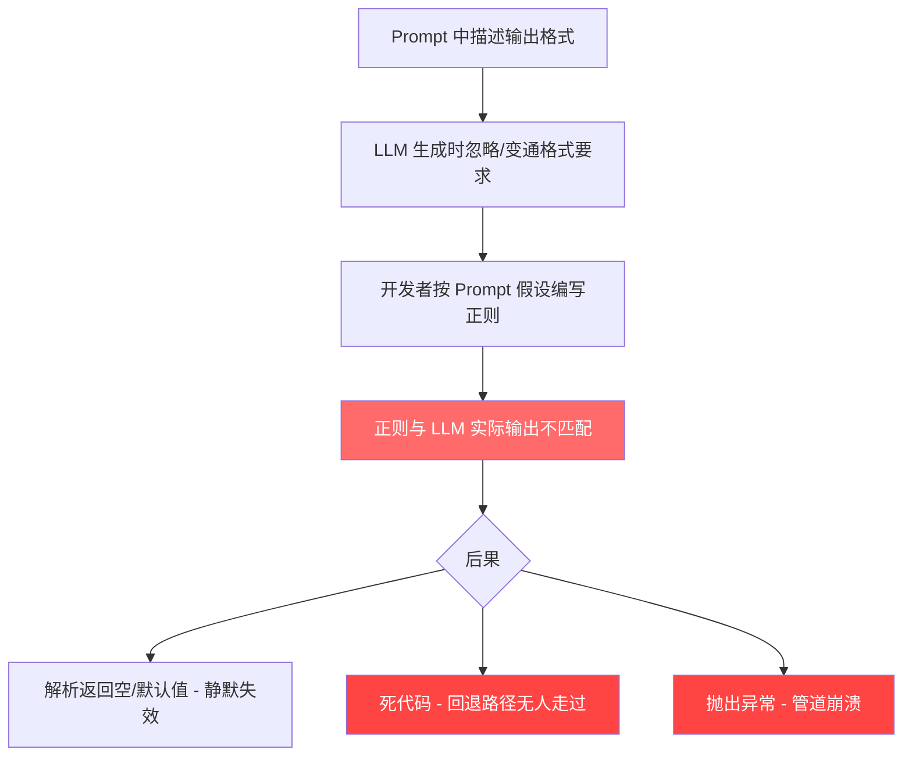
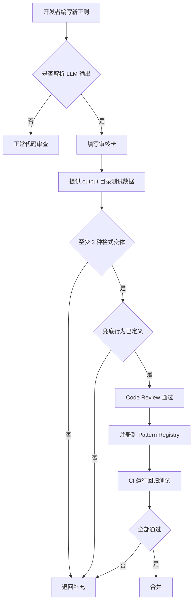

# "双重防线"系统性实施方案

> **文档版本**: v1.0  
> **创建日期**: 2026-07-10  
> **关联文档**: [`REGEX_AUDIT.md`](REGEX_AUDIT.md)、[`BUG_ANALYSIS.md`](BUG_ANALYSIS.md)、[`BUG_REPORT_FINAL.md`](BUG_REPORT_FINAL.md)  
> **状态**: 待实施

---

## 1. 问题回顾

### 1.1 本次审计发现汇总

经过全项目正则审计（[`REGEX_AUDIT.md`](REGEX_AUDIT.md)），共扫描 36 个 `.py` 文件中的 66 处 `re.*` 调用，发现：

| 风险等级 | 数量 | 含义 |
|----------|------|------|
| 🔴 高风险 | 4 | 确认与 LLM 输出不匹配或为死代码 |
| 🟡 中等风险 | 8 | 可能不匹配或存在设计缺陷 |
| 🟢 安全 | 14 | 经验证与 LLM 输出一致 |

**4 个高风险正则**：

| # | 文件 | 行号 | 问题 | 当前状态 |
|---|------|------|------|----------|
| R1 | [`voice_fingerprint.py`](voice_fingerprint.py:206) | 206-208 | Vocabulary Register 节提取 — LLM 输出的 voice.md 中**不存在**该节 | ⚠️ 正则已兼容中文标题，但目标内容不存在于输出 |
| R2 | [`core/state_manager.py`](core/state_manager.py:388) | 388-398 | Markdown 评分回退 — 评估裁判始终输出纯 JSON，Markdown 回退路径为死代码 | ❌ 未修复 |
| R3 | [`evaluation/evaluate.py`](evaluation/evaluate.py:50) | 50-52 | Markdown 代码块剥离 — 平台兼容性缺陷（`\n?` 不匹配 `\r\n`），当前为死代码 | ⚠️ 部分修复（已改为 `\r?\n?`） |
| R4 | [`foundation/update_canon.py`](foundation/update_canon.py:67) | 67 | "无新增事实"字符串匹配 — 硬编码子串匹配 | ✅ 已改为正则 `re.search(r'无(?:新增|新|可添加)事实|...')` |

**8 个中等风险正则**（详见 [`REGEX_AUDIT.md` §二](REGEX_AUDIT.md:149)）：

| # | 文件 | 行号 | 问题 |
|---|------|------|------|
| M1 | [`evaluation/evaluate.py`](evaluation/evaluate.py:216) | 216 | `[\u4e00-\u9fff]{4}` — 匹配任意 4 个连续汉字，非成语，假阳性极高 |
| M2 | [`evaluation/evaluate.py`](evaluation/evaluate.py:220) | 220 | `(?:说|道)[,，。！？\s]` — 遗漏 `说道`、`问`、`喊` 等标签，误匹配非对话用法 |
| M3 | [`evaluation/evaluate.py`](evaluation/evaluate.py:218) | 218 | 仅匹配 `——`，不匹配 `—`、`--`、`–`，与 [`voice_fingerprint.py:291`](voice_fingerprint.py:291) 不一致 |
| M4 | [`voice_fingerprint.py`](voice_fingerprint.py:217) | 217-219 | 词汇域条目解析 — 依赖上游已断裂的 Vocabulary Register 提取 |
| M5 | [`evaluation/antipatterns.py`](evaluation/antipatterns.py:188) | 188-190 | 目录式思考检测 — 仅匹配 `他|她`，遗漏角色名、`我`、`他们` |
| M6 | [`foundation/gen_canon.py`](foundation/gen_canon.py:168) | prompt | Prompt 要求 `—`（EM DASH），LLM 输出 `-`（ASCII hyphen）— 计数代码已兼容但根因未解 |
| M7 | [`voice_fingerprint.py`](voice_fingerprint.py:264) | 264-265 | 句子切分 `[。！？!?]+` — 不包括省略号 `……`，引号内句号导致错误切分 |
| M8 | [`foundation/gen_outline.py`](foundation/gen_outline.py:179) | 179-180 | 卷边界检测 — 中文数字仅列到 `十`，不匹配 `卷一：`、`第一卷` 等表述 |

### 1.2 BUG 5 的解析崩溃

[`BUG_ANALYSIS.md` §BUG 5](BUG_ANALYSIS.md:260) 揭示了一个关键问题：[`parse_score()`](core/state_manager.py:360) 的所有解析策略失败后**抛出 `ValueError`**，导致管道崩溃。这是"正则不匹配导致硬失败"的典型案例，也是本次双重防线方案的核心驱动因素。

### 1.3 共同根因模式



**三类根因**：

| 类别 | 描述 | 涉及正则数 | 典型例 |
|------|------|------------|--------|
| **Prompt-LLM 格式偏差** | Prompt 要求格式 A，LLM 输出格式 B | 5 | R1（voice.md 不含 Vocabulary Register）、R2（LLM 用 JSON 而非 Markdown）、M6（EM DASH vs hyphen） |
| **正则写死单一格式** | 正则只匹配一种字符表示/格式变体 | 3 | M3（仅匹配 `——`）、M5（仅匹配 `他\|她`）、M7（仅匹配中英混合标点） |
| **回退路径未测试** | Markdown fallback 代码无对应 LLM 输出验证 | 4 | R2（Markdown 评分回退）、R3（代码块剥离）、M4（词汇域条目解析）、M8（卷边界检测） |

---

## 2. 架构总览：双重防线

```
LLM 原始文本输出
   │
   ├─ 第一道防线：Pattern Registry（预防层）
   │   │
   │   ├─ 所有解析 LLM 输出的正则统一注册到 Registry
   │   ├─ 每个 Pattern 携带：多种格式变体的正则列表（按优先级排序）
   │   ├─ 每个 Pattern 附带：真实 LLM 输出测试数据引用
   │   ├─ 每个 Pattern 附带：兜底行为声明
   │   └─ 新增/修改正则需通过格式审计卡
   │
   ├─ 第一道防线通过 → 返回匹配结果 ✓
   │
   └─ 第一道防线未命中 ↓
        │
        ├─ 第二道防线：兜底降级（容错层）
        │   │
        │   ├─ 记录 WARNING 级别日志（含原始输出片段）
        │   ├─ 尝试宽松解析（通用模式，不依赖具体格式）
        │   ├─ 返回保守默认值（让管道继续运行）
        │   └─ 绝不抛出异常终止管道
        │
        └─ 管道继续运行 ✓
```

---

## 3. 第一道防线：Pattern Registry 设计

### 3.1 模块位置与文件结构

```
core/
├── pattern_registry.py          # Pattern Registry 核心模块（新建）
│   ├── class ParsedResult       # 解析结果数据类
│   ├── class RegisteredPattern   # 注册模式数据类
│   ├── class PatternRegistry     # Registry 管理器
│   ├── function registry.match() # 统一调用入口
│   └── function registry.register() # 注册新 Pattern
│
└── tests/
    └── test_pattern_registry.py  # Registry 单元测试（新建）
```

### 3.2 核心数据结构

```python
# core/pattern_registry.py

from dataclasses import dataclass, field
from typing import Callable, Optional, Any
import re

@dataclass
class ParsedResult:
    """统一的解析返回类型。"""
    value: Any                    # 解析出的值
    matched_by: str               # 命中的变体名称
    confidence: float = 1.0       # 匹配置信度 0.0~1.0

@dataclass
class RegisteredPattern:
    """一个注册到 Registry 的解析模式。"""
    name: str                              # 唯一标识符，如 "score.overall"
    description: str                       # 人类可读描述
    # 变体列表：按优先级排序，每个变体是一个 (variant_name, pattern_or_callable)
    variants: list[tuple[str, re.Pattern | Callable]]
    # 兜底行为：当所有变体都未命中时
    fallback: Callable[[str], ParsedResult]
    # 测试数据路径列表（相对于 output/ 目录）
    test_data_refs: list[str] = field(default_factory=list)
    # 来源：原正则所在的文件名:行号
    source: str = ""
    # 已知风险说明
    known_risks: str = ""

class PatternRegistry:
    """Pattern Registry — 单一事实来源。

    使用方式：
        registry = PatternRegistry()
        registry.register(...)
        result = registry.match("score.overall", llm_text)
    """
    def __init__(self):
        self._patterns: dict[str, RegisteredPattern] = {}

    def register(self, pattern: RegisteredPattern) -> None:
        """注册一个 Pattern。同名 Pattern 会覆盖旧注册。"""
        ...

    def match(self, name: str, text: str) -> ParsedResult:
        """按优先级尝试所有变体，命中则返回；全部未命中则触发兜底。"""
        ...
```

### 3.3 统一调用 API

所有原来直接调用 `re.search()` / `re.findall()` 解析 LLM 输出的位置，改为：

```python
# 旧方式（分散在各文件中）：
m = re.search(r'...', text)
if m:
    score = float(m.group(1))
else:
    raise ValueError("解析失败")

# 新方式（通过 Registry）：
from core.pattern_registry import registry
result = registry.match("score.overall", text)
score = result.value  # 永远不会抛异常
```

### 3.4 设计原则

1. **多格式变体优先**：每个 Pattern 必须至少支持 2 种 LLM 可能输出的格式变体，按优先级排列
2. **测试数据强制附带**：每个 Pattern 注册时必须指定至少一个 `output/` 目录下的真实 LLM 输出文件作为验证数据源
3. **兜底行为显式声明**：`fallback` 必须是明确的、可预期的行为（返回默认值 / 宽松匹配 / sentinel），不能是隐式的 `None`
4. **日志自动记录**：`registry.match()` 在未命中任何变体时自动记录 `WARNING` 日志，包含 Pattern 名称、原始输出前 200 字符、调用的变体列表
5. **渐进迁移**：旧代码可以与 Registry 并存，逐步迁移

---

## 4. 迁移清单与优先级

### 4.1 完整迁移清单

下表列出所有应迁移到 Registry 的正则，按优先级排序：

#### Phase 1 — 🔴 高风险（必须首先迁移）

| 优先级 | Pattern 名称 | 来源文件:行号 | 当前问题 | 迁移后变体设计 |
|--------|-------------|---------------|----------|---------------|
| **P0** | `score.parse` | [`core/state_manager.py:360-407`](core/state_manager.py:360) | 解析失败抛 `ValueError` → 管道崩溃 | 变体1: JSON `"overall_score"` 字段提取; 变体2: JSON `"score"` 字段提取; 变体3: 从子维度计算平均值; 变体4: 通用 `数字/10` 模式; 兜底: 返回 `(0.0, confidence=0.0)` |
| **P0** | `canon.no_new_facts` | [`foundation/update_canon.py:67`](foundation/update_canon.py:67) | 已改善但仍脆弱 | 变体1: 当前正则 `无(?:新增\|新\|可添加)事实\|...`; 变体2: `no\s*new\s*facts?`; 变体3: 返回的条目数为 0 即视为无新增; 兜底: 假定有新增（偏安全） |
| **P1** | `voice.vocab_section` | [`voice_fingerprint.py:206-208`](voice_fingerprint.py:206) | LLM 输出中不存在目标节 | 变体1: 当前已兼容的中英文标题; 变体2: 从 Part 2 的任意 `###` 节提取（不依赖特定标题）; 变体3: 全文搜索 `**关键词**` / `**vocabulary**` 标记; 兜底: 返回空列表 + 记录 INFO 日志 |
| **P1** | `codeblock.strip` | [`evaluation/evaluate.py:50-52`](evaluation/evaluate.py:50) | `\n?` 平台兼容性 | 变体1: `^```[\w-]*\s*\r?\n?`; 变体2: 仅 `text.strip('`').strip()`; 兜底: 原样返回文本 |

#### Phase 2 — 🟡 中等风险

| 优先级 | Pattern 名称 | 来源文件:行号 | 当前问题 | 迁移后变体设计 |
|--------|-------------|---------------|----------|---------------|
| **P2** | `slop.four_char` | [`evaluation/evaluate.py:216`](evaluation/evaluate.py:216) | 匹配任意 4 汉字，假阳性极高 | 变体1: 保留当前正则作为宽松模式; 变体2: 常见四字成语/形容词白名单匹配; 变体3: 连续多次出现（≥3次相邻）才计数; 兜底: 密度=0 |
| **P2** | `slop.dialog_tag` | [`evaluation/evaluate.py:220`](evaluation/evaluate.py:220) | 遗漏大量对话标签 | 变体1: 扩展标签列表（`说\|道\|问\|答\|喊\|叫\|嚷\|骂\|吼\|嘀咕\|呢喃\|嘟囔\|问道\|说道\|答道\|喊道\|笑道\|怒道`）; 变体2: 宽松匹配 `[说问道答喊叫]` 后跟标点或引号; 兜底: 比率=0 |
| **P2** | `slop.em_dash` | [`evaluation/evaluate.py:218`](evaluation/evaluate.py:218) | 与 [`voice_fingerprint.py:291`](voice_fingerprint.py:291) 不一致 | 变体1: `——`; 变体2: `—`; 变体3: `--`; 变体4: `–`; 兜底: 计数=0 |
| **P2** | `voice.vocab_well` | [`voice_fingerprint.py:217-219`](voice_fingerprint.py:217) | 上游断裂导致死代码 | 变体1: 当前 `N. **name**: keywords` 格式; 变体2: 从任意文本行提取 `key: value` 对; 变体3: 提取引号/括号内短词; 兜底: 返回空列表 |
| **P3** | `antipattern.catalog_think` | [`evaluation/antipatterns.py:188-190`](evaluation/antipatterns.py:188) | 主语范围过窄 | 变体1: 当前 `他\|她` + 思考动词; 变体2: 扩展主语 `他\|她\|他们\|她们\|我\|你\|它` + 扩展动词; 变体3: 匹配连续两句以同一主语开头的思考句式; 兜底: 计数=0 |
| **P3** | `outline.vol_boundary` | [`foundation/gen_outline.py:179-180`](foundation/gen_outline.py:179) | 中文数字范围偏窄 | 变体1: 当前正则; 变体2: `卷\s*\d+` / `第[一二三四五六七八九十百]+卷`; 变体3: `^#{2,3}\s*卷` 作为兜底; 兜底: 全文作为单卷处理 |
| **P3** | `text.sentence_split` | 多处（[`voice_fingerprint.py:264`](voice_fingerprint.py:264)、[`evaluate.py:285`](evaluation/evaluate.py:285)、[`antipatterns.py:62`](evaluation/antipatterns.py:62)） | 切分边界不完整 | 变体1: 当前 `[。！？!?]+`; 变体2: 添加 `……`、`…`、`；`; 变体3: 先处理引号内的句号再切分; 兜底: 按 `\n` 分割 |
| **P3** | `canon.bullet_style` | [`foundation/gen_canon.py:168`](foundation/gen_canon.py:168) | Prompt 与 LLM 输出格式偏差（已缓解） | 变体1: `—` (EM DASH); 变体2: `-` (ASCII hyphen); 变体3: `*` (asterisk); 兜底: `startswith(("—", "-", "*"))` (当前已实现) |

### 4.2 不迁移的正则

以下正则**不需要**迁移到 Registry，因为它们不解析 LLM 输出：

| 类别 | 正则 | 理由 |
|------|------|------|
| LaTeX 转义 | [`typeset/build_tex.py:26-46`](typeset/build_tex.py:26) | 纯文本处理，不依赖 LLM |
| 文件名校验 | [`revision/apply_cuts.py:107`](revision/apply_cuts.py:107) | 匹配自产文件名 |
| 空格/空行处理 | [`revision/apply_cuts.py:77-100`](revision/apply_cuts.py:77) | 纯文本处理 |
| 已经验证的安全正则 | 14 个 🟢 正则（[`REGEX_AUDIT.md` §三](REGEX_AUDIT.md:325)） | 经验证与 LLM 输出匹配，无需改动；但可**可选注册**以统一管理和监控 |

---

## 5. 第二道防线：兜底降级

### 5.1 已有的兜底机制（雏形）

当前代码中已存在一些良好的防御模式，可作为兜底设计的参考：

| 位置 | 机制 | 模式 |
|------|------|------|
| [`pipeline_orchestrator.py:484-485`](pipeline_orchestrator.py:484) | 文风指纹异常吞没 | `try: ... except Exception as e: step(f"文风指纹跳过: {e}")` |
| [`pipeline_orchestrator.py:505-506`](pipeline_orchestrator.py:505) | 结构反模式审计异常吞没 | `try: ... except Exception as e: step(f"结构反模式审计跳过: {e}")` |
| [`pipeline_orchestrator.py:540-541`](pipeline_orchestrator.py:540) | 正典更新异常吞没 | `try: ... except Exception as e: step(f"正典更新跳过: {e}")` |
| [`evaluation/evaluate.py:44-45`](evaluation/evaluate.py:44) | 空输入返回空 dict | `if not text or not text.strip(): return {}` |
| [`voice_fingerprint.py:211-212`](voice_fingerprint.py:211) | 节缺失返回空列表 | `if not vocab_section_match: return []` |
| [`core/state_manager.py:471-472`](core/state_manager.py:471) | 评估异常吞没 | `except Exception: pass` |
| [`core/state_manager.py:410-447`](core/state_manager.py:410) | `_try_json_extract()` 三级回退 | `direct_loads → fenced_block → brace_extract → None` |

### 5.2 需要新增的兜底点

基于 [`REGEX_AUDIT.md`](REGEX_AUDIT.md) 和 [`BUG_ANALYSIS.md`](BUG_ANALYSIS.md) 的分析，以下位置**必须**添加兜底：

| # | 位置 | 当前行为 | 需要的兜底 | 默认值 |
|---|------|----------|------------|--------|
| F1 | [`core/state_manager.py:403`](core/state_manager.py:403) — `parse_score()` | **抛出 `ValueError`** → 管道崩溃 | 所有策略失败后返回 `ParsedResult(value=0.0, confidence=0.0)`，由调用方判断 | `0.0` (sentinel) |
| F2 | [`pipeline_orchestrator.py:399`](pipeline_orchestrator.py:399) — `parse_score()` 调用处 | 无异常保护 | **加 `try/except`**：捕获 `ValueError`，记录 WARNING，使用 `score=0.0` 不中断 | `0.0` |
| F3 | [`evaluation/evaluate.py:327-342`](evaluation/evaluate.py:327) — `slop_score_zh()` | 所有检测正常执行但部分检测可能返回异常值 | 每个子检测加 `try/except`，单项失败不影响其他项 | 失败的检测项返回 0/空 |
| F4 | [`voice_fingerprint.py:206-240`](voice_fingerprint.py:206) — Vocabulary Register 提取 | 返回空列表，静默失效 | 记录 INFO 日志说明"未找到 Vocabulary Register 节"；考虑从 voice.md 的 Part 2 按段落提取关键词 | `[]` |
| F5 | [`evaluation/antipatterns.py:188-190`](evaluation/antipatterns.py:188) — 目录式思考 | 漏检（假阴性） | 宽松回退：匹配任意 `主语 + 思考动词 + 了/着/到` | `0` |
| F6 | [`foundation/gen_outline.py:179-180`](foundation/gen_outline.py:179) — 卷边界 | 未找到时行为不明确 | 未找到时以全文作为单卷处理 + 记录 WARNING | 全文 |

### 5.3 兜底三原则

所有兜底行为必须遵守以下三条原则，不得有例外：

```
┌─────────────────────────────────────────────────┐
│  原则 1: NEVER CRASH                             │
│  任何解析失败不得抛出异常终止管道                  │
│  实现: 所有解析函数包裹 try/except               │
├─────────────────────────────────────────────────┤
│  原则 2: ALWAYS LOG                              │
│  每次兜底触发必须记录 WARNING 级别日志             │
│  日志必须包含: pattern_name, 原始输出前200字符,    │
│  尝试过的变体列表, 触发的兜底行为描述              │
│  实现: registry.match() 自动记录                  │
├─────────────────────────────────────────────────┤
│  原则 3: RETURN SENSIBLE DEFAULTS                │
│  返回合理的默认值让管道继续运行                    │
│  - 评分解析失败 → 0.0 (sentinel, 调用方忽略)     │
│  - 列表提取失败 → [] (空列表)                     │
│  - 字符串提取失败 → "" (空字符串)                 │
│  - 布尔检测失败 → False (保守)                    │
│  - 计数失败 → 0                                   │
└─────────────────────────────────────────────────┘
```

### 5.4 兜底触发日志格式

```python
# 兜底日志示例（由 registry.match() 自动生成）
debug_log("PATTERN_FALLBACK", 
    f"Pattern '{pattern_name}' 全部 {len(variants)} 个变体未命中，触发兜底",
    data={
        "pattern": pattern_name,
        "variants_attempted": ["json.overall_score", "json.score_field", "markdown.bold_score"],
        "fallback_behavior": "return_sentinel_0.0",
        "text_preview": text[:200],
        "text_length": len(text),
    })
```

---

## 6. Pattern 注册规范：新增正则的审核流程

### 6.1 审核卡（Checklist）

任何新增或修改用于解析 LLM 输出的正则时，必须在 PR/MR 中附带以下信息：

```markdown
## Pattern 注册审核卡

### 基本信息
- **Pattern 名称**: `category.subcategory`（如 `score.overall`）
- **用途**: 一句话描述
- **来源 Prompt**: 哪个 prompt 文件中的哪个模板要求了此输出格式？

### 格式变体
- [ ] 变体 1（Prompt 要求的格式）: `<描述>` — 正则: `<regex>`
- [ ] 变体 2（LLM 常见的替代格式）: `<描述>` — 正则: `<regex>`
- [ ] 变体 3+（其他可能的格式）: `<描述>` — 正则: `<regex>`

### 测试验证
- [ ] 附上至少 2 份真实 LLM 输出样本（从 `output/` 目录引用）
- [ ] 变体 1 在样本 1 上命中: ☐
- [ ] 变体 2 在样本 2 上命中（或说明为何不需要）: ☐
- [ ] 兜底行为已定义: ☐
- [ ] 兜底日志已包含: ☐

### 兜底行为
- **兜底默认值**: `<值>`
- **兜底日志级别**: WARNING
- **兜底后管道行为**: `<描述>`

### 风险评估
- **LLM 输出此格式的概率**: 高/中/低
- **LLM 偏离此格式的概率**: 高/中/低
- **已知的 LLM 变体**: `<列举>`
```

### 6.2 审核流程



---

## 7. 实施路线图

### Phase 1：核心模块 + 高风险正则迁移

**目标**：建立 Registry 基础设施，消除所有管道崩溃风险。

| 步骤 | 任务 | 产出物 | 依赖 |
|------|------|--------|------|
| 1.1 | 创建 [`core/pattern_registry.py`](core/pattern_registry.py) | `ParsedResult`、`RegisteredPattern`、`PatternRegistry` 类 | — |
| 1.2 | 实现 `registry.match()` 核心逻辑（变体遍历 + 兜底 + 日志） | `match()` 方法 | 1.1 |
| 1.3 | 迁移 `score.parse`（P0）— 最高优先级 | 注册 `score.overall`、`score.dimension`、`score.lore` 三个 Pattern | 1.2 |
| 1.4 | 修改 [`parse_score()`](core/state_manager.py:360)：不再 `raise ValueError`，改为通过 Registry 兜底 | 消除 BUG 5 崩溃路径 | 1.3 |
| 1.5 | 在 [`pipeline_orchestrator.py:399`](pipeline_orchestrator.py:399) 添加 `try/except` 双重保护 | 即使 Registry 兜底失败也不会崩溃 | 1.4 |
| 1.6 | 迁移 `canon.no_new_facts`（P0） | 注册到 Registry | 1.2 |
| 1.7 | 迁移 `voice.vocab_section`（P1） | 注册到 Registry + 添加 INFO 级别缺失日志 | 1.2 |
| 1.8 | 迁移 `codeblock.strip`（P1） | 注册到 Registry + 修复 `\r\n` 兼容性 | 1.2 |
| 1.9 | 编写 [`tests/test_pattern_registry.py`](tests/test_pattern_registry.py) | Phase 1 所有 Pattern 的单元测试 | 1.3-1.8 |

### Phase 2：中等风险正则迁移

**目标**：将所有解析 LLM 输出的正则统一到 Registry，消除静默失效。

| 步骤 | 任务 | 产出物 | 依赖 |
|------|------|--------|------|
| 2.1 | 迁移 `slop.four_char`（P2）— 添加成语白名单变体 | 假阳性大幅降低 | Phase 1 |
| 2.2 | 迁移 `slop.dialog_tag`（P2）— 扩展标签列表 | 对话标签检测更准确 | Phase 1 |
| 2.3 | 迁移 `slop.em_dash`（P2）— 统一 `evaluate.py` 与 `voice_fingerprint.py` 的破折号检测 | 消除不一致 | Phase 1 |
| 2.4 | 迁移 `voice.vocab_well`（P2）— 添加宽松回退变体 | 词汇域解析在上游修复后可用 | Phase 1 |
| 2.5 | 迁移 `antipattern.catalog_think`（P3）— 扩展主语/动词 | 减少假阴性 | Phase 1 |
| 2.6 | 迁移 `outline.vol_boundary`（P3）— 补全中文数字 | 卷边界检测更健壮 | Phase 1 |
| 2.7 | 迁移 `text.sentence_split`（P3）— 统一切分函数，添加省略号/分号边界 | 句子切分更准确 | Phase 1 |
| 2.8 | 迁移 `canon.bullet_style`（P3）— 形式化注册，保持现有兼容行为 | 统一管理 | Phase 1 |

### Phase 3：新增正则审计 CI 检查

**目标**：防止未来再引入脆弱的 LLM 输出解析正则。

| 步骤 | 任务 | 产出物 | 依赖 |
|------|------|--------|------|
| 3.1 | 编写审计脚本 [`scripts/audit_patterns.py`](scripts/audit_patterns.py) | 扫描全项目 `re.*` 调用，检查是否已在 Registry 注册 | Phase 2 |
| 3.2 | 审计脚本与 Registry 交叉验证：每个注册的 Pattern 必须有对应的测试数据文件 | 检查 `test_data_refs` 是否指向有效文件 | 3.1 |
| 3.3 | 配置 CI（GitHub Actions / pre-commit hook） | 每次 PR 自动运行审计 | 3.1-3.2 |
| 3.4 | 编写 Pattern 审核卡模板（Markdown） | 放入 [`docs/pattern_review_template.md`](docs/pattern_review_template.md) | — |
| 3.5 | 将审核卡要求加入 CONTRIBUTING 文档 | — | 3.4 |

### Phase 4：全解析点加兜底

**目标**：确保管道中每一个 LLM 输出解析点都有兜底，不会因单点失败而崩溃。

| 步骤 | 任务 | 产出物 | 依赖 |
|------|------|--------|------|
| 4.1 | 审计全项目所有 LLM 输出解析点（不仅限于正则，包括 `json.loads()`、字符串方法等） | 完整清单 | Phase 2 |
| 4.2 | 为每个解析点添加 `try/except` + 兜底默认值 + WARNING 日志 | 兜底覆盖率 100% | 4.1 |
| 4.3 | 为 [`evaluate_chapter_stable()`](core/state_manager.py:454) 中的 `parse_score()` 失败添加容错 | `parse_score` 返回 0.0 时不参与中位数计算 | 4.2 |
| 4.4 | 端到端测试：人工注入格式错误的 LLM 输出，验证管道不崩溃 | 测试报告 | 4.2-4.3 |

---

## 8. 测试策略

### 8.1 测试数据源

`output/` 目录下的真实 LLM 输出作为回归测试数据：

| 数据源 | 路径 | 用途 |
|--------|------|------|
| 评估日志 | [`output/eval_logs/*.json`](output/eval_logs/) | 验证 `score.*` Pattern — 包含 LLM 原始 JSON 响应 |
| 审阅报告 | [`output/edit_logs/review_round*.md`](output/edit_logs/) | 验证审阅摘要解析 Pattern |
| 读者面板 | [`output/edit_logs/reader_panel.json`](output/edit_logs/) | 验证章节号提取 Pattern |
| 章节文本 | [`output/chapters/ch_*.md`](output/chapters/) | 验证 slop 检测、反模式检测、句子切分 Pattern |
| 文风文件 | [`output/voice.md`](output/voice.md) | 验证 voice.* Pattern |
| 正典文件 | [`output/canon.md`](output/canon.md) | 验证 canon.* Pattern |
| 大纲文件 | [`output/outline_volume*.md`](output/outline_volume1.md) | 验证 outline.* Pattern |

### 8.2 单元测试结构

```python
# tests/test_pattern_registry.py

import pytest
from pathlib import Path
from core.pattern_registry import registry, ParsedResult

OUTPUT_DIR = Path("output")

class TestScoreParsing:
    """测试 score.* Pattern 族。"""

    @pytest.mark.parametrize("log_file", [
        "chapter_01_*.json",
        "chapter_02_*.json",
        # ... 所有章节的 eval log
    ])
    def test_overall_score_from_real_output(self, log_file):
        """从真实 eval log 验证 overall_score 提取。"""
        ...

    def test_score_fallback_on_garbled_text(self):
        """验证乱码文本返回 sentinel 0.0 而非崩溃。"""
        result = registry.match("score.overall", "这不是有效的 JSON 或 Markdown")
        assert result.value == 0.0
        assert result.confidence == 0.0

    def test_score_fallback_on_missing_key(self):
        """验证 JSON 中缺少 overall_score 字段时的兜底。"""
        result = registry.match("score.overall", '{"prose_quality": {"score": 7}}')
        assert result.value is not None  # 应从子维度计算
        assert result.confidence > 0.0

class TestSlopDetection:
    """测试 slop.* Pattern 族。"""

    def test_four_char_real_chapter(self):
        """用真实章节验证四字词检测不过度匹配正常叙事。"""
        ...

    def test_dialog_tag_real_chapter(self):
        """用真实章节验证对话标签检测。"""
        ...

    def test_em_dash_variants(self):
        """验证所有破折号变体都被检测。"""
        text = "他停顿了一下——然后继续——说着——"
        result = registry.match("slop.em_dash", text)
        assert result.value >= 3  # 3 个破折号

class TestFallbackBehavior:
    """测试所有 Pattern 的兜底行为。"""

    @pytest.mark.parametrize("pattern_name", registry.list_all())
    def test_fallback_never_raises(self, pattern_name):
        """验证每个 Pattern 的兜底不会抛异常。"""
        try:
            result = registry.match(pattern_name, "")
            assert isinstance(result, ParsedResult)
        except Exception as e:
            pytest.fail(f"Pattern '{pattern_name}' 兜底抛出了异常: {e}")

    @pytest.mark.parametrize("pattern_name", registry.list_all())
    def test_fallback_on_garbage_input(self, pattern_name):
        """验证每个 Pattern 对垃圾输入返回兜底值。"""
        result = registry.match(pattern_name, "\x00\x00\x00 garbage \xFF\xFF")
        assert isinstance(result, ParsedResult)
```

### 8.3 LLM 输出格式变化模拟测试

为验证兜底逻辑在 LLM 输出格式变化时的有效性，编写专门的"格式变异"测试：

```python
class TestFormatMutation:
    """模拟 LLM 输出格式变化，验证兜底逻辑。"""

    def test_json_with_trailing_comma(self):
        """LLM 常见错误：JSON 尾部多余逗号。"""
        text = '{"overall_score": 7.5,}'  # 非法 JSON
        result = registry.match("score.overall", text)
        assert result.value == 7.5  # 应通过宽松解析恢复

    def test_json_wrapped_in_markdown(self):
        """LLM 输出被包裹在 Markdown 中。"""
        text = '这是一些解释文字\n```json\n{"overall_score": 7.5}\n```\n以上是评分'
        result = registry.match("score.overall", text)
        assert result.value == 7.5

    def test_chinese_colon_vs_english_colon(self):
        """LLM 混用中英文标点。"""
        text_zh = "综合评分：7.5/10"
        text_en = "overall_score: 7.5/10"
        assert registry.match("score.overall", text_zh).value == 7.5
        assert registry.match("score.overall", text_en).value == 7.5

    def test_mixed_newlines(self):
        """LLM 输出混用 \\r\\n 和 \\n。"""
        text = "```json\r\n{\"overall_score\": 7.5}\r\n```"
        result = registry.match("score.overall", text)
        assert result.value == 7.5
```

---

## 9. 风险与注意事项

### 9.1 迁移风险

| 风险 | 影响 | 缓解措施 |
|------|------|----------|
| Registry 引入新的 bug | 比原来的分散正则更糟 | Phase 1 先迁移高风险项，保留旧代码作为对照；充分测试 |
| 性能下降（Registry 间接调用） | 正则匹配本身是 O(n)，Registry 开销可忽略 | `registry.match()` 本质是循环调用 `re.search()`，不增加复杂度 |
| 旧代码与新 Registry 不一致 | 两套行为并存期的混乱 | 迁移完成一个 Pattern 就删除旧代码中的对应正则 |
| 默认值选择不当 | 管道在错误数据上继续运行 | 每个默认值需评审；sentinel 值（0.0）由调用方显式判断 |

### 9.2 不做的事情

- **不强制所有正则都迁移**：已经验证的 14 个 🟢 安全正则可选择性注册
- **不修改 LLM prompt**：这是另一个维度的优化，不在本次"双重防线"范围内
- **不在 Registry 中实现 JSON 修复器**：过于复杂的容错逻辑应放在专用工具函数中，Registry 通过 `Callable` 变体调用它们

---

## 10. 附录

### A. 与现有文档的关系

| 文档 | 关系 |
|------|------|
| [`REGEX_AUDIT.md`](REGEX_AUDIT.md) | 问题发现源 — 本方案基于其审计结果 |
| [`BUG_ANALYSIS.md`](BUG_ANALYSIS.md) | 根因分析 — 本方案的驱动因素（尤其是 BUG 5） |
| [`BUG_REPORT_FINAL.md`](BUG_REPORT_FINAL.md) | 问题发现源 — BUG 5 的崩溃证据 |

### B. Pattern 命名规范

```
category.subject
─────────────────
score.overall         评分解析 → overall_score
score.dimension       评分解析 → 单个维度分数
score.lore            评分解析 → lore_score
canon.no_new_facts    正典 → 无新增事实检测
canon.bullet_style    正典 → 条目符号检测
voice.vocab_section   文风指纹 → Vocabulary Register 节定位
voice.vocab_well      文风指纹 → 词汇域条目解析
slop.four_char        Slop 检测 → 四字词
slop.dialog_tag       Slop 检测 → 对话标签
slop.em_dash          Slop 检测 → 破折号
antipattern.catalog_think  反模式 → 目录式思考
outline.vol_boundary  大纲 → 卷边界
text.sentence_split   文本工具 → 句子切分
codeblock.strip       工具 → 代码块剥离
```

### C. 术语表

| 术语 | 定义 |
|------|------|
| **Pattern** | 一个注册到 Registry 的解析单元，包含多个格式变体和兜底行为 |
| **变体 (Variant)** | 一种 LLM 可能输出的具体格式及对应的匹配正则 |
| **兜底 (Fallback)** | 所有变体均未命中时执行的保守行为 |
| **Sentinel 值** | 表示"解析失败"的特殊返回值（如 0.0），由调用方决定如何处理 |
| **静默失效** | 正则不匹配但未抛异常，返回空/默认值但未记录日志 |
| **死代码** | 正则永远不会被执行到（因为上游 JSON 解析总是先成功） |
