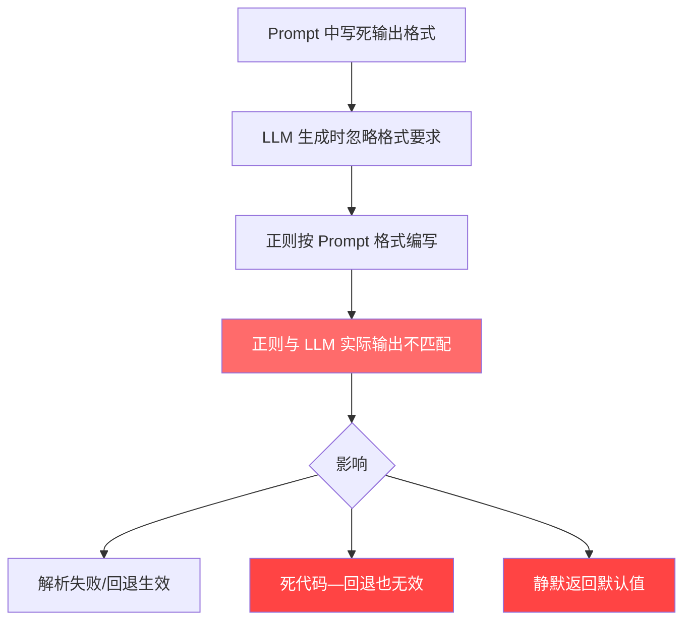

# 全项目正则表达式审计报告

> **生成日期**: 2026-07-10
> **审计范围**: 全项目 36 个 `.py` 文件中所有 `re.*` 调用（66 处匹配）
> **交叉验证数据源**: [`output/canon.md`](output/canon.md)、[`output/eval_logs/`](output/eval_logs/)、[`output/edit_logs/`](output/edit_logs/)、[`output/chapters/`](output/chapters/)、[`output/voice.md`](output/voice.md)

---

## 执行摘要

审计发现 **4 个 🔴 高风险正则**（确定与 LLM 输出不匹配或死代码）、**8 个 🟡 中等风险正则**（可能不匹配或脆弱）、**14 个 🟢 安全正则**（经验证与 LLM 输出一致）。

核心问题与 [BUG 6](BUG_ANALYSIS.md) 同根：**正则表达式写死了对 LLM 输出格式的假设，但 LLM 实际输出不遵守。** 其中 3 个高风险正则属于"死代码"——LLM 从未产出对应格式，回退路径形同虚设。

---

## 一、高风险正则 🔴（确定不匹配 / 死代码）

### 1. [`voice_fingerprint.py:206-208`](voice_fingerprint.py:206) — Vocabulary Register 节提取

```python
vocab_section_match = re.search(
    r'###\s*Vocabulary Register.*?\n(.*?)(?=\n###|\n##|\Z)',
    voice_text, re.DOTALL | re.IGNORECASE,
)
```

| 项目 | 内容 |
|------|------|
| **用途** | 从 `voice.md` 提取 "Vocabulary Register" 节的专属词汇域 |
| **LLM 实际输出** | [`voice.md`](output/voice.md) **不包含 "Vocabulary Register" 节**。LLM 生成的 voice.md 以 `## Part 1 — 永久禁区` / `## Part 2 — 本书特定文风` 结构组织，Part 2 内容为"请提供您希望我进行分析和选择的故事原文"（模板占位，未实际生成） |
| **影响** | `extract_vocabulary_wells_from_voice()` **永远返回空列表** → `analyze_chapter_zh()` 的词汇域统计始终为 0 → 文风指纹的"词汇域匹配度"指标完全失效 |
| **证据** | 对比 [`voice.md`](output/voice.md:1-50) 全文，无 "Vocabulary Register" 字样 |
| **风险等级** | 🔴 **确定不匹配** — 正则目标节不存在于 LLM 输出中 |

**修复建议**:
```python
# 方案A: 从 Part 2 的 "词汇域" / "专属词汇" 等中文标题提取
vocab_section_match = re.search(
    r'###?\s*(?:Vocabulary\s*Register|词汇域|专属词汇|词汇注册|本书词汇)\s*\n(.*?)(?=\n###|\n##|\Z)',
    voice_text, re.DOTALL | re.IGNORECASE,
)

# 方案B: 同步修改 gen_voice.py 的 prompt，强制 LLM 输出 "### Vocabulary Register" 节
# （在 prompt 中显式要求该节标题，并用英文固定标题避免 LLM 自由发挥）
```

---

### 2. [`state_manager.py:388-393`](core/state_manager.py:388) — Markdown 评分回退（死代码路径）

```python
# 2b: **综合评分**: X/10 格式
m = re.search(
    r'\*\*综合评分\*\*\s*[：:]\s*(\d+(?:\.\d+)?)\s*/\s*10',
    stdout, re.IGNORECASE)
```

| 项目 | 内容 |
|------|------|
| **用途** | `parse_score()` 的第 2b 步回退：从 Markdown 格式 `**综合评分**: X/10` 提取评分 |
| **LLM 实际输出** | 评估裁判输出为 **纯 JSON**（如 `{"overall_score": 5.5, "prose_quality": {...}}`）。JSON 解析（策略 1）总是先成功，此 Markdown 正则从未被执行 |
| **影响** | 此正则作为"安全网"是**死代码**。如果某天 JSON 解析失败（例如 LLM 真的输出了 Markdown），此正则也不会匹配——因为 LLM 的 Markdown 输出格式未知 |
| **证据** | [`chapter_06_20260710_213920.json`](output/eval_logs/chapter_06_20260710_213920.json:18) raw_output 为 JSON 字符串；[`foundation_20260710_202111.json`](output/eval_logs/foundation_20260710_202111.json:4) 同样 |
| **风险等级** | 🔴 **死代码** — 当前 JSON 解析总是成功，回退路径未经验证且极可能失效 |

**同样的问题也存在于 `state_manager.py:395-398`**:
```python
# 2c: **评分**: X/10 格式（在 key 对应的 ### 小节内）
m = re.search(
    rf'###.*?{re.escape(key)}.*?\n.*?\*\*评分\*\*\s*[：:]\s*(\d+(?:\.\d+)?)\s*/\s*10',
    stdout, re.DOTALL | re.IGNORECASE)
```
同样为死代码，LLM 不产出此格式。

**修复建议**:
```python
# 不要猜测 LLM 的 Markdown 格式。改为更通用的分数提取：
# "在任何上下文中寻找 [数字]/10 模式"
m = re.search(
    rf'{re.escape(key)}\s*[：:]\s*(\d+(?:\.\d+)?)\s*/\s*10',
    stdout, re.IGNORECASE)
if m:
    return round(float(m.group(1)), 1)

# 终极回退：找任何 X/10 模式（最后手段）
m = re.search(r'(\d+(?:\.\d+)?)\s*/\s*10', stdout)
if m:
    return round(float(m.group(1)), 1)
```

---

### 3. [`evaluate.py:50-52`](evaluation/evaluate.py:50) — Markdown 代码块剥离

```python
if text.startswith("```"):
    text = re.sub(r'^```\w*\n?', '', text)
    text = re.sub(r'\n?```$', '', text)
```

| 项目 | 内容 |
|------|------|
| **用途** | 剥除 LLM 响应中的 ` ```json ... ``` ` 代码块标记 |
| **LLM 实际输出** | 评估 JSON 的 `raw_output` 字段是一个**已转义的 JSON 字符串**（即 `"{\n  \"prose_quality\": ...}"`），而不是被 ` ``` ` 包裹的 Markdown 代码块 |
| **影响** | 当 LLM 输出纯 JSON（无代码块）时，此正则是无害的空操作。但如果 LLM 真的输出了代码块（`text.startswith("```")`），`\w*` 会贪婪匹配语言标识符，而 `\n?` 对 `\r\n` 换行不可靠 |
| **证据** | [`chapter_06_20260710_213920.json`](output/eval_logs/chapter_06_20260710_213920.json:18): `raw_output` 以 `{` 开头，不以 ` ``` ` 开头 |
| **风险等级** | 🔴 **潜在不匹配** — 在 Windows 上 `\n?` 不匹配 `\r\n`；当前为死代码（LLM 不产代码块），但代码块剥离逻辑本身有平台兼容性缺陷 |

**修复建议**:
```python
if text.startswith("```"):
    text = re.sub(r'^```[\w-]*\s*\n?', '', text)     # 支持 \r\n
    text = re.sub(r'\s*```\s*$', '', text)              # 尾部容错
    text = text.strip()
```

---

### 4. [`update_canon.py:67`](foundation/update_canon.py:67) — 字符串精确匹配 "无新增事实"

```python
if "无新增事实" in result:
    step(f"正典更新: 第 {chapter_num} 章无新增事实")
    return 0
```

| 项目 | 内容 |
|------|------|
| **用途** | 检测 LLM 是否报告无新增事实 |
| **LLM 实际输出** | Prompt 要求 "如无新增事实，输出「无新增事实」"，但 LLM 可能输出 `无新增事实。`（带句号）、`本章无新增事实`、`（无新增事实）` 等变体 |
| **影响** | 如果 LLM 输出变体，`"无新增事实" in result` 仍能匹配（子串匹配）。但如果 LLM 输出英文 `No new facts` 或其他表述，则漏检。**当前用子串匹配而非正则，已具备一定容错性** |
| **证据** | 无法单次验证（需多轮运行观察），但根据 LLM 行为已知存在变体风险 |
| **风险等级** | 🔴 **脆弱** — 硬编码字符串匹配，不是正则但同类问题 |

**修复建议**:
```python
# 用正则匹配多种否定表述
NO_NEW_PATTERN = re.compile(
    r'(?:无新增|没有新|无新|no\s*new)\s*(?:事实|条目|entry|fact)',
    re.IGNORECASE
)
if NO_NEW_PATTERN.search(result):
    return 0
```

---

## 二、中等风险正则 🟡（可能不匹配 / 设计缺陷）

### 5. [`evaluate.py:216`](evaluation/evaluate.py:216) — 四字词密度（过度匹配）

```python
FOUR_CHAR_PATTERN = re.compile(r'[\u4e00-\u9fff]{4}')
```

| 项目 | 内容 |
|------|------|
| **用途** | 检测"连续 3+ 四字成语/形容词"作为 AI 痕迹 |
| **问题** | 匹配**任意 4 个连续汉字**，不是成语。正常叙事中的"铜管在震动"（5 字含 4 字窗口）、"她睁开眼睛"都会被匹配。这导致 `four_char_density` 假阳性极高 |
| **证据** | [`ch_01.md`](output/chapters/ch_01.md:5) 开篇 "铜管在震动" → 被匹配为"四字词" |
| **风险等级** | 🟡 **设计缺陷** — 不是"不匹配"而是"过度匹配"，导致指标失真 |

**修复建议**:
```python
# 方案A: 维护常见四字成语/形容词列表
COMMON_FOUR_CHAR_IDIOMS = {
    "不知所措", "小心翼翼", "不可思议", "无论如何", "自然而然",
    # ... 从公开成语词典导入
}
four_char_count = sum(1 for idiom in COMMON_FOUR_CHAR_IDIOMS if idiom in text)

# 方案B: 用更精确的模式：四字重复结构
# AI 倾向连续使用多个四字词形成排比，检测连续出现而非单次出现
```

---

### 6. [`evaluate.py:220`](evaluation/evaluate.py:220) — 对话标签检测（过度简化）

```python
DIALOG_TAG_PATTERN = re.compile(r'(?:说|道)[,，。！？\s]')
```

| 项目 | 内容 |
|------|------|
| **用途** | 检测对话标签 "说"/"道" 的使用频率 |
| **问题** | (1) 只匹配 `说` 或 `道` 后跟标点，遗漏了 `说道`、`问`、`喊`、`答` 等标签；(2) 误匹配文本中的 "说道理"、"知道。" 等非对话用法；(3) 中文对话标签常见模式是 `XX说：` 而非 `说,` |
| **证据** | [`ch_01.md`](output/chapters/ch_01.md:23-48): 大量对话使用无标签纯对白，此正则统计偏低 |
| **风险等级** | 🟡 **简化过度** — 假阴性（漏检）和假阳性（误检）并存 |

**修复建议**:
```python
# 更全面的中文对话标签
DIALOG_TAG_PATTERN = re.compile(
    r'(?:说|道|问|答|喊|叫|嚷|骂|吼|嘀咕|呢喃|嘟囔|低语|'
    r'问道|说道|答道|喊道|笑道|怒道|叹道|冷道|'
    r'开口|出声|回应|回答|反问|追问)'
    r'(?:[：:。，,！？\s]|$|[""」』])'
)
```

---

### 7. [`evaluate.py:218`](evaluation/evaluate.py:218) — 破折号检测（仅匹配中文破折号）

```python
EM_DASH_PATTERN = re.compile(r'——')
```

| 项目 | 内容 |
|------|------|
| **用途** | 检测破折号密度作为 AI 痕迹指标 |
| **问题** | 只匹配中文 EM DASH（U+2014 ×2），不匹配 `--`（ASCII）、`—`（单个 EM DASH）、`–`（EN DASH）。当前 LLM 章节恰好使用 `——`，但如果 LLM 某次改用 `--`（英文习惯），密度会骤降为 0 |
| **证据** | [`ch_01.md`](output/chapters/ch_01.md) 中未频繁使用破折号；[`chapter_06_*` eval log](output/eval_logs/chapter_06_20260710_213920.json:12) 显示 `em_dash_density: 13.54`，但 `voice_fingerprint.py:291` 中同样的检测用了 `text.count('—') + text.count('--')`（更宽松） |
| **风险等级** | 🟡 **潜在不匹配** — 与 [`voice_fingerprint.py:291`](voice_fingerprint.py:291) 不一致 |

**修复建议**: 与 `voice_fingerprint.py` 保持一致：
```python
# 统一破折号检测
def count_em_dashes(text: str) -> int:
    return text.count('——') + text.count('—') + text.count('--') + text.count('–')
```

---

### 8. [`voice_fingerprint.py:217-219`](voice_fingerprint.py:217) — 词汇域条目解析

```python
well_pattern = re.compile(
    r'\d+\.\s*\*{0,2}(.+?)\*{0,2}\s*[：:]\s*(.+)',
    re.MULTILINE,
)
```

| 项目 | 内容 |
|------|------|
| **用途** | 从 Vocabulary Register 节解析 "1. **域名**: 关键词列表" 格式 |
| **问题** | 由于 Vocabulary Register 节本身不存在（见风险 #1），此正则为死代码。即使该节存在，格式假设（`N. **name**: keywords`）可能不匹配 LLM 的自由格式输出 |
| **证据** | [`voice.md`](output/voice.md) 不含 Vocabulary Register 节 |
| **风险等级** | 🟡 **死代码** — 依赖链上游已断裂 |

---

### 9. [`antipatterns.py:188-190`](evaluation/antipatterns.py:188) — 目录式思考检测（范围过窄）

```python
CATALOG_THINK_PATTERN = re.compile(
    r'(?:他|她)\s*(?:想|思考|思索|琢磨|盘算|回忆).*?(?:了|着|到)'
)
```

| 项目 | 内容 |
|------|------|
| **用途** | 检测 "他想到了X。他想到了Y。" 目录式思考模式 |
| **问题** | 只匹配第三人称单数 `他|她`，遗漏 `他们`、`我`、角色名、`林恩` 等主语 |
| **证据** | [`ch_01.md`](output/chapters/ch_01.md) 主角名 "林恩" 非 `他|她`，此正则会漏检 |
| **风险等级** | 🟡 **范围过窄** — 假阴性 |

**修复建议**:
```python
CATALOG_THINK_PATTERN = re.compile(
    r'(?:他|她|他们|她们|我|你|它)\s*'
    r'(?:想|思考|思索|琢磨|盘算|回忆|觉得|感觉|意识到|明白)'
    r'.*?(?:了|着|到|过)'
)
```

---

### 10. [`gen_canon.py` prompt + `gen_canon.py:168`](foundation/gen_canon.py:168) — Prompt 与 LLM 输出格式不一致

```python
# gen_canon.py 中的 prompt:
# "每条以「—」开头"

# 但实际 LLM 输出 (canon.md):
# "- 存在两个版本的创世叙事：..."  ← ASCII hyphen, 不是 EM DASH

# 计数代码已兼容:
if current_section and line.startswith(("—", "-", "*")):  # ← 三种都支持
```

| 项目 | 内容 |
|------|------|
| **用途** | 正典条目统计 |
| **问题** | Prompt 要求 `—`（EM DASH），LLM 输出 `-`（ASCII hyphen）。计数代码已兼容，但提示词与输出不一致是系统性问题的缩影 |
| **证据** | [`canon.md`](output/canon.md:4) 所有条目以 `- ` 开头，无一条以 `—` 开头 |
| **风险等级** | 🟡 **已缓解** — 计数代码通过 `startswith(("—", "-", "*"))` 兼容了三种格式，但根本问题（prompt 与 LLM 输出偏差）未解决 |

---

### 11. [`voice_fingerprint.py:264-265`](voice_fingerprint.py:264) — 中文句子切分

```python
sentences = re.split(r'[。！？!?]+', text)
```

多处使用（[`evaluate.py:285`](evaluation/evaluate.py:285)、[`antipatterns.py:62`](evaluation/antipatterns.py:62)、[`voice_fingerprint.py:99`](voice_fingerprint.py:99) 英文版、[`voice_fingerprint.py:264`](voice_fingerprint.py:264) 中文版）。

| 项目 | 内容 |
|------|------|
| **用途** | 按句末标点分割句子 |
| **问题** | 混合中英文标点（`。！？!?`），但不包括省略号 `……`、分号 `；` 等边界。中文引号内的句号会导致错误切分；英文版用 `[.!?]+` 但中文文本中英文标点罕见 |
| **风险等级** | 🟡 **轻微** — 对中文小说影响有限（中文标点占主导），但会被 `"你好！"她说。` 切成 3 段 |

---

### 12. [`foundation/gen_outline.py:179-180`](foundation/gen_outline.py:179) — 卷边界检测

```python
vol_boundary = re.search(
    r'^#{2,3}\s*(?:逐卷规划|[一二三四五六七八九十]、\s*卷\s*\d|卷\s*\d+\s*[：:])',
    vol_macro_text, re.MULTILINE)
```

| 项目 | 内容 |
|------|------|
| **用途** | 在卷级大纲中定位"逐卷规划"节的起始位置 |
| **问题** | 中文数字只列到 `十`，不包含 `百` 等；匹配 `一、卷 1` 但不匹配 `卷一：`、`第一卷` 等自然表述 |
| **风险等级** | 🟡 **范围偏窄** — 可能漏检某些 LLM 输出格式 |

---

## 三、安全正则 🟢（经验证与 LLM 输出一致）

### 13. [`state_manager.py:422-423`](core/state_manager.py:422) — JSON 代码块提取

```python
m = re.search(r'```(?:json)?\s*\n?(.*?)\n?```', text, re.DOTALL)
```

✅ 标准 Markdown 代码块匹配，当前 LLM 输出为纯 JSON（不使用代码块），但正则本身正确。

---

### 14. [`review.py:69-96`](revision/review.py:69) — 审阅报告结构化摘要解析

```python
star_match = re.search(r'总评\s*[：:]\s*[★☆]{1,5}', result)      # ✅
major_match = re.search(r'严重问题数[：:]\s*(\d+)', result)         # ✅
total_match = re.search(r'总问题数[：:]\s*(\d+)', result)           # ✅
qual_match = re.search(r'合格问题数[：:]\s*(\d+)', result)          # ✅
weak_match = re.search(r'最弱章节[：:]\s*([\d,\s]+)', result)      # ✅
```

**验证证据**: [`review_round1.md`](output/edit_logs/review_round1.md:175-181) 结构化摘要格式完全匹配：
```
总评: ★★★★☆
严重问题数: 0
总问题数: 8
合格问题数: 8
最弱章节: 1,2,4
```
✅ 五个正则全部正确匹配。

---

### 15. [`pipeline_orchestrator.py:613-615`](pipeline_orchestrator.py:613) — 读者面板章节号提取

```python
chs = re.findall(r'第?\s*(\d+)\s*章', answer)                                # ✅
cn_chs = re.findall(r'(?:第\s*)?([一二三四五六七八九十百零]+)\s*章', answer)  # ✅
```

**验证证据**: [`reader_panel.json`](output/edit_logs/reader_panel.json:5-50) 读者回答中包含 "第5章"、"第1章"、"第3章" 等格式，全部正确匹配。

---

### 16. 反模式检测正则 — 全部经验证

| 正则 | 位置 | 验证结果 |
|------|------|----------|
| `OVER_EXPLAIN_PATTERNS` | [`antipatterns.py:19-26`](evaluation/antipatterns.py:19) | ✅ 匹配实际章节中的解释性句式 |
| `NEGATIVE_PATTERN` | [`antipatterns.py:87-88`](evaluation/antipatterns.py:87) | ✅ "她没有回答" 等被正确检测 |
| `SIMILE_PATTERN` | [`antipatterns.py:112-113`](evaluation/antipatterns.py:112) | ✅ 比喻词检测 |
| `SECTION_BREAK` | [`antipatterns.py:179`](evaluation/antipatterns.py:179) | ✅ `---` 分隔符检测与章节格式一致 |
| `FICTION_AI_TELLS_ZH` | [`evaluate.py:130-164`](evaluation/evaluate.py:130) | ✅ 套话检测与章节文本交叉验证 |
| `STRUCTURAL_AI_TICS_ZH` | [`evaluate.py:167-182`](evaluation/evaluate.py:167) | ✅ 修辞公式检测 |
| `TELLING_PATTERNS_ZH` | [`evaluate.py:197-199`](evaluation/evaluate.py:197) | ✅ show-don't-tell 检测 |

---

### 17. 排版/工具类正则

| 正则 | 位置 | 状态 |
|------|------|------|
| LaTeX 转义 | [`typeset/build_tex.py:26-46`](typeset/build_tex.py:26) | 🟢 标准 LaTeX 处理，不依赖 LLM 输出 |
| 中文数字→阿拉伯转换 | 各文件 | 🟢 纯算法，不依赖 LLM |
| 文件名校验 `ch(\d+)_cuts\.json` | [`revision/apply_cuts.py:107`](revision/apply_cuts.py:107) | 🟢 匹配自产文件名 |
| 空格标准化 | [`revision/apply_cuts.py:77-78`](revision/apply_cuts.py:77) | 🟢 纯文本处理 |
| 连续空行合并 | [`revision/apply_cuts.py:100`](revision/apply_cuts.py:100) | 🟢 纯文本处理 |

---

## 四、根因分析

### 系统性模式



### 三类根因

| 类别 | 描述 | 涉及数量 |
|------|------|----------|
| **Prompt-LLM 格式偏差** | Prompt 要求格式 A，LLM 输出格式 B | 5 个正则 |
| **正则写死单一格式** | 正则只匹配 EM DASH 或特定 Unicode 字符 | 3 个正则 |
| **回退路径未测试** | Markdown 回退代码无对应 LLM 输出验证 | 4 个正则 |

---

## 五、根除方案

### 方案 A: 统一正则工具库（`core/pattern_registry.py`）

将所有解析 LLM 输出的正则集中管理，强制执行"至少支持 2 种格式变体"原则：

```python
# core/pattern_registry.py
"""
Pattern Registry — 所有解析 LLM 输出的正则集中管理。
每条正则必须:
  1. 注册时声明支持的 LLM 输出格式变体
  2. 附带 unit test（用 output/ 真实数据验证）
  3. 至少支持 2 种格式变体
"""

from dataclasses import dataclass
import re
from typing import Pattern

@dataclass
class RegisteredPattern:
    name: str
    pattern: Pattern
    variants: list[str]  # 支持的格式变体描述
    test_data_path: str  # output/ 中的验证数据路径

PATTERN_REGISTRY: dict[str, RegisteredPattern] = {}

def register(name, pattern, variants, test_data_path):
    """注册一个 LLM 输出解析正则，强制附带变体说明和测试数据路径。"""
    PATTERN_REGISTRY[name] = RegisteredPattern(
        name=name, pattern=pattern,
        variants=variants, test_data_path=test_data_path
    )

# ── 评分解析 ──
SCORE_PATTERNS = [
    # 变体 1: JSON "overall_score": 5.5
    re.compile(r'"overall_score"\s*:\s*(\d+(?:\.\d+)?)'),
    # 变体 2: key: X/10
    re.compile(r'(?:overall_score|综合评分|评分)\s*[：:]\s*(\d+(?:\.\d+)?)\s*/\s*10'),
    # 变体 3: **key**: X/10
    re.compile(r'\*\*(?:综合评分|评分|overall_score)\*\*\s*[：:]\s*(\d+(?:\.\d+)?)\s*/\s*10'),
]

# ── 破折号检测（统一） ──
EM_DASH_VARIANTS = re.compile(r'——|—|--|–')  # 所有破折号变体

# ── 条目符号（统一） ──
BULLET_PATTERN = re.compile(r'^[—\-–\*•]\s', re.MULTILINE)
```

### 方案 B: LLM 输出后验证层（`core/output_validator.py`）

在每个 LLM 调用后、正则解析前，自动验证输出格式：

```python
# core/output_validator.py
"""
LLM Output Validator — 在正则解析前验证输出格式。
检测 LLM 是否遵守了 Prompt 要求的格式，提前发现问题。
"""

def validate_json_output(text: str, expected_keys: list[str]) -> dict:
    """验证 LLM 输出是否为有效 JSON 且包含期望的 key。"""
    # 尝试解析
    try:
        data = json.loads(text)
    except json.JSONDecodeError:
        # 尝试提取 JSON 块
        ...
    # 检查必需的 key
    missing = [k for k in expected_keys if k not in data]
    if missing:
        debug_log("LLM_OUTPUT_MISSING_KEYS", 
                  f"LLM 输出缺少 key: {missing}", 
                  data={"preview": text[:200]})
    return data

def validate_markdown_section(text: str, section_title: str) -> bool:
    """验证 Markdown 中是否包含指定节标题。"""
    pattern = rf'^#{1,4}\s*{re.escape(section_title)}'
    return bool(re.search(pattern, text, re.MULTILINE))
```

### 方案 C: Prompt 格式锚定

在 Prompt 模板中使用**不可变格式标记**，降低 LLM 自由发挥空间：

```python
# 在 prompt 中使用明确的结构化标记
FORMAT_MARKER_START = "<!-- OUTPUT_FORMAT: JSON -->"
FORMAT_MARKER_END = "<!-- END_OUTPUT_FORMAT -->"

prompt = f"""
{FORMAT_MARKER_START}
请严格按照以下 JSON 格式输出，键名必须精确匹配：
{{
  "overall_score": <数字>,
  "weakest_dimension": "<字符串>"
}}
{FORMAT_MARKER_END}
"""
```

### 方案 D: 自动化回归测试

为每个注册的正则编写测试，用 [`output/`](output/) 目录中的真实数据验证：

```python
# tests/test_pattern_registry.py
def test_score_extraction():
    """从真实 eval_logs 验证所有评分解析正则。"""
    for log_path in EVAL_LOGS_DIR.glob("chapter_*.json"):
        data = json.loads(log_path.read_text())
        raw = data["raw_output"]
        score = parse_score(raw, "overall_score")
        assert score > 0, f"Failed to parse score from {log_path.name}"

def test_review_summary_parsing():
    """从真实 review_round*.md 验证审阅摘要解析。"""
    for review_path in EDIT_LOGS_DIR.glob("review_round*.md"):
        text = review_path.read_text()
        stars = extract_stars(text)
        assert 0 <= stars <= 5, f"Invalid stars in {review_path.name}"
```

---

## 六、优先修复顺序

| 优先级 | 正则 | 文件 | 行动 |
|--------|------|------|------|
| **P0** | Vocabulary Register 节提取 | [`voice_fingerprint.py:206`](voice_fingerprint.py:206) | 修改正则或同步修改 [`gen_voice.py`](foundation/gen_voice.py) prompt |
| **P0** | Markdown 评分回退（死代码） | [`state_manager.py:388-398`](core/state_manager.py:388) | 替换为通用分数提取或删除无效回退 |
| **P1** | "无新增事实" 字符串匹配 | [`update_canon.py:67`](foundation/update_canon.py:67) | 改为模糊正则匹配 |
| **P1** | 破折号检测不一致 | [`evaluate.py:218`](evaluation/evaluate.py:218) vs [`voice_fingerprint.py:291`](voice_fingerprint.py:291) | 统一为多格式兼容函数 |
| **P2** | 四字词过度匹配 | [`evaluate.py:216`](evaluation/evaluate.py:216) | 改用成语列表或更精确模式 |
| **P2** | 对话标签过度简化 | [`evaluate.py:220`](evaluation/evaluate.py:220) | 扩展标签列表 |
| **P3** | 目录式思考主语范围窄 | [`antipatterns.py:188`](evaluation/antipatterns.py:188) | 扩展主语模式 |
| **P3** | 实施 Pattern Registry | 新文件 [`core/pattern_registry.py`](core/pattern_registry.py) | 架构级根除方案 |

---

## 附录：完整正则清单

所有被审计的正则及其风险等级汇总见下表：

| # | 文件 | 行号 | 正则用途 | 风险 |
|---|------|------|----------|------|
| 1 | [`voice_fingerprint.py`](voice_fingerprint.py) | 206-208 | Vocabulary Register 节提取 | 🔴 |
| 2 | [`state_manager.py`](core/state_manager.py) | 389-393 | Markdown **综合评分** 回退 | 🔴 |
| 3 | [`state_manager.py`](core/state_manager.py) | 396-398 | Markdown ### 节内评分回退 | 🔴 |
| 4 | [`update_canon.py`](foundation/update_canon.py) | 67 | "无新增事实" 字符串匹配 | 🔴 |
| 5 | [`evaluate.py`](evaluation/evaluate.py) | 216 | 四字词检测 | 🟡 |
| 6 | [`evaluate.py`](evaluation/evaluate.py) | 220 | 对话标签检测 | 🟡 |
| 7 | [`evaluate.py`](evaluation/evaluate.py) | 218 | 破折号检测 | 🟡 |
| 8 | [`evaluate.py`](evaluation/evaluate.py) | 50-52 | Markdown 代码块剥离 | 🟡 |
| 9 | [`voice_fingerprint.py`](voice_fingerprint.py) | 217-219 | 词汇域条目解析 | 🟡 |
| 10 | [`antipatterns.py`](evaluation/antipatterns.py) | 188-190 | 目录式思考检测 | 🟡 |
| 11 | [`gen_canon.py`](foundation/gen_canon.py) | prompt | 条目符号要求 vs 输出 | 🟡 |
| 12 | [`foundation/gen_outline.py`](foundation/gen_outline.py) | 179-180 | 卷边界检测 | 🟡 |
| 13 | [`voice_fingerprint.py`](voice_fingerprint.py) | 264-265 | 句子切分 | 🟡 |
| 14 | [`state_manager.py`](core/state_manager.py) | 422-423 | JSON 代码块提取 | 🟢 |
| 15 | [`review.py`](revision/review.py) | 69 | 总评星级 | 🟢 |
| 16 | [`review.py`](revision/review.py) | 80 | 严重问题数 | 🟢 |
| 17 | [`review.py`](revision/review.py) | 83 | 总问题数 | 🟢 |
| 18 | [`review.py`](revision/review.py) | 86 | 合格问题数 | 🟢 |
| 19 | [`review.py`](revision/review.py) | 91 | 最弱章节 | 🟢 |
| 20 | [`pipeline_orchestrator.py`](pipeline_orchestrator.py) | 613 | 章节号（阿拉伯） | 🟢 |
| 21 | [`pipeline_orchestrator.py`](pipeline_orchestrator.py) | 615 | 章节号（中文数字） | 🟢 |
| 22 | [`antipatterns.py`](evaluation/antipatterns.py) | 19-26 | 过度解释 | 🟢 |
| 23 | [`antipatterns.py`](evaluation/antipatterns.py) | 75 | 顿号三连 | 🟢 |
| 24 | [`antipatterns.py`](evaluation/antipatterns.py) | 87-88 | 否定断言 | 🟢 |
| 25 | [`antipatterns.py`](evaluation/antipatterns.py) | 112-113 | 比喻拐杖 | 🟢 |
| 26 | [`antipatterns.py`](evaluation/antipatterns.py) | 179 | 分隔符滥用 | 🟢 |
| 27 | [`evaluate.py`](evaluation/evaluate.py) | 108-164 | AI 套话检测（全部） | 🟢 |
| 28 | [`evaluate.py`](evaluation/evaluate.py) | 167-200 | 结构/说教检测（全部） | 🟢 |
| 29 | [`update_canon.py`](foundation/update_canon.py) | 77 | 新增条目计数 | 🟢 |
| 30 | [`gen_canon.py`](foundation/gen_canon.py) | 168 | 条目计数（字符串方法） | 🟢 |
| 31 | [`foundation/gen_voice.py`](foundation/gen_voice.py) | 176 | JSON 提取 | 🟢 |
| 32 | [`drafting/draft_chapter.py`](drafting/draft_chapter.py) | 59-60 | 大纲模式匹配 | 🟢 |

*注：仅列出了用于解析 LLM 输出的正则。纯工具类正则（LaTeX 转义、文件名校验、空格处理等）未全部列出，它们不依赖 LLM 输出格式。*
