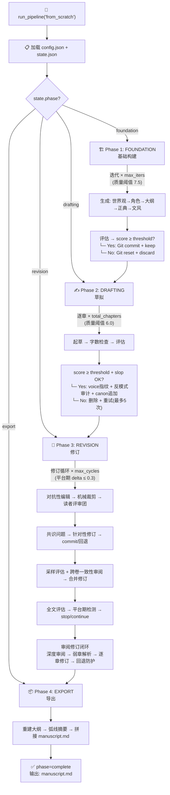
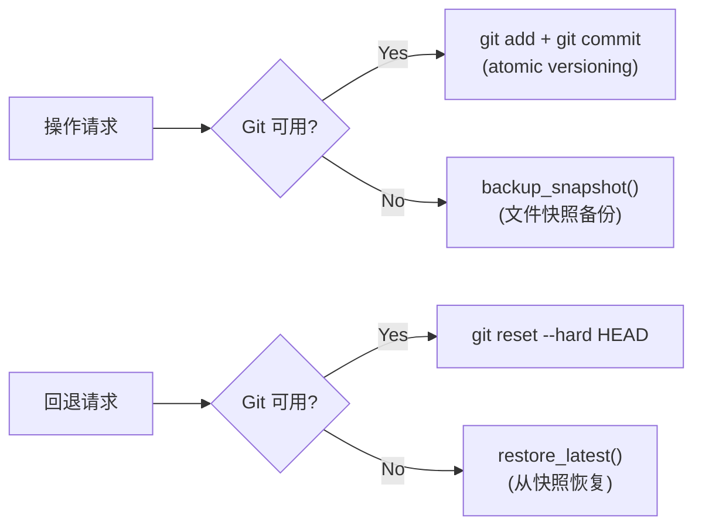
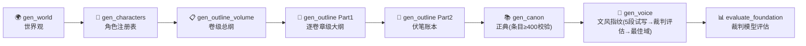
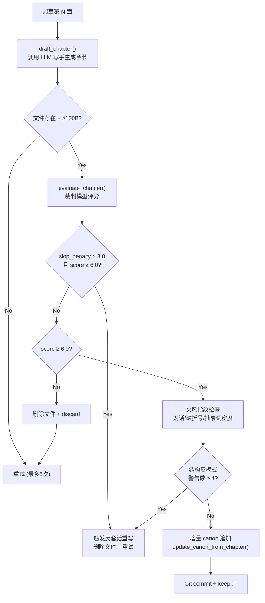
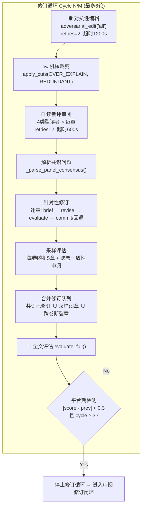
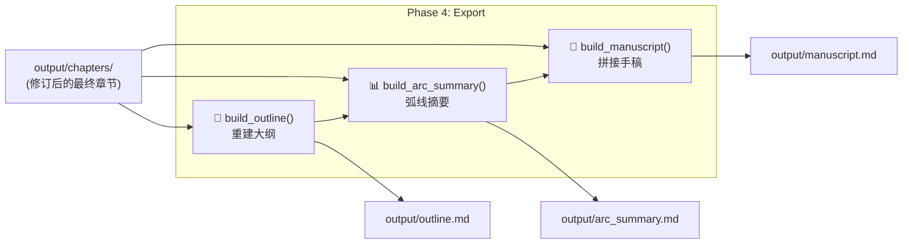
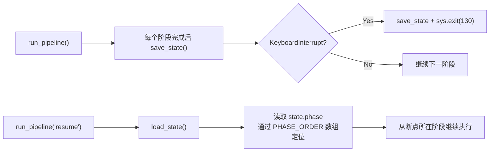
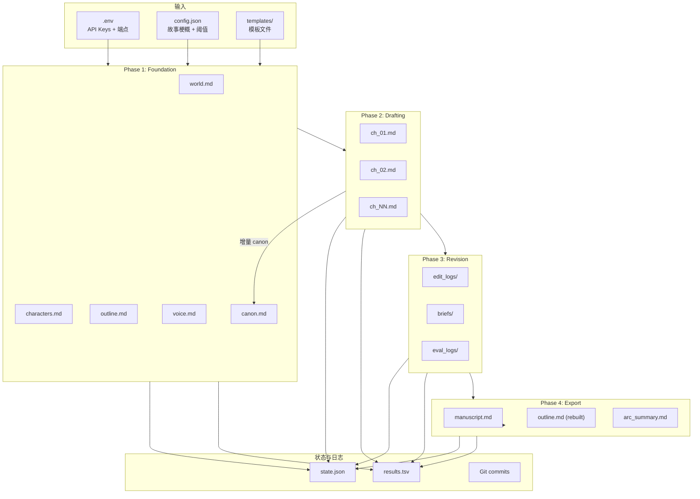

# 📘 项目全流水线底层运行机制分析

> 生成日期: 2026-06-29  
> 分析范围: `pipeline_orchestrator.py` + 全部 Phase 1-4 支撑模块

---

## 一、架构总览

本项目是一个 **中文长篇小说自动生成系统**，通过 LLM API 调用实现从零到完整手稿的全自动写作流水线。核心编排由 [`pipeline_orchestrator.py`](pipeline_orchestrator.py:1) 主导，按四个阶段（Phase 1→4）顺序执行。



---

## 二、核心基础设施

### 2.1 配置系统 ([`core/config.py`](core/config.py:1))

| 来源 | 内容 | 加载方式 |
|------|------|---------|
| `.env` | API Key、端点、模型名、调用间隔 | `python-dotenv` |
| `output/config.json` | 故事梗概、章节数、阈值、迭代上限 | JSON 合并 |

支持 **Phase 分离模型**：P1/P2/P3/P4 可分别使用不同的 API 端点和模型。例如：

```
AUTONOVEL_P1_MODEL_NAME   → Phase 1 (基础构建) 用长上下文模型
AUTONOVEL_P2_MODEL_NAME   → Phase 2 (草拟) 用创意写作模型
AUTONOVEL_P3_MODEL_NAME   → Phase 3 (修订) 用精修模型
AUTONOVEL_JUDGE_MODEL_NAME → 评估评分专用裁判模型
```

### 2.2 状态管理 ([`core/state_manager.py`](core/state_manager.py:71))

`state.json` 是流水线的核心持久化文件，支持中断恢复。关键字段：

```json
{
    "phase": "foundation|drafting|revision|export|complete",
    "current_focus": "planning|chapter_drafting|full_novel|export|done",
    "iteration": 0,
    "foundation_score": 0.0,
    "lore_score": 0.0,
    "chapters_drafted": 0,
    "chapters_total": 0,
    "novel_score": 0.0,
    "revision_cycle": 0,
    "canon_entry_count": 0,
    "canon_last_updated_ch": 0,
    "review_revision_round": 0
}
```

### 2.3 版本控制：Git / 文件双模式



每次质量决策都伴随版本操作：
- **保留 (keep)**: `git_add_commit()` 提交当前状态
- **丢弃 (discard)**: `git_reset_hard("HEAD")` 回退到上一次提交

### 2.4 实验日志 ([`output/results.tsv`](core/config.py:33))

每次质量决策都写入 TSV 行，格式：

```
commit_hash \t stage \t score \t word_count \t decision \t notes
```

决策类型：
| 类型 | 含义 |
|------|------|
| `keep` | 评分提升，保留 |
| `discard` | 评分未提升，丢弃 |
| `forced` | 达到最大重试次数，强制保留 |
| `cycle` | 修订循环完成 |
| `export` | 最终导出 |

---

## 三、Phase 1: Foundation（基础构建）

位于 [`run_foundation()`](pipeline_orchestrator.py:58)，核心是 **带质量阈值的迭代循环**。

### 3.1 生成流程（每次迭代 7 步）



**步骤详解：**

| 步骤 | 函数 | 产出文件 | 说明 |
|------|------|---------|------|
| 1 | `generate_world()` | `world.md` | 世界观设定（地理、历史、社会、技术） |
| 2 | `generate_characters()` | `characters.md` | 角色注册表（深度、区分度、秘密） |
| 2.5 | `generate_volume_outline()` | `outline_volume.md` | ★ 卷级总纲，必须在章节大纲前生成 |
| 3 | `generate_outline()` | `outline.md` (Part1) | 逐卷章级大纲，依赖 outline_volume.md |
| 4 | `generate_outline_part2()` | `outline.md` (追加) | 伏笔账本 |
| 5 | `generate_canon()` | `canon.md` | 正典（设定数据库） |
| 6 | `generate_voice()` | `voice.md` | 文风指纹（5 段试写 → 裁判评估 → 最佳域） |
| 7 | `evaluate_foundation()` | eval_logs/ | 裁判模型综合评估 |

### 3.2 质量决策循环

```
评分 > 历史最佳 → Git commit + keep（保留）   → 继续迭代
评分 ≤ 历史最佳 → Git reset + discard（丢弃）  → 继续迭代
评分 ≥ 阈值(7.5) → 通过，退出循环 ✅
迭代 >= max_iters → 警告但接受当前最佳结果 ⚠
```

### 3.3 关键设计

| 设计点 | 说明 | 代码位置 |
|--------|------|---------|
| **正典规模校验** | 条目 < 400 发出警告，< 200 则后续迭代增大 token 预算 | `pipeline_orchestrator.py:127-131` |
| **卷级总纲先行** | `outline_volume.md` 在章节大纲前生成，提供每卷的结构化约束 | `pipeline_orchestrator.py:99-101` |
| **文风域选择** | 裁判模型评估 5 种文风域（冷峻式/抒情式/等），选择最佳域 | `foundation/gen_voice.py` |

---

## 四、Phase 2: Drafting（草拟）

位于 [`run_drafting()`](pipeline_orchestrator.py:186)，逐章起草并对每章执行 **三重质量检查**。

### 4.1 单章生成流程



### 4.2 三重质量关卡

| 关卡 | 检测内容 | 不通过处理 | 代码位置 |
|------|---------|-----------|---------|
| **Slop Penalty** | 机械检测 AI 套话痕迹（Tier1/Tier2/Fiction/StructTic/Telling/Transition） | 即使 LLM 评分达标也触发重写 | `pipeline_orchestrator.py:231-243` |
| **文风指纹** | 对话率为 0、破折号密度 > 5/千字、抽象词 > 30/千字、过渡词 > 15/千字 | 警告但接受 | `pipeline_orchestrator.py:257-286` |
| **结构反模式** | 三连罗列、段落均匀化、比喻密度过高等 | 警告数 ≥ 4 触发重写 | `pipeline_orchestrator.py:289-312` |

### 4.3 增量 Canon 机制

每章通过后调用 [`update_canon_from_chapter()`](foundation/update_canon.py) 从章节文本提取新设定追加到 [`canon.md`](output/canon.md)：

- 分析章节中的新事实（角色关系、地点细节、世界观规则等）
- 以结构化条目追加到正典
- 更新 `state.json` 中的 `canon_entry_count` 和 `canon_last_updated_ch`
- 实现知识的增量积累，确保设定一致性随章节增长

### 4.4 容错机制

如果所有重试都失败（`max_attempts=5`），采用 **"尽力而为"** 策略：
- 保留最后一次生成的文件
- 以 `decision=forced` 记录到 `results.tsv`
- 继续下一章（不阻塞流水线）

---

## 五、Phase 3: Revision（修订）— 最复杂的阶段

位于 [`run_revision()`](pipeline_orchestrator.py:425)，包含 **三个层次的修订机制**，是整个流水线质量保证的核心。

### 5.1 修订循环（每轮固定 7 步）



### 5.2 步骤详解

| 步骤 | 函数 | 超时 | 说明 |
|------|------|------|------|
| 1 | `run_adversarial_edit()` | 1200s | 对抗性编辑全部章节，生成编辑清单 |
| 2 | `run_apply_cuts()` | - | 应用机械裁剪（OVER_EXPLAIN, REDUNDANT） |
| 3 | `run_reader_panel()` | 600s | 4 类型读者评审全部章节 |
| 4 | `_parse_panel_consensus()` | - | 解析共识问题（跨读者类型一致认同的问题） |
| 5 | 逐章 `generate_brief()` + `revise_chapter()` + `evaluate_chapter()` | 1200s/章 | 针对性修订 + 回退防护 |
| 6 | `_sample_evaluate_volumes()` + `_cross_volume_consistency_review()` | 600s | 采样评估 + 跨卷一致性检测 |
| 7 | `evaluate_full()` | 600s | 全文评估 → 平台期检测 |

### 5.3 三层修订机制对比

| 机制 | 触发频率 | 修订目标来源 | 回退策略 |
|------|---------|------------|---------|
| **共识问题修订** | 每循环 | 读者评审团的 4 人共识 | post_score < pre_score → Git reset |
| **采样评估修订** | 每循环 | 每卷随机 5 章评分低于阈值的弱章 | post_score < pre_score → Git reset |
| **审阅修订闭环** | 循环结束后 | 裁判模型深度审阅指出的弱章节 | post_score < pre_score → Git reset |

### 5.4 读者评审团

4 种读者类型 × 每章 = 共 `4 × N章` 次评审：

| 读者类型 | 关注焦点 |
|---------|---------|
| **情节型读者** | 叙事节奏、悬念维持、信息释放 |
| **角色型读者** | 角色深度、声音区分度、动机可信度 |
| **语言型读者** | 文笔质量、句式变化、AI 模式检测 |
| **普通读者** | 整体阅读体验、吸引力、情感回报 |

通过共识分析找出跨类型一致指出的问题章节和问题类型。

### 5.5 审阅修订闭环 ([`_run_review_revision_loop()`](pipeline_orchestrator.py:890))

Phase 3b 的独立子流程，最多执行 3 轮：

```
深度审阅 → 质量检查(★≥4.5 且无严重问题→通过)
         → 解析弱章节(在负面上下文中匹配章节引用)
         → 逐章: auto_brief → revise → evaluate → commit/回退 → apply_cuts
         → 最终全文评估
```

**弱章节解析算法**（[`_parse_review_weak_chapters()`](pipeline_orchestrator.py:838)）：

1. 读取 `review_round*.json` 中的 `raw_review` 字段
2. 匹配 `第N章` / `Ch.N` / `Chapter N` 模式的引用
3. 检查引用 ±200 字窗口是否包含负面关键词（"问题"、"弱点"、"MAJOR"、"薄弱"等）
4. 按引用频次降序取前 5 章
5. 若无明确引用，兜底取全文中段 1/3~2/3 的章节

### 5.6 跨卷一致性审阅 ([`_cross_volume_consistency_review()`](pipeline_orchestrator.py:579))

仅当 `total_volumes > 1` 且循环为偶数轮时触发：

1. 提取每卷终章的末尾 3000 字
2. 提取每卷首章的开头 3000 字
3. 加载 canon 前 5000 字作为参考
4. 调用裁判模型检测：角色状态一致性、伏笔线索连续性、世界观设定漂移
5. 返回疑似断裂的章节编号列表

---

## 六、Phase 4: Export（导出）

位于 [`run_export()`](pipeline_orchestrator.py:1095)，包含 2 次 LLM 调用 + 1 次纯机械操作：

### 6.1 三步导出流程



### 6.2 各步骤详细说明

| 步骤 | 函数 | API 调用 | 输入 | 输出 | 用途 |
|------|------|---------|------|------|------|
| 1 | [`build_outline()`](export/build_outline.py:21) | ✅ 1次 | 每章前 800 字 | `outline.md` (覆盖) | 反映真实成品的"竣工图"大纲 |
| 2 | [`build_arc_summary()`](export/build_arc_summary.py:23) | ✅ 1次 | 每章首尾各 500 字 | `arc_summary.md` | 全局弧线诊断报告 |
| 3 | [`build_manuscript()`](export/build_manuscript.py:15) | ❌ 无 | 全部章节文件 | `manuscript.md` | 最终交付完整手稿 |

### 6.3 为什么要在 Phase 4 重新生成大纲和摘要？

> **核心原因**: 最终成品 ≠ 初始计划。经过 Phase 2-3 的多轮起草和修订，实际章节内容已大幅偏离 Phase 1 的初始大纲。

| 产物 | Phase 1 版本 | Phase 4 版本 | 差异原因 |
|------|------------|------------|---------|
| `outline.md` | 蓝图（计划写什么） | 竣工图（实际写了什么） | 起草和修订使内容偏离计划 |
| `arc_summary.md` | 不存在 | 全局诊断报告 | 只在所有章节定稿后才能分析 |
| `manuscript.md` | 不存在 | 最终完整手稿 | 需要所有章节修订完成后拼接 |

**具体价值**：

- **重建大纲**: 作为读者的快速导航索引；验证修订后的章节排列是否逻辑连贯
- **弧线摘要**: 诊断主角弧线是否成立、伏笔是否回收、主题是否一致——如果发现"第 5 章角色性格与第 1 章矛盾"，可以回退修正
- **手稿拼接**: 将所有独立章节合并为一个完整文档，附带自动生成的章节目录

---

## 七、中断恢复机制



### 7.1 关键设计

- `PHASE_ORDER = ["foundation", "drafting", "revision", "export"]`
- `resume` 模式通过 `state.phase` 找到当前阶段在数组中的索引
- 跳过已完成阶段，从断点继续
- 每个阶段内部的子状态（如 `chapters_drafted`、`revision_cycle`）也精确记录

### 7.2 E2E-1 测试中的实际表现

从 `_run_stage4_e2e1.py` 的日志可见，流水线在以下节点正确保存了状态：
- ✅ Foundation 每次迭代完成后
- ✅ 每章起草完成后
- ✅ 每个修订循环完成后
- ✅ 崩溃时通过顶层 `try/except` 捕获并写入 `[CRASH]` 格式状态

---

## 八、平台期检测与退出条件

| 阶段 | 退出条件 | 代码位置 |
|------|---------|---------|
| **Foundation** | `score >= foundation_threshold` 或 `iteration >= max_foundation_iters` | `pipeline_orchestrator.py:165-169` |
| **Drafting** | 所有章节起草完成（或达到最大尝试次数强制保留） | `pipeline_orchestrator.py:340-351` |
| **Revision** | `cycle >= MIN_REVISION_CYCLES(3)` 且 `|novel_score - prev_score| < plateau_delta(0.3)` | `pipeline_orchestrator.py:827-830` |
| **审阅修订** | `stars >= 4.5 且 major_items == 0` 或 `round >= max_revision_rounds(3)` | `pipeline_orchestrator.py:929-931` |
| **Export** | 三个导出步骤全部完成 | `pipeline_orchestrator.py:1135` |

### 平台期检测逻辑

```
if cycle >= 3 and |novel_score - prev_score| < 0.3:
    → "评分已收敛，继续修订无意义"
    → 停止修订循环，进入审阅修订闭环
```

---

## 九、API 调用模式

所有 LLM 调用通过 [`core/api_client.py`](core/api_client.py) 的三个入口统一管理：

| 调用函数 | 用途 | 典型温度 | 典型 max_tokens |
|---------|------|---------|----------------|
| `call_writer()` | 生成内容（世界观、角色、章节、修订） | t=0.7~0.8 | 16000 |
| `call_judge()` | 评估评分（裁判模型） | t=0.3 | 4096 |
| `call_llm()` | 其他通用调用 | 可变 | 可变 |

### 重试与超时

每次调用支持：
- `retries`: 失败重试次数（通常 2 次）
- `max_total_time`: 总超时（如 1200s = 20 分钟）

由 `get_rate_limiter()` 控制调用频率（默认间隔由 `.env` 的 `AUTONOVEL_API_INTERVAL_SECONDS` 配置）。

---

## 十、完整数据流图



---

## 十一、关键设计原则总结

| 原则 | 实现方式 |
|------|---------|
| **质量门控** | 每个关键产出点都有评分阈值，不达标即丢弃重来（Git 回退保证原子性） |
| **迭代递增** | Foundation 通过多次迭代改进基础设定，Novel 通过多轮修订提升章节质量 |
| **多层评审** | 机械检测（slop/反模式）→ LLM 裁判评分 → 读者评审团共识 → 深度审阅 |
| **状态持久** | 完整的 state.json + Git 版本控制，支持任意点中断恢复 |
| **增量知识** | canon.md 在每章起草后增量更新，确保设定一致性随章节增长 |
| **回退防护** | 每次修订后评分对比，下降则自动 Git reset 回退 |
| **平台期智能停止** | 评分变化 < 0.3 且已完成 3+ 循环时自动停止，避免无效消耗 |
| **Phase 分离模型** | 不同阶段可使用不同能力的 LLM 模型（长上下文 vs 创意 vs 精修） |

---

## 附录：项目文件结构

```
my novel/
├── pipeline_orchestrator.py    ← 主编排器 (1271行)
├── core/
│   ├── config.py               ← 配置加载 (.env + config.json)
│   ├── state_manager.py        ← 状态管理 + Git/文件双模式
│   ├── api_client.py           ← LLM API 统一调用
│   └── diagnostic.py           ← 诊断工具
├── foundation/                 ← Phase 1 模块
│   ├── gen_world.py
│   ├── gen_characters.py
│   ├── gen_outline.py
│   ├── gen_outline_part2.py
│   ├── gen_outline_volume.py
│   ├── gen_canon.py
│   ├── gen_voice.py
│   └── update_canon.py
├── drafting/                   ← Phase 2 模块
│   ├── draft_chapter.py
│   └── run_drafts.py
├── revision/                   ← Phase 3 模块
│   ├── adversarial_edit.py
│   ├── apply_cuts.py
│   ├── reader_panel.py
│   ├── gen_brief.py
│   ├── gen_revision.py
│   ├── review.py
│   └── compare_chapters.py
├── evaluation/                 ← 评估模块
│   ├── evaluate.py
│   └── antipatterns.py
├── export/                     ← Phase 4 模块
│   ├── build_outline.py
│   ├── build_arc_summary.py
│   └── build_manuscript.py
├── prompts/                    ← LLM 提示词模板
├── templates/                  ← 文档模板
├── output/                     ← 所有产出
│   ├── config.json
│   ├── state.json
│   ├── results.tsv
│   ├── chapters/
│   ├── briefs/
│   ├── edit_logs/
│   ├── eval_logs/
│   └── manuscript.md           ← 最终手稿
└── plans/                      ← 设计文档
