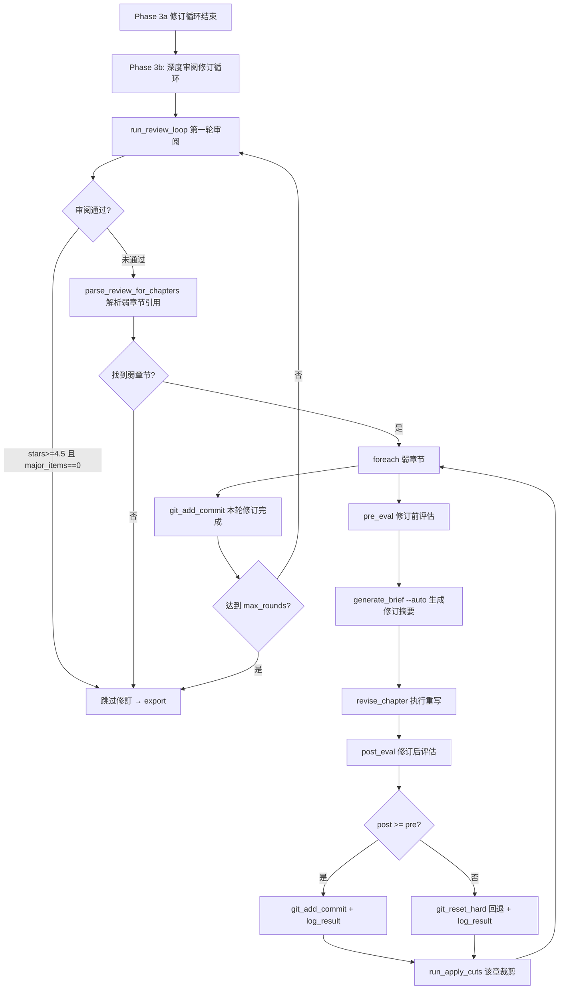

# P1-7: Phase 3b 审阅闭环 — 详细修订方案

## 目标

将 [`pipeline_orchestrator.py`](../pipeline_orchestrator.py) Phase 3b（第451-458行）从"只审不修"改造为完整的 **审阅→修訂→提交** 闭环。

## 现状诊断

### 当前代码（第451-458行）

```python
# Phase 3b: 深度审阅循环
try:
    from revision.review import run_review_loop
    run_review_loop(state, max_tokens=max_tokens, retries=2, max_total_time=1200)
except Exception as e:
    step(f"深度审阅跳过: {e}")
```

`run_review_loop()` 内部已实现多回合审阅（max_rounds=4），产出：
- [`EDIT_LOGS_DIR/review_round*.md`](..) — 审阅报告全文
- [`EDIT_LOGS_DIR/review_round*.json`](..) — 结构化数据（stars / total_items / major_items / raw_review）

但它自身的停止条件仅基于评分（stars≥4.5且无严重问题），**审阅找出问题后没有任何修訂动作**。审阅报告生成后就进入 Phase 4 export。

### 缺失环节

```
当前流程:  审阅 → ☒ 丢弃报告 → export
目标流程:  审阅 → 解析弱章节 → gen_brief → gen_revision → apply_cuts → git commit
                                                ↑_________________________________↓
                                                循环至质量通过或达到上限
```

---

## 详细设计方案

### 整体架构



### 修改文件

#### 1. [`pipeline_orchestrator.py`](pipeline_orchestrator.py) — `run_revision()` 函数 Phase 3b 部分（第451-458行）

**替换为 `_run_review_revision_loop()` 内部函数**（约120行新增），替代现有的 try/except 块。

#### 2. 不新增文件，所有逻辑内聚在 `pipeline_orchestrator.py` 中

---

### 实现步骤

#### 步骤 1: 弱章节解析函数 `_parse_review_weak_chapters()`

**功能**: 从 `EDIT_LOGS_DIR/review_round*.json` 中提取被审阅指出的弱章节编号列表。

**输入**: 无参数（扫描 edit_logs 目录）
**输出**: `list[int]` — 去重后的弱章节编号列表

**解析策略**（从 `raw_review` 文本中提取）:
- 正则匹配 `第?(\d+)\s*章` 出现在负面上下文中（问题/弱点/严重/必须/MAJOR 等关键词附近 ±200 字窗口）
- 正则匹配 `Ch\.?\s*(\d+)` 同样规则
- 若无明确章节引用，从评估文字中间接推断（"前半部分"→前1/3章节，"后半部分"→后1/3章节）
- 上限返回 5 个最频繁被提及的章节

**代码位置**: 作为 `run_revision()` 的嵌套函数，插在第451行之前。

```python
def _parse_review_weak_chapters() -> list:
    """解析深度审阅 JSON，提取被指出的弱章节编号。"""
    import re
    review_jsons = sorted(EDIT_LOGS_DIR.glob("review_round*.json"))
    if not review_jsons:
        return []

    chapter_hits = {}
    negative_keywords = [
        "问题", "弱点", "严重", "必须", "MAJOR", "薄弱", "不足", "缺乏",
        "需改进", "需重写", "拖沓", "断裂", "不连贯", "最差", "最低",
        "weak", "flaw", "poor", "worst", "problem", "fail", "thin",
    ]

    for rj in review_jsons:
        try:
            data = json.loads(rj.read_text(encoding="utf-8"))
            raw = data.get("raw_review", "")
        except Exception:
            continue

        for ch_match in re.finditer(r'(?:第|Ch\.?|Chapter\s?)\s*(\d+)\s*(?:章|节|段)', raw, re.IGNORECASE):
            ch_num = int(ch_match.group(1))
            start = max(0, ch_match.start() - 200)
            context = raw[start:ch_match.start() + 200]
            # 检测上下文是否包含负面关键词
            if any(kw in context for kw in negative_keywords):
                chapter_hits[ch_num] = chapter_hits.get(ch_num, 0) + 1

    if not chapter_hits:
        # 兜底: 无明确章节引用时，取全文中段章节
        chapter_files = sorted(CHAPTERS_DIR.glob("ch_*.md"))
        total = len(chapter_files)
        if total >= 6:
            mid_start = total // 3
            mid_end = 2 * total // 3
            fallback = list(range(mid_start + 1, mid_end + 1))
            return fallback[:5]
        return []

    # 按引用频次降序，取前5
    sorted_chs = sorted(chapter_hits.items(), key=lambda x: -x[1])
    return [ch for ch, _ in sorted_chs[:5]]
```

#### 步骤 2: 审阅修订循环函数 `_run_review_revision_loop()`

**功能**: 替换当前第451-458行的 try/except 块，将审阅、解析、修訂、提交串联为闭环。

**参数**:
- `state: dict` — 流水线状态
- `max_tokens: int` — 模型 max_tokens
- `max_revision_rounds: int = 3` — 审阅修订循环上限
- `retries: int = 2`
- `max_total_time: int = 1200`

**逻辑**:

```python
def _run_review_revision_loop(state, max_tokens, max_revision_rounds=3,
                               retries=2, max_total_time=1200):
    """Phase 3b 审阅修订闭环: 审阅 → 解析弱章节 → 修訂 → 提交 → 循环。"""
    from revision.review import run_review_loop
    from revision.gen_brief import generate_brief, build_auto_brief
    from revision.gen_revision import revise_chapter
    from revision.apply_cuts import run_apply_cuts

    for rnd in range(1, max_revision_rounds + 1):
        banner(f"审阅修订 轮次 {rnd}/{max_revision_rounds}", "=")

        # --- Step A: 深度审阅 ---
        step("提交手稿给裁判模型深度审阅 ...")
        try:
            run_review_loop(state=None, max_tokens=max_tokens, max_rounds=1,
                            retries=retries, max_total_time=max_total_time)
        except Exception as e:
            step(f"深度审阅失败: {e}")
            break

        # --- Step B: 质量检查 ---
        review_jsons = sorted(EDIT_LOGS_DIR.glob("review_round*.json"))
        if not review_jsons:
            step("无审阅 JSON，跳过修訂")
            break

        latest_review = json.loads(review_jsons[-1].read_text(encoding="utf-8"))
        stars = latest_review.get("stars", 0)
        major_items = latest_review.get("major_items", 0)

        step(f"审阅结果: ★{'★' * stars}, {major_items} 严重问题")

        if stars >= 4.5 and major_items == 0:
            step("★★★★½ 且无严重问题 — 质量通过，无需修訂")
            break

        # --- Step C: 解析弱章节 ---
        weak_chapters = _parse_review_weak_chapters()
        if not weak_chapters:
            step("审阅未指出具体弱章节 — 跳过修訂")
            break

        step(f"弱章节: {weak_chapters}")

        # --- Step D: 逐章修訂 ---
        any_improved = False
        for ch_num in weak_chapters:
            ch_file = CHAPTERS_DIR / f"ch_{ch_num:02d}.md"
            if not ch_file.exists():
                continue

            banner(f"  修訂 第 {ch_num} 章 [{weak_chapters.index(ch_num)+1}/{len(weak_chapters)}]", ".")

            # D1. 修订前评估
            try:
                pre_eval = evaluate_chapter(ch_num, retries=retries, max_total_time=600)
                pre_score = parse_score(pre_eval, "overall_score")
            except Exception:
                pre_score = 0

            # D2. 生成修订摘要（--auto 模式，三源交叉引用）
            brief_file = BRIEFS_DIR / f"ch{ch_num:02d}_review_rnd{rnd}.md"
            try:
                ch, brief_text = build_auto_brief()
                if ch is None:
                    ch = ch_num
                brief_file.write_text(brief_text, encoding="utf-8")
                if not brief_text.strip():
                    brief_content = (f"# 修订摘要: 第 {ch_num} 章\n\n"
                                     f"## 来源: 深度审阅 轮次 {rnd}\n\n"
                                     f"审阅指出本章需要改进。请基于最新评估和审阅意见进行修订。\n")
                    brief_file.write_text(brief_content, encoding="utf-8")
            except Exception:
                brief_content = (f"# 修订摘要: 第 {ch_num} 章\n\n"
                                 f"## 来源: 深度审阅 轮次 {rnd}\n\n"
                                 f"审阅指出本章需要改进。请基于最新评估和审阅意见进行修订。\n")
                brief_file.write_text(brief_content, encoding="utf-8")

            # D3. 执行修订
            step(f"按摘要修订第 {ch_num} 章 (retries={retries}, 总超时={max_total_time}s) ...")
            try:
                revise_chapter(ch_num, brief_file, max_tokens=max_tokens,
                               retries=retries, max_total_time=max_total_time)
            except Exception as e:
                step(f"修订第 {ch_num} 章失败: {e}")
                continue

            # D4. 修订后评估
            try:
                post_eval = evaluate_chapter(ch_num, retries=retries, max_total_time=600)
                post_score = parse_score(post_eval, "overall_score")
            except Exception:
                post_score = 0

            word_count = len(ch_file.read_text(encoding="utf-8").replace(" ", "").replace("\n", ""))

            step(f"第 {ch_num} 章: {pre_score} -> {post_score}")

            # D5. 提交或回退
            if post_score >= pre_score:
                commit_hash = git_add_commit(
                    f"审阅修订 轮次{rnd}: ch{ch_num:02d} {pre_score}->{post_score}"
                )
                log_result(commit_hash, f"review-rev-ch{ch_num:02d}", post_score,
                           word_count, "keep",
                           f"审阅修订 轮次{rnd}: ch{ch_num:02d} {pre_score}->{post_score}")
                any_improved = True
            else:
                step(f"修订使评分下降 ({post_score} < {pre_score})，回退")
                git_reset_hard("HEAD")
                log_result("reverted", f"review-rev-ch{ch_num:02d}", post_score,
                           word_count, "discard",
                           f"审阅修订 轮次{rnd}: ch{ch_num:02d} 倒退 {pre_score}->{post_score}")

            # D6. 应用裁剪
            try:
                run_apply_cuts(str(ch_num), ["OVER-EXPLAIN", "REDUNDANT"], min_fat=15)
            except Exception as e:
                step(f"apply_cuts 第 {ch_num} 章跳过: {e}")

        # --- Step E: 提交本轮修订 ---
        if any_improved:
            commit_hash = git_add_commit(f"审阅修订 轮次{rnd} 完成: 修訂 {len(weak_chapters)} 章")
            log_result(commit_hash, f"review-revision-round-{rnd}", 0,
                       count_words_in_chapters(), "cycle",
                       f"审阅修订 轮次{rnd}: 修訂 {len(weak_chapters)} 章")

        state["review_revision_round"] = rnd
        save_state(state)

    # 最终全文评估
    step("审阅修订后全文评估 ...")
    try:
        full_eval = evaluate_full(max_total_time=600)
        novel_score = parse_score(full_eval, "novel_score")
        if novel_score < 0:
            novel_score = parse_score(full_eval, "overall_score")
        step(f"最终小说评分: {novel_score}")
        state["novel_score"] = novel_score
    except Exception:
        pass

    banner("审阅修订闭环 完成")
```

#### 步骤 3: 替换 Phase 3b 调用点

将 [`pipeline_orchestrator.py`](pipeline_orchestrator.py:451) 第451-458行：

```python
    # =========================================================
    # Phase 3b: 深度审阅循环
    # =========================================================
    try:
        from revision.review import run_review_loop
        run_review_loop(state, max_tokens=max_tokens, retries=2, max_total_time=1200)
    except Exception as e:
        step(f"深度审阅跳过: {e}")
```

替换为：

```python
    # =========================================================
    # Phase 3b: 审阅修订闭环
    # =========================================================
    try:
        _run_review_revision_loop(state, max_tokens, max_revision_rounds=3,
                                   retries=2, max_total_time=1200)
    except Exception as e:
        step(f"审阅修订闭环跳过: {e}")
```

同时将 `_parse_review_weak_chapters()` 和 `_run_review_revision_loop()` 两个内部函数放在 `run_revision()` 函数体内、Phase 3b 调用点之前（建议插在第449行之前）。

---

### 新增导入

`_run_review_revision_loop()` 内部惰性导入以下模块（已存在于项目，无需修改）:
- `revision.review.run_review_loop` — 已在 Phase 3b 导入
- `revision.gen_brief.build_auto_brief` — **新增导入**
- `revision.gen_revision.revise_chapter` — 已在 Phase 3a 导入
- `revision.apply_cuts.run_apply_cuts` — 已在 Phase 3a 导入

---

### 不修改的文件

- [`revision/review.py`](revision/review.py) — `run_review_loop()` 保持不变，作为独立审阅工具
- [`revision/gen_brief.py`](revision/gen_brief.py) — `build_auto_brief()` 已在 P1-6 实现完毕
- [`revision/gen_revision.py`](revision/gen_revision.py) — 保持不变
- [`revision/apply_cuts.py`](revision/apply_cuts.py) — 保持不变（仍为占位实现，但不影响闭环逻辑）

---

### 边界情况处理

| 边界情况 | 处理策略 |
|---------|---------|
| 审阅 JSON 不包含章节引用 | `_parse_review_weak_chapters()` 返回中段 1/3~2/3 章节作为兜底 |
| `build_auto_brief()` 失败 | fallback 生成最小摘要（基于审阅文本片段） |
| `revise_chapter()` 失败 | 捕获异常后跳过该章，继续下一章 |
| 修订后评分下降 | `git_reset_hard("HEAD")` 回退，记录到 results.tsv |
| 全部章节修订后评分无改进 | `any_improved=False`，仅提交审阅结果 |
| 审阅直接通过质量门槛 | 跳过全部修訂，直接进入 export |

---

### 与 Phase 3a 的关系

Phase 3a（修订循环）在第310-449行运行，采用 **共识驱动** 模式（reader_panel → consensus → 逐章修訂）。Phase 3b 在其后运行，采用 **裁判驱动** 模式（全手稿深度审阅 → 弱章节定位 → 逐章修訂）。两者互补：

| 维度 | Phase 3a | Phase 3b |
|------|----------|----------|
| 触发源 | 读者评审团共识 | LLM 裁判全手稿审阅 |
| 覆盖范围 | 最多 5 个共识章节 | 审阅指出的弱章节（最多5） |
| 摘要来源 | panel_data 驱动 | --auto 三源交叉引用 |
| 修订次数 | 每循环 1 次 | 最多 3 轮 |
| 停止条件 | 平台期检测 | 质量通过 或 轮次耗尽 |

---

### 测试验证点

1. `_parse_review_weak_chapters()` 在样本 review JSON 上能正确提取弱章节编号
2. 空审阅 JSON 时返回兜底中段章节
3. 修订评分改进后正确 commit，退步后正确 rollback
4. 审阅直通（stars≥4.5）时跳过全部修訂
5. 单章修订失败不阻塞后续章节