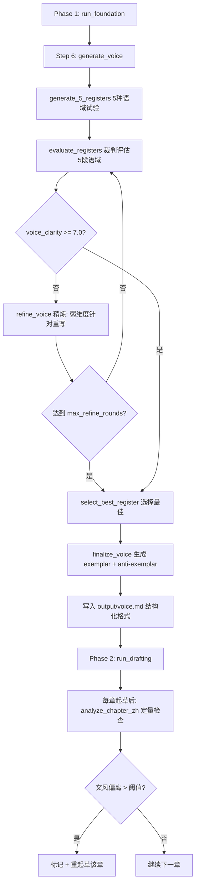

# P2-9: Voice Discovery 子循环 — 详细修订方案

## 目标

将 [`foundation/gen_voice.py`](foundation/gen_voice.py) 从"单次生成即接受"改造为完整的 **5段语域试验 → 评估 → 选择 → 精炼 → exemplar + anti-exemplar** 子循环，并集成 [`voice_fingerprint.py`](voice_fingerprint.py) 到起草阶段进行文风一致性检查。

此方案适用于**所有中文小说类型**（现实/言情/历史/悬疑/科幻等），已去除英文原版奇幻小说的体裁偏见。

## 现状诊断

### 当前 [`gen_voice.py`](foundation/gen_voice.py)（110行）

```
generate_voice() 流程:
  1. 读 story_summary + world.md + characters.md + voice 模板 Part 1
  2. call_writer → 5种风格试写 (各300-500字)
  3. call_writer → 选择最佳风格 → Part 2 文风身份
  4. 合并模板 Part 1 + 生成 Part 2 → 写入 output/voice.md
```

**问题**：
- 无质量评估：生成的文风不经裁判模型打分，直接写入
- 无迭代精炼：如果文风定义模糊或范例含 AI 痕迹，没有修正机会
- 输出格式与 [`templates/voice.md`](templates/voice.md) 期望的结构化字段不完全对齐

### 已有但未集成的资产

| 文件 | 行数 | 功能 | 集成状态 |
|------|------|------|----------|
| [`voice_fingerprint.py`](voice_fingerprint.py) | 202行 | 全文章节定量文风分析 | 独立工具，pipeline 从未调用 |
| [`prompts/eval_judge_prompts.py`](prompts/eval_judge_prompts.py:200) | 维度12 | `voice_clarity` 评估维度 | 已存在于 foundation eval |
| [`revision/gen_brief.py`](revision/gen_brief.py:90) | `extract_voice_rules()` | 从 voice.md 动态提取写作规则 | 已实现 |

### 体裁偏见问题

[`voice_fingerprint.py`](voice_fingerprint.py:17-58) 硬编码了三组英文奇幻小说词汇域：
- `WELL_MUSICAL`（49词）— "pitch, tone, chord, bell, clapper, fugue..."
- `WELL_TRADE`（38词）— "bronze, forge, anvil, lathe, ledger, contract..."
- `WELL_BODY`（49词）— "eye, chest, jaw, pulse, tremor, flinch..."

这些词汇对现实题材/言情/历史/悬疑/科幻等中文小说类型完全无意义。**本方案将替换为从 voice.md 动态提取的词汇域。**

### 下游依赖链

```
gen_voice.py → output/voice.md
                ├── evaluation/evaluate.py:214
                ├── prompts/chapter_prompts.py:34
                ├── prompts/revision_prompts.py:33
                ├── revision/gen_brief.py:90
                └── prompts/world_prompts.py:28
```

---

## 详细设计方案

### 整体架构



### 修改文件

#### 1. [`foundation/gen_voice.py`](foundation/gen_voice.py) — 核心改造（110行 → 约350行）

**新增函数**：

| 函数 | 功能 |
|------|------|
| `generate_5_registers()` | 5种语域试验段落生成 |
| `evaluate_registers()` | 调用 `call_judge` 对5段语域逐一打分 |
| `refine_voice()` | 针对弱维度精炼（最多2轮） |
| `generate_voice()` | 主函数：编排子循环（接口不变） |

#### 2. [`voice_fingerprint.py`](voice_fingerprint.py) — 去体裁偏见

新增 `extract_vocabulary_wells_from_voice()` 和 `analyze_chapter_zh()`：
- `extract_vocabulary_wells_from_voice()` — 从 `output/voice.md` 的 "Vocabulary Register" 节动态提取本书专属词汇域
- `analyze_chapter_zh()` — 中文版章节文风分析，词汇域动态提取，回退到通用中文词频分析
- 保留原始 `analyze_chapter()` 和 `WELL_*` 常量（不删除），向后兼容

#### 3. [`pipeline_orchestrator.py`](pipeline_orchestrator.py) — 两处修改

- **Phase 1 `run_foundation()`**: `generate_voice()` 调用保持不变（接口兼容）
- **Phase 2 `run_drafting()`**: 每章起草成功后调用 `analyze_chapter_zh()` 检查文风一致性

#### 4. 不修改的文件

- [`templates/voice.md`](templates/voice.md) — 保持不变，Part 1 禁区已完整
- [`prompts/eval_judge_prompts.py`](prompts/eval_judge_prompts.py) — 保持不变，voice_clarity 维度已就绪

---

### 实现步骤

#### 步骤 1: 拆分现有 `generate_voice()` 为子函数

**`_build_register_prompt()`** — 构建5段语域试验 prompt：

```python
def _build_register_prompt(story: str, world: str, chars: str) -> str:
    return f"""请为以下小说概念试写 5 种不同文风的小说开头段落（每种约 300-500 字）。

【故事梗概】
{story[:2000]}

【世界观设定参考】
{world[:2000]}

【角色参考】
{chars[:2000]}

请依次写出：

## 风格 1：简约式
（短句、精准、留白多。）

## 风格 2：温暖式
（亲密、感官丰富、情感充沛。）

## 风格 3：冷峻式
（客观、疏离、像纪录片旁白。）

## 风格 4：诗性式
（意象密集、语言有音乐性。）

## 风格 5：口语式
（像有人在讲故事，直接、有个性。）

对每种风格，写完后简要标注这种风格适合这个故事的理由（1-2 句）。"""
```

**`_build_select_prompt()`** — 构建选择+精炼 prompt（结构化输出）：

```python
def _build_select_prompt(registers_text: str, eval_scores: dict = None) -> str:
    eval_section = ""
    if eval_scores:
        eval_section = f"""

【裁判评估结果】
{eval_scores}
请优先选择评分最高的风格，并针对弱维度进行精炼。"""

    return f"""以下是 5 种候选文风及其试写段落：

{registers_text}
{eval_section}

请选择最适合这个故事的一种风格，并按以下结构化格式输出：

## 选定风格
（风格名称和一句话定位）

### Tone（基调）
（具体描述本小说的笔触）

### Sentence Rhythm（句式节奏）
（短句/长句分别用于什么场景）

### Vocabulary Register（词汇域）
（这个世界听起来像什么？列出3个词汇领域及其关键词）

### POV and Tense（视角与时态）

### Dialogue Conventions（对话惯例）

### Exemplar Passages（范例段落）
（3-5段足以代表本书文风的段落）

### Anti-Exemplars（反范例段落）
（3-5段展示不是本书文风的段落）

### 本小说文风规则
（列出 5-10 条具体写作规则）"""
```

**`generate_5_registers()`** — 5段语域试验：

```python
def generate_5_registers(story: str, world: str, chars: str, max_tokens: int = 16000) -> str:
    prompt = _build_register_prompt(story, world, chars)
    step("调用 LLM 试写 5 种文风 ...")
    return call_writer(prompt, system=VOICE_SYSTEM_PROMPT, max_tokens=max_tokens, max_total_time=300)
```

#### 步骤 2: 新增裁判评估函数 `evaluate_registers()`

```python
def evaluate_registers(registers_text: str, story: str) -> dict:
    """调用裁判模型评估5段语域试验。返回评分 JSON。"""
    eval_prompt = f"""请评估以下5段语域试验的文风质量。

【故事梗概】
{story[:1000]}

【5段语域试验】
{registers_text}

请按以下维度对每种风格打分（1-10）：

1. 风格契合度：该风格是否适合这个故事的类型、主题和情感基调？
2. 执行质量：试写段落本身的文学品质如何？
3. 可持续性：该风格能否在长篇写作中持续产出？
4. AI痕迹检查：是否存在AI套话、句式模板等机器特征？
5. 独特性和辨识度：该风格是否有鲜明个性？

输出 JSON：
{{
  "registers": [...],
  "best_register": 1,
  "best_register_name": "风格名",
  "overall_score": 7.5
}}"""

    step("调用裁判模型评估 5 段语域 ...")
    result = call_judge(eval_prompt, max_tokens=4096, max_total_time=300)

    try:
        import re
        json_match = re.search(r'\{[\s\S]*\}', result)
        if json_match:
            return json.loads(json_match.group())
    except Exception:
        pass

    return {"overall_score": 6.0, "best_register": 1, "raw_result": result}
```

#### 步骤 3: 新增精炼函数 `refine_voice()`

```python
def refine_voice(registers_text: str, eval_result: dict, best_register: int,
                 story: str, max_tokens: int = 8000) -> str:
    """针对裁判评估指出的弱维度，精炼最佳语域。"""
    weaknesses = []
    if "registers" in eval_result:
        reg = eval_result["registers"][best_register - 1]
        weaknesses.append(f"最大弱点: {reg.get('weakness', '未指定')}")
        weaknesses.append(f"改进方向: {reg.get('improvement', '未指定')}")

    weaknesses_text = "\n".join(weaknesses)

    refine_prompt = f"""以下是裁判模型对语域试验的评估结果：

{weaknesses_text}

【原始试写段落】
{registers_text}

请基于裁判反馈，精炼最佳风格（{eval_result.get('best_register_name', '最佳风格')}），
按结构化格式输出完整的文风身份。要求：

1. Exemplar Passages 必须不含 AI 套话
2. Anti-Exemplars 必须具体展示怎么写错
3. 文风规则必须是可操作的、可量化的
4. 句式节奏必须给出具体场景对应

{_build_select_prompt(registers_text)}"""

    step("调用 LLM 精炼最佳文风 ...")
    return call_writer(refine_prompt, max_tokens=max_tokens, max_total_time=300)
```

#### 步骤 4: 重写主函数 `generate_voice()`（子循环编排）

```python
def generate_voice(max_tokens: int = 16000) -> None:
    """Voice Discovery 子循环：5段语域 → 评估 → 精炼 → 输出。"""
    cfg = config
    cfg.load()

    story = cfg.story_summary
    world_path = OUTPUT_DIR / "world.md"
    world = world_path.read_text(encoding="utf-8") if world_path.exists() else ""
    chars_path = OUTPUT_DIR / "characters.md"
    chars = chars_path.read_text(encoding="utf-8") if chars_path.exists() else ""

    voice_template = TEMPLATES_DIR / "voice.md"
    existing_voice = voice_template.read_text(encoding="utf-8") if voice_template.exists() else ""

    # Step A: 5段语域试验
    registers_text = generate_5_registers(story, world, chars, max_tokens)

    # Step B: 裁判评估
    eval_result = evaluate_registers(registers_text, story)
    best_score = eval_result.get("overall_score", 6.0)
    best_register = eval_result.get("best_register", 1)
    step(f"语域评估: {best_score}, 最佳: {eval_result.get('best_register_name', '#' + str(best_register))}")

    # Step C: 精炼循环（最多 2 轮，阈值 7.0）
    MAX_REFINE_ROUNDS = 2
    VOICE_THRESHOLD = 7.0
    voice_identity = None

    if best_score >= VOICE_THRESHOLD:
        step(f"语域评估 {best_score} >= {VOICE_THRESHOLD} — 直接生成文风身份")
        voice_identity = call_writer(_build_select_prompt(registers_text), max_tokens=4096)
    else:
        for rnd in range(1, MAX_REFINE_ROUNDS + 1):
            step(f"语域精炼 轮次 {rnd}/{MAX_REFINE_ROUNDS} (当前分: {best_score})")
            voice_identity = refine_voice(registers_text, eval_result, best_register, story, max_tokens)
            eval_result = evaluate_registers(f"【精炼后文风身份】\n{voice_identity}", story)
            best_score = eval_result.get("overall_score", 6.0)
            step(f"精炼后评估: {best_score}")
            if best_score >= VOICE_THRESHOLD:
                step("精炼评分通过！")
                break

    if voice_identity is None:
        voice_identity = call_writer(_build_select_prompt(registers_text), max_tokens=4096)

    # Step D: 合并 Part 1 + Part 2 → output/voice.md
    full_voice = existing_voice.rstrip() + "\n\n---\n\n" + voice_identity
    voice_path = OUTPUT_DIR / "voice.md"
    voice_path.write_text(full_voice, encoding="utf-8")
    step(f"文风定义已保存: {voice_path} (评估分: {best_score})")
```

#### 步骤 4.5: voice_fingerprint.py 去体裁偏见（新增函数）

在 [`voice_fingerprint.py`](voice_fingerprint.py) 中新增两个函数，替代硬编码的奇幻小说词汇域。

**`extract_vocabulary_wells_from_voice()`** — 从 voice.md 动态提取本书专属词汇域：

```python
def extract_vocabulary_wells_from_voice(voice_path: Path = None) -> list[set]:
    """从 voice.md 的 Vocabulary Register 节动态提取本书专属词汇域。

    读取 output/voice.md，定位 "Vocabulary Register" 节，
    提取 LLM 生成的该书专属关键词列表（如"本书的词汇来自三个领域：
    商业暗语 / 身体感官 / 城市空间"），构建对应的词汇集合。

    如果 voice.md 未定义词汇域或格式不支持解析，
    则返回空列表，由 analyze_chapter_zh() 回退到通用中文高频词频分析。
    """
    import re

    if voice_path is None:
        voice_path = OUTPUT_DIR / "voice.md"

    if not voice_path.exists():
        return []

    voice_text = voice_path.read_text(encoding="utf-8")

    # 定位 "Vocabulary Register" 节
    vocab_section_match = re.search(
        r'###\s*Vocabulary Register.*?\n(.*?)(?=\n###|\n##|\Z)',
        voice_text, re.DOTALL | re.IGNORECASE
    )
    if not vocab_section_match:
        return []

    vocab_text = vocab_section_match.group(1).strip()

    # 策略1: 解析 LLM 生成的结构化关键词列表
    wells = []
    well_pattern = re.compile(
        r'\d+\.\s*\*{0,2}(.+?)\*{0,2}\s*[：:]\s*(.+)',
        re.MULTILINE
    )
    for match in well_pattern.finditer(vocab_text):
        keywords_str = match.group(2).strip()
        keywords = set()
        for token in re.split(r'[,，、/\s]+', keywords_str):
            token = token.strip().lower()
            if token and len(token) >= 2:
                keywords.add(token)
        if keywords:
            wells.append(keywords)

    if wells:
        return wells[:3]

    # 策略2: 回退——从整段文字中提取被引号/括号标注的关键词
    quoted = set(re.findall(r'[「「](.+?)[」」]', vocab_text))
    if quoted and len(quoted) >= 5:
        return [quoted]

    return []
```

**`analyze_chapter_zh()`** — 中文版章节文风分析，词汇域动态提取：

```python
def analyze_chapter_zh(path: Path, vocab_wells: list[set] = None) -> dict:
    """中文版章节文风分析。

    与 analyze_chapter() 功能相同，但词汇域从 voice.md 动态提取，
    而非硬编码奇幻小说专用词汇。保留原始 analyze_chapter() 向后兼容。
    """
    text = path.read_text(encoding="utf-8")
    chars = text.replace(" ", "").replace("\n", "").replace("\r", "")
    char_count = len(chars)

    # 句子分析
    sentences = re.split(r'[。！？!?]+', text)
    sentences = [s.strip() for s in sentences if len(s.strip()) >= 3]
    sent_lengths = [len(s.replace(" ", "")) for s in sentences]

    # 段落分析
    paragraphs = [p.strip() for p in text.split('\n\n')
                  if p.strip() and not p.strip().startswith('#') and p.strip() != '---']
    para_lengths = [len(p.replace(" ", "")) for p in paragraphs]

    # 词汇域统计（动态）
    if vocab_wells is None:
        vocab_wells = extract_vocabulary_wells_from_voice()
    well_counts = []
    if vocab_wells:
        for well in vocab_wells:
            count = sum(1 for word in well if word in text.lower())
            well_counts.append(count)

    # 对话分析
    dialogue_matches = re.findall(r'["""][^"""]*["""]|「[^」]*」', text)
    dialogue_chars = sum(len(m.replace(" ", "")) for m in dialogue_matches)
    dialogue_ratio = dialogue_chars / char_count if char_count > 0 else 0

    # 破折号密度
    em_dashes = text.count('—') + text.count('--')
    em_per_1k = (em_dashes / char_count) * 1000 if char_count > 0 else 0

    # 抽象名词密度（中文通用版）
    ABSTRACT_ZH = {
        "感觉", "感受", "概念", "想法", "本质", "性质", "意义",
        "意识", "认知", "理解", "可能", "存在", "关系", "影响",
        "作用", "过程", "结果", "方式", "程度", "价值",
    }
    abstract_count = sum(1 for w in ABSTRACT_ZH if w in text)
    abstract_per_1k = (abstract_count / char_count) * 1000 if char_count > 0 else 0

    # 过渡词密度
    transition_keywords = [
        "然而", "但是", "此外", "而且", "因此", "于是", "不过", "同时", "另外"
    ]
    transition_count = sum(1 for w in transition_keywords if w in text)
    transition_per_1k = (transition_count / char_count) * 1000 if char_count > 0 else 0

    # 片段比例
    fragments = sum(1 for l in sent_lengths if l < 10)
    long_sents = sum(1 for l in sent_lengths if l > 50)

    return {
        "char_count": char_count,
        "sentence_count": len(sentences),
        "paragraph_count": len(paragraphs),
        "avg_sentence_length": round(statistics.mean(sent_lengths), 1) if sent_lengths else 0,
        "sentence_length_std": round(statistics.stdev(sent_lengths), 1) if len(sent_lengths) > 1 else 0,
        "sentence_length_cv": round(statistics.stdev(sent_lengths) / statistics.mean(sent_lengths), 3) if sent_lengths and statistics.mean(sent_lengths) > 0 else 0,
        "min_sentence": min(sent_lengths) if sent_lengths else 0,
        "max_sentence": max(sent_lengths) if sent_lengths else 0,
        "fragments_pct": round(fragments / len(sentences) * 100, 1) if sentences else 0,
        "long_sentences_pct": round(long_sents / len(sentences) * 100, 1) if sentences else 0,
        "avg_paragraph_length": round(statistics.mean(para_lengths), 1) if para_lengths else 0,
        "paragraph_length_std": round(statistics.stdev(para_lengths), 1) if len(para_lengths) > 1 else 0,
        "well_counts": well_counts if well_counts else [0, 0, 0],
        "well_total_per_1k": round(sum(well_counts) / char_count * 1000, 1) if char_count > 0 and well_counts else 0,
        "dialogue_ratio": round(dialogue_ratio, 3),
        "em_dash_per_1k": round(em_per_1k, 1),
        "abstract_per_1k": round(abstract_per_1k, 1),
        "transition_per_1k": round(transition_per_1k, 1),
    }
```

**兼容性**：保留原始 `analyze_chapter()` 和 `WELL_*` 常量（不删除），`analyze_chapter_zh()` 作为新入口。`voice_fingerprint.main()` 默认改为调用 `analyze_chapter_zh()`。

#### 步骤 5: Phase 2 集成 voice fingerprint（体裁无关版）

在 [`pipeline_orchestrator.py`](pipeline_orchestrator.py) 的 `run_drafting()` 中，每章起草成功后（L217 `step(f"起草 第 {ch}/{total} 章 完成 ✓")` 之后）插入：

```python
            # Voice fingerprint 检查（每章起草后）
            try:
                from voice_fingerprint import analyze_chapter_zh, extract_vocabulary_wells_from_voice
                ch_path = CHAPTERS_DIR / f"ch_{ch:02d}.md"
                vocab_wells = extract_vocabulary_wells_from_voice()
                metrics = analyze_chapter_zh(ch_path, vocab_wells=vocab_wells)
                # 简单检查
                dialogue_ratio = metrics.get("dialogue_ratio", 0)
                em_dash_per_1k = metrics.get("em_dash_per_1k", 0)
                abstract_per_1k = metrics.get("abstract_per_1k", 0)
                transition_per_1k = metrics.get("transition_per_1k", 0)

                warnings = []
                if dialogue_ratio == 0:
                    warnings.append("无对话")
                if dialogue_ratio > 0.6:
                    warnings.append(f"对话过多 ({dialogue_ratio:.1%})")
                if em_dash_per_1k > 5:
                    warnings.append(f"破折号密度过高 ({em_dash_per_1k:.1f}/千字)")
                if abstract_per_1k > 30:
                    warnings.append(f"抽象名词密度过高 ({abstract_per_1k:.1f}/千字)")
                if transition_per_1k > 15:
                    warnings.append(f"过渡词密度过高 ({transition_per_1k:.1f}/千字)")

                if warnings:
                    step(f"⚠ 文风指纹警告 (第 {ch} 章): {', '.join(warnings)}")
                else:
                    step(f"文风指纹: ✓ (对话 {dialogue_ratio:.0%}, "
                         f"破折号 {em_dash_per_1k:.1f}/千字)")
            except Exception as e:
                step(f"文风指纹跳过: {e}")
```

**关键变化**：
- 从 `analyze_chapter()` 改为 `analyze_chapter_zh()`
- 先调用 `extract_vocabulary_wells_from_voice()` 动态获取词汇域
- 新增 `transition_per_1k` 过渡词密度检查（中文过渡词）
- 抽象名词集合改为中文通用版（而非英文硬编码的 "sense, feeling, notion..."）
- 词汇域从 `output/voice.md` 的 Vocabulary Register 节动态提取，适配所有小说类型

---

### 边界情况处理

| 边界情况 | 处理策略 |
|---------|---------|
| 裁判评估 JSON 解析失败 | 默认评分 6.0，直接进入精炼循环 |
| 精炼后评分仍 < 7.0 | 达到 max_refine_rounds 后接受最后结果（不阻塞 pipeline） |
| `voice_fingerprint.py` 导入/执行失败 | try/except 静默跳过，不阻塞起草 |
| voice.md 未定义词汇域 | `extract_vocabulary_wells_from_voice()` 返回空列表，`analyze_chapter_zh()` 回退到通用中文词频分析 |
| voice 模板 Part 1 不存在 | 使用空字符串，仅输出 Part 2 |
| 故事梗概/世界观/角色文件不存在 | 使用空字符串，仍可生成通用文风 |

---

### 与现有流程的兼容性

| 调用点 | 变更 |
|--------|------|
| [`pipeline_orchestrator.py`](pipeline_orchestrator.py:111) `generate_voice()` | 接口不变，内部逻辑增强 |
| [`evaluation/evaluate.py`](evaluation/evaluate.py:214) 评估注入 | 不受影响（仍读取 `output/voice.md`） |
| [`prompts/chapter_prompts.py`](prompts/chapter_prompts.py:34) 章节起草 | 不受影响 |
| [`revision/gen_brief.py`](revision/gen_brief.py:90) `extract_voice_rules()` | 受益于结构化输出，解析更可靠 |
| [`voice_fingerprint.py`](voice_fingerprint.py) 原有函数 | 完全保留向后兼容 |

---

### 测试验证点

1. `generate_5_registers()` 生成5段不同风格段落，每段 300-500 字
2. `evaluate_registers()` 裁判返回可解析的 JSON 格式评分
3. 评分 >= 7.0 时跳过精炼，直接生成文风身份
4. 评分 < 7.0 时进入精炼循环，精炼后评分提升
5. 最终 `output/voice.md` 包含结构化字段（Tone / Sentence Rhythm / Vocabulary Register / POV / Dialogue Conventions / Exemplar / Anti-Exemplar / 规则清单）
6. `extract_vocabulary_wells_from_voice()` 从 voice.md 正确解析词汇域关键词
7. `analyze_chapter_zh()` 在起草阶段正确识别文风偏离
8. 文风指纹警告不阻塞 pipeline 正常推进
9. 原始 `analyze_chapter()` 和 `WELL_*` 常量不变，向后兼容