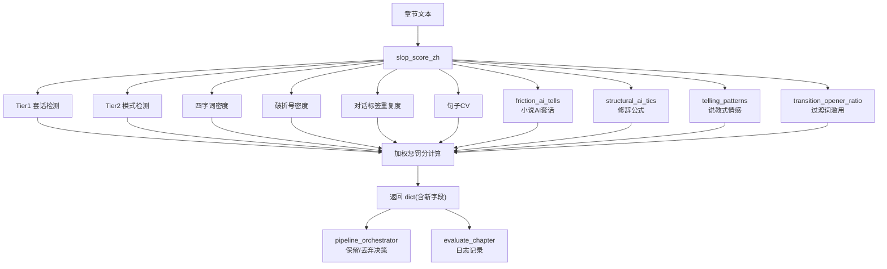
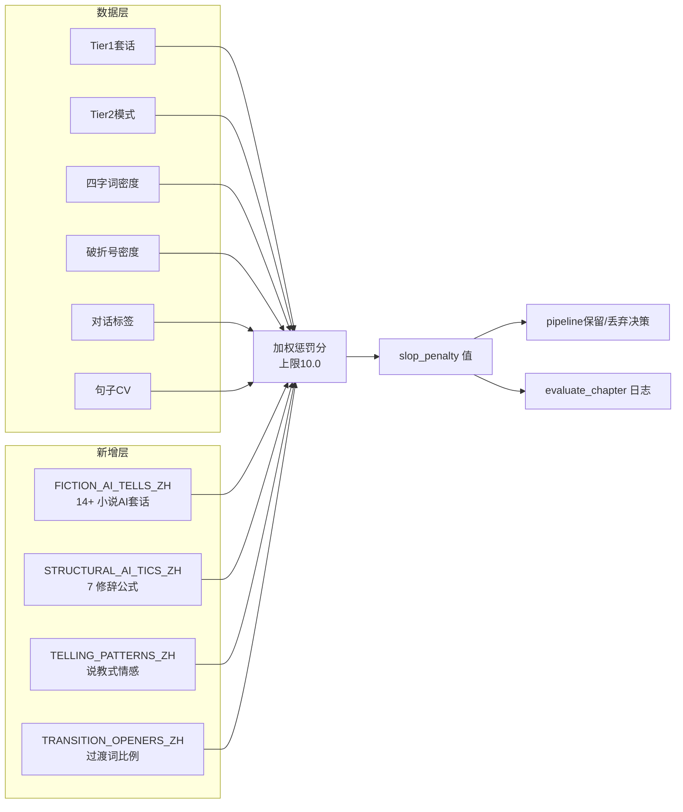
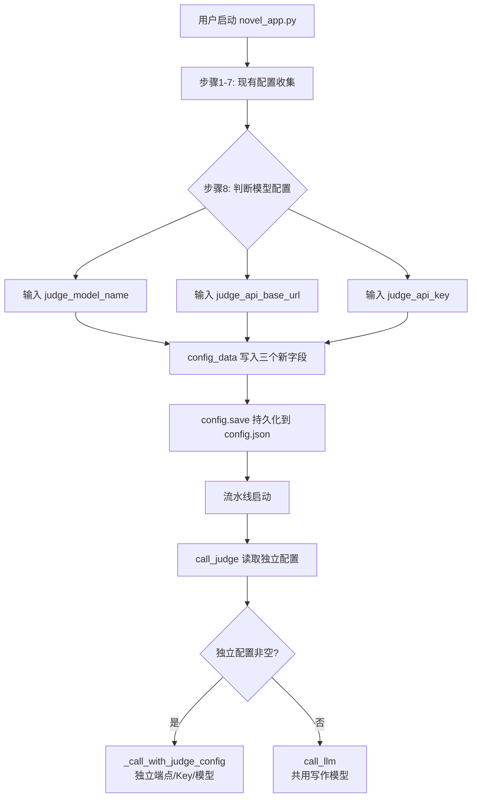

# P3 精细校准 — 详细实施方案

## 状态
- 创建日期: 2026-06-18
- 依赖: P0/P1/P2 全部完成
- 涉及文件: `evaluation/evaluate.py`, `novel_app.py`, `plans/quality_alignment_tracker.md`

---

## P3-12: 机械 slop 增强 — `evaluation/evaluate.py` 的 `slop_score_zh()`

### 目标
将英文原版 [`evaluate.py`](../evaluate.py:88-120) 的四项增强检测器移植为中文体裁无关版本，集成到 [`slop_score_zh()`](../evaluation/evaluate.py:67)。

### 核心约束
**所有新增检测必须体裁无关** — 适用于悬疑/言情/历史/都市/科幻等所有中文小说类型。不依赖题材关键词（如"剑""魔法""修仙"）。

### 上下文



### 子项 A: FICTION_AI_TELLS — 小说 AI 套话检测

**英文原版参考** ([`evaluate.py:88-104`](../evaluate.py:88)):
14 种英文小说套话模式。需翻译并适配为中文等价表达。

**中文模式设计** (体裁无关):

```python
FICTION_AI_TELLS_ZH = [
    # 感官/情绪套话（不绑定任何题材）
    r"一阵\S{0,3}的感觉",
    r"一种\S{1,4}的感觉",
    r"不禁感到",
    r"不由得",
    r"空气中弥漫着",
    r"瞪大了眼睛",
    r"睁大了双眼",
    r"一阵\S{0,5}(?:涌上|袭来|席卷)",
    r"一股\S{0,5}(?:涌上|袭来)",
    r"一丝\S{0,3}(?:涌上|掠过)",
    # 心跳/呼吸套话
    r"心(?:脏)?(?:在胸腔里)?狂跳",
    r"心脏剧烈(?:地)?跳动",
    r"深吸一口气",
    r"(?:长长地|缓缓地)?吐出一口气",
    # 发型/外貌套话（适配所有时代/类型）
    r"(?:乌黑|黑色|棕色|银白|花白)的?(?:长发|短发|发丝|头发)\S{0,5}(?:散落|倾泻|垂落|披散)",
    # 眼神套话
    r"锐利的目光",
    r"深邃的眼眸",
    r"眼神中(?:闪过|透出|带着)\S{1,6}",
    # 笑容套话
    r"会心一笑",
    r"嘴角(?:微微)?(?:上扬|扬起|勾起)",
    r"意味深长的(?:笑|笑容|微笑)",
    # 情感波动套话
    r"(?:他|她|它|他们|她们)(?:感到|觉得)\S{0,3}(?:一阵|一股|一丝)\S{1,6}",
    # 沉默/寂静套话
    r"(?:沉默|寂静|安静)(?:沉重|压抑|令人窒息|蔓延)",
    r"(?:谁也没有说话|没有人开口)",
    # 涌动/苏醒套话
    r"(?:某种|什么东西|一丝\S{0,3})(?:在体内|在心里|在心底)(?:涌动|苏醒|蔓延|升起)",
    # 松了口气套话
    r"(?:暗自|悄悄|终于)(?:松了口气|松了一口气|放下心来)",
]
```

**说明**: 以上模式不包含任何题材关键词。`深吸一口气` 从原 Tier2 提升到此类别作为 AI 小说套话（语义级），原 Tier2 的 `深深地吸了一口气` 保留。两者分属不同统计维度，重叠计入不影响惩罚的合理性（模式不同意味着不同角度的 AI 痕迹）。

### 子项 B: STRUCTURAL_AI_TICS — 结构修辞公式检测

**英文原版参考** ([`evaluate.py:107-114`](../evaluate.py:107)): 6 种英文修辞公式。

**中文模式设计** (体裁无关):

```python
STRUCTURAL_AI_TICS_ZH = [
    # "我不是说X，我是说Y" 句式
    r"(?:我)?不是(?:说|指|要|在)\S{1,20}(?:而是|我是)(?:说|指|要|在)\S{1,20}",
    # "这意味着要么X，要么Y"
    r"这意味着(?:要么|要不|不是)\S{1,20}(?:要么|就是|便是)\S{1,20}",
    # "这是有区别的" 收尾公式
    r"(?:这|那)(?:是|就是|才是)(?:有区别|有差别的|两回事|不同的)",
    # "那是两回事"
    r"那(?:是|就是)两回事",
    # "不仅仅是X，更是Y"（原Tier1已有基础版，此处增强为捕获更完整的句式）
    r"不仅仅(?:是|在于)\S{1,20}(?:更是|更是为了|而是在于|而是|更是因为)",
    # "不是因为X，而是因为Y" — 在叙事段落中出现的论证句式
    r"不是因为\S{1,30}(?:而是因为|而是)",
    # "说到底" / "归根结底" 收尾公式
    r"(?:说到底|归根结底|总而言之|综上所述)",
]
```

**说明**: 此类检测关注的是 **论说文式的修辞结构出现在叙事文本中**，这是 AI 写作的典型痕迹（人类小说叙述者极少使用"这意味着要么…要么…"这样的论证句式）。所有模式不涉及任何题材内容。

### 子项 C: TELLING_PATTERNS — 说教式情感陈述检测

**英文原版参考** ([`evaluate.py:117-120`](../evaluate.py:117)): 情感形容词 + 副词直接陈述。

**中文模式设计** (体裁无关):

```python
# 情感标签直接陈述（应通过场景展示而非叙述告知）
TELLING_EMOTION_LABELS = [
    "愤怒", "悲伤", "高兴", "害怕", "紧张", "兴奋", "嫉妒", 
    "内疚", "焦虑", "孤独", "绝望", "恐惧", "得意", "痛苦", 
    "困惑", "松了一口气", "厌恶", "羞愧", "骄傲", "苦涩",
    "挫败", "失落", "欣慰", "感动", "震惊", "慌张", "烦躁",
    "不安", "期待", "满足",
]

# 副词直接陈述（应通过行为展示）
TELLING_ADVERBS = [
    "愤怒地", "悲伤地", "高兴地", "紧张地", "兴奋地", 
    "绝望地", "恐惧地", "焦虑地", "内疚地", "苦涩地",
    "疲惫地", "痛苦地", "不安地", "欣慰地", "烦躁地",
]

# 编译为正则
TELLING_PATTERNS_ZH = (
    [rf"(?:他|她|它|他们|她们|我|你|主角名字)\S{{0,3}}(?:感到|觉得|显得|看起来)\S{{0,3}}(?:{'|'.join(TELLING_EMOTION_LABELS)})"]
    + [rf"(?:{'|'.join(TELLING_ADVERBS)})"]
)
```

**说明**: 此为 "show-don't-tell" 的机械检测。当叙述者直接告诉读者角色的情感状态（"他感到紧张"），而非通过具体行为展示（"他反复翻看手机，指尖在屏幕上划过却不点开任何应用"），即为 telling 违规。此检测不依赖任何题材。

### 子项 D: TRANSITION_OPENER_RATIO — 段落开头过渡词比例

**英文原版参考** ([`evaluate.py:82-85`](../evaluate.py:82)): 英文过渡词列表。

**中文过渡词列表** (体裁无关):

```python
TRANSITION_OPENERS_ZH = [
    "然而", "但是", "不过", "可是", "却",
    "此外", "而且", "况且", "再说",
    "与此同时", "另一方面", "与此相对",
    "换言之", "换句话说", "也就是说",
    "事实上", "实际上", "其实",
    "显然", "毫无疑问", "不可否认",
    "当然", "诚然", "的确",
    "毕竟", "终究", "总归",
]
```

**计算方式**: 取每个段落的前几个字符（去标点），匹配过渡词列表。

### 子项 E: 惩罚分公式更新

当前 `slop_score_zh()` 惩罚分计算（L119-127）：

```python
penalty = 0.0
penalty += sum(c for _, c in tier1_hits) * 0.5     # Tier1
penalty += sum(c for _, c in tier2_hits) * 0.2     # Tier2
if em_density > 3:
    penalty += (em_density - 3) * 0.5               # 破折号
if dialog_ratio > 0.6:
    penalty += (dialog_ratio - 0.6) * 5              # 对话标签
penalty = min(10.0, penalty)
```

**新增惩罚分计算** (对齐英文原版 [`evaluate.py:210-225`](../evaluate.py:210)):

```python
# 新增: 小说 AI 套话
fiction_tell_count = sum(c for _, c in fiction_tells)
penalty += min(fiction_tell_count * 0.3, 2.0)

# 新增: 修辞公式
structural_tic_count = sum(c for _, c in structural_tics)
penalty += min(structural_tic_count * 0.5, 2.0)

# 新增: 说教式情感
penalty += min(telling_count * 0.2, 1.5)

# 新增: 过渡词滥用
if transition_ratio > 0.3:
    penalty += min(transition_ratio * 2, 1.0)

# 新增: 句子长度均一化（原已计算 sentence_cv 但未参与惩罚）
if sentence_cv < 0.3:
    penalty += 1.0

penalty = min(10.0, penalty)  # 仍然上限 10.0
```

### 子项 F: 返回值更新

当前返回 dict（L129-137）需扩充为：

```python
return {
    "tier1_hits": tier1_hits,
    "tier2_hits": tier2_hits,
    "fiction_ai_tells": fiction_tells,           # 新增
    "structural_ai_tics": structural_tics,        # 新增
    "telling_violations": telling_count,          # 新增
    "four_char_density": round(four_char_density, 2),
    "em_dash_density": round(em_density, 2),
    "sentence_cv": round(sentence_cv, 2),
    "transition_opener_ratio": round(transition_ratio, 2),  # 新增
    "dialog_tag_ratio": round(dialog_ratio, 2),
    "slop_penalty": round(penalty, 2),
}
```

### 子项 G: 下游影响分析

| 下游文件 | 引用 slop_score_zh 的方式 | 影响 |
|----------|--------------------------|------|
| [`evaluation/evaluate.py:205`](../evaluation/evaluate.py:205) | `evaluate_chapter()` 调用并打印 Tier1/Tier2 | 需同步打印新字段 |
| [`pipeline_orchestrator.py:220`](../pipeline_orchestrator.py:220) | `get_last_slop_penalty()` 读取 `mechanical.slop_penalty` | **无需改动** — 仅读取 `slop_penalty` 值 |
| [`_test_unit.py:96`](../_test_unit.py:96) | `test_slop_score()` 测试 Tier1/Tier2 检测 | 建议新增测试确认新字段存在且非空 |

### P3-12 流程图



---

## P3-13: Judge 独立配置字段 — `novel_app.py` UI 收集

### 目标
在 [`novel_app.py`](../novel_app.py) 的 `collect_input()` 中添加可选的判断模型配置收集步骤，使 `config.json` 能写入 `judge_model_name` / `judge_api_base_url` / `judge_api_key`。

### 上下文
后端已就绪 ([P0-1 完成]):
- [`core/config.py:110-123`](../core/config.py:110) — `judge_model_name` / `judge_api_base_url` / `judge_api_key` 三个属性可读写
- [`core/api_client.py:281-314`](../core/api_client.py:281) — `call_judge()` 自动检测独立配置并路由到 `_call_with_judge_config()`

**缺**: [`novel_app.py:162`](../novel_app.py:162) 的 `config_data` 字典未写入任何 judge 字段；`collect_input()` 无对应交互步骤。

### 交互设计

#### 新增步骤 8 (在步骤 7 "生成模式" 之后)

```
━━━━━━━━━━━━━━━━━━━━━━━━━━━━━━━━━━━━━━━━━━━━━━━━━━
8. 判断模型（可选，留空则使用写作模型评估）：
   为避免 AI 自评自夸偏差，可配置独立的高判断力模型评估作品。

   [可选] 判断模型名称（例如 deepseek-ai/DeepSeek-V3）：
   > 

   [可选] 判断模型 API 端点（留空则使用上述写作端点）：
   > 

   [可选] 判断模型 API Key（留空则使用上述写作 API Key）：
   > 
```

- 三项全部留空 = 使用写作模型兼做判断（向后兼容）
- 仅填模型名称 = 使用同端点同 Key 的不同模型
- 全部填写 = 完全独立的 Judge 端点

#### `config_data` 更新

在 `collect_input()` 的 `config_data` 字典中新增：

```python
config_data = {
    # ... 原有字段 ...
    "judge_model_name": judge_model_name,       # 新增
    "judge_api_base_url": judge_api_base_url,  # 新增
    "judge_api_key": judge_api_key,             # 新增
}
```

#### `confirm_and_start()` 摘要展示更新

在摘要展示中新增一行（仅在非空时显示）：

```
   判断模型:      [独立] deepseek-ai/DeepSeek-V3
```
或（留空时）：
```
   判断模型:      [共用写作模型]
```

### P3-13 流程图



---

## 文件修改清单

| 文件 | 改动类型 | 改动内容 |
|------|----------|----------|
| [`evaluation/evaluate.py`](../evaluation/evaluate.py) | **修改** | 新增 4 个常量列表 + 在 `slop_score_zh()` 中插入 4 个检测块 + 更新惩罚分 + 更新返回 dict + 更新 `evaluate_chapter()` 的打印行 |
| [`novel_app.py`](../novel_app.py) | **修改** | `collect_input()` 新增步骤 8 + `config_data` 新增 3 字段 + `confirm_and_start()` 新增判断模型摘要行 |
| [`plans/quality_alignment_tracker.md`](../plans/quality_alignment_tracker.md) | **修改** | 状态行更新: "完成: 15/17" + P2-11 标记完成 + P3 两项标记为进行中 |
| [`_test_unit.py`](../_test_unit.py) | **可选** | `test_slop_score()` 新增验证: `fiction_ai_tells` / `structural_ai_tics` / `telling_violations` / `transition_opener_ratio` 字段存在 |

---

## 执行顺序

1. **P3-12** 先执行 — `evaluation/evaluate.py` 的 `slop_score_zh()` 增强
2. **P3-13** 后执行 — `novel_app.py` 的 UI 配置收集
3. 两项完成后更新 `quality_alignment_tracker.md` 至 **17/17 全部完成**