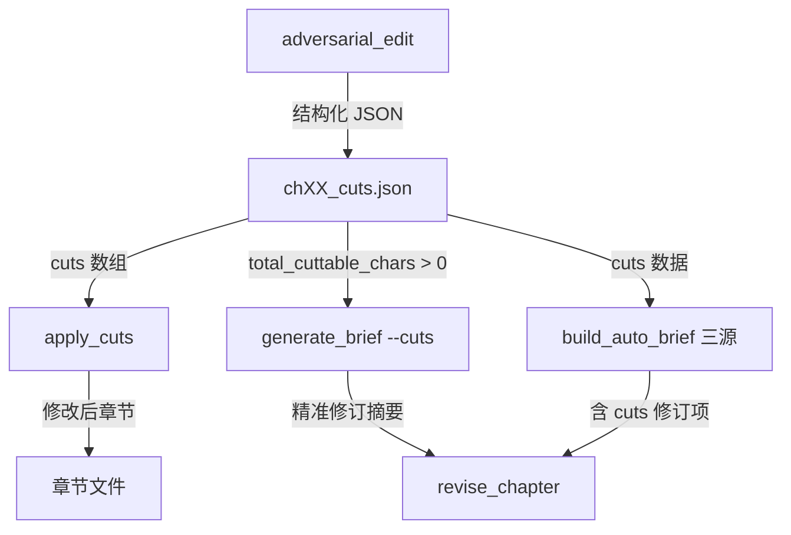

# 对抗性编辑 + 应用裁剪 — 恢复原版逻辑修改方案

## 问题诊断

原版 autonovel 中，`adversarial_edit.py` + `apply_cuts.py` 是一套完整的管线：
- `adversarial_edit` → LLM 产出**结构化 JSON**（cuts 数组、total_cuttable_words 等）
- `apply_cuts` → **真正执行删除**，修改章节文件
- `generate_brief --cuts` → 读取结构化数据 → 生成精准修订摘要
- `build_auto_brief` → 三源交叉引用中包含 cuts 数据

重构版退化：
1. `adversarial_edit.py` 只存 `raw_output`，不解析 JSON
2. `apply_cuts.py` 是占位桩，不执行任何删除
3. `adversarial_prompts.py` 的 prompt 要求非结构化文本输出，不是 JSON

## 修改范围

| 文件 | 改动量 | 说明 |
|------|--------|------|
| `prompts/adversarial_prompts.py` | 重写 prompt | 改为请求结构化 JSON 输出 |
| `revision/adversarial_edit.py` | +JSON 解析 | 解析 LLM 返回的 JSON，保存结构化数据 |
| `revision/apply_cuts.py` | 完全重写 | 实现中文文本的 quote 匹配 + 删除 |
| `revision/gen_brief.py` | 1 行 | `total_cuttable` → 兼容中文字数 |

## 详细修改步骤

### Step 1: 重写 `prompts/adversarial_prompts.py`

将当前的非结构化 prompt 替换为请求 JSON 的版本：

```
当前（非结构化）:
  位置: (段落描述)
  分类: OVER-EXPLAIN / REDUNDANT / ...
  理由: ...
  建议操作: ...

改为（JSON）:
  {
    "cuts": [
      { "quote": "原文引用(20+字)", "type": "OVER-EXPLAIN|REDUNDANT|FAT|TELL|SLOP|STRUCTURAL",
        "reason": "为什么该删", "action": "CUT|REWRITE",
        "rewrite": "替换文本(仅REWRITE时)" }
    ],
    "total_cuttable_chars": 450,
    "tightest_passage": "最精炼的2-3句",
    "loosest_passage": "最拖沓的2-3句",
    "overall_fat_percentage": 15,
    "one_sentence_verdict": "一句话评价"
  }
```

分类映射：OVER-EXPLAIN | REDUNDANT | FAT | TELL | SLOP | STRUCTURAL

关键变更：
- 要求 `"quote"` 字段包含**确切的原文引用（至少 20 字）**——这是 `apply_cuts` 执行删除的匹配依据
- `total_cuttable_chars` 用于 `generate_brief` 的 `--cuts` 路径判断
- `SYSTEM_PROMPT` 要求输出纯 JSON，不包含 markdown 代码块

### Step 2: 重写 `revision/adversarial_edit.py`

在 `call_judge()` 返回后增加 JSON 解析步骤：

```python
import re as _re

def _parse_json_response(text: str) -> dict:
    """从 LLM 返回中提取 JSON 对象。兼容 markdown 代码块。"""
    text = text.strip()
    # 去掉 markdown 代码块标记
    if text.startswith("```"):
        text = _re.sub(r'^```\w*\n?', '', text)
        text = _re.sub(r'\n?```$', '', text)
    # 找到最外层 JSON 对象
    start = text.find('{')
    if start == -1:
        raise ValueError("No JSON found in response")
    # 括号匹配
    depth = 0
    in_string = False
    escape = False
    for i in range(start, len(text)):
        c = text[i]
        if escape: escape = False; continue
        if c == '\\' and in_string: escape = True; continue
        if c == '"' and not escape: in_string = not in_string; continue
        if in_string: continue
        if c == '{': depth += 1
        elif c == '}':
            depth -= 1
            if depth == 0:
                return json.loads(text[start:i+1], strict=False)
    return json.loads(text[start:], strict=False)
```

修改 `run_adversarial_edit` 主循环：

```python
result = call_judge(...)

# ★ 解析 JSON → 保存结构化数据
try:
    parsed = _parse_json_response(result)
except Exception:
    step(f"JSON 解析失败，保存原始输出")
    parsed = {"raw_output": result, "parse_error": True}

cuts_data = {
    "chapter": ch_num,
    "timestamp": datetime.now().isoformat(),
    **parsed,  # 展开 cuts, total_cuttable_chars 等字段
}
cuts_path.write_text(json.dumps(cuts_data, ensure_ascii=False, indent=2), ...)
```

### Step 3: 重写 `revision/apply_cuts.py`

基于原版逻辑，适配中文：

```python
def find_and_remove(text: str, quote: str) -> tuple[str, bool, str]:
    """
    在中文文本中查找并删除 quote。
    中文适配：使用精确子串匹配 + 空白字符标准化回退。
    返回 (新文本, 成功, 失败原因)。
    """
    MIN_QUOTE_LEN = 10  # 中文字数阈值
    
    # 精确匹配
    count = text.count(quote)
    if count == 1:
        return text.replace(quote, "", 1), True, ""
    if count > 1:
        return text, False, f"歧义匹配({count}处)"
    
    # 空白标准化回退
    ws = re.compile(r"\s+")
    norm_quote = ws.sub("", quote).strip()
    if len(norm_quote) < MIN_QUOTE_LEN:
        return text, False, "引用过短"
    
    # 构建正则：逐字匹配，中间允许空白
    pattern = r"\s*".join(re.escape(c) for c in norm_quote)
    matches = list(re.finditer(pattern, text))
    if len(matches) == 1:
        m = matches[0]
        return text[:m.start()] + text[m.end():], True, ""
    if len(matches) > 1:
        return text, False, f"歧义匹配({len(matches)}处)"
    
    return text, False, "未找到"
```

`run_apply_cuts` 主逻辑：

```python
def run_apply_cuts(target="all", types=None, min_fat=15):
    types = types or ["OVER-EXPLAIN", "REDUNDANT", "FAT"]
    
    # 确定章节范围
    if target == "all":
        cut_files = sorted(EDIT_LOGS_DIR.glob("ch*_cuts.json"))
    else:
        cut_files = [EDIT_LOGS_DIR / f"ch{int(target):02d}_cuts.json"]
    
    for cf in cut_files:
        ch_num = int(re.match(r"ch(\d+)_cuts", cf.name).group(1))
        data = json.loads(cf.read_text(encoding="utf-8"))
        
        # 跳过解析失败的文件
        if data.get("parse_error"):
            step(f"  ch{ch_num:02d}: 跳过（原始输出无结构化数据）")
            continue
        
        # 检查 fat threshold
        fat_pct = data.get("overall_fat_percentage", 0)
        if fat_pct < min_fat:
            step(f"  ch{ch_num:02d}: 跳过（fat {fat_pct}% < {min_fat}%）")
            continue
        
        # 加载并修改章节
        ch_path = CHAPTERS_DIR / f"ch_{ch_num:02d}.md"
        text = ch_path.read_text(encoding="utf-8")
        original_chars = len(text.replace("\n", ""))
        
        cuts = data.get("cuts", [])
        applied = 0
        for cut in cuts:
            if types and cut.get("type") not in types:
                continue
            quote = cut.get("quote", "")
            if len(quote.strip()) < MIN_QUOTE_LEN:
                continue
            new_text, success, _ = find_and_remove(text, quote)
            if success:
                text = new_text
                applied += 1
        
        if applied > 0:
            text = collapse_blank_lines(text)
            ch_path.write_text(text, encoding="utf-8")
            new_chars = len(text.replace("\n", ""))
            step(f"  ch{ch_num:02d}: 裁剪 {applied} 处, {original_chars}→{new_chars} 字")
        else:
            step(f"  ch{ch_num:02d}: 无匹配，跳过")
```

### Step 4: 更新 `revision/gen_brief.py`

`generate_brief` 中 `--cuts` 路径检查需要兼容中文字数：

```python
# 当前（第 1009 行）
total_cuttable = cuts_data.get("total_cuttable_words", 0)

# 改为
total_cuttable = cuts_data.get("total_cuttable_chars", 
                cuts_data.get("total_cuttable_words", 0))
```

`build_cuts_brief` 中同样需要适配（第 613 行）：
```python
total_cuttable = cuts_data.get("total_cuttable_chars", 
                cuts_data.get("total_cuttable_words", 0))
```

### Step 5: 编译验证

```
python -c "import py_compile; py_compile.compile('...', doraise=True)"
```

## 修改后的数据流



## 风险评估

| 风险 | 缓解 |
|------|------|
| LLM 返回非 JSON 格式 | `_parse_json_response` 有 markdown 剥除 + 括号匹配回退 |
| 中文字符匹配失败（quote 不精确） | 空白标准化回退 + `MIN_QUOTE_LEN=10` 阈值 |
| 删除后段落断裂 | `collapse_blank_lines` 合并多余空行 |
| `total_cuttable_chars` 字段命名 | 同时兼容 `total_cuttable_words` 回退 |
