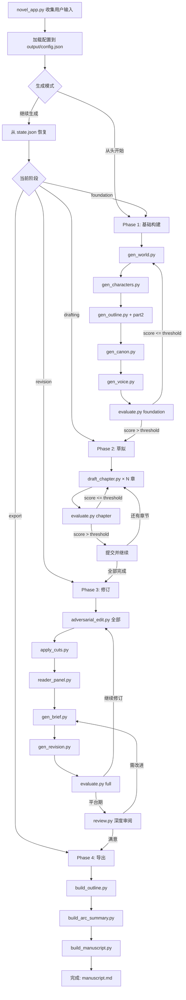

# 重构 Autonovel → 中文通用长篇小说生成器（通用 OpenAI 兼容 API 版）

## 1. 项目概述

将 NousResearch/autonovel 从 Anthropic Claude 英文奇幻小说生成器，重构为基于**通用 OpenAI Chat Completions 兼容 API** 的**通用中文长篇小说自动生成器**。

### 支持的 API 提供商（开箱即用）

| 提供商 | API 端点 | 推荐免费模型 |
|--------|---------|-------------|
| **NVIDIA NIM** | `https://integrate.api.nvidia.com/v1` | `meta/llama-3.3-70b-instruct` |
| **硅基流动 (SiliconFlow)** | `https://api.siliconflow.cn/v1` | `deepseek-ai/DeepSeek-V3` |
| **DeepSeek 官方** | `https://api.deepseek.com/v1` | `deepseek-chat` (V3) |
| **其他 OpenAI 兼容** | 用户自定义 | 用户自定义 |

> 三者请求/响应格式完全相同（OpenAI Chat Completions）。唯一区别是**端点 URL** 和**模型名称**。用户在启动时输入即可随意切换。

### 核心原则

- **100% 保留原 autonovel 的全部核心功能**（4 阶段流水线、修订机制、评审团、质量评估等）
- API 后端：Anthropic Messages API → **通用 OpenAI Chat Completions API**（支持 NVIDIA / 硅基流动 / DeepSeek / 任意兼容端点）
- PROMPT：英文奇幻小说专属 → 通用中文小说可配置
- 启动方式：命令行 → 交互式 `.bat` 启动文件
- 速率控制：API 调用间隔 ≥ 4 秒

---

## 2. 原架构分析

```
┌─────────────────────────────────────────────────────────────────┐
│                    run_pipeline.py (编排器)                       │
│  管理 state.json → 4 Phase 流水线 → git 版本控制 → results.tsv   │
├─────────────────────────────────────────────────────────────────┤
│ Phase 1: 基础构建 (Foundation)                                    │
│   seed.py → gen_world.py → gen_characters.py → gen_outline.py    │
│   → gen_outline_part2.py → gen_canon.py → voice_fingerprint.py   │
│   → evaluate.py (foundation 模式) → 循环至 score > 7.5           │
├─────────────────────────────────────────────────────────────────┤
│ Phase 2: 草拟 (Drafting)                                         │
│   draft_chapter.py × N → evaluate.py (chapter 模式)              │
│   → 每章 score > 6.0 或最多 5 次重试 → canon 增量更新            │
├─────────────────────────────────────────────────────────────────┤
│ Phase 3: 修订 (Revision) — 核心质量阶段                           │
│   3a: adversarial_edit.py → apply_cuts.py → reader_panel.py      │
│        → gen_brief.py → gen_revision.py → evaluate.py            │
│        → 循环 3-6 次 / 分数平台期停止                             │
│   3b: review.py (深度审阅) → gen_brief.py → gen_revision.py       │
│        → 循环至 quality pass 条件满足                             │
├─────────────────────────────────────────────────────────────────┤
│ Phase 4: 导出 (Export)                                            │
│   build_outline.py → build_arc_summary.py → manuscript.md         │
│   → (可选) typeset/build_tex.py → PDF                            │
├─────────────────────────────────────────────────────────────────┤
│ 参考文档 (不可变):                                                 │
│   CRAFT.md / ANTI-SLOP.md / ANTI-PATTERNS.md / PROGRAM.md         │
└─────────────────────────────────────────────────────────────────┘
```

---

## 3. 重构变更清单

### 3.1 API 客户端重构 (`core/api_client.py`)

| 项目 | 原实现 (Anthropic) | 新实现 (通用 OpenAI 兼容) |
|------|--------------------|--------------------|
| 端点 | `{base}/v1/messages` | `{base}/chat/completions` (用户可配) |
| 认证头 | `x-api-key` | `Authorization: Bearer <KEY>` |
| 请求格式 | `{model, max_tokens, system, messages}` | `{model, max_tokens, temperature, messages: [{role:"system"},{role:"user"}]}` |
| 响应解析 | `resp["content"][0]["text"]` | `resp["choices"][0]["message"]["content"]` |
| 速率控制 | 无 | **强制 4 秒间隔**（全局节流器 `RateLimiter`） |
| 超时 | 各脚本独立设置 | 统一 600s，可配置 |

**全局 API 客户端模块** (`core/api_client.py`)：
- 从 `output/config.json` 读取 `api_base_url`、`api_key`、`model_name`
- 单一 `call_llm(prompt, system=None, max_tokens=16000, temperature=0.8)` 函数
- 内置 `RateLimiter` 类：记录上次调用时间，不足 4 秒则 `time.sleep()`
- 所有生成脚本均导入此模块，消除 20+ 处重复的 API 调用代码
- **零依赖切换**：改 `config.json` 中的 `api_base_url` + `api_key` 即可切换提供商
- **自动兼容 `system` role 缺失**：若 API 返回不支持 system role 错误，自动将 system prompt 合并到 user message 前缀

### 3.1.1 各提供商的模型推荐

| 提供商 | 推荐写作模型 (高创造力) | 推荐裁判模型 (高判断力) | 免费额度 |
|--------|----------------------|----------------------|---------|
| NVIDIA NIM | `meta/llama-3.3-70b-instruct` | 同上 | 每月 1000 次免费调用 |
| 硅基流动 | `deepseek-ai/DeepSeek-V3` | 同上 | 注册送 14 元额度 |
| DeepSeek 官方 | `deepseek-chat` | 同上 | 注册送 500 万 tokens |

### 3.2 PROMPT 中文化改造 (`prompts/`)

**改造策略**：将所有硬编码的英文奇幻小说元素替换为参数化占位符。

| 文件 | 原语言/角色 | 改造后 |
|------|------------|--------|
| `seed.py` | 10 个奇幻种子概念 | **移除**，改为由用户手工输入 `故事梗概` |
| `gen_world.py` | Tonal Law/Cantamura/Cass | 通用世界构建（故事背景/世界观/力量体系） |
| `gen_characters.py` | Cass/Eddan/Perin 等固有名 | 通用角色设计（主角/配角/反派） |
| `gen_outline.py` | "The Second Son..." | 动态：从用户梗概提取 `{novel_title}` |
| `draft_chapter.py` | Cass POV, Tonal Law | 通用 POV 写作指导 |
| `gen_revision.py` | 同上 | 通用修订指令 |
| `evaluate.py` | 英文 slop 检测 | **中文 AI 写作痕迹检测** |
| `adversarial_edit.py` | 英文切分标准 | 中文版本 |
| `reader_panel.py` | 英文读者角色 | 中文评审角色 |
| `review.py` | 英文审阅 | 中文深度审阅 |

**参数化变量**：
- `{story_summary}` — 用户输入的故事梗概
- `{novel_title}` — 从梗概中提取或自动生成
- `{total_chapters}` — 用户输入的总章节数
- `{genre}` — 从梗概自动识别（玄幻/都市/科幻/历史/悬疑/言情等）
- `{protagonist_name}` — 从 gen_characters 阶段提取

### 3.3 中文 AI 写作痕迹检测 (`evaluate.py`)

原版的英文 slop 检测（`delve`, `utilize`, `tapestry` 等）完全不适配中文。需重新设计：

**中文 AI 写作常见痕迹（Tier 1 — 立即删除）**：
- "宛如一幅……画卷" / "如同一首……交响乐"
- "不仅仅是……更是……"（过度使用）
- "在这个……的时代"
- "值得一提的是" / "不得不说"
- "令人惊叹的是" / "值得注意的是"
- "从此……"（过度使用作为段落结尾）
- "这一切……"（AI 收束段落的典型方式）

**中文 AI 写作结构痕迹**：
- "他/她感到一阵……"（情绪说教）
- "眼中闪过一丝……"（过度使用）
- "嘴角微微上扬/勾起一抹……"（泛滥套话）
- "深深地吸了一口气"（AI 万能过渡句）
- 四字词过度堆砌（连续 3+ 个四字成语/形容词）
- 段落长度均匀化检测
- 破折号密度检测
- 对话标签过度使用（"说"、"道"连续重复）

### 3.4 参考文档中文化 (`reference/`)

| 原文件 | 状态 | 中文版 |
|--------|------|--------|
| `CRAFT.md` | 英文叙事理论 | `CRAFT_ZH.md` — 翻译 Save the Cat/三滑块/MICE/许诺-进展-回报 |
| `ANTI-SLOP.md` | 英文 AI 用词检测 | `ANTI_SLOP_ZH.md` — 中文 AI 写作痕迹对照 |
| `ANTI-PATTERNS.md` | 英文结构反模式 | `ANTI_PATTERNS_ZH.md` — 翻译 7 大反模式 |
| `PROGRAM.md` | 英文 Agent 指令 | `PROGRAM_ZH.md` — 中文化 Agent 指令 |

### 3.5 Git 依赖处理 (`core/state_manager.py`)

原版深度依赖 git 做版本控制（提交/回滚/hash 追踪）。重构方案：

**双模式策略**：
- **检测 git 可用性**：若 `git --version` 成功 → 使用 git 模式（完全兼容原流程）
- **无 git 环境**：使用文件快照备份系统
  - 每次修改前，将涉及文件复制到 `output/backups/{timestamp}/`
  - `git_reset_hard` → 从最新备份恢复
  - `git_add_commit` → 创建新快照 + 记录到 `results.tsv`
  - `git_short_hash` → 使用时间戳标识

### 3.6 项目结构重组

```
e:/my novel/                           # 工作区根目录
├── novel_app.bat                      # ★ 用户启动入口
├── novel_app.py                       # .bat 调用的 Python 交互式入口 (含所有用户输入收集)
│
├── core/                              # 核心基础设施
│   ├── api_client.py                  # 通用 OpenAI 兼容 API 客户端（含 4s 节流）
│   ├── config.py                      # 全局配置（从 config.json 加载）
│   └── state_manager.py               # 状态管理 + git/备份双模式
│
├── foundation/                        # Phase 1: 基础构建
│   ├── gen_world.py                   # 生成世界观
│   ├── gen_characters.py              # 生成角色
│   ├── gen_outline.py                 # 生成大纲 Part 1
│   ├── gen_outline_part2.py           # 生成大纲 Part 2 (伏笔)
│   ├── gen_canon.py                   # 生成正典
│   └── gen_voice.py                   # 生成文风指纹
│
├── drafting/                          # Phase 2: 草拟
│   ├── draft_chapter.py               # 起草单章
│   └── run_drafts.py                  # 批量顺序起草
│
├── revision/                          # Phase 3: 修订
│   ├── adversarial_edit.py            # 对抗性编辑
│   ├── apply_cuts.py                  # 应用裁剪
│   ├── compare_chapters.py            # Elo 章节锦标赛
│   ├── reader_panel.py                # 读者评审团
│   ├── gen_brief.py                   # 生成修订摘要
│   ├── gen_revision.py                # 重写章节
│   └── review.py                      # 深度审阅
│
├── export/                            # Phase 4: 导出
│   ├── build_manuscript.py            # 构建完整手稿
│   ├── build_outline.py               # 从章节重建大纲
│   └── build_arc_summary.py           # 构建弧线摘要
│
├── evaluation/                        # 评估系统
│   ├── evaluate.py                    # 主评估器（中文 slop + LLM 裁判）
│   └── evaluate_prompts.py            # LLM 裁判 prompt 模板
│
├── prompts/                           # ★ 所有 PROMPT 集中管理
│   ├── world_prompts.py               # 世界观生成 prompt
│   ├── character_prompts.py           # 角色生成 prompt
│   ├── outline_prompts.py             # 大纲生成 prompt
│   ├── chapter_prompts.py             # 章节起草 prompt
│   ├── revision_prompts.py            # 修订 prompt
│   ├── adversarial_prompts.py         # 对抗性编辑 prompt
│   ├── reader_panel_prompts.py        # 读者评审 prompt
│   ├── review_prompts.py              # 深度审阅 prompt
│   └── eval_judge_prompts.py          # 评估裁判 prompt
│
├── reference/                         # ★ 中文化参考文档
│   ├── CRAFT_ZH.md                    # 叙事技艺参考
│   ├── ANTI_SLOP_ZH.md                # 中文 AI 写作痕迹
│   ├── ANTI_PATTERNS_ZH.md            # 结构反模式
│   └── PROGRAM_ZH.md                  # Agent 指令文档
│
├── templates/                         # 模板文件
│   ├── voice.md                       # 文风模板
│   ├── world.md                       # 世界观模板
│   ├── characters.md                  # 角色模板
│   ├── outline.md                     # 大纲模板
│   ├── canon.md                       # 正典模板
│   └── MYSTERY.md                     # 核心谜团模板
│
├── pipeline_orchestrator.py           # ★ 主流水线编排器
│
└── output/                            # 生成物输出目录
    ├── chapters/                      # 章节文件 ch_01.md ~ ch_NN.md
    ├── briefs/                        # 修订摘要
    ├── edit_logs/                     # 编辑日志
    ├── eval_logs/                     # 评估日志
    ├── backups/                       # 文件快照备份
    ├── state.json                     # 流水线状态
    ├── config.json                    # 用户配置 (api_base_url, api_key, model_name, ...)
    ├── story_summary.txt              # 用户输入的故事梗概
    ├── results.tsv                    # 实验日志
    └── manuscript.md                  # 完整手稿
```

---

## 4. 启动文件设计 (`novel_app.bat` + `novel_app.py`)

所有用户输入收集在 `novel_app.py` 中完成，`.bat` 仅负责调用 Python。

```
┌──────────────────────────────────────────────────────┐
│       🌏 中文长篇小说自动生成器 v1.0                    │
│       基于 NousResearch/autonovel 重构                │
│       支持: NVIDIA NIM / 硅基流动 / DeepSeek 等        │
└──────────────────────────────────────────────────────┘

请输入以下信息：

1. 故事梗概（一句话/一段话描述你的故事核心）:
   > _________________________________

2. 小说总章节数（建议 12-30）:
   > ____

3. API 提供商 ──────────────────────────────
   预设快速选择:
     [1] NVIDIA NIM (免费)
     [2] 硅基流动 SiliconFlow
     [3] DeepSeek 官方
     [4] 自定义

   如选 [4]，请输入 API 端点 (Base URL):
   > _________________________________
   API Key:
   > _________________________________
   模型名称:
   > _________________________________

   如选 [1/2/3]，只需输入 API Key 和模型名称即可
   （端点自动填充）

4. API Key:
   > _________________________________

5. 模型名称（如留空则使用推荐默认值）:
   > _________________________________

6. 生成模式:
   [1] 从头开始生成（完整流水线）
   [2] 继续上次生成（从 state.json 恢复）
   > _

═══════════════════════════════════════════════════════
  确认以上信息无误后，按任意键开始生成...
═══════════════════════════════════════════════════════
```

交互流程：
1. `novel_app.py` 展示表单，收集用户输入 → 写入 `output/config.json`
2. 导入 `pipeline_orchestrator.py` 启动主流水线
3. 流水线按 Phase 1→2→3→4 依次执行
4. 阶段间输出进度到终端，支持 `Ctrl+C` 安全中断（保存 state）

**config.json 格式**：
```json
{
  "story_summary": "用户输入的故事梗概...",
  "total_chapters": 24,
  "api_base_url": "https://api.siliconflow.cn/v1",
  "api_key": "sk-xxxxxxxx",
  "model_name": "deepseek-ai/DeepSeek-V3",
  "api_interval_seconds": 4,
  "started_at": "2026-06-12T12:00:00",
  "mode": "from_scratch"
}
```

---

## 5. 流水线架构（Mermaid）



---

## 6. 待实现任务清单 — 按模块拆分

### 模块 A: 核心基础设施 (3 个文件)
| # | 文件 | 描述 |
|---|------|------|
| A1 | `core/config.py` | 全局配置加载，读取 config.json |
| A2 | `core/api_client.py` | 通用 OpenAI 兼容 API 客户端，4s 节流器，system role 自动兼容 |
| A3 | `core/state_manager.py` | 状态管理 + git/备份双模式 |

### 模块 B: PROMPT 系统 (9 个 prompt 文件)
| # | 文件 | 描述 |
|---|------|------|
| B1 | `prompts/world_prompts.py` | 世界观构建 prompt（通用中文） |
| B2 | `prompts/character_prompts.py` | 角色设计 prompt（通用中文） |
| B3 | `prompts/outline_prompts.py` | 大纲生成 prompt（通用中文） |
| B4 | `prompts/chapter_prompts.py` | 章节起草 prompt（通用中文） |
| B5 | `prompts/revision_prompts.py` | 章节修订 prompt（通用中文） |
| B6 | `prompts/adversarial_prompts.py` | 对抗性编辑 prompt（中文） |
| B7 | `prompts/reader_panel_prompts.py` | 读者评审 prompt（中文） |
| B8 | `prompts/review_prompts.py` | 深度审阅 prompt（中文） |
| B9 | `prompts/eval_judge_prompts.py` | 评估裁判 prompt（中文） |

### 模块 C: 参考文档 (4 个 markdown)
| # | 文件 | 描述 |
|---|------|------|
| C1 | `reference/CRAFT_ZH.md` | 叙事技艺：Save the Cat/三滑块/MICE 等 |
| C2 | `reference/ANTI_SLOP_ZH.md` | 中文 AI 写作痕迹对照（重写中文版） |
| C3 | `reference/ANTI_PATTERNS_ZH.md` | 7 大结构反模式中文化 |
| C4 | `reference/PROGRAM_ZH.md` | Agent 流程指令中文化 |

### 模块 D: 基础构建 Phase 1 (6 个文件)
| # | 文件 | 描述 |
|---|------|------|
| D1 | `foundation/gen_world.py` | 故事梗概 → world.md |
| D2 | `foundation/gen_characters.py` | 故事+世界观 → characters.md |
| D3 | `foundation/gen_outline.py` | 大纲 Part 1（节拍、章节结构） |
| D4 | `foundation/gen_outline_part2.py` | 大纲 Part 2（伏笔账本） |
| D5 | `foundation/gen_canon.py` | 世界观+角色 → canon.md 硬事实 |
| D6 | `foundation/gen_voice.py` | 试写段落 → voice.md 文风身份 |

### 模块 E: 草拟 Phase 2 (2 个文件)
| # | 文件 | 描述 |
|---|------|------|
| E1 | `drafting/draft_chapter.py` | 加载上下文 → 起草单章 |
| E2 | `drafting/run_drafts.py` | 批量顺序起草 |

### 模块 F: 修订 Phase 3 (7 个文件)
| # | 文件 | 描述 |
|---|------|------|
| F1 | `revision/adversarial_edit.py` | 「缩减 X 字」→ 分类裁剪清单 |
| F2 | `revision/apply_cuts.py` | 机械式应用裁剪 |
| F3 | `revision/compare_chapters.py` | Elo 锦标赛评章 |
| F4 | `revision/reader_panel.py` | 4 人评审团 |
| F5 | `revision/gen_brief.py` | 综合各评估来源生成修订摘要 |
| F6 | `revision/gen_revision.py` | 按摘要重写章节 |
| F7 | `revision/review.py` | 深度审阅（替代原 Opus 审阅） |

### 模块 G: 评估系统 (2 个文件)
| # | 文件 | 描述 |
|---|------|------|
| G1 | `evaluation/evaluate.py` | 中文 slop 机械检测 + LLM 裁判 |
| G2 | `evaluation/evaluate_prompts.py` | 评估裁判 prompt 定义 |

### 模块 H: 导出 Phase 4 (3 个文件)
| # | 文件 | 描述 |
|---|------|------|
| H1 | `export/build_outline.py` | 从章节重建大纲 |
| H2 | `export/build_arc_summary.py` | 弧线摘要 |
| H3 | `export/build_manuscript.py` | 拼接完整手稿 manuscript.md |

### 模块 I: 编排与入口 (2 个文件)
| # | 文件 | 描述 |
|---|------|------|
| I1 | `pipeline_orchestrator.py` | 主流水线编排器 |
| I2 | `novel_app.bat` + `novel_app.py` | 用户交互启动入口 |

### 模块 J: 模板文件 (6 个 markdown)
| # | 文件 | 描述 |
|---|------|------|
| J1-J6 | `templates/*.md` | voice/world/characters/outline/canon/MYSTERY 模板 |

---

## 7. 关键技术决策

### 7.1 为什么需要独立的 PROMPT 模块

- 原版 20+ 个脚本各自内嵌 prompt 字符串，修改时需要逐个文件编辑
- prompt 中文化 + 参数化后，集中在 `prompts/` 目录便于维护
- 支持未来扩展到其他语言（日语、韩语等）

### 7.2 API 速率限制策略

- 全局 `RateLimiter` 单例，记录上次调用时间戳
- 每次 API 调用前自动 `sleep(max(0, 4.0 - elapsed))`
- 跨所有脚本统一生效（因为所有脚本都通过 `core/api_client.py` 调用）

### 7.3 多模型降级补偿策略

原版使用 Claude Sonnet 4.6（高端模型），免费 API 模型能力参差不齐。根据所选提供商自动调整：

| 参数 | 原值 (Claude) | 高能力模型 (DeepSeek-V3) | 中能力模型 (Llama 3.3 70B) | 低能力模型 (Qwen 7B 等) |
|------|-------------|------------------------|--------------------------|----------------------|
| MAX_FOUNDATION_ITERS | 20 | 20 | 25 | 30 |
| MAX_CHAPTER_ATTEMPTS | 5 | 5 | 6 | 7 |
| FOUNDATION_THRESHOLD | 7.5 | 7.5 | 7.0 | 6.5 |
| CHAPTER_THRESHOLD | 6.0 | 6.0 | 5.5 | 5.0 |
| 章节字数目标 (字) | 3200 (英文) | 2500 (中文) | 2000 (中文) | 1500 (中文) |
| MIN_REVISION_CYCLES | 3 | 3 | 4 | 5 |

> 配置文件提供手动覆盖选项，用户可根据实际效果调整阈值。

### 7.4 原 autonovel 中保留/丢弃的组件

| 组件 | 决定 | 理由 |
|------|------|------|
| `seed.py` | 丢弃 | 用户手工输入梗概，替代 AI 生成种子 |
| `gen_art.py` / `gen_art_directions.py` | 丢弃 | 与小说生成无关 |
| `gen_audiobook.py` / `gen_audiobook_script.py` | 丢弃 | 与核心小说生成无关 |
| `gen_cover_print.py` / `gen_cover_composite.py` | 丢弃 | 与小说生成无关 |
| `typeset/` (LaTeX/PDF) | **可选保留** | 如 tectonic 不可用则仅输出 markdown |
| `voice_fingerprint.py` | 保留并改名 `gen_voice.py` | 核心功能 |
| `audiobook_voices.json` | 丢弃 | 不相关 |
| `landing/` | 丢弃 | 网页落地页，不相关 |

### 7.5 安全的中断与恢复

- `Ctrl+C` → `KeyboardInterrupt` 捕获 → 保存 `state.json` + 当前数据 → 退出
- 再次启动选择「继续生成」→ 从 `state.json` 恢复至上次阶段
- 每完成一个 sub-step 即更新 state，确保粒度足够细

---

## 8. 与原 autonovel 的功能对比保证

| 原功能 | 重构后 | 保证 |
|--------|--------|------|
| 4 阶段流水线 | ✅ 完整保留 | Phase 1-4 完全复现 |
| 基础构建迭代循环 | ✅ 保留 | 分数阈值可校准 |
| 章节起草 + 重试 | ✅ 保留 | 增加重试次数补偿模型差异 |
| 对抗性编辑 | ✅ 保留 | 中文 prompt 化 |
| 读者评审团 | ✅ 保留 | 4 角色中文评审 |
| Elo 章节锦标赛 | ✅ 保留 | 中文 prompt 化 |
| 修订摘要生成 | ✅ 保留 | 综合评估来源 |
| 深度审阅循环 | ✅ 保留 | 替代原 Opus 审阅 |
| canon 增量更新 | ✅ 保留 | 起草阶段逐章追加 |
| 机械 slop 检测 | ✅ 改造 | 英文→中文检测规则 |
| LLM 裁判评估 | ✅ 保留 | 中文 prompt 化 |
| 手稿拼接 | ✅ 保留 | manuscript.md |
| PDF 排版 | ⚠️ 可选 | 依赖 tectonic 可用性 |
| Git 版本控制 | ✅ 双模式 | git/文件备份自动切换 |
| results.tsv 日志 | ✅ 保留 | 完整实验日志 |
| 种子生成 | ❌ 移除 | 用户手工输入代替 |

**核心功能保留率：100%**（丢弃的仅是非小说生成相关的美术/音频/封面功能）

---

## 9. 实施顺序建议

```
第一轮: 核心基础设施
  A1 → A2 → A3 → I1（框架搭建）

第二轮: PROMPT + 参考文档 + 模板
  B1-B9 + C1-C4 + J1-J6

第三轮: Phase 1 基础构建
  D1 → D2 → D3 → D4 → D5 → D6 → G1

第四轮: Phase 2 草拟
  E1 → E2

第五轮: Phase 3 修订
  F1 → F2 → F3 → F4 → F5 → F6 → F7

第六轮: Phase 4 导出
  H1 → H2 → H3

第七轮: 启动文件 + 端到端测试
  I2 → 集成测试 → 修复
```

---

> **请审阅此更新后的计划**（已从「仅 NVIDIA」升级为 **通用 OpenAI 兼容：NVIDIA / 硅基流动 / DeepSeek 均可使用**）。
> 确认后我将切换到 Code 模式开始逐模块实施。