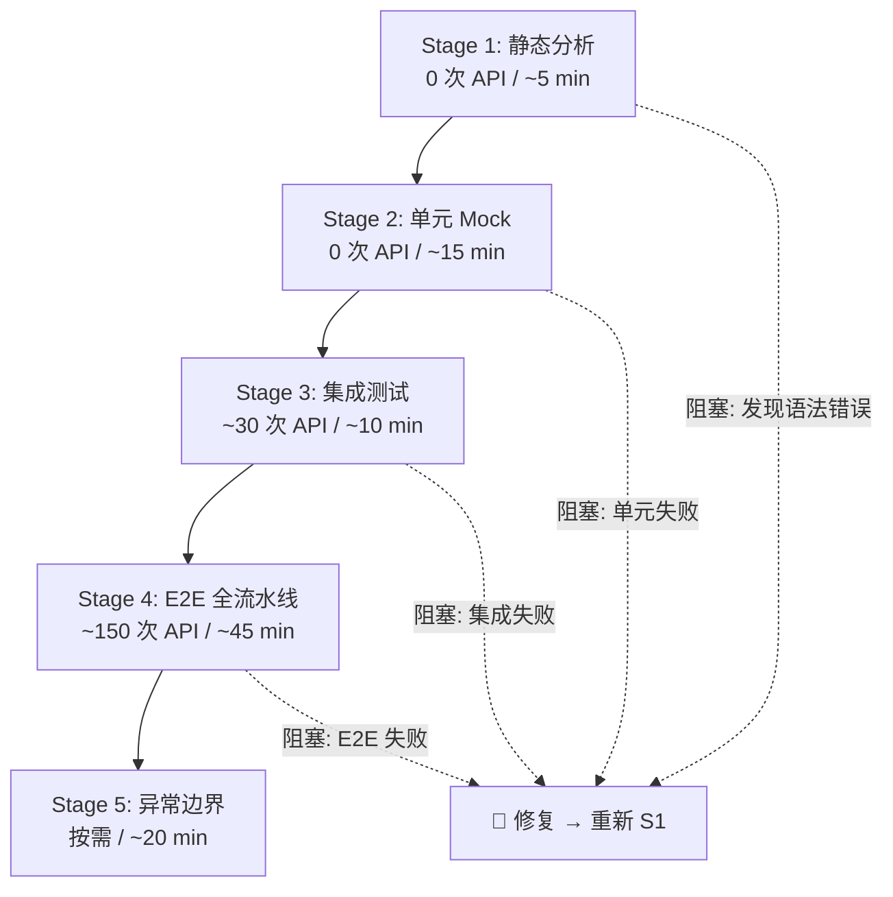

# 中文重构版长篇小说生成流水线 — 企业级测试方案

> 版本：v1.0  
> 日期：2026-06-19  
> 目标：找出所有 BUG，并顺利跑完程序全部流程  
> 原则：Google Testing Blog 五阶段金字塔 + 大厂 CI/CD 门禁标准

---

## 测试金字塔总览

```mermaid
flowchart TD
    subgraph S1["Stage 1: 静态分析 — 0 次 API 调用"]
        S1a["1.1 导入完整性"]
        S1b["1.2 语法/风格"]
        S1c["1.3 依赖死代码"]
        S1d["1.4 配置完整性"]
        S1e["1.5 硬编码绝对值审计"]
    end
    
    subgraph S2["Stage 2: 单元/边界/故障注入 — 0 次 API 调用"]
        S2a["2.1 config 层"]
        S2b["2.2 state_manager 层"]
        S2c["2.3 api_client Mock 层"]
        S2d["2.4 evaluation 层"]
        S2e["2.5 foundation 单元"]
        S2f["2.6 drafting 单元"]
        S2g["2.7 revision 单元"]
        S2h["2.8 故障注入矩阵"]
    end
    
    subgraph S3["Stage 3: 集成测试 — ~30 次 API 调用"]
        S3a["3.1 Phase 1 最小集成"]
        S3b["3.2 Phase 2 最小集成"]
        S3c["3.3 Phase 3 最小集成"]
        S3d["3.4 Phase 4 最小集成"]
        S3e["3.5 Phase 模型路由集成"]
    end
    
    subgraph S4["Stage 4: E2E 全流水线 — ~150 次 API 调用"]
        S4a["4.1 3 章单卷 from_scratch"]
        S4b["4.2 3 章单卷 resume"]
        S4c["4.3 6 章两卷分层大纲"]
        S4d["4.4 12 章全流程"]
    end
    
    subgraph S5["Stage 5: 异常/边界/回归 — 按需"]
        S5a["5.1 Ctrl+C 中断恢复"]
        S5b["5.2 输出目录损坏恢复"]
        S5c["5.3 .env 部分缺失"]
        S5d["5.4 超大章节数"]
        S5e["5.5 无 Git 文件备份模式"]
    end
    
    S1 --> S2 --> S3 --> S4 --> S5
```



---

## Stage 1: 静态分析（零 API 调用）

> 目的：在写任何测试代码之前，先排除语法错误、导入断裂、死代码和配置不一致。

### 1.1 导入完整性检查

| # | 测试项 | 验证方式 | 覆盖文件 |
|---|--------|---------|---------|
| 1.1.1 | 所有 `import` / `from X import Y` 的 Y 确实存在于 X 中 | 静态 AST 遍历 | 全部 30 个 `.py` 文件 |
| 1.1.2 | 所有 `prompts/` 模块的导出函数被对应调用方引用 | `prompts/*.py` 函数签名 vs 调用方 import | 全部 prompts + 全部调用方 |
| 1.1.3 | `core/` 模块导出的所有符号被下游正确使用 | 逐模块对照 | `config.py`, `state_manager.py`, `api_client.py` |

**关键风险点**：
- [`pipeline_orchestrator.py:88`](pipeline_orchestrator.py:88) — `from foundation.gen_world import generate_world` 延迟导入，需确认模块路径正确
- [`pipeline_orchestrator.py:140`](pipeline_orchestrator.py:140) — `from evaluation.evaluate import evaluate_foundation` 
- [`pipeline_orchestrator.py:231`](pipeline_orchestrator.py:231) — `from evaluation.evaluate import get_last_slop_penalty`
- [`core/api_client.py:24`](core/api_client.py:24) — `import httpx` 必须在 `pyproject.toml` 中声明

### 1.2 语法与风格

| # | 测试项 |
|---|--------|
| 1.2.1 | `python -m py_compile` 对所有 `.py` 文件编译通过 |
| 1.2.2 | 不存在 `except:` 裸捕获（应至少 `except Exception`） |
| 1.2.3 | 不存在 `except Exception: pass` 静默吞错 |
| 1.2.4 | 所有 `f.read_text(encoding="utf-8")` 有 `FileNotFoundError` 处理或存在性检查 |

**已知风险**：
- [`foundation/gen_characters.py:47`](foundation/gen_characters.py:47) — `if __name__ == "__main__": generate_characters()` 直接调用但未处理无 config 的错误
- [`revision/apply_cuts.py:18`](revision/apply_cuts.py:18) — `run_apply_cuts()` 仅是占位实现，需标记

### 1.3 依赖与死代码

| # | 测试项 |
|---|--------|
| 1.3.1 | `pyproject.toml` 中 `dependencies` 覆盖所有 `import` 的三方库 |
| 1.3.2 | 无未被调用的公共函数（死代码检测） |
| 1.3.3 | 所有 `TEMPLATES_DIR` / `OUTPUT_DIR` 路径拼接正确 |

### 1.4 配置完整性

| # | 测试项 | 对应代码 |
|---|--------|---------|
| 1.4.1 | `.env` 中 `_SECRET_KEYS` 的 14 个映射键全部可被 `Config` 属性读取 | [`core/config.py:36-53`](core/config.py:36) |
| 1.4.2 | Phase 回退链 `p1 → 共用 / p2 → p1 → 共用 / p2_ctx → p2 → p1 → 共用 / p3 → p1 → 共用` 属性逻辑正确 | [`core/config.py:258-330`](core/config.py:258) |
| 1.4.3 | `default_state()` 15 个字段与 `pipeline_orchestrator.py` 读写一致 | [`core/state_manager.py:71-90`](core/state_manager.py:71) |

### 1.5 硬编码绝对值审计

| # | 检测项 | 位置 | 风险 |
|---|--------|------|------|
| 1.5.1 | `MIN_REVISION_CYCLES = 3` | [`pipeline_orchestrator.py:48`](pipeline_orchestrator.py:48) | 低 — 可通过 max_cycles 覆盖 |
| 1.5.2 | `MAX_FOUNDATION_ITERS = 20` | [`pipeline_orchestrator.py:46`](pipeline_orchestrator.py:46) | 中 — 20 轮全量 API 调用开销大 |
| 1.5.3 | `timeout=600` 多处硬编码 | [`core/api_client.py:116`](core/api_client.py:116) 等 | 低 — 已有 max_total_time 兜底 |
| 1.5.4 | `total_chapters=24` 默认值 | [`core/config.py:203`](core/config.py:203) | 低 |
| 1.5.5 | `chapter_word_target = 3250` | [`novel_app.py`](novel_app.py) 内 | 中 — 影响起草 prompt 字数约束 |

---

## Stage 2: 单元/边界/故障注入测试（零 API 调用）

> 目的：在每个模块级别用 Mock 隔离外部依赖，验证逻辑正确性和异常处理完整性。  
> 策略：Monkey-patch `core/api_client.call_llm` 返回可控 Mock 响应。

### 2.1 `core/config.py` 层

| # | 测试项 | Mock 策略 |
|---|--------|----------|
| 2.1.1 | `.env` 不存在 → `Config.load()` 不崩溃，`loaded=False` | 临时删除 `.env` |
| 2.1.2 | `.env` 存在但部分键缺失 → 便捷属性返回默认值 | 写入不完整 `.env` |
| 2.1.3 | `api_interval_seconds="abc"` 字符串 → 回退默认 4.0 | 注入非法值 |
| 2.1.4 | `story_summary` 为空 → 回退读 `story_summary.txt` | 创建临时文件 |
| 2.1.5 | Phase 回退链：只配 `api_key` → `p2_api_key` == `p1_api_key` == `api_key` | 注入最小配置 |
| 2.1.6 | `chapters_per_volume=0` → 自动计算 `total_chapters // total_volumes` | 边界值 |
| 2.1.7 | `Config.save()` 敏感键写 `.env`，非敏感键写 `config.json` | 模拟保存+验证 |
| 2.1.8 | `apply_model_tier_defaults()` 边界：None 值不覆盖已有值 | 注入空值 |

### 2.2 `core/state_manager.py` 层

| # | 测试项 | Mock 策略 |
|---|--------|----------|
| 2.2.1 | `state.json` 不存在 → `load_state()` 返回 `default_state()` | 删除 state.json |
| 2.2.2 | `state.json` 为非法 JSON → 应降级而非崩溃 | 注入 `{broken` |
| 2.2.3 | `git_available()` 缓存正确（调用两次不重复 subprocess） | 检查 `_GIT_AVAILABLE` |
| 2.2.4 | `backup_snapshot()` 创建正确目录结构 + 复制文件 | 临时 output |
| 2.2.5 | `restore_latest()` 从空 backups/ 返回 False 不抛异常 | 空目录 |
| 2.2.6 | `restore_latest()` 正常恢复流程 | 备份→删除→恢复→比较 |
| 2.2.7 | `get_total_chapters()` 优先级：state > config > 24 | 三场景 |
| 2.2.8 | `count_words_in_chapters()` 空 chapters/ → 0，不崩溃 | 空目录 |

### 2.3 `core/api_client.py` Mock 层

| # | 测试项 | Mock 策略 |
|---|--------|----------|
| 2.3.1 | `call_llm()` 正常响应解析 | monkey-patch `httpx.post` 返回 200 + 合法 JSON |
| 2.3.2 | HTTP 429 → 3 次重试后抛出 RuntimeError | Mock 连续 429 |
| 2.3.3 | HTTP 500 → 3 次重试后抛出 RuntimeError | Mock 连续 500 |
| 2.3.4 | `max_total_time=5` → 第一次调用耗时 3s sleep 后超时抛出 | 注入 sleep + 短超时 |
| 2.3.5 | `RateLimiter` 线程安全：并发 5 线程各调用一次，间隔均 ≥ min_interval | threading |
| 2.3.6 | `_build_messages()` system=None 不添加 system role | 参数化 |
| 2.3.7 | `_build_messages()` system 不为空且 endpoint 在黑名单 → 合并到 user | 模拟 endpoint |
| 2.3.8 | `call_judge()` 有独立 judge 配置 → 走 `_call_with_judge_config` | 注入独立 judge 配置 |
| 2.3.9 | `call_p1_writer()` / `call_p2_writer()` / `call_p2_ctx_writer()` / `call_p3_judge()` Phase 路由正确 | 注入分 Phase 配置，验证调用的 api_key |
| 2.3.10 | API Key 为空 → `_call_llm_internal` 直接抛 `RuntimeError` | api_key="" |

### 2.4 `evaluation/` 层

| # | 测试项 | Mock 策略 |
|---|--------|----------|
| 2.4.1 | `slop_score_zh("")` 空文本 → 不崩溃，返回全 0 | 空字符串 |
| 2.4.2 | `slop_score_zh("眼中闪过一丝惊讶")` → tier2_hits 含此项 | 已知套话 |
| 2.4.3 | `slop_score_zh("他感到一阵愤怒地瞪大了眼睛")` → telling_violations ≥ 1 | 已知说教 |
| 2.4.4 | `slop_score_zh("然而，但是，不过")` → transition_ratio > 0 | 过渡词滥用 |
| 2.4.5 | `slop_score_zh("纯中文没有任何套话的文本")` → slop_penalty < 1.0 | 干净文本 |
| 2.4.6 | `slop_score_zh` 在 5000 字正常小说文本上不超 0.5 秒 | 性能基准 |
| 2.4.7 | `evaluate_chapter()` 章节文件不存在 → 合理降级 | 删除章节文件 |
| 2.4.8 | `evaluate_foundation()` 评估返回 JSON 解析失败 → 降级 | Mock 非法响应 |
| 2.4.9 | `antipatterns.run_structural_audit()` 空文本 → OK | 边界 |
| 2.4.10 | `antipatterns.run_structural_audit()` 正常文本 → 检测正常运转 | 样本文本 |

### 2.5 `foundation/` 单元

| # | 测试项 | Mock 策略 |
|---|--------|----------|
| 2.5.1 | `gen_world.generate_world()` 正常流程 → 产出 `world.md` | Mock `call_writer` 返回固定模板 |
| 2.5.2 | `gen_characters.generate_characters()` → 产出 `characters.md` | Mock `call_writer` |
| 2.5.3 | `gen_outline_volume.generate_volume_outline()` 单卷 → 1 次调用 | Mock `call_p1_writer` |
| 2.5.4 | `gen_outline_volume.generate_volume_outline()` 3 卷 → ≤3 次链式调用 | Mock `call_p1_writer` |
| 2.5.5 | `gen_outline.generate_outline()` → 逐卷章级大纲 + 合并 | Mock `call_p1_writer` |
| 2.5.6 | `gen_outline._split_chapters_for_volume(1, 12)` → 3 组 | 纯函数 |
| 2.5.7 | `gen_outline._extract_volume_section()` 提取卷约束 → 文本片段 | 样本 outline_volume.md |
| 2.5.8 | `gen_outline_part2.generate_outline_part2()` outline 不存在 → 跳过 | 删除 outline.md |
| 2.5.9 | `gen_canon.generate_canon()` → 产出 `canon.md` | Mock `call_writer` |
| 2.5.10 | `gen_canon.count_canon_entries()` → 返回正确的 4 维计数 | 样本 canon.md |
| 2.5.11 | `gen_voice.generate_voice()` → 5 段语域 + 精炼 | Mock `call_writer` + `call_judge` |
| 2.5.12 | `update_canon.update_canon_from_chapter()` → 提取新事实追加 | Mock `call_p2_ctx_writer` |

### 2.6 `drafting/` 单元

| # | 测试项 | Mock 策略 |
|---|--------|----------|
| 2.6.1 | `draft_chapter.draft_chapter()` → 产出章节文件 | Mock `call_p2_writer` |
| 2.6.2 | `draft_chapter.extract_chapter_outline()` 卷大纲存在 → 提取正确章节 | 样本 outline_volume1.md |
| 2.6.3 | `draft_chapter.extract_chapter_outline()` 卷大纲不存在 → 回退 outline.md | 删除 volume 文件 |
| 2.6.4 | `draft_chapter.load_file()` 文件不存在 → 返回 "" 不崩溃 | 不存在的路径 |
| 2.6.5 | `run_drafts.run_drafts()` → 循环调用 draft_chapter | Mock draft_chapter |

### 2.7 `revision/` 单元

| # | 测试项 | Mock 策略 |
|---|--------|----------|
| 2.7.1 | `review.run_review_loop()` → 写入 review_round*.json | Mock `call_judge` |
| 2.7.2 | `gen_brief.build_auto_brief()` 三源交叉引用 → 产出摘要 | Mock 评估/审阅/panel JSON |
| 2.7.3 | `gen_brief.panel_mentions_for_chapter()` → 提取读者反馈 | 样本 reader_panel.json |
| 2.7.4 | `gen_revision.revise_chapter()` → 重写章节 | Mock `call_writer` |
| 2.7.5 | `adversarial_edit.run_adversarial_edit("all")` → 产出 cuts JSON | Mock `call_judge` |
| 2.7.6 | `reader_panel.run_reader_panel()` → 4 角色 × 最多 8 章 | Mock `call_judge` |
| 2.7.7 | `compare_chapters.run_compare_chapters()` → Elo 排名 | Mock `call_judge` |

### 2.8 故障注入矩阵

| # | 故障场景 | 注入方式 | 预期行为 |
|---|---------|---------|---------|
| 2.8.1 | API 连续 3 次超时 | Mock `httpx.post` → TimeoutException × 3 | `RuntimeError` + pipeline 阶段 catch |
| 2.8.2 | API 返回空 content | Mock choices[0].message.content="" | 重试或降级 |
| 2.8.3 | API 返回畸形 JSON (choices=[]) | Mock 响应 | 格式异常 catch → 重试 |
| 2.8.4 | 评估返回非法分数 "abc" | Mock `call_llm` 返回 "score: abc" | `parse_score` 返回 -1 → 丢弃 |
| 2.8.5 | 输出目录只读 | `os.chmod` 设置只读 | 优雅报错而非崩溃 |
| 2.8.6 | config.json 被篡改为非 JSON | 写入 `{garbage` | load 降级 |
| 2.8.7 | chapters/ 目录在起草中途被删除 | 模拟删除 | 重新创建继续 |

---

## Stage 3: 集成测试（可控 API 调用 ~30 次）

> 目的：验证模块间的真实协作，使用真实 API 但最小化调用次数。  
> 配置：`total_chapters=3`, `total_volumes=1`, `max_foundation_iters=1`, `max_revision_cycles=1`

### 3.1 Phase 1 最小集成

| # | 测试项 | 预计 API 调用 | 验收标准 |
|---|--------|-------------|---------|
| 3.1.1 | `run_foundation()` 完整流程 (world→chars→outline_volume→outline→outline_part2→canon→voice→evaluate) | ~ 8-9 次 | 所有 output/ 文件产出，foundation_score > 0 |
| 3.1.2 | Foundation 评分 < 阈值 → 触发重试逻辑 | ~ 16 次 | `git_reset_hard` 正确调用，保留最佳 |
| 3.1.3 | `count_canon_entries()` < threshold → 警告不崩溃 | ~ 8 次 | 日志输出警告但流程继续 |

### 3.2 Phase 2 最小集成

| # | 测试项 | 预计 API 调用 | 验收标准 |
|---|--------|-------------|---------|
| 3.2.1 | 起草 3 章（每章 1 次 pass） | ~ 3 次起草 + 3 次评估 = 6 | 3 个章节文件 + 3 个 eval JSON |
| 3.2.2 | 某章评分不达标 → 重试（最多 max_attempts） | ~ 6-8 次 | 重试后评分达标或 forced 接受 |
| 3.2.3 | slop_penalty > 阈值 → 触发反套话重写 | ~ 8 次 | 正确删除旧章节 → 重写 |
| 3.2.4 | antipatterns 审计 → 警告过量触发重写 | ~ 8 次 | 审计警告 > antipattern_max → 删除重写 |

### 3.3 Phase 3 最小集成

| # | 测试项 | 预计 API 调用 | 验收标准 |
|---|--------|-------------|---------|
| 3.3.1 | 修订流程：adversarial_edit → apply_cuts → reader_panel → gen_brief → gen_revision → evaluate | ~ 8-10 次 | 修订后章节评分 ≥ 修订前 |
| 3.3.2 | 采样评估：随机选章评估 | ~ 3 次 | 弱章列表正确 |
| 3.3.3 | Phase 3b 审阅修订闭环 | ~ 5 次 | 审阅→解析弱章→修订→评估 完整闭环 |
| 3.3.4 | 平台期检测触发 revision 停止 | ~ 2 次 | delta < 0.3 + ≥3 轮 → break |

### 3.4 Phase 4 最小集成

| # | 测试项 | 预计 API 调用 | 验收标准 |
|---|--------|-------------|---------|
| 3.4.1 | `run_export()` → build_outline + build_arc_summary + build_manuscript | ~ 2 次 | manuscript.md 正确拼接 |
| 3.4.2 | 手稿件数与章节数一致 | 0 | count 匹配 |

### 3.5 Phase 模型路由集成

| # | 测试项 | 验收标准 |
|---|--------|---------|
| 3.5.1 | `.env` 仅配共用 Key → Phase 1/2/3 均使用共用配置 | 所有阶段正常完成 |
| 3.5.2 | `.env` 配 P1 独立 Key → Phase 1 用 P1，Phase 2/3 回退 P1 | 回退链正确 |

---

## Stage 4: 端到端全流水线测试（~150 次 API 调用）

> 目的：以真实配置完整运行，验证全流程零崩溃。  
> 这是「顺利跑完程序全部流程」的核心验证。

### 4.1 测试矩阵

| 测试编号 | 章节数 | 卷数 | 模式 | 预期 API 调用 | 预期耗时 |
|---------|--------|------|------|-------------|---------|
| **E2E-1** | 3 | 1 | `from_scratch` | ~40-60 | 约 12min |
| **E2E-2** | 3 | 1 | `resume` (中断 crafting 后恢复) | ~30-40 | 约 8min |
| **E2E-3** | 6 | 2 | `from_scratch` | ~80-120 | 约 25min |
| **E2E-4** | 12 | 3 | `from_scratch` | ~150-200 | 约 45min |

### 4.2 E2E-1: 3 章单卷 from_scratch（基线）

**配置**：
```
total_chapters = 3
total_volumes = 1  
max_foundation_iters = 3
max_revision_cycles = 2
story = "2049年上海，程序员在维护老旧服务器时发现AI觉醒迹象"
```

**验证清单**：
- [ ] Phase 1: world.md / characters.md / outline_volume.md / outline.md / canon.md / voice.md 全部产出
- [ ] Phase 1: foundation_score ≥ 7.5 或达到 max_iters
- [ ] Phase 2: ch_01.md ~ ch_03.md 全部产出，每章 ≥ 2500 字
- [ ] Phase 2: 增量 canon 追加正常（canon_entry_count 增长）
- [ ] Phase 2: 文风指纹警告正常输出
- [ ] Phase 2: 结构反模式审计报告正常
- [ ] Phase 3: 修订循环正常执行（adversarial_edit → apply_cuts → reader_panel → revise）
- [ ] Phase 3: 采样评估正常
- [ ] Phase 3: Phase 3b 审阅修订闭环正常
- [ ] Phase 4: manuscript.md 正确包含 3 章 + 目录
- [ ] state.json 完整记录全流程状态
- [ ] results.tsv 记录完整实验结果
- [ ] 零崩溃 / 零未捕获异常

### 4.3 E2E-2: 3 章 resume 中断恢复

**步骤**：
1. 运行 E2E-1 到 Phase 2 中途 → Ctrl+C 中断
2. `state.json` 确认 `phase="drafting"`, `chapters_drafted=1`
3. `python pipeline_orchestrator.py --mode resume` 继续
4. 验证：从第 2 章继续起草，不重复 Phase 1

**验证清单**：
- [ ] Ctrl+C 后 state.json 完整保存
- [ ] resume 后跳过已完成阶段
- [ ] 已完成的章节不被覆盖
- [ ] 最终产出与 from_scratch 一致

### 4.4 E2E-3: 6 章两卷分层大纲

**配置**：
```
total_chapters = 6
total_volumes = 2
chapters_per_volume = 3
```

**额外验证**：
- [ ] `outline_volume.md` 正确包含 2 卷的卷级规划
- [ ] `outline_volume1.md` / `outline_volume2.md` 分别产出（或合并于 outline.md）
- [ ] `_split_chapters_for_volume()` 拆分逻辑正确
- [ ] 跨卷一致性审阅在 revision cycle 2 执行（`total_vol > 1 and cycle % 2 == 0`）
- [ ] 卷边界衔接无断裂（cross_volume_consistency_review 通过）

### 4.5 E2E-4: 12 章三卷全流程（完整验证）

**配置**：
```
total_chapters = 12
total_volumes = 3
chapters_per_volume = 4
max_foundation_iters = 5
max_revision_cycles = 3
```

**这是最完整的端到端验证，目标：零 BUG 跑完全程。**

额外验证项：
- [ ] `gen_outline_volume._split_volumes(3)` → 2 组链式调用
- [ ] `gen_outline._split_chapters_for_volume()` 每组 ≤5 章
- [ ] 采样评估跨 3 卷各选 5 章
- [ ] 跨卷一致性审阅覆盖 3 个卷边界
- [ ] `MAX_SEGMENTS=10` 保护触发（当卷数 ≥10 时，当前 3 卷不触发）
- [ ] Phase 3b 审阅发现弱点 → 修订最多 5 章
- [ ] 合并修订队列覆盖共识+采样+跨卷 三种来源

---

## Stage 5: 异常/边界/回归测试（按需，部分需 API）

> 目的：验证系统在极端条件下的鲁棒性。

### 5.1 Ctrl+C 安全中断

| # | 场景 | 预期 |
|---|------|------|
| 5.1.1 | 在 `run_foundation()` 第 3 次迭代中 Ctrl+C | `state.json` 保存，foundation_score 保留最佳 |
| 5.1.2 | 在 `run_drafting()` 第 5 章起草中 Ctrl+C | `state.json` 保存，chapters_drafted=4 |
| 5.1.3 | 在 `run_revision()` 第 2 轮中 Ctrl+C | `state.json` 保存，revision_cycle=1 |
| 5.1.4 | 两次 Ctrl+C（中断后 resume 再中断） | 每次都能正确恢复 |

### 5.2 输出目录损坏恢复

| # | 场景 | 预期 |
|---|------|------|
| 5.2.1 | `output/world.md` 在 Phase 2 前被手动删除 | Phase 2 加载时返回 ""，起草仍可继续 |
| 5.2.2 | `output/state.json` 被手动删除 | `load_state()` 返回默认状态，resume 模式退化为 from_scratch |
| 5.2.3 | `output/chapters/` 目录被手动删除 | Phase 3 检测无章节 → 跳过修订 |
| 5.2.4 | `output/backups/` 目录不存在 | `restore_latest()` 返回 False，不崩溃 |

### 5.3 配置部分缺失

| # | 场景 | 预期 |
|---|------|------|
| 5.3.1 | `.env` 存在但 `AUTONOVEL_API_KEY` 为空 | `_call_llm_internal` 直接 RuntimeError |
| 5.3.2 | `.env` 不存在 | `Config.load()` 返回空，属性返回默认值 |
| 5.3.3 | `.env` 有共用 Key 但无 Judge Key | `call_judge()` 自动退回共用 Key |

### 5.4 超大章节数边界

| # | 场景 | 预期 |
|---|------|------|
| 5.4.1 | `total_chapters=100`, `total_volumes=10` | 卷级总纲 3 组链式调用正常 |
| 5.4.2 | `total_chapters=100`, `chapters_per_volume=10` | gen_outline 按每组 5 章拆分（每卷 2 组） |
| 5.4.3 | 100 章全流程模拟（只验证拆分逻辑，不实际调用 API） | `_split_volumes()` / `_split_chapters_for_volume()` 覆盖 |

### 5.5 无 Git 文件备份模式

| # | 场景 | 预期 |
|---|------|------|
| 5.5.1 | `.git` 目录不存在 → `git_available()=False` | 走 `backup_snapshot` / `restore_latest` |
| 5.5.2 | `backup_snapshot()` → 产出正确快照目录 | 快照包含全部 core output + chapters |
| 5.5.3 | `restore_latest()` → 恢复文件到 output/ | 文件内容与备份时一致 |
| 5.5.4 | 无 Git 环境下 `git_reset_hard("HEAD")` → 调用 `restore_latest()` | 回退行为正确 |

---

## 执行顺序与依赖



**必须先通过 Stage 1-2（零成本）再进入 Stage 3-5（有 API 成本）**，避免浪费 API 配额和费用。

---

## 门禁标准

| 阶段 | 通过标准 | 不通过时禁止进入 |
|------|---------|---------------|
| Stage 1 | 0 语法错误, 0 导入断裂, 0 死代码严重项 | Stage 3 |
| Stage 2 | 100% 用例通过, 0 未处理异常 | Stage 3 |
| Stage 3 | 100% 用例通过, 0 阶段崩溃 | Stage 4 |
| Stage 4 | E2E-1 100% 通过 | 发布 |
| Stage 5 | 建议全通过，Ctrl+C 恢复为硬性要求 | — |

---

## 测试环境要求

| 配置项 | 值 |
|--------|-----|
| Python | ≥ 3.9 |
| API 端点 | SiliconFlow `https://api.siliconflow.cn/v1` |
| 写作模型 | `deepseek-ai/DeepSeek-V4-Flash` |
| 裁判模型 | 同写作模型（或独立配置） |
| 故事梗概 | `2049年上海，程序员发现AI觉醒，36小时倒计时` |
| API 间隔 | 4 秒 |

---

## 风险登记册

| 风险 | 严重度 | 缓解措施 |
|------|--------|---------|
| API 调用费用超预期 | 中 | Stage 1-2 零成本先行筛选；Stage 3-4 使用 cheapest 模型 |
| 评估解析失败导致 pipeline 分支逻辑错乱 | 高 | Stage 2.4 覆盖所有 parse_score 边界 |
| Phase 模型路由回退链断裂 | 高 | Stage 2.3.9 + Stage 3.5 覆盖 |
| 增量 canon 追加导致 token 超限 | 中 | Stage 4 监控 canon.md 大小增长 |
| Ctrl+C 后 state 不完整导致 resume 错乱 | 高 | Stage 5.1 覆盖 |
| 文件备份模式下恢复不完整 | 中 | Stage 5.5 覆盖 |