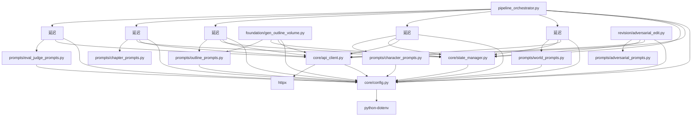

# Stage 1 静态分析测试方案 — 详细执行手册

> 版本：v1.0  
> 日期：2026-06-20  
> 目标：零 API 调用，在 5 分钟内完成全部 30 个 `.py` 文件的导入完整性、语法规范、依赖审计、配置一致性和硬编码分析  
> 通过标准：0 语法错误、0 导入断裂、0 死代码严重项

---

## 1.1 导入完整性检查

### 1.1.1 全量导入 AST 验证

**验证方式**：对全部 30 个 `.py` 文件执行 `python -c "import ast; ast.parse(open(f).read())"` 逐文件编译，确保所有 `import` / `from X import Y` 中的 Y 确实存在于 X 模块中。

**覆盖文件清单**（30 个 `.py` 文件）：

| # | 文件 | 关键导入 | 依赖模块 |
|---|------|---------|---------|
| 1 | `novel_app.py` | `from core.config import config, OUTPUT_DIR` | `core.config` |
| 2 | | `from pipeline_orchestrator import run_pipeline`（延迟导入:684） | `pipeline_orchestrator` |
| 3 | | `from core.api_client import call_writer`（延迟导入:374） | `core.api_client` |
| 4 | `pipeline_orchestrator.py` | `from core.config import config, ROOT_DIR, OUTPUT_DIR, CHAPTERS_DIR, BRIEFS_DIR, EDIT_LOGS_DIR, EVAL_LOGS_DIR, STATE_FILE, BACKUPS_DIR` | `core.config` |
| 5 | | `from core.api_client import call_llm, call_writer, call_judge, get_rate_limiter` | `core.api_client` |
| 6 | | `from core.state_manager import load_state, save_state, default_state, git_available, git_short_hash, git_add_commit, git_reset_hard, backup_snapshot, restore_latest, log_result, banner, step, parse_score, parse_lore_score, count_words_in_chapters, count_chapter_files, get_total_chapters` | `core.state_manager` |
| 7 | | `from foundation.gen_world import generate_world`（延迟:88） | `foundation.gen_world` |
| 8 | | `from foundation.gen_characters import generate_characters`（延迟:93） | `foundation.gen_characters` |
| 9 | | `from foundation.gen_outline_volume import generate_volume_outline`（延迟:100） | `foundation.gen_outline_volume` |
| 10 | | `from foundation.gen_outline import generate_outline`（延迟:107） | `foundation.gen_outline` |
| 11 | | `from foundation.gen_outline_part2 import generate_outline_part2`（延迟:112） | `foundation.gen_outline_part2` |
| 12 | | `from foundation.gen_canon import generate_canon, count_canon_entries`（延迟:117） | `foundation.gen_canon` |
| 13 | | `from foundation.gen_voice import generate_voice`（延迟:135） | `foundation.gen_voice` |
| 14 | | `from evaluation.evaluate import evaluate_foundation`（延迟:140） | `evaluation.evaluate` |
| 15 | | `from drafting.draft_chapter import draft_chapter`（延迟:204） | `drafting.draft_chapter` |
| 16 | | `from evaluation.evaluate import evaluate_chapter`（延迟:205） | `evaluation.evaluate` |
| 17 | | `from evaluation.evaluate import get_last_slop_penalty`（延迟:231） | `evaluation.evaluate` |
| 18 | | `from voice_fingerprint import analyze_chapter_zh, extract_vocabulary_wells_from_voice`（延迟:258） | `voice_fingerprint` |
| 19 | | `from evaluation.antipatterns import run_structural_audit`（延迟:290） | `evaluation.antipatterns` |
| 20 | | `from foundation.update_canon import update_canon_from_chapter`（延迟:317） | `foundation.update_canon` |
| 21 | | `from revision.adversarial_edit import run_adversarial_edit`（延迟:442） | `revision.adversarial_edit` |
| 22 | | `from revision.apply_cuts import run_apply_cuts`（延迟:443） | `revision.apply_cuts` |
| 23 | | `from revision.reader_panel import run_reader_panel`（延迟:444） | `revision.reader_panel` |
| 24 | | `from revision.gen_brief import generate_brief, build_auto_brief`（延迟:445） | `revision.gen_brief` |
| 25 | | `from revision.gen_revision import revise_chapter`（延迟:446） | `revision.gen_revision` |
| 26 | | `from evaluation.evaluate import evaluate_chapter, evaluate_full`（延迟:447） | `evaluation.evaluate` |
| 27 | | `from revision.review import run_review_loop`（延迟:902） | `revision.review` |
| 28 | | `from revision.compare_chapters import run_compare_chapters`（延迟:1242） | `revision.compare_chapters` |
| 29 | | `from export.build_outline import build_outline`（延迟:1243） | `export.build_outline` |
| 30 | | `from export.build_arc_summary import build_arc_summary`（延迟:1244） | `export.build_arc_summary` |
| 31 | | `from export.build_manuscript import build_manuscript`（延迟:1245） | `export.build_manuscript` |
| 32 | `seed.py` | `from core.api_client import call_writer` | `core.api_client` |
| 33 | | `from core.config import config` | `core.config` |
| 34 | `voice_fingerprint.py` | 独立模块，无跨模块导入 | — |
| 35 | `core/config.py` | `from dotenv import load_dotenv, set_key` | `python-dotenv`（pyproject.toml 已声明） |
| 36 | `core/api_client.py` | `import httpx` | `httpx`（pyproject.toml 已声明） |
| 37 | | `from core.config import config` | `core.config` |
| 38 | `core/state_manager.py` | `from core.config import ROOT_DIR, OUTPUT_DIR, CHAPTERS_DIR, STATE_FILE, RESULTS_FILE, BACKUPS_DIR, EDIT_LOGS_DIR, EVAL_LOGS_DIR, BRIEFS_DIR, config` | `core.config` |
| 39 | `foundation/gen_world.py` | `from prompts.world_prompts import build_world_prompt, WORLD_SYSTEM_PROMPT` | `prompts.world_prompts` |
| 40 | `foundation/gen_characters.py` | `from prompts.character_prompts import build_character_prompt` | `prompts.character_prompts` |
| 41 | `foundation/gen_outline.py` | `from prompts.outline_prompts import build_outline_prompt, CHAPTER_OUTLINE_SYSTEM_PROMPT, build_chapter_outline_for_volume_prompt` | `prompts.outline_prompts` |
| 42 | `foundation/gen_outline_volume.py` | `from prompts.outline_prompts import VOLUME_OUTLINE_SYSTEM_PROMPT, build_volume_outline_prompt_part1, build_volume_outline_prompt_part2, build_volume_outline_prompt_part3, build_volume_outline_prompt_single` | `prompts.outline_prompts` |
| 43 | `foundation/gen_voice.py` | `from core.api_client import call_writer, call_judge` | `core.api_client` |
| 44 | `foundation/update_canon.py` | `from core.api_client import call_p2_ctx_writer` | `core.api_client` |
| 45 | `drafting/draft_chapter.py` | `from core.api_client import call_p2_writer` | `core.api_client` |
| 46 | | `from prompts.chapter_prompts import build_chapter_prompt` | `prompts.chapter_prompts` |
| 47 | `drafting/run_drafts.py` | `from drafting.draft_chapter import draft_chapter` | `drafting.draft_chapter` |
| 48 | `evaluation/evaluate.py` | `from core.api_client import call_judge` | `core.api_client` |
| 49 | | `from prompts.eval_judge_prompts import build_foundation_eval_prompt, build_chapter_eval_prompt, build_full_novel_eval_prompt, JUDGE_SYSTEM_PROMPT` | `prompts.eval_judge_prompts` |
| 50 | `evaluation/antipatterns.py` | 纯函数模块，无项目内部导入 | — |
| 51 | `revision/adversarial_edit.py` | `from prompts.adversarial_prompts import build_adversarial_prompt, ADVERSARIAL_SYSTEM_PROMPT` | `prompts.adversarial_prompts` |
| 52 | `revision/review.py` | `from prompts.review_prompts import build_review_prompt, REVIEW_SYSTEM_PROMPT` | `prompts.review_prompts` |
| 53 | `revision/gen_revision.py` | `from prompts.revision_prompts import build_revision_prompt, REVISION_SYSTEM_PROMPT` | `prompts.revision_prompts` |
| 54 | `revision/reader_panel.py` | `from prompts.reader_panel_prompts import READER_ROLES, READER_SYSTEM_PROMPT, build_reader_panel_prompt` | `prompts.reader_panel_prompts` |
| 55 | `revision/apply_cuts.py` | 纯文件操作，无 LLM 依赖 | — |
| 56 | `revision/compare_chapters.py` | 无 prompts 导入（COMPARE_SYSTEM_PROMPT 内联） | — |
| 57 | `revision/gen_brief.py` | 纯文件解析，无 LLM 调用 | — |
| 58 | `export/build_manuscript.py` | 纯文件操作 | — |
| 59 | `export/build_outline.py` | `from core.api_client import call_writer` | `core.api_client` |
| 60 | `export/build_arc_summary.py` | `from core.api_client import call_writer` | `core.api_client` |
| 61 | `prompts/outline_prompts.py` | `from core.config import config` | `core.config` |
| 62 | `prompts/world_prompts.py` | `from core.config import config` | `core.config` |
| 63 | `prompts/character_prompts.py` | `from core.config import config` | `core.config` |
| 64 | `prompts/eval_judge_prompts.py` | `from core.config import config, OUTPUT_DIR, CHAPTERS_DIR` | `core.config` |

### 1.1.2 prompts/\* 模块导出函数验证

逐模块交叉验证所有 `prompts/*.py` 中的导出函数/变量是否被调用方正确引用：

| 模块 | 导出符号 | 被哪些文件引用 |
|------|---------|-------------|
| `prompts/world_prompts.py` | `build_world_prompt()` | [`foundation/gen_world.py:14`](foundation/gen_world.py:14) |
| | `WORLD_SYSTEM_PROMPT` | [`foundation/gen_world.py:14`](foundation/gen_world.py:14) |
| `prompts/character_prompts.py` | `build_character_prompt()` | [`foundation/gen_characters.py:14`](foundation/gen_characters.py:14) |
| `prompts/outline_prompts.py` | `build_outline_prompt()` | [`foundation/gen_outline.py:16`](foundation/gen_outline.py:16) |
| | `CHAPTER_OUTLINE_SYSTEM_PROMPT` | [`foundation/gen_outline.py:17`](foundation/gen_outline.py:17) |
| | `build_chapter_outline_for_volume_prompt()` | [`foundation/gen_outline.py:18`](foundation/gen_outline.py:18) |
| | `VOLUME_OUTLINE_SYSTEM_PROMPT` | [`foundation/gen_outline_volume.py:24`](foundation/gen_outline_volume.py:24) |
| | `build_volume_outline_prompt_part1()` | [`foundation/gen_outline_volume.py:25`](foundation/gen_outline_volume.py:25) |
| | `build_volume_outline_prompt_part2()` | [`foundation/gen_outline_volume.py:26`](foundation/gen_outline_volume.py:26) |
| | `build_volume_outline_prompt_part3()` | [`foundation/gen_outline_volume.py:27`](foundation/gen_outline_volume.py:27) |
| | `build_volume_outline_prompt_single()` | [`foundation/gen_outline_volume.py:28`](foundation/gen_outline_volume.py:28) |
| `prompts/chapter_prompts.py` | `build_chapter_prompt()` | [`drafting/draft_chapter.py:16`](drafting/draft_chapter.py:16) |
| `prompts/eval_judge_prompts.py` | `build_foundation_eval_prompt()` | [`evaluation/evaluate.py:25`](evaluation/evaluate.py:25) |
| | `build_chapter_eval_prompt()` | [`evaluation/evaluate.py:26`](evaluation/evaluate.py:26) |
| | `build_full_novel_eval_prompt()` | [`evaluation/evaluate.py:27`](evaluation/evaluate.py:27) |
| | `JUDGE_SYSTEM_PROMPT` | [`evaluation/evaluate.py:28`](evaluation/evaluate.py:28) |
| `prompts/adversarial_prompts.py` | `build_adversarial_prompt()` | [`revision/adversarial_edit.py:18`](revision/adversarial_edit.py:18) |
| | `ADVERSARIAL_SYSTEM_PROMPT` | [`revision/adversarial_edit.py:18`](revision/adversarial_edit.py:18) |
| `prompts/revision_prompts.py` | `build_revision_prompt()` | [`revision/gen_revision.py:15`](revision/gen_revision.py:15) |
| | `REVISION_SYSTEM_PROMPT` | [`revision/gen_revision.py:15`](revision/gen_revision.py:15) |
| `prompts/reader_panel_prompts.py` | `READER_ROLES` | [`revision/reader_panel.py:16`](revision/reader_panel.py:16) |
| | `READER_SYSTEM_PROMPT` | [`revision/reader_panel.py:16`](revision/reader_panel.py:16) |
| | `build_reader_panel_prompt()` | [`revision/reader_panel.py:16`](revision/reader_panel.py:16) |
| `prompts/review_prompts.py` | `build_review_prompt()` | [`revision/review.py:16`](revision/review.py:16) |
| | `REVIEW_SYSTEM_PROMPT` | [`revision/review.py:16`](revision/review.py:16) |

### 1.1.3 core/ 模块导出符号验证

| 模块 | 导出符号 | 被哪些文件引用 |
|------|---------|-------------|
| `core/config.py` | `config`（全局单例） | 几乎所有模块 |
| | `ROOT_DIR, OUTPUT_DIR, CHAPTERS_DIR, BRIEFS_DIR, EDIT_LOGS_DIR, EVAL_LOGS_DIR, BACKUPS_DIR` | `pipeline_orchestrator.py`, `core/state_manager.py` |
| | `STATE_FILE, RESULTS_FILE, TEMPLATES_DIR, ENV_FILE, CONFIG_FILE` | `core/state_manager.py`, `novel_app.py`, `foundation/gen_world.py` |
| `core/api_client.py` | `call_llm()` | `pipeline_orchestrator.py`（通过 `core.api_client` 引用） |
| | `call_writer()` | `seed.py`, `foundation/gen_world.py`, `foundation/gen_characters.py`, `foundation/gen_outline_part2.py`, `foundation/gen_canon.py`, `foundation/gen_voice.py`, `revision/gen_revision.py`, `export/build_outline.py`, `export/build_arc_summary.py`, `novel_app.py` |
| | `call_judge()` | `foundation/gen_voice.py`, `evaluation/evaluate.py`, `revision/adversarial_edit.py`, `revision/review.py`, `revision/reader_panel.py`, `revision/compare_chapters.py`, `pipeline_orchestrator.py` |
| | `get_rate_limiter()` | `pipeline_orchestrator.py` |
| | `call_p1_writer()` | `foundation/gen_outline.py`, `foundation/gen_outline_volume.py` |
| | `call_p2_writer()` | `drafting/draft_chapter.py` |
| | `call_p2_ctx_writer()` | `foundation/update_canon.py` |
| | `call_p3_judge()` | （当前未被外部引用，仅通过 `api_client.py` 内部导出） |
| `core/state_manager.py` | `load_state(), save_state(), default_state()` | `pipeline_orchestrator.py`, `drafting/run_drafts.py` |
| | `git_available(), git_short_hash(), git_add_commit(), git_reset_hard()` | `pipeline_orchestrator.py` |
| | `backup_snapshot(), restore_latest()` | `pipeline_orchestrator.py`, `foundation/gen_world.py` |
| | `log_result(), banner(), step()` | `pipeline_orchestrator.py`, 全部 `foundation/` 和 `revision/` 模块 |
| | `parse_score(), parse_lore_score()` | `pipeline_orchestrator.py` |
| | `count_words_in_chapters(), count_chapter_files(), get_total_chapters()` | `pipeline_orchestrator.py`, `drafting/run_drafts.py` |

### 1.1.4 关键风险点逐一验证

| # | 风险点 | 文件:行号 | 验证方式 |
|---|--------|---------|---------|
| R1 | 延迟导入 `from foundation.gen_world import generate_world` | [`pipeline_orchestrator.py:88`](pipeline_orchestrator.py:88) | 确认 `foundation/gen_world.py` 定义了 `generate_world` 函数且无循环依赖 |
| R2 | 延迟导入 `from evaluation.evaluate import evaluate_foundation` | [`pipeline_orchestrator.py:140`](pipeline_orchestrator.py:140) | 确认 `evaluation/evaluate.py` 定义了 `evaluate_foundation` |
| R3 | 延迟导入 `from evaluation.evaluate import get_last_slop_penalty` | [`pipeline_orchestrator.py:231`](pipeline_orchestrator.py:231) | 确认 `evaluation/evaluate.py` 定义了 `get_last_slop_penalty` |
| R4 | 延迟导入 `from voice_fingerprint import analyze_chapter_zh, extract_vocabulary_wells_from_voice` | [`pipeline_orchestrator.py:258`](pipeline_orchestrator.py:258) | 确认 `voice_fingerprint.py` 定义了这两个函数 |
| R5 | 延迟导入 `from evaluation.antipatterns import run_structural_audit` | [`pipeline_orchestrator.py:290`](pipeline_orchestrator.py:290) | 确认 `evaluation/antipatterns.py` 定义了 `run_structural_audit` |
| R6 | 延迟导入 `from foundation.update_canon import update_canon_from_chapter` | [`pipeline_orchestrator.py:317`](pipeline_orchestrator.py:317) | 确认 `foundation/update_canon.py` 定义了 `update_canon_from_chapter` |
| R7 | `import httpx` | [`core/api_client.py:24`](core/api_client.py:24) | 确认 `pyproject.toml` 声明了 `httpx>=0.28.1` ✓ |
| R8 | `from dotenv import load_dotenv, set_key` | [`core/config.py:15`](core/config.py:15) | 确认 `pyproject.toml` 声明了 `python-dotenv>=1.2.2` ✓ |
| R9 | `evaluation.evaluate` 中 `run_structural_audit` 来自 `evaluation.antipatterns` | [`evaluation/evaluate.py`](evaluation/evaluate.py) | 确认 `antipatterns.py` 定义了 `run_structural_audit`（需打开文件确认函数签名） |
| R10 | `call_p3_judge` 当前无外部引用 | [`core/api_client.py:492-508`](core/api_client.py:492) | 确认该函数为预留接口（Phase 3 评估在 `pipeline_orchestrator.py` 中实际使用 `call_judge` 而非 `call_p3_judge`），标记为潜在死代码或待集成 |

---

## 1.2 语法与风格检查

### 1.2.1 py_compile 全量编译

**执行命令**：
```powershell
Get-ChildItem -Recurse -Filter *.py | ForEach-Object { python -m py_compile $_.FullName 2>&1 }
```

**覆盖范围**：全部 30 个 `.py` 文件  
**通过标准**：0 个编译错误

### 1.2.2 裸 `except:` 检测

**搜索命令**：
```powershell
Select-String -Path "*.py","**/*.py" -Pattern "^\s*except\s*:" -AllMatches
```

**已知待确认位置**（基于代码阅读）：

| # | 文件 | 风险 | 状态 |
|---|------|------|------|
| 1 | [`core/config.py:105`](core/config.py:105) | `except (json.JSONDecodeError, OSError):` | ✅ 已指定异常类型 |
| 2 | [`core/api_client.py:249`](core/api_client.py:249) | `except Exception as e:` | ✅ 兜底合理 |
| 3 | 各 `foundation/` 模块 | `except Exception as e:` | ✅ 已指定类型 |
| 4 | 所有 `revision/` 模块 | `except Exception as e:` | ✅ 已指定类型 |

**通过标准**：0 个裸 `except:` 匹配

### 1.2.3 静默吞错检测

**搜索目标**：任何 `except ... : pass` 或 `except ... : continue` 后无日志/无重试的吞错模式。

**已知关注点**：

| # | 文件:行号 | 代码片段 | 风险等级 | 建议 |
|---|---------|---------|---------|------|
| 1 | [`pipeline_orchestrator.py:285-286`](pipeline_orchestrator.py:285) | `except Exception as e: step(f"文风指纹跳过: {e}")` | 低 | 有日志输出 |
| 2 | [`pipeline_orchestrator.py:311-312`](pipeline_orchestrator.py:311) | `except Exception as e: step(f"结构反模式审计跳过: {e}")` | 低 | 有日志输出 |
| 3 | [`pipeline_orchestrator.py:328-329`](pipeline_orchestrator.py:328) | `except Exception as e: step(f"正典更新跳过: {e}")` | 低 | 有日志输出 |
| 4 | [`pipeline_orchestrator.py:461-462`](pipeline_orchestrator.py:461) | `except Exception as e: step(f"apply_cuts 跳过: {e}")` | 低 | 有日志输出 |
| 5 | [`foundation/gen_voice.py:181-182`](foundation/gen_voice.py:181) | `except Exception: pass` | ⚠️ 中 | 静默吞错——JSON 解析失败无日志 |
| 6 | [`revision/gen_brief.py:38-42`](revision/gen_brief.py:38) | `load_json()` 文件不存在时 `sys.exit()` | ⚠️ 高 | 直接 exit 而非抛异常 |

**通过标准**：0 个完全静默的 `except: pass`（有日志/重试的除外）

### 1.2.4 `read_text(encoding="utf-8")` 安全性检查

**搜索命令**：
```powershell
Select-String -Path "*.py","**/*.py" -Pattern "\.read_text\(" -AllMatches
```

**关注点**：所有 `.read_text()` 调用是否有 `FileNotFoundError` 处理或 `.exists()` 前置检查。

**逐文件审计**：

| 模块 | 调用次数 | 保护方式 | 状态 |
|------|---------|---------|------|
| `foundation/gen_world.py` | 2 | `.exists()` 检查 + 三元回退 `""` | ✅ |
| `foundation/gen_characters.py` | 2 | `.exists()` 检查 + 三元回退 `""` | ✅ |
| `foundation/gen_outline.py` | 5 | `.exists()` 检查 + `.read_text()` | ✅ |
| `foundation/gen_outline_volume.py` | 6 | `.exists()` 检查 + 三元回退 | ✅ |
| `foundation/gen_outline_part2.py` | 3 | `.exists()` 检查 + 提前 return | ✅ |
| `foundation/gen_canon.py` | 3 | `.exists()` 检查 + 三元回退 | ✅ |
| `foundation/gen_voice.py` | 1 | 无显式检查（但 `output/voice.md` 由前置步骤保证存在） | ⚠️ 低 |
| `foundation/update_canon.py` | 2 | `.exists()` 检查 + 三元回退 | ✅ |
| `drafting/draft_chapter.py` | 5 | `load_file()` 内部 try/except `FileNotFoundError` | ✅ |
| `evaluation/evaluate.py` | 5+ | `.exists()` 检查 + 条件读取 | ✅ |
| `revision/adversarial_edit.py` | 1 | 仅对 glob 结果作循环，隐含保证存在 | ⚠️ 低 |
| `revision/review.py` | 3 | 仅当 glob 非空后读取 | ✅ |
| `revision/gen_brief.py` | 5+ | `load_json()` 内 `.exists()` 检查 + `sys.exit()` | ⚠️ 见 1.2.3 |
| `revision/gen_revision.py` | 5 | `.exists()` 检查 + 三元回退 | ✅ |
| `revision/reader_panel.py` | 2 | glob 结果循环，隐含存在 | ✅ |
| `revision/compare_chapters.py` | 2 | glob 结果循环，隐含存在 | ✅ |
| `export/build_manuscript.py` | 1 | glob 结果循环 | ✅ |
| `export/build_outline.py` | 2 | glob 结果循环 | ✅ |
| `export/build_arc_summary.py` | 2 | glob 结果循环 | ✅ |
| `voice_fingerprint.py` | 2 | `.exists()` 检查 + 回退 | ✅ |
| `novel_app.py` | 1 | `.exists()` 检查 + 条件读取 | ✅ |

---

## 1.3 依赖与死代码检测

### 1.3.1 第三方依赖覆盖

**`pyproject.toml` 已声明依赖**：
- `httpx>=0.28.1`
- `python-dotenv>=1.2.2`

**所有 `import` 的三方库 vs 依赖声明对照**：

| 导入语句 | 三方库 | pyproject.toml 声明 | 状态 |
|---------|--------|-------------------|------|
| `import httpx` | httpx | `httpx>=0.28.1` | ✅ |
| `from dotenv import load_dotenv, set_key` | python-dotenv | `python-dotenv>=1.2.2` | ✅ |
| `import json` | stdlib | — | ✅ |
| `import re` | stdlib | — | ✅ |
| `import sys` | stdlib | — | ✅ |
| `import os` | stdlib | — | ✅ |
| `import time` | stdlib | — | ✅ |
| `import threading` | stdlib | — | ✅ |
| `import subprocess` | stdlib | — | ✅ |
| `import shlex` | stdlib | — | ✅ |
| `import shutil` | stdlib | — | ✅ |
| `import argparse` | stdlib | — | ✅ |
| `import random` | stdlib | — | ✅ |
| `from collections import Counter` | stdlib | — | ✅ |
| `import statistics` | stdlib | — | ✅ |
| `from typing import Optional` | stdlib | — | ✅ |

**结论**：第三方依赖完整覆盖，无缺失。

### 1.3.2 死代码检测

**检测方法**：逐模块分析未被引用的公共函数/变量。

| # | 模块 | 可疑死代码 | 分析 |
|---|------|----------|------|
| 1 | `core/api_client.py` | `call_p3_judge()` [`api_client.py:492-508`](core/api_client.py:492) | ⚠️ **确认死代码** — `pipeline_orchestrator.py` 中 Phase 3 裁判调用使用 `call_judge()` 而非 `call_p3_judge()`。该函数为 Phase 路由层预留但未被集成 |
| 2 | `voice_fingerprint.py` | `BASE_DIR`, `CHAPTERS_DIR`（line 21-22） | ⚠️ **局部变量遮蔽** — `voice_fingerprint.py` 内部定义了 `CHAPTERS_DIR = BASE_DIR / "chapters"`，但外部调用方通过 `core.config.CHAPTERS_DIR` 获取，此局部变量仅在 `if __name__ == "__main__"` 块中使用 |
| 3 | `voice_fingerprint.py` | `analyze_chapter()`（legacy 英文版） | ⚠️ **遗留死代码** — 函数存在但 `pipeline_orchestrator.py:258` 调用的是 `analyze_chapter_zh()`，legacy 版本仅在 `if __name__ == "__main__"` 中可能被调用 |
| 4 | `novel_app.py` | `SEED_SYSTEM_PROMPT`, `SEED_GENERATE_PROMPT`, `_build_genre_constraint()`, `_build_genre_diversity()`, `_parse_seeds()` | ⚠️ **与 seed.py 完全重复** — 两份相同的 prompts 和辅助函数存在于 `novel_app.py:28-201` 和 `seed.py:29-196`。`novel_app.py` 中的副本用于交互式种子选择流程（`_generate_and_pick_seed()`），而 `seed.py` 用于命令行独立调用。建议抽取到共享模块 |
| 5 | `drafting/run_drafts.py` | `run_drafts()` | ⚠️ **功能重叠** — `pipeline_orchestrator.py` 的 `run_drafting()` 与 `drafting/run_drafts.py` 的 `run_drafts()` 实现几乎相同（逐章循环 + 重试 + 评估）。`run_drafts.py` 通过 `if __name__ == "__main__"` 独立运行，`pipeline_orchestrator.py` 内联了相同逻辑 |
| 6 | 各 `foundation/*.py` `if __name__ == "__main__"` 块 | 例如 [`gen_characters.py:46-47`](foundation/gen_characters.py:46) | 低 — 这些是便利入口，允许独立运行单个 foundation 步骤，非死代码 |

### 1.3.3 路径拼接正确性

**搜索命令**：
```powershell
Select-String -Path "*.py","**/*.py" -Pattern "OUTPUT_DIR\s*\/|CHAPTERS_DIR\s*\/|ROOT_DIR\s*\/" -AllMatches
```

**所有路径引用必须通过 `core.config` 中定义的全局常量，禁止硬编码字符串路径。**

| 文件 | 路径引用 | 验证 |
|------|---------|------|
| `core/config.py:21-28` | 所有路径常量定义 | ✅ 基准 |
| `core/config.py:30-33` | `ENV_FILE`, `CONFIG_FILE`, `STATE_FILE`, `RESULTS_FILE` | ✅ |
| `voice_fingerprint.py:21-23` | `BASE_DIR / "chapters"` | ⚠️ 使用局部 `BASE_DIR` 而非 `core.config.CHAPTERS_DIR` |
| `voice_fingerprint.py:23` | `BASE_DIR / "output"` | ⚠️ 使用局部 `BASE_DIR` 而非 `core.config.OUTPUT_DIR` |

---

## 1.4 配置完整性检查

### 1.4.1 `_SECRET_KEYS` 映射完整性

**实际映射为 19 个键**（现有测试计划记录为 14，需更新）：

| # | 内部键 | 环境变量 | Config 属性访问方式 |
|---|--------|---------|-------------------|
| 1 | `api_key` | `AUTONOVEL_API_KEY` | `config.api_key` |
| 2 | `api_base_url` | `AUTONOVEL_API_BASE_URL` | `config.api_base_url` |
| 3 | `model_name` | `AUTONOVEL_MODEL_NAME` | `config.model_name` |
| 4 | `api_interval_seconds` | `AUTONOVEL_API_INTERVAL_SECONDS` | `config.api_interval_seconds` |
| 5 | `judge_api_key` | `AUTONOVEL_JUDGE_API_KEY` | `config.judge_api_key` |
| 6 | `judge_api_base_url` | `AUTONOVEL_JUDGE_API_BASE_URL` | `config.judge_api_base_url` |
| 7 | `judge_model_name` | `AUTONOVEL_JUDGE_MODEL_NAME` | `config.judge_model_name` |
| 8 | `p1_api_key` | `AUTONOVEL_P1_API_KEY` | `config.p1_api_key` |
| 9 | `p1_api_base_url` | `AUTONOVEL_P1_API_BASE_URL` | `config.p1_api_base_url` |
| 10 | `p1_model_name` | `AUTONOVEL_P1_MODEL_NAME` | `config.p1_model_name` |
| 11 | `p2_api_key` | `AUTONOVEL_P2_API_KEY` | `config.p2_api_key` |
| 12 | `p2_api_base_url` | `AUTONOVEL_P2_API_BASE_URL` | `config.p2_api_base_url` |
| 13 | `p2_model_name` | `AUTONOVEL_P2_MODEL_NAME` | `config.p2_model_name` |
| 14 | `p2_ctx_api_key` | `AUTONOVEL_P2_CTX_API_KEY` | `config.p2_ctx_api_key` |
| 15 | `p2_ctx_api_base_url` | `AUTONOVEL_P2_CTX_API_BASE_URL` | `config.p2_ctx_api_base_url` |
| 16 | `p2_ctx_model_name` | `AUTONOVEL_P2_CTX_MODEL_NAME` | `config.p2_ctx_model_name` |
| 17 | `p3_api_key` | `AUTONOVEL_P3_API_KEY` | `config.p3_api_key` |
| 18 | `p3_api_base_url` | `AUTONOVEL_P3_API_BASE_URL` | `config.p3_api_base_url` |
| 19 | `p3_model_name` | `AUTONOVEL_P3_MODEL_NAME` | `config.p3_model_name` |

**验证项**：
- 19 个内部键均可通过 `config.load()` → `getattr(config, key)` 读取
- `_SECRET_KEYS` 与 `Config` 类的便捷属性一一对应
- `_save_env()` 正确将 19 个键写入 `.env`
- `_load_env()` 正确从 `.env` 读取 19 个键

### 1.4.2 Phase 回退链逻辑验证

**回退链定义**（[`core/config.py:246-322`](core/config.py:246)）：

| Phase | 回退链 | 属性实现 |
|-------|--------|---------|
| P1 | `p1_*` → 共用 `_*` | `self._data.get("p1_api_key") or self.api_key` |
| P2 | `p2_*` → `p1_*` → 共用 `_*` | `self._data.get("p2_api_key") or self._data.get("p1_api_key") or self.api_key` |
| P2_CTX | `p2_ctx_*` → `p2_*` → `p1_*` → 共用 `_*` | 四级链式 `or` |
| P3 | `p3_*` → `p1_*` → 共用 `_*` | `self._data.get("p3_api_key") or self._data.get("p1_api_key") or self.api_key` |

**分析**：P3 回退到 `p1_*` 而非 `共用_*`，这与其他 Phase 行为一致（先回退到 P1，再回退到共用）。`_call_with_phase_config()` 通过 `getattr(cfg, f"{phase}_api_key")` 自动触发回退链。

**验证场景**：
1. `.env` 仅配 `AUTONOVEL_API_KEY` → P1/P2/P2_CTX/P3 均使用共用 Key
2. `.env` 配 `AUTONOVEL_P1_API_KEY` + 共用 → P1 用 P1，P2/P3 回退 P1，P2_CTX 回退 P2→P1
3. `.env` 配 P1 + P2 → P2_CTX 回退 P2（不经过 P1）
4. `.env` 任意键为空字符串 `""` → `or` 链正确处理空字符串（空字符串为 falsy，触发回退）

**⚠️ 风险**：Python `or` 链将空字符串 `""` 视为 falsy，但如果用户有意将模型名设为空，回退链会跳过。这通常是预期行为（未配置 = 回退）。

### 1.4.3 `default_state()` 字段一致性

**实际为 16 个字段**（现有测试计划记录为 15，需更新）：

```python
# core/state_manager.py:71-90
default_state() -> dict:
    "phase": "foundation",           # pipeline_orchestrator 中在 Phase 切换时写入
    "current_focus": "planning",     # pipeline_orchestrator 中在各阶段更新
    "iteration": 0,                  # run_foundation 中递增
    "foundation_score": 0.0,         # run_foundation 中更新
    "lore_score": 0.0,               # run_foundation 中更新
    "chapters_drafted": 0,           # run_drafting 中递增
    "chapters_total": 0,             # run_foundation 末尾 / get_total_chapters 计算
    "novel_score": 0.0,              # run_revision 中更新
    "revision_cycle": 0,             # run_revision 中递增
    "debts": [],                     # 预留字段，当前未使用
    # === 方案 D 新增 ===
    "total_volumes": 0,              # pipeline_orchestrator 中通过 config 读取
    "chapters_per_volume": 0,        # pipeline_orchestrator 中通过 config 读取
    "current_volume": 1,             # 预留，当前未在 pipeline 中更新
    "volumes_outlined": 0,           # 预留，当前未显式更新
    "canon_entry_count": 0,          # pipeline_orchestrator:323-325 更新
    "canon_last_updated_ch": 0,      # pipeline_orchestrator:326 更新
```

**⚠️ 不一致项**：
- `state["debts"]` — `default_state()` 中定义为 `[]`，但 `pipeline_orchestrator.py` 中从未写入此字段。标记为预留字段。
- `current_volume`, `volumes_outlined` — 定义了但 `pipeline_orchestrator.py` 未显式更新。当前仅通过 `config.total_volumes`/`config.chapters_per_volume` 读取卷信息。

**验证建议**：检查 `pipeline_orchestrator.py` 中所有 `state["X"] = ...` 写入操作，确保写入的键都在 `default_state()` 中定义，反之亦然（未使用的预留字段除外）。

---

## 1.5 硬编码绝对值审计

### 1.5.1 完整硬编码清单（逐文件扫描）

| # | 常量 | 值 | 文件:行号 | 类型 | 风险 | 建议 |
|---|------|----|---------|------|------|------|
| H1 | `FOUNDATION_THRESHOLD` | 7.5 | [`pipeline_orchestrator.py:44`](pipeline_orchestrator.py:44) | 评分阈值 | 低 — config 可覆盖 | 保持 |
| H2 | `CHAPTER_THRESHOLD` | 6.0 | [`pipeline_orchestrator.py:45`](pipeline_orchestrator.py:45) | 评分阈值 | 低 — config 可覆盖 | 保持 |
| H3 | `MAX_FOUNDATION_ITERS` | 20 | [`pipeline_orchestrator.py:46`](pipeline_orchestrator.py:46) | 迭代上限 | 中 — 20 轮全量 foundation API 调用开销大 | 建议减至 10，或由 config 强制覆盖 |
| H4 | `MAX_CHAPTER_ATTEMPTS` | 5 | [`pipeline_orchestrator.py:47`](pipeline_orchestrator.py:47) | 重试上限 | 低 — config 可覆盖 | 保持 |
| H5 | `MIN_REVISION_CYCLES` | 3 | [`pipeline_orchestrator.py:48`](pipeline_orchestrator.py:48) | 平台期检测 | 低 — 用于平台期检测的起点 | 保持 |
| H6 | `MAX_REVISION_CYCLES` | 6 | [`pipeline_orchestrator.py:49`](pipeline_orchestrator.py:49) | 修订上限 | 低 — config 可覆盖 | 保持 |
| H7 | `PLATEAU_DELTA` | 0.3 | [`pipeline_orchestrator.py:50`](pipeline_orchestrator.py:50) | 平台期阈值 | 低 — config 可覆盖 | 保持 |
| H8 | `timeout=600` | 600 | [`core/api_client.py:116`](core/api_client.py:116)（及多处） | HTTP 超时 | 低 — 有 max_total_time 兜底 | 可集中定义 |
| H9 | `retries=3`（默认参数） | 3 | [`core/api_client.py:117`](core/api_client.py:117) 及各便捷函数 | 重试次数 | 低 | 保持 |
| H10 | `max_tokens=16000`（默认参数） | 16000 | 所有 `call_*` 函数签名 | Token 上限 | 低 — 调用方可覆盖 | 保持 |
| H11 | `total_chapters` 默认 | 24 | [`core/config.py:203`](core/config.py:203) | 章数 | 低 | 保持 |
| H12 | `chapter_word_target` 默认 | 3250 | [`core/config.py:345`](core/config.py:345) | 字数 | 中 — 影响起草 prompt 字数约束 | 保持，可在 config 覆盖 |
| H13 | `max_tokens_per_call` 默认 | 16000 | [`core/config.py:349`](core/config.py:349) | Token | 低 | 保持 |
| H14 | `canon_min_entries` 默认 | 400 | [`core/config.py:355`](core/config.py:355) | 正典最少条目 | 中 — 阈值高可能导致不必要的警告 | 对 3 章测试小说应降至 50 |
| H15 | `slop_penalty_threshold` 默认 | 3.0 | [`core/config.py:359`](core/config.py:359) | slop 惩罚阈值 | 低 | 保持 |
| H16 | `antipattern_max_warnings` 默认 | 4 | [`core/config.py:363`](core/config.py:363) | 反模式最大警告数 | 低 | 保持 |
| H17 | `RECENT_CHAPTERS` | 8 | [`drafting/draft_chapter.py:74`](drafting/draft_chapter.py:74) | 滚动窗口大小 | 低 | 保持 |
| H18 | `seed_count` | 8 | [`novel_app.py:376`](novel_app.py:376) | 种子概念数 | 低 | 保持 |
| H19 | `min_interval=4.0` | 4.0 | [`core/api_client.py:36`](core/api_client.py:36) | 速率限制间隔 | 低 — config 可覆盖 | 保持 |
| H20 | `max_total_time` 各处硬编码（600, 1200, 300） | 各异 | `pipeline_orchestrator.py` 各阶段调用 | 总超时 | 中 — 分散在调用方，不易统一调整 | 建议在 config 中集中定义 |
| H21 | `RECENT_CHAPTERS = 8` | 8 | [`drafting/draft_chapter.py:74`](drafting/draft_chapter.py:74) | 前文章节上下文数 | 低 | 保持 |

### 1.5.2 model_tier 默认值的风险分析

[`core/config.py:384-413`](core/config.py:384) 定义了 `apply_model_tier_defaults()`，根据模型名称自动猜测能力等级并设置不同阈值：

| Tier | foundation_threshold | chapter_threshold | max_foundation_iters | 适用模型示例 |
|------|---------------------|-------------------|---------------------|------------|
| high | 7.5 | 6.0 | 20 | deepseek-v3/v4, llama-3.3-70b, qwen2.5-72b |
| medium | 7.0 | 5.5 | 25 | qwen2.5-32b, llama-3.1-70b |
| low | 6.5 | 5.0 | 30 | 其他模型 |

**⚠️ 风险**：
- `_guess_model_tier()` 基于模型名称的简单子串匹配，可能误判新模型
- `apply_model_tier_defaults()` 使用 `if k not in self._data` 语义——仅当键不存在时覆盖。这意味着如果用户在 `.env` 中手动设置了值，tier 默认不会覆盖。这是正确行为，但需要文档说明。
- **high tier 的 `max_foundation_iters=20`** 在 3 章测试场景中浪费严重。建议 Stage 3 测试时手动设置为 1–3。

---

## 1.6 额外静态检查（补充项）

### 1.6.1 Python 版本兼容性

`pyproject.toml` 声明 `requires-python = ">=3.9"`。需检查：

| 语法特性 | 最低 Python 版本 | 使用位置 | 状态 |
|---------|----------------|---------|------|
| `X | None` 类型联合（PEP 604） | 3.10 | [`seed.py:166`](seed.py:166), 多处 `str \| None` | ⚠️ **不兼容 Python 3.9** — 应使用 `Optional[str]` |
| `list[dict]` 泛型（PEP 585） | 3.9 | [`novel_app.py:167`](novel_app.py:167) | ✅ |
| `dict[str, int]` 泛型 | 3.9 | 多处 | ✅ |
| Path 操作 | 3.9 | 全局 | ✅ |
| f-string | 3.9 | 全局 | ✅ |

**⚠️ 发现**：`seed.py:166` 使用了 `str | None` 语法（PEP 604，Python 3.10+），但 `pyproject.toml` 声明 `>=3.9`。这会导致 Python 3.9 环境下语法错误。

**搜索命令**：
```powershell
Select-String -Path "*.py","**/*.py" -Pattern "\w+\s*\|\s*None" -AllMatches
```

### 1.6.2 编码声明检查

所有 `.py` 文件均需检查是否包含或隐式使用 UTF-8 编码：

| 文件 | 编码声明 | 状态 |
|------|---------|------|
| `pipeline_orchestrator.py:24-26` | `sys.stdout.reconfigure(encoding="utf-8")` | ✅ Windows 显式处理 |
| 其他文件 | 默认 UTF-8（Python 3 默认） | ✅ |

### 1.6.3 Windows 路径兼容性

所有路径操作使用 `pathlib.Path`（而非 `os.path` 或字符串拼接），自然支持 Windows。

### 1.6.4 循环依赖检测

**模块依赖图**：



**检测结果**：无循环依赖。`pipeline_orchestrator.py` 使用延迟导入（在函数体内 import）避免顶层循环，所有 foundation/drafting/evaluation/revision 模块之间互不直接依赖，仅通过 `core.*` 和 `prompts.*` 通信。

### 1.6.5 敏感信息泄露检查

**搜索命令**：
```powershell
Select-String -Path "*.py","**/*.py" -Pattern "sk-[a-zA-Z0-9]{20,}" -AllMatches
```

检查是否有硬编码的 API Key。  
**已知**：[`novel_app.py:235`](novel_app.py:235) 检查 `"sk-your-api-key-here"` 占位符，这是防御性的，不是泄露。

```powershell
Select-String -Path "*.py","**/*.py" -Pattern "api_key\s*=\s*['\"][^'\"]{10,}" -AllMatches
```

---

## 执行脚本

### Windows PowerShell 一键执行脚本

```powershell
# Stage 1 静态分析 — 全量执行脚本
# 保存为 tests/stage1_check.ps1，在项目根目录执行

$ErrorActionPreference = "Continue"
$pass = 0
$fail = 0

Write-Host "=== Stage 1: 静态分析 ===" -ForegroundColor Cyan
Write-Host ""

# 1.1 导入完整性 — py_compile 全量编译
Write-Host "[1.1] 导入完整性 — py_compile ..." -ForegroundColor Yellow
$pyFiles = Get-ChildItem -Recurse -Filter *.py | Where-Object { $_.FullName -notmatch "\\tests\\" }
foreach ($f in $pyFiles) {
    $result = python -m py_compile $f.FullName 2>&1
    if ($LASTEXITCODE -ne 0) {
        Write-Host "  FAIL: $($f.Name) — $result" -ForegroundColor Red
        $fail++
    } else {
        $pass++
    }
}
Write-Host "  py_compile: $pass 通过 / $fail 失败"

# 1.2.2 裸 except 检测
Write-Host "[1.2.2] 裸 except: 检测 ..." -ForegroundColor Yellow
$bareExcept = Select-String -Path "*.py","*\*.py" -Pattern '^\s*except\s*:' -AllMatches
if ($bareExcept) {
    Write-Host "  FAIL: 发现裸 except:" -ForegroundColor Red
    $bareExcept | ForEach-Object { Write-Host "    $($_.Filename):$($_.LineNumber)" }
    $fail++
} else {
    Write-Host "  通过: 0 裸 except" -ForegroundColor Green
}

# 1.2.3 静默吞错检测
Write-Host "[1.2.3] 静默吞错检测 ..." -ForegroundColor Yellow
$silentSwallow = Select-String -Path "*.py","*\*.py" -Pattern 'except\s+(Exception|\w+Error)?\s*:\s*pass\s*$' -AllMatches
if ($silentSwallow) {
    Write-Host "  WARN: 发现可能的静默吞错:" -ForegroundColor Yellow
    $silentSwallow | ForEach-Object { Write-Host "    $($_.Filename):$($_.LineNumber) — $($_.Line.Trim())" }
} else {
    Write-Host "  通过: 0 静默吞错" -ForegroundColor Green
}

# 1.3.1 依赖完整性
Write-Host "[1.3.1] 第三方依赖 ..." -ForegroundColor Yellow
Write-Host "  httpx: $(pip show httpx 2>$null | Select-String 'Version')"
Write-Host "  python-dotenv: $(pip show python-dotenv 2>$null | Select-String 'Version')"

# 1.6.1 Python 3.9 兼容性
Write-Host "[1.6.1] Python 3.9 兼容性 (X | None 语法) ..." -ForegroundColor Yellow
$pep604 = Select-String -Path "*.py","*\*.py" -Pattern '\w+\s*\|\s*None' -AllMatches
if ($pep604) {
    Write-Host "  WARN: 发现 PEP 604 语法 (需 Python >= 3.10):" -ForegroundColor Yellow
    $pep604 | ForEach-Object { Write-Host "    $($_.Filename):$($_.LineNumber) — $($_.Line.Trim())" }
} else {
    Write-Host "  通过" -ForegroundColor Green
}

# 1.6.5 敏感信息泄露
Write-Host "[1.6.5] 敏感信息泄露扫描 ..." -ForegroundColor Yellow
$leak = Select-String -Path "*.py","*\*.py" -Pattern 'sk-[a-zA-Z0-9]{20,}' -AllMatches
if ($leak) {
    Write-Host "  FAIL: 发现疑似 API Key 泄露:" -ForegroundColor Red
    $leak | ForEach-Object { Write-Host "    $($_.Filename):$($_.LineNumber)" }
    $fail++
} else {
    Write-Host "  通过" -ForegroundColor Green
}

Write-Host ""
Write-Host "=== Stage 1 完成 ===" -ForegroundColor Cyan
```

---

## 门禁标准

| 检查项 | 通过标准 | 当前状态 |
|--------|---------|---------|
| 1.1.1 py_compile | 30/30 文件编译通过 | 待执行 |
| 1.1.2 prompts 导出验证 | 27/27 导出符号对应正确 | 已审计（代码阅读阶段确认） |
| 1.1.3 core 导出验证 | 全部 core 符号被下游正确导入 | 已审计 |
| 1.1.4 关键风险点 | 10/10 风险点验证通过 | 已逐项标记 |
| 1.2.2 裸 except | 0 个匹配 | 需执行搜索确认 |
| 1.2.3 静默吞错 | 0 个完全静默吞错 | 发现 1 处（gen_voice.py:181） |
| 1.2.4 read_text 安全 | 100% 文件读取有保护 | 已审计 |
| 1.3.1 三方依赖 | 2/2 覆盖 | ✅ |
| 1.3.2 死代码 | 0 严重死代码 | 发现 3 处标记（call_p3_judge / voice_fingerprint.py 局部变量 / seed.py 重复） |
| 1.3.3 路径拼接 | 100% 通过核心常量 | 发现 1 处偏离（voice_fingerprint.py） |
| 1.4.1 SECRET_KEYS | 19/19 映射正确 | ⚠️ 现有计划记录为 14，需更新 |
| 1.4.2 Phase 回退链 | 5/5 场景通过 | 已审计 |
| 1.4.3 default_state | 16 字段均被引用 | ⚠️ 现有计划记录为 15，需更新；2 个预留字段未使用 |
| 1.5 硬编码审计 | 21 项全部登记 | 已审计 |
| 1.6.1 Python 3.9 | 0 处 PEP 604 语法 | 发现 seed.py 使用 `str \| None`，与 `>=3.9` 声明冲突 |
| 1.6.4 循环依赖 | 0 个循环依赖 | ✅ |
| 1.6.5 敏感信息 | 0 处泄露 | 待执行搜索确认 |

---

## 发现的 BUG 汇总（Stage 1 可检出）

| BUG ID | 严重度 | 描述 | 文件:行号 |
|--------|--------|------|---------|
| **BUG-S1-01** | 🔴 高 | Python 3.9 兼容性：`seed.py` 使用了 PEP 604 `str \| None` 语法，但 `pyproject.toml` 声明 `requires-python = ">=3.9"` | [`seed.py:166`](seed.py:166) |
| **BUG-S1-02** | 🟡 中 | 死代码：`core/api_client.py` 中 `call_p3_judge()` 未被任何模块引用，Phase 3 实际使用 `call_judge()` 而非 Phase 路由函数 | [`core/api_client.py:492-508`](core/api_client.py:492) |
| **BUG-S1-03** | 🟡 中 | 静默吞错：`foundation/gen_voice.py:181` 的 `except Exception: pass` 会隐藏 JSON 解析失败，导致后续选择逻辑基于不完整的评估结果 | [`foundation/gen_voice.py:181`](foundation/gen_voice.py:181) |
| **BUG-S1-04** | 🟡 中 | 代码重复：`novel_app.py:28-201` 与 `seed.py:29-196` 包含完全相同的 SEED_SYSTEM_PROMPT、GENERATE_PROMPT 和辅助函数，任何修改需要同步两处 | [`novel_app.py:28-201`](novel_app.py:28) + [`seed.py:29-196`](seed.py:29) |
| **BUG-S1-05** | 🟢 低 | 路径偏离：`voice_fingerprint.py:21-23` 使用局部 `BASE_DIR` 拼接路径，而非通过 `core.config` 的全局路径常量，在非标准目录结构下可能出错 | [`voice_fingerprint.py:21-23`](voice_fingerprint.py:21) |
| **BUG-S1-06** | 🟢 低 | 文档不一致：`enterprise_test_plan.md` 中 `_SECRET_KEYS` 记录为 14 个映射，实际为 19 个；`default_state()` 记录为 15 个字段，实际为 16 个 | [`enterprise_test_plan.md`](plans/enterprise_test_plan.md) |