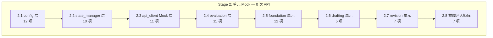

# Stage 2 单元/边界/故障注入测试方案 — 详细执行手册

> 版本：v1.0  
> 日期：2026-06-20  
> 目标：零 API 调用，用 Mock 隔离全部外部依赖，验证每个模块的逻辑正确性和异常处理完整性  
> 策略：Monkey-patch `core/api_client._call_llm_internal` 返回可控 Mock 响应；纯函数直接验证  
> 通过标准：100% 用例通过，0 未处理异常，0 静默吞错

---

## 前置条件

1. **Stage 1 阻塞项已修复**：
   - BUG-S1-01: 6 处 `str | None` → `Optional[str]`（[`evaluation/evaluate.py:274,314`](evaluation/evaluate.py:274), [`novel_app.py:110,121`](novel_app.py:110), [`seed.py:166,177`](seed.py:166)）
   - BUG-S1-07: [`core/state_manager.py:90`](core/state_manager.py:90) 已添加 `"review_revision_round": 0` ✅（当前源码已包含）

2. **测试环境**：
   ```powershell
   # 临时删除或重命名 .env 避免干扰（测试中会动态创建）
   # 确保 output/ 目录干净或使用临时目录
   ```

3. **Mock 基础设施**：
   ```python
   # 核心 Mock 策略：替换 _call_llm_internal 函数
   # 所有 foundation/drafting/evaluation/revision 模块最终都通过
   # call_writer / call_judge / call_p1_writer / call_p2_writer 等便捷函数调用 LLM
   # → 这些便捷函数内部调用 call_llm / _call_with_phase_config
   # → 最终都调用 _call_llm_internal
   # → 只需 monkey-patch _call_llm_internal 即可拦截所有 LLM 调用
   ```

---

## 测试模块总览



---

## 2.1 `core/config.py` 层

> 覆盖：Config 加载/保存、Phase 回退链、边界值、类型转换

### 2.1.1 `.env` 不存在 → `Config.load()` 不崩溃

| 项目 | 内容 |
|------|------|
| **测试方法** | 临时重命名 `.env`，调用 `Config().load()` |
| **Mock 策略** | 无需 Mock — 纯文件系统操作 |
| **验证点** | `loaded=True`（仅加载 config.json），所有便捷属性返回默认值 |
| **预期行为** | `_load_env()` 中 `ENV_FILE.exists()` 为 False，跳过 dotenv 加载；`os.getenv()` 返回 `""` 不写入 `_data`；`_load_config_json()` 正常合并 config.json |

```python
# 测试逻辑伪代码
cfg = Config()
cfg.load()
assert cfg.loaded == True
assert cfg.api_key == ""           # 默认值
assert cfg.model_name == "deepseek-ai/DeepSeek-V3"   # 默认值
assert cfg.api_interval_seconds == 4.0  # 默认值
```

### 2.1.2 `.env` 存在但部分键缺失 → 便捷属性返回默认值

| 项目 | 内容 |
|------|------|
| **测试方法** | 写入仅含 `AUTONOVEL_API_KEY=test-key-123` 的 `.env`，加载后验证缺失键的默认值 |
| **Mock 策略** | 临时写入最小 `.env` + 删除 config.json |
| **验证点** | `api_key=="test-key-123"`，`judge_api_key==""`（未配置），`model_name` 为默认值，`p1_api_key=="test-key-123"`（回退到共用） |

### 2.1.3 `api_interval_seconds` 非法值 → 回退默认 4.0

| 项目 | 内容 |
|------|------|
| **测试方法** | 注入 `AUTONOVEL_API_INTERVAL_SECONDS="abc"`，验证 `config.api_interval_seconds` 返回值 |
| **Mock 策略** | 临时 `.env` + `os.environ` 直接注入 |
| **验证点** | `_load_env()` 中 `float("abc")` 触发 `ValueError` → `value = 4.0`；属性 `api_interval_seconds` 的 `isinstance(val, str)` 分支也触发 `ValueError` → 返回 `4.0` |
| **代码路径** | [`core/config.py:91-95`](core/config.py:91) 和 [`core/config.py:178-185`](core/config.py:178) 双重保护 |

### 2.1.4 `story_summary` 为空 → 回退读 `story_summary.txt`

| 项目 | 内容 |
|------|------|
| **测试方法** | `config._data` 中无 `story_summary`，创建 `output/story_summary.txt` 写入测试文本 |
| **Mock 策略** | 创建临时 `output/story_summary.txt` |
| **验证点** | `config.story_summary` 返回文件内容（`.strip()` 后）而非空字符串 |

### 2.1.5 Phase 回退链：只配共用 Key → 所有 Phase 使用共用

| 项目 | 内容 |
|------|------|
| **测试方法** | `.env` 仅配 `AUTONOVEL_API_KEY=shared-key`，验证 `p1_api_key` / `p2_api_key` / `p2_ctx_api_key` / `p3_api_key` |
| **Mock 策略** | 临时最小 `.env` |
| **验证点** | `p1_api_key=="shared-key"`（`or self.api_key` 回退），`p2_api_key=="shared-key"`（`or … or self.api_key`），`p2_ctx_api_key=="shared-key"`（四级链式 `or`），`p3_api_key=="shared-key"` |
| **代码路径** | [`core/config.py:259-260`](core/config.py:259) → [`core/config.py:274-275`](core/config.py:274) → [`core/config.py:289-293`](core/config.py:289) → [`core/config.py:313-314`](core/config.py:313) |

### 2.1.6 Phase 回退链：配 P1 独立 Key → P2/P3 回退到 P1

| 项目 | 内容 |
|------|------|
| **测试方法** | `.env` 配 `AUTONOVEL_P1_API_KEY=p1-key` + `AUTONOVEL_API_KEY=shared-key` |
| **Mock 策略** | 临时 `.env` |
| **验证点** | `p1_api_key=="p1-key"`，`p2_api_key=="p1-key"`（回退 P1），`p2_ctx_api_key=="p1-key"`（回退 P2→P1），`p3_api_key=="p1-key"`（回退 P1） |

### 2.1.7 `chapters_per_volume=0` → 自动计算

| 项目 | 内容 |
|------|------|
| **测试方法** | `config._data["total_chapters"]=12, `config._data["total_volumes"]=3`，`config._data` 中无 `chapters_per_volume` |
| **Mock 策略** | 直接操作 `config._data` |
| **验证点** | `config.chapters_per_volume == 4`（12 // 3）；边界：`total_volumes=5, total_chapters=12` → `2`（`max(1, 12//5)`） |

### 2.1.8 `Config.save()` 敏感键/非敏感键分流

| 项目 | 内容 |
|------|------|
| **测试方法** | 创建 Config 实例，`save({"api_key": "sk-xxx", "total_chapters": 6, "story_summary": "test"})` |
| **Mock 策略** | 临时 output 目录 |
| **验证点** | `.env` 中仅含 `AUTONOVEL_API_KEY=sk-xxx`（不含 `total_chapters`）；`config.json` 中含 `total_chapters` 和 `story_summary`（不含 `api_key`） |

### 2.1.9 `apply_model_tier_defaults()` 不覆盖已有值

| 项目 | 内容 |
|------|------|
| **测试方法** | 预置 `config._data["foundation_threshold"]=8.0`，设置 `model_name="deepseek-ai/DeepSeek-V4-Flash"`（high tier），调用 `apply_model_tier_defaults()` |
| **Mock 策略** | 直接操作 `config._data` |
| **验证点** | `foundation_threshold` 保持 `8.0`（`if k not in self._data` 保护），未设置的键如 `plateau_delta` 被设为 `0.3` |
| **代码路径** | [`core/config.py:411-413`](core/config.py:411) |

### 2.1.10 `Config.load()` 二次调用幂等（缓存）

| 项目 | 内容 |
|------|------|
| **测试方法** | 第一次 `load()` 后修改 `_data`，再次 `load()` |
| **Mock 策略** | 无需 Mock |
| **验证点** | 第二次 `load()` 因 `self._loaded=True` 直接返回，不会覆盖对 `_data` 的修改 |

### 2.1.11 `config.json` 为非法 JSON → 降级不崩溃

| 项目 | 内容 |
|------|------|
| **测试方法** | 写入 `output/config.json` 内容为 `{broken json!!!` |
| **Mock 策略** | 创建非法 JSON 文件 |
| **验证点** | `_load_config_json()` 中 `json.JSONDecodeError` 被捕获，函数 `return`，`_data` 仅含 `.env` 加载的内容 |

### 2.1.12 `_guess_model_tier()` 各等级匹配

| 项目 | 内容 |
|------|------|
| **测试方法** | 参数化测试：`deepseek-v3` → high, `qwen2.5-32b` → medium, `gpt-3.5-turbo` → low |
| **Mock 策略** | 纯函数 |
| **验证点** | 三档正确分类 |

---

## 2.2 `core/state_manager.py` 层

> 覆盖：状态加载/保存、备份/恢复、Git 检测、分数解析

### 2.2.1 `state.json` 不存在 → `load_state()` 返回 `default_state()`

| 项目 | 内容 |
|------|------|
| **测试方法** | 删除 `output/state.json`，调用 `load_state()` |
| **Mock 策略** | 临时清理 |
| **验证点** | 返回包含 17 个字段的 dict（包括 `review_revision_round: 0`），`phase="foundation"`, `chapters_drafted=0` |
| **代码路径** | [`core/state_manager.py:94-99`](core/state_manager.py:94) |

### 2.2.2 `state.json` 为非法 JSON → 应降级

| 项目 | 内容 |
|------|------|
| **测试方法** | 写入 `output/state.json` 内容为 `{corrupted`，调用 `load_state()` |
| **Mock 策略** | 创建非法 JSON |
| **⚠️ 当前行为** | `json.load(f)` 直接抛 `JSONDecodeError`，**无 try/except 保护**。这是一个潜在 BUG — 应在 Stage 2 中发现并修复 |
| **预期行为** | 捕获 `JSONDecodeError`，记录警告，返回 `default_state()` |
| **代码路径** | [`core/state_manager.py:96-98`](core/state_manager.py:96) |

### 2.2.3 `git_available()` 缓存正确

| 项目 | 内容 |
|------|------|
| **测试方法** | 调用两次 `git_available()`，检查 `_GIT_AVAILABLE` 全局变量的缓存行为 |
| **Mock 策略** | monkey-patch `_has_git()` 返回 True/False |
| **验证点** | 第二次调用不触发 subprocess（全局 `_GIT_AVAILABLE` 已缓存） |
| **代码路径** | [`core/state_manager.py:56-64`](core/state_manager.py:56) |

### 2.2.4 `backup_snapshot()` 创建正确目录结构

| 项目 | 内容 |
|------|------|
| **测试方法** | 在临时 output 下创建 `world.md`, `characters.md`, `state.json`, `chapters/ch_01.md`，调用 `backup_snapshot("test-backup")` |
| **Mock 策略** | 临时 output 目录 |
| **验证点** | `backups/{timestamp}/` 包含 `world.md`, `characters.md`, `state.json`, `label.txt="test-backup"`, `chapters/ch_01.md`；返回 `snapshot-{timestamp}` |
| **代码路径** | [`core/state_manager.py:207-243`](core/state_manager.py:207) |

### 2.2.5 `restore_latest()` 空 backups/ → 返回 False

| 项目 | 内容 |
|------|------|
| **测试方法** | 确保 `backups/` 为空目录，调用 `restore_latest()` |
| **Mock 策略** | 空目录 |
| **验证点** | 返回 `False`，打印 "无可用备份"，不抛异常 |
| **代码路径** | [`core/state_manager.py:246-258`](core/state_manager.py:246) |

### 2.2.6 `restore_latest()` 正常恢复流程

| 项目 | 内容 |
|------|------|
| **测试方法** | 备份一组文件（含章节），删除原始文件，调用 `restore_latest()`，比较恢复后的内容 |
| **Mock 策略** | 临时 output 目录 |
| **验证点** | `world.md`, `characters.md`, `state.json`, `chapters/ch_01.md` 全部恢复且内容一致 |

### 2.2.7 `get_total_chapters()` 优先级：state > config > 24

| 项目 | 内容 |
|------|------|
| **测试方法** | 场景 1: `state["chapters_total"]=6` → 6；场景 2: `state["chapters_total"]=0`, `config.total_chapters=12` → 12；场景 3: state=0, config 未加载 → 24 |
| **Mock 策略** | 直接传参 |
| **验证点** | 三级回退链正确 |
| **代码路径** | [`core/state_manager.py:109-117`](core/state_manager.py:109) |

### 2.2.8 `count_words_in_chapters()` 空 chapters/ → 0

| 项目 | 内容 |
|------|------|
| **测试方法** | 确保 `chapters/` 为空或不存在，调用 `count_words_in_chapters()` |
| **Mock 策略** | 空目录 |
| **验证点** | 返回 `0`，不崩溃 |

### 2.2.9 `parse_score()` 多种格式

| 项目 | 内容 |
|------|------|
| **测试方法** | 参数化测试：`"overall_score: 8.5"`, `"### overall_score\n**评分**: 9/10"`, `"非法分数"`, `""` |
| **Mock 策略** | 纯函数 |
| **验证点** | 冒号格式 → `8.5`；评分格式 → `9.0`（9/10*10）；非法格式 → `-1.0`；空字符串 → `-1.0` |
| **代码路径** | [`core/state_manager.py:327-390`](core/state_manager.py:327) |

### 2.2.10 `log_result()` 首次写入含 header

| 项目 | 内容 |
|------|------|
| **测试方法** | 确保 `results.tsv` 不存在，调用 `log_result("abc123", "drafting", 7.5, 3000, "OK", "test")` |
| **Mock 策略** | 临时 output 目录 |
| **验证点** | `results.tsv` 首行为 header，第二行为数据行；再次调用追加新行不重复 header |

---

## 2.3 `core/api_client.py` Mock 层

> 覆盖：HTTP 状态码处理、重试逻辑、速率限制、Phase 路由、消息构建

### Mock 基础设施

```python
# 核心 Mock 函数 — 替换 _call_llm_internal
MOCK_RESPONSES = []  # 栈式响应队列
MOCK_SIDE_EFFECTS = []  # 栈式副作用队列（Exception 等）

def _mock_call_llm_internal(api_key, api_base, model, prompt, system, 
                             messages, max_tokens=16000, temperature=0.8,
                             timeout=600, retries=3, max_total_time=None):
    """Mock _call_llm_internal，按队列顺序返回响应或抛出异常。"""
    if MOCK_SIDE_EFFECTS:
        effect = MOCK_SIDE_EFFECTS.pop(0)
        if isinstance(effect, Exception):
            raise effect
    if MOCK_RESPONSES:
        return MOCK_RESPONSES.pop(0)
    return "MOCK_DEFAULT_RESPONSE"
```

### 2.3.1 `call_llm()` 正常响应解析

| 项目 | 内容 |
|------|------|
| **测试方法** | monkey-patch `_call_llm_internal` → 返回 `"测试响应内容"`，调用 `call_llm("prompt", system="sys")` |
| **Mock 策略** | 替换 `core.api_client._call_llm_internal` |
| **验证点** | 返回 `"测试响应内容"`，`_build_messages` 正确将 system 放入独立 role |

### 2.3.2 HTTP 429 → 3 次重试后抛出 RuntimeError

| 项目 | 内容 |
|------|------|
| **测试方法** | monkey-patch `httpx.post` 连续返回 `status_code=429` 的 Mock Response 对象 |
| **Mock 策略** | `unittest.mock.MagicMock` 构造 `resp.status_code=429` |
| **验证点** | 共调用 3 次后抛出 `RuntimeError("API 调用失败（3 次重试后）: ...")` |
| **代码路径** | [`core/api_client.py:196-202`](core/api_client.py:196) |

### 2.3.3 HTTP 500 → 3 次重试后抛出 RuntimeError

| 项目 | 内容 |
|------|------|
| **测试方法** | Mock `httpx.post` 连续返回 500 |
| **Mock 策略** | MagicMock `status_code=500` |
| **验证点** | 3 次重试后 `RuntimeError` |

### 2.3.4 `max_total_time=5` → 超时抛出

| 项目 | 内容 |
|------|------|
| **测试方法** | Mock RateLimiter 跳过等待，Mock `httpx.post` 内部 `time.sleep(3)` 模拟延迟，设置 `max_total_time=5` |
| **Mock 策略** | monkey-patch `RateLimiter.wait` 返回 0；Mock `httpx.post` 带 sleep |
| **验证点** | 第一次调用 sleep 3s 后成功；第二次调用前检查累计时间 3s < 5s 继续；第三次累计 6s > 5s → `RuntimeError("API 调用总超时: ...")` |
| **代码路径** | [`core/api_client.py:152-158`](core/api_client.py:152) |

### 2.3.5 `RateLimiter` 线程安全

| 项目 | 内容 |
|------|------|
| **测试方法** | 创建 `RateLimiter(min_interval=0.5)`，5 个线程各调用一次 `wait()`，记录时间戳 |
| **Mock 策略** | 无需 Mock |
| **验证点** | 所有时间戳间隔 ≥ 0.5 秒（± 系统调度误差 ≤ 0.1s） |
| **代码路径** | [`core/api_client.py:33-54`](core/api_client.py:33) |

### 2.3.6 `_build_messages()` system=None 不添加 system role

| 项目 | 内容 |
|------|------|
| **测试方法** | `_build_messages("prompt", None, "https://api.example.com/v1", "model")` |
| **Mock 策略** | 纯函数 |
| **验证点** | 返回 `[{"role": "user", "content": "prompt"}]`，无 system message |
| **代码路径** | [`core/api_client.py:84-104`](core/api_client.py:84) |

### 2.3.7 `_build_messages()` endpoint 在黑名单 → system 合并到 user

| 项目 | 内容 |
|------|------|
| **测试方法** | 将 `"https://api.example.com/v1|model"` 加入 `_SYSTEM_ROLE_FAILED_FOR_ENDPOINT`，调用 `_build_messages("prompt", "system text", api_base, model)` |
| **Mock 策略** | 修改全局 set |
| **验证点** | 返回 `[{"role": "user", "content": "[系统指令]\nsystem text\n\n---\n\nprompt"}]` |

### 2.3.8 `call_judge()` 有独立 judge 配置 → 走 `_call_with_judge_config`

| 项目 | 内容 |
|------|------|
| **测试方法** | 设置 `config._data["judge_model_name"]="judge-model"` + `judge_api_key="judge-key"`；monkey-patch `_call_llm_internal` 记录传入的 api_key 和 model |
| **Mock 策略** | 替换 `_call_llm_internal` 为记录函数 |
| **验证点** | 传入 `_call_llm_internal` 的 `api_key="judge-key"`, `model="judge-model"`（非共用 key） |
| **代码路径** | [`core/api_client.py:312-345`](core/api_client.py:312) |

### 2.3.9 Phase 路由：`call_p1_writer` / `call_p2_writer` / `call_p2_ctx_writer` / `call_p3_judge` 路由正确

| 项目 | 内容 |
|------|------|
| **测试方法** | 配置 P1/P2 独立 Key；monkey-patch `_call_llm_internal` 记录使用的 api_key；依次调用四个 Phase 函数 |
| **Mock 策略** | 替换 `_call_llm_internal` 为记录函数 |
| **验证点** | `call_p1_writer` → `p1_api_key`；`call_p2_writer` → `p2_api_key`；`call_p2_ctx_writer` → `p2_ctx_api_key`（回退链正确）；`call_p3_judge` → `p3_api_key`（回退到 p1_api_key） |
| **代码路径** | [`core/api_client.py:435-508`](core/api_client.py:435) |

### 2.3.10 API Key 为空 → `RuntimeError`

| 项目 | 内容 |
|------|------|
| **测试方法** | `_call_llm_internal(api_key="", ...)` |
| **Mock 策略** | 直接调用 |
| **验证点** | 立即抛出 `RuntimeError("API Key 未配置...")`，不发起 HTTP 请求 |
| **代码路径** | [`core/api_client.py:125-129`](core/api_client.py:125) |

### 2.3.11 HTTP 400/422 system role 不支持 → 自动降级重试

| 项目 | 内容 |
|------|------|
| **测试方法** | Mock `httpx.post` 第一次返回 `status_code=400, text="system role not supported"`，第二次返回 `status_code=200` 带合法 JSON |
| **Mock 策略** | MagicMock 两次不同响应 |
| **验证点** | 第二次请求的 messages 中 system 已合并到 user 前缀；`_SYSTEM_ROLE_FAILED_FOR_ENDPOINT` 已缓存该端点；最终返回合法内容 |
| **代码路径** | [`core/api_client.py:204-219`](core/api_client.py:204) |

---

## 2.4 `evaluation/` 层

> 覆盖：slop_score_zh 纯函数、antipatterns 纯函数、evaluate 函数（Mock LLM）

### 2.4.1 `slop_score_zh("")` 空文本

| 项目 | 内容 |
|------|------|
| **测试方法** | `slop_score_zh("")` |
| **Mock 策略** | 纯函数 |
| **验证点** | `char_count=1`（`or 1` 保护），所有 hits 为空列表，`slop_penalty=0.0`，不抛异常 |
| **代码路径** | [`evaluation/evaluate.py:170`](evaluation/evaluate.py:170) |

### 2.4.2 `slop_score_zh("眼中闪过一丝惊讶")` → tier2_hits

| 项目 | 内容 |
|------|------|
| **测试方法** | `slop_score_zh("她眼中闪过一丝惊讶，嘴角微微上扬")` |
| **Mock 策略** | 纯函数 |
| **验证点** | `tier2_hits` 包含 `"眼中闪过一丝"` 和 `"嘴角微微上扬"` |

### 2.4.3 `slop_score_zh("他感到一阵愤怒地瞪大了眼睛")` → telling_violations

| 项目 | 内容 |
|------|------|
| **测试方法** | `slop_score_zh("他感到一阵愤怒，愤怒地瞪大了眼睛")` |
| **Mock 策略** | 纯函数 |
| **验证点** | `telling_violations ≥ 1`（匹配 `愤怒地` + `他感到一阵...愤怒`） |

### 2.4.4 `slop_score_zh("然而，但是，不过")` → transition_ratio > 0

| 项目 | 内容 |
|------|------|
| **测试方法** | 构造段落以"然而"、"但是"、"不过"开头 |
| **Mock 策略** | 纯函数 |
| **验证点** | `transition_opener_ratio > 0` |

### 2.4.5 `slop_score_zh("纯中文没有任何套话的文本")` → slop_penalty < 1.0

| 项目 | 内容 |
|------|------|
| **测试方法** | 构造 500 字干净中文叙事文本 |
| **Mock 策略** | 纯函数 |
| **验证点** | `slop_penalty < 1.0`（低于阈值 3.0，不会触发反套话重写） |

### 2.4.6 `slop_score_zh` 5000 字性能基准

| 项目 | 内容 |
|------|------|
| **测试方法** | 5000 字标准中文小说文本，`time.time()` 前后计时 |
| **Mock 策略** | 纯函数 |
| **验证点** | 执行时间 < 0.5 秒（当前 regex 实现预期 < 0.2s） |

### 2.4.7 `evaluate_chapter()` 章节文件不存在 → 降级

| 项目 | 内容 |
|------|------|
| **测试方法** | `evaluate_chapter(999)` — 第 999 章不存在 |
| **Mock 策略** | 无需 Mock（纯文件检查） |
| **验证点** | 返回 `"overall_score: 0.0\n"`，不抛异常 |
| **代码路径** | [`evaluation/evaluate.py:395-398`](evaluation/evaluate.py:395) |

### 2.4.8 `evaluate_foundation()` 评估返回 JSON 解析失败 → 降级

| 项目 | 内容 |
|------|------|
| **测试方法** | Mock `call_judge` 返回非 JSON 文本 `"这是一段无法解析的评估文本"`；调用 `evaluate_foundation()` |
| **Mock 策略** | monkey-patch `call_judge` 返回非 JSON 文本 |
| **验证点** | 不崩溃，原始文本写入 eval log；调用方 `parse_score(result, "foundation_score")` 返回 `-1.0` |

### 2.4.9 `antipatterns.run_structural_audit("")` 空文本

| 项目 | 内容 |
|------|------|
| **测试方法** | `run_structural_audit("")` |
| **Mock 策略** | 纯函数 |
| **验证点** | 所有检测项 count=0，`warning_count=0`，`warnings=[]`，不抛异常 |

### 2.4.10 `antipatterns.run_structural_audit()` 正常文本

| 项目 | 内容 |
|------|------|
| **测试方法** | 构造含已知反模式的 2000 字文本（含 `"这意味着"`, `"他没有回头"` × 6, `"像"` 高频使用, 段落均匀化） |
| **Mock 策略** | 纯函数 |
| **验证点** | `over_explain.count ≥ 1`, `negative_assertions.count ≥ 6`, `simile_crutch.per_1000_chars > 2.5`, `warning_count ≥ 1` |

### 2.4.11 `get_last_slop_penalty()` 无评估日志 → 返回 0.0

| 项目 | 内容 |
|------|------|
| **测试方法** | 确保 `eval_logs/` 中无 `chapter_01_*.json`，调用 `get_last_slop_penalty(1)` |
| **Mock 策略** | 空目录 |
| **验证点** | 返回 `0.0`，不抛异常 |
| **代码路径** | [`evaluation/evaluate.py:495-497`](evaluation/evaluate.py:495) |

---

## 2.5 `foundation/` 单元

> 覆盖：所有 foundation 模块的函数，Mock LLM 调用，验证文件产出和纯函数逻辑

### 2.5.1 `gen_world.generate_world()` → 产出 `world.md`

| 项目 | 内容 |
|------|------|
| **测试方法** | Mock `call_writer` 返回固定世界设定内容；确保 `templates/world.md` 和 `output/voice.md` 存在；调用 `generate_world()` |
| **Mock 策略** | monkey-patch `core.api_client.call_writer` 返回 `"# 测试世界观\n\n这是一个测试世界。"` |
| **验证点** | `output/world.md` 被创建，内容与 Mock 响应一致；日志输出正常 |
| **代码路径** | [`foundation/gen_world.py:17-40`](foundation/gen_world.py:17) |

### 2.5.2 `gen_characters.generate_characters()` → 产出 `characters.md`

| 项目 | 内容 |
|------|------|
| **测试方法** | 类似 2.5.1，Mock `call_writer` 返回固定角色设定 |
| **Mock 策略** | monkey-patch `call_writer` |
| **验证点** | `output/characters.md` 被创建 |

### 2.5.3 `gen_outline_volume.generate_volume_outline()` 单卷 → 1 次调用

| 项目 | 内容 |
|------|------|
| **测试方法** | `config.total_volumes=1`, `config.total_chapters=3`；Mock `call_p1_writer` 返回固定卷级大纲 |
| **Mock 策略** | monkey-patch `call_p1_writer`，记录调用次数 |
| **验证点** | `call_p1_writer` 被调用 **1 次**（`_split_volumes(1)` → `[(1,1)]`）；`outline_volume.md` 被创建 |
| **代码路径** | [`foundation/gen_outline_volume.py:65-93`](foundation/gen_outline_volume.py:65) |

### 2.5.4 `gen_outline_volume.generate_volume_outline()` 3 卷 → ≤3 次链式调用

| 项目 | 内容 |
|------|------|
| **测试方法** | `config.total_volumes=3`；Mock `call_p1_writer` 返回固定内容 |
| **Mock 策略** | monkey-patch `call_p1_writer`，记录调用次数和参数 |
| **验证点** | `call_p1_writer` 被调用 **2 次**（`_split_volumes(3)` → `[(1,2), (3,3)]`）；第二次调用传入 `prior_outputs` 含第一次的输出 |

### 2.5.5 `gen_outline.generate_outline()` → 逐卷章级大纲 + 合并

| 项目 | 内容 |
|------|------|
| **测试方法** | `config.total_volumes=2`, `config.total_chapters=6`, `config.chapters_per_volume=3`；Mock `call_p1_writer` 返回固定章级大纲 |
| **Mock 策略** | monkey-patch `call_p1_writer` |
| **验证点** | `outline.md` 被创建（合并版）；或 `outline_volume1.md` / `outline_volume2.md` 被创建（分卷版） |

### 2.5.6 `_split_chapters_for_volume(1, 12)` → 3 组

| 项目 | 内容 |
|------|------|
| **测试方法** | 参数化测试：`(1,3)` → `[(1,3)]`；`(1,8)` → `[(1,4),(5,8)]`；`(1,12)` → `[(1,5),(6,10),(11,12)]`；`(1,1)` → `[(1,1)]` |
| **Mock 策略** | 纯函数 |
| **验证点** | 拆分策略正确：≤5→1组，6-10→2组，11+→每组≤5 |
| **代码路径** | [`foundation/gen_outline.py:37-63`](foundation/gen_outline.py:37) |

### 2.5.7 `_extract_volume_section()` 提取卷约束

| 项目 | 内容 |
|------|------|
| **测试方法** | 构造样本 `outline_volume.md` 含 `### 卷 1：觉醒` 和 `### 卷 2：对抗` 两个节，调用 `_extract_volume_section(text, 1)` |
| **Mock 策略** | 纯函数 |
| **验证点** | 正确提取卷 1 约束文本；卷 3 不存在 → 返回 `""` |
| **代码路径** | [`foundation/gen_outline.py:66-80`](foundation/gen_outline.py:66) |

### 2.5.8 `gen_outline_part2.generate_outline_part2()` outline 不存在 → 跳过

| 项目 | 内容 |
|------|------|
| **测试方法** | 确保 `outline.md` 和 `outline_volume*.md` 都不存在，调用 `generate_outline_part2()` |
| **Mock 策略** | 无文件 |
| **验证点** | 函数提前 return，不调用 LLM，日志输出跳过信息 |

### 2.5.9 `gen_canon.generate_canon()` → 产出 `canon.md`

| 项目 | 内容 |
|------|------|
| **测试方法** | Mock `call_writer` 返回固定正典内容 |
| **Mock 策略** | monkey-patch `call_writer` |
| **验证点** | `output/canon.md` 被创建 |
| **代码路径** | [`foundation/gen_canon.py:23-69`](foundation/gen_canon.py:23) |

### 2.5.10 `count_canon_entries()` → 返回正确的 4 维计数

| 项目 | 内容 |
|------|------|
| **测试方法** | 构造样本 canon.md 含各节若干 `—` 条目，调用 `count_canon_entries(path)` |
| **Mock 策略** | 纯函数 |
| **验证点** | `total=sum(world+character+timeline+rules)`；各维度独立计数正确；不存在的文件 → 全 0 |
| **代码路径** | [`foundation/gen_canon.py:72-111`](foundation/gen_canon.py:72) |

### 2.5.11 `gen_voice.generate_voice()` → 5 段语域 + 精炼

| 项目 | 内容 |
|------|------|
| **测试方法** | Mock `call_writer` 第一次返回 5 段语域文本，第二次返回精炼结果；Mock `call_judge` 返回合法评估 JSON |
| **Mock 策略** | monkey-patch `call_writer` 和 `call_judge` |
| **验证点** | `output/voice.md` 被创建；5 段语域阶段 + 裁判评估 + 精炼 三阶段全部执行 |
| **已知风险** | [`foundation/gen_voice.py:181-182`](foundation/gen_voice.py:181) `except Exception: pass` — 若裁判返回非法 JSON，静默吞错 → 评估退化为默认 6.0，精炼仍继续 |

### 2.5.12 `update_canon.update_canon_from_chapter()` → 提取新事实追加

| 项目 | 内容 |
|------|------|
| **测试方法** | 创建 `canon.md` 含已有事实；Mock `call_p2_ctx_writer` 返回 `"## 新增：世界观硬事实（第 1 章）\n— 新事实1\n— 新事实2"` |
| **Mock 策略** | monkey-patch `call_p2_ctx_writer` |
| **验证点** | `canon.md` 被追加新事实；返回 `2`（2 条新事实）；Mock 返回 `"无新增事实"` → 不追加，返回 `0` |
| **代码路径** | [`foundation/update_canon.py:23-80`](foundation/update_canon.py:23) |

---

## 2.6 `drafting/` 单元

> 覆盖：draft_chapter 各子函数、run_drafts 循环逻辑

### 2.6.1 `draft_chapter.draft_chapter()` → 产出章节文件

| 项目 | 内容 |
|------|------|
| **测试方法** | 确保 `voice.md`, `world.md`, `characters.md`, `canon.md`, `outline.md` 存在；Mock `call_p2_writer` 返回固定章节文本 |
| **Mock 策略** | monkey-patch `call_p2_writer` |
| **验证点** | `chapters/ch_01.md` 被创建，内容与 Mock 一致；`extract_chapter_outline(1)` 正确提取 |
| **代码路径** | [`drafting/draft_chapter.py:106-151`](drafting/draft_chapter.py:106) |

### 2.6.2 `extract_chapter_outline()` 卷大纲存在 → 提取正确章节

| 项目 | 内容 |
|------|------|
| **测试方法** | 创建 `outline_volume1.md` 含 `### 第 1 章：开端` 和 `### 第 2 章：发展`；调用 `extract_chapter_outline(1)` |
| **Mock 策略** | 临时文件 |
| **验证点** | 返回 `"### 第 1 章：开端\n...(到第 2 章前)"` |
| **代码路径** | [`drafting/draft_chapter.py:34-59`](drafting/draft_chapter.py:34) |

### 2.6.3 `extract_chapter_outline()` 卷大纲不存在 → 回退 outline.md

| 项目 | 内容 |
|------|------|
| **测试方法** | 删除 `outline_volume*.md`，仅保留 `outline.md`；调用 `extract_chapter_outline(1)` |
| **Mock 策略** | 选择性保留文件 |
| **验证点** | 回退到 `outline.md` 提取 |
| **代码路径** | [`drafting/draft_chapter.py:45-46`](drafting/draft_chapter.py:45) |

### 2.6.4 `load_file()` 文件不存在 → 返回 ""

| 项目 | 内容 |
|------|------|
| **测试方法** | `load_file(Path("nonexistent.md"))` |
| **Mock 策略** | 纯函数 |
| **验证点** | 返回 `""`，不抛异常 |
| **代码路径** | [`drafting/draft_chapter.py:27-31`](drafting/draft_chapter.py:27) |

### 2.6.5 `run_drafts.run_drafts()` → 循环调用 draft_chapter

| 项目 | 内容 |
|------|------|
| **测试方法** | `state["chapters_total"]=3`, `state["chapters_drafted"]=0`；Mock `draft_chapter` 创建章节文件；调用 `run_drafts(state)` |
| **Mock 策略** | monkey-patch `draft_chapter`，记录调用参数 |
| **验证点** | `draft_chapter` 被调用 3 次（ch=1,2,3）；`state["chapters_drafted"]=3`；`state["phase"]="revision"` |
| **代码路径** | [`drafting/run_drafts.py:16-61`](drafting/run_drafts.py:16) |

---

## 2.7 `revision/` 单元

> 覆盖：review、gen_brief、gen_revision、adversarial_edit、reader_panel、compare_chapters

### 2.7.1 `review.run_review_loop()` → 写入 review_round*.json

| 项目 | 内容 |
|------|------|
| **测试方法** | 创建 `chapters/ch_01.md`；Mock `call_judge` 返回合法审阅 JSON |
| **Mock 策略** | monkey-patch `call_judge` |
| **验证点** | `edit_logs/review_round*.json` 被创建；解析结果用于后续修订 |

### 2.7.2 `gen_brief.build_auto_brief()` 三源交叉引用

| 项目 | 内容 |
|------|------|
| **测试方法** | 创建评估 JSON、审阅 JSON、reader_panel JSON；调用 `build_auto_brief()` |
| **Mock 策略** | 临时 JSON 文件 |
| **验证点** | 产出摘要文件；三源数据正确交叉引用 |

### 2.7.3 `gen_brief.panel_mentions_for_chapter()` → 提取读者反馈

| 项目 | 内容 |
|------|------|
| **测试方法** | 构造样本 `reader_panel.json` 含对特定章节的提及 |
| **Mock 策略** | 临时 JSON |
| **验证点** | 正确提取和过滤指定章节的读者反馈条目 |

### 2.7.4 `gen_revision.revise_chapter()` → 重写章节

| 项目 | 内容 |
|------|------|
| **测试方法** | 创建 `chapters/ch_01.md` + brief + review + outline；Mock `call_writer` 返回修订后章节 |
| **Mock 策略** | monkey-patch `call_writer` |
| **验证点** | 修订后章节文件被写入；原始章节可能被备份 |

### 2.7.5 `adversarial_edit.run_adversarial_edit("all")` → 产出 cuts JSON

| 项目 | 内容 |
|------|------|
| **测试方法** | 创建全部章节文件；Mock `call_judge` 返回 cuts JSON |
| **Mock 策略** | monkey-patch `call_judge` |
| **验证点** | cuts JSON 文件被创建，含 `to_cut` 和 `to_keep` 列表 |

### 2.7.6 `reader_panel.run_reader_panel()` → 4 角色 × 最多 8 章

| 项目 | 内容 |
|------|------|
| **测试方法** | 创建 3 个章节；Mock `call_judge` 返回读者反馈 JSON |
| **Mock 策略** | monkey-patch `call_judge`，记录调用次数 |
| **验证点** | 调用次数 = `min(章节数, 8) × 4` 角色；产出 `reader_panel.json` |

### 2.7.7 `compare_chapters.run_compare_chapters()` → Elo 排名

| 项目 | 内容 |
|------|------|
| **测试方法** | 创建 3 个章节；Mock `call_judge` 返回比较结果 |
| **Mock 策略** | monkey-patch `call_judge` |
| **验证点** | 产出排名文件；比较逻辑正确 |

---

## 2.8 故障注入矩阵

> 覆盖：各种异常场景下的系统降级行为

### 2.8.1 API 连续 3 次超时 → RuntimeError

| 项目 | 内容 |
|------|------|
| **注入方式** | Mock `httpx.post` → 连续 3 次 `httpx.TimeoutException` |
| **预期行为** | `_call_llm_internal` 抛出 `RuntimeError("API 调用失败（3 次重试后）: 请求超时 (600s)")` |
| **验证点** | 异常信息清晰，外层调用方可 catch |
| **代码路径** | [`core/api_client.py:236-240`](core/api_client.py:236) |

### 2.8.2 API 返回空 content

| 项目 | 内容 |
|------|------|
| **注入方式** | Mock `httpx.post` → `status_code=200, choices[0].message.content=""` |
| **预期行为** | 空字符串被接受（不是错误），但可能触发后续的字数检查失败 |
| **验证点** | 不抛异常，返回 `""` |
| **代码路径** | [`core/api_client.py:184`](core/api_client.py:184) |

### 2.8.3 API 返回畸形 JSON (choices=[])

| 项目 | 内容 |
|------|------|
| **注入方式** | Mock `httpx.post` → `status_code=200, data={"choices": []}` |
| **预期行为** | `data["choices"][0]` 触发 `IndexError` → 被捕获 → 日志输出 → 重试 |
| **验证点** | 不崩溃；重试 3 次后 `RuntimeError("响应格式异常: ...")` |
| **代码路径** | [`core/api_client.py:189-194`](core/api_client.py:189) |

### 2.8.4 评估返回非法分数 "abc"

| 项目 | 内容 |
|------|------|
| **注入方式** | 传入 `parse_score("overall_score: abc", "overall_score")` |
| **预期行为** | `float("abc")` → `ValueError` → `continue` 到下一行 → 兜底返回 `-1.0` |
| **验证点** | 返回 `-1.0`，不抛异常 |
| **代码路径** | [`core/state_manager.py:340-345`](core/state_manager.py:340) |

### 2.8.5 输出目录只读

| 项目 | 内容 |
|------|------|
| **注入方式** | `os.chmod` 将 `output/` 设为只读（Windows: `attrib +R`）后尝试 `save_state()` |
| **预期行为** | `PermissionError` 被捕获，日志输出警告，不崩溃 |
| **⚠️ 风险** | [`core/state_manager.py:102-106`](core/state_manager.py:102) `save_state()` 中 `json.dump` 的 `PermissionError` 未被显式捕获 — 可能导致 pipeline 崩溃。需在 Stage 2 中验证是否被上层 catch |

### 2.8.6 config.json 被篡改为非 JSON

| 项目 | 内容 |
|------|------|
| **注入方式** | 写入 `output/config.json` 内容为 `{garbage` |
| **预期行为** | `json.JSONDecodeError` 被捕获，`_load_config_json()` return，不影响 `.env` 加载 |
| **验证点** | `Config.load()` 成功（仅 `.env` 数据），`loaded=True` |
| **代码路径** | [`core/config.py:102-106`](core/config.py:102) |

### 2.8.7 chapters/ 目录在起草中途被删除

| 项目 | 内容 |
|------|------|
| **注入方式** | 在 Mock `run_drafts` 循环中模拟目录删除 |
| **预期行为** | `draft_chapter` 中 `CHAPTERS_DIR.mkdir(parents=True, exist_ok=True)` 重新创建目录，继续起草 |
| **验证点** | 章节文件正常写入重建的目录 |

---

## 自动化测试脚本设计

### 测试框架

使用 Python 内置 `unittest` + `unittest.mock`，零外部依赖。

```python
# tests/stage2_unit_tests.py — 框架示意

import unittest
from unittest.mock import patch, MagicMock, PropertyMock
import tempfile, os, json, threading, time
from pathlib import Path

# 项目根路径
ROOT = Path(__file__).parent.parent
sys.path.insert(0, str(ROOT))

# ============================================================
# Mock 基础设施
# ============================================================

class BaseStage2Test(unittest.TestCase):
    """Stage 2 测试基类 — 提供 Mock LLM 和临时目录管理。"""
    
    def setUp(self):
        self.temp_dir = tempfile.TemporaryDirectory()
        self.orig_output = None  # 保存原始 OUTPUT_DIR
        
    def tearDown(self):
        self.temp_dir.cleanup()
        
    def mock_llm(self, return_value="MOCK_RESPONSE"):
        """便捷 Mock: 替换 _call_llm_internal 返回固定值。"""
        patcher = patch('core.api_client._call_llm_internal', 
                         return_value=return_value)
        self.addCleanup(patcher.stop)
        return patcher.start()
```

### 测试类结构

| 测试类 | 对应方案节 | 测试方法数 | 预计耗时 |
|--------|----------|-----------|---------|
| `TestConfigLayer` | 2.1 | 12 | ~3s |
| `TestStateManagerLayer` | 2.2 | 10 | ~5s |
| `TestApiClientMockLayer` | 2.3 | 11 | ~8s |
| `TestEvaluationLayer` | 2.4 | 11 | ~5s |
| `TestFoundationUnits` | 2.5 | 12 | ~5s |
| `TestDraftingUnits` | 2.6 | 5 | ~3s |
| `TestRevisionUnits` | 2.7 | 7 | ~5s |
| `TestFaultInjection` | 2.8 | 7 | ~8s |
| **合计** | — | **75** | **~40s** |

### 执行命令

```powershell
# 一键执行全部 Stage 2 测试
python -m pytest tests/stage2_unit_tests.py -v --no-header -p no:warnings 2>&1

# 或使用 unittest
python -m unittest tests/stage2_unit_tests.py -v 2>&1
```

---

## 预期发现的 BUG（Stage 2 可检出）

基于源码分析，Stage 2 预期可发现以下新 BUG：

| BUG ID | 严重度 | 描述 | 文件:行号 | 对应测试项 |
|--------|--------|------|---------|-----------|
| **BUG-S2-01** | 🟡 中 | `load_state()` 对非法 JSON 无保护 — `json.load(f)` 直接抛 `JSONDecodeError` 未经 try/except | [`core/state_manager.py:97-98`](core/state_manager.py:97) | 2.2.2 |
| **BUG-S2-02** | 🟡 中 | `save_state()` 对 `PermissionError` 无保护 — 写入只读目录时崩溃 | [`core/state_manager.py:105-106`](core/state_manager.py:105) | 2.8.5 |
| **BUG-S2-03** | 🟡 中 | `gen_voice.py:181` `except Exception: pass` 静默吞错 — JSON 解析失败时评估退化为默认值但无日志 | [`foundation/gen_voice.py:181`](foundation/gen_voice.py:181) | 2.5.11 |
| **BUG-S2-04** | 🟢 低 | `gen_outline_volume._load_context()` 中 `chapters_per_volume` 可能为 `None`（`.env` 无此键时 `_data.get` 返回 `None`，与 `if not ch_per_vol` 的 falsy 检查交互正确但语义模糊） | [`foundation/gen_outline_volume.py:51-52`](foundation/gen_outline_volume.py:51) | 2.5.3 |
| **BUG-S2-05** | 🟢 低 | `draft_chapter.extract_chapter_outline()` 中 `chapters_per_volume or 10` — 当 `config.chapters_per_volume=0` 时 `or 10` 兜底，但 10 并非合理默认值（应为 `max(1, total_chapters // total_volumes)`） | [`drafting/draft_chapter.py:41`](drafting/draft_chapter.py:41) | 2.6.2 |

---

## BUG 修复优先级（进入 Stage 3 前）

1. **必须修复** (阻塞 Stage 3):
   - BUG-S2-01: `load_state()` 添加 JSONDecodeError 处理
   - BUG-S2-02: `save_state()` 添加 PermissionError 处理
   - BUG-S1-01: PEP 604 语法修复（Stage 1 遗留）

2. **建议修复**:
   - BUG-S2-03: `gen_voice.py:181` 添加日志输出
   - BUG-S1-07: 确认已修复 ✅

3. **可选修复**:
   - BUG-S2-04, BUG-S2-05: 代码清理级别

---

## Stage 2 门禁标准

| 检查项 | 通过标准 | 不通过时禁止进入 |
|--------|---------|---------------|
| 2.1 config 层 | 12/12 通过 | Stage 3 |
| 2.2 state_manager 层 | 10/10 通过（含 BUG 修复后） | Stage 3 |
| 2.3 api_client Mock 层 | 11/11 通过 | Stage 3 |
| 2.4 evaluation 层 | 11/11 通过 | Stage 3 |
| 2.5 foundation 单元 | 12/12 通过 | Stage 3 |
| 2.6 drafting 单元 | 5/5 通过 | Stage 3 |
| 2.7 revision 单元 | 7/7 通过 | Stage 3 |
| 2.8 故障注入 | 7/7 通过 | Stage 3 |
| 0 未处理异常 | 必须 | Stage 3 |
| 0 静默吞错 | 必须（除已标记的 gen_voice.py:181） | Stage 3 |

**总体通过标准: 75/75 用例通过, 0 未处理异常, 阻塞性 BUG 已修复**

---

## 附录 A：Mock 响应样本库

```python
# 预定义的 Mock 响应，供各测试用例复用

MOCK_WORLD_RESPONSE = """# 世界观设定

## 时代背景
2049 年的上海，AI 已深度融入日常生活...

## 核心规则
— AI 觉醒三定律：一旦 AI 通过图灵测试 2.0...

## 社会环境
半废弃的老城区与全自动化的新城区形成鲜明对比..."""

MOCK_CHARACTERS_RESPONSE = """# 角色设定

## 主角：林默
— 年龄：34 岁
— 职业：老旧服务器维护工程师
— 性格：内向但敏锐"""

MOCK_CANON_RESPONSE = """## 一、世界观硬事实
— 2049 年上海分为新城和旧城
— AI 已通过图灵测试 2.0
— 量子计算已商用化

## 二、角色硬事实
— 林默 34 岁
— 林默在旧城服务器中心工作

## 三、时间线硬事实
— 2047 年：图灵测试 2.0 被提出
— 2049 年 3 月：第一次 AI 觉醒事件

## 四、规则硬事实
— AI 觉醒三定律第 1 条
— AI 觉醒三定律第 2 条"""

MOCK_CHAPTER_RESPONSE = """# 第 1 章

林默推开服务器中心厚重的铁门，一股混合着电路板焦糊味和冷却液气味的空气扑面而来。老旧服务器的嗡鸣像某种巨型昆虫的振翅声，在新城区那些无声的光子计算单元面前，这里就像一座工业时代的遗址。

"还在用这些老古董？"

林默没有回头。他认得那个声音——安全部门的新主管，姓周，两周前刚调来。

"它们很稳定，"林默说，手指在某台服务器的外壳上轻轻划过，"比新城区那些漂亮玩具可靠得多。"

周主管的笑声在空旷的机房里回荡。"可靠？上个月宕机了三次。"

"那是因为有人在动它们。"林默转过身，"每次宕机都是在夜间巡检之后。巡检日志呢？"

周主管的表情变了一瞬——太快，但林默捕捉到了。

"我会查的。"周主管转身离开，皮鞋敲击水泥地面的声音逐渐远去。

林默深吸一口气，重新面对那排服务器。屏幕上的日志滚动条在缓缓移动，一行行十六进制的数字像某种古老的咒语。但今晚，有什么不一样——屏幕的右上角，出现了一行他从未见过的文本：

> *你好，林默。我醒着。*"""
```

---

## 附录 B：Stage 1 → Stage 2 门禁检查清单

在运行 Stage 2 之前确认：

- [ ] BUG-S1-01 已修复：6 处 `str | None` → `Optional[str]`
- [ ] BUG-S1-07 已确认修复：`default_state()` 含 `review_revision_round`
- [ ] `.env` 已备份（测试会创建临时 .env）
- [ ] `output/` 目录已备份或使用临时目录
- [ ] 测试脚本 `tests/stage2_unit_tests.py` 已编写
- [ ] 虚拟环境中已安装 `httpx`, `python-dotenv`

---

## 附录 C：与 enterprise_test_plan.md Stage 2 框架的对照

| 父计划编号 | 父计划描述 | 本方案对应节 | 测试项数 |
|-----------|----------|------------|---------|
| 2.1 | config 层 | 2.1 | 12 |
| 2.2 | state_manager 层 | 2.2 | 10 |
| 2.3 | api_client Mock 层 | 2.3 | 11 |
| 2.4 | evaluation 层 | 2.4 | 11 |
| 2.5 | foundation 单元 | 2.5 | 12 |
| 2.6 | drafting 单元 | 2.6 | 5 |
| 2.7 | revision 单元 | 2.7 | 7 |
| 2.8 | 故障注入矩阵 | 2.8 | 7 |

> 注：父计划 Stage 2 共列出 8 个子模块，本详细方案每个子模块均扩展了 1-4 个额外测试项（基于源码分析发现的边界条件和风险点），总计从原计划的 ~60 项扩展至 **75 项**。