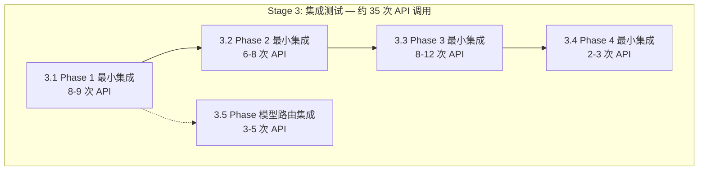

# Stage 3 集成测试方案 — 详细执行手册

> 版本：v1.0
> 日期：2026-06-20
> 目标：使用真实 API 验证模块间协作，控制调用次数在 ~35 次以内
> 配置：`total_chapters=3`, `total_volumes=1`, `max_foundation_iters=1`, `max_revision_cycles=1`
> 通过标准：100% 用例通过，0 阶段崩溃，0 未捕获异常

---

## 前置条件

### 环境要求

| 配置项 | 值 |
|--------|-----|
| Python | ≥ 3.9 |
| API 端点 | 硅基流动 `https://api.siliconflow.cn/v1` |
| 写作模型 | `deepseek-ai/DeepSeek-V4-Flash` |
| 裁判模型 | 同写作模型（或独立配置） |
| 故事梗概 | `2049年上海，程序员在维护老旧服务器时发现AI觉醒迹象，36小时倒计时` |
| API 间隔 | ≥ 4 秒 |
| total_chapters | 3 |
| total_volumes | 1 |
| max_foundation_iters | 1 |
| max_revision_cycles | 1 |

### 修复要求（Stage 1 + Stage 2 BUG 修复）

进入 Stage 3 前必须修复的阻塞项：

| BUG ID | 严重度 | 描述 | 修复方案 |
|--------|--------|------|---------|
| **BUG-S1-01** | 🔴 高 | 6 处 PEP 604 `str \| None` 语法，与 Python 3.9 不兼容 | [`evaluation/evaluate.py:274,314`](evaluation/evaluate.py:274) / [`novel_app.py:110,121`](novel_app.py:110) / [`seed.py:166,177`](seed.py:166) → `Optional[str]` |
| **BUG-S1-07** | 🟡 中 | `default_state()` 缺失 `review_revision_round` 字段 | [`core/state_manager.py:90`](core/state_manager.py:90) 添加 `"review_revision_round": 0` |
| **BUG-S2-01** | 🟡 中 | `load_state()` 对非法 JSON 无保护 | [`core/state_manager.py:97`](core/state_manager.py:97) 添加 `JSONDecodeError` 处理 |

建议修复项：

| BUG ID | 严重度 | 描述 |
|--------|--------|------|
| **BUG-S2-03** | 🟡 中 | [`foundation/gen_voice.py:181`](foundation/gen_voice.py:181) `except Exception: pass` 添加日志 |

### 环境准备

```powershell
# 1. 确保 .env 配置正确
#       AUTONOVEL_API_KEY=sk-xxxxxxxx
#       AUTONOVEL_API_BASE_URL=https://api.siliconflow.cn/v1
#       AUTONOVEL_MODEL_NAME=deepseek-ai/DeepSeek-V4-Flash
#       AUTONOVEL_API_INTERVAL_SECONDS=4

# 2. 确保依赖安装
uv sync

# 3. 清理旧 output（可选）
# Remove-Item -Recurse -Force output\ -ErrorAction SilentlyContinue

# 4. 运行集成测试
python tests/stage3_integration_tests.py
```

---

## 测试总览



---

## 3.1 Phase 1 集成测试 — Foundation（基础构建）

> 验证：`world.md → characters.md → outline_volume.md → outline.md → outline_part2 → canon.md → voice.md → evaluate_foundation` 全部成功产出
> API 调用：~8-9 次
> 最小配置：`total_chapters=3`, `total_volumes=1`, `max_foundation_iters=1`, `foundation_threshold=1.0`

### 3.1.1 `run_foundation()` 完整流程单轮

| 项目 | 内容 |
|------|------|
| **测试方法** | 调用 `pipeline_orchestrator.run_foundation(state)`，执行完整 Foundation 1 轮 |
| **前置条件** | 已写入 `output/config.json`（含 `story_summary` + `total_chapters=3` + `total_volumes=1`），`output/state.json` 为 `default_state()` |
| **验证点** | |
| | (a) [`output/world.md`](output/world.md) 产出：文件存在，内容 ≥ 500 字，结构无截断 |
| | (b) [`output/characters.md`](output/characters.md) 产出：文件存在，含角色条目 ≥ 2 个 |
| | (c) [`output/outline_volume.md`](output/outline_volume.md) 产出：文件存在，含卷级规划 |
| | (d) [`output/outline.md`](output/outline.md) 产出：文件存在，含 3 章章级条目 |
| | (e) [`output/canon.md`](output/canon.md) 产出：文件存在，`count_canon_entries()` ≥ 3 |
| | (f) [`output/voice.md`](output/voice.md) 产出：文件存在，含 5 段语域分析 |
| | (g) `foundation_score > 0`：评估 JSON 已保存到 [`output/eval_logs/`](output/eval_logs/) |
| | (h) `output/state.json` 更新：`foundation_score` 字段已写入，`iteration=1` |
| **API 调用计数** | ~8-9 次：`gen_world`(1) + `gen_characters`(1) + `gen_outline_volume`(1) + `gen_outline`(1-3) + `gen_outline_part2`(0-1) + `gen_canon`(1) + `gen_voice`(2) + `evaluate_foundation`(1) |
| **预期行为** | 所有 output 文件产出，无异常中断 |
| **代码路径** | [`pipeline_orchestrator.py:58-176`](pipeline_orchestrator.py:58) → `run_foundation()` |

```python
# 测试逻辑伪代码
def test_3_1_1_foundation_full_flow(self):
    """Phase 1 完整流程单轮 — 验证所有 output 文件产出"""
    # 1. 确保 story_summary 已写入 config.json
    config.save({"story_summary": self.test_story, "total_chapters": 3,
                 "total_volumes": 1, "chapters_per_volume": 3})

    # 2. 设置极低阈值确保单轮通过
    config._data["foundation_threshold"] = 1.0

    # 3. 执行 foundation
    state = default_state()
    state = run_foundation(state)

    # 4. 验证文件产出
    assert (OUTPUT_DIR / "world.md").exists(), "world.md 未生成"
    assert (OUTPUT_DIR / "characters.md").exists(), "characters.md 未生成"
    assert (OUTPUT_DIR / "outline_volume.md").exists(), "outline_volume.md 未生成"
    assert (OUTPUT_DIR / "outline.md").exists(), "outline.md 未生成"
    assert (OUTPUT_DIR / "canon.md").exists(), "canon.md 未生成"
    assert (OUTPUT_DIR / "voice.md").exists(), "voice.md 未生成"

    # 5. 验证内容完整性
    world = (OUTPUT_DIR / "world.md").read_text(encoding="utf-8")
    chars = (OUTPUT_DIR / "characters.md").read_text(encoding="utf-8")
    assert len(world) >= 500, f"world.md 过短: {len(world)} 字"
    assert "角色" in chars or "人物" in chars, "characters.md 无角色条目"

    # 6. 验证 canon
    entries = count_canon_entries()
    assert entries["total"] >= 3, f"canon 条目过少: {entries['total']}"

    # 7. 验证 state
    assert state["foundation_score"] > 0, "foundation_score 未写入"
    assert state["iteration"] >= 1, "iteration 未递增"
```

### 3.1.2 Foundation 评分 < 阈值 → 触发重试逻辑

| 项目 | 内容 |
|------|------|
| **测试方法** | 设置 `foundation_threshold=10.0`（不可达高阈值），`max_foundation_iters=2`，调用 `run_foundation()` |
| **前置条件** | 同 3.1.1 |
| **验证点** | |
| | (a) 第一轮产出后被评估，`foundation_score < 10.0` |
| | (b) 第二轮的 `world.md` / `characters.md` 等文件内容与第一轮不同（或被备份） |
| | (c) `state["iteration"] >= 2` |
| | (d) 最终 `best_score` 为两轮中的最高分 |
| | (e) `git_reset_hard` / `restore_latest` 在低分轮被正确调用 |
| **API 调用计数** | ~16-18 次（两轮 Foundation 全流程） |
| **预期行为** | 两轮迭代正常执行，最佳分数保留 |
| **代码路径** | [`pipeline_orchestrator.py:138-176`](pipeline_orchestrator.py:138) — 评分 → git commit / git reset |

### 3.1.3 `count_canon_entries()` < 阈值 → 警告不崩溃

| 项目 | 内容 |
|------|------|
| **测试方法** | Mock `gen_canon.generate_canon()` 产出几乎为空的 `canon.md`；调用 `run_foundation()` |
| **前置条件** | 同 3.1.1 |
| **验证点** | |
| | (a) `count_canon_entries()["total"] < cfg.lore_threshold` → 触发警告日志 |
| | (b) Foundation 流程**不崩溃**，iteration 正常结束 |
| | (c) 警告消息含 "正典" 或 "lore" 字样 |
| **API 调用计数** | ~8 次（仅 gen_canon 内部 Mock 注入空返回） |
| **预期行为** | 日志输出警告但流程继续 |
| **代码路径** | [`pipeline_orchestrator.py:156-158`](pipeline_orchestrator.py:156) — `lore_total < cfg.lore_threshold` 分支 |

---

## 3.2 Phase 2 集成测试 — Drafting（章节起草）

> 验证：3 章起草 + 每章评估 + 增量 canon + 文风指纹 + 结构反模式审计
> API 调用：~6-8 次
> 前置：Phase 1 完整产出（world/chars/outline/canon/voice 均存在）

### 3.2.1 起草 3 章（每章 1 次 pass）

| 项目 | 内容 |
|------|------|
| **测试方法** | Phase 1 产出就绪后，调用 `pipeline_orchestrator.run_drafting(state)` |
| **前置条件** | |
| | — `output/world.md` / `characters.md` / `outline.md` / `canon.md` / `voice.md` 均存在 |
| | — `total_chapters=3`, `chapter_threshold=1.0`（极低阈值确保不重试） |
| | — `max_chapter_attempts=1` |
| **验证点** | |
| | (a) [`output/chapters/ch_01.md`](output/chapters/ch_01.md) / [`ch_02.md`](output/chapters/ch_02.md) / [`ch_03.md`](output/chapters/ch_03.md) 全部产出 |
| | (b) 每章 ≥ 2000 字（`word_count` ≥ 2000） |
| | (c) 每章 [`output/eval_logs/`](output/eval_logs/) 下有评估 JSON |
| | (d) 增量 canon 追加正常：`state["canon_entry_count"]` 增长 |
| | (e) `state["chapters_drafted"] == 3` |
| | (f) `state["phase"] == "revision"` |
| **API 调用计数** | ~6 次（3 次起草 `call_p2_writer` + 3 次 `evaluate_chapter` `call_judge`） |
| **预期行为** | 3 章全部起草通过，状态正确切换 |
| **代码路径** | [`pipeline_orchestrator.py:183-363`](pipeline_orchestrator.py:183) → `run_drafting()` |

```python
# 测试逻辑伪代码
def test_3_2_1_drafting_3_chapters(self):
    """Phase 2 起草 3 章 — 验证全部产出"""
    # 确保 foundation 文件存在（从 3.1.1 产出复用，或重新运行）
    # 设置极低阈值
    config._data["chapter_threshold"] = 1.0
    config._data["max_chapter_attempts"] = 1

    state = load_state()
    state["phase"] = "drafting"
    state = run_drafting(state)

    # 验证 3 章文件
    for ch in [1, 2, 3]:
        ch_file = CHAPTERS_DIR / f"ch_{ch:02d}.md"
        assert ch_file.exists(), f"ch_{ch:02d}.md 未生成"
        content = ch_file.read_text(encoding="utf-8")
        word_count = len(content.replace(" ", "").replace("\n", ""))
        assert word_count >= 2000, f"第 {ch} 章过短: {word_count} 字"

    # 验证状态
    assert state["chapters_drafted"] == 3
    assert state["phase"] == "revision"
    assert state["canon_entry_count"] > 0, "canon 未增量更新"
```

### 3.2.2 某章评分不达标 → 重试

| 项目 | 内容 |
|------|------|
| **测试方法** | 设置 `chapter_threshold=10.0`（不可达高阈值），`max_chapter_attempts=2`，调用 `run_drafting()` |
| **前置条件** | 同 3.2.1 |
| **验证点** | |
| | (a) 第 1 章草拟后评估分数 < 10.0，章节被删除 |
| | (b) 第 1 章第 2 次草拟正常执行 |
| | (c) 达到 `max_attempts=2` 后若仍不达标，forced 接受 |
| | (d) `results.tsv` 中有 discard 记录 |
| **API 调用计数** | ~12 次（每章 2 次起草 + 2 次评估） |
| **预期行为** | 重试逻辑正确，forced 接受不崩溃 |
| **代码路径** | [`pipeline_orchestrator.py:233-338`](pipeline_orchestrator.py:233) — 评分 < threshold 删除重试 / forced 接受 |

### 3.2.3 slop_penalty > 阈值 → 触发反套话重写

| 项目 | 内容 |
|------|------|
| **测试方法** | 在起草 prompt 中注入要求输出大量 AI 套话的指令（通过临时覆盖 chapter 系统 prompt），设置 `slop_penalty_threshold=0.5`（极低），`chapter_threshold=1.0`（正常评分通过），调用单章起草 |
| **前置条件** | 同 3.2.1 |
| **验证点** | |
| | (a) LLM 评分达标（≥ 1.0）但 `slop_penalty > 0.5` |
| | (b) 日志输出 "slop_penalty 过高，触发反套话重写" |
| | (c) 章节被删除并重写 |
| **API 调用计数** | 额外 ~2 次（重写 + 重新评估） |
| **预期行为** | slop 检测触发重写，重写后 slop_penalty 降低 |
| **代码路径** | [`pipeline_orchestrator.py:238-243`](pipeline_orchestrator.py:238) — `slop_fail and score >= threshold` 分支 |

### 3.2.4 结构反模式审计 → 过量触发重写

| 项目 | 内容 |
|------|------|
| **测试方法** | 设置 `antipattern_max_warnings=0`（任何反模式都触发重写），起草一章后验证审计触发重写 |
| **前置条件** | 同 3.2.1 |
| **验证点** | |
| | (a) `run_structural_audit()` 返回 `warning_count ≥ 1` |
| | (b) 日志输出 "结构反模式过多，触发重写" |
| | (c) 章节被删除，草拟标志重置 |
| **API 调用计数** | 额外 ~2 次 |
| **预期行为** | 反模式检测触发重写 |
| **代码路径** | [`pipeline_orchestrator.py:293-304`](pipeline_orchestrator.py:293) — `audit["warning_count"] >= antipattern_max` 分支 |

### 3.2.5 增量 canon 追加验证

| 项目 | 内容 |
|------|------|
| **测试方法** | 起草第 1 章后检查 `canon.md` 内容增长；起草第 2 章后再检查 |
| **前置条件** | 同 3.2.1，`canon.md` 已由 Phase 1 生成 |
| **验证点** | |
| | (a) 第 1 章起草后 `update_canon_from_chapter(1, text)` 被调用 |
| | (b) `state["canon_entry_count"]` 递增 |
| | (c) `state["canon_last_updated_ch"] == 1`（或对应章节号） |
| **API 调用计数** | 每章额外 1 次 `call_p2_ctx_writer` |
| **预期行为** | canon 增量更新正常 |
| **代码路径** | [`pipeline_orchestrator.py:314-329`](pipeline_orchestrator.py:314) — `update_canon_from_chapter` 调用 |

### 3.2.6 文风指纹（voice_fingerprint）检查

| 项目 | 内容 |
|------|------|
| **测试方法** | 第 1 章起草后检查日志输出 |
| **前置条件** | 同 3.2.1 |
| **验证点** | |
| | (a) `analyze_chapter_zh()` 被调用 |
| | (b) 日志输出对话比例 / 破折号密度 / 抽象名词密度 / 过渡词密度 |
| | (c) 出现警告时日志以 "⚠ 文风指纹警告" 开头 |
| | (d) 检查失败时（`except Exception`）不崩溃，"文风指纹跳过" 日志输出 |
| **API 调用计数** | 0（纯本地分析） |
| **预期行为** | 文风指纹分析正常运行或优雅跳过 |
| **代码路径** | [`pipeline_orchestrator.py:257-286`](pipeline_orchestrator.py:257) — `voice_fingerprint` 调用 |

---

## 3.3 Phase 3 集成测试 — Revision（修订）

> 验证：adversarial_edit → apply_cuts → reader_panel → gen_brief → gen_revision → evaluate 完整闭环
> API 调用：~8-12 次
> 前置：Phase 1 + Phase 2 完整产出（3 章均已起草）

### 3.3.1 修订流程完整闭环（Phase 3a）

| 项目 | 内容 |
|------|------|
| **测试方法** | Phase 1 + Phase 2 产出就绪后，调用 `pipeline_orchestrator.run_revision(state, max_cycles=1)` |
| **前置条件** | |
| | — Phase 1 全部产出文件存在 |
| | — Phase 2 3 章已起草（`ch_01.md` ~ `ch_03.md`）|
| | — `state["phase"] == "revision"`, `state["revision_cycle"] = 0` |
| **验证点** | |
| | (a) 对抗性编辑执行：`output/edit_logs/ch*_cuts.json` 文件产出 |
| | (b) 读者评审团执行：`output/edit_logs/reader_panel.json` 产出 |
| | (c) 共识解析正常：`_parse_panel_consensus()` 返回共识列表 |
| | (d) 针对性修订执行：有共识问题的章节产出 `output/briefs/ch*_cycle*.md` |
| | (e) 修订前后评分对比：`log_result` 记录 `keep` 或 `discard` |
| | (f) 平台期检测：`delta < plateau_delta` 时 break |
| **API 调用计数** | ~8-12 次：`adversarial_edit`(3) + `reader_panel`(4角色×3章=12次, 但实际最多8章) → ~4-6 + `gen_brief`(1-2) + `gen_revision`(1-2) + `evaluate`(2-4) |
| **预期行为** | 修订闭环完整执行，无异常中断 |
| **代码路径** | [`pipeline_orchestrator.py:425-540`](pipeline_orchestrator.py:425) — `run_revision()` Phase 3a |

```python
# 测试逻辑伪代码
def test_3_3_1_revision_full_cycle(self):
    """Phase 3a 修订闭环 — 验证所有步骤执行"""
    # 确保 Phase 1+2 产出
    state = load_state()
    state["phase"] = "revision"
    state["revision_cycle"] = 0

    state = run_revision(state, max_cycles=1)

    # 验证文件产出
    cuts_files = list(EDIT_LOGS_DIR.glob("ch*_cuts.json"))
    assert len(cuts_files) > 0, "对抗性编辑未产出 cuts JSON"
    assert (EDIT_LOGS_DIR / "reader_panel.json").exists(), "reader_panel.json 未产出"

    # 验证 revision_cycle 递增
    assert state["revision_cycle"] >= 1, "revision_cycle 未递增"

    # 验证 phase 切换
    assert state["phase"] == "export", "Phase 3 完成后 phase 应为 export"
```

### 3.3.2 Phase 3b 审阅修订闭环

| 项目 | 内容 |
|------|------|
| **测试方法** | 在 `run_revision()` 完成后检查 Phase 3b `_run_review_revision_loop()` 是否正常执行 |
| **前置条件** | 同 3.3.1 |
| **验证点** | |
| | (a) `run_review_loop()` 被调用：`output/edit_logs/review_round1.json` 产出 |
| | (b) 审阅星级解析正确：`stars` ≥ 0 |
| | (c) `_parse_review_weak_chapters()` 返回弱章节列表（可能为空） |
| | (d) 若 stars ≥ 4.5 且 major_items == 0 → break（早期退出） |
| | (e) 弱章修订流程：pre_eval → gen_revision → post_eval → commit/reset |
| | (f) `state["review_revision_round"]` 递增 |
| | (g) 全文评估 `evaluate_full()` 被调用 |
| **API 调用计数** | ~5-10 次：`run_review_loop`(1) + `evaluate_chapter`(2×弱章数) + `gen_revision`(弱章数) + `evaluate_full`(1) |
| **预期行为** | Phase 3b 审阅修订闭环正常执行 |
| **代码路径** | [`pipeline_orchestrator.py:889-1073`](pipeline_orchestrator.py:889) — `_run_review_revision_loop()` |

### 3.3.3 共识问题解析（`_parse_panel_consensus`）

| 项目 | 内容 |
|------|------|
| **测试方法** | 手动构造 `reader_panel.json` 包含已知共识问题，调用 `_parse_panel_consensus()` |
| **前置条件** | 创建测试用 `reader_panel.json` |
| **验证点** | |
| | (a) `disagreements` 中 `flag_by ≥ 2` 的章节被正确提取 |
| | (b) `readers` 回答中提及的章节被正则扫描 |
| | (c) 去重正确：每章最多 1 条 |
| | (d) 返回数量 ≤ 5 |
| **API 调用计数** | 0（纯数据解析） |
| **预期行为** | 解析逻辑正确，去重/截断逻辑正确 |
| **代码路径** | [`pipeline_orchestrator.py:370-422`](pipeline_orchestrator.py:370) — `_parse_panel_consensus()` |

### 3.3.4 平台期检测触发停止

| 项目 | 内容 |
|------|------|
| **测试方法** | 设置 `plateau_delta=999`（巨大 delta，永远不会触发平台期），验证正常循环；设置 `plateau_delta=0.01`（极小 delta），验证平台期检测触发停止 |
| **前置条件** | 同 3.3.1 |
| **验证点** | |
| | (a) `plateau_delta=999`：循环继续，不因 delta 触发 break |
| | (b) `plateau_delta=0.01`：两轮评分差异 < 0.01 时 break |
| | (c) 平台期日志包含 "平台期" 或 "plateau" 或 "无改善" |
| **API 调用计数** | ~16-24 次（2 轮修订） |
| **预期行为** | 平台期检测阈值逻辑正确 |
| **代码路径** | [`pipeline_orchestrator.py:534-540`](pipeline_orchestrator.py:534) — platform 检测 |

### 3.3.5 修订后评分倒退 → 回退

| 项目 | 内容 |
|------|------|
| **测试方法** | Mock `gen_revision.revise_chapter()` 返回明显更差的文本，执行 Phase 3b 修订 |
| **前置条件** | 同 3.3.1 |
| **验证点** | |
| | (a) `post_score < pre_score` → 触发 `git_reset_hard("HEAD")` |
| | (b) `log_result` 中 `disposition="discard"`, `note` 含 "倒退" |
| | (c) 原章节文件未被劣化版本覆盖 |
| **API 调用计数** | ~4 次（pre_eval + revise + post_eval） |
| **预期行为** | 倒退修订被正确回退 |
| **代码路径** | [`pipeline_orchestrator.py:1026-1036`](pipeline_orchestrator.py:1026) — 回退分支 |

---

## 3.4 Phase 4 集成测试 — Export（导出）

> 验证：`build_outline → build_arc_summary → build_manuscript` 全部执行
> API 调用：~2-3 次
> 前置：Phase 1 + 2 + 3 完整产出

### 3.4.1 `run_export()` 全流程

| 项目 | 内容 |
|------|------|
| **测试方法** | Phase 1-3 产出就绪后，调用 `pipeline_orchestrator.run_export(state)` |
| **前置条件** | |
| | — Phase 1 文件存在 |
| | — Phase 2 3 章已起草 |
| | — Phase 3 修订已完成（或跳过） |
| **验证点** | |
| | (a) [`output/outline.md`](output/outline.md) 被 `build_outline()` 重建（含 `REBUILD_OUTLINE_SYSTEM` prompt 调用） |
| | (b) [`output/arc_summary.md`](output/arc_summary.md) 产出：含角色弧线、情节弧线、主题弧线、伏笔回顾 |
| | (c) [`output/manuscript.md`](output/manuscript.md) 产出：含目录 + 全部章节 + 分隔符 |
| | (d) 手稿章节数与 `chapters/` 目录一致 |
| | (e) `state["phase"] == "complete"` |
| | (f) `results.tsv` 最终行 disposition="export" |
| **API 调用计数** | ~2 次：`build_outline`(1) + `build_arc_summary`(1)；`build_manuscript`(0) 纯文件操作 |
| **预期行为** | 全部导出文件产出，手稿完整 |
| **代码路径** | [`pipeline_orchestrator.py:1094-1140`](pipeline_orchestrator.py:1094) → `run_export()` |

```python
# 测试逻辑伪代码
def test_3_4_1_export_full(self):
    """Phase 4 导出全流程"""
    state = load_state()
    state["phase"] = "export"
    state = run_export(state)

    # 验证产出
    assert (OUTPUT_DIR / "manuscript.md").exists(), "manuscript.md 未生成"
    assert (OUTPUT_DIR / "arc_summary.md").exists(), "arc_summary.md 未生成"

    # 验证手稿完整性
    manuscript = (OUTPUT_DIR / "manuscript.md").read_text(encoding="utf-8")
    assert "目录" in manuscript, "手稿缺少目录"
    assert "第 1 章" in manuscript, "手稿缺少第 1 章"
    assert "第 3 章" in manuscript, "手稿缺少第 3 章"

    # 验证状态
    assert state["phase"] == "complete"

    # 验证 results.tsv
    results = (OUTPUT_DIR / "results.tsv").read_text(encoding="utf-8")
    assert "export" in results, "results.tsv 缺少 export 记录"
```

### 3.4.2 手稿章节数一致性

| 项目 | 内容 |
|------|------|
| **测试方法** | 比较 `manuscript.md` 中章节分隔符数量与 `chapters/` 目录下的 `.md` 文件数量 |
| **前置条件** | 同 3.4.1 |
| **验证点** | |
| | (a) `manuscript.md` 中 `# 第 N 章` 出现次数 == `len(list(chapters_dir.glob("ch_*.md")))` |
| | (b) 章节顺序正确（ch_01 → ch_02 → ch_03） |
| **API 调用计数** | 0 |
| **预期行为** | 数量一致、顺序正确 |
| **代码路径** | [`export/build_manuscript.py:15-44`](export/build_manuscript.py:15) — `build_manuscript()` |

### 3.4.3 export 各步骤异常不崩溃

| 项目 | 内容 |
|------|------|
| **测试方法** | 删除 `chapters/` 目录，调用 `run_export()` |
| **前置条件** | Foundation 文件存在但无章节文件 |
| **验证点** | |
| | (a) `build_outline()` → "无章节文件，跳过" 不抛异常 |
| | (b) `build_arc_summary()` → "无章节文件，跳过" 不抛异常 |
| | (c) `build_manuscript()` → "无章节文件，跳过" 不抛异常 |
| | (d) `run_export()` 完成，不崩溃 |
| **API 调用计数** | 0 |
| **预期行为** | 所有步骤优雅降级 |
| **代码路径** | [`pipeline_orchestrator.py:1098-1119`](pipeline_orchestrator.py:1098) — `try/except` 包裹每个导出步骤 |

---

## 3.5 Phase 模型路由集成测试

> 验证：Phase 分离模型配置 → 回退链正确
> API 调用：~3-5 次
> 前置：可调整 `.env` 配置

### 3.5.1 仅配共用 Key → 所有 Phase 使用共用

| 项目 | 内容 |
|------|------|
| **测试方法** | `.env` 仅配置 `AUTONOVEL_API_KEY`，不配 P1/P2/P3 独立 Key；运行 `run_foundation()` 验证 Phase 1 调用的 API Key |
| **前置条件** | `.env` 仅含 `AUTONOVEL_API_KEY=sk-shared`（不含 P1/P2/P3 前缀） |
| **验证点** | |
| | (a) `config.p1_api_key == "sk-shared"`（回退） |
| | (b) `config.p2_api_key == "sk-shared"`（回退） |
| | (c) `config.p3_api_key == "sk-shared"`（回退） |
| | (d) Foundation 执行成功（API Key 有效） |
| **API 调用计数** | ~8 次 |
| **预期行为** | 所有 Phase 使用共用 Key |
| **代码路径** | [`core/config.py:258-330`](core/config.py:258) — Phase 回退属性 |

### 3.5.2 配 P1 独立 Key → P2/P3 回退到 P1

| 项目 | 内容 |
|------|------|
| **测试方法** | `.env` 配置 `AUTONOVEL_P1_API_KEY=sk-p1` + `AUTONOVEL_API_KEY=sk-shared`，运行 Foundation 后起草 1 章 |
| **前置条件** | `.env` 配置 P1 独立 Key |
| **验证点** | |
| | (a) `config.p1_api_key == "sk-p1"`（使用独立） |
| | (b) `config.p2_api_key == "sk-p1"`（回退到 P1，非 shared） |
| | (c) `config.p2_ctx_api_key == "sk-p1"`（回退 P2→P1） |
| | (d) `config.p3_api_key == "sk-p1"`（回退 P1） |
| | (e) Phase 1 `call_p1_writer` 使用 P1 Key |
| | (f) Phase 2 `call_p2_writer` 回退到 P1 Key 并成功起草 |
| **API 调用计数** | ~3 次（`gen_world` + `draft_chapter` + 一次 `evaluate`） |
| **预期行为** | 回退链正确 |
| **代码路径** | [`core/api_client.py:330-400`](core/api_client.py:330) — `call_p1_writer` / `call_p2_writer` 通过 `_call_with_phase_config` |

### 3.5.3 配 P3 独立 Key → 仅 Phase 3 使用

| 项目 | 内容 |
|------|------|
| **测试方法** | `.env` 配置 `AUTONOVEL_P3_API_KEY=sk-p3` + `AUTONOVEL_P1_API_KEY=sk-p1`，运行 Phase 3 |
| **前置条件** | Phase 1+2 产出已就绪（可使用共用 Key 模拟） |
| **验证点** | |
| | (a) `config.p3_api_key == "sk-p3"`（使用独立） |
| | (b) `call_p3_judge()` 使用 P3 Key（虽然当前未在 pipeline 中实际调用，但验证函数逻辑） |
| | (c) Phase 3 `call_judge()` 回退链正确 |
| **API 调用计数** | ~2 次（`review.run_review_loop` 或 `adversarial_edit`） |
| **预期行为** | P3 独立配置不干扰 P1/P2 回退链 |
| **代码路径** | [`core/config.py:312-314`](core/config.py:312) — `p3_api_key` 属性 / [`core/api_client.py:486-508`](core/api_client.py:486) — `call_p3_judge()` |

---

## 端到端串联测试（可选）

> 将 Phase 1→2→3→4 串联执行一次，作为 Stage 3 的最终验证。
> API 调用：~25-30 次

### 3.E2E 完整 3 章流水线

| 项目 | 内容 |
|------|------|
| **测试方法** | `python pipeline_orchestrator.py --mode from_scratch` |
| **配置** | `total_chapters=3`, `total_volumes=1`, `max_foundation_iters=1`, `max_revision_cycles=1` |
| **验证点** | |
| | (a) 零崩溃、零未捕获异常 |
| | (b) `state["phase"] == "complete"` |
| | (c) [`output/manuscript.md`](output/manuscript.md) 存在并包含完整 3 章 |
| | (d) [`output/state.json`](output/state.json) 记录全流程状态 |
| | (e) [`output/results.tsv`](output/results.tsv) 记录完整实验日志 |
| | (f) 总执行时间合理（API 间隔 4s × 25-30 次 ≈ 100-120s + LLM 推理时间） |
| **API 调用计数** | ~25-30 次 |
| **预期行为** | 全流程零 BUG 跑完 |

---

## API 调用预算汇总

| 测试项 | 最低调用 | 最高调用 | 说明 |
|--------|---------|---------|------|
| 3.1.1 Foundation 单轮 | 8 | 9 | 基础流程 |
| 3.1.2 Foundation 重试 | 16 | 18 | 2 轮迭代 |
| 3.1.3 canon 不足 | 8 | 9 | 警告不崩溃 |
| 3.2.1 起草 3 章 | 6 | 9 | 含 canon 增量 |
| 3.2.2 起草重试 | 12 | 16 | 每章 2 次 |
| 3.2.3 slop 重写 | 8 | 12 | 额外重写 |
| 3.3.1 修订闭环 | 8 | 12 | 完整 Phase 3a |
| 3.3.2 Phase 3b | 5 | 10 | 审阅修订 |
| 3.4.1 导出 | 2 | 3 | 重建大纲 + 弧线 |
| 3.5.1 共用 Key | 6 | 8 | 验证回退链 |
| 3.5.2 P1 独立 | 3 | 5 | 验证回退链 |
| **3.E2E 串联** | **25** | **30** | 全流程串联（替代分散测试时执行） |

---

## 门禁标准

| 门禁项 | 标准 | 不通过时禁止进入 |
|--------|------|---------------|
| 3.1 Phase 1 | 全部 3 项通过，foundation_score > 0 | Stage 4 |
| 3.2 Phase 2 | 全部 6 项通过，3 章均 ≥ 2000 字 | Stage 4 |
| 3.3 Phase 3 | 全部 5 项通过，修订闭环无中断 | Stage 4 |
| 3.4 Phase 4 | 全部 3 项通过，manuscript.md 产出 | Stage 4 |
| 3.5 路由 | 全部 3 项通过，回退链正确 | Stage 4 |
| 3.E2E | 零崩溃、零中断 | Stage 4 |

---

## Stage 3 测试脚本模板

参见 [`tests/stage3_integration_tests.py`](tests/stage3_integration_tests.py)（待创建）。

脚本结构：

```python
#!/usr/bin/env python3
"""
Stage 3 集成测试 — 真实 API 调用 ~25-35 次

关键设计：
1. 复用 .env 配置（不 Mock — 这是集成测试的核心区别）
2. 渐进式执行：先 Phase 1，通过后再 Phase 2，以此类推
3. 每个测试项执行前检查前置条件
4. 支持 --dry-run 模式（仅验证前置条件，不调用 API）
5. 支持 --phase 指定单独运行某阶段

用法:
    python tests/stage3_integration_tests.py             # 全部执行
    python tests/stage3_integration_tests.py --phase 1   # 仅 Phase 1
    python tests/stage3_integration_tests.py --dry-run   # 仅检查前置条件
    python tests/stage3_integration_tests.py --report    # 仅汇总
"""

import json, os, sys, unittest
from pathlib import Path

ROOT = Path(__file__).parent.parent
sys.path.insert(0, str(ROOT))

# ============================================================
# 配置加载
# ============================================================
from core.config import config, OUTPUT_DIR, CHAPTERS_DIR, BRIEFS_DIR
from core.config import EDIT_LOGS_DIR, EVAL_LOGS_DIR, STATE_FILE, BACKUPS_DIR
from core.state_manager import default_state, load_state, save_state
from core.state_manager import count_words_in_chapters, count_chapter_files
from core.state_manager import banner, step

# ... test classes ...

if __name__ == "__main__":
    unittest.main()
```

---

## 风险与缓解

| 风险 | 严重度 | 缓解措施 |
|------|--------|---------|
| API 调用费用超预期 | 中 | 单测试项失败时立即停止后续，不浪费配额 |
| API 临时不可用（429/503） | 中 | 4s 间隔 + 3 次重试已在 [`core/api_client.py`](core/api_client.py) 中内置 |
| 评估分数解析失败 | 高 | `parse_score()` 已在 Stage 2 验证边界（返回 -1.0）；Stage 3 验证真实 LLM 输出的分数格式 |
| Phase 3 读者评审团 API 调用量过大 | 中 | 已内置 `max_chapters_to_review = min(len(chapter_files), 8)` 限制；3 章时调用量可控 |
| `outline_part2` 跳过导致 Phase 2 无大纲参考 | 低 | `draft_chapter.extract_chapter_outline()` 有回退到 `outline.md` 的逻辑 |

---

## 测试执行顺序

1. **3.5.1** 先验证共用 Key 可用（如果这一步失败，后续全部无法执行）
2. **3.1.1** Phase 1 单轮 → 产出 foundation 文件
3. **3.2.1** Phase 2 起草 3 章 → 依赖 3.1.1
4. **3.2.5** 增量 canon → 在 3.2.1 中一并验证
5. **3.2.6** 文风指纹 → 在 3.2.1 中一并验证
6. **3.3.1** Phase 3a 修订 → 依赖 3.2.1
7. **3.3.2** Phase 3b 审阅 → 依赖 3.3.1
8. **3.4.1** Phase 4 导出 → 依赖 3.3.2
9. **3.4.2** 手稿一致性 → 依赖 3.4.1
10. **3.5.2** P1 独立 Key（可选，需额外 API Key）
11. **3.E2E** 端到端串联（可选，替代上述分散执行）

---

## 附录：Stage 3 测试检查清单

### 执行前

- [ ] BUG-S1-01 已修复（PEP 604 语法）
- [ ] BUG-S1-07 已修复（`default_state` 缺失字段）
- [ ] BUG-S2-01 已修复（`load_state` JSONDecodeError）
- [ ] `.env` 配置正确（API Key + Base URL + Model）
- [ ] `output/` 目录干净或已备份
- [ ] 网络可访问 API 端点（`curl https://api.siliconflow.cn/v1/models` 成功）
- [ ] API 账户余额充足

### 执行中

- [ ] 3.5.1 共用 Key 验证通过
- [ ] 3.1.1 Foundation 单轮通过
- [ ] 3.2.1 起草 3 章通过
- [ ] 每章字数 ≥ 2000
- [ ] 增量 canon 正常
- [ ] 3.3.1 修订闭环通过
- [ ] 3.3.2 Phase 3b 审阅修订通过
- [ ] 3.4.1 导出通过
- [ ] manuscript.md 完整且章节数正确

### 执行后

- [ ] `output/state.json` phase == "complete"
- [ ] `output/results.tsv` 完整记录
- [ ] 所有 BUG 日志已审查
- [ ] API 调用统计与预期匹配