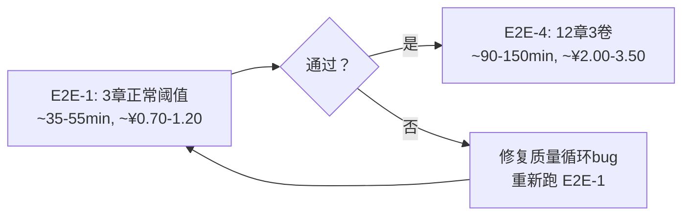

# Stage 4: E2E 全流水线 — 详细测试方案

> **父文档**: [enterprise_test_plan.md](enterprise_test_plan.md)  
> **版本**: v1.0  
> **日期**: 2026-06-27  
> **目标**: 用正常质量门槛验证全流程零崩溃，补上 5.7.x 跳过的重试/评分循环路径  
> **前置条件**: Stage 1/2/3 + 5.7.x 全部通过  
> **原则**: 只保留增量价值最大的测试，跳过与 5.7.x 高度重叠的项

---

## 1. 与已完成的 5.7.x 的差异对照

### 1.1 为什么 Stage 3 和 5.7.x 过了还需要 Stage 4？

| 测试 | 配置特征 | 跳过了什么 |
|------|---------|-----------|
| Stage 3 集成测试 | `max_foundation_iters=1`, `max_revision_cycles=1`, `total_chapters=3` | 多次重试循环、平台期检测、大规模场景 |
| 5.7.5 中断串联 | `foundation_threshold=1.0`, `chapter_threshold=1.0`, `plateau_delta=999.0` | **所有质量门槛循环**：评分不达标→重试、slop→反套话、平台期→停止 |
| **Stage 4 E2E-1** | `foundation_threshold=7.5` (默认), `chapter_threshold=6.0` (默认) | ← **补上这些**：用正常阈值暴露质量循环的稳定性 |
| **Stage 4 E2E-4** | 同上 + `total_chapters=12`, `total_volumes=3`, `max_revision_cycles=3` | ← 补上大规模下的循环稳定性 |

### 1.2 被 5.7.x 跳过的关键代码路径

以下代码路径在 5.7.x 中因阈值=1.0 从未触发，Stage 4 首次覆盖：

| 代码路径 | 位置 | 触发条件 | 风险 |
|---------|------|---------|------|
| Foundation 评分不达标 → `git_reset_hard("HEAD")` → 重试 | [`pipeline_orchestrator.py:158-162`](pipeline_orchestrator.py:158) | `score <= best_score` | git 回退是否正确？多次回退后 state 混乱？ |
| 章节评分 < threshold → 删除重试（最多 max_attempts） | [`pipeline_orchestrator.py:245-338`](pipeline_orchestrator.py:332) | `score < threshold` | 多轮重试后 `drafted` flag 是否正确？ |
| slop_penalty > threshold → 反套话重写 | [`pipeline_orchestrator.py:238-243`](pipeline_orchestrator.py:238) | `slop_fail and score >= threshold` | 反套话重写后重新评估的分数是否正确？ |
| antipattern 过多 → 触发重写 | [`pipeline_orchestrator.py:294-304`](pipeline_orchestrator.py:294) | `warning_count >= antipattern_max` | 重写后再次审计是否还有问题？死循环风险？ |
| 平台期检测 → break | [`pipeline_orchestrator.py:827-830`](pipeline_orchestrator.py:827) | `cycle >= 3 and delta < 0.3` | 多轮修订后评分趋于稳定，平台期检测是否误触发/不触发？ |
| canon 条目不足 → 警告 | [`pipeline_orchestrator.py:127-131`](pipeline_orchestrator.py:127) | `canon_total < 400` | 小规模（3章）下 canon 条目必然不足，警告是否正确？ |
| Phase 3b 审阅修订闭环 | [`pipeline_orchestrator.py:1076-1080`](pipeline_orchestrator.py:1076) | 审阅→弱章→修订→评估 | 大章节数下审阅 JSON 容量、弱章解析准确性 |
| 修订评分下降 → `git_reset_hard("HEAD")` 回退 | [`pipeline_orchestrator.py:533-534`](pipeline_orchestrator.py:533) | `post_score < pre_score` | 回退后章节文件是否正确恢复？ |
| `MAX_SEGMENTS=10` 保护 | [`pipeline_orchestrator.py:621-623`](pipeline_orchestrator.py:621) | `len(segments) > 10` | 3卷6段落不触发，但12章场景下需验证不误触发 |
| 跨卷一致性审阅 | [`pipeline_orchestrator.py:690-694`](pipeline_orchestrator.py:690) | `total_vol > 1 and cycle % 2 == 0` | cycle 2 触发，3 卷场景下 2 个边界都要审阅 |

---

## 2. E2E-1: 3 章单卷 from_scratch（质量门槛基线）

### 2.1 目的

**验证正常质量阈值下，Foundation 重试循环、章节起草重试/反套话/反模式、修订平台期检测等关键质量路径不崩溃。**

这是 Stage 4 的"最小质量门槛验证"，不要求所有评分都达标（那太贵也不现实），只要求这些重试循环的代码路径被执行过且系统稳定运行——即使最终 `foundation_score` 未达 7.5、走了 max_iters 兜底。

### 2.2 配置

```python
STAGE4_E2E1_CONFIG = {
    "story_summary": "2049年上海，程序员在维护老旧服务器时发现AI觉醒迹象，36小时倒计时",
    "total_chapters": 3,
    "total_volumes": 1,
    "chapters_per_volume": 3,
    # ★ 使用默认质量阈值（不压低）
    "foundation_threshold": 7.5,    # 默认值，可能不达标触发重试
    "chapter_threshold": 6.0,       # 默认值，可能不达标触发重试
    "max_foundation_iters": 3,      # 比默认20小，控制成本但允许2次重试
    "max_chapter_attempts": 3,      # 比默认5小，允许2次重试
    "max_revision_cycles": 3,       # 至少3轮，确保平台期检测可触发
    "plateau_delta": 0.3,           # ★ 正常值，可能触发平台期停止
    "slop_penalty_threshold": 3.0,  # 默认值，可能触发反套话重写
    "antipattern_max_warnings": 4,  # 默认值
    "canon_min_entries": 400,       # 默认值，3章下一定不足
}
```

### 2.3 资源预估

| 资源 | 最小估计 | 最大估计 | 说明 |
|------|---------|---------|------|
| API 调用 | ~55 次 | ~90 次 | Foundation 7×3=21 + Drafting 3×3×3=27 + Revision 3×cycle(~15) + Export 0 |
| 耗时 | ~35 min | ~55 min | API 间隔 4 秒 |
| 费用 | ~¥0.70 | ~¥1.20 | deepseek-ai/DeepSeek-V4-Flash |

### 2.4 执行方式

```bash
python pipeline_orchestrator.py --mode from_scratch
```

或通过测试框架调用 `run_pipeline("from_scratch")`。

### 2.5 验证清单

#### A. 结构完整性（最低门槛）

| # | 验证项 | 验证方式 | 通过标准 |
|---|--------|---------|---------|
| A1 | Phase 1: `world.md` / `characters.md` / `outline.md` / `canon.md` / `voice.md` 全部产出 | 文件存在检查 | 5/5 文件存在且 > 100 bytes |
| A2 | Phase 2: `ch_01.md` ~ `ch_03.md` 全部产出 | 文件存在检查 | 3/3 文件存在，每章 ≥ 1000 字 |
| A3 | Phase 4: `manuscript.md` 正确包含 3 章 + 目录 | 文件存在 + 内容检查 | 文件存在，包含 ch_01~ch_03 内容 |
| A4 | `state.json` 完整记录全流程状态 | JSON 解析 + 字段检查 | `phase="complete"`, `chapters_drafted=3` |
| A5 | `results.tsv` 记录完整 | 文件存在 + TSV 解析 | 至少有 foundation / ch01 / ch02 / ch03 / revision / export 记录行 |
| A6 | 零崩溃 / 零未捕获异常 | 返回码检查 | exit code 0，无 traceback 输出 |

#### B. 质量循环路径覆盖（核心增量价值）

| # | 验证项 | 验证方式 | 通过标准 |
|---|--------|---------|---------|
| B1 | Foundation 重试循环执行过 | 检查 `results.tsv` 中 foundation 记录行数 | ≥ 2 行（至少 1 次评分未提升被 discard）**或** `state.iteration > 1` |
| B2 | 章节重试循环执行过 | 检查 `results.tsv` 中各章节的 discard 记录 | 至少 1 次章节评分不达标 → discard → 重试 **或** 全部一次通过 |
| B3 | canon 条目不足警告输出 | 检查控制台日志 | 出现 "⚠ 警告: 正典条目"（3章下条目必然 < 400） |
| B4 | 平台期检测代码路径被执行 | 检查 `state.revision_cycle` | 若 ≥3 轮说明未被提前 break；若 <3 轮则需确认是平台期 break 而非异常退出 |
| B5 | `evaluate_foundation` → `parse_score` → `git_reset_hard` 链路未崩溃 | 检查 discard 记录对应的 `results.tsv` 内容 | discard 行格式完整 |
| B6 | 修订评分下降 → `git_reset_hard` 回退链路未崩溃 | 检查 `results.tsv` 中 revision 的 discard 记录 | 若存在 discard，章节文件未被删除且评分正确记录 |

#### C. 业务正确性

| # | 验证项 | 验证方式 | 通过标准 |
|---|--------|---------|---------|
| C1 | 增量 canon 追加正常 | 比较 `canon.md` 起草前后行数 | 起草后 canon.md 行数 ≥ 起草前 |
| C2 | 文风指纹检查未崩溃 | 控制台日志 | 出现 "文风指纹" 字样（✓ 或 ⚠），无 traceback |
| C3 | 结构反模式审计未崩溃 | 控制台日志 | 出现 "结构反模式" 字样，无 traceback |
| C4 | `results.tsv` 各阶段记录完整 | 逐行检查 | foundation → ch01~ch03 → revision-cycle-X → export |

### 2.6 通过标准

- **必须通过**：A1-A6（结构完整性），B5（Foundation 回退不崩），C1-C4（业务正确性）
- **观察性通过**：B1-B4、B6 — 如果未触发也不判失败（可能这批 AI 评分全部达标），但需在测试报告中记录「未触发」以供人工判断
- **不通过判定**：任何 A 项失败，或任何 B/C 项触发 traceback 崩溃

---

## 3. E2E-4: 12 章三卷 from_scratch（终极生产配置）

### 3.1 目的

**用最接近真实生产使用的配置完整运行，验证大规模场景下质量循环、多卷拆分、跨卷一致性审阅、采样评估、canon 膨胀、MAX_SEGMENTS 保护等所有 5.7.x 完全未覆盖的路径。**

这是整个测试金字塔的终极验证。E2E-4 通过 = 系统达到可交付质量。

### 3.2 配置

```python
STAGE4_E2E4_CONFIG = {
    "story_summary": "2049年上海，程序员在维护老旧服务器时发现AI觉醒迹象，36小时倒计时",
    "total_chapters": 12,
    "total_volumes": 3,
    "chapters_per_volume": 4,
    # ★ 使用默认质量阈值
    "foundation_threshold": 7.5,
    "chapter_threshold": 6.0,
    "max_foundation_iters": 5,      # 生产级：允许 5 轮重试
    "max_chapter_attempts": 3,      # 控制成本但保留重试空间
    "max_revision_cycles": 3,       # 至少 3 轮，cycle 2 触发跨卷审阅
    "plateau_delta": 0.3,           # 正常值
    "slop_penalty_threshold": 3.0,
    "antipattern_max_warnings": 4,
    "canon_min_entries": 400,
}
```

### 3.3 资源预估

| 资源 | 最小估计 | 最大估计 | 说明 |
|------|---------|---------|------|
| API 调用 | ~150 次 | ~250 次 | Foundation 35 + Drafting 12×3×3=108 + Revision 3×~15=45 + Phase3b ~3×5=15 + Export 0 |
| 耗时 | ~90 min | ~150 min | API 间隔 4 秒，包含 LLM 生成耗时 |
| 费用 | ~¥2.00 | ~¥3.50 | deepseek-ai/DeepSeek-V4-Flash |

### 3.4 执行方式

```bash
python pipeline_orchestrator.py --mode from_scratch
```

配置需预先写入 `output/config.json`。建议使用独立测试脚本以便控制配置和保存证据。

### 3.5 验证清单

#### A. 结构完整性

| # | 验证项 | 通过标准 |
|---|--------|---------|
| A1 | Phase 1: 7 个 Foundation 文件全部产出 | 7/7 存在 |
| A2 | Phase 2: `ch_01.md` ~ `ch_12.md` 全部产出 | 12/12 存在，每章 ≥ 1000 字 |
| A3 | Phase 4: `manuscript.md` 正确合并 12 章 | 文件存在，含全部 12 章内容 |
| A4 | `state.json` 完整，大字段正确 | `phase="complete"`, `chapters_drafted=12`, `chapters_total=12` |
| A5 | `results.tsv` 记录完整 | 至少含 foundation + 12章 + revision-cycle + export |
| A6 | 零崩溃 | exit code 0 |

#### B. 多卷拆分逻辑

| # | 验证项 | 验证方式 | 通过标准 |
|---|--------|---------|---------|
| B1 | `outline_volume.md` 包含 3 卷的卷级规划 | 检查文件内容 | 含 "第一卷"、"第二卷"、"第三卷" 标题或标记 |
| B2 | `gen_outline._split_chapters_for_volume()` 拆分正确 | 检查 `outline.md` 中章节分布 | 卷1: ch_01~04, 卷2: ch_05~08, 卷3: ch_09~12 |
| B3 | 每卷分组 ≤ 5 章 | 检查控制台日志 | 无 "分组过大" 警告 |
| B4 | `_split_volumes(3)` → 2 组链式调用（3卷 > API 单次容量） | 检查控制台日志或 `results.tsv` | 出现 "卷级总纲" 多次调用记录 |

#### C. 跨卷一致性审阅

| # | 验证项 | 触发条件 | 通过标准 |
|---|--------|---------|---------|
| C1 | cycle 2 触发跨卷一致性审阅 | `total_vol=3 > 1 and cycle=2 % 2 == 0` | 控制台日志含 "跨卷一致性审阅 — 检查卷边界连续性" |
| C2 | 卷1→卷2 边界审阅 | ch_04 尾 + ch_05 头 | 审阅 prompt 正确拼接，无异常 |
| C3 | 卷2→卷3 边界审阅 | ch_08 尾 + ch_09 头 | 同上 |
| C4 | 跨卷断裂检测返回正确 | 检查控制台日志 | 返回 "✓ 未检测到断裂" 或 "⚠ 疑似断裂章节: [X, Y]" |

#### D. 采样评估

| # | 验证项 | 通过标准 |
|---|--------|---------|
| D1 | 采样评估覆盖 3 卷 | 控制台日志含 3 次 "采样评估 第 X 章 (卷 Y)" |
| D2 | 每卷采样 ≤ 5 章 | 每卷采样数 ≤ min(5, chapters_per_volume=4) = 最多 4 章 |

#### E. Phase 3b 审阅修订闭环

| # | 验证项 | 验证方式 | 通过标准 |
|---|--------|---------|---------|
| E1 | 深度审阅执行 | 检查 `EDIT_LOGS_DIR/review_round*.json` | 至少 1 个 review_round JSON 文件 |
| E2 | 弱章解析 | 检查控制台日志 | 出现 "弱章节: [...]" 或 "审阅未指出具体弱章节" |
| E3 | 若发现弱章 → 修订最多 5 章 | 检查 `results.tsv` | review-rev 行数 ≤ 5 |
| E4 | 审阅修订 JSON 解析正常 | 检查控制台 | 无 "审阅 JSON 格式异常" 错误 |

#### F. 质量循环路径覆盖

| # | 验证项 | 通过标准 |
|---|--------|---------|
| F1 | Foundation 重试循环稳定性 | `max_foundation_iters=5` 循环中无崩溃 |
| F2 | 章节起草重试稳定性 | 12 章 × 3 attempts 链路中无崩溃 |
| F3 | 平台期检测 | 若 `revision_cycle < 3` 需确认是平台期 break 而非异常 |
| F4 | `git_reset_hard` 多轮回退不混乱 | 各 stage 文件产出完整，无丢失 |

#### G. 大规模特有风险

| # | 验证项 | 风险说明 | 通过标准 |
|---|--------|---------|---------|
| G1 | canon.md 大小增长可控 | 12 章增量 canon 追加可能导致 token 膨胀 | `canon.md` 在起草完成后的文件大小合理（< 200KB） |
| G2 | `MAX_SEGMENTS=10` 不误触发 | 3 卷 = 6 段落（每卷首+尾各1），远 < 10 | 控制台日志无 "卷数过多" 截断提示 |
| G3 | `_parse_review_weak_chapters` 兜底逻辑正确 | 若无明确章节引用，取中段 1/3~2/3 章节 | 弱章列表在合理范围（ch_04~ch_08） |
| G4 | `results.tsv` 不因大量记录而损坏 | 12章+多轮修订 ≈ 30+ 行 | TSV 可正确解析 |
| G5 | 最终总字数合理 | 12章 × ~2500字 | 总字数 > 20000 字 |
| G6 | 合并修订队列覆盖共识+采样+跨卷三种来源 | 检查控制台日志 | 出现 "合并修订队列" + 三种来源各至少一次 |

### 3.6 通过标准

- **必须通过**：A1-A6、B1-B4、C1-C4、D1-D2、E1、G1-G6
- **观察性通过**：F1-F4、E2-E4 — 若未触发不判失败，但需记录
- **不通过判定**：任何 A/B/C/D/G 必须项失败，或任何 traceback 崩溃

---

## 4. 测试基础设施

### 4.1 复用现有设施

Stage 4 测试复用 Stage 5 的公共夹具，但需要独立的配置写入函数：

| 设施 | 来源 | 说明 |
|------|------|------|
| `_backup_output` / `_restore_output` | [`tests/stage5_boundary_tests.py`](tests/stage5_boundary_tests.py) 5.7 夹具 | 备份/恢复 output 目录 |
| `_clean_output` | 同上 | 清空生成产物 |
| `_check_api_key` | 同上 | 验证 API Key 可用 |
| `_preserve_test_results` | 同上 | 保存测试证据 |
| `_write_config_stage4` | 新增 | 写入正常阈值配置（区别于 `_write_config_57` 的极低阈值） |
| `_write_config_e2e4` | 新增 | 写入 12 章 3 卷配置 |

### 4.2 配置写入函数

```python
# tests/stage4_e2e_tests.py 中新增

TEST_STORY = "2049年上海，程序员在维护老旧服务器时发现AI觉醒迹象，36小时倒计时"

def _write_config_stage4_e2e1():
    """写入 E2E-1 配置（正常质量阈值）。"""
    data = {
        "story_summary": TEST_STORY,
        "total_chapters": 3,
        "total_volumes": 1,
        "chapters_per_volume": 3,
        "foundation_threshold": 7.5,
        "chapter_threshold": 6.0,
        "max_foundation_iters": 3,
        "max_chapter_attempts": 3,
        "max_revision_cycles": 3,
        "plateau_delta": 0.3,
    }
    with open(CONFIG_FILE, "w", encoding="utf-8") as f:
        json.dump(data, f, indent=2, ensure_ascii=False)
    config._loaded = False
    config.load()

def _write_config_stage4_e2e4():
    """写入 E2E-4 配置（12章3卷，生产级阈值）。"""
    data = {
        "story_summary": TEST_STORY,
        "total_chapters": 12,
        "total_volumes": 3,
        "chapters_per_volume": 4,
        "foundation_threshold": 7.5,
        "chapter_threshold": 6.0,
        "max_foundation_iters": 5,
        "max_chapter_attempts": 3,
        "max_revision_cycles": 3,
        "plateau_delta": 0.3,
    }
    with open(CONFIG_FILE, "w", encoding="utf-8") as f:
        json.dump(data, f, indent=2, ensure_ascii=False)
    config._loaded = False
    config.load()
```

### 4.3 推荐测试文件位置

```
tests/stage4_e2e_tests.py   # 新建，或追加到现有 stage5_boundary_tests.py 的 Stage 4 独立 class
```

### 4.4 CLI 入口建议

```
python tests/stage4_e2e_tests.py --test e2e_1    # 只跑 E2E-1
python tests/stage4_e2e_tests.py --test e2e_4    # 只跑 E2E-4
python tests/stage4_e2e_tests.py --all           # 全跑（先 E2E-1 再 E2E-4）
```

---

## 5. 执行建议

### 5.1 E2E-1 和 E2E-4 分开跑

E2E-1 是 E2E-4 的**前提验证**：



理由：
- E2E-1 成本可控（¥1 左右），先验证正常阈值下的质量循环稳定性
- 如果 E2E-1 在正常阈值下崩溃，说明质量循环代码本身有 bug，不需要花 ¥3+ 跑 E2E-4
- E2E-4 只在 E2E-1 通过后执行，作为最终交付验证

### 5.2 观察性验证项的记录

由于 AI 评分不可预测，以下场景都不应判为测试失败，但必须在报告中记录：

| 场景 | 记录方式 |
|------|---------|
| Foundation 评分全部 ≥ 7.5，重试循环未触发 | 记录："Foundation 一次通过，未触发 retry loop" |
| 所有章节评分全部 ≥ 6.0 | 记录："Drafting 全部一次通过，未触发 chapter retry" |
| 平台期未触发（3 轮修订评分持续波动） | 记录："revision_cycle=3, platform not triggered" |
| Phase 3b 审阅未发现弱章 | 记录："审阅未指出具体弱章，跳过 Phase 3b 修订" |

### 5.3 测试证据保存

同 5.7.x：测试结束后将 `state.json`、`results.tsv`、`manuscript.md`、所有 foundation 产出文件保存到 `test_artifacts_stage4/` 目录。

---

## 6. 跳过项说明

以下原 [`enterprise_test_plan.md`](enterprise_test_plan.md) 中的 Stage 4 子测试被跳过，原因如下：

| 跳过的测试 | 原因 |
|-----------|------|
| **E2E-2** (3章 resume) | 与 5.7.4/5.7.5/5.7.6 高度重叠。5.7.5 v3.0 已用 4 次中断覆盖全部 Phase 边界+卷边界+resume，验证更全面 |
| **E2E-3** (6章两卷) | 与 5.7.5 v3.0 的 2卷×2章+跨卷审阅 重叠较大。6章 vs 4章的增量价值不足以抵消成本 |

---

## 7. 门禁标准

| 测试 | 通过标准 | 用途 |
|------|---------|------|
| **E2E-1** | A1-A6 + B5 + C1-C4 全部通过 | **发布门禁** — 不通过则禁止发布 |
| **E2E-4** | A1-A6 + B1-B4 + C1-C4 + D1-D2 + E1 + G1-G6 全部通过 | **交付验收** — 通过即系统达可交付质量 |