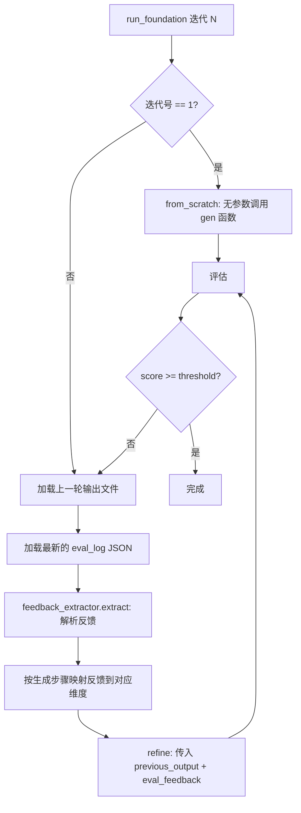
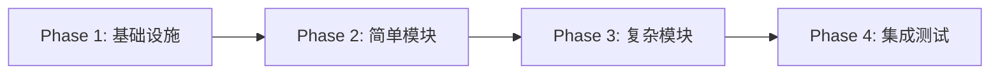
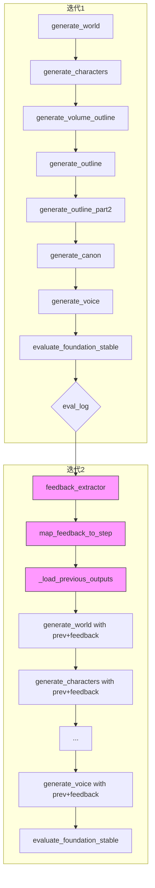

# Foundation 增量改进架构方案

> 从"Best-of-N 随机重采样"迁移到"反馈驱动的增量改进"

---

## 目录

1. [现状分析](#1-现状分析)
2. [总体架构](#2-总体架构)
3. [评估反馈提取与格式化](#3-评估反馈提取与格式化)
4. [run_foundation 迭代逻辑修改](#4-run_foundation-迭代逻辑修改)
5. [7 个 gen 函数签名变更](#5-7-个-gen-函数签名变更)
6. [Prompt 改进模式设计](#6-prompt-改进模式设计)
7. [实施优先级和步骤](#7-实施优先级和步骤)
8. [风险评估](#8-风险评估)

---

## 1. 现状分析

### 1.1 当前迭代逻辑（`pipeline_orchestrator.py` [`run_foundation()`](pipeline_orchestrator.py:72)）

```
for i in range(1, max_iters+1):
    步骤1-6: 调用 generate_world() → generate_characters() → ... → generate_voice()
    步骤7: evaluate_foundation_stable() → score
    步骤8: if score >= best_score - 0.3 → keep (git commit), else → discard (git reset)
    步骤9: if best_score >= threshold → break
```

**关键问题：**
- 每次迭代完全从零生成，不读取上一轮的输出文件
- 评估仅用于 keep/discard 决策，不注入具体反馈
- 迭代 2+ 的行为与迭代 1 完全相同（"用力掷骰子"）

### 1.2 当前 gen 函数签名（全部无参数）

| 模块 | 函数 | 当前签名 |
|------|------|---------|
| [`gen_world.py`](foundation/gen_world.py:17) | `generate_world()` | 无参数，读取 story + voice |
| [`gen_characters.py`](foundation/gen_characters.py:25) | `generate_characters()` | 无参数，读取 story + world + voice |
| [`gen_outline_volume.py`](foundation/gen_outline_volume.py:193) | `generate_volume_outline()` | 无参数，读取 story + world + chars + voice |
| [`gen_outline.py`](foundation/gen_outline.py:384) | `generate_outline()` | 无参数，循环调用 `generate_outline_for_volume(vol)` |
| [`gen_outline_part2.py`](foundation/gen_outline_part2.py:24) | `generate_outline_part2()` | 无参数，读取 outline + chars |
| [`gen_canon.py`](foundation/gen_canon.py:24) | `generate_canon()` | 无参数，读取 world + chars |
| [`gen_voice.py`](foundation/gen_voice.py:224) | `generate_voice()` | 无参数，读取 story + world + chars |

### 1.3 评估反馈数据结构（`eval_logs/foundation_*.json`）

来自 [`eval_judge_prompts.py`](prompts/eval_judge_prompts.py:77) 的 `build_foundation_eval_prompt()` 定义了 13 个维度，JSON 输出结构为：

```json
{
  "power_system_or_social_structure":   {"score": N, "weakest_moment": "...", "fix": "..."},
  "world_history_or_era_context":       {"score": N, "weakest_moment": "...", "fix": "..."},
  "geography_and_culture":              {"score": N, "weakest_moment": "...", "fix": "..."},
  "lore_interconnection":               {"score": N, "weakest_moment": "...", "fix": "..."},
  "iceberg_depth":                      {"score": N, "weakest_moment": "...", "fix": "..."},
  "character_depth":                    {"score": N, "weakest_moment": "...", "fix": "..."},
  "character_distinctiveness":          {"score": N, "weakest_moment": "...", "fix": "..."},
  "character_secrets":                  {"score": N, "weakest_moment": "...", "fix": "..."},
  "outline_completeness":              {"score": N, "weakest_moment": "...", "fix": "..."},
  "foreshadowing_balance":             {"score": N, "weakest_moment": "...", "fix": "..."},
  "internal_consistency":              {"score": N, "weakest_moment": "...", "fix": "..."},
  "voice_clarity":                     {"score": N, "weakest_moment": "...", "fix": "..."},
  "canon_coverage":                    {"score": N, "weakest_moment": "...", "fix": "..."},
  "top_3_improvements": ["改进1", "改进2", "改进3"],
  "weakest_dimension": "最弱维度名称",
  "overall_score": N,
  "lore_score": N
}
```

**反馈提取策略：** 提取 `score < 7` 维度的 `fix` 建议 + `top_3_improvements` + `weakest_dimension` 作为增量改进的输入。

---

## 2. 总体架构

### 2.1 核心理念

```
迭代 1:   from_scratch 模式（行为完全不变）
          ↓
          评估 → 生成 eval_log
          ↓
迭代 2+:  refine 模式（加载上一轮输出 + 评估反馈 → 增量改进）
          ↓
          评估 → 生成新的 eval_log
          ↓
迭代 3+:  继续 refine...
```

### 2.2 新增模块：`foundation/feedback_extractor.py`



### 2.3 新增文件清单

| 文件 | 用途 |
|------|------|
| `foundation/feedback_extractor.py` | 评估反馈提取与维度映射 |
| （现有 prompt 文件修改） | 各 `prompts/*_prompts.py` 增加改进模式 prompt 构建函数 |

---

## 3. 评估反馈提取与格式化

### 3.1 `feedback_extractor.py` 设计

```python
# foundation/feedback_extractor.py

import json
from pathlib import Path
from typing import Optional
from core.config import EVAL_LOGS_DIR


def load_latest_foundation_eval() -> Optional[dict]:
    """加载最新的 foundation 评估日志 JSON。"""
    logs = sorted(EVAL_LOGS_DIR.glob("foundation_*.json"))
    if not logs:
        return None
    with open(logs[-1], "r", encoding="utf-8") as f:
        return json.load(f)


def extract_feedback(eval_data: dict, score_threshold: float = 7.0) -> str:
    """从评估 JSON 中提取结构化的改进反馈文本。
    
    提取规则：
    1. 所有 score < score_threshold 的维度 → 「维度名: fix 内容」
    2. top_3_improvements
    3. weakest_dimension + 对应 fix
    
    Returns:
        格式化的反馈文本，可直接注入改进模式 prompt。
    """
    if not eval_data:
        return ""
    
    lines = []
    
    # 1) 总体方向
    weakest = eval_data.get("weakest_dimension", "")
    top3 = eval_data.get("top_3_improvements", [])
    
    if weakest or top3:
        lines.append("【评估总体反馈】")
        if weakest:
            lines.append(f"最弱维度: {weakest}")
        if top3:
            lines.append("最重要的 3 条改进方向:")
            for i, item in enumerate(top3, 1):
                lines.append(f"  {i}. {item}")
        lines.append("")
    
    # 2) 逐维度具体改进建议（仅低分维度）
    dim_names = [
        "power_system_or_social_structure",
        "world_history_or_era_context",
        "geography_and_culture",
        "lore_interconnection",
        "iceberg_depth",
        "character_depth",
        "character_distinctiveness",
        "character_secrets",
        "outline_completeness",
        "foreshadowing_balance",
        "internal_consistency",
        "voice_clarity",
        "canon_coverage",
    ]
    dim_labels = {
        "power_system_or_social_structure": "核心规则/社会结构",
        "world_history_or_era_context": "世界历史/时代背景",
        "geography_and_culture": "地理与文化",
        "lore_interconnection": "设定互联性",
        "iceberg_depth": "冰山深度",
        "character_depth": "角色深度",
        "character_distinctiveness": "角色区分度",
        "character_secrets": "角色秘密",
        "outline_completeness": "大纲完整度",
        "foreshadowing_balance": "伏笔平衡",
        "internal_consistency": "内部一致性",
        "voice_clarity": "文风清晰度",
        "canon_coverage": "正典覆盖度",
    }
    
    low_score_items = []
    for dim_key in dim_names:
        dim_data = eval_data.get(dim_key, {})
        if isinstance(dim_data, dict):
            score = dim_data.get("score", 10)
            fix = dim_data.get("fix", "")
            weakest_moment = dim_data.get("weakest_moment", "")
            if isinstance(score, (int, float)) and score < score_threshold and fix:
                low_score_items.append((dim_key, score, fix, weakest_moment))
    
    if low_score_items:
        lines.append("【低分维度具体改进建议】（评分 < 7 的维度）")
        lines.append("")
        for dim_key, score, fix, weakest_moment in low_score_items:
            label = dim_labels.get(dim_key, dim_key)
            lines.append(f"### {label} (评分: {score}/10)")
            if weakest_moment:
                lines.append(f"问题: {weakest_moment}")
            lines.append(f"改进方案: {fix}")
            lines.append("")
    
    return "\n".join(lines)


def map_feedback_to_step(eval_data: dict, step_name: str) -> str:
    """将评估反馈映射到特定生成步骤。
    
    维度 → 步骤映射:
      - world: power_system_or_social_structure, world_history_or_era_context,
               geography_and_culture, lore_interconnection, iceberg_depth
      - characters: character_depth, character_distinctiveness, character_secrets
      - outline / outline_volume: outline_completeness, foreshadowing_balance
      - outline_part2: foreshadowing_balance
      - canon: canon_coverage, internal_consistency
      - voice: voice_clarity
    
    Args:
        eval_data: 评估 JSON 数据
        step_name: 步骤名 (world/characters/outline_volume/outline/outline_part2/canon/voice)
    
    Returns:
        该步骤相关的格式化反馈文本
    """
    step_dims = {
        "world": [
            "power_system_or_social_structure",
            "world_history_or_era_context",
            "geography_and_culture",
            "lore_interconnection",
            "iceberg_depth",
        ],
        "characters": [
            "character_depth",
            "character_distinctiveness",
            "character_secrets",
        ],
        "outline_volume": [
            "outline_completeness",
            "foreshadowing_balance",
        ],
        "outline": [
            "outline_completeness",
            "foreshadowing_balance",
        ],
        "outline_part2": [
            "foreshadowing_balance",
        ],
        "canon": [
            "canon_coverage",
            "internal_consistency",
        ],
        "voice": [
            "voice_clarity",
        ],
    }
    
    dims = step_dims.get(step_name, [])
    if not dims or not eval_data:
        return ""
    
    lines = []
    lines.append("【上轮评估反馈 — 与本步骤直接相关的改进建议】")
    lines.append("")
    
    # 先加总体建议
    top3 = eval_data.get("top_3_improvements", [])
    if top3:
        lines.append("全局改进方向:")
        for item in top3:
            lines.append(f"  • {item}")
        lines.append("")
    
    dim_labels = {
        "power_system_or_social_structure": "核心规则/社会结构",
        "world_history_or_era_context": "世界历史/时代背景",
        "geography_and_culture": "地理与文化",
        "lore_interconnection": "设定互联性",
        "iceberg_depth": "冰山深度",
        "character_depth": "角色深度",
        "character_distinctiveness": "角色区分度",
        "character_secrets": "角色秘密",
        "outline_completeness": "大纲完整度",
        "foreshadowing_balance": "伏笔平衡",
        "internal_consistency": "内部一致性",
        "voice_clarity": "文风清晰度",
        "canon_coverage": "正典覆盖度",
    }
    
    for dim_key in dims:
        dim_data = eval_data.get(dim_key, {})
        if isinstance(dim_data, dict):
            score = dim_data.get("score", 10)
            fix = dim_data.get("fix", "")
            weakest_moment = dim_data.get("weakest_moment", "")
            if fix or weakest_moment:
                label = dim_labels.get(dim_key, dim_key)
                lines.append(f"### {label} (评分: {score}/10)")
                if weakest_moment:
                    lines.append(f"问题: {weakest_moment}")
                if fix:
                    lines.append(f"改进方案: {fix}")
                lines.append("")
    
    return "\n".join(lines) if len(lines) > 2 else ""
```

### 3.2 反馈提取的关键设计决策

1. **阈值 7.0**：仅提取 `score < 7` 的维度反馈 — 避免信息过载，聚焦真正需要改进的方面
2. **步骤维度映射**：每个 gen 函数只接收与其产出相关的反馈子集，防止"上下文污染"
3. **fallback 安全**：当 eval_log 不存在或解析失败时，返回空字符串 → 退化为 from_scratch 行为

---

## 4. run_foundation 迭代逻辑修改

### 4.1 修改后的 `run_foundation()` 伪代码

```python
def run_foundation(state: dict) -> dict:
    # ... 初始化不变 ...
    
    for i in range(iteration + 1, max_iters + 1):
        banner(f"基础构建 迭代 {i}/{max_iters}")
        state["iteration"] = i
        
        # ★ 新逻辑：判断迭代模式
        is_first_iteration = (i == 1)
        
        # ★ 加载上一轮的输出和评估反馈（迭代 2+ 使用）
        previous_outputs = {}
        eval_feedback = {}
        
        if not is_first_iteration:
            # 加载最新的评估日志
            eval_data = load_latest_foundation_eval()
            
            # 为每个步骤提取映射后的反馈
            for step_name in _STEP_ORDER:
                eval_feedback[step_name] = map_feedback_to_step(eval_data, step_name)
            
            # 加载上一轮的输出文件（作为 previous_output 传给 gen 函数）
            # 注意：如果上轮被 discard（git reset），则文件已被回退，
            # 此时 previous_output 为空 → 退化为 from_scratch
            previous_outputs = _load_previous_outputs()
        
        # ── 步骤 1: 生成世界观 ──
        step("生成世界观 world.md ...")
        from foundation.gen_world import generate_world
        prev = previous_outputs.get("world", "")
        fb = eval_feedback.get("world", "")
        generate_world(previous_output=prev, eval_feedback=fb)
        # ... state 更新不变 ...
        
        # ── 步骤 2: 生成角色 ──
        # （类似：传入 previous_output + eval_feedback）
        
        # ... 步骤 3-6 同理 ...
        
        # ── 步骤 7: 评估 ──
        step("评估基础构建 ...")
        score, lore = evaluate_foundation_stable()
        
        # ── 步骤 8: 保留/丢弃 ──
        if score >= best_score - 0.3:
            # keep（git commit）→ 下一轮迭代时 previous_outputs 可用
            git_add_commit(...)
            best_score = score
            # ...
        else:
            # discard（git reset）→ 文件回退到上一轮 keep 的状态
            # 下一轮迭代时 _load_previous_outputs() 会加载回退后的文件
            git_reset_hard("HEAD")
            # ...
        
        # ── 步骤 9: 退出检查 ──
        if best_score >= threshold:
            break
```

### 4.2 关键设计点

1. **迭代 1 永远走 from_scratch**：`previous_output=""` 且 `eval_feedback=""` → gen 函数行为完全不变
2. **迭代 2+ 的条件启用**：仅当 `previous_output` 非空时启用改进模式。如果上轮被 discard 导致文件回退，`_load_previous_outputs()` 返回空字典 → 自动退化为 from_scratch
3. **`_load_previous_outputs()` 辅助函数**：从 `output/` 目录读取当前存在的文件（被 git reset 回退后，文件为上一轮 keep 的版本）

```python
def _load_previous_outputs() -> dict:
    """加载 output/ 中当前存在的上一轮输出文件。
    
    在 discard 场景下，git reset 会将文件回退到上一轮 keep 的版本，
    所以这里读取到的就是"最近一次保留的版本"。
    """
    outputs = {}
    file_map = {
        "world":           OUTPUT_DIR / "world.md",
        "characters":      OUTPUT_DIR / "characters.md",
        "outline_volume":  OUTPUT_DIR / "outline_volume.md",
        "outline":         OUTPUT_DIR / "outline.md",
        "outline_part2":   OUTPUT_DIR / "outline.md",      # outline_part2 修改同一文件
        "canon":           OUTPUT_DIR / "canon.md",
        "voice":           OUTPUT_DIR / "voice.md",
    }
    for step_name, path in file_map.items():
        if path.exists():
            outputs[step_name] = path.read_text(encoding="utf-8-sig")
        else:
            outputs[step_name] = ""
    return outputs
```

---

## 5. 7 个 gen 函数签名变更

### 5.1 统一签名模式

每个 gen 函数新增两个可选参数：

```python
def generate_xxx(
    previous_output: str = "",
    eval_feedback: str = "",
) -> None:
```

| 参数 | 类型 | 默认值 | 语义 |
|------|------|--------|------|
| `previous_output` | `str` | `""` | 上一轮该步骤的输出全文。为空时 = from_scratch 模式 |
| `eval_feedback` | `str` | `""` | 评估反馈中与本步骤相关的改进建议。为空时 = 无反馈可用 |

### 5.2 各模块具体变更

#### 5.2.1 `gen_world.py` — `generate_world()`

```python
# 修改前
def generate_world() -> None:

# 修改后
def generate_world(previous_output: str = "", eval_feedback: str = "") -> None:
```

**内部逻辑变更：**
- 当 `previous_output` 和 `eval_feedback` 均为空 → 使用现有 `build_world_prompt()`（行为不变）
- 当参数非空 → 调用新的 `build_world_refine_prompt()`（见 §6）

#### 5.2.2 `gen_characters.py` — `generate_characters()`

```python
# 修改后
def generate_characters(previous_output: str = "", eval_feedback: str = "") -> None:
```

**注意：** 角色生成依赖 `world.md` 作为输入上下文。在改进模式下，`world.md` 可能也刚被改进过，所以需要读取最新的 `world.md`（而非依赖 `previous_output` 中的旧 world）。

#### 5.2.3 `gen_outline_volume.py` — `generate_volume_outline()`

```python
# 修改后
def generate_volume_outline(previous_output: str = "", eval_feedback: str = "") -> None:
```

**特殊考虑：** 卷级总纲是多卷链式生成（1-3 次 LLM 调用）。改进模式下：
- `previous_output` 为上一轮完整的 `outline_volume.md`
- 在改进模式的 prompt 中，不再重新拆分卷组，而是要求 LLM 审查全部卷的规划并针对性改进

#### 5.2.4 `gen_outline.py` — `generate_outline()`

```python
# 修改后
def generate_outline(previous_output: str = "", eval_feedback: str = "") -> None:
```

**特殊考虑：** `generate_outline()` 是对 `generate_outline_for_volume()` 的封装。改进模式下：
- `previous_output` 为上一轮完整的 `outline.md`（所有卷合并版）
- 改进模式 prompt 要求 LLM 逐章审查和改进

#### 5.2.5 `gen_outline_part2.py` — `generate_outline_part2()`

```python
# 修改后
def generate_outline_part2(previous_output: str = "", eval_feedback: str = "") -> None:
```

**特殊考虑：** 该函数将伏笔账本追加到 `outline.md`。改进模式下：
- `previous_output` 为上一轮的伏笔账本部分（或整个 outline.md）
- 改进模式 prompt 聚焦于补充缺失的伏笔、修正不合理的种植/回收间距

#### 5.2.6 `gen_canon.py` — `generate_canon()`

```python
# 修改后
def generate_canon(previous_output: str = "", eval_feedback: str = "") -> None:
```

**特殊考虑：** 正典从 `world.md` + `characters.md` 提取。改进模式下需要同时参考上一轮的正典和最新的 world/characters。

#### 5.2.7 `gen_voice.py` — `generate_voice()`

```python
# 修改后
def generate_voice(previous_output: str = "", eval_feedback: str = "") -> None:
```

**特殊考虑：** voice 生成内部已有子循环（5段语域 → 评估 → 精炼）。改进模式下：
- `previous_output` 为上一轮的 `voice.md`（Part 2 部分）
- 由于 voice 内部已有裁判评估，改进模式应针对 foundation 级评估的 `voice_clarity` 反馈做调整

---

## 6. Prompt 改进模式设计

### 6.1 通用改进模式 Prompt 模板

每个 gen 模块的 prompt 构建函数需要新增一个"改进模式"变体。通用模板如下：

```
你是一位[角色定位]。

【上一轮输出 — 请在此基础上改进】
{previous_output}

【评估反馈 — 必须解决的改进点】
{eval_feedback}

【改进指令】
请基于上一轮输出进行增量改进，而非从零重写。具体要求：

1. **保留好的部分**：上一轮中质量较高的内容应保留，不要推翻重来。
2. **针对性改进**：逐条处理「评估反馈」中指出的问题，给出具体的改进方案。
3. **改进标记**（可选）：如果有大幅度修改的段落，可以用「[改进] ... [/改进]」标记，
   或直接输出改进后的完整文档。
4. **一致性检查**：确保改进后的内容与其他已生成的文档保持一致。
   - 如果涉及角色设定，确保与 characters.md 一致
   - 如果涉及世界观，确保与 world.md 一致
   - （根据具体步骤添加相关约束）

【原始上下文（供参考）】
{story_summary}
{其他上下文（world/characters/voice 等，根据步骤决定）}

【输出要求】
输出完整的改进后文档。不要省略任何章节。
```

### 6.2 各步骤改进模式的差异化设计

#### 6.2.1 World (`build_world_refine_prompt`)

**关注维度：** `power_system_or_social_structure`, `world_history_or_era_context`, `geography_and_culture`, `lore_interconnection`, `iceberg_depth`

**关键指令：**
- "如果评估指出核心规则缺少代价/限制，请在相应章节补充"
- "如果评估指出历史事件仅做背景列举，请将其改写为驱动当前矛盾的动力源"
- "如果评估指出 iceberg_depth 不足，请将 2-3 个未解释事实转化为可被发现的线索"

#### 6.2.2 Characters (`build_characters_refine_prompt`)

**关注维度：** `character_depth`, `character_distinctiveness`, `character_secrets`

**关键指令：**
- "如果评估指出角色区分度不足，请为每位主要角色分配独特的隐喻域，并在对话示例中体现"
- "如果评估指出创伤-欲望-需求-谎言因果链存在逻辑缺口，请修正"
- "如果评估指出秘密不够具体，请将其改写为能直接改变情节走向的具体秘密"

#### 6.2.3 Outline / Outline Volume

**关注维度：** `outline_completeness`, `foreshadowing_balance`

**关键指令：**
- "如果评估指出某章缺少 try-fail 类型标注，请补充"
- "如果评估指出伏笔缺少回收计划，请在伏笔账本中标注回收章节"
- "如果大纲完整度不足，请补充缺失章节的节拍、情感弧线和 POV"

#### 6.2.4 Canon

**关注维度：** `canon_coverage`, `internal_consistency`

**关键指令：**
- "如果评估指出有已知事实未被收录进正典，请补充"
- "如果评估发现了文档间的矛盾，请标注并尝试解决"

#### 6.2.5 Voice

**关注维度：** `voice_clarity`

**关键指令：**
- "如果评估指出缺少明确的文风指南/范例/反范例，请在 voice.md Part 2 中补充"
- "如果评估指出范例中包含 AI 套话，请替换为更自然的段落"

### 6.3 Prompt 文件修改清单

| 文件 | 新增函数 |
|------|---------|
| [`prompts/world_prompts.py`](prompts/world_prompts.py) | `build_world_refine_prompt(previous_output, eval_feedback, story, voice)` |
| [`prompts/character_prompts.py`](prompts/character_prompts.py) | `build_characters_refine_prompt(previous_output, eval_feedback, story, world, voice)` |
| [`prompts/outline_prompts.py`](prompts/outline_prompts.py) | `build_outline_refine_prompt(...)` 和 `build_volume_outline_refine_prompt(...)` |
| [`prompts/gen_outline_part2.py` 内联](foundation/gen_outline_part2.py:38) | 提取为独立 prompt 函数 `build_outline_part2_refine_prompt(...)` |
| [`prompts/gen_canon.py` 内联](foundation/gen_canon.py:35) | 提取为独立 prompt 函数 `build_canon_refine_prompt(...)` |
| [`prompts/gen_voice.py` 内联](foundation/gen_voice.py) | 已有 `_build_select_prompt`，扩展为 `_build_voice_refine_prompt(...)` |

---

## 7. 实施优先级和步骤

### 7.1 阶段划分



### Phase 1: 基础设施（建议先做）

| 优先级 | 任务 | 文件 | 理由 |
|--------|------|------|------|
| **P0** | 新增 `feedback_extractor.py` | `foundation/feedback_extractor.py` | 所有后续工作依赖此模块 |
| **P0** | 修改 `run_foundation()` | `pipeline_orchestrator.py` | 编排层变更，需先确定接口 |
| **P0** | 新增 `_load_previous_outputs()` | `pipeline_orchestrator.py` | 同上 |

**验收标准：** `feedback_extractor.py` 能正确解析现有 `eval_logs/foundation_*.json` 并输出格式化反馈文本。

### Phase 2: 简单模块（低耦合、逻辑简单）

| 优先级 | 模块 | 复杂度 | 理由 |
|--------|------|--------|------|
| **P1** | `gen_world.py` | ⭐ 低 | 单一 LLM 调用，无子循环，无多文件依赖 |
| **P1** | `gen_canon.py` | ⭐ 低 | 单一 LLM 调用，prompt 当前内联（顺便提取） |
| **P1** | `gen_outline_part2.py` | ⭐ 低 | 单一 LLM 调用，prompt 当前内联（顺便提取） |

**验收标准：** 迭代 1 行为完全不变；迭代 2+ 传入 non-empty `previous_output` + `eval_feedback` 后能输出改进版本。

### Phase 3: 复杂模块（有子循环或多卷链式调用）

| 优先级 | 模块 | 复杂度 | 理由 |
|--------|------|--------|------|
| **P2** | `gen_characters.py` | ⭐⭐ 中 | 单一 LLM 调用，但依赖 world.md 作为上下文 |
| **P2** | `gen_voice.py` | ⭐⭐⭐ 高 | 内部有 5段语域 → 评估 → 精炼子循环 |
| **P2** | `gen_outline_volume.py` | ⭐⭐⭐ 高 | 多卷链式拆分（1-3 次 LLM 调用），需特别处理改进模式 |
| **P2** | `gen_outline.py` | ⭐⭐⭐ 高 | 对 `generate_outline_for_volume()` 的封装，多卷多次调用 |

**验收标准：**
- `gen_voice.py`：改进模式下跳过 5段语域试验，直接基于上一轮 voice 做精炼
- `gen_outline_volume.py` / `gen_outline.py`：改进模式下不再重新拆分卷组，做全量审查改进

### Phase 4: 集成测试与兼容性验证

| 优先级 | 任务 |
|--------|------|
| **P3** | 确保 `from_scratch` 模式（全新运行）完全不受影响 |
| **P3** | 确保 `resume` 模式（断点续传）不受影响 |
| **P3** | 模拟迭代 2+ discard 场景：验证 `_load_previous_outputs()` 返回回退后的文件 |
| **P3** | 端到端测试：2 次迭代的完整 Foundation 流程 |

### 7.2 可以暂缓的

- **`gen_voice.py` 的完整改进模式**：voice 内部已有自己的评估-精炼子循环，可以先用简单的"跳过语域试验、直接精炼"策略，后续再优化
- **多卷 outline 的增量改进**：可以先实现单卷模式下的改进，多卷拆分逻辑后续迭代
- **改进标记 `[改进] ... [/改进]`**：可选特性，可在 Phase 4 后按需添加

---

## 8. 风险评估

### 8.1 改动范围评估

| 风险项 | 等级 | 说明 |
|--------|------|------|
| **破坏现有行为** | 🟡 中低 | 新增参数均为可选且默认空字符串，现有调用路径不受影响 |
| **Prompt 质量退化** | 🟡 中 | 改进模式 prompt 如果设计不当，可能导致 LLM "过度修正"或"画蛇添足" |
| **评估反馈噪声** | 🟡 中 | LLM 裁判的 `fix` 建议质量参差不齐，需要在实际运行中观察 |
| **迭代发散** | 🟠 中 | 连续多轮改进可能导致内容逐渐偏离原始故事梗概 |
| **Token 成本增加** | 🟡 中低 | 改进模式 prompt 包含上一轮完整输出 + 反馈，长度增加约 1.5-2x |
| **链式依赖问题** | 🟠 中 | 步骤间有依赖关系（world → characters → outline），前一步改进可能影响后一步的一致性 |

### 8.2 兼容性保障策略

1. **默认参数 = 空字符串**：所有 gen 函数的 `previous_output` 和 `eval_feedback` 默认为 `""`
2. **空值即 from_scratch**：当参数为空时，gen 函数走原有 prompt 路径，确保行为零变化
3. **Git 回退保护**：如果上轮被 discard，`_load_previous_outputs()` 读取的是回退后的文件（即上上轮 keep 的版本），确保 `previous_output` 始终来自一个"被保留的"版本
4. **断点续传兼容**：`foundation_step` 状态追踪逻辑保持不变，改进模式不影响断点续传

### 8.3 测试策略

| 测试类型 | 内容 | 方法 |
|----------|------|------|
| **单元测试** | `feedback_extractor.py` 的解析逻辑 | 用现有 `eval_logs/foundation_*.json` 作为 fixture |
| **单元测试** | 各 gen 函数 `previous_output=""` 时行为不变 | 对比改进前后的输出（对同一输入） |
| **集成测试** | `run_foundation()` 迭代 1 行为不变 | 运行完整 Foundation 一次，对比 results.tsv |
| **集成测试** | 迭代 2 传入 non-empty 参数 | 手动构造 `previous_output` + `eval_feedback`，验证 gen 函数不崩溃 |
| **端到端测试** | 2 次迭代完整流程 | 设置 `max_iters=2, threshold=10`（强制运行 2 轮），观察第 2 轮是否使用改进模式 |
| **回归测试** | `resume` 模式 | 中断后恢复，验证状态正确加载 |

### 8.4 已知局限与缓解措施

| 局限 | 缓解 |
|------|------|
| LLM 裁判反馈可能不准确 | 仅提取 `fix` 建议作为"参考方向"而非"强制执行"，prompt 中明确"请评估反馈的合理性后再改进" |
| 连续改进可能导致"过度拟合裁判偏好" | 保留 `from_scratch` 作为 fallback；在 `run_foundation()` 中可加入"每隔 N 轮强制 from_scratch"的策略 |
| 改进模式 prompt 较长（包含上轮全文） | 对大文档（如 outline.md），可在改进模式中只传入低分维度相关的章节片段，而非全文 |
| 多步依赖链的一致性 | 改进模式下每步仍需读取最新的上游文档（如 characters 改进时读取最新的 world.md），而非依赖 `previous_output` 中的旧版本 |

---

## 附录 A: 关键文件变更汇总

| 文件 | 变更类型 | 说明 |
|------|---------|------|
| `foundation/feedback_extractor.py` | **新增** | 评估反馈提取与维度映射 |
| `pipeline_orchestrator.py` | **修改** | `run_foundation()` 迭代逻辑 + `_load_previous_outputs()` |
| `foundation/gen_world.py` | **修改** | 签名 + 改进模式分支 |
| `foundation/gen_characters.py` | **修改** | 签名 + 改进模式分支 |
| `foundation/gen_outline_volume.py` | **修改** | 签名 + 改进模式分支 |
| `foundation/gen_outline.py` | **修改** | 签名 + 改进模式分支 |
| `foundation/gen_outline_part2.py` | **修改** | 签名 + 改进模式分支 + prompt 提取 |
| `foundation/gen_canon.py` | **修改** | 签名 + 改进模式分支 + prompt 提取 |
| `foundation/gen_voice.py` | **修改** | 签名 + 改进模式分支 |
| `prompts/world_prompts.py` | **修改** | 新增 `build_world_refine_prompt()` |
| `prompts/character_prompts.py` | **修改** | 新增 `build_characters_refine_prompt()` |
| `prompts/outline_prompts.py` | **修改** | 新增 `build_outline_refine_prompt()` 等 |

## 附录 B: 数据流图


