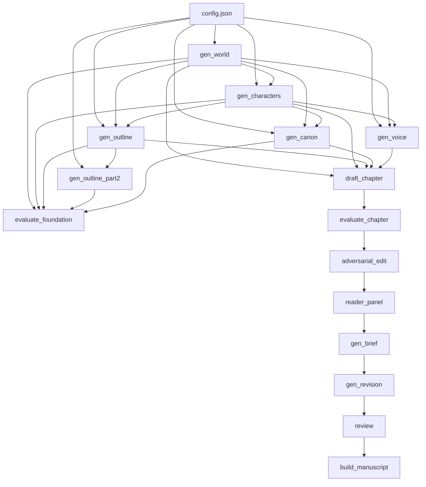

# 阶段3：集成级验证 — 测试计划

## 当前状态

- ✅ 阶段1（静态检查）：全部通过
- ✅ 阶段2（单元级验证）：全部通过
- ⚠️ 阶段3（集成级验证）：仅有 Test 1（gen_world），其余 12 个测试尚未编写

## 测试环境

| 配置项 | 值 |
|--------|-----|
| API | SiliconFlow `https://api.siliconflow.cn/v1` |
| 模型 | `deepseek-ai/deepseek-v4-pro` |
| 故事梗概 | 2049年上海，程序员发现AI觉醒，36小时倒计时 |
| 总章节数 | 3章 |
| API间隔 | 4秒 |
| 模式 | `from_scratch` |

## 模块依赖图



## 测试清单（共13个测试）

### ⬜ Test 1: gen_world — 世界观生成
- **文件**: [`_phase3_test.py`](_phase3_test.py)
- **状态**: ✅ 已编写
- **调用**: [`foundation.gen_world.generate_world()`](foundation/gen_world.py:25)
- **验证**: [`output/world.md`](output/world.md) 存在且 > 100 bytes

### ⬜ Test 2: gen_characters — 角色注册表生成
- **依赖**: Test 1（需要 world.md）
- **调用**: [`foundation.gen_characters.generate_characters()`](foundation/gen_characters.py:25)
- **验证**: [`output/characters.md`](output/characters.md) 存在且 > 100 bytes

### ⬜ Test 3: gen_outline — 大纲 Part 1 生成
- **依赖**: Test 1, Test 2（需要 world.md, characters.md）
- **调用**: [`foundation.gen_outline.generate_outline()`](foundation/gen_outline.py:28)
- **验证**: [`output/outline.md`](output/outline.md) 存在且 > 200 bytes

### ⬜ Test 4: gen_outline_part2 — 伏笔账本追加
- **依赖**: Test 3（需要 outline.md）
- **调用**: [`foundation.gen_outline_part2.generate_outline_part2()`](foundation/gen_outline_part2.py:24)
- **验证**: [`output/outline.md`](output/outline.md) 包含 "伏笔账本" 关键字

### ⬜ Test 5: gen_canon — 正典生成
- **依赖**: Test 1, Test 2（需要 world.md, characters.md）
- **调用**: [`foundation.gen_canon.generate_canon()`](foundation/gen_canon.py:23)
- **验证**: [`output/canon.md`](output/canon.md) 存在且 > 200 bytes

### ⬜ Test 6: gen_voice — 文风发现
- **依赖**: Test 1, Test 2（需要 world.md, characters.md）
- **调用**: [`foundation.gen_voice.generate_voice()`](foundation/gen_voice.py:26)
- **验证**: [`output/voice.md`](output/voice.md) 存在且 > 200 bytes

### ⬜ Test 7: evaluate_foundation — 基础构建评估
- **依赖**: Test 1-6 全部完成
- **调用**: [`evaluation.evaluate.evaluate_foundation()`](evaluation/evaluate.py:144)
- **验证**: 返回 non-empty string，包含 `overall_score`

### ⬜ Test 8: draft_chapter + evaluate_chapter — 单章起草+评估
- **依赖**: Test 1-6 (需要全部 foundation 产物)
- **调用**:
  1. [`drafting.draft_chapter.draft_chapter(chapter_num=1)`](drafting/draft_chapter.py:57)
  2. [`evaluation.evaluate.evaluate_chapter(ch_num=1)`](evaluation/evaluate.py:183)
- **验证**:
  - [`output/chapters/ch_01.md`](output/chapters/ch_01.md) 存在且 > 500 chars
  - slop_score_zh 检测正常
  - overall_score >= 0

### ⬜ Test 9: adversarial_edit — 对抗性编辑
- **依赖**: Test 8（需要 ch_01.md）
- **调用**: [`revision.adversarial_edit.run_adversarial_edit(target="1")`](revision/adversarial_edit.py:21)
- **验证**: [`output/edit_logs/ch01_cuts.json`](output/edit_logs/ch01_cuts.json) 存在且 valid JSON

### ⬜ Test 10: reader_panel — 读者评审团
- **依赖**: Test 8（需要至少 1 章文件）
- **调用**: [`revision.reader_panel.run_reader_panel()`](revision/reader_panel.py:19)
- **验证**: [`output/edit_logs/reader_panel.json`](output/edit_logs/reader_panel.json) 存在且 valid JSON，含 4 位读者角色

### ⬜ Test 11: gen_brief + gen_revision — 修订摘要+重写
- **依赖**: Test 8, Test 9, Test 10
- **调用**:
  1. [`revision.gen_brief.generate_brief(chapter_num=1)`](revision/gen_brief.py:25)
  2. [`revision.gen_revision.revise_chapter(ch_num=1, brief_file=brief_path)`](revision/gen_revision.py:18)
- **验证**:
  - [`output/briefs/ch01_brief.md`](output/briefs/ch01_brief.md) 存在且 > 50 bytes
  - [`output/chapters/ch_01.md`](output/chapters/ch_01.md) 更新（file size 变化）

### ⬜ Test 12: review — 深度审阅
- **依赖**: Test 8（需要至少 1 章文件，3 章最佳）
- **调用**: [`revision.review.run_review_loop()`](revision/review.py:19)
- **验证**: [`output/edit_logs/review_round1.md`](output/edit_logs/review_round1.md) 存在且包含 `★` 评分

### ⬜ Test 13: build_manuscript — 手稿拼接导出
- **依赖**: Test 8（需要至少 1 章文件）
- **调用**: [`export.build_manuscript.build_manuscript()`](export/build_manuscript.py:15)
- **验证**: [`output/manuscript.md`](output/manuscript.md) 存在且 > 500 bytes，含目录

## 测试脚本结构

所有测试将整合到 [`_phase3_test.py`](_phase3_test.py)，采用与阶段1/2一致的格式：

```python
#!/usr/bin/env python3
"""Phase 3: Integration verification — one module at a time."""
import sys, json, time, traceback
from pathlib import Path

ROOT = Path(r"e:/my novel")
sys.path.insert(0, str(ROOT))

results = []

def test(name, fn):
    try:
        fn()
        results.append(("OK", name))
        print(f"  [OK] {name}")
    except Exception as e:
        results.append(("FAIL", name))
        print(f"  [FAIL] {name} -- {e}")
        traceback.print_exc()

# Test 1-13 ...

# Summary
total = len(results)
passed = sum(1 for r in results if r[0] == "OK")
print(f"\n{'='*60}")
print(f"  Phase 3: {passed}/{total} passed")
for status, name in results:
    mark = "✓" if status == "OK" else "✗"
    print(f"    [{mark}] {name}")
```

## 执行计划

### 可并行测试
- Test 1 单独（无依赖）✅ 已完成
- Test 2-6 依赖 Test 1，必须**顺序执行**（每个 Test 都依赖前面的 output）
- Test 5/6 可与其他 foundation 并行（仅依赖 Test 1+2）

### 推荐执行顺序（保守）

1. **Session A** (Foundation 构建，~6-8次 API 调用):
   - Test 1 → Test 2 → Test 3 → Test 4 → Test 5 → Test 6 → Test 7
   - 预计 API 调用: 7次，约 28秒纯等待 + 生成时间

2. **Session B** (草拟，~2次 API 调用):
   - Test 8 (draft + evaluate)
   - 预计 API 调用: 2次

3. **Session C** (修订，~6-8次 API 调用):
   - Test 9 → Test 10 → Test 11 → Test 12
   - 预计 API 调用: 6-8次

4. **Session D** (导出，0次 API 调用):
   - Test 13
   - 纯本地操作

### 最小化测试方案（节省 API 费用）

可以跳过或精简：
- Test 7（evaluate_foundation）— 可用 Test 2-6 的产出文件存在性代替
- Test 9-12（修订全流程）— 可仅做 exist + valid JSON 检查，不需要完整运行
- Test 12（review）— 3 章太少，意义有限，可跳过或 run 1 轮

## API 费用预估

| 测试 | 调用次数 | 每次 max_tokens | 预估 token 消耗 |
|------|---------|----------------|----------------|
| Test 1 gen_world | 1x writer | 4096 | ~2K input + ~2K output |
| Test 2 gen_characters | 1x writer | 4096 | ~3K input + ~2K output |
| Test 3 gen_outline | 1x writer | 4096 | ~5K input + ~3K output |
| Test 4 gen_outline_part2 | 1x writer | 4096 | ~5K input + ~2K output |
| Test 5 gen_canon | 1x writer | 4096 | ~4K input + ~3K output |
| Test 6 gen_voice | 2x writer | 4096 | ~4K input + ~4K output |
| Test 7 eval_foundation | 1x judge | 4096 | ~8K input + ~1K output |
| Test 8 draft+eval | 2x writer+judge | 16000+4096 | ~10K input + ~4K output |
| Test 9 adversarial | 1x judge | 4096 | ~3K input + ~1K output |
| Test 10 reader_panel | 4x judge | 4096 | ~6K input + ~4K output |
| Test 11 brief+revision | 2x writer | 4096+16000 | ~8K input + ~5K output |
| Test 12 review | 1x judge | 8192 | ~6K input + ~2K output |
| Test 13 manuscript | 0 | - | 纯本地 |
| **合计** | **~18次** | | **~90K-100K tokens** |

以 SiliconFlow deepseek-v4-pro 价格约 ¥2/百万 token 计算，总计约 **¥0.20**。

## 风险与缓解

| 风险 | 影响 | 缓解措施 |
|------|------|----------|
| API 超时 | 单个测试卡住 | 设置 per-test 超时（600s），超时标记 FAIL 继续下一个 |
| API 返回空响应 | 产出文件缺失 | 检查文件 size，空文件标记 FAIL |
| 某测试失败导致后续依赖失败 | 级联失败 | 每个测试独立 try/except，失败时跳过依赖它的测试 |
| 速率限制 429 | 测试变慢 | RateLimiter 已内置 429 退避逻辑 |
| Ctrl+C 中断 | 状态残留 | 不做 git commit，仅验证文件产出 |

---

## 最终确认

本计划覆盖了阶段3全部 13 个集成测试：

1. ✅ Test 1: gen_world
2. ⬜ Test 2: gen_characters
3. ⬜ Test 3: gen_outline
4. ⬜ Test 4: gen_outline_part2
5. ⬜ Test 5: gen_canon
6. ⬜ Test 6: gen_voice
7. ⬜ Test 7: evaluate_foundation
8. ⬜ Test 8: draft_chapter + evaluate_chapter
9. ⬜ Test 9: adversarial_edit
10. ⬜ Test 10: reader_panel
11. ⬜ Test 11: gen_brief + gen_revision
12. ⬜ Test 12: review
13. ⬜ Test 13: build_manuscript

全部实现为一个文件 [`_phase3_test.py`](_phase3_test.py)，追加到现有 Test 1 之后。