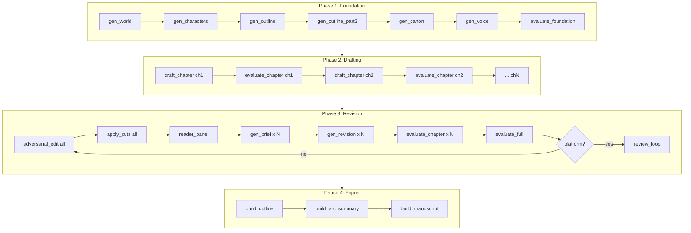
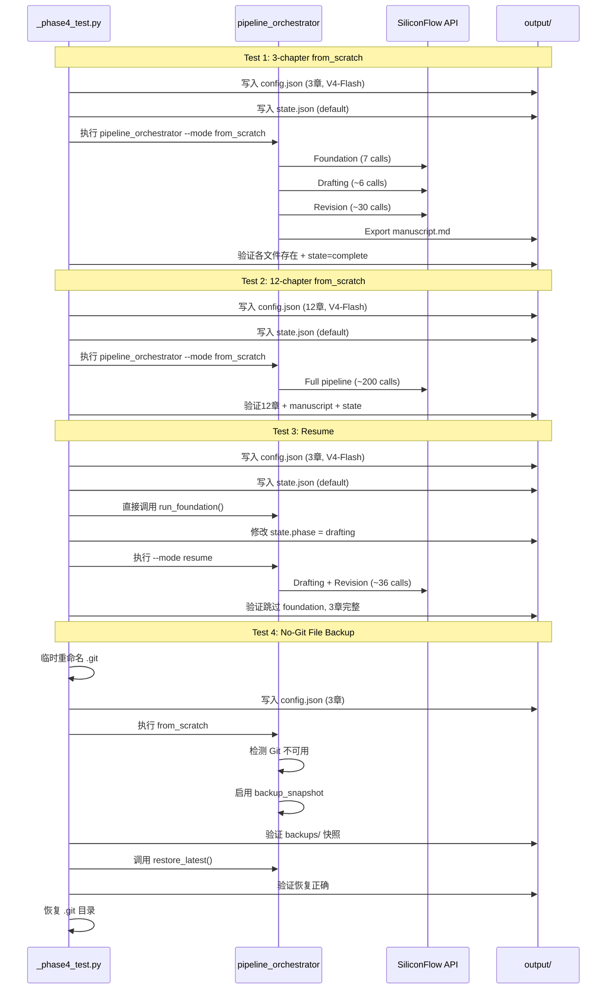

# 阶段4：端到端验证 — 测试计划

## 测试环境

| 配置项 | 测试1/3/4 | 测试2 |
|--------|-----------|-------|
| API | SiliconFlow `https://api.siliconflow.cn/v1` | 同 |
| 模型 | `deepseek-ai/DeepSeek-V4-Flash` | 同 |
| 故事梗概 | 2049年上海，程序员发现AI觉醒，36小时倒计时 | 同 |
| 总章节数 | 3章 | 12章 |
| API间隔 | 4秒 | 4秒 |
| 模式 | `from_scratch` | `from_scratch` |

---

## 流水线架构

---

## 测试清单

### ⬜ Test 1: 最小化流水线 3 章 from_scratch

- **目的**: 验证完整流水线（Foundation → Drafting → Revision → Export）在小规模上从头跑到尾
- **配置**: `total_chapters=3`, `model_name=deepseek-ai/DeepSeek-V4-Flash`, `mode=from_scratch`
- **执行**: `python pipeline_orchestrator.py --mode from_scratch`
- **预估 API 调用**: ~45次（Foundation 7 + Drafting ~6 + Revision ~30 + Review ~4 - 实际取决于通过率）
- **预估耗时**: ~25分钟
- **预估费用**: ~¥0.50

**验证项**:
1. ✅ 流水线无异常退出（exit code 0）
2. ✅ `output/world.md` 存在且 > 500 bytes
3. ✅ `output/characters.md` 存在且 > 200 bytes  
4. ✅ `output/outline.md` 存在且 > 300 bytes
5. ✅ `output/canon.md` 存在且 > 200 bytes
6. ✅ `output/voice.md` 存在且 > 300 bytes
7. ✅ `output/chapters/ch_01.md` ~ `ch_03.md` 全部存在且 > 500 bytes 每章
8. ✅ `output/manuscript.md` 存在且合并了3章内容
9. ✅ `output/state.json` 中 phase = "complete"
10. ✅ `output/results.tsv` 有记录行

---

### ⬜ Test 2: 完整流水线 12 章 from_scratch

- **目的**: 验证流水线在中大规模上稳定运行，无内存泄漏、状态漂移
- **配置**: `total_chapters=12`, `model_name=deepseek-ai/DeepSeek-V4-Flash`, `mode=from_scratch`
- **执行**: `python pipeline_orchestrator.py --mode from_scratch`
- **预估 API 调用**: ~200次
- **预估耗时**: ~1.5小时
- **预估费用**: ~¥1.50

**验证项**:
1. ✅ 流水线无异常退出
2. ✅ 所有12章文件 `ch_01.md` ~ `ch_12.md` 存在且 > 500 bytes
3. ✅ `output/manuscript.md` 合并12章
4. ✅ `output/state.json` 中 phase = "complete", chapters_drafted = 12
5. ✅ 修订循环 >= MIN_REVISION_CYCLES (3) 或平台期提前停止
6. ✅ 总字数 > 24000 字（12章 × 约2000字/章）
7. ✅ `output/results.tsv` 记录完整

---

### ⬜ Test 3: Resume 中断恢复

- **目的**: 验证从 state.json 恢复中断的流水线
- **策略**: 
  1. 重置 state，运行 Foundation（直接调用 `run_foundation()`）
  2. 手动设置 state.phase = "drafting", chapters_drafted = 0
  3. 运行 `python pipeline_orchestrator.py --mode resume`
  4. 验证跳过 Foundation，直接从 drafting 开始

- **配置**: `total_chapters=3`, `model_name=deepseek-ai/DeepSeek-V4-Flash`
- **预估 API 调用**: Foundation 7 + Drafting ~6 + Revision ~30 = ~43次
- **预估耗时**: ~25分钟
- **预估费用**: ~¥0.50

**验证项**:
1. ✅ Foundation 仅执行一次（通过检查 world.md 时间戳确认）
2. ✅ Resume 从 drafting 阶段开始（state.phase 从 "drafting" → "revision" → "export" → "complete"）
3. ✅ 3章全部生成
4. ✅ `output/manuscript.md` 正确导出
5. ✅ 日志中不出现 "从头开始生成" 横幅（resume 模式跳过该消息）

---

### ⬜ Test 4: 无 Git 环境下文件备份模式

- **目的**: 验证 Git 不可用时，文件快照备份/恢复机制正常工作
- **策略**:
  1. 检测 `.git` 目录是否存在
  2. 如果存在，临时重命名为 `.git_disabled_backup`
  3. 运行 3 章完整流水线
  4. 验证 `output/backups/` 下有 snapshot 目录
  5. 验证 `restore_latest()` 能正确恢复文件
  6. 恢复 `.git` 目录

- **配置**: `total_chapters=3`, `model_name=deepseek-ai/DeepSeek-V4-Flash`
- **预估 API 调用**: ~45次
- **预估耗时**: ~25分钟
- **预估费用**: ~¥0.50

**验证项**:
1. ✅ 控制台输出 "[状态] Git 不可用，使用文件快照备份"
2. ✅ `output/backups/` 目录存在且包含多个 snapshot 子目录
3. ✅ 每个 snapshot 包含 `label.txt`、关键文档、chapters 子目录
4. ✅ `restore_latest()` 返回 True（不抛异常）
5. ✅ 恢复后章节文件内容与备份一致

---

## 数据流图

---

## 执行顺序

测试按以下顺序执行，每个测试前清空 output 目录：

1. **Test 4**（无 Git 备份）— 先跑，因为涉及 .git 目录操作，需要确保复原
2. **Test 3**（Resume 恢复）— 依赖于 foundation 的完整性
3. **Test 1**（3章完整）— 标准基线
4. **Test 2**（12章完整）— 最后跑，因为最耗时

每个测试执行前：
1. 清空 `output/chapters/`、`output/briefs/`、`output/edit_logs/`、`output/eval_logs/`、`output/backups/`
2. 删除 `output/manuscript.md`、`output/state.json`、`output/results.tsv`（如果存在）
3. 保留 `output/config.json`（将被覆写）、`output/world.md` 等 foundation 文件（将被覆写）