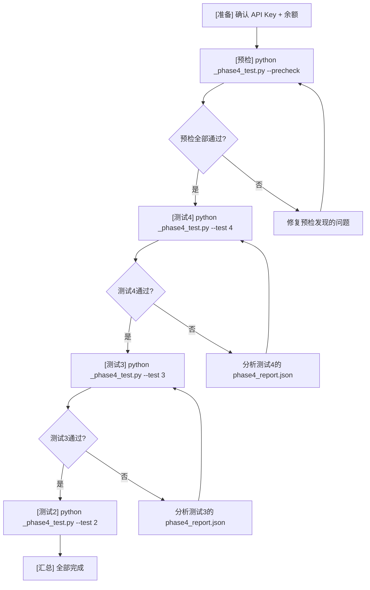

# 阶段4：剩余测试 — 快速预检 + 执行方案

## 背景

测试1（3章 from_scratch）已完成 — 17/17 全部通过 ✅。

剩余：
| 测试 | 内容 | 预估耗时 | 预估费用 | 状态 |
|------|------|----------|----------|------|
| 测试4 | 无 Git 文件备份 | ~25min | ~¥0.50 | 代码就绪 |
| 测试3 | Resume 中断恢复 | ~25min | ~¥0.50 | 代码就绪 |
| 测试2 | 12 章完整流水线 | ~1.5h | ~¥1.50 | 代码就绪 |

推荐执行顺序：**4 → 3 → 2**（4 优先因为涉及 .git 操作，需要确保能恢复）

---

## 一、快速预检方案（不需要 API 调用）

在投入 ¥2.50 + 2 小时之前，先通过静态分析 + 单元级模拟验证测试代码自身无缺陷。

### 预检项列表

#### P1: 测试4 — 文件备份模块纯函数验证

| # | 预检项 | 验证方式 | 对应代码 |
|---|--------|----------|----------|
| P1.1 | `backup_snapshot()` 目录创建 + 文件复制正常 | 创建临时 output，调用函数，检查快照结构 | [`core/state_manager.py:175`](core/state_manager.py:175) |
| P1.2 | `restore_latest()` 恢复逻辑 | 先备份 → 删除文件 → 恢复 → 比较内容 | [`core/state_manager.py:214`](core/state_manager.py:214) |
| P1.3 | `.git` 重命名/恢复 try/finally 安全 | 检查 `test_4_file_backup_mode` 的 finally 块 | [`_phase4_test.py:649`](_phase4_test.py:649) |
| P1.4 | 空 backups/ 目录时 `restore_latest()` 行为 | 模拟空目录 → 验证返回 False 不抛异常 | [`core/state_manager.py:216`](core/state_manager.py:216) |
| P1.5 | `_has_git()` 缓存正确（调用两次不重复检测） | 检查 `_GIT_AVAILABLE` 全局变量逻辑 | [`core/state_manager.py:49`](core/state_manager.py:49) |
| P1.6 | `git_available()` 在测试4禁用场景下行为 | `.git` 不存在 → `_has_git` 返回 False → 走文件备份 | [`core/state_manager.py:52`](core/state_manager.py:52) |

#### P2: 测试3 — Resume 流程验证

| # | 预检项 | 验证方式 | 对应代码 |
|---|--------|----------|----------|
| P2.1 | `run_foundation()` 后 phase 自动设 "drafting" | 检查 `run_foundation` 结尾 `state["phase"] = "drafting"` | [`pipeline_orchestrator.py:143`](pipeline_orchestrator.py:143) |
| P2.2 | `run_pipeline("resume")` 正确跳过已完成阶段 | 检查 `PHASE_ORDER` + `start_idx` 逻辑 | [`pipeline_orchestrator.py:559`](pipeline_orchestrator.py:559) |
| P2.3 | Foundation 产物时间戳比对逻辑 | 检查 `foundation_timestamps` 收集 + `st_mtime` 比较 | [`_phase4_test.py:460`](_phase4_test.py:460) |
| P2.4 | state.phase="complete" 时 resume 拒绝执行 | 检查 `complete` 守卫 | [`pipeline_orchestrator.py:547`](pipeline_orchestrator.py:547) |
| P2.5 | `run_drafting` 从 `chapters_drafted+1` 开始 | `start_chapter = state.get("chapters_drafted", 0) + 1` | [`pipeline_orchestrator.py:159`](pipeline_orchestrator.py:159) |

#### P3: 测试2 — 12 章规模验证

| # | 预检项 | 验证方式 | 对应代码 |
|---|--------|----------|----------|
| P3.1 | `count_words_in_chapters()` 统计 12 章正确 | 造 12 个测试文件 → 验证字数累计 | [`core/state_manager.py:108`](core/state_manager.py:108) |
| P3.2 | `write_config(total_chapters=12)` 写入正确 | 检查 config.json 中 `total_chapters: 12` | [`_phase4_test.py:76`](_phase4_test.py:76) |
| P3.3 | 12 章 manuscript 合并 | 检查 12 个分隔符（ch1-ch12 间至少 11 个 `---`） | 基于测试1的经验 |
| P3.4 | state.chapters_total 在 foundation 后设为 12 | `get_total_chapters(state)` 走 config 路径 | [`core/state_manager.py:97`](core/state_manager.py:97) |
| P3.5 | 修订循环 ≥ 3 次 | 平台期检测在 `MIN_REVISION_CYCLES=3` 之后触发 | [`pipeline_orchestrator.py:436`](pipeline_orchestrator.py:436) |

### 快速预检执行方式

```
python _phase4_test.py --precheck 4   # 只预检测试4
python _phase4_test.py --precheck 3   # 只预检测试3
python _phase4_test.py --precheck 2   # 只预检测试2
python _phase4_test.py --precheck     # 全部预检
```

所有预检项零 API 调用，预计 30 秒内完成。

---

## 二、执行计划

### 准备操作

1. **确认 API Key 有效**：`output/config.json` 中存在有效的 `api_key`
2. **确认余额充足**：至少 ¥3.00（3个测试合计）
3. **关闭其他占用 CPU/网络的应用**：确保流水线不被干扰
4. **记录起始状态**：截图当前 output/ 目录状态

### 执行顺序



### 每项测试后检查

1. 检查 `phase4_report.json` 中对应 test 的结果
2. 检查 `output/` 中生成的文件完整性
3. **测试4特别检查**：确认 `.git` 目录已恢复
4. 记录实际耗时和费用

---

## 三、失败处理预案

| 失败场景 | 可能原因 | 处理方式 |
|----------|----------|----------|
| 测试4 找不到 backups/ | `git_available()` 仍返回 True（.git 未真正禁用） | 确认 `_has_git()` 正确检测；如果 `.git` 是目录但内含文件被锁，手动用 `cmd /c move` |
| 测试3 Foundation 时间戳变了 | `run_pipeline("resume")` 实际走了 `from_scratch` 分支 | 检查 state.json 的 mode 字段和 config.json 是否同步 |
| 测试3 日志出现"从头开始生成" | `run_pipeline` 判断 mode 的逻辑有误 | 检查 `--mode resume` 是否正确传递到子进程 |
| 测试2 中途网络断开 | SiliconFlow 临时不可用 | 等待恢复后用 `--mode resume` 继续（这恰好验证了 resume 机制） |
| 测试2 API 429 频繁限流 | 间隔不够 | 调整 `api_interval_seconds: 5` 或更高 |
| 测试2 某章始终不过阈值 | 模型评分不准 | 正常——`run_drafting` 有 fallback（5次后保留最后结果） |