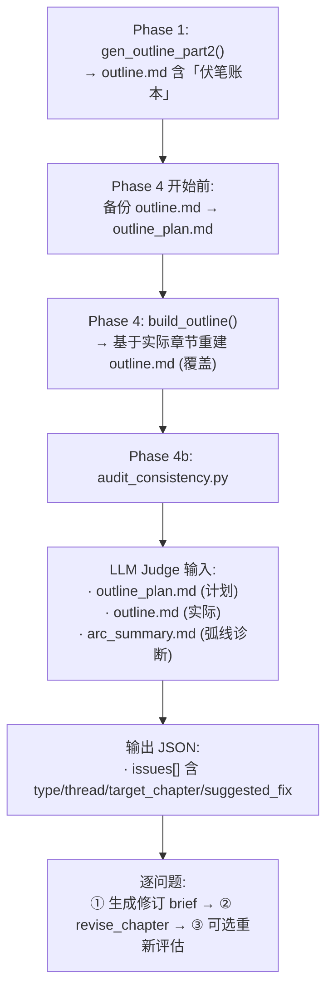

# Phase 4b: 一致性审计 + 伏笔回收修订 — 设计方案

## 一、为什么要替代 Phase 3b

| Phase 3b 的问题 | Phase 4b 的解决方案 |
|----------------|-------------------|
| 审阅修订只修 4 章（100 章中覆盖 4%） | 基于伏笔账本精确定位需修订的章节，按需修订 |
| `weakest_chapter` 判断基于每章首尾 500 字 | 基于完整大纲对比（计划 vs 实际），有全局视野 |
| 修订后不验证一致性 | 修订后重新检查该伏笔线是否已回收 |
| 对长篇小说的章间断裂无感知 | 大纲对比天然能发现缺失的节拍和矛盾 |

## 二、核心思路

```
Phase 1 产出  ────→ outline.md (含伏笔账本)
                         │
Phase 2-3 写作修订        │  对比差异
                         │
Phase 4 产出  ────→ outline.md (重建) + arc_summary.md
                         │
                         ▼
              ┌─────────────────────┐
              │  Phase 4b: 一致性审计 │
              │  LLM Judge 对比两份大纲 │
              │  找出：               │
              │  · 未回收的伏笔        │
              │  · 章间矛盾            │
              │  · 角色弧线断裂        │
              └─────────┬───────────┘
                        │
                        ▼
              对每个问题 → gen_brief → revise_chapter
```

## 三、数据流



## 四、实现清单

### 改动 1: 保存原始大纲 (`pipeline_orchestrator.py` `run_export()`)

在 `run_export()` 调用 `build_outline()` 之前：

```python
# Phase 4b: 保存原始大纲（含伏笔账本），供后续一致性审计使用
original_outline = OUTPUT_DIR / "outline.md"
plan_outline = OUTPUT_DIR / "outline_plan.md"
if original_outline.exists():
    plan_outline.write_text(original_outline.read_text(encoding="utf-8"))
    step(f"原始大纲已保存: outline_plan.md")
```

### 改动 2: 删除 Phase 3b (`pipeline_orchestrator.py`)

删除 `run_revision()` 中的 `_run_review_revision_loop()` 嵌套函数定义及其调用（约 85 行）。

### 改动 3: 新增 Phase 4b 调用 (`pipeline_orchestrator.py`)

在 `run_export()` 末尾、`state["phase"] = "complete"` 之前插入：

```python
# Phase 4b: 一致性审计 + 伏笔回收修订
from export.audit_consistency import run_consistency_audit
state = run_consistency_audit(state)
```

### 改动 4: 新建 `export/audit_consistency.py`

核心模块，约 200 行。见第五节详细设计。

---

## 五、`export/audit_consistency.py` 详细设计

### 5.1 主函数

```python
def run_consistency_audit(
    state: dict,
    max_tokens: int = 8192,
    retries: int = 2,
    max_total_time: int = 600,
    max_revisions: int = 10,
) -> dict:
    """Phase 4b: 一致性审计 + 伏笔回收修订。

    对比 Phase 1 计划大纲（含伏笔账本）与 Phase 4 重建大纲，
    找出未回收的伏笔、章间矛盾、角色弧线断裂，
    对每个问题生成修订摘要并执行章节修订。

    返回更新后的 state。
    """
```

### 5.2 审计步骤

```
Step A: 加载数据源
  — outline_plan.md (Phase 1 计划，含伏笔账本)
  — outline.md (Phase 4 重建，反映实际内容)
  — arc_summary.md (弧线诊断)
  — characters.md (角色注册表)
  若 outline_plan.md 不存在 → 跳过审计，记录日志

Step B: 发送给 LLM Judge 做一致性审计
  — 构建对比 prompt
  — 调用 call_judge()
  — 解析 JSON 输出

Step C: 分类解析审计结果
  — 类型: foreshadowing / consistency / arc
  — 每类包含: 问题描述、涉及章节、建议修订方向

Step D: 对每个问题生成修订摘要并执行修订
  — 确定目标章节
  — 生成结构化修订 brief
  — 调用 revise_chapter()
  — git commit
  — max_revisions 上限保护
```

### 5.3 LLM 审计 Prompt

```
你是一位小说一致性审计员。请对比以下两份大纲：

【计划大纲（Phase 1 产出，含伏笔账本）】
{outline_plan}

【实际大纲（Phase 4 重建，反映真实写作完成的内容）】
{outline_actual}

【弧线摘要】
{arc_summary}

请找出以下三类问题：

1. 未回收的伏笔
   — 伏笔账本中标注了「种植章」和「回收章」的线索
   — 在实际大纲中对应的回收章并未体现该线索的回收

2. 章间矛盾
   — 两个章节对同一事实/同一角色状态的表述互相矛盾

3. 角色弧线断裂
   — 角色的行为/状态变化缺少必要的中间步骤

对每个问题指定：类型(type)、涉及章节、问题描述、目标修订章节(target_chapter)、建议修订方向(suggested_fix)

输出纯 JSON：{"issues": [{...}, ...]}  若无问题则 {"issues": []}
```

### 5.4 修订 brief 格式

每个问题生成一个结构化修订摘要，格式：

```markdown
# 修订摘要: 第 {ch} 章 — 一致性审计 ({type})

## 【核心问题】
类型: {foreshadowing / consistency / arc}
描述: {具体描述}

## 【修订项】
1. {suggested_fix}

## 【保留项】
— 保持本章原有的事件主线不变
— 保持角色既有性格和对话风格
— 保持与前后章节的衔接

## 【文风规则】
（从 voice.md 动态提取）

## 【字数目标】
保持当前长度，仅在必要位置微调（通常 50-200 字的增量修改）
```

### 5.5 修订后验证（可选）

```python
# 修订完成后，可选重新运行审计检查
# 最多 2 轮，只检查已标记的问题是否已修复
for retry in range(2):
    remaining = _run_audit_only(state)
    if not remaining["issues"]:
        step("所有一致性问题已修复")
        break
```

---

## 六、改动量汇总

| # | 文件 | 操作 | 估算 |
|---|------|------|------|
| 1 | `pipeline_orchestrator.py` | 删除 Phase 3b | -85 行 |
| 2 | `pipeline_orchestrator.py` | 新增 outline_plan.md 保存 | +6 行 |
| 3 | `pipeline_orchestrator.py` | 新增 Phase 4b 调用 | +4 行 |
| 4 | `export/audit_consistency.py` | **新建文件** | +200 行 |
| **合计** | **2 个文件** | | **+210 / -85 行** |

---

## 七、与 Phase 3b 的对比总结

| 维度 | Phase 3b (审阅修订) | Phase 4b (一致性审计) |
|------|:--:|:--:|
| 数据源 | 全文章节文本 → 1 个 weakest_chapter | 计划大纲 + 实际大纲 + 弧线摘要 |
| 判断依据 | 每章首尾 500 字（中间不可见） | 大纲级全局对比（计划 vs 实际） |
| 修订覆盖率 | 最多 4 章（100 章 = 4%） | 按需修订，上限可控 |
| 一致性检查 | 无 | 核心功能 |
| 伏笔回收检查 | 无 | 伏笔账本逐条比对 |
| LLM 调用 | ~8 次 | ~1+N 次（1审计 + N修订） |
| 长篇适用性 | 不适用 | 适用（基于大纲，与章节总数无关） |

---

## 八、风险评估

| 风险 | 缓解措施 |
|------|---------|
| `outline_plan.md` 已不存在（resume 场景） | 检查文件存在性，不存在则跳过并记录日志 |
| Phase 1 未生成伏笔账本 | 仅检查章间矛盾和弧线，跳过伏笔检查 |
| 审计发现修订量过大 | `max_revisions=10` 硬上限 |
| 修订后引入新问题 | 可选修订后验证循环 |
| LLM JSON 解析失败 | 三级回退解析 + 保存原始响应 |
