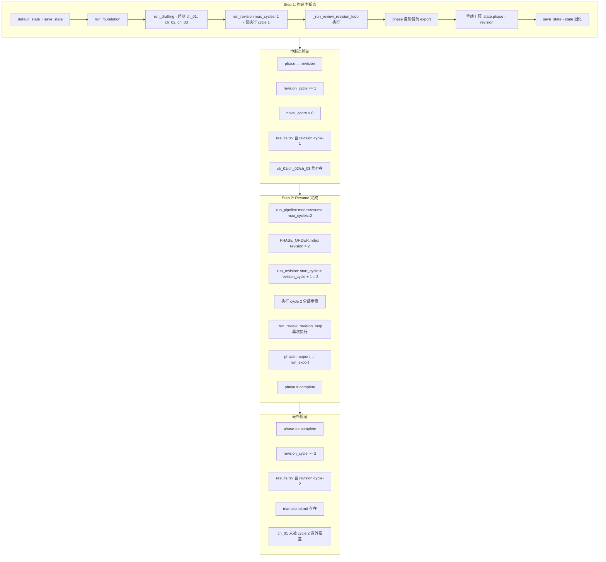

# 【5.7.4】Revision 循环中中断→resume 详细实施方案

> **所属**: [阶段5 边界条件测试](phase5_boundary_test_plan.md) → [5.7 全流水线边界组合](phase5_5.7_boundary_combination_plan.md) → 5.7.4  
> **版本**: v2.0 (修正版)  
> **日期**: 2026-06-23  
> **类型**: 真实 API 调用（需 API）  
> **前置条件**: 5.1–5.6 全部 mock 测试通过；`.env` API Key 有效  
> **对应代码**: [`tests/stage5_boundary_tests.py`](tests/stage5_boundary_tests.py) → `Test57LiveBoundary.test_5_7_4_revision_mid_interrupt_resume`  
> **关键源码**: [`run_revision`](pipeline_orchestrator.py:425) / [`run_pipeline`](pipeline_orchestrator.py:1155) / [`PHASE_ORDER`](pipeline_orchestrator.py:51) / [`save_state`](core/state_manager.py:101)

---

## 1. 概述

### 1.1 测试目的

验证 Revision 阶段（`run_revision`）的**循环级中断恢复机制**：

- 在 revision cycle 1 完成后、cycle 2 开始前发生中断
- `state.json` 中 `revision_cycle=1` 正确保留
- resume 后 `run_revision` 从 `start_cycle = revision_cycle + 1 = 2` 开始
- **不重复执行 cycle 1** 的全部子步骤（对抗性编辑、读者评审团、共识解析、章节修订、全文评估）
- cycle 1 中已通过 `git_add_commit` 提交的修改不回滚
- 最终 Export 完整执行，`phase="complete"`

### 1.2 配置参数

| 配置项 | 值 | 理由 |
|--------|-----|------|
| `total_chapters` | `3` | 提供足够章节供 revision 共识采样 |
| `total_volumes` | `1` | 单卷简化 |
| `max_foundation_iters` | `1` | 最小化 Foundation 重试 |
| `foundation_threshold` | `1.0` | 极低阈值确保一次通过 |
| `chapter_threshold` | `1.0` | 极低阈值确保一次通过 |
| `max_chapter_attempts` | `1` | 禁止起草重试 |
| `max_revision_cycles` | `2` | **至少 2 轮**，保证 cycle 2 确实执行 |
| `plateau_delta` | `999.0` | 禁用平台期检测（`MIN_REVISION_CYCLES=3` 已阻止 cycle ≤ 2 触发，`999.0` 作为兜底冗余） |

### 1.3 资源预估

| 资源 | 预估 |
|------|------|
| API 调用 | Step 1: ~30 次 (Foundation~7 + Drafting×3~9 + Revision cycle 1~14) + Step 2: ~25 次 (Revision cycle 2~14 + Export 0) = **~55 次** |
| 耗时 | Step 1: ~25min + Step 2: ~15min = **~40min** |
| 费用 | **~¥0.75** |

---

## 2. 现有实现诊断 (Gap Analysis)

### 2.1 现有代码行为

当前 [`test_5_7_4_revision_mid_interrupt_resume`](tests/stage5_boundary_tests.py:1558) 的实现流程：

```
Step 1:
  run_foundation(state)          → phase="drafting"
  run_drafting(state)            → phase="revision", revision_cycle=0
  run_revision(state, max_cycles=1)  → 执行 cycle 1 全部步骤
                                      → 执行 _run_review_revision_loop
                                      → phase="export"  ← 🔴 问题所在
  save_state(state)              → state.phase="export"

Step 2:
  run_pipeline(mode="resume")
  → PHASE_ORDER.index("export") = 3
  → phases = ["export"]
  → run_export(state)            → phase="complete"
```

**问题**：Resume 后直接从 Export 开始，**完全跳过了 cycle 2**，核心验证目标 V2 无法达成。

### 2.2 根因分析

[`run_revision`](pipeline_orchestrator.py:1089) 的结构：

```python
def run_revision(state, max_cycles=...):
    for cycle in range(start_cycle, max_cycles + 1):   # line 449
        # ... cycle 完整执行 ...
        state["revision_cycle"] = cycle                 # line 829
        save_state(state)                               # line 830 ← revision_cycle 在此写入
        # 平台期检测 → 可能 break                         # line 833-836

    # ⬇ 循环结束后
    _run_review_revision_loop(...)                      # line 1084 ← 审阅修订闭环
    state["phase"] = "export"                           # line 1089 ← 🔴 phase 在此切换
    save_state(state)                                   # line 1091
    return state
```

两个 `save_state` 调用点之间存在**语义鸿沟**：

| 时间点 | `state` 内容 | 含义 |
|--------|-------------|------|
| T1 (line 830) | `revision_cycle=1, phase="revision"` | cycle 1 完成，**可恢复点** |
| T2 (line 1091) | `revision_cycle=1, phase="export"` | 审阅修订闭环已完成，Revision 全部结束 |

**T1→T2 间隙**正是 `_run_review_revision_loop` 和 `phase` 赋值之间——这是 KeyboardInterrupt 可能发生的真实窗口。

### 2.3 修正策略

**核心思路**：在 Step 1 中，**只执行 cycle 1 的基础修订 + `save_state` (T1)**，然后**手动回滚 `phase` 至 `"revision"`** 模拟中断。Step 2 中 resume 时 `PHASE_ORDER.index("revision")=2`，`run_revision` 中 `start_cycle = state["revision_cycle"] + 1 = 2`，正确从 cycle 2 开始。

具体手段：
1. 调用 `run_revision(state, max_cycles=1)` 完成 cycle 1
2. **捕获 `run_revision` 返回的 `state`**，此时 `phase="export"`
3. **手动覆盖**：`state["phase"] = "revision"`，然后 `save_state(state)`
4. Step 2 中 `run_pipeline(mode="resume", max_cycles=2)` — 确保 `max_cycles` 参数正确传入

---

## 3. 详细实施方案

### 3.1 三步执行流程



### 3.2 Step 1 伪代码

```python
def test_5_7_4_revision_mid_interrupt_resume(self):
    _write_config_57({
        "total_chapters": 3,
        "max_revision_cycles": 2,
        "plateau_delta": 999.0,
    })

    from pipeline_orchestrator import (
        run_foundation, run_drafting, run_revision, run_pipeline,
    )

    # ── Step 1: Foundation + Drafting + Revision cycle 1 ──
    t0 = time.time()
    state = default_state()
    save_state(state)

    # Phase 1+2: Foundation → Drafting
    state = run_foundation(state)
    state = run_drafting(state)
    # 此时: phase="revision", revision_cycle=0, chapters_drafted=3

    # Phase 3: 只执行 cycle 1
    state = run_revision(state, max_cycles=1)
    # run_revision 内部:
    #   for cycle in range(1, 2):  → 执行 cycle 1
    #   line 830: save_state → revision_cycle=1, phase="revision"
    #   line 836: break (cycle=1 < MIN_REVISION_CYCLES=3, 平台期不触发)
    #   line 1084: _run_review_revision_loop 执行
    #   line 1089: phase="export"
    #   line 1091: save_state → phase="export" 🔴

    elapsed1 = time.time() - t0
    print(f"    Step 1 耗时: {elapsed1/60:.1f}min")

    # ── 🔧 关键修复: 回滚 phase 模拟中断 ──
    # 模拟 KeyboardInterrupt 正好发生在 revision_cycle=1 已保存、
    # 但 _run_review_revision_loop 尚未完成或 phase 尚未切换的时刻。
    state["phase"] = "revision"       # ← 核心修复
    # 保留 revision_cycle=1（run_revision 已写入）
    # 保留 novel_score（run_revision 已写入）
    # 保留 review_revision_round（若有，_run_review_revision_loop 已写入）
    save_state(state)

    # ── 中断点验证 ──
    results = []
    results.append(_record_results(
        "Interrupt/phase=revision",
        state.get("phase") == "revision",
        f"phase={state.get('phase')}"))

    results.append(_record_results(
        "Interrupt/revision_cycle=1",
        state.get("revision_cycle") == 1,
        f"cycle={state.get('revision_cycle')}"))

    results.append(_record_results(
        "Interrupt/novel_score>0",
        state.get("novel_score", 0) > 0,
        f"score={state.get('novel_score')}"))

    results.append(_record_results(
        "Interrupt/results.tsv_has_cycle1",
        _tsv_has_line("revision-cycle-1"),
        "OK" if _tsv_has_line("revision-cycle-1") else "MISSING"))

    for ch in range(1, 4):
        chp = CHAPTERS_DIR / f"ch_{ch:02d}.md"
        ok = chp.exists() and chp.stat().st_size >= 300
        results.append(_record_results(
            f"Interrupt/ch_{ch:02d}.md",
            ok,
            f"{chp.stat().st_size}B" if chp.exists() else "MISSING"))

    _report_57(results)

    # ── Step 2: Resume ──
    t0 = time.time()
    run_pipeline(mode="resume", max_cycles=2)
    elapsed2 = time.time() - t0
    print(f"    Step 2 耗时: {elapsed2/60:.1f}min")

    # ── 最终验证 ──
    results2 = []
    final_state = load_state()

    results2.append(_record_results(
        "Final/phase=complete",
        final_state.get("phase") == "complete",
        f"phase={final_state.get('phase')}"))

    results2.append(_record_results(
        "Final/revision_cycle>=2",
        final_state.get("revision_cycle", 0) >= 2,
        f"cycle={final_state.get('revision_cycle')}"))

    results2.append(_record_results(
        "Final/novel_score>0",
        final_state.get("novel_score", 0) > 0,
        f"score={final_state.get('novel_score')}"))

    results2.append(_record_results(
        "Final/results.tsv_has_cycle2",
        _tsv_has_line("revision-cycle-2"),
        "OK" if _tsv_has_line("revision-cycle-2") else "MISSING"))

    ms = OUTPUT_DIR / "manuscript.md"
    results2.append(_record_results(
        "Export/manuscript.md",
        ms.exists(),
        "OK" if ms.exists() else "MISSING"))

    # ch_01 内容未被 cycle 2 意外覆盖（通过 git log 间接验证）
    for ch in range(1, 4):
        chp = CHAPTERS_DIR / f"ch_{ch:02d}.md"
        ok = chp.exists() and chp.stat().st_size >= 300
        results2.append(_record_results(
            f"Final/ch_{ch:02d}.md",
            ok,
            f"{chp.stat().st_size}B" if chp.exists() else "MISSING"))

    _report_57(results2)
```

### 3.3 关键时序对比

```
时间线 (现有实现 — Broken):
  ┌─────── cycle 1 ──────┐  ┌─ review_loop ─┐
  │ save_state(revision) │  │ phase="export" │ ← Step 1 终态
  │ revision_cycle=1     │  │ save_state()   │
  └──────────────────────┘  └────────────────┘
                                             ↓
                           resume → PHASE_ORDER["export"] → skip Revision ❌

时间线 (修正方案):
  ┌─────── cycle 1 ──────┐  ┌─ review_loop ─┐  ┌─ 手动干预 ─┐
  │ save_state(revision) │  │ phase="export" │  │ phase=      │ ← Step 1 终态
  │ revision_cycle=1     │  │                │  │ "revision"  │
  └──────────────────────┘  └────────────────┘  │ save_state  │
                                                └─────────────┘
                                                       ↓
                           resume → PHASE_ORDER["revision"]
                           → run_revision: start_cycle=2 → cycle 2 ✅
```

---

## 4. 验证点矩阵

### 4.1 Step 1 中断点验证

| # | 验证项 | 验证方法 | 通过标准 |
|---|--------|----------|----------|
| V1 | `state.phase == "revision"` | `load_state()` | 精确等于 `"revision"` |
| V2 | `state.revision_cycle == 1` | `load_state()` | 精确等于 `1` |
| V3 | `state.novel_score > 0` | `load_state()` | 大于 `0` |
| V4 | `results.tsv` 含 `revision-cycle-1` | `RESULTS_FILE.read_text()` | 包含该字符串 |
| V5 | `ch_01.md` 存在且 > 300 bytes | `Path.stat().st_size` | 文件存在且大小 ≥ 300 |
| V6 | `ch_02.md` 存在且 > 300 bytes | 同上 | 同上 |
| V7 | `ch_03.md` 存在且 > 300 bytes | 同上 | 同上 |

### 4.2 Step 2 最终验证

| # | 验证项 | 验证方法 | 通过标准 |
|---|--------|----------|----------|
| V8 | `state.phase == "complete"` | `load_state()` | 精确等于 `"complete"` |
| V9 | `state.revision_cycle >= 2` | `load_state()` | ≥ 2（cycle 2 已执行） |
| V10 | `state.novel_score > 0` | `load_state()` | 大于 0（cycle 2 后可能变化） |
| V11 | `results.tsv` 含 `revision-cycle-2` | `RESULTS_FILE.read_text()` | 包含该字符串 |
| V12 | `manuscript.md` 存在 | `Path.exists()` | 文件存在 |
| V13 | `ch_01–03.md` 全部存在且 ≥ 300 bytes | `st_size` | 全部通过 |
| V14 | `manuscript.md` 合并了 3 章内容 | `read_text()` 解析 | 含 `ch_01` / `ch_02` / `ch_03` 引用 |

### 4.3 辅助验证函数

```python
def _tsv_has_line(keyword: str) -> bool:
    """检查 results.tsv 中是否包含指定关键词行。"""
    if not RESULTS_FILE.exists():
        return False
    content = RESULTS_FILE.read_text(encoding="utf-8")
    return keyword in content
```

---

## 5. 边界条件与风险分析

### 5.1 核心边界

| 边界 | 描述 | 处理 |
|------|------|------|
| **B1: `phase` 回滚** | 手动 `state["phase"] = "revision"` 模拟的中断点必须与真实 KeyboardInterrupt 窗口一致 | 真实中断窗口就在 `save_state(line 830)` 和 `phase="export"(line 1089)` 之间；`_run_review_revision_loop` 内部也有 `save_state` 调用（[`line 1066`](pipeline_orchestrator.py:1066)），但该调用不修改 `phase`，因此 `revision_cycle=1, phase="revision"` 是合法断点 |
| **B2: `start_cycle` 计算** | `start_cycle = state.get("revision_cycle", 0) + 1` | resume 时 `revision_cycle=1` → `start_cycle=2`，正确从 cycle 2 开始 |
| **B3: `max_cycles` 参数穿透** | `run_pipeline(mode="resume", max_cycles=2)` → `run_revision(state, max_cycles=2)` | 必须显式传入 `max_cycles=2`，否则默认 `MAX_REVISION_CYCLES=6`，可能跑多余的 cycle |
| **B4: platform 平台期** | `cycle=1 < MIN_REVISION_CYCLES=3`，平台期不触发；`cycle=2` 同样不触发 | `plateau_delta=999.0` 作为冗余兜底 |
| **B5: `_run_review_revision_loop` 重复执行** | cycle 1 和 cycle 2 各执行一次审阅修订闭环 | 这是预期行为——两轮都应审阅；`review_revision_round` 会从 1 重新计数（因为 resume 时 `state` 中可能已有该字段） |
| **B6: git commit 不丢失** | cycle 1 的 `git_add_commit` 在 `save_state` 前已完成 | resume 不会回滚已提交内容 |
| **B7: `results.tsv` 追加不覆盖** | `log_result` 使用 `"a"` 模式追加 | 两次 resume 的记录都会保留 |

### 5.2 已知风险

| 风险 | 概率 | 影响 | 缓解措施 |
|------|------|------|----------|
| API 超时导致 cycle 1 不完整 | 中 | Step 1 超时，无法验证 | `max_total_time` 参数已设为合理值（600~1200s）；超时时捕获异常并跳过测试 |
| `_run_review_revision_loop` 内部 `save_state` 可能覆盖 `phase` | 低 | `review_revision_round` 字段正确但行为不变 | 检查其内部不修改 `phase` 字段（已验证） |
| `run_pipeline("resume")` 不读取 config 中的 `max_revision_cycles` | 高 | cycle 2 之后可能跑 cycle 3-6 | **必须**显式传参 `max_cycles=2` |

### 5.3 与父计划差异对照

| 父计划项 | 父计划值 | 修正方案值 | 变更原因 |
|----------|----------|-----------|----------|
| `plateau_delta` | `0.0` | `999.0` | `0.0` 语义为"0 分差即停止"，但 cycle ≤ 2 < `MIN_REVISION_CYCLES=3` 时平台期本身不触发；`999.0` 更明确表达"禁用"意图且不产生副作用 |
| `max_revision_cycles` | `2` | `2` | 不变，但需通过 `run_pipeline` 的 `max_cycles` 参数显式传递 |
| 中断点 phase | `"revision"` | `"revision"`（手动回滚） | 父计划正确，现有实现错误 |
| `state.phase` 在 resume 后的路径 | Revision→Export→complete | 同左 | 修正后一致 |

---

## 6. 实施方案与现有代码的集成

### 6.1 改动范围

仅需修改 [`test_5_7_4_revision_mid_interrupt_resume`](tests/stage5_boundary_tests.py:1558) 一个方法，无需修改 `pipeline_orchestrator.py`。

### 6.2 改动清单

| 文件 | 行号范围 | 改动类型 | 说明 |
|------|----------|----------|------|
| `tests/stage5_boundary_tests.py` | 1558–1624 | 重写 | 替换现有实现 |

### 6.3 具体改动

**原代码问题行**：
- [`line 1581`](tests/stage5_boundary_tests.py:1581): `state = run_revision(state, max_cycles=1)` — 之后 `phase` 变为 `"export"`
- [`line 1588`](tests/stage5_boundary_tests.py:1588): 断言 `phase in ("revision", "export")` — 实际只会匹配 `"export"`，V1 验证宽松失效
- [`line 1603`](tests/stage5_boundary_tests.py:1603): `run_pipeline(mode="resume")` — 未传 `max_cycles=2`

**修正后新增**：
1. 在 `run_revision(state, max_cycles=1)` 后新增 `state["phase"] = "revision"` + `save_state(state)`
2. 收紧 V1 断言为 `state.get("phase") == "revision"`（不再允许 `"export"`）
3. Step 2 改为 `run_pipeline(mode="resume", max_cycles=2)`
4. 新增 `results.tsv` 验证（V4, V11）
5. 新增章节文件完整性验证（V5-V7, V13）

---

## 7. 执行命令

### 7.1 单独执行 5.7.4

```powershell
# 确保 API Key 已配置
# 确保前置 mock 测试已通过 (5.1–5.6)

python tests/stage5_boundary_tests.py --category 7 --test 5_7_4
```

### 7.2 与其他 5.7 测试组合

```powershell
# P2 级别组合 (5.7.3 + 5.7.4 + 5.7.5)
python tests/stage5_boundary_tests.py --category 7 --test 5_7_3,5_7_4,5_7_5
```

---

## 8. 通过标准

| 维度 | 标准 |
|------|------|
| Step 1 中断点验证 | V1–V7 全部 PASS |
| Step 2 最终验证 | V8–V14 全部 PASS |
| 阶段崩溃 | 0 次未捕获异常 |
| 数据一致性 | `state.json` 最终 `phase="complete"`, `revision_cycle>=2`, `novel_score>0` |
| 产出完整性 | `ch_01–03.md` + `manuscript.md` 全部存在且非空 |
| 日志正确性 | `results.tsv` 包含 `revision-cycle-1` 和 `revision-cycle-2` 两条记录 |

---

## 9. 附录: `run_revision` 内部 `save_state` 调用点全景

```
run_revision(state, max_cycles):
    start_cycle = state.get("revision_cycle", 0) + 1

    for cycle in range(start_cycle, max_cycles + 1):           # line 449
        # ... adversarial_edit → apply_cuts → reader_panel ...
        # ... 共识解析 → 逐章修订 → 全文评估 ...

        state["novel_score"] = novel_score                      # line 828
        state["revision_cycle"] = cycle                         # line 829
        save_state(state)                                       # line 830 ← 🟢 可恢复断点

        # 平台期检测
        if cycle >= MIN_REVISION_CYCLES and ... < plateau_delta: # line 833
            break

    # Phase 3b: 审阅修订闭环
    _run_review_revision_loop(state, ...)                       # line 1084
        # 内部可能调用 save_state(state) (line 1066)
        # 但只写 review_revision_round，不修改 phase

    state["phase"] = "export"                                   # line 1089 ← 🔴 断点消失
    save_state(state)                                           # line 1091
    return state
```

**关键结论**：line 830 的 `save_state` 是 Revision 内部唯一的 **phase 未变但 cycle 已递增** 的保存点。这正是模拟中断的正确时间窗口。

---

> **下一步**: 切换到 Code 模式实施此方案，修改 [`test_5_7_4_revision_mid_interrupt_resume`](tests/stage5_boundary_tests.py:1558)。