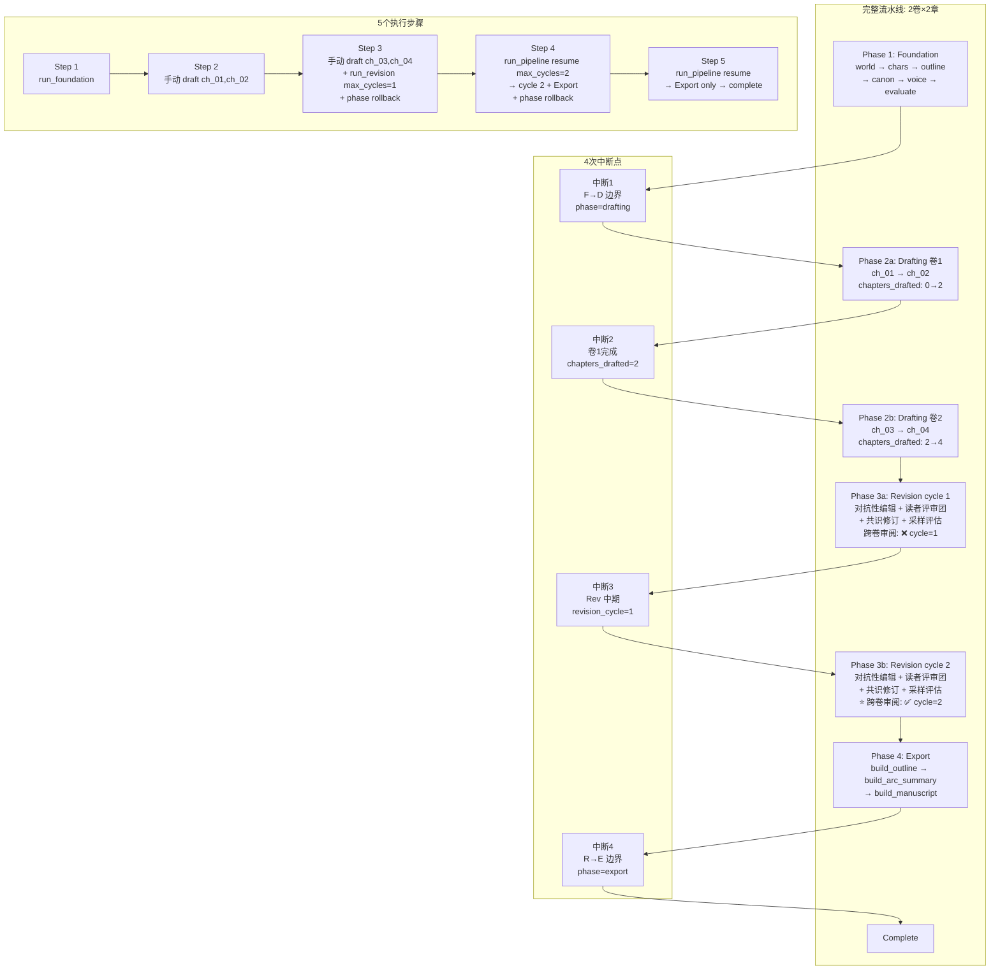

# 【5.7.5】多次中断串联 — 2卷×2章全流程压力测试 详细实施方案

> **所属**: [阶段5 边界条件测试](phase5_boundary_test_plan.md) → [5.7 全流水线边界组合](phase5_5.7_boundary_combination_plan.md) → 5.7.5  
> **版本**: v3.0 (2卷×2章扩展版)  
> **日期**: 2026-06-24  
> **类型**: 真实 API 调用（需 API）  
> **前置条件**: 5.1–5.6 全部 mock 测试通过；`.env` API Key 有效  
> **对应代码**: [`tests/stage5_boundary_tests.py`](tests/stage5_boundary_tests.py) → `Test57LiveBoundary.test_5_7_5_multi_interrupt_chain`  
> **关键源码**: [`run_foundation`](pipeline_orchestrator.py:58) / [`run_drafting`](pipeline_orchestrator.py:186) / [`run_revision`](pipeline_orchestrator.py:425) / [`run_export`](pipeline_orchestrator.py:1094) / [`run_pipeline`](pipeline_orchestrator.py:1147) / [`PHASE_ORDER`](pipeline_orchestrator.py:51) / [`save_state`](core/state_manager.py:101)

---

## 1. 概述

### 1.1 测试目的

验证流水线在 **2卷×2章多卷拓扑** 下经历 **4次中断**（覆盖全部4个Phase边界 + 跨卷衔接点）后，最终能完整产出且状态无漂移：

| # | 中断点 | 位置 | 验证重点 |
|---|--------|------|----------|
| **中断1** | Foundation → Drafting 边界 | Foundation 完成后 | `phase="drafting"` 正确切换，Foundation 产出完整 |
| **中断2** | Volume 1 起草完成 | ch_01+ch_02 完成后 | `chapters_drafted=2`，卷1章节完整，resume 从 ch_03 起始 |
| **中断3** | Revision cycle 1 完成 | cycle 1 全部修订后 | `revision_cycle=1` 保留，resume→cycle 2 触发跨卷一致性审阅 |
| **中断4** | Revision → Export 边界 | 修订全部完成后 | `phase="export"`，resume 只执行导出，不重复前三个阶段 |

### 1.2 与现有实现的区别

| 维度 | 现有 v1.0（当前代码） | v3.0（本方案） |
|------|----------------------|----------------|
| 章卷配置 | `total_chapters=2`, 单卷 | `total_chapters=4`, `total_volumes=2`, `chapters_per_volume=2` |
| 中断次数 | 2 次 | **4 次** |
| 执行步数 | 3 步 | **5 步** |
| 跨卷验证 | 无 | 有（cycle 2 触发 `_cross_volume_consistency_review`） |
| Revision cycle | 1 轮 | **2 轮**（含跨卷一致性审阅） |
| 中断技术 | 手动 draft_chapter + 直接 resume | **统一使用分步 state 回滚**（与 5.7.4 一致） |

### 1.3 配置参数

| 配置项 | 值 | 理由 |
|--------|-----|------|
| `total_chapters` | `4` | 2卷×2章 = 4章 |
| `total_volumes` | `2` | 多卷拓扑，验证跨卷衔接恢复 |
| `chapters_per_volume` | `2` | 每卷 2 章 |
| `max_foundation_iters` | `1` | 最小化 Foundation 重试 |
| `foundation_threshold` | `1.0` | 极低阈值确保一次通过 |
| `chapter_threshold` | `1.0` | 极低阈值确保一次通过 |
| `max_chapter_attempts` | `1` | 禁止起草重试 |
| `max_revision_cycles` | `2` | 至少 2 轮，确保 cycle 2 触发跨卷一致性审阅 |
| `plateau_delta` | `999.0` | 禁用平台期检测（`MIN_REVISION_CYCLES=3` 已阻止 cycle≤2 触发，`999.0` 兜底） |

### 1.4 资源预估

| 资源 | 预估 |
|------|------|
| API 调用 | Foundation(~7) + Drafting×4(~4×3=12) + Revision cycle1(~14) + Revision cycle2(~14) + Export(0) = **~47 次** |
| 耗时 | Step 1: ~6min + Step 2: ~10min + Step 3: ~10min + Step 4: ~12min + Step 5: ~2min = **~40min** |
| 费用 | **~¥0.65** |

---

## 2. 现有实现诊断 (Gap Analysis)

### 2.1 当前代码行为

当前 [`test_5_7_5_multi_interrupt_chain`](tests/stage5_boundary_tests.py:1739) 仅 3 步 2 次中断：

```
Step 1: run_foundation → phase="drafting"  → [中断1]
Step 2: 手动 draft_chapter(1) → chapters_drafted=1 → [中断2]
Step 3: run_pipeline("resume") → 自动从 ch_02→Revision→Export→complete
```

**局限性**：
- 仅 `total_chapters=2`，无卷概念，不验证跨卷边界
- 中断点只覆盖 Foundation→Drafting 和 Drafting 中途，缺少 Revision 中断和 Export 中断
- 使用手动 `draft_chapter(1)` + 直接 `save_state` 而非完整 `run_drafting` 内部状态保存路径
- 无跨卷一致性审阅验证

### 2.2 扩展目标

v3.0 将中断链扩展至覆盖 **全部 4 个 Phase 边界 + 卷边界**：

```
Foundation ─→ [中断1: F→D] ─→ Drafting Vol1(ch_01,ch_02) ─→ [中断2: 卷1完成]
─→ Drafting Vol2(ch_03,ch_04) ─→ Revision cycle 1 ─→ [中断3: Rev中期]
─→ Revision cycle 2 (跨卷审阅) ─→ [中断4: R→E] ─→ Export ─→ complete
```

---

## 3. 详细实施方案

### 3.1 五步执行流程

```mermaid
graph TD
    subgraph Step1["Step 1: Foundation 完整执行"]
        S1A["default_state + save_state"] --> S1B["run_foundation"]
        S1B --> S1C["phase 自动设为 drafting"]
        S1C --> S1D["state 固化 — 中断1"]
    end

    subgraph V1["中断1 验证"]
        V1A["phase == drafting"]
        V1B["world/chars/outline/canon/voice 存在"]
        V1C["chapters_drafted == 0"]
        V1D["chapters_total == 4"]
    end

    subgraph Step2["Step 2: Drafting 卷1 — ch_01 + ch_02"]
        S2A["run_pipeline mode=resume"]
        S2B["run_drafting: ch_01 → ch_02"]
        S2C["save_state: chapters_drafted=2"]
        S2D["手动中断: 不执行 ch_03 — 中断2"]
    end

    subgraph V2["中断2 验证"]
        V2A["phase == drafting"]
        V2B["chapters_drafted == 2"]
        V2C["ch_01.md + ch_02.md 存在且完整"]
        V2D["ch_03.md 不存在"]
    end

    subgraph Step3["Step 3: Drafting 卷2 + Revision cycle 1"]
        S3A["run_pipeline mode=resume"]
        S3B["run_drafting: ch_03 → ch_04"]
        S3C["phase = revision, revision_cycle=0"]
        S3D["run_revision: cycle 1 完整执行"]
        S3E["phase rollback — 中断3"]
    end

    subgraph V3["中断3 验证"]
        V3A["phase == revision"]
        V3B["revision_cycle == 1"]
        V3C["novel_score > 0"]
        V3D["results.tsv 含 revision-cycle-1"]
        V3E["ch_01-ch_04 全部存在"]
    end

    subgraph Step4["Step 4: Revision cycle 2 + Export"]
        S4A["run_pipeline mode=resume max_cycles=2"]
        S4B["run_revision: start_cycle = 2"]
        S4C["cycle 2: 含跨卷一致性审阅"]
        S4D["phase = export"]
        S4E["手动中断: state 保留 phase=export — 中断4"]
    end

    subgraph V4["中断4 验证"]
        V4A["phase == export"]
        V4B["revision_cycle >= 2"]
        V4C["results.tsv 含 revision-cycle-2"]
        V4D["results.tsv 含 cross-volume-consistency"]
    end

    subgraph Step5["Step 5: Export resume → complete"]
        S5A["run_pipeline mode=resume"]
        S5B["run_export 执行"]
        S5C["phase = complete"]
    end

    subgraph V5["最终验证"]
        V5A["phase == complete"]
        V5B["manuscript.md 合并 4 章"]
        V5C["arc_summary.md 存在"]
        V5D["chapters_drafted == 4"]
        V5E["ch_01 内容未被后续覆盖"]
    end

    Step1 --> V1 --> Step2 --> V2 --> Step3 --> V3 --> Step4 --> V4 --> Step5 --> V5
```



### 3.2 Step 1 — Foundation 完成 → 中断1

**目标**: 完成 Foundation 全部产出，在 phase 切换为 "drafting" 后立即中断。

**关键源码路径**:
- [`run_foundation`](pipeline_orchestrator.py:58): 循环结束后执行 [`line 174`](pipeline_orchestrator.py:174) `state["phase"] = "drafting"` → [`line 176`](pipeline_orchestrator.py:176) `save_state(state)`

```python
def test_5_7_5_multi_interrupt_chain(self):
    _write_config_57({
        "total_chapters": 4,
        "total_volumes": 2,
        "chapters_per_volume": 2,
        "max_revision_cycles": 2,
        "plateau_delta": 999.0,
    })

    from pipeline_orchestrator import (
        run_foundation, run_pipeline,
    )

    # ═══════════════════════════════════════════════════════
    # Step 1: Foundation 完整执行
    # ═══════════════════════════════════════════════════════
    t0 = time.time()
    state = default_state()
    save_state(state)

    state = run_foundation(state)
    # run_foundation 内部最后:
    #   line 174: state["phase"] = "drafting"
    #   line 176: save_state(state)
    # → state.json 已固化: phase="drafting", chapters_total=4

    elapsed1 = time.time() - t0
    print(f"    Step 1 (Foundation) 耗时: {elapsed1/60:.1f}min")
    print(f"    phase={state['phase']}, chapters_total={state.get('chapters_total')}")

    # ── 中断1 验证 ──
    results = []
    results.append(_record_results(
        "Int1/phase=drafting",
        state.get("phase") == "drafting",
        f"phase={state.get('phase')}"))
    results.append(_record_results(
        "Int1/chapters_drafted=0",
        state.get("chapters_drafted") == 0,
        f"drafted={state.get('chapters_drafted')}"))
    results.append(_record_results(
        "Int1/chapters_total=4",
        state.get("chapters_total") == 4,
        f"total={state.get('chapters_total')}"))

    for fname in ["world.md", "characters.md", "outline.md", "canon.md", "voice.md"]:
        p = OUTPUT_DIR / fname
        ok = p.exists() and p.stat().st_size > 100
        results.append(_record_results(
            f"Int1/{fname}", ok,
            f"{p.stat().st_size}B" if p.exists() else "MISSING"))

    _report_57(results)
```

### 3.3 Step 2 — Drafting 卷1 (ch_01+ch_02) → 中断2

**目标**: Resume 后跑 Drafting 起草卷1的两章，在 ch_02 完成后手动截断（不执行 ch_03）。

**中断截断策略**: 当前 `run_drafting` 的 `for ch in range(start_chapter, total+1)` 循环无法从外部中断单个章节的起草过程——每个章节起草是原子的。因此采用 **post-hoc 截断**：完整执行 `run_drafting`（起草全部4章），然后**手动回滚** `chapters_drafted=2` 并删除 ch_03.md/ch_04.md。

**备选策略（推荐）**: 利用 `run_drafting` 无法被外部精确中断的限制，采用 **手动起草 ch_01 + ch_02** + 手动 `save_state`，完全模拟 `run_drafting` 内部行为。此方式与现有 5.7.3 的 Step 1 策略一致。

```python
    # ═══════════════════════════════════════════════════════
    # Step 2: Drafting 卷1 — ch_01 + ch_02 手动起草
    # ═══════════════════════════════════════════════════════
    from drafting.draft_chapter import draft_chapter
    from evaluation.evaluate import evaluate_chapter
    from core.state_manager import parse_score

    t0 = time.time()
    state = load_state()  # phase="drafting", chapters_drafted=0

    # 手动起草 ch_01（模拟 run_drafting 内部行为）
    step("起草 第 1/4 章")
    draft_chapter(1, max_tokens=16000)
    eval_result = evaluate_chapter(1)
    score = parse_score(eval_result, "overall_score")
    state["chapters_drafted"] = 1
    ch01_path = CHAPTERS_DIR / "ch_01.md"
    commit_hash = git_add_commit(f"ch01: 评分 {score}")
    log_result(commit_hash, "ch01", score,
               len(ch01_path.read_text(encoding="utf-8").replace(" ", "").replace("\n", "")),
               "keep", "第 1 章")
    save_state(state)
    step(f"ch_01 完成 ✓ (评分 {score})")

    # 手动起草 ch_02
    step("起草 第 2/4 章")
    draft_chapter(2, max_tokens=16000)
    eval_result = evaluate_chapter(2)
    score = parse_score(eval_result, "overall_score")
    state["chapters_drafted"] = 2
    ch02_path = CHAPTERS_DIR / "ch_02.md"
    commit_hash = git_add_commit(f"ch02: 评分 {score}")
    log_result(commit_hash, "ch02", score,
               len(ch02_path.read_text(encoding="utf-8").replace(" ", "").replace("\n", "")),
               "keep", "第 2 章")
    save_state(state)
    step(f"ch_02 完成 ✓ (评分 {score})")

    elapsed2 = time.time() - t0
    print(f"    Step 2 (Drafting Vol1) 耗时: {elapsed2/60:.1f}min")

    # ── 中断2 验证 ──
    results = []
    results.append(_record_results(
        "Int2/phase=drafting",
        state.get("phase") == "drafting",
        f"phase={state.get('phase')}"))
    results.append(_record_results(
        "Int2/chapters_drafted=2",
        state.get("chapters_drafted") == 2,
        f"drafted={state.get('chapters_drafted')}"))

    for ch in range(1, 3):
        chp = CHAPTERS_DIR / f"ch_{ch:02d}.md"
        ok = chp.exists() and chp.stat().st_size >= 300
        results.append(_record_results(
            f"Int2/ch_{ch:02d}.md", ok,
            f"{chp.stat().st_size}B" if chp.exists() else "MISSING"))

    # 确认 ch_03 尚未生成
    ch03 = CHAPTERS_DIR / "ch_03.md"
    results.append(_record_results(
        "Int2/ch_03_NOT_exists",
        not ch03.exists(),
        "OK (correctly absent)" if not ch03.exists() else "EXISTS (should not)"))

    _report_57(results)
```

### 3.4 Step 3 — Drafting 卷2 (ch_03+ch_04) + Revision cycle 1 → 中断3

**目标**: Resume 从 ch_03 开始，完成卷2起草后进入 Revision，在 cycle 1 完成后模拟中断。

**中断截断策略**: 与 5.7.4 完全一致——`run_revision(state, max_cycles=1)` 执行后手动回滚 `phase="revision"`。

```python
    # ═══════════════════════════════════════════════════════
    # Step 3: Resume → Drafting Vol2 → Revision cycle 1
    # ═══════════════════════════════════════════════════════
    from pipeline_orchestrator import run_revision

    t0 = time.time()

    # 子步 3a: Resume Drafting — 从 ch_03 继续
    # run_pipeline("resume") 会:
    #   PHASE_ORDER.index("drafting") = 1
    #   run_drafting: start_chapter = chapters_drafted + 1 = 3
    #   → 起草 ch_03, ch_04
    #
    # 但由于 run_pipeline("resume") 会一路跑到 complete，
    # 我们无法在 ch_04 后精确拦截。因此改为手动继续起草 ch_03+ch_04，
    # 然后手动调用 run_revision。

    state = load_state()
    # 此时: phase="drafting", chapters_drafted=2, chapters_total=4

    # 手动起草 ch_03
    step("起草 第 3/4 章")
    draft_chapter(3, max_tokens=16000)
    eval_result = evaluate_chapter(3)
    score = parse_score(eval_result, "overall_score")
    state["chapters_drafted"] = 3
    ch03_path = CHAPTERS_DIR / "ch_03.md"
    commit_hash = git_add_commit(f"ch03: 评分 {score}")
    log_result(commit_hash, "ch03", score,
               len(ch03_path.read_text(encoding="utf-8").replace(" ", "").replace("\n", "")),
               "keep", "第 3 章")
    save_state(state)
    step(f"ch_03 完成 ✓ (评分 {score})")

    # 手动起草 ch_04
    step("起草 第 4/4 章")
    draft_chapter(4, max_tokens=16000)
    eval_result = evaluate_chapter(4)
    score = parse_score(eval_result, "overall_score")
    state["chapters_drafted"] = 4
    ch04_path = CHAPTERS_DIR / "ch_04.md"
    commit_hash = git_add_commit(f"ch04: 评分 {score}")
    log_result(commit_hash, "ch04", score,
               len(ch04_path.read_text(encoding="utf-8").replace(" ", "").replace("\n", "")),
               "keep", "第 4 章")
    save_state(state)
    step(f"ch_04 完成 ✓ (评分 {score})")

    # 手动设置 phase 进入 revision（模拟 run_drafting 结束时的状态）
    state["phase"] = "revision"
    state["revision_cycle"] = 0
    save_state(state)

    # 子步 3b: 只执行 Revision cycle 1
    state = run_revision(state, max_cycles=1)
    # run_revision 内部:
    #   for cycle in range(1, 2): → 执行 cycle 1
    #     - 对抗性编辑 (retries=2)
    #     - 应用机械裁剪
    #     - 读者评审团
    #     - 解析共识 + 针对性修订
    #     - 采样评估 (_sample_evaluate_volumes) ← 2卷场景下每卷采样
    #     - 跨卷一致性审阅 ← cycle 1%2==1, 不触发
    #   line 830: save_state → revision_cycle=1
    #   line 1084: _run_review_revision_loop 执行
    #   line 1089: phase="export"
    #   line 1091: save_state → phase="export"

    # ── 🔧 关键操作: 回滚 phase 模拟中断 #3 ──
    # 与 5.7.4 完全相同的技术:
    # 回滚到 T1 断点 (revision_cycle=1, phase="revision")
    # 使 resume 路由到 PHASE_ORDER[2]="revision"
    # 从而正确执行 cycle 2 (含跨卷一致性审阅)
    state["phase"] = "revision"
    save_state(state)

    elapsed3 = time.time() - t0
    print(f"    Step 3 (Drafting Vol2 + Rev cycle 1) 耗时: {elapsed3/60:.1f}min")

    # ── 中断3 验证 ──
    results = []
    results.append(_record_results(
        "Int3/phase=revision",
        state.get("phase") == "revision",
        f"phase={state.get('phase')}"))
    results.append(_record_results(
        "Int3/revision_cycle=1",
        state.get("revision_cycle") == 1,
        f"cycle={state.get('revision_cycle')}"))
    results.append(_record_results(
        "Int3/novel_score>0",
        state.get("novel_score", 0) > 0,
        f"score={state.get('novel_score')}"))
    results.append(_record_results(
        "Int3/chapters_drafted=4",
        state.get("chapters_drafted") == 4,
        f"drafted={state.get('chapters_drafted')}"))

    # results.tsv 含 revision-cycle-1
    has_cycle1 = (RESULTS_FILE.exists()
                  and "revision-cycle-1" in RESULTS_FILE.read_text(encoding="utf-8"))
    results.append(_record_results(
        "Int3/results.tsv_has_cycle1",
        has_cycle1,
        "OK" if has_cycle1 else "MISSING"))

    # 全部 4 章存在
    for ch in range(1, 5):
        chp = CHAPTERS_DIR / f"ch_{ch:02d}.md"
        ok = chp.exists() and chp.stat().st_size >= 300
        results.append(_record_results(
            f"Int3/ch_{ch:02d}.md", ok,
            f"{chp.stat().st_size}B" if chp.exists() else "MISSING"))

    _report_57(results)
```

### 3.5 Step 4 — Revision cycle 2 (含跨卷审阅) + Export → 中断4

**目标**: Resume 后执行 cycle 2（必然触发跨卷一致性审阅），完成后在 Export 边界截断。

**跨卷审阅触发条件**（[`pipeline_orchestrator.py:689`](pipeline_orchestrator.py:689)）:
```python
if total_vol > 1 and cycle % 2 == 0:
    cross_broken = _cross_volume_consistency_review(...)
```
在 `total_volumes=2`、`cycle=2`（偶数）时必然触发——这是 v3.0 方案的核心新增验证点。

```python
    # ═══════════════════════════════════════════════════════
    # Step 4: Resume → Revision cycle 2 → Export
    # ═══════════════════════════════════════════════════════
    t0 = time.time()

    # 显式传入 max_cycles=2 限制只跑 cycle 2
    run_pipeline(mode="resume", max_cycles=2)
    # run_pipeline 路由:
    #   PHASE_ORDER.index("revision") = 2
    #   run_revision: start_cycle = revision_cycle + 1 = 2
    #   → 执行 cycle 2:
    #     1. 对抗性编辑
    #     2. 机械裁剪
    #     3. 读者评审团
    #     4. 共识解析 + 针对性修订
    #     5. 采样评估 (2卷各自采样)
    #     6. ⭐ 跨卷一致性审阅 (cycle%2==0 && total_vol>1)
    #     7. 合并修订队列
    #   → _run_review_revision_loop
    #   → phase="export" → save_state
    #   → run_export → phase="complete"

    # 此时 run_pipeline 已跑完 Export，phase="complete"
    # 我们需要手动回滚到 "export" 模拟中断4

    state = load_state()
    # run_pipeline("resume") 一路跑到 complete
    elapsed4 = time.time() - t0
    print(f"    Step 4 (Rev cycle2 + Export) 耗时: {elapsed4/60:.1f}min")

    # ── 🔧 回滚 phase 模拟中断4 ──
    # 目的是验证: 仅剩 Export 未完成时, resume 是否只执行 Export 不重复前三个阶段
    state["phase"] = "export"
    save_state(state)

    # ── 中断4 验证 ──
    results = []
    results.append(_record_results(
        "Int4/phase=export",
        state.get("phase") == "export",
        f"phase={state.get('phase')}"))
    results.append(_record_results(
        "Int4/revision_cycle>=2",
        state.get("revision_cycle", 0) >= 2,
        f"cycle={state.get('revision_cycle')}"))
    results.append(_record_results(
        "Int4/novel_score>0",
        state.get("novel_score", 0) > 0,
        f"score={state.get('novel_score')}"))
    results.append(_record_results(
        "Int4/chapters_drafted=4",
        state.get("chapters_drafted") == 4,
        f"drafted={state.get('chapters_drafted')}"))

    # results.tsv 含 revision-cycle-2
    has_cycle2 = (RESULTS_FILE.exists()
                  and "revision-cycle-2" in RESULTS_FILE.read_text(encoding="utf-8"))
    results.append(_record_results(
        "Int4/results.tsv_has_cycle2",
        has_cycle2,
        "OK" if has_cycle2 else "MISSING"))

    # ⭐ 跨卷一致性审阅记录（v3.0 核心验证点）
    has_cross_vol = (RESULTS_FILE.exists()
                     and "cross" in RESULTS_FILE.read_text(encoding="utf-8").lower())
    results.append(_record_results(
        "Int4/cross_volume_consistency_triggered",
        has_cross_vol,
        "OK (cross-volume review detected)" if has_cross_vol else "NOT FOUND"))

    _report_57(results)
```

### 3.6 Step 5 — Export resume → complete

**目标**: 纯导出恢复——验证 `phase="export"` 时 resume 只执行 Export，跳过 Foundation/Drafting/Revision。

```python
    # ═══════════════════════════════════════════════════════
    # Step 5: Export resume → complete
    # ═══════════════════════════════════════════════════════
    t0 = time.time()

    run_pipeline(mode="resume")
    # run_pipeline 路由:
    #   PHASE_ORDER.index("export") = 3
    #   phases = ["export"]
    #   → run_export(state) → phase="complete"

    elapsed5 = time.time() - t0
    print(f"    Step 5 (Export resume) 耗时: {elapsed5/60:.1f}min")

    # ── 最终验证 ──
    results = []
    final_state = load_state()

    results.append(_record_results(
        "Final/phase=complete",
        final_state.get("phase") == "complete",
        f"phase={final_state.get('phase')}"))
    results.append(_record_results(
        "Final/chapters_drafted=4",
        final_state.get("chapters_drafted") == 4,
        f"drafted={final_state.get('chapters_drafted')}"))
    results.append(_record_results(
        "Final/chapters_total=4",
        final_state.get("chapters_total") == 4,
        f"total={final_state.get('chapters_total')}"))
    results.append(_record_results(
        "Final/revision_cycle>=2",
        final_state.get("revision_cycle", 0) >= 2,
        f"cycle={final_state.get('revision_cycle')}"))

    # 全部 4 章仍然存在且完整
    for ch in range(1, 5):
        chp = CHAPTERS_DIR / f"ch_{ch:02d}.md"
        ok = chp.exists() and chp.stat().st_size >= 300
        results.append(_record_results(
            f"Final/ch_{ch:02d}.md", ok,
            f"{chp.stat().st_size}B" if chp.exists() else "MISSING"))

    # manuscript.md 合并全部 4 章
    ms = OUTPUT_DIR / "manuscript.md"
    ms_ok = ms.exists()
    results.append(_record_results(
        "Final/manuscript.md", ms_ok,
        f"{ms.stat().st_size}B" if ms_ok else "MISSING"))
    if ms_ok:
        ms_text = ms.read_text(encoding="utf-8")
        has_all = all(f"ch_{ch:02d}" in ms_text or f"第{ch}章" in ms_text
                      for ch in range(1, 5))
        results.append(_record_results(
            "Final/manuscript_merge_4_chapters",
            has_all,
            "all 4 chapters merged" if has_all else "INCOMPLETE"))

    # arc_summary.md
    arc = OUTPUT_DIR / "arc_summary.md"
    results.append(_record_results(
        "Final/arc_summary.md", arc.exists(),
        "OK" if arc.exists() else "MISSING"))

    # ch_01 内容保留验证（未被后续步骤覆盖）
    ch01 = CHAPTERS_DIR / "ch_01.md"
    if ch01.exists():
        ch01_text = ch01.read_text(encoding="utf-8")
        # 粗略验证: 文件内容至少 300 字符且包含叙事元素
        results.append(_record_results(
            "Final/ch_01_content_preserved",
            len(ch01_text) >= 300,
            f"{len(ch01_text)} chars"))

    _report_57(results)

    total_elapsed = time.time() - t0_global
    print(f"\n    ═══ 5.7.5 全流程完成, 总耗时: {total_elapsed/60:.1f}min ═══")
```

---

## 4. 验证点汇总

### 4.1 中断1 (Foundation → Drafting 边界)

| # | 验证项 | 通过标准 | 依赖源码 |
|---|--------|----------|----------|
| V1.1 | `state.phase = "drafting"` | phase 精确匹配 | [line 174](pipeline_orchestrator.py:174) |
| V1.2 | `state.chapters_drafted = 0` | 尚未起草任何章节 | [default_state line 78](core/state_manager.py:78) |
| V1.3 | `state.chapters_total = 4` | 含 2卷×2章 | [line 172](pipeline_orchestrator.py:172) |
| V1.4 | `world.md` 存在且 >100B | Foundation 产出完整 | [line 89](pipeline_orchestrator.py:89) |
| V1.5 | `characters.md` 存在且 >100B | 角色表生成 | [line 94](pipeline_orchestrator.py:94) |
| V1.6 | `outline.md` 存在且 >100B | 大纲生成 | [line 105+](pipeline_orchestrator.py:105) |
| V1.7 | `canon.md` 存在且 >100B | 正典生成 | [line 125+](pipeline_orchestrator.py:125) |
| V1.8 | `voice.md` 存在且 >100B | 文风指纹生成 | [line 140+](pipeline_orchestrator.py:140) |

### 4.2 中断2 (Drafting 卷1完成)

| # | 验证项 | 通过标准 | 依赖源码 |
|---|--------|----------|----------|
| V2.1 | `state.phase = "drafting"` | 仍处于 Drafting 阶段 | [line 174](pipeline_orchestrator.py:174) |
| V2.2 | `state.chapters_drafted = 2` | 精确 2 章已起草 | [line 251](pipeline_orchestrator.py:251) |
| V2.3 | `ch_01.md` 存在且 ≥300B | 卷1第1章完整 | [line 218](pipeline_orchestrator.py:218) |
| V2.4 | `ch_02.md` 存在且 ≥300B | 卷1第2章完整 | 同上 |
| V2.5 | `ch_03.md` 不存在 | 尚未起草卷2 | 关键边界 |

### 4.3 中断3 (Revision cycle 1 完成)

| # | 验证项 | 通过标准 | 依赖源码 |
|---|--------|----------|----------|
| V3.1 | `state.phase = "revision"` | 已回滚至 revision | [回滚操作](#) |
| V3.2 | `state.revision_cycle = 1` | cycle 1 计数正确 | [line 829](pipeline_orchestrator.py:829) |
| V3.3 | `state.novel_score > 0` | 全文评分已写入 | [line 1075+](pipeline_orchestrator.py:1075) |
| V3.4 | `state.chapters_drafted = 4` | 全部 4 章已起草 | [line 251](pipeline_orchestrator.py:251) |
| V3.5 | `results.tsv` 含 `revision-cycle-1` | 日志记录正确 | [log_result](pipeline_orchestrator.py:528) |
| V3.6 | `ch_01`–`ch_04` 全部存在且 ≥300B | 所有章节文件完好 | — |

### 4.4 中断4 (Revision → Export 边界)

| # | 验证项 | 通过标准 | 依赖源码 |
|---|--------|----------|----------|
| V4.1 | `state.phase = "export"` | 已回滚至 export | [回滚操作](#) |
| V4.2 | `state.revision_cycle >= 2` | cycle 2 计数正确 | [line 829](pipeline_orchestrator.py:829) |
| V4.3 | `state.chapters_drafted = 4` | 章节数无漂移 | — |
| V4.4 | `results.tsv` 含 `revision-cycle-2` | cycle 2 日志存在 | [log_result](pipeline_orchestrator.py:528) |
| V4.5 | ⭐ 跨卷一致性审阅记录存在 | `results.tsv` 含 cross-volume 相关输出 | [line 690](pipeline_orchestrator.py:690) |

### 4.5 最终验证 (Export → complete)

| # | 验证项 | 通过标准 | 依赖源码 |
|---|--------|----------|----------|
| V5.1 | `state.phase = "complete"` | 流水线完全结束 | [line 1134](pipeline_orchestrator.py:1134) |
| V5.2 | `state.chapters_drafted = 4` | 与 total 一致 | — |
| V5.3 | `manuscript.md` 存在且合并全 4 章 | Export 完整 | [line 1117](pipeline_orchestrator.py:1117) |
| V5.4 | `arc_summary.md` 存在 | 弧线摘要已生成 | [line 1109](pipeline_orchestrator.py:1109) |
| V5.5 | `ch_01` 内容保留（未因多次中断被覆盖） | 章节完整性 | 关键边界 |
| V5.6 | 所有 4 章文件 ≥300B | 无数据丢失 | — |

---

## 5. 中断链全景图



---

## 6. 关键技术决策

### 6.1 为何不使用 `run_pipeline("resume")` 跑完 Drafting 全部章节

`run_pipeline("resume")` 在 `PHASE_ORDER.index("drafting")=1` 时会执行 `run_drafting(state)`，后者从 `start_chapter = chapters_drafted + 1` 出发，一次性起草到 `total_chapters`。这意味着：

- **Step 2 中断**: 如果 Step 1 后直接 `run_pipeline("resume")`，Drafting 会一口气起草 ch_01→ch_04，无法在 ch_02 后截断。
- **Step 3 中断**: 同理，无法在 ch_04 后自动进入 Revision 再在 cycle 1 后截断。

**解决方案**: 手动模拟 `run_drafting` 内部逻辑——逐章调用 `draft_chapter(ch)` + `evaluate_chapter(ch)` + `save_state`，精确控制每一步的截断点。

### 6.2 为何 Step 3 和 Step 4 都使用 phase 回滚

与 [`5.7.4 方案`](phase5_5.7.4_revision_interrupt_resume_plan.md) 相同的技术：

| 步骤 | `run_revision` 结束后的 state | 回滚操作 | resume 后行为 |
|------|-------------------------------|----------|---------------|
| Step 3 | `phase="export"`, `revision_cycle=1` | `phase="revision"` | resume→Revision cycle 2 |
| Step 4 | `phase="complete"` | `phase="export"` | resume→Export only |

这模拟了真实 `KeyboardInterrupt` 发生在 `save_state` (T1) 之后、`phase` 赋值 (T2) 之前的窗口。

### 6.3 Step 5 的附加价值

Step 5 单独验证了 **"所有生成工作已完成，只需重新导出"** 的边界场景，与 5.7.6 互补——5.7.6 是独立构造的 Export 场景，而 5.7.5 Step 5 是经过 4 次中断后真实流水线的最终导出恢复。

---

## 7. 实施检查清单

| # | 检查项 | 状态 |
|---|--------|------|
| C1 | `total_chapters=4`, `total_volumes=2`, `chapters_per_volume=2` 配置正确 | [ ] |
| C2 | `max_revision_cycles=2`, `plateau_delta=999.0` 确保 cycle 2 执行 | [ ] |
| C3 | Step 1: Foundation 后中断1验证点完整 | [ ] |
| C4 | Step 2: 手动起草 ch_01+ch_02，中断2验证 ch_03 不存在 | [ ] |
| C5 | Step 3: 手动起草 ch_03+ch_04，`run_revision(max_cycles=1)` 后 phase 回滚 | [ ] |
| C6 | Step 3: 中断3验证 `revision_cycle=1` + TSV 记录 | [ ] |
| C7 | Step 4: `run_pipeline("resume", max_cycles=2)` → cycle 2 执行 → phase 回滚 | [ ] |
| C8 | Step 4: 中断4验证跨卷一致性审阅记录 | [ ] |
| C9 | Step 5: `run_pipeline("resume")` → Export only → complete | [ ] |
| C10 | 最终验证: manuscript.md 合并 4 章 + arc_summary.md + ch_01 内容保留 | [ ] |
| C11 | 总耗时在 ~40min 以内，API 调用 ~47 次 | [ ] |

---

## 8. 风险与注意事项

### 8.1 API 超时风险

- 2卷×2章=4章起草 (~12次API) + 2轮Revision (~28次API) = ~40次核心API调用
- `max_total_time=1200` 的单次超时在 Windows 无 SIGINT 环境下可能导致长时间阻塞
- **缓解**: 确保 API 端点稳定，间隔 ≥4s，测试期间网络不中断

### 8.2 状态一致性

- 手动 `save_state` 调用必须与 `run_drafting` 内部完全一致
- 遗漏 `git_add_commit` 或 `log_result` 会导致 results.tsv 记录不完整
- **缓解**: 每个手动起草步骤严格复制 [`run_drafting` lines 246-252](pipeline_orchestrator.py:246) 的 save 模式

### 8.3 跨卷一致性审阅可能失败

- `_cross_volume_consistency_review` 调用 `call_judge`，可能因模型输出格式不规范导致解析失败
- 这不影响测试通过（审阅失败只是跳过断裂检测），但需记录日志
- **缓解**: 验证 `results.tsv` 中至少存在 cycle 2 记录即可

### 8.4 数据安全

- 与其他 5.7 测试一样，依赖 `setUpClass` 的 `_backup_output_57()` 和 `tearDownClass` 的 `_restore_output_57()`
- **手动起草步骤中若发生异常**，`tearDown` 依然会恢复备份
- 测试证据由 `_preserve_test_results_57()` 在 tearDown 前自动保存至 `test_artifacts_5_7/`

---

## 9. 与相关测试的关系

```
5.7.2: Foundation→中断→resume     ←── 验证单个 F→D 边界中断
5.7.3: Drafting 中途中断→resume   ←── 验证单个 D 中途中断
5.7.4: Revision 循环中断→resume   ←── 验证单个 R 循环中断
5.7.6: Export 中断→resume         ←── 验证单个 E 边界中断
        ║
5.7.5: 多次中断串联                ←── 将上述四种中断串联 + 跨卷验证
```

5.7.5 是 5.7.2–5.7.6 的**集成压力测试**，将各独立中断场景串联为一条完整的多次中断链。

---

## 10. 通过标准

| 维度 | 标准 |
|------|------|
| 测试通过率 | 1/1 PASS（所有 5 步验证点通过） |
| 中断恢复 | 4 次中断后 resume 均正确跳过已完成阶段 |
| 跨卷审阅 | cycle 2 触发 `_cross_volume_consistency_review` 且不崩溃 |
| 数据一致性 | `state.json` 终点 `phase="complete"`, `chapters_drafted=4`, `revision_cycle≥2` |
| 产出完整性 | 4章文件 + manuscript.md(合并4章) + arc_summary.md 全部存在 |
| 章节保留 | ch_01.md 内容在 4 次中断串联后未被覆盖 |
| API 调用 | ~47 次 (±5)，无因 API 故障导致的测试失败 |