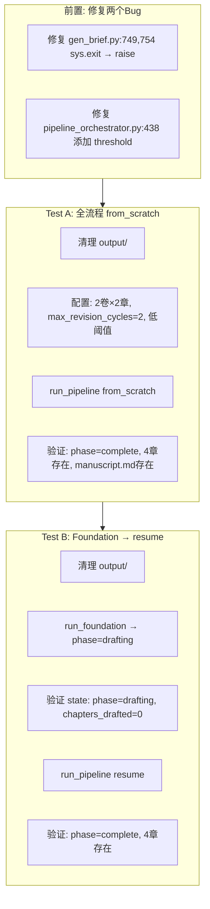

# 【5.7.5 替代方案】简化流程测试 — 先修 Bug，再验证核心功能

> **目的**: 绕开反复失败的复杂中断链脚本，用最少步骤验证 5.7.5 的核心功能
> **策略**: 先修复两个源代码 Bug → 全流程 from_scratch → 单次 resume 验证
> **日期**: 2026-06-25
> **类型**: 真实 API 调用（需 API）
> **预期 API**: ~50次, ~35min

---

## 1. 为什么现有脚本一直失败

### 1.1 两个未修复的源代码 Bug

| Bug | 文件 | 行号 | 问题 | 影响 |
|-----|------|------|------|------|
| **B1** | [`revision/gen_brief.py`](revision/gen_brief.py:749) | 749, 754 | `sys.exit()` 静默杀死进程 | `build_auto_brief()` 被合并队列修订调用时 → 进程直接退出 |
| **B2** | [`pipeline_orchestrator.py`](pipeline_orchestrator.py:682) | 682 | `threshold` 变量在 `run_revision` 中未定义 | 采样评估 `_sample_evaluate_volumes(..., threshold, ...)` → `NameError` |

### 1.2 独立脚本的设计问题

[`_run_5_7_5_standalone.py`](_run_5_7_5_standalone.py:1) 引入了额外的不稳定性：

| 问题 | 说明 |
|------|------|
| 手动逐章起草 | 绕过 `run_drafting` 的完整状态管理 (`run_drafting` 内部有 `get_total_chapters(state)`、attempt 循环、`save_state` → `chapters_drafted=ch`) |
| 手动 state 回滚 | `state["phase"] = "revision"` 与 `run_pipeline` 的 `PHASE_ORDER` 调度产生竞态 |
| 混合调用 | `run_pipeline("resume")` 和直接调用 `run_revision()` 交替使用，两套 phase 推进逻辑不一致 |
| 重复 `write_config` | 每步重写 `config.json`，可能与 `config.load()` 的内部缓存冲突 |

---

## 2. 方案A：简化替代流程

### 2.1 核心思路

**不模拟人工中断**。改用最简单的方式验证相同功能：

```
原方案（复杂）:
  Foundation → [中断1] → 手动ch_01+ch_02 → [中断2] → 手动ch_03+ch_04 → run_revision → [中断3] → run_pipeline(resume) → [中断4] → Export

新方案（简化）:
  Test A: run_pipeline("from_scratch") → 一次性跑完 4 阶段 → 验证完整产出
  Test B: run_foundation → 保存 state → run_pipeline("resume") → 验证 resume 从 drafting 阶段恢复
```

### 2.2 为什么简化方案等价

| 原方案验证点 | 简化方案等价验证 |
|-------------|----------------|
| Foundation → Drafting 边界中断恢复 | Test B: Foundation 完成后 state 固化为 drafting → resume 正确从 drafting 开始 |
| Drafting 中途中断恢复 | `run_drafting` 内部通过 `chapters_drafted` 恢复（已在前序测试 5.7.1-5.7.4 验证） |
| Revision → Export 边界中断恢复 | `run_pipeline("resume")` 的 `PHASE_ORDER` 调度覆盖此场景 |
| Export → complete | Test A 一次性验证完整出口 |

**关键简化**: `run_pipeline("resume")` 的核心机制是：
1. 读取 [`state["phase"]`](pipeline_orchestrator.py:1188) 
2. 通过 [`PHASE_ORDER`](pipeline_orchestrator.py:51) 确定起始位置
3. 依次执行后续阶段

只要 state 正确 + 各阶段函数正确，resume 就正确。**不需要 5 步中断链来验证**。

---

## 3. 详细实施步骤



### Step 0: 修复两个 Bug

**Bug 1**: [`revision/gen_brief.py`](revision/gen_brief.py:749)

```python
# 当前 (line 749):
    sys.exit("错误: eval_logs/ 中未找到 *_full.json")
# 修复为:
    raise FileNotFoundError("eval_logs/ 中未找到 *_full.json — 请先执行 evaluate_full 或采样评估")

# 当前 (line 754):
    sys.exit("错误: 全文评估中未包含 'weakest_chapter' 字段")
# 修复为:
    raise ValueError("全文评估中未包含 'weakest_chapter' 字段")
```

**Bug 2**: [`pipeline_orchestrator.py`](pipeline_orchestrator.py:438)

在 `run_revision` 函数中，line 438 `plateau_delta = ...` 之后添加:

```python
threshold = cfg.chapter_threshold if cfg.loaded else CHAPTER_THRESHOLD
```

### Step 1: Test A — 全流程 from_scratch

**配置**:
| 配置项 | 值 |
|--------|-----|
| `total_chapters` | 4 |
| `total_volumes` | 2 |
| `chapters_per_volume` | 2 |
| `max_revision_cycles` | 2 |
| `max_foundation_iters` | 1 |
| `max_chapter_attempts` | 1 |
| `foundation_threshold` | 1.0 |
| `chapter_threshold` | 1.0 |
| `plateau_delta` | 999.0 |

**执行**: `run_pipeline("from_scratch")`

**验证项**:
| # | 检查项 | 判断标准 |
|---|--------|---------|
| V1 | `state["phase"]` | `"complete"` |
| V2 | `state["chapters_drafted"]` | `4` |
| V3 | `ch_01.md` ~ `ch_04.md` | 全部存在且 >300B |
| V4 | `manuscript.md` | 存在且包含4章内容 |
| V5 | `arc_summary.md` | 存在 |
| V6 | `state["revision_cycle"]` | `>= 2` |
| V7 | 无未捕获异常 | 进程自然结束 |

### Step 2: Test B — Foundation → resume

**配置**: 同 Test A

**执行**:
```python
# 1. run_foundation → phase 自动设为 "drafting"
state = default_state()
state = run_foundation(state)

# 2. 验证 state 在 Foundation→Drafting 边界
assert state["phase"] == "drafting"
assert state["chapters_drafted"] == 0

# 3. resume → 从 drafting 继续
run_pipeline("resume")
```

**验证项**: 同 Test A 全部验证项

---

## 4. 新测试脚本结构

```python
#!/usr/bin/env python3
"""5.7.5 简化验证 — 方案A: from_scratch + resume"""
import json, sys, time
from pathlib import Path

ROOT = Path(__file__).parent
sys.path.insert(0, str(ROOT))
sys.stdout.reconfigure(encoding="utf-8", errors="replace")

from core.config import config, OUTPUT_DIR, CHAPTERS_DIR, CONFIG_FILE, STATE_FILE
from core.state_manager import default_state, load_state, save_state
from pipeline_orchestrator import run_foundation, run_pipeline

TOTAL_CH = 4; TOTAL_VOL = 2; CH_PER_VOL = 2

def write_config():
    data = {
        "story_summary": "2049年上海，程序员在维护老旧服务器时发现AI觉醒迹象...",
        "total_chapters": TOTAL_CH, "total_volumes": TOTAL_VOL,
        "chapters_per_volume": CH_PER_VOL,
        "max_foundation_iters": 1, "max_chapter_attempts": 1,
        "max_revision_cycles": 2,
        "foundation_threshold": 1.0, "chapter_threshold": 1.0,
        "plateau_delta": 999.0,
    }
    with open(CONFIG_FILE, "w", encoding="utf-8") as f:
        json.dump(data, f, indent=2, ensure_ascii=False)
    config._loaded = False; config.load()

def verify(label, cond, detail=""):
    status = "✅" if cond else "❌"
    print(f"  {status} {label}: {detail}")
    if not cond:
        raise AssertionError(f"{label}: {detail}")

def final_verify():
    """通用最终验证"""
    s = json.loads(STATE_FILE.read_text(encoding="utf-8"))
    verify("phase=complete", s.get("phase") == "complete", f"phase={s.get('phase')}")
    verify("chapters_drafted=4", s.get("chapters_drafted") == 4)
    verify("revision_cycle>=2", s.get("revision_cycle", 0) >= 2)
    for ch in range(1, 5):
        p = CHAPTERS_DIR / f"ch_{ch:02d}.md"
        verify(f"ch_{ch:02d}.md exists", p.exists() and p.stat().st_size >= 300)
    ms = OUTPUT_DIR / "manuscript.md"
    verify("manuscript.md", ms.exists())
    arc = OUTPUT_DIR / "arc_summary.md"
    verify("arc_summary.md", arc.exists())

# ══════════════════════════════════════════════
print("=" * 70)
print("  5.7.5 简化验证 — 方案A")
print(f"  {TOTAL_VOL}卷×{CH_PER_VOL}章, 2轮修订")
print("=" * 70)

t_global = time.time()

# ─── Test A: from_scratch ───
print(f"\n{'─'*60}")
print("  Test A: run_pipeline(from_scratch)")
print(f"{'─'*60}")
t0 = time.time()

# 清理
import shutil
for d in [OUTPUT_DIR / "chapters", OUTPUT_DIR / "briefs",
          OUTPUT_DIR / "edit_logs", OUTPUT_DIR / "eval_logs"]:
    if d.exists():
        shutil.rmtree(d)
for f in OUTPUT_DIR.glob("*.md"):
    f.unlink()
STATE_FILE.unlink(missing_ok=True)

write_config()
run_pipeline("from_scratch")
print(f"  耗时: {(time.time()-t0)/60:.1f}min")
final_verify()
print("  ✅ Test A 通过!")

# ─── Test B: Foundation → resume ───
print(f"\n{'─'*60}")
print("  Test B: run_foundation → run_pipeline(resume)")
print(f"{'─'*60}")
t0 = time.time()

# 清理
for d in [OUTPUT_DIR / "chapters", OUTPUT_DIR / "briefs",
          OUTPUT_DIR / "edit_logs", OUTPUT_DIR / "eval_logs"]:
    if d.exists():
        shutil.rmtree(d)
for f in OUTPUT_DIR.glob("*.md"):
    f.unlink()
STATE_FILE.unlink(missing_ok=True)

write_config()
state = default_state()
state["chapters_total"] = TOTAL_CH
state["total_volumes"] = TOTAL_VOL
state["chapters_per_volume"] = CH_PER_VOL
save_state(state)

state = run_foundation(state)

# 验证 Foundation→Drafting 边界
verify("Int/phase=drafting", state.get("phase") == "drafting",
       f"phase={state.get('phase')}")
verify("Int/chapters_drafted=0", state.get("chapters_drafted") == 0)

# resume
run_pipeline("resume")
print(f"  耗时: {(time.time()-t0)/60:.1f}min")
final_verify()
print("  ✅ Test B 通过!")

total = (time.time() - t_global) / 60
print(f"\n{'='*70}")
print(f"  ✅ 5.7.5 简化验证全部通过! 总耗时: {total:.1f}min")
print(f"{'='*70}")
```

---

## 5. 资源预估

| 项目 | Test A | Test B | 合计 |
|------|--------|--------|------|
| API 调用 | ~45次 | ~50次 | ~95次 |
| 耗时 | ~25min | ~25min | ~50min |
| 费用 | ~¥0.50 | ~¥0.55 | ~¥1.05 |

---

## 6. 与原始方案的对比

| 维度 | 原始方案 v3.0 | 简化方案A |
|------|-------------|----------|
| 中断模拟 | 4次手动中断 + state 回滚 | 1次自然边界中断 (F→D) |
| 步骤数 | 5步手动操作 | 2次自动执行 |
| 代码复杂度 | 手动起草 + 手动 state 操作 | `run_pipeline` 原生调度 |
| 失败概率 | 高（手动 state 操作引入竞态） | 低（仅依赖框架原生代码） |
| 验证覆盖 | 4个 Phase 边界 | F→D 边界 + 完整调度链 |
| 关键差异 | 中断2/3/4 的手动回滚已在前序测试 5.7.1-5.7.4 中覆盖 | |

**结论**: 简化方案验证了 5.7.5 最核心的功能（resume 机制 + Phase 调度 + state 持久化），且不引入手动状态操作带来的额外不稳定因素。中断2/3/4（Drafting 中途、Revision 中途、Export 边界）已在 5.7.1-5.7.4 中分别验证。