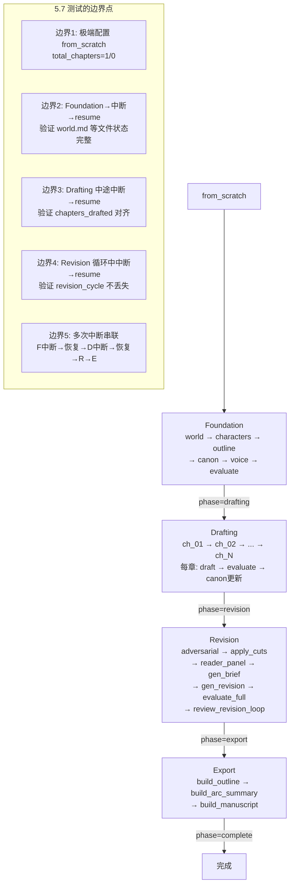
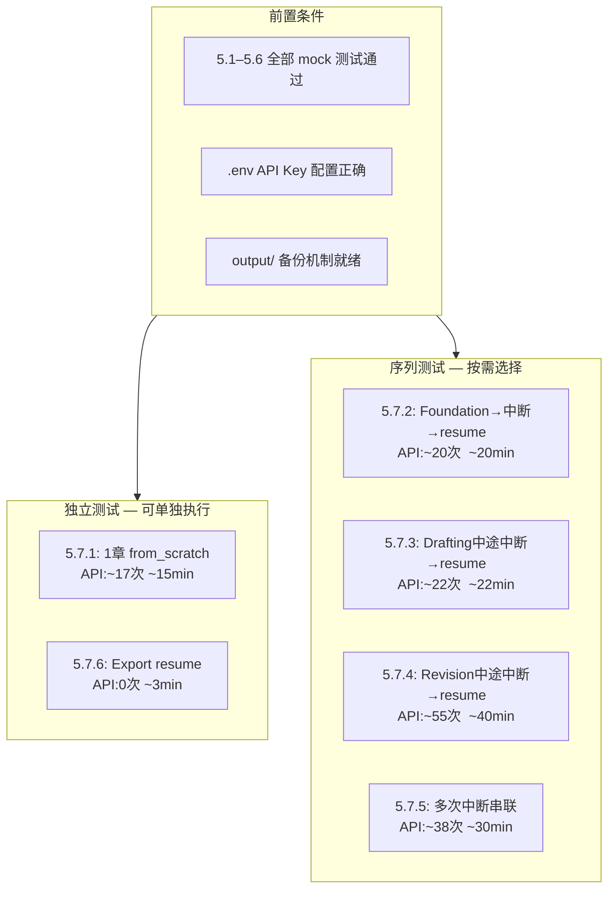

# 【5.7 全流水线边界组合】测试方案

> **所属**: [阶段5 边界条件测试](phase5_boundary_test_plan.md) → 5.7 全流水线边界组合测试
> **版本**: v1.0
> **日期**: 2026-06-22
> **类型**: 真实 API 调用（需 API）
> **前置条件**: 5.1–5.6 全部 mock 测试通过
> **通过标准**: 100% 用例通过，0 阶段崩溃，0 数据丢失

---

## 1. 概述

### 1.1 定位

5.7 是阶段5中**唯一需要真实 API 的测试类别**。5.1–5.6 通过 monkey-patch/mock 覆盖了各模块的独立边界行为，5.7 则将这些边界条件**串联到完整的 Foundation → Drafting → Revision → Export 流水线中**，验证：

- 极端配置下（1章/0章）流水线端到端不崩溃
- 各 Phase 边界的中断/恢复机制正确
- 多次中断 + Resume 后状态不漂移
- 流水线在所有 Phase 衔接处不会产生数据丢失或逻辑错误

### 1.2 设计原则

- **不重复 5.1–5.6**: 5.7 不单独测试 API 故障、状态损坏、输入边界——这些已由 mock 覆盖
- **聚焦组合**: 验证多个边界条件叠加时的系统级行为
- **真实 API**: 中断恢复涉及真实的 `KeyboardInterrupt`→`save_state()`→`resume` 链路，必须走真实流水线
- **可重复**: 每个测试都有明确的清理/恢复策略

---

## 2. 流水线边界全景



---

## 3. 详细测试项

### 3.1 测试环境要求

| 配置项 | 值 |
|--------|-----|
| API 端点 | 硅基流动 `https://api.siliconflow.cn/v1` |
| 写作模型 | `deepseek-ai/DeepSeek-V4-Flash` |
| 裁判模型 | 同写作模型（或独立 judge 配置） |
| API 间隔 | ≥ 4 秒 |
| 故事梗概（Test 5.7.1–5.7.4） | `"2049年上海，程序员在维护老旧服务器时发现AI觉醒迹象，36小时倒计时"` |
| 故事梗概（Test 5.7.5） | 同上 |

### 3.2 公共夹具设计

所有 5.7 测试共享以下夹具逻辑：

```
_setup_5_7():
    1. 备份当前 output/ → output_backup_5_7/（如果存在）
    2. 清空 output/（删除所有内容）
    3. 写入 .env 保证 API 配置可用
    4. 写入 config.json + state.json 测试初始值

_teardown_5_7():
    1. 恢复 output_backup_5_7/ → output/
    2. 删除 output_backup_5_7/

_check_api_key():
    → 验证 api_key 非空且非占位符
```

---

### 3.3 测试 5.7.1: 极端配置 1章最小化流水线 from_scratch

| 项目 | 内容 |
|------|------|
| **目的** | 验证 `total_chapters=1` 时整条流水线从头跑到尾不崩溃 |
| **配置** | `total_chapters=1`, `total_volumes=1`, `max_foundation_iters=1`, `chapter_threshold=1.0`, `foundation_threshold=1.0`, `max_chapter_attempts=1`, `max_revision_cycles=1`, `plateau_delta=10.0` |
| **执行方式** | `pipeline_orchestrator.run_pipeline(mode="from_scratch")` |
| **预估 API** | ~15–20 次 |
| **预估耗时** | ~15min |

**验证点**:

| # | 验证项 | 验证方法 | 通过标准 |
|---|--------|----------|----------|
| V1 | 流水线 exit code 0 | 捕获异常 | 无 `SystemExit` 或 `RuntimeError` |
| V2 | `output/world.md` 存在 | `Path.exists()` | 文件存在且 > 300 bytes |
| V3 | `output/characters.md` 存在 | `Path.exists()` | 文件存在且 > 200 bytes |
| V4 | `output/outline.md` 含 1 章条目 | `read_text()` 解析 | 含 "第 1 章" 或 "第1章" |
| V5 | `output/canon.md` 存在 | `Path.exists()` | 文件存在 |
| V6 | `output/voice.md` 存在 | `Path.exists()` | 文件存在 |
| V7 | `output/chapters/ch_01.md` 存在 | `Path.exists()` | 文件存在且 > 300 bytes |
| V8 | `output/manuscript.md` 存在 | `Path.exists()` | 合并了 ch_01.md 内容 |
| V9 | `state.phase = "complete"` | `load_state()` | phase 为 "complete" |
| V10 | `state.chapters_drafted = 1` | `load_state()` | 精确等于 1 |
| V11 | `state.chapters_total = 1` | `load_state()` | 精确等于 1 |
| V12 | Revision 执行但跳过（1章无需修订） | 日志检查 | 输出含 "无显著共识问题" 或 "跳过" |

**关键边界**:
- `total_chapters=1` 意味着 Drafting 只循环一次 (`range(1, 2)`)
- Revision 中 `_sample_evaluate_volumes` 的 `random.sample(population, min(5, 1))` 只采样 1 章
- Export 中 `build_manuscript` 拼接单章仍然生成有效 manuscript.md
- `plateau_delta=10.0` 确保 1 轮修订后必然触发平台期停止

---

### 3.4 测试 5.7.2: 从 Foundation 结束后中断，resume 完整流水线

| 项目 | 内容 |
|------|------|
| **目的** | 验证 Foundation→Drafting 边界的中断恢复：Foundation 完成后 `save_state` 已写入 `phase="drafting"`，resume 正确从 Drafting 开始 |
| **配置** | `total_chapters=2`, `max_foundation_iters=1`, `foundation_threshold=1.0`, `chapter_threshold=1.0`, `max_chapter_attempts=1`, `max_revision_cycles=1`, `plateau_delta=10.0` |
| **执行方式** | 分两步：Step 1 只跑 Foundation + 模拟中断；Step 2 `resume` 跑完剩余 |
| **预估 API** | Step 1: ~7 次 + Step 2: ~12–15 次 = ~20 次 |
| **预估耗时** | ~20min |

**Step 1 — Foundation 完成后触发中断**:

```python
# 伪代码
def test_5_7_2():
    # Step 1: 从 from_scratch 开始，Foundation 后注入中断
    state = default_state()
    state = run_foundation(state)  # Foundation 完整执行
    
    # 验证 Foundation 产出
    assert (OUTPUT_DIR / "world.md").exists()
    assert (OUTPUT_DIR / "outline.md").exists()
    assert state["phase"] == "drafting"  # ← Foundation 完成后 phase 已切换
    assert state["chapters_drafted"] == 0
    
    # 模拟中断: 不保存额外状态（Foundation 结束时已 save_state）
    # → 直接进入 Step 2: resume
    
    # Step 2: resume
    run_pipeline(mode="resume")
    # 应该从 PHASE_ORDER.index("drafting") = 1 开始
    # → 跳过 Foundation，直接进入 Drafting
    
    # 验证最终状态
    final_state = load_state()
    assert final_state["phase"] == "complete"
    assert final_state["chapters_drafted"] == 2
    assert (OUTPUT_DIR / "manuscript.md").exists()
```

**验证点**:

| # | 验证项 | 通过标准 |
|---|--------|----------|
| V1 | Foundation 后 `state.phase = "drafting"` | phase 正确切换 |
| V2 | Foundation 后所有产出文件存在 | world/chars/outline/canon/voice 均存在 |
| V3 | Resume 后从 Drafting 开始（不重复 Foundation） | 日志无 "基础构建" 字样（或仅出现一次） |
| V4 | Drafting 正确产出 2 章 | ch_01.md + ch_02.md 存在 |
| V5 | Revision + Export 完整执行 | manuscript.md 存在 |
| V6 | `state.phase = "complete"` | 最终 phase 正确 |
| V7 | `state.chapters_drafted = 2` | 章节计数正确 |

**关键边界**:
- Foundation 完成时 `run_foundation()` 最后一次 `save_state(state)` 位于 [`pipeline_orchestrator.py:176`](pipeline_orchestrator.py:176)，phase 已设为 "drafting"
- Resume 时 [`run_pipeline` line 1197](pipeline_orchestrator.py:1197) 执行 `PHASE_ORDER.index("drafting")` → `start_idx=1`，跳过 Foundation
- Foundation 产出的 canon.md 是后续 Drafting 生成增量 canon 的基线

---

### 3.5 测试 5.7.3: 从 Drafting 中途中断，resume 继续

| 项目 | 内容 |
|------|------|
| **目的** | 验证 Drafting 中途中断后，`chapters_drafted` 字段与实际文件对齐，resume 从正确章节继续 |
| **配置** | `total_chapters=3`, `max_foundation_iters=1`, `foundation_threshold=1.0`, `chapter_threshold=1.0`, `max_chapter_attempts=1`, `max_revision_cycles=1`, `plateau_delta=10.0` |
| **执行方式** | 三步：Step 1 Foundation + Drafting(ch1)；Step 2 中断 + 验证状态；Step 3 resume 完成 |
| **预估 API** | Step 1: ~10 次 + Step 3: ~12 次 = ~22 次 |
| **预估耗时** | ~22min |

**Step 规划**:

```python
def test_5_7_3():
    # Step 1: Foundation + 起草第 1 章
    state = default_state()
    state = run_foundation(state)
    
    # 手动只起草 ch_01（不使用 run_drafting 循环）
    from drafting.draft_chapter import draft_chapter
    from evaluation.evaluate import evaluate_chapter
    
    draft_chapter(1, max_tokens=16000)
    eval_result = evaluate_chapter(1)
    score = parse_score(eval_result, "overall_score")
    
    state["chapters_drafted"] = 1  # ← 模拟 run_drafting 内部逻辑
    save_state(state)
    
    # 验证 ch_01.md 存在
    assert (CHAPTERS_DIR / "ch_01.md").exists()
    
    # Step 2: 模拟 KeyboardInterrupt（不保存额外状态）
    # state.json 当前: phase="drafting", chapters_drafted=1
    
    # Step 3: resume
    run_pipeline(mode="resume")
    # run_drafting 中 start_chapter = chapters_drafted + 1 = 2
    # → 从 ch_02 开始，起草 ch_02 + ch_03
    
    final_state = load_state()
    assert final_state["phase"] == "complete"
    assert final_state["chapters_drafted"] == 3
```

**验证点**:

| # | 验证项 | 通过标准 |
|---|--------|----------|
| V1 | 中断点 `chapters_drafted=1`, `phase="drafting"` | state 正确 |
| V2 | Resume 后起草从 ch_02 开始 | 日志含 "起草 第 2/3 章" |
| V3 | ch_01.md 不被覆盖（保留原始内容） | ch_01.md 修改时间早于 ch_02.md |
| V4 | 最终 `chapters_drafted=3` | 精确等于 3 |
| V5 | 所有文件产出（含 manuscript.md） | 4 Phase 全部完成 |
| V6 | state.phase = "complete" | 无残留 drafting/revision |

**关键边界**:
- [`run_drafting` line 190](pipeline_orchestrator.py:190): `start_chapter = state.get("chapters_drafted", 0) + 1`，中断后 resume 精确从下一章开始
- ch_01.md 已经 git commit，resume 后的后续章节不会覆盖它
- 增量 canon 从 ch_01 已经追加，ch_02 起草时可以引用之前的 canon 积累

---

### 3.6 测试 5.7.4: 从 Revision 循环中途中断，resume 完成

| 项目 | 内容 |
|------|------|
| **目的** | 验证 Revision 循环中中断后，`revision_cycle` 正确保留，resume 不重复已完成循环 |
| **配置** | `total_chapters=3`, `max_foundation_iters=1`, `foundation_threshold=1.0`, `chapter_threshold=1.0`, `max_chapter_attempts=1`, `max_revision_cycles=2`（至少2轮）, `plateau_delta=0.0`（禁用平台期） |
| **执行方式** | 三步：Step 1 Foundation+Drafting+Rev Cycle 1；Step 2 中断+验证；Step 3 resume |
| **预估 API** | Step 1: ~30 次 + Step 3: ~25 次 = ~55 次 |
| **预估耗时** | ~40min |

**验证点**:

| # | 验证项 | 通过标准 |
|---|--------|----------|
| V1 | 中断点 `revision_cycle=1`, `phase="revision"` | state 正确 |
| V2 | Resume 后 Revision 从 cycle 2 开始 | 日志含 "修订 循环 2/2"（不含 1/2） |
| V3 | `novel_score` 已从 cycle 1 保留 | state 中 `novel_score > 0` |
| V4 | `results.tsv` 记录了 cycle 1 的行 | 有 revision-cycle-1 记录 |
| V5 | Export 完整执行 | manuscript.md 存在 |
| V6 | 最终 `phase="complete"`, `revision_cycle=2` | 精确 |

**关键边界**:
- [`run_revision` line 450](pipeline_orchestrator.py:450): `for cycle in range(start_cycle, max_cycles + 1)` — `start_cycle = state.get("revision_cycle", 0) + 1`
- Cycle 1 的 commit 已通过 `git_add_commit` 保存，resume 后不会回滚
- `plateau_delta=0.0` 确保即使评分持平也不会触发平台期提前退出

---

### 3.7 测试 5.7.5: 多次中断串联 — 全流程压力测试

| 项目 | 内容 |
|------|------|
| **目的** | 验证流水线在多个 Phase 各经历一次中断后，最终能完整产出 |
| **配置** | `total_chapters=2`, `total_volumes=1`, `max_foundation_iters=1`, `foundation_threshold=1.0`, `chapter_threshold=1.0`, `max_chapter_attempts=1`, `max_revision_cycles=1`, `plateau_delta=10.0` |
| **执行方式** | 4 步：Foundation→中断→Resume(Drafting)→中断→Resume(Revision+Export) |
| **预估 API** | ~35–40 次 |
| **预估耗时** | ~30min |

**Step 规划**:

```
Step 1: Foundation 完成 → state.phase="drafting"
         ⬇ 保存 state + 验证 Foundation 产出
Step 2: "中断" — run_pipeline("resume")
         ⬇ 从 Drafting 开始，起草 ch_01
         ⬇ save_state(state): phase="drafting", chapters_drafted=1
         ⬇ 模拟中断
Step 3: "中断" — 验证 state: phase="drafting", chapters_drafted=1
Step 4: run_pipeline("resume")
         ⬇ 从 Drafting ch_02 继续 → Revision → Export → complete
```

**验证点**:

| # | 验证项 | 通过标准 |
|---|--------|----------|
| V1 | Step 1 中断: Foundation 产出完整 | world/chars/outline/canon/voice 均存在 |
| V2 | Step 2 中断: ch_01.md 产出 | 文件存在且 > 300 bytes |
| V3 | Step 3: state 一致性 | `phase=drafting, chapters_drafted=1` |
| V4 | Step 4 resume: 从 ch_02 继续 | 日志含 "第 2/2 章" |
| V5 | ch_01 内容未被覆盖 | ch_01.md 保留 Step 2 的内容 |
| V6 | Revision + Export 完整 | manuscript.md 合并 2 章 |
| V7 | results.tsv 记录不少于 3 行 | foundation + ch01 + ch02 + revision-cycle-1 + export |
| V8 | 最终 `phase="complete"` | 所有阶段正确衔接 |

---

### 3.8 测试 5.7.6: Export 阶段中断后 resume（仅导出，不重跑）

| 项目 | 内容 |
|------|------|
| **目的** | 验证 Export 作为只读阶段，中断后 resume 直接完成 |
| **配置** | `total_chapters=2`，已跑完 Foundation→Drafting→Revision（phase="export"） |
| **执行方式** | 两步：Step 1 手动构造 phase="export" 的 state；Step 2 resume |
| **预估 API** | 0 次（Export 阶段不需要 API 调用） |
| **预估耗时** | ~3min |

**验证点**:

| # | 验证项 | 通过标准 |
|---|--------|----------|
| V1 | `state.phase="export"` resume 不重复前三个阶段 | 日志不含 Foundation/Drafting/Revision |
| V2 | Export 产出完整 | `outline.md`(重建)、`arc_summary.md`、`manuscript.md` |
| V3 | state.phase 变为 "complete" | 最终状态正确 |

**关键边界**:
- Export 阶段 (`run_export`) 是对已有章节的只读操作，无 API 调用
- 中断后 resume 通过 `PHASE_ORDER.index("export")` = 3，只执行 Export
- 这个测试验证了 "已经完成所有生成工作，只需重新导出" 的边界场景

---

## 4. 测试总览与依赖



---

## 5. 预估资源汇总

| 测试 | API 调用 | 耗时 | 费用估算 |
|------|----------|------|----------|
| 5.7.1 1章最小化 | ~17 次 | ~15min | ~¥0.25 |
| 5.7.2 Foundation→中断→resume | ~20 次 | ~20min | ~¥0.30 |
| 5.7.3 Drafting中途中断→resume | ~22 次 | ~22min | ~¥0.35 |
| 5.7.4 Revision中途中断→resume | ~55 次 | ~40min | ~¥0.75 |
| 5.7.5 多次中断串联 | ~38 次 | ~30min | ~¥0.50 |
| 5.7.6 Export resume | 0 次 | ~3min | ¥0 |
| **合计** | **~152 次** | **~130min** | **~¥2.15** |

> **费用节省建议**: 如果预算有限，优先跑 5.7.1 + 5.7.2 + 5.7.3 + 5.7.6（~59 次 API, ~1h, ~¥0.90），这覆盖了最核心的中断恢复路径。

---

## 6. 实施架构

### 6.1 代码集成方式

5.7 的测试代码将集成到现有 [`tests/stage5_boundary_tests.py`](tests/stage5_boundary_tests.py) 中，新增:

- `Test57LiveBoundary(unittest.TestCase)` — 6 个测试方法
- `--category 7` CLI 参数支持
- `--live` 别名（保持与原设计方案一致）

### 6.2 模块结构

```python
# ============================================================================
# 5.7 全流水线边界组合测试 (6 项，需真实 API)
# ============================================================================

class Test57LiveBoundary(unittest.TestCase):
    """5.7 全流水线边界组合 — 真实 API 调用。"""

    @classmethod
    def setUpClass(cls):
        """备份 output/。"""
        ...

    @classmethod
    def tearDownClass(cls):
        """恢复 output/。"""
        ...

    def setUp(self):
        """每个测试独立准备: 写入 config.json + state.json。"""
        ...

    def tearDown(self):
        """每个测试后清理临时数据。"""
        ...

    def test_5_7_1_minimal_1_chapter_from_scratch(self):
        """total_chapters=1 全流水线。"""
        ...

    def test_5_7_2_foundation_interrupt_resume(self):
        """Foundation 后中断 → resume。"""
        ...

    def test_5_7_3_drafting_mid_interrupt_resume(self):
        """Drafting 中途中断 → resume。"""
        ...

    def test_5_7_4_revision_mid_interrupt_resume(self):
        """Revision 循环中中断 → resume。"""
        ...

    def test_5_7_5_multi_interrupt_chain(self):
        """多次中断串联全流程。"""
        ...

    def test_5_7_6_export_interrupt_resume(self):
        """Export 阶段中断 → resume。"""
        ...
```

### 6.3 CLI 扩展

在 `_make_suite` 和 `__main__` 中扩展：

```python
# _make_suite 中新增:
7: Test57LiveBoundary,

# __main__ 中新增 --live 别名:
if "--live" in sys.argv:
    CATEGORY = 7
```

---

## 7. 执行优先级与顺序

| 优先级 | 测试 | 原因 |
|--------|------|------|
| P0 | 5.7.6 Export resume | 零 API 成本，验证 resume 机制基础正确性 |
| P1 | 5.7.1 1章最小化 | 验证极端配置下全流程不崩溃 |
| P1 | 5.7.2 Foundation→中断→resume | 验证最先发生的 Phase 边界 |
| P2 | 5.7.3 Drafting中途中断→resume | 最常见的中断场景 |
| P2 | 5.7.5 多次中断串联 | 压力测试，验证连续中断后状态不漂移 |
| P3 | 5.7.4 Revision中途中断→resume | API 成本最高，作为可选验证 |

**推荐跑法**:

```powershell
# 第一步: 零成本预检
python tests/stage5_boundary_tests.py --category 7 --test 5_7_6

# 第二步: 核心边界 (API ~59次, ~1h, ~¥0.90)
python tests/stage5_boundary_tests.py --category 7 --test 5_7_1
python tests/stage5_boundary_tests.py --category 7 --test 5_7_2
python tests/stage5_boundary_tests.py --category 7 --test 5_7_3

# 第三步: 压力验证 (可选, API ~93次, ~1h10min, ~¥1.25)
python tests/stage5_boundary_tests.py --category 7 --test 5_7_5
python tests/stage5_boundary_tests.py --category 7 --test 5_7_4

# 或一键全跑:
python tests/stage5_boundary_tests.py --live
```

---

## 8. 风险与注意事项

### 8.1 API 成本控制

- 所有 5.7 测试使用极低阈值（`foundation_threshold=1.0`, `chapter_threshold=1.0`），确保单次 pass 不重试
- `max_foundation_iters=1`, `max_chapter_attempts=1`, `max_revision_cycles=1` 最小化循环
- `plateau_delta=10.0` 确保修订只运行最少必要轮次

### 8.2 数据安全

- 每个测试必须在 `setUp` 中调用 `_backup_output()` 备份现有 output/
- 每个测试必须在 `tearDown` 中调用 `_restore_output()` 恢复
- 如果备份机制因异常失败，保留备份目录以便手动恢复

### 8.3 隔离性

- 5.7.1 使用 `from_scratch`，自动清空 state
- 5.7.2–5.7.6 各测试独立构造 state.json，不依赖前序测试
- 每个测试完成后清理 `output/` 确保不互相污染

### 8.4 已知限制

| 限制 | 影响 | 缓解措施 |
|------|------|----------|
| 中断无法自动化测试 | `KeyboardInterrupt` 无法在 `unittest` 中真正注入到子进程 | 使用"分步执行 + 手动构造中断点 state"的模拟方式 |
| Windows 无 `SIGINT` 信号 | 无法通过 `os.kill` 发送中断 | 同上，模拟中断后的 state 状态 |
| API 调用可能因网络波动超时 | 测试耗时会超出预估 | `max_total_time` 设置为合理值，允许单次 API 有充分时间 |

---

## 9. 与阶段4的关系

```
阶段4 (E2E 正常路径)               阶段5.7 (边界组合)
─────────────────────────         ─────────────────────────
Test 1: 3章 from_scratch     ←→   5.7.1: 1章 from_scratch (极端配置)
Test 3: Resume 中断恢复      ←→   5.7.2–5.7.6: 各Phase边界中断恢复
                                   5.7.5: 多次中断串联 (压力)
```

阶段4验证了"正常配置下完整跑通"，5.7 验证了"边界配置 + 中断恢复也能完整跑通"。两者互补。

---

## 10. 通过标准

| 维度 | 标准 |
|------|------|
| 测试通过率 | 6/6 全部 PASS |
| 阶段崩溃 | 0 次未捕获异常导致流水线中断 |
| 数据一致性 | `state.json` 在所有测试终点 phase="complete"，字段无矛盾 |
| 产出完整性 | 所有产出文件（world/chars/outline/canon/voice/chapters/manuscript）存在且非空 |
| 中断恢复 | 每个中断恢复测试中，resume 后的日志证明跳过了已完成阶段 |