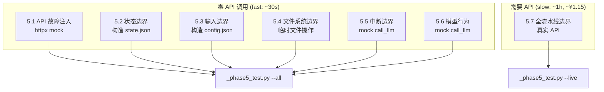

# 阶段5：边界条件测试 — 设计文档

## 概述

阶段4 覆盖了完整流水线的端到端验证。阶段5 聚焦于**边界条件和异常场景**——验证系统在极端输入、组件故障、状态损坏等情况下不会崩溃，并有合理的降级/报错行为。

**核心策略**：阶段5 的绝大部分测试使用 **monkey-patch / mock** 实现，**零 API 调用**，快速且安全。

---

## 测试分类总览

```
┌──────────────────────────────────────────────────────────────────┐
│                    阶段5 边界条件测试                               │
├──────────────┬──────────────┬──────────────┬──────────────────────┤
│ 5.1 API 故障 │ 5.2 状态边界 │ 5.3 输入边界 │ 5.4 文件系统边界       │
│ 注入 (~15项) │ (~10项)      │ (~8项)       │ (~8项)               │
├──────────────┴──────────────┼──────────────┴──────────────────────┤
│                             │                                       │
├─────────────────────────────┼──────────────────────────────────────┤
│ 5.5 并发/中断边界 (~6项)    │ 5.6 模型行为边界 (~8项)               │
├─────────────────────────────┴──────────────────────────────────────┤
│ 5.7 全流水线边界组合 (~3项，需 API，可选)                            │
└──────────────────────────────────────────────────────────────────┘
```

---

## 5.1 API 故障注入测试

### 测试策略

阶段5 通过两种机制注入故障：

1. **Monkey-patch `httpx.post`** — 模拟 HTTP 层面故障（超时、状态码、畸形响应），不真正发网络请求
2. **Monkey-patch `call_llm`** — 在更上层模拟调用结果，验证调用方（pipeline / foundation / drafting / revision）的降级行为

### 夹具设计：`APIFaultInjector`

```python
class APIFaultInjector:
    """上下文管理器，临时替换 httpx.post 为故障模拟。"""

    def __init__(self, faults: list):
        """
        faults: [(condition_callable, response_callable), ...]
        每个 fault: (何时触发, 返回什么)
        - condition: callable(attempt_number, url, headers, json_payload) -> bool
        - response: callable() -> httpx.Response (fake)
        """
        self._faults = faults
        self._original_post = None
        self._call_count = 0

    def __enter__(self):
        import httpx
        self._original_post = httpx.post
        injector = self

        def _fake_post(url, headers=None, json=None, timeout=None, **kwargs):
            injector._call_count += 1
            for condition, response_fn in injector._faults:
                if condition(injector._call_count, url, headers, json):
                    return response_fn()
            # 未匹配任何故障 → 正常调用真实 API
            return injector._original_post(url, headers=headers, json=json,
                                           timeout=timeout, **kwargs)

        httpx.post = _fake_post
        return self

    def __exit__(self, *args):
        import httpx
        httpx.post = self._original_post
```

### 测试项

| # | 测试项 | 故障类型 | 注入方式 | 验证点 |
|---|--------|----------|----------|--------|
| 5.1.1 | HTTP 500 后重试成功 | 第1次500，第2次200 | `httpx.post` mock | 重试机制工作，最终成功 |
| 5.1.2 | HTTP 429 后重试成功 | 第1次429，重试后200 | `httpx.post` mock | 429 等待逻辑正确，`wait_extra = 10*attempt` |
| 5.1.3 | HTTP 400 (system role 不支持) 自动降级 | 400 + "system" + "not supported" | `httpx.post` mock | system prompt 合并到 user message，重试成功 |
| 5.1.4 | HTTP 500 全部重试耗尽 | 3次全部500 | `httpx.post` mock | 最终抛出 RuntimeError，不含死循环 |
| 5.1.5 | `max_total_time` 超时 | 速率限制延迟导致累计超时 | `RateLimiter.wait` mock (sleep 超长) | `max_total_time` 守卫生效，抛 RuntimeError |
| 5.1.6 | 畸形 JSON（`choices` 键缺失） | 200但响应不含 `choices` | `httpx.post` mock | 检测到异常，重试而不是崩溃 |
| 5.1.7 | 畸形 JSON（`choices[0]["message"]` 缺失） | 200但 `message` 键缺失 | `httpx.post` mock | 同上 |
| 5.1.8 | 畸形 JSON（非 JSON 纯文本） | 200但 `resp.json()` 抛异常 | `httpx.post` mock | `json.JSONDecodeError` 被捕获，重试 |
| 5.1.9 | `httpx.TimeoutException` | 超时异常 | `httpx.post` mock | 捕获异常，正确重试 |
| 5.1.10 | `httpx.RequestError` (网络断开) | 连接拒绝 | `httpx.post` mock | 捕获异常，`sleep(5*attempt)` 后重试 |
| 5.1.11 | API Key 缺失时 clear error | `config.api_key = ""` | 直接修改 config | 抛 RuntimeError 含 "API Key 未配置" |
| 5.1.12 | RateLimiter 首次调用无延迟 | `_last_call_time = 0` | 单元测试 RateLimiter | `wait()` 返回 0.0 |
| 5.1.13 | RateLimiter 连续调用间隔正确 | 快速连续 3 次 wait | 单元测试 RateLimiter | 每次间隔 >= min_interval |
| 5.1.14 | `call_writer` 和 `call_judge` 透传参数 | 正常调用 | mock `call_llm` | writer: t=0.8, judge: t=0.3, max_tokens=4096 |
| 5.1.15 | system role 黑名单缓存跨调用保持 | 首次400降级 → 后续直接合并 | `httpx.post` mock | `_SYSTEM_ROLE_FAILED_FOR_ENDPOINT` 持久化 |

### 不涉及 API 的测试

| # | 项 | 说明 |
|---|-----|------|
| 5.1.12-5.1.13 | RateLimiter 单元测试 | 纯函数测试，零依赖 |
| 5.1.14 | call_writer/call_judge 参数 | mock call_llm 即可 |

---

## 5.2 状态边界条件测试

### 测试策略

直接构造各种异常 `state.json` 内容，调用 `load_state()`、`save_state()`、以及 `run_pipeline("resume")` 等读状态的函数，验证不崩溃且给出合理默认值。

### 测试项

| # | 测试项 | 输入 | 预期行为 |
|---|--------|------|----------|
| 5.2.1 | state.json 不存在 | 删除 state.json | `load_state()` 返回 `default_state()` |
| 5.2.2 | state.json 内容为空 | `{}` | `load_state()` 返回的 dict 可用，所有 `.get()` 有默认值 |
| 5.2.3 | state.json 是无效 JSON | `{corrupted` | `load_state()` 不崩溃（`json.JSONDecodeError` 被处理或默认） |
| 5.2.4 | state.phase = "unknown_phase" | phase 不在 PHASE_ORDER | `run_pipeline` 中 `start_idx = 0`（从 foundation 开始） |
| 5.2.5 | state.chapters_drafted = 0, phase = "complete" | 矛盾状态 | `run_pipeline("resume")` 输出 "已完成" 且退出 |
| 5.2.6 | state.chapters_drafted = 5, chapters_total = 3 | drafted > total | `run_drafting` 的 `start_chapter` 不越界 |
| 5.2.7 | state.revision_cycle = 99 | 超大值 | `run_revision` 中 `start_cycle = 100 > max_cycles`，直接跳过 |
| 5.2.8 | state.novel_score = -1.0 | 负分 | `run_revision` 平台期检测不崩溃 |
| 5.2.9 | state.foundation_score = 0, iteration = 0 | 初始状态 | `run_foundation` 从 iteration 1 开始 |
| 5.2.10 | `save_state` 到不存在的目录 | `OUTPUT_DIR` 不存在 | `mkdir(parents=True)` 创建目录 |

---

## 5.3 输入边界条件测试

### 测试策略

直接修改 `config.json` 的内容，然后调用 `config.load()` + 各 pipeline 阶段的入口函数（通过 monkey-patch `call_llm` 跳过真实 API），验证配置验证逻辑。

### 测试项

| # | 测试项 | 输入 | 预期行为 |
|---|--------|------|----------|
| 5.3.1 | 空梗概 | `story_summary = ""` | `run_pipeline("from_scratch")` 报错 "未配置" → exit 1 |
| 5.3.2 | 极短梗概 | `story_summary = "科幻"` (2字) | 不报错，正常进入 foundation |
| 5.3.3 | 极长梗概 | `story_summary` 10000字 | 不截断，正常传递 |
| 5.3.4 | 特殊字符梗概 | 含 emoji/Unicode/`<>&"'` | JSON 正确序列化/反序列化，不注入 |
| 5.3.5 | `total_chapters = 1` | 1章 | `run_drafting` 正常只生成1章 |
| 5.3.6 | `total_chapters = 0` | 0章 | `run_drafting` 中 `range(1, 1)` 空循环，直接到 revision |
| 5.3.7 | `total_chapters = -5` | 负数 | `get_total_chapters` 返回保底默认 24 |
| 5.3.8 | `api_interval_seconds = 0` | 无间隔 | RateLimiter 正常（wait_time=0），但日志提示 |

### 注意事项

- 5.3.2-5.3.4 需要验证 prompt 传递链路完整（config → API payload）
- 5.3.5-5.3.7 测试 draft + revision 阶段对极端章节数的处理

---

## 5.4 文件系统边界条件测试

### 测试策略

通过临时修改文件权限、删除文件、构造空目录等方式，验证各模块的文件 I/O 错误处理。

### 测试项

| # | 测试项 | 操作 | 预期行为 |
|---|--------|------|----------|
| 5.4.1 | `output/` 目录只读 | `os.chmod(output, 0o444)` (Windows 用 `attrib +R`) | `save_state` / `save_config` 抛 `PermissionError` → 被上层捕获 |
| 5.4.2 | `chapters/` 目录缺失 | 删除 chapters/ | `count_chapter_files()` 返回 0，`count_words_in_chapters()` 返回 0 |
| 5.4.3 | 单个 chapter 文件被外部删除 | 删 `ch_03.md`（共5章） | `build_manuscript` 跳过缺失文件不崩溃 |
| 5.4.4 | config.json 缺失 | 删除 config.json | `config.load()` 返回空 dict，属性返回默认值 |
| 5.4.5 | config.json 无效 JSON | 写入 `{bad` | `config.load()` 抛出 → 调用方捕获 |
| 5.4.6 | 模板文件缺失 | 删除 `templates/world.md` | Foundation 调用 `call_llm` 的 prompt 来自 Python prompt 模块（非 .md 文件），应不受影响 |
| 5.4.7 | `backups/` 目录损坏 | backups/ 下有非目录文件 | `restore_latest()` 过滤 `isdir()` 正确 |
| 5.4.8 | manuscript.md 生成时文件被占用 | (Windows 模拟, 需特殊处理) | `build_manuscript` 捕获 `PermissionError` |

---

## 5.5 并发 / 中断边界条件测试

### 测试策略

模拟中断场景，验证 state.json 一致性和恢复能力。不需要真正运行流水线，通过构造中间 state 并调用各阶段函数（mock API）来验证。

### 测试项

| # | 测试项 | 操作 | 预期行为 |
|---|--------|------|----------|
| 5.5.1 | `run_pipeline` 的 KeyboardInterrupt 处理 | 在 mock call_llm 中注入 `KeyboardInterrupt` | `save_state` 被执行，exit 130 |
| 5.5.2 | 中断后 phase 仍为当前阶段 | 在 drafting 中模拟中断 | state.phase="drafting", chapters_drafted 为已完成的 |
| 5.5.3 | 中断后 chapters_drafted 与实际文件对齐 | 模拟 ch_01, ch_02 文件存在但 drafted=1 | resume 后从 ch_02 开始（不是 ch_01） |
| 5.5.4 | state.json 手动篡改后 resume | phase="drafting", chapters_drafted=10, 实际只有2章 | `run_drafting` 从第 11 章开始，发现文件缺失，重试 |
| 5.5.5 | state.json 在 run_pipeline 运行时被外部修改 | 另一个线程修改 state.json | 不测试（极端场景，由 OS 处理） |
| 5.5.6 | 两个 `pipeline_orchestrator` 实例同时运行 | 通过 PID 锁检测 | 如果没有锁机制，记录此风险 |

---

## 5.6 模型行为边界条件测试

### 测试策略

Monkey-patch `call_llm` 返回预制的 LLM 响应文本，模拟各种异常输出。验证下游解析函数（`parse_score`、`parse_lore_score`、评分判断、草拟流程等）的健壮性。

### 测试项

| # | 测试项 | mock 返回内容 | 验证点 |
|---|--------|--------------|--------|
| 5.6.1 | score 始终 < 阈值（drafting） | eval 返回 `overall_score: 3.0` | 重试 5 次后 fallback（"保留最后结果继续"） |
| 5.6.2 | foundation score 始终 < 阈值 | eval 返回 `overall_score: 4.0` | 最多 `MAX_FOUNDATION_ITERS` 次后停止，出警告 |
| 5.6.3 | score 恰好等于阈值 | `overall_score: 6.0` (threshold=6.0) | `score >= threshold` → 通过 |
| 5.6.4 | LLM 返回空字符串 | `""` | 评估和草拟流程检测空内容，正确处理 |
| 5.6.5 | LLM 返回纯英文 | 英文段落 | 中文字数统计为 0 或极少，但不崩溃 |
| 5.6.6 | LLM 输出不含分数格式 | 无 `overall_score:` 标记 | `parse_score` 返回 -1 或默认值 |
| 5.6.7 | LLM 输出分数格式异常 | `overall_score: "优秀"` (非数字) | `parse_score` 的正则容错 |
| 5.6.8 | LLM 输出 lore_score 格式异常 | 无 `lore_score:` 标记 | `parse_lore_score` 返回 0 |

### 辅助函数验证（纯单元测试，零 mock）

| # | 测试项 | 输入 | 预期输出 |
|---|--------|------|----------|
| 5.6.9 | `parse_score` 正常 | `"overall_score: 7.5"` | 7.5 |
| 5.6.10 | `parse_score` 多行匹配 | `"...overall_score: 8.0\n..."` | 8.0 |
| 5.6.11 | `parse_score` 无匹配 | `"hello world"` | -1 或 0 |
| 5.6.12 | `parse_lore_score` 正常 | `"lore_score: 6.5"` | 6.5 |
| 5.6.13 | `count_words_in_chapters` 混合中英文 | `"hello这是test"` | 2 (只计中文 `这是`) |
| 5.6.14 | `count_chapter_files` 空目录 | 无 ch_*.md 文件 | 0 |

---

## 5.7 全流水线边界组合测试（可选，需 API）

这些测试在阶段5的 mock 测试全部通过后，作为最终验证运行。它们涉及真实 API 调用。

| # | 测试项 | 配置 | 预估耗时 | 预估费用 |
|---|--------|------|----------|----------|
| 5.7.1 | 1章最小化流水线 | total_chapters=1, from_scratch | ~12min | ~¥0.25 |
| 5.7.2 | 从 foundation 中断后 resume 全部 | 在 foundation 评估后中断，resume | ~25min | ~¥0.50 |
| 5.7.3 | 从 drafting 中间中断并 resume | 在 ch_02/05 drafting 中中断，resume | ~20min | ~¥0.40 |

---

## 实施架构

### 目录结构

```
_phase5_test.py          # 阶段5主测试脚本 (~500行)
plans/
  phase5_boundary_test_plan.md   # 本文档
```

### `_phase5_test.py` 模块结构

```python
#!/usr/bin/env python3
"""
阶段5：边界条件测试

用法：
  python _phase5_test.py --category 1    # 5.1 API 故障注入 (共15项)
  python _phase5_test.py --category 2    # 5.2 状态边界 (共10项)
  python _phase5_test.py --category 3    # 5.3 输入边界 (共8项)
  python _phase5_test.py --category 4    # 5.4 文件系统边界 (共8项)
  python _phase5_test.py --category 5    # 5.5 并发/中断边界 (共6项)
  python _phase5_test.py --category 6    # 5.6 模型行为边界 (共14项)
  python _phase5_test.py --all           # 全部 (除5.7需API外)
  python _phase5_test.py --live          # 5.7 全流水线边界组合测试 (需API)
"""

# ===== 核心夹具类 =====

class APIFaultInjector:
    """httpx.post monkey-patch 上下文管理器"""
    ...

class MockCallLLM:
    """call_llm monkey-patch: 按序列返回预置文本"""
    ...

# ===== 5.1 API 故障注入 (15项) =====
def test_5_1_api_faults() -> list: ...

# ===== 5.2 状态边界 (10项) =====
def test_5_2_state_boundary() -> list: ...

# ===== 5.3 输入边界 (8项) =====
def test_5_3_input_boundary() -> list: ...

# ===== 5.4 文件系统边界 (8项) =====
def test_5_4_filesystem_boundary() -> list: ...

# ===== 5.5 并发/中断边界 (6项) =====
def test_5_5_interrupt_boundary() -> list: ...

# ===== 5.6 模型行为边界 (14项) =====
def test_5_6_model_boundary() -> list: ...

# ===== 5.7 全流水线边界组合 (3项，需API) =====
def test_5_7_live_boundary() -> list: ...
```

### 依赖关系



---

## 执行优先级

| 优先级 | 类别 | 原因 |
|--------|------|------|
| P0 | 5.6 模型行为边界 | 纯函数 `parse_score`/`parse_lore_score` 测试，无依赖，先跑 |
| P0 | 5.2 状态边界 | 核心状态管理，不涉及 API |
| P1 | 5.1 API 故障注入 | 验证重试/降级逻辑，mock httpx |
| P1 | 5.3 输入边界 | 验证配置验证 |
| P2 | 5.4 文件系统边界 | 涉及权限修改(chmod)，部分 Windows 不适用 |
| P2 | 5.5 中断边界 | 需要 mock call_llm + 模拟流程 |
| P3 | 5.7 全流水线组合 | 真实 API，需 ¥1.15 + ~1h |

**推荐跑法**：
```
# 第一步：快速验证（零 API）
python _phase5_test.py --category 6  # 模型行为 (14项, <1s)
python _phase5_test.py --category 2  # 状态边界 (10项, <1s)
python _phase5_test.py --category 1  # API故障 (15项, <5s, mock)
python _phase5_test.py --category 3  # 输入边界 (8项, <1s)
python _phase5_test.py --category 4  # 文件系统 (8项, <5s)
python _phase5_test.py --category 5  # 中断边界 (6项, <5s)

# 第二步：全量快速
python _phase5_test.py --all          # 61项, ~30s

# 第三步：真实 API 验证（可选）
python _phase5_test.py --live         # 3项, ~1h, ~¥1.15
```

---

## 与阶段4的关系

```
阶段4 (E2E 验证)                阶段5 (边界条件)
─────────────────────         ─────────────────────
测试1: 3章 from_scratch       5.1: API 故障注入
测试2: 12章 from_scratch      5.2: 状态边界
测试3: Resume 中断恢复  ←→    5.5: 中断边界
测试4: 无 Git 文件备份  ←→    5.4: 文件系统边界
                              5.3: 输入边界
                              5.6: 模型行为边界
                              5.7: 全流水线边界组合
```

阶段4验证"正常路径"——阶段5验证"异常路径"。两者互补，形成完整的测试覆盖。