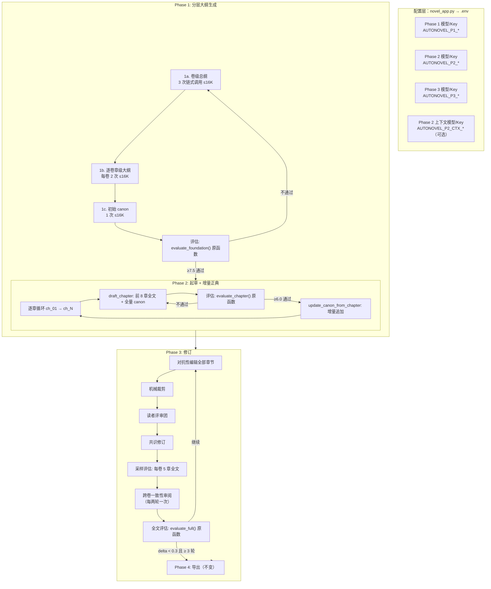

# 方案 D：分层大纲 + 增量正典 — 最终实施计划

> 版本：v2.0（整合 6 项约束条件）  
> 日期：2026-06-19  
> 前提约束：
> 1. 不特意指定模型——NVIDIA NIM 上大量免费模型上下文已达 1M
> 2. 每章字数保持 **3250 字**（不改动 `chapter_word_target`）
> 3. 单次 LLM 输出 ≤ **16000 token**（适配 NVIDIA NIM 免费模型 `max_tokens=16384`）
> 4. 各 Phase 评估评价**尽量复用原程序完全相同的函数和标准**
> 5. `.env` + `novel_app.bat` 支持 **Phase 1 / Phase 2 / Phase 3 独立模型和 API Key**
> 6. 删除 Elo 锦标赛阶段

---

## 一、架构总览



---

## 二、各约束条件的具体落实

### 约束 1 & 3：不限模型 + 单次输出 ≤ 16000 token

| 原方案 | 调整后 |
|---|---|
| Phase 1a 卷级总纲单次 32000 token | 拆为 **3 次链式调用**，每次 ≤ 12000 token |
| Phase 1b 每卷章级大纲 32000 token | 拆为 **每卷 2 次调用**（各 5 章），每次 ≤ 16000 token |
| canon 初始 16000 token | 不变（16000 恰好在限制内） |
| Phase 2 草拟 40000 token（大章） | 撤回——**每章仍 3250 字 → 输出约 8000 token**，远在 16000 内 |
| canon 增量追加 8000 token | 不变 |

**所有输出均在 16000 token 以内，全部可用 NVIDIA NIM 免费模型。**

### 约束 2：每章字数保持 3250

`chapter_word_target` 不变，[`prompts/chapter_prompts.py:48`](prompts/chapter_prompts.py:48) 中 "目标约 3000–3500 字" 不变。  
100 万字 = 308 章 ≈ **31 卷 × 10 章**（或灵活配置）。

### 约束 4：评估函数复用

| 评估点 | 方案 | 说明 |
|---|---|---|
| Phase 1 全局基础评估 | `evaluate_foundation()` **原函数** | 100% 复用，一行不改 |
| Phase 2 每章评估 | `evaluate_chapter()` **原函数** | 100% 复用 |
| Phase 3 全文评估 | `evaluate_full()` **原函数** | 100% 复用 |
| Phase 1 卷级/章级分层评估 | **新增函数**，但复用 `SCORING_CALIBRATION`、`MANDATORY_GAP_FIX`、`call_judge()`、`JUDGE_SYSTEM_PROMPT`、`parse_score()` | 基础设施同源 |
| Phase 3 跨卷一致性审阅 | **新增**（非评估——是检测→标记→推入修订队列） | 不产生评分 |

### 约束 5：三阶段独立模型配置

#### `.env` 新增字段

```bash
# ============================================================
# Phase 1 — 基础构建（world/characters/outline/canon/voice）
# 建议: NVIDIA NIM 免费模型
# ============================================================
AUTONOVEL_P1_API_KEY=nvapi-...
AUTONOVEL_P1_API_BASE_URL=https://integrate.api.nvidia.com/v1
AUTONOVEL_P1_MODEL_NAME=meta/llama-3.3-70b-instruct

# ============================================================
# Phase 2 — 章节起草（需要大上下文窗口）
# 建议: 有 1M 上下文的模型（NVIDIA NIM 免费 或 付费均可）
# ============================================================
AUTONOVEL_P2_API_KEY=
AUTONOVEL_P2_API_BASE_URL=
AUTONOVEL_P2_MODEL_NAME=

# Phase 2 — 上下文模型（可选，用于 canon 增量追加等大上下文任务）
# 留空则共用 P2 模型
AUTONOVEL_P2_CTX_API_KEY=
AUTONOVEL_P2_CTX_API_BASE_URL=
AUTONOVEL_P2_CTX_MODEL_NAME=

# ============================================================
# Phase 3 — 修订评估（对抗编辑、读者评审、全文评估）
# 建议: NVIDIA NIM 免费模型（评估任务不需要大上下文）
# ============================================================
AUTONOVEL_P3_API_KEY=
AUTONOVEL_P3_API_BASE_URL=
AUTONOVEL_P3_MODEL_NAME=
```

**回退逻辑**：如果某 Phase 的配置为空，自动回退到共用 `AUTONOVEL_API_KEY` / `AUTONOVEL_API_BASE_URL` / `AUTONOVEL_MODEL_NAME`（向后兼容现有 `.env`）。

#### `core/config.py` 新增映射和属性

```python
# 新增 .env → 内部键名映射
_PHASE_KEYS = {
    "p1_api_key":          "AUTONOVEL_P1_API_KEY",
    "p1_api_base_url":     "AUTONOVEL_P1_API_BASE_URL",
    "p1_model_name":       "AUTONOVEL_P1_MODEL_NAME",
    "p2_api_key":          "AUTONOVEL_P2_API_KEY",
    "p2_api_base_url":     "AUTONOVEL_P2_API_BASE_URL",
    "p2_model_name":       "AUTONOVEL_P2_MODEL_NAME",
    "p2_ctx_api_key":      "AUTONOVEL_P2_CTX_API_KEY",
    "p2_ctx_api_base_url": "AUTONOVEL_P2_CTX_API_BASE_URL",
    "p2_ctx_model_name":   "AUTONOVEL_P2_CTX_MODEL_NAME",
    "p3_api_key":          "AUTONOVEL_P3_API_KEY",
    "p3_api_base_url":     "AUTONOVEL_P3_API_BASE_URL",
    "p3_model_name":       "AUTONOVEL_P3_MODEL_NAME",
}

class Config:
    # 便捷属性 — 带回退
    @property
    def p1_api_key(self) -> str:
        return self._data.get("p1_api_key") or self.api_key
    
    @property
    def p2_api_key(self) -> str:
        return self._data.get("p2_api_key") or self.api_key
    
    # ... 同模式 p1/p2/p2_ctx/p3 全部属性
```

#### `core/api_client.py` 新增 Phase 特定调用函数

```python
def call_p1_writer(prompt, system=None, max_tokens=16000, ...) -> str:
    """Phase 1 写作调用 — 使用 AUTONOVEL_P1_* 配置。"""
    return _call_with_phase_config("p1", prompt, system, max_tokens, ...)

def call_p2_writer(prompt, system=None, max_tokens=16000, ...) -> str:
    """Phase 2 写作调用。"""
    return _call_with_phase_config("p2", prompt, system, max_tokens, ...)

def call_p2_ctx_writer(prompt, system=None, max_tokens=16000, ...) -> str:
    """Phase 2 大上下文写作调用（如 canon 追加）。"""
    return _call_with_phase_config("p2_ctx", prompt, system, max_tokens, ...)

def call_p3_judge(prompt, system=None, max_tokens=4096, ...) -> str:
    """Phase 3 裁判调用。"""
    return _call_with_phase_config("p3", prompt, system, ...)

def _call_with_phase_config(phase: str, ...):
    """内部: 从 config 取对应 phase 的 api_key/base_url/model，回退到共用配置。"""
    cfg = config; cfg.load()
    api_key = cfg.get(f"{phase}_api_key") or cfg.api_key
    api_base = cfg.get(f"{phase}_api_base_url") or cfg.api_base_url
    model = cfg.get(f"{phase}_model_name") or cfg.model_name
    # ... 复用 call_llm 的核心逻辑 ...
```

#### `novel_app.bat` 改动

不需要改 `.bat` 文件——它只是启动 `python novel_app.py`。所有配置采集在 `novel_app.py` 中完成。

#### `novel_app.py` UI 改动

在现有配置采集流程中增加**步骤 3.5**：

```python
# novel_app.py _collect_api_config 之后新增:
def _collect_phase_configs():
    """采集 Phase 1/2/3 各自的模型配置（可选，留空则共用）。"""
    _section("分阶段模型配置（可选——留空则共用上述写作模型）:")
    print("   Phase 1 (基础构建) 和 Phase 3 (修订评估) 建议用免费模型。")
    print("   Phase 2 (章节起草) 建议用有大上下文的模型。")
    print()
    
    # Phase 1
    print("   --- Phase 1: 基础构建 (world/characters/outline/canon) ---")
    p1_model = input("   [可选] Phase 1 模型名称: ").strip()
    p1_key = input("   [可选] Phase 1 API Key: ").strip()
    p1_url = input("   [可选] Phase 1 API 端点: ").strip()
    
    # Phase 2
    print("   --- Phase 2: 章节起草 ---")
    p2_model = input("   [可选] Phase 2 模型名称: ").strip()
    p2_key = input("   [可选] Phase 2 API Key: ").strip()
    p2_url = input("   [可选] Phase 2 API 端点: ").strip()
    
    # Phase 3
    print("   --- Phase 3: 修订评估 ---")
    p3_model = input("   [可选] Phase 3 模型名称: ").strip()
    p3_key = input("   [可选] Phase 3 API Key: ").strip()
    p3_url = input("   [可选] Phase 3 API 端点: ").strip()
    
    return {
        "p1_model_name": p1_model, "p1_api_key": p1_key, "p1_api_base_url": p1_url,
        "p2_model_name": p2_model, "p2_api_key": p2_key, "p2_api_base_url": p2_url,
        "p3_model_name": p3_model, "p3_api_key": p3_key, "p3_api_base_url": p3_url,
    }
```

### 约束 6：删除 Elo 锦标赛

从 [`pipeline_orchestrator.py:542-634`](pipeline_orchestrator.py:542) 删除 Elo 相关代码块，替换为**采样评估**（见下文 Phase 3 改造）。

---

## 三、Phase 1 改造详情

### 3.1 卷级总纲 — 3 次链式调用（新文件 [`foundation/gen_outline_volume.py`](foundation/gen_outline.py:28)）

```
调用 1: 全书弧线 + 卷 1-4 规划 + 伏笔种子 (~12K token)
         ↓ （全部输出传给调用 2）
调用 2: 卷 5-8 规划 + 伏笔追踪 (~12K token)
         ↓ （调用 1+2 全部输出传给调用 3）
调用 3: 卷 9-10 + 跨卷伏笔矩阵 + 连续性契约 (~14K token)
         ↓
合并: _assemble_volume_outline() → output/outline_volume.md
```

**链式传递保证一致性**：每次调用看到前次调用的全部输出，全局弧线在调用 1 中一次性锚定。

**系统 prompt**（复用现有风格）：

```python
VOLUME_OUTLINE_SYSTEM_PROMPT = """你是一位长篇小说结构架构师，专精于多卷本叙事规划。
你构建的卷级大纲确保：
— 每卷有独立的叙事功能和情感弧线
— 卷间过渡有因果链（非跳跃式）
— 跨卷伏笔有明确的种植→强化→回收路径
— 角色弧线在卷间连续推进，无断层
你的汉语写作简洁直接，不使用 AI 套话。"""
```

### 3.2 逐卷章级大纲 — 每卷 2 次调用（修改 `foundation/gen_outline.py`）

```python
def generate_outline_for_volume(volume_num: int, max_tokens: int = 16000) -> None:
    """为指定卷生成章级大纲 → output/outline_volume{N}.md
    
    每卷 10 章拆为 2 次调用:
      — Part A: 章 start ~ start+4 (5 章 × ~3200 token/章 ≈ 16000 token)
      — Part B: 章 start+5 ~ end (5 章 × ~3200 token/章 ≈ 16000 token)
    """
    cfg = config; cfg.load()
    ch_per_vol = cfg.chapters_per_volume
    start_ch = (volume_num - 1) * ch_per_vol + 1
    end_ch = volume_num * ch_per_vol
    
    # 加载卷级总纲中对应卷的约束
    vol_macro = (OUTPUT_DIR / "outline_volume.md").read_text(...)
    vol_section = _extract_volume_section(vol_macro, volume_num)
    
    # 加载前一卷章级大纲（用于跨卷衔接）
    prev_vol_outline = ""
    if volume_num > 1:
        prev_path = OUTPUT_DIR / f"outline_volume{volume_num - 1}.md"
        if prev_path.exists():
            prev_vol_outline = prev_path.read_text(...)[-4000:]  # 前一卷最后部分
    
    # Part A: 前 5 章
    result_a = _generate_outline_segment(
        volume_num, start_ch, start_ch + 4,
        vol_section, prev_vol_outline, max_tokens
    )
    
    # Part B: 后 5 章（传入 Part A 以保证内部连贯）
    result_b = _generate_outline_segment(
        volume_num, start_ch + 5, end_ch,
        vol_section, result_a, max_tokens
    )
    
    full_outline = result_a + "\n\n" + result_b
    (OUTPUT_DIR / f"outline_volume{volume_num}.md").write_text(full_outline)
```

### 3.3 大纲评估 — 新增分层评估（新增于 `pipeline_orchestrator.py`）

Phase 1 编排改为：

```python
def run_foundation(state: dict) -> dict:
    # === 子阶段 0: 全局基础（world, characters, canon, voice）===
    # 复用原 run_foundation 的全部逻辑
    
    # === 子阶段 1: 卷级总纲 ===
    from foundation.gen_outline_volume import generate_volume_outline
    generate_volume_outline(max_tokens=16000)  # 3 次链式调用，每次 ≤ 16K
    # ← 不单独评估卷级总纲（后续章级大纲评估会覆盖）
    
    # === 子阶段 2: 逐卷章级大纲 ===
    total_vol = cfg.total_volumes
    for vol in range(1, total_vol + 1):
        generate_outline_for_volume(vol, max_tokens=16000)
    
    # === 子阶段 3: 全局基础评估 ===
    # 原函数 evaluate_foundation() — 100% 复用
    from evaluation.evaluate import evaluate_foundation
    eval_result = evaluate_foundation()
    score = parse_score(eval_result, "overall_score")
    
    # ... commit / rollback 逻辑不变 ...
```

**关键决策**：卷级总纲和章级大纲**不单独做准入评估**——它们最终都汇入全局 `evaluate_foundation()` 评估。如果全局评分 ≥ 7.5，说明大纲质量整体达标；如果不达标，整个基础构建迭代重来。这样**不新增任何评估函数**，完全复用原机制。

---

## 四、Phase 2 改造详情

### 4.1 滚动上下文窗口 — 修改 [`drafting/draft_chapter.py`](drafting/draft_chapter.py:77)

```python
def draft_chapter(chapter_num: int, max_tokens: int = 16000, ...) -> None:
    # 加载所有上下文 ...
    
    # ★ 改造：前 RECENT_CHAPTERS 章全文（每章~3250 字 × 8 = ~26000 字）
    RECENT_CHAPTERS = 8
    recent_chapters = []
    for offset in range(1, RECENT_CHAPTERS + 1):
        prev_path = CHAPTERS_DIR / f"ch_{chapter_num - offset:02d}.md"
        if prev_path.exists():
            recent_chapters.append(
                f"【第 {chapter_num - offset} 章全文】\n{prev_path.read_text(...)}"
            )
    prev_context = "\n\n---\n\n".join(reversed(recent_chapters))
    # ★ 不截断 prev_context — 全部注入 prompt
    
    # ★ 改造：全量 canon（不再 [:3000] 截断）
    canon_text = (OUTPUT_DIR / "canon.md").read_text(...) or ""
    # canon 可能很大，但对 1M 上下文模型不是问题
    
    prompt = build_chapter_prompt(
        chapter_num,
        voice_text=voice,          # 全量
        world_text=world,          # 全量，不再 [:5000]
        characters_text=chars,     # 全量，不再 [:5000]
        chapter_outline=outline,
        next_chapter_preview=next_ch,
        prev_context=prev_context, # ← 替代 prev_chapter_tail
        canon_text=canon_text,     # ← 全量 canon
        novel_title=novel_title,
    )
```

### 4.2 prompt 模板改动 — 对应修改 [`prompts/chapter_prompts.py`](prompts/chapter_prompts.py:9)

```python
def build_chapter_prompt(
    chapter_num: int,
    voice_text: str,
    world_text: str,
    characters_text: str,
    chapter_outline: str,
    next_chapter_preview: str,
    prev_context: str,              # ← 改名：从 prev_chapter_tail 改为 prev_context
    canon_text: str = "",
    novel_title: str = "",
    protagonist_name: str = "",
) -> str:
    return f"""请撰写第 {chapter_num} 章。

{'小说名称：《' + novel_title + '》' if novel_title else ''}

【文风定义】
{voice_text}

【本章大纲】
{chapter_outline}

【下一章预告】
{next_chapter_preview}

【前文回顾——保持情节、对话、情感连续性】
{prev_context}

【世界观设定】
{world_text}

【角色注册表】
{characters_text}

{'【正典（已确立的硬事实——不可违反）】' + canon_text if canon_text else ''}

【写作指令】
... (2-17 条不变)

18. 【跨章一致性】: 复读前文中角色正在进行的动作、未完成的对话、
    持有的物品、当前的情绪状态。不要重置或遗忘。"""

# ★ 字数指令不改: "目标约 3000–3500 字" (约束 2)
```

### 4.3 增量 canon 追加 — 新文件 [`foundation/update_canon.py`](foundation/gen_canon.py:1)

```python
"""
foundation/update_canon.py — 增量正典更新器

每章起草完成后，从章节文本中提取新设定，追加到 canon.md。
输出 ≤ 8000 token，适配 16000 限制。
"""

UPDATE_CANON_SYSTEM_PROMPT = """你是正典管理员。从新完成的章节中提取首次出现的新增硬事实。
已有正典中已记录的事实不要重复。
你的输出直接追加到 canon.md 对应节。
你的汉语写作简洁直接。"""


def update_canon_from_chapter(
    chapter_num: int,
    chapter_text: str,
    max_tokens: int = 8000,
) -> int:
    """从章节提取新事实 → 追加 canon.md。返回新增事实条数。"""
    canon_path = OUTPUT_DIR / "canon.md"
    existing_canon = canon_path.read_text(encoding="utf-8") if canon_path.exists() else ""
    
    prompt = f"""【已有正典】
{existing_canon}

【新完成的第 {chapter_num} 章全文】
{chapter_text}

请提取本章中【首次出现】的新增硬事实，按格式输出：

## 新增：世界观硬事实（第 {chapter_num} 章）
— ...

## 新增：角色硬事实（第 {chapter_num} 章）
— ...

## 新增：时间线硬事实（第 {chapter_num} 章）
— ...

## 新增：规则硬事实（第 {chapter_num} 章）
— ...

如无新增事实，输出「无新增事实」。
"""
    
    result = call_writer(prompt, system=UPDATE_CANON_SYSTEM_PROMPT,
                         max_tokens=max_tokens)
    
    if "无新增事实" not in result:
        canon_path.write_text(existing_canon.rstrip() + "\n\n" + result)
    
    # 统计新增条数
    new_entries = len(re.findall(r'^— ', result, re.MULTILINE))
    return new_entries
```

### 4.4 pipeline_orchestrator 中嵌入 canon 追加

在 `run_drafting` 中每章成功起草后（评分通过、commit 之后）追加：

```python
# 在 pipeline_orchestrator.py run_drafting 中，章节评分通过后:
try:
    from foundation.update_canon import update_canon_from_chapter
    ch_text = ch_file.read_text(encoding="utf-8")
    new_count = update_canon_from_chapter(ch, ch_text)
    if new_count > 0:
        step(f"正典更新: +{new_count} 条新事实")
except Exception as e:
    step(f"正典更新跳过: {e}")
```

### 4.5 Phase 2 评估 — 100% 复用

`evaluate_chapter()` 不改。函数签名、slop 规则、Judge prompt、阈值 (6.0)、重试 (5 次)、文风指纹、反模式审计——全部原封不动。

**唯一差异**：LLM 起草时输入了更多上下文（前 8 章 + 全量 canon），但这不影响评估函数。

---

## 五、Phase 3 改造详情

### 5.1 删除 Elo 锦标赛

从 [`pipeline_orchestrator.py:542-634`](pipeline_orchestrator.py:542) 删除以下代码块：
- `run_compare_chapters()` 调用
- `_elo_target_weaks()` 函数定义及调用
- Elo 底部章节的修订循环

### 5.2 新增采样评估（替代 Elo）

```python
def _sample_evaluate_volumes(total_ch: int, ch_per_vol: int, 
                              total_vol: int, sample_size: int = 5):
    """每卷随机采样 sample_size 章做全文评估。返回评分低于阈值的章节列表。"""
    import random
    
    threshold = config.chapter_threshold  # 6.0
    weak_chapters = []
    
    for vol in range(1, total_vol + 1):
        start_ch = (vol - 1) * ch_per_vol + 1
        end_ch = min(vol * ch_per_vol, total_ch)
        sample = random.sample(range(start_ch, end_ch + 1),
                               min(sample_size, end_ch - start_ch + 1))
        
        for ch in sample:
            eval_result = evaluate_chapter(ch)  # ← 原函数
            score = parse_score(eval_result, "overall_score")
            if score < threshold:
                weak_chapters.append((ch, score))
    
    weak_chapters.sort(key=lambda x: x[1])
    return [ch for ch, _ in weak_chapters[:10]]  # 每轮最多修订 10 章
```

### 5.3 新增跨卷一致性审阅（新增于 Phase 3，每两轮一次）

```python
def _cross_volume_consistency_review(state: dict) -> list[int]:
    """用大上下文模型检查卷间连接点的连续性。
    返回疑似断裂的章节编号列表。"""
    
    cfg = config; cfg.load()
    ch_per_vol = cfg.chapters_per_volume
    total_vol = cfg.total_volumes
    
    # 提取每卷首尾各 3000 字
    segments = []
    for vol in range(1, total_vol + 1):
        last_ch = vol * ch_per_vol
        first_ch_next = last_ch + 1
        
        last_path = CHAPTERS_DIR / f"ch_{last_ch:02d}.md"
        if last_path.exists():
            segments.append(f"【卷 {vol} 终章（第 {last_ch} 章）尾 3000 字】\n"
                           f"{last_path.read_text(...)[-3000:]}")
        
        if first_ch_next <= cfg.total_chapters:
            next_path = CHAPTERS_DIR / f"ch_{first_ch_next:02d}.md"
            if next_path.exists():
                segments.append(f"【卷 {vol+1} 首章（第 {first_ch_next} 章）头 3000 字】\n"
                               f"{next_path.read_text(...)[:3000]}")
    
    canon = (OUTPUT_DIR / "canon.md").read_text(...)
    
    prompt = f"""请检查以下卷间连接点的连续性：

{chr(10).join(segments)}

【正典参考】
{canon[:5000]}

请检查：
1. 角色状态是否一致（位置、持有物品、当前目标、情绪状态）
2. 伏笔线索是否断裂（前卷末埋设 → 后卷首是否承接）
3. 世界观设定是否漂移

输出格式：
断裂章节: [章节编号列表，用逗号分隔]
如无断裂: 「无」
"""
    
    result = call_judge(prompt, max_tokens=1000)
    # 解析章节编号 → 返回列表
    ...
```

### 5.4 Phase 3 评估 — 复用

| 评估项 | 函数 | 改动 |
|---|---|---|
| 共识修订评估 | `evaluate_chapter()` | **原函数** |
| 采样评估 | `evaluate_chapter()` | **原函数** |
| 全文评估 | `evaluate_full()` | **原函数** |
| 跨卷一致性审阅 | 新增 `call_judge()` | **不产生评分**，只标记章节 |

---

## 六、状态管理扩展

### [`core/state_manager.py`](core/state_manager.py:71) — `default_state()` 新增字段

```python
def default_state() -> dict:
    return {
        # ... 原有字段不变 ...
        
        # === 方案 D 新增 ===
        "total_volumes": 0,
        "chapters_per_volume": 0,
        "current_volume": 1,
        "volumes_outlined": 0,
        "canon_entry_count": 0,
        "canon_last_updated_ch": 0,
    }
```

---

## 七、大纲加载适配

所有引用 `outline.md` 的地方需改为**卷感知加载**：

### [`drafting/draft_chapter.py:34`](drafting/draft_chapter.py:34) — `extract_chapter_outline`

```python
def extract_chapter_outline(chapter_num: int) -> str:
    """从对应卷的大纲文件提取章节条目。"""
    cfg = config; cfg.load()
    ch_per_vol = cfg.chapters_per_volume or 10
    vol_num = (chapter_num - 1) // ch_per_vol + 1
    
    vol_outline_path = OUTPUT_DIR / f"outline_volume{vol_num}.md"
    if not vol_outline_path.exists():
        # 回退到旧版 outline.md
        vol_outline_path = OUTPUT_DIR / "outline.md"
    
    # ... regex 提取 ...
```

### [`evaluation/evaluate.py:348`](evaluation/evaluate.py:348) — `evaluate_chapter` 中的大纲加载

同样改为卷感知：加载 `outline_volume{N}.md`，回退到 `outline.md`。

---

## 八、文件变更清单

| 文件 | 操作 | 说明 |
|---|---|---|
| [`core/config.py`](core/config.py:36) | **修改** | 新增 `_PHASE_KEYS` 映射 + P1/P2/P3 便捷属性 + `total_volumes`/`chapters_per_volume` |
| [`core/state_manager.py`](core/state_manager.py:71) | **修改** | `default_state()` 新增卷级字段 |
| [`core/api_client.py`](core/api_client.py:83) | **修改** | 新增 `call_p1_writer` / `call_p2_writer` / `call_p2_ctx_writer` / `call_p3_judge` |
| [`.env`](.env:1) | **修改** | 新增 `AUTONOVEL_P1_*` / `AUTONOVEL_P2_*` / `AUTONOVEL_P2_CTX_*` / `AUTONOVEL_P3_*` |
| [`novel_app.py`](novel_app.py:240) | **修改** | 新增分阶段模型配置采集 UI |
| [`pipeline_orchestrator.py`](pipeline_orchestrator.py:57) | **修改** | Phase 1 分层调用 + Phase 2 canon 追加 + Phase 3 删除 Elo / 新增采样+跨卷审阅 |
| [`foundation/gen_outline_volume.py`](foundation/gen_outline.py:28) | **新增** | 卷级总纲 3 次链式调用生成器 |
| [`foundation/gen_outline.py`](foundation/gen_outline.py:28) | **修改** | 改为 `generate_outline_for_volume()` 按卷生成 |
| [`foundation/gen_outline_part2.py`](foundation/gen_outline_part2.py:24) | **修改** | 适配按卷大纲文件 |
| [`foundation/gen_canon.py`](foundation/gen_canon.py:23) | **修改** | 不修改现有函数，仅作为初始 canon 生成 |
| [`foundation/update_canon.py`](foundation/gen_canon.py:1) | **新增** | 增量正典追加器 |
| [`drafting/draft_chapter.py`](drafting/draft_chapter.py:57) | **修改** | 滚动 8 章上下文 + 全量 canon + 卷感知大纲加载 |
| [`prompts/chapter_prompts.py`](prompts/chapter_prompts.py:9) | **修改** | `prev_chapter_tail` → `prev_context` + 取消参考文档截断 + 新增跨章一致性指令 |
| [`evaluation/evaluate.py`](evaluation/evaluate.py:278) | **修改** | 大纲加载改为卷感知（`evaluate_chapter` / `evaluate_foundation`） |
| [`prompts/eval_judge_prompts.py`](prompts/eval_judge_prompts.py:77) | **不修改** | 100% 复用现有 prompt |
| [`prompts/outline_prompts.py`](prompts/outline_prompts.py:10) | **修改** | 新增 `build_volume_outline_segment_prompt()` 和 `build_chapter_outline_for_volume_prompt()` |
| [`revision/compare_chapters.py`](revision/compare_chapters.py:23) | **不修改** | 保留文件不删，但 pipeline 不再调用 |

**总计：14 个文件修改，3 个新文件，3 个不修改的现有文件。**

---

## 九、实施顺序

| 步骤 | 内容 | 涉及文件 | 依赖 |
|---|---|---|---|
| **Step 1** | config + state 扩展（卷级字段、Phase 分离配置映射） | `core/config.py`, `core/state_manager.py`, `.env` | 无 |
| **Step 2** | api_client 新增 phase 特定调用函数 | `core/api_client.py` | Step 1 |
| **Step 3** | novel_app.py UI 改造（卷数+每卷章数+分阶段模型） | `novel_app.py` | Step 1 |
| **Step 4** | 卷级总纲生成器（3 次链式调用） | `foundation/gen_outline_volume.py`, `prompts/outline_prompts.py` | Step 2 |
| **Step 5** | gen_outline.py 重构为按卷生成 | `foundation/gen_outline.py`, `prompts/outline_prompts.py` | Step 4 |
| **Step 6** | 增量 canon 追加器 + draft_chapter 滚动窗口改造 | `foundation/update_canon.py`, `drafting/draft_chapter.py`, `prompts/chapter_prompts.py` | Step 2, Step 5 |
| **Step 7** | pipeline_orchestrator Phase 1/2 适配 | `pipeline_orchestrator.py` | Step 4-6 |
| **Step 8** | Phase 3 删除 Elo + 新增采样+跨卷审阅 | `pipeline_orchestrator.py` | Step 7 |
| **Step 9** | evaluate.py 大纲加载适配 | `evaluation/evaluate.py` | Step 5 |
| **Step 10** | 端到端测试（1 卷 10 章 → 3 卷 30 章） | — | Step 1-9 |

---

## 十、质量保障总结

| Phase | 核心评估 | 与修改前的差异 |
|---|---|---|
| Phase 1 | `evaluate_foundation()` **原函数 100% 复用** | 输入文档更充实（分层大纲 3200 token/章），但 Judge 标准和流程完全不变 |
| Phase 2 | `evaluate_chapter()` **原函数 100% 复用** | 评估函数不变。但 LLM 起草时输入滚动了前 8 章全文 + 全量 canon，输出质量更高 |
| Phase 3 | `evaluate_chapter()` + `evaluate_full()` **原函数 100% 复用** | 删除了最弱评估环节 (Elo)，新增跨卷审阅（非评分，推入修订队列） |

**核心结论：三个 Phase 的评估门禁函数完全没改。方案 D 改的是"模型看到了什么输入"，而非"如何评判输出"。**