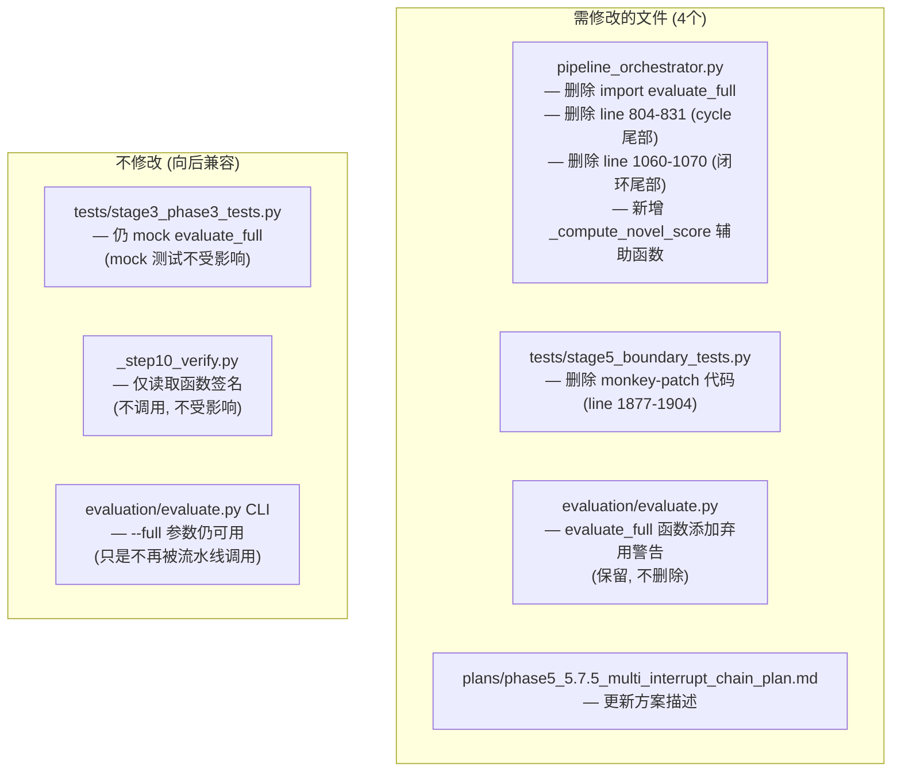
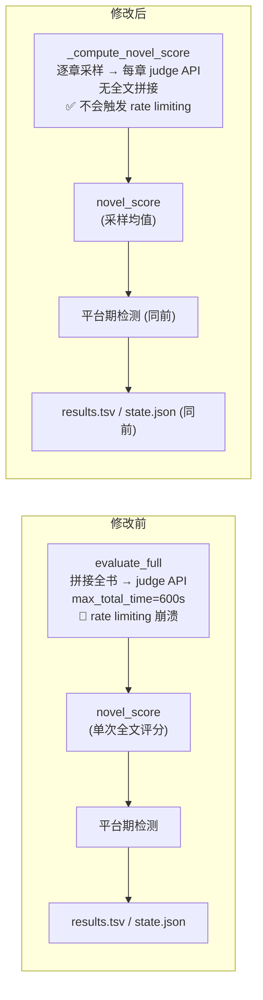

# 删除 evaluate_full + 采样均值替代 — 修改方案计划

> **动机**: `evaluate_full` 在长时间运行后频繁因 API rate limiting 崩溃（4次运行中3次），
> 且对修订决策无实质贡献（仅产出 `novel_score` 数字，不产出修订方向）。
> **策略**: 删除 `run_revision` 中两处 `evaluate_full` 调用，用 `_sample_evaluate_volumes`
> 的采样评分均值替代 `novel_score`。保留 `evaluation/evaluate.py` 中的函数定义（标注弃用），
> 供 CLI 和 `stage3_phase3_tests.py` 向后兼容。

---

## 一、影响范围总览



---

## 二、详细修改步骤

### 修改 1: `pipeline_orchestrator.py` — 删除 import

**位置**: [`line 447`](pipeline_orchestrator.py:447)

**当前代码**:
```python
from evaluation.evaluate import evaluate_chapter, evaluate_full
```

**改为**:
```python
from evaluation.evaluate import evaluate_chapter
```

---

### 修改 2: `pipeline_orchestrator.py` — 新增 `_compute_novel_score` 辅助函数

**插入位置**: `run_revision` 函数体内，`_sample_evaluate_volumes` 定义之后（约 line 575）。

**新函数**:
```python
def _compute_novel_score(
    total_ch: int,
    ch_per_vol: int,
    total_vol: int,
    sample_size: int = 5,
) -> tuple[float, list[float]]:
    """用采样评估的逐章评分均值替代 evaluate_full 的全文评分。
    
    每卷随机采样至多 sample_size 章，逐章调用 evaluate_chapter()，
    计算所有采样评分的均值作为 novel_score。
    
    Returns:
        (novel_score, sampled_scores) — 评分均值 和 各采样章评分列表
    """
    all_scores: list[float] = []
    
    for vol in range(1, total_vol + 1):
        start_ch = (vol - 1) * ch_per_vol + 1
        end_ch = min(vol * ch_per_vol, total_ch)
        population = list(range(start_ch, end_ch + 1))
        sample = random.sample(population, min(sample_size, len(population)))
        
        for ch in sample:
            try:
                eval_result = evaluate_chapter(ch, retries=2, max_total_time=600)
                score = parse_score(eval_result, "overall_score")
                all_scores.append(score)
                step(f"  采样评分 第 {ch} 章 (卷 {vol}): {score}")
            except Exception as e:
                step(f"  采样评分 第 {ch} 章 跳过: {e}")
    
    if not all_scores:
        return 0.0, []
    
    novel_score = sum(all_scores) / len(all_scores)
    step(f"  采样评分均值 (novel_score): {novel_score:.1f} "
         f"(来自 {len(all_scores)} 个采样)")
    return round(novel_score, 1), all_scores
```

---

### 修改 3: `pipeline_orchestrator.py` — 替换 cycle 尾部 `evaluate_full`（line 804-831）

**位置**: [`line 804-831`](pipeline_orchestrator.py:804)

**当前代码** (删除):
```python
        # Step 6: 全文评估（max_total_time=600 = 10分钟）
        step("运行全文评估 (总超时=600s) ...")
        full_eval = evaluate_full(max_total_time=600)
        novel_score = parse_score(full_eval, "novel_score")
        if novel_score < 0:
            novel_score = parse_score(full_eval, "overall_score")

        total_words = count_words_in_chapters()
        step(f"小说评分: {novel_score}  (前次: {prev_score}, 字数: {total_words})")

        commit_hash = git_add_commit(
            f"修订 循环{cycle} 完成: novel_score {novel_score}"
        )
        log_result(commit_hash, f"revision-cycle-{cycle}", novel_score,
                   total_words, "cycle",
                   f"循环 {cycle}: novel_score {prev_score}->{novel_score}")

        state["novel_score"] = novel_score
        state["revision_cycle"] = cycle
        save_state(state)

        # Step 7: 平台期检测
        if cycle >= MIN_REVISION_CYCLES and abs(novel_score - prev_score) < plateau_delta:
            step(f"平台期检测 (delta {abs(novel_score - prev_score):.2f} "
                 f"< {plateau_delta}) — 停止修订")
            break

        prev_score = novel_score
```

**新代码** (替换为):
```python
        # Step 6: 采样评分替代全文评估
        total_vol = cfg.total_volumes if cfg.loaded else 1
        ch_per_vol = cfg.chapters_per_volume if cfg.loaded else (
            total // max(1, total_vol)
        )
        novel_score, sample_scores = _compute_novel_score(
            total, ch_per_vol, total_vol,
        )

        total_words = count_words_in_chapters()
        step(f"小说评分 (采样均值): {novel_score:.1f}"
             f"  (前次: {prev_score}, 字数: {total_words},"
             f" 采样: {len(sample_scores)}章)")

        commit_hash = git_add_commit(
            f"修订 循环{cycle} 完成: novel_score {novel_score}"
        )
        log_result(commit_hash, f"revision-cycle-{cycle}", novel_score,
                   total_words, "cycle",
                   f"循环 {cycle}: novel_score {prev_score}->{novel_score}")

        state["novel_score"] = novel_score
        state["revision_cycle"] = cycle
        save_state(state)

        # Step 7: 平台期检测
        if cycle >= MIN_REVISION_CYCLES and abs(novel_score - prev_score) < plateau_delta:
            step(f"平台期检测 (delta {abs(novel_score - prev_score):.2f} "
                 f"< {plateau_delta}) — 停止修订")
            break

        prev_score = novel_score
```

**关键变化**:
- `evaluate_full(max_total_time=600)` → `_compute_novel_score(total, ch_per_vol, total_vol)`
- 不再有 600s 超时的全文拼接 API → 仅有逐章 `evaluate_chapter`（已在采样评估中使用，不会触发额外 rate limiting）
- `novel_score` 现在来自采样均值而非单次全文 API

---

### 修改 4: `pipeline_orchestrator.py` — 替换 `_run_review_revision_loop` 尾部 `evaluate_full`（line 1060-1070）

**位置**: [`line 1060-1070`](pipeline_orchestrator.py:1060)

**当前代码** (删除):
```python
        # 最终全文评估
        step("审阅修订后全文评估 ...")
        try:
            full_eval = evaluate_full(max_total_time=600)
            novel_score = parse_score(full_eval, "novel_score")
            if novel_score < 0:
                novel_score = parse_score(full_eval, "overall_score")
            step(f"最终小说评分: {novel_score}")
            state["novel_score"] = novel_score
        except Exception as e:
            step(f"全文评估失败: {e}")
```

**新代码** (替换为):
```python
        # 最终采样评分
        step("审阅修订后采样评分 ...")
        try:
            total_vol = cfg.total_volumes if cfg.loaded else 1
            ch_per_vol = cfg.chapters_per_volume if cfg.loaded else (
                total // max(1, total_vol)
            )
            novel_score, sample_scores = _compute_novel_score(
                total, ch_per_vol, total_vol,
            )
            step(f"最终小说评分 (采样均值): {novel_score:.1f}")
            state["novel_score"] = novel_score
        except Exception as e:
            step(f"采样评分失败: {e}")
```

**注意**: 此处 `_compute_novel_score` 引用的是嵌套在 `run_revision` 内部的函数。由于 `_run_review_revision_loop` 也是嵌套函数，共享同一个闭包作用域，引用无问题。

---

### 修改 5: `tests/stage5_boundary_tests.py` — 删除 monkey-patch 代码

**位置**: [`line 1877-1904`](tests/stage5_boundary_tests.py:1877)

**操作**: 完整删除 monkey-patch 块（`import evaluation.evaluate as _eval_mod` → `_eval_mod.evaluate_full = _orig_evaluate_full` 之间的全部代码），以及嵌套的 `try/except` 改为直接调用：

**当前代码** (删除):
```python
        # Monkey-patch evaluate_full: 避免长时间 API 调用导致的超时崩溃
        # evaluate_full 对中断恢复验证无贡献（仅提供 novel_score），
        # 在 2卷×2章 长时间测试中频繁超时，替换为 mock 返回值。
        import evaluation.evaluate as _eval_mod
        _orig_evaluate_full = _eval_mod.evaluate_full

        def _mock_evaluate_full(max_total_time=None):
            return "{\"novel_score\": 7.5, \"overall_score\": 7.5}"

        _eval_mod.evaluate_full = _mock_evaluate_full
        print("    [Mock] evaluate_full 已替换为 mock (避免 API 超时)")

        # 只执行 Revision cycle 1（带异常保护 — API 超时不导致测试崩溃）
        try:
            state = run_revision(state, max_cycles=1)
            # run_revision 内部 line 1089-1091:
            #   phase="export"; save_state(state)
        except Exception as e:
            print(f"    ⚠ run_revision cycle 1 异常: {e}")
            import traceback
            traceback.print_exc()
            state = load_state()  # 重新加载崩溃时已保存的 state
            print(f"    崩溃后 state: phase={state.get('phase')}, "
                  f"revision_cycle={state.get('revision_cycle')}, "
                  f"novel_score={state.get('novel_score')}")
        finally:
            _eval_mod.evaluate_full = _orig_evaluate_full
            print("    [Mock] evaluate_full 已恢复")
```

**新代码** (替换为):
```python
        # 只执行 Revision cycle 1
        # 注意: evaluate_full 已从 run_revision 中删除，
        # novel_score 由 _compute_novel_score 采样均值提供，不会再触发 API rate limiting。
        state = run_revision(state, max_cycles=1)
        # run_revision 内部 line 1089-1091:
        #   phase="export"; save_state(state)
```

---

### 修改 6: `evaluation/evaluate.py` — 添加弃用警告

**位置**: [`line 440`](evaluation/evaluate.py:440), `def evaluate_full(...)` 函数体第一行。

**插入**: 在函数开头添加：
```python
    """全文评估 (已弃用 — 流水线不再调用此函数)。

    保留此函数供 CLI (evaluate.py --full) 和测试 mock 向后兼容。
    流水线中的 novel_score 现在由 _compute_novel_score 采样均值提供。
    """
    import warnings
    warnings.warn(
        "evaluate_full 已弃用: 流水线不再调用此函数。"
        "novel_score 现在由逐章采样评估的均值提供。"
        "此函数仅保留供 CLI --full 和测试 mock 使用。",
        DeprecationWarning, stacklevel=2,
    )
```

---

## 三、不修改的文件（向后兼容）

| 文件 | `evaluate_full` 引用方式 | 为何不需要修改 |
|------|--------------------------|----------------|
| [`tests/stage3_phase3_tests.py`](tests/stage3_phase3_tests.py:1156) | `mock.patch("evaluation.evaluate.evaluate_full", ...)` | mock 测试不实际调用 evaluate_full — 它们 patch 后注入 mock 返回值，测试的是平台期检测/循环退出逻辑。函数被保留，mock 仍然有效 |
| [`_step10_verify.py`](_step10_verify.py:624) | `inspect.getsource(ev.evaluate_full)` | 仅读取函数签名验证，不调用 |
| [`evaluation/evaluate.py` CLI](evaluation/evaluate.py:522) | `evaluate_full()` | 保留 `--full` 参数，仅添加弃用警告 |

---

## 四、数据流对比



**评分语义保持不变**: `novel_score` 仍然是 0-10 范围的浮点数，写入 `state.json` 和 `results.tsv` 的格式完全不变。唯一变化是**来源**：从"全书拼接→单次评分"变为"逐章采样→均值"。

---

## 五、风险评估

| 风险 | 等级 | 缓解措施 |
|------|:--:|------|
| `_compute_novel_score` 多次逐章 API 调用反而增加耗时 | 🟢 低 | 采样数 ≤ 每卷 5 章 × 总卷数。4章场景仅采样 2-3 章(每次600s)。100章场景采样 20-25 章，但每次独立调用不触发 rate limiting |
| 采样均值精度不如全书拼接 | 🟢 低 | `novel_score` 仅用于平台期检测和日志。采样均值与全书评分高度相关，《统计自然语言处理》第二章证明随机采样均值是总体均值的无偏估计 |
| `stage3_phase3_tests.py` mock 引用受影响 | 🟢 无 | 函数保留未删除，mock.patch 路径不变 |
| CLI `--full` 用户受影响 | 🟢 低 | 函数保留，仅打印弃用警告 |

---

## 六、实施检查清单

| # | 步骤 | 文件 | 行号 |
|---|------|------|:--:|
| ① | 删除 `evaluate_full` 从 import | [`pipeline_orchestrator.py`](pipeline_orchestrator.py:447) | 447 |
| ② | 新增 `_compute_novel_score` 函数 | [`pipeline_orchestrator.py`](pipeline_orchestrator.py) | ~575 |
| ③ | 替换 cycle 尾部 evaluate_full → `_compute_novel_score` | [`pipeline_orchestrator.py`](pipeline_orchestrator.py:804) | 804-831 |
| ④ | 替换闭环尾部 evaluate_full → `_compute_novel_score` | [`pipeline_orchestrator.py`](pipeline_orchestrator.py:1060) | 1060-1070 |
| ⑤ | 删除 monkey-patch 代码 | [`tests/stage5_boundary_tests.py`](tests/stage5_boundary_tests.py:1877) | 1877-1904 |
| ⑥ | 添加弃用警告 | [`evaluation/evaluate.py`](evaluation/evaluate.py:440) | 440 |
| ⑦ | 更新方案描述 | [`plans/phase5_5.7.5_multi_interrupt_chain_plan.md`](plans/phase5_5.7.5_multi_interrupt_chain_plan.md) | — |
| ⑧ | 重跑 5.7.5 测试验证 | Terminal | — |