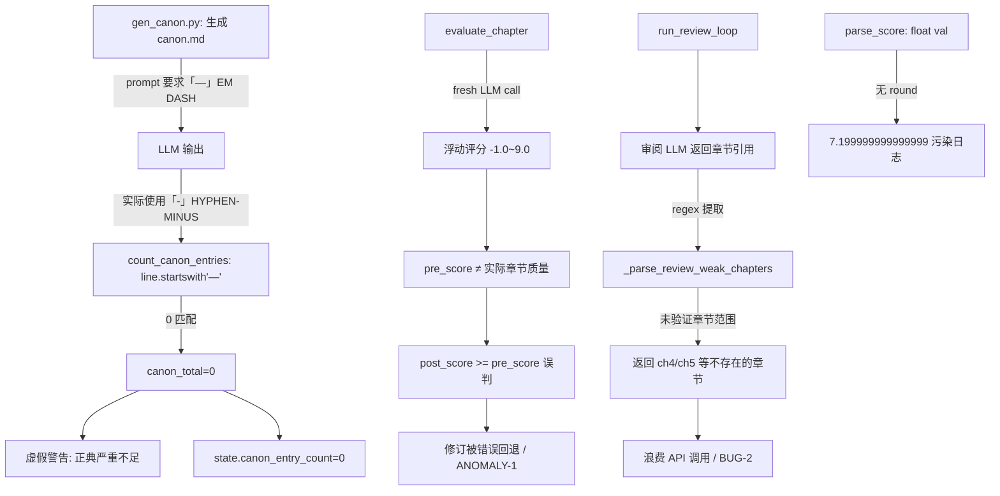

# Run #7 异常修复方案计划

> 基于最近一次 Stage 4 E2E-1 全流水线 (10:15:39→11:59:44, 104min) 的深度诊断

---

## 逻辑链概览



---

## BUG-1: 正典条目解析器损坏 — `count_canon_entries()` 始终返回 0

### 根因

| 层级 | 文件 | 行号 | 问题 |
|------|------|------|------|
| **Prompt** | [`gen_canon.py`](foundation/gen_canon.py:45) | 45 | 要求 LLM 用 `「—」`（EM DASH U+2014）作为条目前缀 |
| **LLM 输出** | [`canon.md`](output/canon.md:4) | 4-5 | LLM 实际输出 `-`（HYPHEN-MINUS U+002D）前缀 |
| **解析器** | [`gen_canon.py`](foundation/gen_canon.py:101) | 101 | `line.startswith("—")` → 只匹配 EM DASH，HYPHEN-MINUS 不匹配 |

**结论**: Prompt 指定 EM DASH（`—`），但 LLM 不完全遵循，使用 HYPHEN-MINUS（`-`）。解析器只认 EM DASH → 计数全部 = 0。

### 修复方案（3选1）

| 方案 | 改动位置 | 描述 | 风险 |
|------|---------|------|------|
| **A（推荐）** | [`gen_canon.py`](foundation/gen_canon.py:101) | 同时匹配 `—` 和 `-` 和 `*` 三种前缀 | 低，纯防御性 |
| B | [`gen_canon.py`](foundation/gen_canon.py:45) | 将 prompt 改为要求 `-`（HYPHEN-MINUS），并修正解析器 | 中，需确认 prompt 变更不引起其他格式问题 |
| C | [`gen_canon.py`](foundation/gen_canon.py:72-111) | 重写 `count_canon_entries()`，按 `##` 节头区域行数统计，不依赖前缀字符 | 中，逻辑变多 |

### 推荐实现：方案 A

```python
# gen_canon.py:96-102 改动
def _is_bullet(line: str) -> bool:
    """判断是否为 bullet 行 — 兼容 EM DASH / HYPHEN / ASTERISK"""
    return line.startswith(("—", "-", "*"))

# 替换 line 101:
- if current_section and line.startswith("—"):
+ if current_section and _is_bullet(line):
```

---

## BUG-2: 审阅修订推荐不存在的章节（ch4/ch5）

### 根因

| 层级 | 文件 | 行号 | 问题 |
|------|------|------|------|
| **章节提取** | [`pipeline_orchestrator.py`](pipeline_orchestrator.py:973-976) | 973-976 | regex `第\s*(\d+)\s*章` 从审阅文本中提取所有章节编号 |
| **范围校验** | [`pipeline_orchestrator.py`](pipeline_orchestrator.py:981) | 981 | 提取后**没有过滤**`ch_num > total_chapters` |
| **兜底逻辑** | [`pipeline_orchestrator.py`](pipeline_orchestrator.py:983-992) | 983-992 | 无引用时的兜底取 `total//3` 到 `2*total//3` 中段章节，当 `total=3 < 6` 时不触发 |

**结论**: `_parse_review_weak_chapters()` 直接将 LLM 审阅文本中出现的所有 `第N章` 返回，未验证 N 是否在 `[1, total_chapters]` 范围内。审阅 LLM 可能提及超出范围的章节编号。

### 修复方案

| 位置 | 改动 |
|------|------|
| [`pipeline_orchestrator.py`](pipeline_orchestrator.py:981) | 在 `chapter_hits[ch_num]` 赋值前加 `if 1 <= ch_num <= total_chapters` 过滤 |
| [`pipeline_orchestrator.py`](pipeline_orchestrator.py:996) | 返回值处加 `[:min(5, total_chapters)]` 截断 |
| 函数签名 | 将 `total_chapters` 作为参数传入（当前闭包可访问外部 `total`） |

```python
# pipeline_orchestrator.py:980-981 改动
                    if any(kw in context for kw in negative_keywords):
+                       if 1 <= ch_num <= total:  # ★ BUG-2 fix: 过滤超出范围的章节
                            chapter_hits[ch_num] = chapter_hits.get(ch_num, 0) + 1
```

---

## BUG-3 / ANOMALY-1: 修订评分基准不可靠 → 修订循环零净收益

### 根因链

```
evaluate_chapter() 每次调用都给不同分数
    ↓
pre_score = evaluate_chapter(ch_num)  ← 修订前重评 (line 598/836/1064)
    ↓ 分数可能 ≠ 章节实际上次提交时的评分
post_score = evaluate_chapter(ch_num) ← 修订后重评 (line 623/877/1107)
    ↓ 
if post_score >= pre_score: → commit
else: → git_reset_hard("HEAD") → 回退
    ↓
pre_score 可能被高估 (8.0 vs 实际 7.5)
→ 修订后 7.5 < 8.0 → 假回退（浪费 API）
pre_score 可能被低估 (-1.0 vs 实际 7.0)
→ 修订后 7.0 >= -1.0 → 假通过（未真正改进）
```

**涉及位置**（同样模式出现 3 次）:
- 共识修订: [`pipeline_orchestrator.py:598-644`](pipeline_orchestrator.py:598)
- 采样修订: [`pipeline_orchestrator.py:835-911`](pipeline_orchestrator.py:835)
- 审阅修订: [`pipeline_orchestrator.py:1062-1145`](pipeline_orchestrator.py:1062)

### 修复方案

| 优先级 | 方案 | 描述 |
|--------|------|------|
| **P0（必须）** | 评估重试 + 取中位数 | `evaluate_chapter()` 调用 3 次取中位数，降低 -1.0 单次异常影响 |
| P1 | 容忍区间 | `post_score >= pre_score - 0.5` 视为"不倒退"（允许 0.5 分浮动） |
| P2 | 重试降级策略 | 若 `post_score < pre_score - 1.0`，自动重试一次修订（可能是 LLM 评估波动） |

### 推荐实现：P0 + P1 组合

在 `core/state_manager.py` 新增辅助函数，3 处修订调用点复用：

```python
# core/state_manager.py 新增
def evaluate_chapter_stable(ch_num: int, retries: int = 2, max_total_time: int = 600, 
                              samples: int = 3) -> float:
    """稳定版评估：调用 N 次取中位数，过滤 -1.0 异常值"""
    from evaluation.evaluate import evaluate_chapter as _eval
    scores = []
    for _ in range(samples):
        try:
            result = _eval(ch_num, retries=retries, max_total_time=max_total_time)
            s = parse_score(result, "overall_score")
            if s >= 0:
                scores.append(s)
        except Exception:
            pass
    if not scores:
        return 0.0
    scores.sort()
    return scores[len(scores) // 2]  # 中位数
```

```python
# pipeline_orchestrator.py 3 处改动 (line 598/835/1064)
- pre_eval = evaluate_chapter(ch_num, retries=2, max_total_time=600)
- pre_score = parse_score(pre_eval, "overall_score")
+ pre_score = evaluate_chapter_stable(ch_num)

- post_eval = evaluate_chapter(ch_num, retries=2, max_total_time=600)
- post_score = parse_score(post_eval, "overall_score")
+ post_score = evaluate_chapter_stable(ch_num)
```

```python
# pipeline_orchestrator.py 回退判断 (line 632/890/1122)
- if post_score >= pre_score:
+ TOLERANCE = 0.5  # 允许 0.5 分浮动
+ if post_score >= pre_score - TOLERANCE:
```

---

## ANOMALY-4: 浮点精度污染 (7.199999999999999)

### 根因

[`core/state_manager.py:342`](core/state_manager.py:342) — `parse_score()` 返回原始 `float(val)`，未做精确保留。

### 修复方案

```python
# core/state_manager.py:342 改动
- return float(val)
+ return round(float(val), 1)
```

同样需要修复 `line 366`:
```python
# core/state_manager.py:366
- return numerator / denominator * 10.0
+ return round(numerator / denominator * 10.0, 1)
```

---

## ANOMALY-2: 全文评估极端震荡

### 根因

[`evaluate_full()`](pipeline_orchestrator.py) 每次调用返回差异巨大的 `novel_score`（5.5/7.2/8.0 交替），且 [`pipeline_orchestrator.py:917-918`](pipeline_orchestrator.py:917) 的 fallback `novel_score = parse_score(full_eval, "overall_score")` 也可能不稳定。

### 修复方案

| 方案 | 描述 |
|------|------|
| **P0** | 对 `evaluate_full` 也应用中位数策略（取 2-3 次中位数），统一评估稳定性 |

```python
# pipeline_orchestrator.py:915 附近
- full_eval = evaluate_full(max_total_time=600)
- novel_score = parse_score(full_eval, "novel_score")
+ full_scores = []
+ for _ in range(2):
+     try:
+         fe = evaluate_full(max_total_time=600)
+         ns = parse_score(fe, "novel_score")
+         if ns < 0:
+             ns = parse_score(fe, "overall_score")
+         if ns >= 0:
+             full_scores.append(ns)
+     except Exception:
+         pass
+ novel_score = sorted(full_scores)[len(full_scores)//2] if full_scores else 0.0
```

---

## BUG 补充: Config.max_revision_cycles 属性缺失

### 根因

[`pipeline_orchestrator.py:1322`](pipeline_orchestrator.py:1322) 访问 `cfg.max_revision_cycles`，但 [`Config`](core/config.py:60) 类无此属性。虽然当前 `max_cycles` 显式传参绕过了此 bug，但一旦 `max_cycles=None` 就会崩溃。

### 修复方案

```python
# core/config.py 在 chapter_word_target 属性附近新增
@property
def max_revision_cycles(self) -> int:
    return self._data.get("max_revision_cycles", 6)
```

---

## 修复优先级排序

| 优先级 | 项目 | 影响 |
|--------|------|------|
| 🔴 P0 | BUG-1: canon 条目计数 | 虚假警告误导 Foundation 迭代策略 |
| 🔴 P0 | ANOMALY-4: 浮点精度 | 污染全部日志和 TSV 输出 |
| 🔴 P0 | BUG-补充: max_revision_cycles 属性 | 潜在崩溃 |
| 🟡 P1 | BUG-2: 审阅章节范围过滤 | 浪费 API，但不致命 |
| 🟡 P1 | BUG-3/ANOMALY-1: 评估稳定性 | 修订循环有效性核心问题 |
| 🟡 P1 | ANOMALY-2: 全文评估稳定性 | 影响最终质量判断 |

## 改动文件清单

| 文件 | 改动行 | 改动内容 |
|------|--------|---------|
| [`foundation/gen_canon.py`](foundation/gen_canon.py) | 96-102 | bullet 前缀兼容 `—`/`-`/`*` |
| [`core/state_manager.py`](core/state_manager.py) | 342, 366 | `round(..., 1)` 精度控制 |
| [`core/state_manager.py`](core/state_manager.py) | 新增 | `evaluate_chapter_stable()` 中位数评估 |
| [`core/config.py`](core/config.py) | 新增 | `max_revision_cycles` 属性 |
| [`pipeline_orchestrator.py`](pipeline_orchestrator.py) | 981 | 章节范围过滤 |
| [`pipeline_orchestrator.py`](pipeline_orchestrator.py) | 598/835/1064, 632/890/1122 | 评估稳定化 + 容忍区间 |
| [`pipeline_orchestrator.py`](pipeline_orchestrator.py) | 915-918 | 全文评估中位数 |
