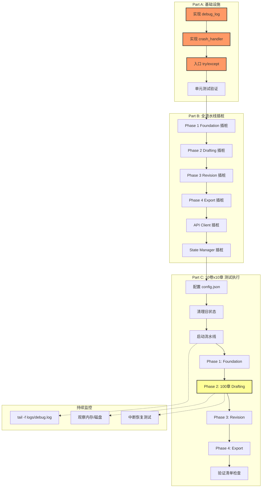

# 📋 冒烟测试方案：10卷 × 10章 全流水线插桩

> **目的**: 用真实 API 跑通 **10 卷 × 10 章 = 100 章**完整流水线，验证大规模多卷架构端到端稳定性。
> **核心要求**: 全流水线插桩，所有日志写入 `logs/debug.log`，每行 flush，崩溃信息完整捕获。
> **前置**: 插桩基础设施（`debug_log` / `crash_handler`）必须先于测试执行完成实现。
> **对比**: 
> - [`smoke_test_real_api_plan.md`](smoke_test_real_api_plan.md) — 1卷×3章
> - [`smoke_test_3vol_2ch_plan.md`](smoke_test_3vol_2ch_plan.md) — 3卷×2章
> - **本方案** — 10卷×10章（首次大规模压力验证）

---

## 与现有冒烟测试的关键差异

| 维度 | 1卷×3章 | 3卷×2章 | **10卷×10章（本方案）** |
|------|---------|---------|------------------------|
| 总章节数 | 3 | 6 | **100** |
| 卷级大纲复杂度 | 低 | 中 | **极高（10卷独立弧线）** |
| 章节编号范围 | ch_01~ch_03 | ch_01~ch_06 | **ch_01~ch_100** |
| 卷间边界数 | 0 | 2 | **9** |
| API 调用预估 | 30-60 次 | 50-90 次 | **400-800 次** |
| 费用预估 | ¥0.5-2 | ¥1-4 | **¥15-50** |
| 耗时预估 | 15-45 min | 30-90 min | **4-12 小时** |
| 插桩日志行数 | ~200 行 | ~400 行 | **~5000-10000 行** |
| 中断恢复压力 | 无 | 低 | **高（必须可靠）** |

---

## ⚠️ 关键发现：插桩基础设施尚未实现

经代码审查确认：

| # | 组件 | 当前状态 | 说明 |
|---|------|----------|------|
| 1 | `debug_log()` | ❌ **不存在** | 测试文件 `from core.diagnostic import debug_log` 会失败 |
| 2 | `crash_handler()` | ❌ **不存在** | 同上 |
| 3 | `DEBUG_LOG_PATH` | ❌ **不存在** | 测试 conftest 中引用了 `mod.DEBUG_LOG_PATH` |
| 4 | `_DEBUG_CLEARED` | ❌ **不存在** | 同上 |
| 5 | 现有 `diag()` | ✅ 存在 | 写入 `logs/diagnostic.log` + stderr 输出，不是 `debug.log` |
| 6 | 入口 try/except | ❌ **不存在** | [`main()`](pipeline_orchestrator.py:1010) 没有 try/except 包裹 |

**结论**: 必须先在 [`core/diagnostic.py`](core/diagnostic.py:1) 中实现 `debug_log()` 和 `crash_handler()`，再在 [`pipeline_orchestrator.py`](pipeline_orchestrator.py:1010) 中添加入口崩溃捕获，然后才能执行本测试方案。

---

## Part A — 插桩日志基础设施实现

### A.1 `debug_log()` 函数规格

**文件**: [`core/diagnostic.py`](core/diagnostic.py:1)（追加到现有 `diag()` 之后）

```python
# 模块级变量
DEBUG_LOG_PATH = Path(__file__).parent.parent / "logs" / "debug.log"
_DEBUG_CLEARED = False

def _debug_ensure():
    """确保 logs/ 目录存在，首次写入时清空旧日志。"""
    global _DEBUG_CLEARED
    DEBUG_LOG_PATH.parent.mkdir(parents=True, exist_ok=True)
    if not _DEBUG_CLEARED:
        DEBUG_LOG_PATH.write_text("", encoding="utf-8")
        _DEBUG_CLEARED = True

def debug_log(event: str, detail: str = "", data: dict = None):
    """写入一行插桩日志到 logs/debug.log，立即 flush。

    Args:
        event:  事件码，如 "PIPELINE_START" / "PHASE_ENTER" / "CHAPTER_DRAFT"
        detail: 人类可读的上下文描述
        data:   可选的 key=value 字典（值自动截断到 200 字符）

    格式: [HH:MM:SS.mmm] [EVENT] [filename:lineno funcname] detail | k=v, ...
    
    关键约束:
    - 不输出到 stderr（与 diag() 的区别）
    - 每行写入后立即 f.flush()
    - 自动创建 logs/ 目录
    """
    ts = datetime.now().strftime("%H:%M:%S.%f")[:-3]
    
    # 获取调用者信息（debug_log 的调用者，即业务代码位置）
    try:
        frame = sys._getframe(1)
        fname = Path(frame.f_code.co_filename).name
        lineno = frame.f_lineno
        func = frame.f_code.co_name
        caller = f"{fname}:{lineno} {func}"
    except Exception:
        caller = "?:?"
    
    parts = [f"[{ts}] [{event}] [{caller}]"]
    if detail:
        parts.append(detail)
    if data:
        items = [f"{k}={_safe(v)}" for k, v in data.items()]
        parts.append(" | " + ", ".join(items))
    
    line = "".join(parts) + "\n"
    _debug_ensure()
    with open(DEBUG_LOG_PATH, "a", encoding="utf-8") as f:
        f.write(line)
        f.flush()
    # ★ 注意：不输出到 stderr
```

**复用**：`_safe()` 和 `_ts()` 可从现有 `diag()` 中复用。

### A.2 `crash_handler()` 函数规格

**文件**: [`core/diagnostic.py`](core/diagnostic.py:1)（追加）

```python
def crash_handler(state: dict = None):
    """捕获当前异常并写入 [CRASH] 格式日志到 debug.log。

    必须在 except 块中调用，使用 sys.exc_info() 获取异常信息。
    
    Args:
        state: 可选的当前状态字典。None 时省略第三行。

    输出格式:
        [CRASH] 崩溃时间：2026-07-07 15:30:45
        [CRASH] 崩溃原因：ValueError: 模拟致命错误
        [CRASH] 崩溃时的state：{"phase": "drafting", "iteration": 3, ...}
    """
    import traceback
    import json as _json
    
    crash_time = datetime.now().strftime("%Y-%m-%d %H:%M:%S")
    exc_type, exc_value, exc_tb = sys.exc_info()
    
    if exc_type and exc_value:
        crash_reason = f"{exc_type.__name__}: {exc_value}"
        crash_traceback = "".join(traceback.format_tb(exc_tb))
    else:
        crash_reason = "未知崩溃（exc_info 为空）"
        crash_traceback = ""
    
    # 确保 logs/ 目录存在
    DEBUG_LOG_PATH.parent.mkdir(parents=True, exist_ok=True)
    
    lines = []
    lines.append(f"[CRASH] 崩溃时间：{crash_time}\n")
    lines.append(f"[CRASH] 崩溃原因：{crash_reason}\n")
    if crash_traceback:
        lines.append(f"[CRASH] 调用栈：\n{crash_traceback}")
    if state is not None:
        try:
            state_str = _json.dumps(state, ensure_ascii=False, default=str)
        except Exception:
            state_str = str(state)
        lines.append(f"[CRASH] 崩溃时的state：{state_str}\n")
    
    with open(DEBUG_LOG_PATH, "a", encoding="utf-8") as f:
        for line in lines:
            f.write(line)
        f.flush()
```

### A.3 入口 try/except 包裹

**文件**: [`pipeline_orchestrator.py`](pipeline_orchestrator.py:1010)

修改 `main()` 函数，在 `run_pipeline()` 调用外层添加 try/except：

```python
def main():
    parser = argparse.ArgumentParser(...)
    args = parser.parse_args()
    
    try:
        run_pipeline(mode=args.mode, max_cycles=args.max_cycles)
    except KeyboardInterrupt:
        print("\n⚠ 用户中断", file=sys.stderr)
        sys.exit(130)
    except Exception:
        from core.diagnostic import crash_handler
        # 尝试加载 state 以记录崩溃上下文
        try:
            from core.state_manager import load_state
            state = load_state()
        except Exception:
            state = None
        crash_handler(state)
        print("\n❌ 流水线崩溃！详情见 logs/debug.log 末尾 [CRASH] 记录", file=sys.stderr)
        import traceback
        traceback.print_exc()
        sys.exit(1)
```

---

## Part B — 全流水线插桩点清单

以下列出需要在各模块中添加 `debug_log()` 调用的所有关键位置。

### B.1 流水线编排器 [`pipeline_orchestrator.py`](pipeline_orchestrator.py:1)

| # | 插桩点 | 事件码 | 位置 | 参数 |
|---|--------|--------|------|------|
| 1 | 流水线启动 | `PIPELINE_START` | [`run_pipeline()`](pipeline_orchestrator.py:903) 入口 | mode, total_volumes, total_chapters |
| 2 | 进入 Phase | `PHASE_ENTER` | 各 `run_*()` 入口 | phase_name, state 摘要 |
| 3 | 退出 Phase | `PHASE_EXIT` | 各 `run_*()` 返回前 | phase_name, score, elapsed |
| 4 | 流水线完成 | `PIPELINE_END` | [`run_pipeline()`](pipeline_orchestrator.py:903) 末尾 | total_chapters, total_words, novel_score, elapsed |
| 5 | 状态保存 | `STATE_SAVE` | 每次 `save_state()` 调用后 | phase, chapters_drafted, iteration |
| 6 | Git 提交 | `GIT_COMMIT` | 每次 `git_add_commit()` 后 | message, hash |
| 7 | 阶段异常 | `PHASE_ERROR` | [`run_pipeline()`](pipeline_orchestrator.py:903) 中各 phase 的 except | phase, error |

### B.2 Phase 1 — Foundation [`pipeline_orchestrator.py`](pipeline_orchestrator.py:58)

| # | 插桩点 | 事件码 | 位置 | 参数 |
|---|--------|--------|------|------|
| 8 | 迭代开始 | `FOUNDATION_ITER` | 每次迭代循环 | iteration, max_iters, best_score |
| 9 | 生成世界观 | `GEN_WORLD` | [`generate_world()`](pipeline_orchestrator.py:86) 前后 | — |
| 10 | 生成角色 | `GEN_CHARACTERS` | [`generate_characters()`](pipeline_orchestrator.py:91) 前后 | — |
| 11 | 生成卷级总纲 | `GEN_OUTLINE_VOL` | [`generate_volume_outline()`](pipeline_orchestrator.py:98) 前后 | total_volumes |
| 12 | 生成大纲 | `GEN_OUTLINE` | [`generate_outline()`](pipeline_orchestrator.py:107) 前后 | — |
| 13 | 生成大纲 Part 2 | `GEN_OUTLINE_P2` | [`generate_outline_part2()`](pipeline_orchestrator.py:112) 前后 | — |
| 14 | 生成正典 | `GEN_CANON` | [`generate_canon()`](pipeline_orchestrator.py:117) 前后 | entry_count |
| 15 | 生成文风 | `GEN_VOICE` | [`generate_voice()`](pipeline_orchestrator.py:135) 前后 | — |
| 16 | 评估基础构建 | `FOUNDATION_EVAL` | [`evaluate_foundation_stable()`](pipeline_orchestrator.py:139) 后 | score, lore_score, best_score |
| 17 | 保留/丢弃决策 | `FOUNDATION_DECISION` | 评分比较后 | decision, score, best_score |
| 18 | 阈值检查 | `FOUNDATION_THRESHOLD` | 退出条件检查 | score, threshold, passed |

### B.3 Phase 2 — Drafting [`pipeline_orchestrator.py`](pipeline_orchestrator.py:185)

| # | 插桩点 | 事件码 | 位置 | 参数 |
|---|--------|--------|------|------|
| 19 | 章节起草开始 | `CHAPTER_START` | 每章循环开始 | chapter, total, volume |
| 20 | 起草尝试 | `CHAPTER_ATTEMPT` | 每次 attempt | chapter, attempt, max_attempts |
| 21 | LLM 起草调用 | `CHAPTER_LLM` | [`draft_chapter()`](pipeline_orchestrator.py:210) 前后 | chapter, model, tokens |
| 22 | 章节评估 | `CHAPTER_EVAL` | [`evaluate_chapter()`](pipeline_orchestrator.py:225) 后 | chapter, score, slop_penalty |
| 23 | Slop 惩罚触发 | `CHAPTER_SLOP` | slop_fail 条件触发 | chapter, slop_penalty, threshold |
| 24 | 反模式审计 | `CHAPTER_ANTIPATTERN` | [`run_structural_audit()`](pipeline_orchestrator.py:290) 后 | chapter, warning_count |
| 25 | 文风指纹检查 | `CHAPTER_VOICE_FP` | [`analyze_chapter_zh()`](pipeline_orchestrator.py:259) 后 | chapter, dialogue_ratio, em_dash |
| 26 | 正典增量更新 | `CANON_UPDATE` | [`update_canon_from_chapter()`](pipeline_orchestrator.py:317) 后 | chapter, new_entries |
| 27 | 章节通过 | `CHAPTER_PASS` | score >= threshold | chapter, score, word_count, attempt |
| 28 | 章节丢弃 | `CHAPTER_DISCARD` | score < threshold | chapter, score, attempt |
| 29 | 章节尽力而为 | `CHAPTER_FORCED` | 全部尝试失败 | chapter, max_attempts |
| 30 | 起草阶段完成 | `DRAFTING_DONE` | [`run_drafting()`](pipeline_orchestrator.py:185) 末尾 | total_chapters, total_words, canon_entries |

### B.4 Phase 3 — Revision [`pipeline_orchestrator.py`](pipeline_orchestrator.py:532)

| # | 插桩点 | 事件码 | 位置 | 参数 |
|---|--------|--------|------|------|
| 31 | 修订循环开始 | `REVISION_CYCLE` | 每次 cycle | cycle, max_cycles, prev_score |
| 32 | 对抗性编辑 | `ADVERSARIAL_EDIT` | [`run_adversarial_edit()`](pipeline_orchestrator.py:561) 前后 | target, retries |
| 33 | 机械裁剪 | `APPLY_CUTS` | [`run_apply_cuts()`](pipeline_orchestrator.py:567) 前后 | target, rules |
| 34 | 读者评审团 | `READER_PANEL` | [`run_reader_panel()`](pipeline_orchestrator.py:573) 前后 | retries |
| 35 | 共识问题发现 | `CONSENSUS_ITEMS` | 共识解析后 | count, chapters |
| 36 | 针对性修订-单章 | `TARGETED_REVISE` | 每章修订 | chapter, question, pre_score |
| 37 | 针对性修订-结果 | `TARGETED_REVISE_RESULT` | 修订后 | chapter, pre_score, post_score, decision |
| 38 | 全文评估 | `FULL_EVAL` | [`evaluate_full()`](pipeline_orchestrator.py:633) 前后 | novel_score |
| 39 | 平台期检测 | `PLATEAU_DETECT` | 平台期条件触发 | delta, threshold |
| 40 | 审阅修订-轮次 | `REVIEW_ROUND` | 审阅修订每轮 | round, max_rounds |
| 41 | 深度审阅 | `DEEP_REVIEW` | [`run_review_loop()`](pipeline_orchestrator.py:746) 前后 | stars, major_items, weak_chapters |
| 42 | 审阅-修订单章 | `REVIEW_REVISE` | 审阅后逐章修订 | chapter, round |
| 43 | 修订阶段完成 | `REVISION_DONE` | [`run_revision()`](pipeline_orchestrator.py:532) 末尾 | cycles, novel_score |

### B.5 Phase 4 — Export [`pipeline_orchestrator.py`](pipeline_orchestrator.py:850)

| # | 插桩点 | 事件码 | 位置 | 参数 |
|---|--------|--------|------|------|
| 44 | 重建大纲 | `EXPORT_OUTLINE` | [`build_outline()`](pipeline_orchestrator.py:857) 前后 | — |
| 45 | 弧线摘要 | `EXPORT_ARC` | [`build_arc_summary()`](pipeline_orchestrator.py:865) 前后 | — |
| 46 | 拼接手稿 | `EXPORT_MANUSCRIPT` | [`build_manuscript()`](pipeline_orchestrator.py:873) 前后 | chapter_count, total_words |
| 47 | 导出完成 | `EXPORT_DONE` | [`run_export()`](pipeline_orchestrator.py:850) 末尾 | chapter_count, total_words |

### B.6 API 客户端 [`core/api_client.py`](core/api_client.py:1)

| # | 插桩点 | 事件码 | 位置 | 参数 |
|---|--------|--------|------|------|
| 48 | API 调用开始 | `API_CALL` | `call_llm()` 入口 | model, phase, tokens_estimate |
| 49 | API 调用成功 | `API_SUCCESS` | 正常返回后 | model, latency, tokens_used |
| 50 | API 速率限制等待 | `API_RATE_WAIT` | 速率限制等待时 | wait_seconds |
| 51 | API 重试 | `API_RETRY` | 重试逻辑中 | attempt, max_retries, error |
| 52 | API 调用失败 | `API_FAIL` | 最终失败 | model, error, attempts |

### B.7 状态管理 [`core/state_manager.py`](core/state_manager.py:1)

| # | 插桩点 | 事件码 | 位置 | 参数 |
|---|--------|--------|------|------|
| 53 | 状态加载 | `STATE_LOAD` | [`load_state()`](core/state_manager.py:93) 后 | phase, chapters_drafted |
| 54 | 状态保存 | `STATE_SAVE` | [`save_state()`](core/state_manager.py:100) 后 | 与 B.1#5 重复，仅保留一处 |
| 55 | Git 备份 | `GIT_BACKUP` | `git_add_commit()` | message, short_hash |
| 56 | 文件备份 | `FILE_BACKUP` | `backup_snapshot()` | backup_name |
| 57 | 备份恢复 | `BACKUP_RESTORE` | `restore_latest()` 或 `git_reset_hard()` | source |

### B.8 各 Foundation 子模块

| # | 插桩点 | 事件码 | 模块 | 参数 |
|---|--------|--------|------|------|
| 58 | 世界观生成 | `WORLD_GEN` | [`foundation/gen_world.py`](foundation/gen_world.py) | attempt |
| 59 | 角色生成 | `CHAR_GEN` | [`foundation/gen_characters.py`](foundation/gen_characters.py) | character_count |
| 60 | 卷大纲生成 | `VOL_OUTLINE_GEN` | [`foundation/gen_outline_volume.py`](foundation/gen_outline_volume.py) | volume_count |
| 61 | 章大纲生成(逐卷) | `CH_OUTLINE_GEN` | [`foundation/gen_outline.py`](foundation/gen_outline.py) | volume, chapter_count |
| 62 | 正典生成 | `CANON_GEN` | [`foundation/gen_canon.py`](foundation/gen_canon.py) | entry_count |
| 63 | 文风生成 | `VOICE_GEN` | [`foundation/gen_voice.py`](foundation/gen_voice.py) | rules_count |

### B.9 Drafting 子模块

| # | 插桩点 | 事件码 | 模块 | 参数 |
|---|--------|--------|------|------|
| 64 | 章节起草 | `DRAFT_CHAPTER` | [`drafting/draft_chapter.py`](drafting/draft_chapter.py) | chapter, word_count |
| 65 | 批量起草 | `DRAFT_BATCH` | [`drafting/run_drafts.py`](drafting/run_drafts.py) | start_ch, end_ch |

### B.10 文件 I/O 关键操作

| # | 插桩点 | 事件码 | 场景 | 参数 |
|---|--------|--------|------|------|
| 66 | 文件写入 | `FILE_WRITE` | 任何输出文件写入后 | path, size_bytes |
| 67 | 文件删除 | `FILE_DELETE` | 删除坏章节 | path, reason |
| 68 | 目录创建 | `DIR_CREATE` | mkdir 操作 | path |

> **注意**: B.10 的插桩点较细粒度，优先实现 B.1-B.9；B.10 在时间允许时补充。

---

## Part C — 10卷×10章 测试方案

### C.1 前置条件

#### C.1.1 Part A + Part B 实现完成

确保以下代码已就绪并通过单元测试：
- `debug_log()` 和 `crash_handler()` 在 [`core/diagnostic.py`](core/diagnostic.py:1) 中实现
- 入口 try/except 在 [`pipeline_orchestrator.py`](pipeline_orchestrator.py:1010) 中添加
- Part B 中列出的所有插桩点已添加 `debug_log()` 调用

#### C.1.2 API Key 配置

编辑 `.env` 文件：

```env
# 必填
AUTONOVEL_API_KEY=你的真实API密钥
AUTONOVEL_API_BASE_URL=https://api.siliconflow.cn/v1
AUTONOVEL_MODEL_NAME=deepseek-ai/DeepSeek-V3

# 大规模测试：适度增大间隔防止限流
AUTONOVEL_API_INTERVAL_SECONDS=5
```

#### C.1.3 测试配置

编辑 `output/config.json`（如果不存在则新建，如果已有先备份）：

```json
{
  "story_summary": "在一个架空的东方玄幻世界中，天道崩碎化为九重碎片散落人间，每一重碎片掌管一种天地法则。主角出身于即将覆灭的没落世家，意外融合了第一重碎片「时间」，获得了短暂的预知能力——但每次使用都在消耗自己的寿命。第一卷「觉醒之卷」：发现碎片、家族覆灭、踏上征程；第二卷「试炼之卷」：进入修炼圣地，结识同伴，面对第一次重大抉择；第三卷「阴影之卷」：暗势力浮现，背叛与牺牲；第四卷「联盟之卷」：联合各方势力，建立根据地；第五卷「真相之卷」：发现碎片背后的上古阴谋；第六卷「逆行」：逆流而上，突破封锁；第七卷「代价」：为力量付出巨大代价；第八卷「抉择」：在拯救世界与拯救所爱之间做选择；第九卷「终局」：最终决战的前夜；第十卷「新生」：天道重铸，新时代的黎明。",
  "genre": "玄幻",
  "total_chapters": 100,
  "total_volumes": 10,
  "chapters_per_volume": 10,
  "chapter_word_target": 2000,
  "foundation_threshold": 6.0,
  "chapter_threshold": 5.0,
  "max_foundation_iters": 2,
  "max_chapter_attempts": 3,
  "max_revision_cycles": 2,
  "max_tokens_per_call": 16000,
  "canon_min_entries": 200,
  "slop_penalty_threshold": 4.0,
  "antipattern_max_warnings": 6
}
```

> **⚠️ 重要**: 大规模测试必须降低阈值以加速通过率：
> - `foundation_threshold`: 7.5 → **6.0**
> - `chapter_threshold`: 7.0 → **5.0**  
> - `max_foundation_iters`: 20 → **2**
> - `max_revision_cycles`: 6 → **2**
> - `slop_penalty_threshold`: 3.0 → **4.0**（放宽套话容忍度）
> - `antipattern_max_warnings`: 4 → **6**（放宽反模式容忍度）

### C.2 测试执行

#### C.2.1 启动命令

```bash
# 步骤 1: 清理旧状态
# 删除 output/state.json（如果存在）
Remove-Item output/state.json -ErrorAction SilentlyContinue

# 步骤 2: 清理旧章节
Remove-Item output/chapters/ch_*.md -ErrorAction SilentlyContinue

# 步骤 3: 清理旧日志（保留历史可跳过此步）
Remove-Item logs/debug.log -ErrorAction SilentlyContinue

# 步骤 4: 启动流水线
python pipeline_orchestrator.py --mode from_scratch --max-cycles 2
```

#### C.2.2 预期流程

```
PHASE 1: FOUNDATION (基础构建) — 预计 30-60 分钟
  ├─ 迭代 1/2
  │   ├─ 生成世界观 world.md              ← API × 1-3 次
  │   ├─ 生成角色 characters.md           ← API × 1 次
  │   ├─ 生成卷级总纲 outline_volume.md    ← API × 1 次
  │   │    └─ ★ 关键: 10 卷独立主题 + 弧线
  │   ├─ 生成大纲 outline.md (逐卷)        ← API × 10 次 (每卷1次)
  │   ├─ 生成大纲 Part 2 (伏笔)            ← API × 1 次
  │   ├─ 生成正典 canon.md                ← API × 1 次
  │   ├─ 生成文风 voice.md                ← API × 1 次
  │   └─ 评估基础构建                      ← API × 3 次 (中位数)
  │       总计: ~20 次 API
  └─ 迭代 2/2（如评分不足）
      总计: ~20 次 API
  阶段总计: ~20-40 次 API

PHASE 2: DRAFTING (草拟) — 10卷 × 10章 = 100章 — 预计 3-8 小时
  ├─ 卷1: ch_01 ~ ch_10 (10章)
  │   ├─ 每章: draft + evaluate           ← API × 2-6 次/章 (含重试)
  │   └─ 每章额外: voice_fp + antipattern + canon_update
  ├─ 卷2: ch_11 ~ ch_20 (10章)
  │   └─ ★ 卷1→卷2 边界
  ├─ 卷3: ch_21 ~ ch_30 (10章)
  ├─ 卷4: ch_31 ~ ch_40 (10章)
  ├─ 卷5: ch_41 ~ ch_50 (10章)
  ├─ 卷6: ch_51 ~ ch_60 (10章)
  ├─ 卷7: ch_61 ~ ch_70 (10章)
  ├─ 卷8: ch_71 ~ ch_80 (10章)
  ├─ 卷9: ch_81 ~ ch_90 (10章)
  └─ 卷10: ch_91 ~ ch_100 (10章)
  阶段总计: ~200-600 次 API

PHASE 3: REVISION (修订) — 预计 1-2 小时
  ├─ 修订循环 1/2
  │   ├─ 对抗性编辑 (100章)              ← API × N 次
  │   ├─ 机械裁剪                        ← 纯本地
  │   ├─ 读者评审团                      ← API × N 次
  │   ├─ 共识问题针对性修订               ← API × M 次
  │   └─ 全文评估                        ← API × 1 次
  ├─ 修订循环 2/2（如未平台期）
  │   └─ ...同上
  ├─ 审阅修订闭环 (最多 4 轮)
  │   ├─ 深度审阅                        ← API × 1 次/轮
  │   ├─ 弱章修订 (每轮最多 3 章)         ← API × 3 次/轮
  │   └─ 机械清理                        ← 纯本地
  阶段总计: ~50-150 次 API

PHASE 4: EXPORT (导出) — 预计 5-10 分钟
  ├─ 从章节重建大纲                      ← 纯本地
  ├─ 构建弧线摘要                        ← 纯本地
  └─ 拼接完整手稿 manuscript.md           ← 纯本地
  阶段总计: 0 次 API

═══════════════════════════════════════
总计 API 调用: 约 300-800 次
总计耗时: 约 4-12 小时
总计费用: 约 ¥15-50（硅基流动 DeepSeek-V3）
```

### C.3 验证清单

#### C.3.1 插桩日志验证（优先级最高）

| # | 验证项 | 检查方式 | 通过标准 |
|---|--------|----------|----------|
| **LOG-1** | `logs/debug.log` 存在 | `Test-Path logs/debug.log` | 文件存在 |
| **LOG-2** | 日志非空 | `(Get-Content logs/debug.log).Count` | > 1000 行（100章规模） |
| **LOG-3** | 含所有 Phase 事件 | `Select-String "PIPELINE_START\|PHASE_ENTER\|PHASE_EXIT\|PIPELINE_END" logs/debug.log` | 全部出现 |
| **LOG-4** | 含 100 章的起草事件 | `Select-String "CHAPTER_PASS" logs/debug.log` | ≥ 100 条（每章至少1条） |
| **LOG-5** | 格式正确 `[HH:MM:SS.mmm] [EVENT] [caller]` | `Select-String "^\`[\d{2}:\d{2}:\d{2}\.\d{3}\`]" logs/debug.log` | 每行匹配 |
| **LOG-6** | 编码 UTF-8，中文不乱码 | 用 VSCode 打开查看 | 中文正常显示 |
| **LOG-7** | 时间戳严格递增 | 提取所有时间戳验证 | 单调非递减 |
| **LOG-8** | 无空行或损坏行 | 检查格式异常 | 每行包含 `[` `]` 标记 |

#### C.3.2 崩溃恢复验证

| # | 验证项 | 检查方式 | 通过标准 |
|---|--------|----------|----------|
| **CR-1** | `[CRASH]` 格式存在（如果发生崩溃） | `Select-String "\[CRASH\]" logs/debug.log` | 三行完整 |
| **CR-2** | 崩溃后的日志不丢失 | 比较崩溃时间戳与最后日志行时间戳 | 最后日志在崩溃前 ≤1 秒 |
| **CR-3** | 恢复模式可继续 | `python pipeline_orchestrator.py --mode resume` | 从断点继续，不重复已完成工作 |

#### C.3.3 流水线完成验证

| # | 验证项 | 检查方式 | 通过标准 |
|---|--------|----------|----------|
| **PL-1** | 流水线正常结束 | 终端显示 `[DONE] 流水线完成！` | 出现 |
| **PL-2** | `output/state.json` phase=complete | `Select-String '"phase"' output/state.json` | `"phase": "complete"` |
| **PL-3** | state 中卷信息正确 | 查看 state.json | `total_volumes: 10, chapters_per_volume: 10` |
| **PL-4** | `output/manuscript.md` 存在 | `Test-Path output/manuscript.md` | True |
| **PL-5** | 手稿字数 ≥ 150,000 字 | 粗略统计 | ≥ 100章 × 1500字 |
| **PL-6** | `output/world.md` 存在且非空 | 查看文件 | 大小 > 500 字节 |
| **PL-7** | `output/characters.md` 存在且非空 | 查看文件 | 大小 > 500 字节 |
| **PL-8** | `output/outline_volume.md` 含 10 卷 | `Select-String "第.*卷" output/outline_volume.md` | ≥ 10 条匹配 |
| **PL-9** | `output/outline.md` 含 100 章大纲 | 查看文件 | 章大纲条目 ≥ 100 |
| **PL-10** | `output/canon.md` 条目 ≥ 200 | 统计 `###` 标题数 | ≥ 200 |
| **PL-11** | `output/voice.md` 存在且非空 | 查看文件 | 大小 > 300 字节 |
| **PL-12** | `output/chapters/` 含 100 个文件 | `(Get-ChildItem output/chapters/ch_*.md).Count` | = 100 |
| **PL-13** | 章节编号连续 ch_01 ~ ch_100 | 列出文件 | 无缺失、无跳跃 |

#### C.3.4 多卷特有验证

| # | 验证项 | 检查方式 | 通过标准 |
|---|--------|----------|----------|
| **MV-1** | 卷级大纲结构完整 | 查看 `outline_volume.md` | 10 卷各有主题、弧线描述 |
| **MV-2** | 卷间章节连贯性 | 抽查 ch_10→ch_11, ch_20→ch_21, ..., ch_90→ch_91 | 9 个卷边界过渡合理 |
| **MV-3** | 每卷内部连贯 | 抽查每卷 ch_N1→ch_N2 | 同卷相邻章情节连贯 |
| **MV-4** | 卷主题区分度 | 对比卷1和卷10的章节 | 不应雷同，应有弧线推进 |
| **MV-5** | 章节编号无跳跃 | `ls output/chapters/` | ch_01~ch_100 连续 |
| **MV-6** | 卷号计算正确 | ch_01~ch_10→卷1, ch_11~ch_20→卷2, ... | 无误 |

#### C.3.5 大规模特有压力验证

| # | 验证项 | 检查方式 | 通过标准 |
|---|--------|----------|----------|
| **SC-1** | 内存无泄漏 | 观察进程内存 | 全程 ≤ 2GB，无持续增长 |
| **SC-2** | 磁盘空间充足 | `output/` 目录大小 | ≤ 5GB |
| **SC-3** | `state.json` 无膨胀 | 文件大小 | ≤ 10KB（仅存元数据） |
| **SC-4** | `results.tsv` 行数正确 | 统计行数 | ≥ 100 行（每章一条记录） |
| **SC-5** | 日志文件大小可控 | `logs/debug.log` 大小 | ≤ 50MB（100章规模） |
| **SC-6** | API 速率限制未触发 429 风暴 | `Select-String "429\|RATE_LIMIT" logs/debug.log` | 429 出现次数 ≤ 10 |

### C.4 中断恢复测试（推荐执行）

由于 10卷×10章 耗时很长，建议在测试过程中 **主动测试中断恢复**：

| # | 中断时机 | 操作 | 验证 |
|---|----------|------|------|
| 1 | 起草到 ch_30 时 Ctrl+C | `python pipeline_orchestrator.py --mode resume` | 从 ch_31 继续 |
| 2 | 修订循环中 Ctrl+C | `python pipeline_orchestrator.py --mode resume` | 从当前循环继续 |
| 3 | 模拟崩溃（杀进程） | 检查 `logs/debug.log` 末尾 | 最后日志时间戳与崩溃时间匹配 |

### C.5 异常场景处理

#### C.5.1 流水线中途崩溃

```
❌ 终端显示 "阶段 XX 致命错误: XXX"

操作:
1. 打开 logs/debug.log，搜索 "[CRASH]" 
2. 查看崩溃原因和崩溃时的 state
3. 根据原因修复后，运行:
   python pipeline_orchestrator.py --mode resume
4. 流水线从断点继续，不重复已完成的工作
5. 验证 resume 后日志文件继续追加（不清空）
```

#### C.5.2 API 频繁 429（限流）

```
症状: 反复看到 "[API] 429 速率限制，额外等待 XXs"

操作:
1. 增大 .env 中的 AUTONOVEL_API_INTERVAL_SECONDS (如改为 8-10)
2. 或换用另一个 API 提供商
3. 检查 Select-String "429" logs/debug.log 统计频率
```

#### C.5.3 单章反复重试失败

```
症状: 某章 3 次 attempt 全部失败，最终 forced

操作:
1. 检查该章的 eval_logs 中最新的评估 JSON
2. 查看具体评分维度和 slop_penalty
3. 如可能，手动调整 config.json 中相关阈值
4. 或接受 forced 结果，在 revision 阶段修复
```

#### C.5.4 磁盘空间不足

```
症状: 文件写入失败，OSError

预防:
- 确保至少 10GB 可用磁盘空间
- 定期检查 output/ 和 logs/ 目录大小
- 100 章 × 2000 字 ≈ 200KB/章 → 总共约 20MB 章节文件
- 加上 canon.md、outline.md 等 → 总额 ≤ 100MB
```

---

## 测试执行流程图



> 橙色节点为本次测试的**阻塞性前置任务**；黄色节点为**核心压力测试阶段**。

---

## 成功标准

| 级别 | 标准 |
|------|------|
| **及格** | Part A+B 实现完成 + 流水线跑完 Phase 1→2→3→4 无崩溃 + manuscript.md 生成 + 100 章文件全部存在 |
| **良好** | 及格 + logs/debug.log 含全部插桩事件 + 100 章字数均 > 1500 字 + 10 卷大纲完整 + 中断恢复可用 |
| **优秀** | 良好 + 故事连贯可读 + 角色跨卷一致 + 10 卷主题区分明显 + 日志完整无缺失 + 所有验证项通过 |

**目标：达到「良好」级别。**

---

## 执行记录模板

```
测试日期: _____
API 提供商: _____ (硅基流动 / DeepSeek / 其他)
模型: _____
配置: 10 卷 × 10 章 = 100 章
总耗时: _____ 小时
API 调用次数: _____ 次
总费用: ¥_____ 

Phase 1 耗时: _____ 基础评分: _____  迭代次数: _____
Phase 2 耗时: _____ 
  章节通过率: _____ / 100 (forced: _____)
  平均章节评分: _____
Phase 3 耗时: _____ 循环次数: _____ 小说评分: _____
Phase 4 耗时: _____ 总字数: _____ 

卷级大纲: ☐ 10卷完整 ☐ 有缺失 (缺少卷: _____)
卷间连贯: ☐ 良好 ☐ 有断裂 (断裂位置: _____)
崩溃次数: _____
中断恢复测试: ☐ 通过 ☐ 未测试 ☐ 失败
日志完整性: ☐ 完整 ☐ 有缺失 (缺失事件: _____)

插桩事件统计:
  PIPELINE_START: _____  PHASE_ENTER: _____  PHASE_EXIT: _____
  CHAPTER_START: _____  CHAPTER_PASS: _____  CHAPTER_DISCARD: _____
  API_CALL: _____  API_SUCCESS: _____  API_FAIL: _____
  [CRASH]: _____  总日志行数: _____

内容质量: ☐ 优秀 ☐ 良好 ☐ 及格 ☐ 不及格
备注: _____
```

---

## 附录：插桩日志事件码速查

| 分类 | 事件码 | 含义 |
|------|--------|------|
| 流水线 | `PIPELINE_START` / `PIPELINE_END` | 流水线启停 |
| 阶段 | `PHASE_ENTER` / `PHASE_EXIT` / `PHASE_ERROR` | 阶段进入/退出/异常 |
| Foundation | `FOUNDATION_ITER` / `GEN_WORLD` / `GEN_CHARACTERS` / `GEN_OUTLINE_VOL` / `GEN_OUTLINE` / `GEN_OUTLINE_P2` / `GEN_CANON` / `GEN_VOICE` / `FOUNDATION_EVAL` / `FOUNDATION_DECISION` / `FOUNDATION_THRESHOLD` | 基础构建各步骤 |
| Drafting | `CHAPTER_START` / `CHAPTER_ATTEMPT` / `CHAPTER_LLM` / `CHAPTER_EVAL` / `CHAPTER_SLOP` / `CHAPTER_ANTIPATTERN` / `CHAPTER_VOICE_FP` / `CANON_UPDATE` / `CHAPTER_PASS` / `CHAPTER_DISCARD` / `CHAPTER_FORCED` / `DRAFTING_DONE` | 章节起草各步骤 |
| Revision | `REVISION_CYCLE` / `ADVERSARIAL_EDIT` / `APPLY_CUTS` / `READER_PANEL` / `CONSENSUS_ITEMS` / `TARGETED_REVISE` / `TARGETED_REVISE_RESULT` / `FULL_EVAL` / `PLATEAU_DETECT` / `REVIEW_ROUND` / `DEEP_REVIEW` / `REVIEW_REVISE` / `REVISION_DONE` | 修订各步骤 |
| Export | `EXPORT_OUTLINE` / `EXPORT_ARC` / `EXPORT_MANUSCRIPT` / `EXPORT_DONE` | 导出各步骤 |
| API | `API_CALL` / `API_SUCCESS` / `API_RATE_WAIT` / `API_RETRY` / `API_FAIL` | API 调用生命周期 |
| 状态 | `STATE_LOAD` / `STATE_SAVE` / `GIT_COMMIT` / `FILE_BACKUP` / `BACKUP_RESTORE` | 状态管理操作 |
| 崩溃 | `[CRASH]` | 崩溃记录（由 crash_handler 写入） |

---

*本方案为 autonovel-zh 10卷×10章 大规模冒烟测试专用。*
*与 [`smoke_test_real_api_plan.md`](smoke_test_real_api_plan.md) 和 [`smoke_test_3vol_2ch_plan.md`](smoke_test_3vol_2ch_plan.md) 互补，按规模递增执行。*
