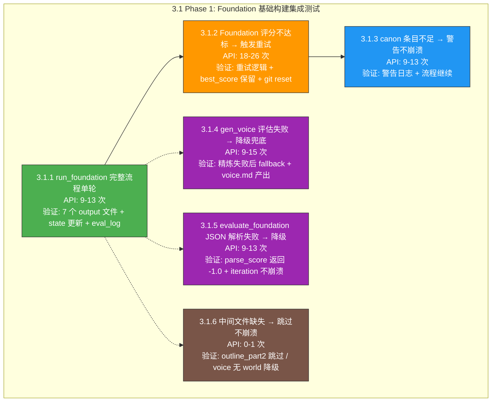

# 3.1 Phase 1 集成测试 — Foundation（基础构建）详细执行方案

> 版本：v1.0  
> 日期：2026-06-20  
> 目标：使用真实 API 验证 [`run_foundation()`](pipeline_orchestrator.py:58) 完整流程，确保全部 7 个 output 文件产出，评估→保留/丢弃→阈值退出逻辑正确  
> 配置：`total_chapters=3`, `total_volumes=1`, `max_foundation_iters=1`, `foundation_threshold=1.0`（极低阈值确保单轮通过）  
> 通过标准：100% 用例通过，0 阶段崩溃，0 未捕获异常

---

## 前置条件

### 环境要求

| 配置项 | 值 |
|--------|-----|
| Python | ≥ 3.9 |
| API 端点 | `https://api.siliconflow.cn/v1` |
| 写作模型 | `deepseek-ai/DeepSeek-V4-Flash` |
| 裁判模型 | 同写作模型（`AUTONOVEL_JUDGE_API_KEY` 不配时回退共用 Key） |
| 故事梗概 | `2049年上海，程序员在维护老旧服务器时发现AI觉醒迹象，36小时倒计时` |
| API 间隔 | ≥ 4 秒 |
| `total_chapters` | 3 |
| `total_volumes` | 1 |
| `max_foundation_iters` | 1 |
| `foundation_threshold` | 1.0（极低，确保单轮通过） |

### 必须修复的阻塞项（Stage 1 + Stage 2 BUG）

进入 Phase 1 集成测试前，以下 BUG 必须已在源码中修复：

| BUG ID | 严重度 | 描述 | 修复位置 |
|--------|--------|------|---------|
| **BUG-S1-01** | 🔴 高 | 6 处 PEP 604 `str \| None` 语法 → Python 3.9 不兼容 | [`evaluation/evaluate.py:274,314`](evaluation/evaluate.py:274) / [`novel_app.py:110,121`](novel_app.py:110) / [`seed.py:166,177`](seed.py:166) → `Optional[str]` |
| **BUG-S1-07** | 🟡 中 | `default_state()` 缺失 `review_revision_round` 字段 | [`core/state_manager.py:90`](core/state_manager.py:90) 已确认包含 ✅ |
| **BUG-S2-01** | 🟡 中 | `load_state()` 对非法 JSON 无 `JSONDecodeError` 保护 | [`core/state_manager.py:97`](core/state_manager.py:97) 需添加 `try/except JSONDecodeError` |

### 建议修复项

| BUG ID | 严重度 | 描述 |
|--------|--------|------|
| **BUG-S2-03** | 🟡 中 | [`foundation/gen_voice.py:181`](foundation/gen_voice.py:181) `except Exception: pass` → 应至少 `print(..., file=sys.stderr)` |

### 环境准备命令

```powershell
# 1. 确保 .env 配置正确
#    AUTONOVEL_API_KEY=sk-xxxxxxxx
#    AUTONOVEL_API_BASE_URL=https://api.siliconflow.cn/v1
#    AUTONOVEL_MODEL_NAME=deepseek-ai/DeepSeek-V4-Flash
#    AUTONOVEL_API_INTERVAL_SECONDS=4

# 2. 确保依赖安装
uv sync

# 3. 清理旧 output（可选）
# Remove-Item -Recurse -Force output\ -ErrorAction SilentlyContinue

# 4. 写入 config.json（故事梗概 + 最小配置）
# python -c "from core.config import config; config.save({'story_summary': '...', 'total_chapters': 3, 'total_volumes': 1, 'foundation_threshold': 1.0})"

# 5. 运行 Phase 1 集成测试
python tests/stage3_integration_tests.py --phase 1
```

---

## 测试总览



### API 调用预算

| 测试项 | 最低调用 | 最高调用 | 说明 |
|--------|---------|---------|------|
| 3.1.1 完整流程单轮 | 9 | 13 | `gen_voice` 分值路径决定 |
| 3.1.2 重试逻辑 | 18 | 26 | 2 轮完整迭代 |
| 3.1.3 canon 不足 | 9 | 13 | Mock 注入空 canon |
| 3.1.4 voice 降级 | 9 | 15 | 含 2 轮精炼 + fallback |
| 3.1.5 eval 解析失败 | 9 | 13 | Mock 注入非法 JSON |
| 3.1.6 中间文件缺失 | 0 | 1 | 仅 outline_part2 调用 |

### 执行顺序

```
3.1.6 (文件缺失降级) → 3.1.1 (完整流程) → 3.1.3 (canon 不足) 
    → 3.1.4 (voice 降级) → 3.1.5 (eval 降级) → 3.1.2 (重试逻辑)
```

**原则**：先验证降级路径（低风险、快速失败），再验证核心流程，最后验证重试逻辑（高 API 消耗）。

---

## 3.1.1 `run_foundation()` 完整流程单轮

> **核心测试** — 验证 Foundation 阶段全部 7 个 output 文件产出 + state 正确更新 + eval_log 保存。  
> 此项是 Phase 2/3/4 的前置依赖，必须首先通过。

### 测试信息

| 项目 | 内容 |
|------|------|
| **测试方法** | 调用 [`pipeline_orchestrator.run_foundation(state)`](pipeline_orchestrator.py:58)，执行完整 Foundation 1 轮 |
| **前置条件** | ① `output/config.json` 已写入（含 `story_summary` + `total_chapters=3` + `total_volumes=1` + `foundation_threshold=1.0`）② `output/state.json` 为 `default_state()` 或不存在 ③ `.env` 中 API Key 有效 |
| **API 调用计数** | **9-13 次**（详见下方明细） |
| **预期行为** | 全部 7 个 output 文件产出，无异常中断，`state["phase"] == "drafting"` |

### API 调用明细（total_chapters=3, total_volumes=1, max_foundation_iters=1）

| 步骤 | 模块 | API 函数 | 次数 | 说明 |
|------|------|---------|------|------|
| 1 | [`gen_world`](foundation/gen_world.py:17) | `call_writer` | 1 | 调用 LLM 生成 [`output/world.md`](output/world.md) |
| 2 | [`gen_characters`](foundation/gen_characters.py:25) | `call_writer` | 1 | 调用 LLM 生成 [`output/characters.md`](output/characters.md) |
| 3 | [`gen_outline_volume`](foundation/gen_outline_volume.py:194) | `call_p1_writer` | 1 | 1 卷 → 单次调用生成 [`output/outline_volume.md`](output/outline_volume.md) |
| 4 | [`gen_outline`](foundation/gen_outline.py:245) | `call_p1_writer` | 1 | 3 章 ≤ 5 章阈值 → 不分段，单次调用；产出 [`output/outline_volume1.md`](output/outline_volume1.md) + 合并为 [`output/outline.md`](output/outline.md) |
| 5 | [`gen_outline_part2`](foundation/gen_outline_part2.py:24) | `call_writer` | 1 | 伏笔账本追加到 [`output/outline.md`](output/outline.md) |
| 6 | [`gen_canon`](foundation/gen_canon.py:23) | `call_writer` | 1 | 调用 LLM 生成 [`output/canon.md`](output/canon.md) |
| 7 | [`gen_voice`](foundation/gen_voice.py:226) | `call_writer` + `call_judge` | **3-5** | 见下方分路径 |
| 8 | [`evaluate_foundation`](evaluation/evaluate.py:343) | `call_judge` | 1 | 调用裁判模型评估全部 foundation 文档 |
| **合计** | | | **9-13** | |

### gen_voice 内部 API 调用路径分析

[`generate_voice()`](foundation/gen_voice.py:226) 内部有 4 个步骤，API 调用次数因 `VOICE_THRESHOLD=7.0` 判定而异：

```
Step A: generate_5_registers()     → call_writer × 1  （5 段语域试验）
Step B: evaluate_registers()       → call_judge  × 1  （裁判评估语域）
Step C: 分支：
  ├─ 评分 ≥ 7.0                  → call_writer × 1  （直接生成文风身份）
  ├─ 评分 < 7.0 → 精炼 1 轮       → call_writer × 1 + call_judge × 1 = 2
  │   └─ 精炼后 ≥ 7.0 → break
  └─ 精炼 2 轮仍 < 7.0 → fallback → call_writer × 1  （兜底直接生成）
Step D: 合并模板 Part 1 + Part 2   → 0（纯文件操作）
```

| 路径 | Step A | Step B | Step C | 总计 |
|------|--------|--------|--------|------|
| 🟢 最优（语域一次通过） | 1 | 1 | 1 (select) | **3** |
| 🟡 典型（精炼 1 轮通过） | 1 | 1 | 1 (refine) + 1 (re-eval) | **4** |
| 🟠 精炼 2 轮后 pass | 1 | 1 | 2×(refine+eval) = 4 | **6** |
| 🔴 精炼 2 轮仍 fail → fallback | 1 | 1 | 4 + 1 (fallback select) | **7** |

> 在 `max_foundation_iters=1` 配置下，gen_voice 最多消耗 **7** 次调用（含全部 fallback 路径）。但 `DeepSeek-V4-Flash` 通常评分较高，预期走 🟢 或 🟡 路径。

### 验证点

#### (a) 文件产出验证

| 文件 | 路径 | 验证条件 | 代码引用 |
|------|------|---------|---------|
| 世界观 | [`output/world.md`](output/world.md) | 文件存在，内容 ≥ 500 字，UTF-8 编码 | [`foundation/gen_world.py:39`](foundation/gen_world.py:39) |
| 角色注册表 | [`output/characters.md`](output/characters.md) | 文件存在，含 `角色` 或 `人物` 字样，≥ 2 个角色条目 | [`foundation/gen_characters.py:42`](foundation/gen_characters.py:42) |
| 卷级总纲 | [`output/outline_volume.md`](output/outline_volume.md) | 文件存在，含 `卷` 或 `Volume` 标题 | [`foundation/gen_outline_volume.py:229`](foundation/gen_outline_volume.py:229) |
| 章级大纲 | [`output/outline.md`](output/outline.md) | 文件存在，含 3 章条目（`第 1 章`/`第 2 章`/`第 3 章`） | [`foundation/gen_outline.py:275`](foundation/gen_outline.py:275) |
| 分卷大纲 | [`output/outline_volume1.md`](output/outline_volume1.md) | 文件存在（方案 D 分层大纲产物） | [`foundation/gen_outline.py:234`](foundation/gen_outline.py:234) |
| 正典 | [`output/canon.md`](output/canon.md) | 文件存在，`count_canon_entries()["total"] ≥ 3` | [`foundation/gen_canon.py:68`](foundation/gen_canon.py:68) |
| 文风定义 | [`output/voice.md`](output/voice.md) | 文件存在，含 5 段语域分析（`## Part 2`） | [`foundation/gen_voice.py:294`](foundation/gen_voice.py:294) |

#### (b) 评估日志验证

| 验证项 | 路径 | 条件 |
|--------|------|------|
| 评估 JSON 已保存 | [`output/eval_logs/foundation_*.json`](output/eval_logs/) | 文件存在，含 `raw_output` + `timestamp` 字段 |
| 评估 JSON 可解析 | 同上 | `json.load()` 不抛异常 |

#### (c) State 更新验证

| 字段 | 预期值 | 说明 |
|------|--------|------|
| `state["foundation_score"]` | `> 0` | 评估分数已写入（`parse_score()` 成功解析） |
| `state["lore_score"]` | `≥ 0` | 正典评分已写入 |
| `state["iteration"]` | `≥ 1` | 迭代计数已递增 |
| `state["phase"]` | `"drafting"` | Phase 正确切换 |
| `state["current_focus"]` | `"chapter_drafting"` | 焦点正确切换 |
| `state["chapters_total"]` | `3` | 总章节数正确（来自 config `total_chapters`） |

#### (d) 内容完整性验证

| 验证项 | 方法 | 条件 |
|--------|------|------|
| world.md 不截断 | 检查末尾是否有完整的段落结束 | 最后 200 字符不含不完整的句子 |
| characters.md 角色条目 | 正则 `[\d]+\.\s*\*{0,2}` 匹配编号列表 | ≥ 2 个条目 |
| outline.md 章节覆盖 | 正则 `第\s*\d+\s*章` 匹配 | 匹配数 = 3 |
| canon.md 格式 | 含 `## 一、世界观` / `## 二、角色` / `## 三、时间线` / `## 四、规则` | 至少 2 个节标题 |
| voice.md 结构 | 含 `### Tone` / `### Sentence Rhythm` / `### Exemplar Passages` | 至少 3 个子节 |

### 测试逻辑伪代码

```python
def test_3_1_1_foundation_full_flow_single_round(self):
    """Phase 1 完整流程单轮 — 验证全部 7 个 output 文件产出 + state 更新"""

    # ============================================================
    # 1. 前置准备：写入 config.json + 确保 state 为 default
    # ============================================================
    from core.config import config, OUTPUT_DIR, EVAL_LOGS_DIR
    from core.state_manager import default_state, load_state, save_state

    OUTPUT_DIR.mkdir(parents=True, exist_ok=True)

    config.save({
        "story_summary": self.TEST_STORY,
        "total_chapters": 3,
        "total_volumes": 1,
        "chapters_per_volume": 3,
        "foundation_threshold": 1.0,    # 极低阈值确保单轮通过
        "max_foundation_iters": 1,
    })

    # 重置 state 为 default
    state = default_state()
    save_state(state)

    # ============================================================
    # 2. 执行 run_foundation()
    # ============================================================
    from pipeline_orchestrator import run_foundation

    state = run_foundation(state)

    # ============================================================
    # 3. 验证文件产出
    # ============================================================
    expected_files = [
        "world.md",
        "characters.md",
        "outline_volume.md",
        "outline.md",
        "outline_volume1.md",
        "canon.md",
        "voice.md",
    ]
    for fname in expected_files:
        fpath = OUTPUT_DIR / fname
        self.assertTrue(fpath.exists(), f"缺失产出文件: {fname}")

    # ============================================================
    # 4. 验证内容完整性
    # ============================================================
    # 4a. world.md ≥ 500 字
    world_text = (OUTPUT_DIR / "world.md").read_text(encoding="utf-8")
    world_chars = len(world_text.replace(" ", "").replace("\n", ""))
    self.assertGreaterEqual(world_chars, 500,
        f"world.md 过短: {world_chars} 字")

    # 4b. characters.md 含角色条目
    chars_text = (OUTPUT_DIR / "characters.md").read_text(encoding="utf-8")
    self.assertTrue(
        "角色" in chars_text or "人物" in chars_text,
        "characters.md 无角色相关内容"
    )
    # 检测编号列表条目
    import re
    char_entries = len(re.findall(r'^\d+\.\s', chars_text, re.MULTILINE))
    self.assertGreaterEqual(char_entries, 1,
        f"characters.md 角色条目过少: {char_entries}")

    # 4c. outline.md 含 3 章
    outline_text = (OUTPUT_DIR / "outline.md").read_text(encoding="utf-8")
    ch_matches = len(re.findall(r'第\s*\d+\s*章', outline_text))
    self.assertGreaterEqual(ch_matches, 3,
        f"outline.md 章节条目不足: {ch_matches}（预期 ≥ 3）")

    # 4d. canon.md 条目数 ≥ 3
    from foundation.gen_canon import count_canon_entries
    canon_counts = count_canon_entries()
    self.assertGreaterEqual(canon_counts["total"], 3,
        f"canon 条目过少: {canon_counts['total']}")

    # 4e. voice.md 含 Part 2 结构
    voice_text = (OUTPUT_DIR / "voice.md").read_text(encoding="utf-8")
    voice_sections = ["Tone", "Sentence Rhythm", "Exemplar"]
    found = sum(1 for s in voice_sections if s in voice_text)
    self.assertGreaterEqual(found, 2,
        f"voice.md 结构不完整: 仅匹配 {found}/{len(voice_sections)} 个子节")

    # ============================================================
    # 5. 验证评估日志
    # ============================================================
    eval_files = list(EVAL_LOGS_DIR.glob("foundation_*.json"))
    self.assertGreater(len(eval_files), 0, "eval_logs 中无 foundation 评估 JSON")
    eval_data = json.loads(eval_files[0].read_text(encoding="utf-8"))
    self.assertIn("raw_output", eval_data, "评估 JSON 缺少 raw_output")
    self.assertIn("timestamp", eval_data, "评估 JSON 缺少 timestamp")

    # ============================================================
    # 6. 验证 state 更新
    # ============================================================
    self.assertGreater(state["foundation_score"], 0,
        "foundation_score 未写入或为 0")
    self.assertGreaterEqual(state["iteration"], 1,
        f"iteration 未递增: {state['iteration']}")
    self.assertEqual(state["phase"], "drafting",
        f"phase 未切换为 drafting: {state['phase']}")
    self.assertEqual(state["current_focus"], "chapter_drafting")
    self.assertEqual(state["chapters_total"], 3,
        f"chapters_total 不正确: {state['chapters_total']}")
```

### 代码路径追踪

```
pipeline_orchestrator.run_foundation()                          # :58
├── Config.load() → apply_model_tier_defaults()                 # :74-76
├── for i in range(1, max_iters+1):                             # :82
│   ├── foundation.gen_world.generate_world()                   # :88-89
│   │   └── call_writer(prompt, system=WORLD_SYSTEM_PROMPT)     # gen_world.py:35
│   ├── foundation.gen_characters.generate_characters()         # :93-94
│   │   └── call_writer(prompt, system=CHARACTER_SYSTEM_PROMPT) # gen_characters.py:39
│   ├── foundation.gen_outline_volume.generate_volume_outline() # :100-101
│   │   ├── _load_context() → world/chars/voice                 # gen_outline_volume.py:32
│   │   ├── _split_volumes(1) → [(1,1)]                        # gen_outline_volume.py:76-77
│   │   └── _call_volume_segment() → call_p1_writer()           # gen_outline_volume.py:162
│   ├── foundation.gen_outline.generate_outline()               # :107-108
│   │   ├── generate_outline_for_volume(1)                      # gen_outline.py:264
│   │   │   ├── _split_chapters_for_volume(1,3) → [(1,3)]      # gen_outline.py:48-50
│   │   │   └── _generate_outline_segment() → call_p1_writer()  # gen_outline.py:133
│   │   └── 合并 → output/outline.md                            # gen_outline.py:275
│   ├── foundation.gen_outline_part2.generate_outline_part2()   # :112-113
│   │   └── call_writer() → 追加 outline.md                    # gen_outline_part2.py:57
│   ├── foundation.gen_canon.generate_canon()                   # :117-118
│   │   ├── call_writer()                                      # gen_canon.py:65
│   │   └── count_canon_entries() → 检查 ≥ lore_threshold      # :121-131
│   ├── foundation.gen_voice.generate_voice()                   # :135-136
│   │   ├── generate_5_registers() → call_writer()              # gen_voice.py:130
│   │   ├── evaluate_registers() → call_judge()                 # gen_voice.py:175
│   │   ├── [if score ≥ 7.0] call_writer(select)               # gen_voice.py:264
│   │   └── [if score < 7.0] refine → re-eval → ...            # gen_voice.py:269-282
│   ├── evaluation.evaluate.evaluate_foundation()               # :140-141
│   │   └── call_judge() → eval_logs/foundation_*.json         # evaluate.py:370-382
│   ├── parse_score() / parse_lore_score()                     # :142-143
│   ├── score > best_score → git_add_commit + save_state       # :148-157
│   └── best_score >= threshold → break                        # :165-167
└── get_total_chapters() → state["chapters_total"] = 3         # :172-173
└── state["phase"] = "drafting" → save_state()                 # :174-176
```

### 门禁标准

| 门禁项 | 标准 | 不通过时 |
|--------|------|---------|
| 文件产出 | 7 个文件全部存在 | 🚫 禁止进入 3.1.2 / Phase 2 |
| foundation_score | `> 0` | 🚫 禁止进入 3.1.2 / Phase 2 |
| phase 切换 | `== "drafting"` | 🚫 禁止进入 Phase 2 |
| eval_log | `foundation_*.json` 存在且可解析 | ⚠️ 警告但允许继续 |

---

## 3.1.2 Foundation 评分 < 阈值 → 触发重试逻辑

> **重试路径测试** — 验证低分轮被丢弃（git_reset_hard）、高分轮被保留（git_add_commit）、最终 best_score 为所有轮最高分。

### 测试信息

| 项目 | 内容 |
|------|------|
| **测试方法** | 设置 `foundation_threshold=10.0`（不可达高阈值），`max_foundation_iters=2`，确保第一轮必定 < 阈值，触发第二轮 |
| **前置条件** | ① `output/config.json` 已写入 `foundation_threshold=10.0, max_foundation_iters=2` ② `output/state.json` 为 `default_state()` ③ Git 可用（或 `backup_snapshot` 模式可用） |
| **API 调用计数** | **18-26 次**（2 轮完整迭代，每轮 9-13 次） |
| **预期行为** | 两轮均执行完毕，低分轮丢弃，高分轮记录保留，最终 `iteration=2` |

### 重试逻辑关键代码路径

[`pipeline_orchestrator.py:82-169`](pipeline_orchestrator.py:82) 中的迭代循环：

```python
for i in range(iteration + 1, max_iters + 1):     # :82
    # ... 执行全部 generation + evaluation ...
    score = parse_score(eval_result, "overall_score")  # :142

    if score > best_score:                              # :148
        git_add_commit(...)                             # :149
        log_result(..., "keep", ...)                    # :152
        best_score = score                              # :154
        state["foundation_score"] = score               # :155
        save_state(state)                               # :157
    else:                                               # :158
        git_reset_hard("HEAD")                          # :160
        log_result(..., "discard", ...)                 # :161

    if best_score >= threshold:                         # :165
        break                                           # :167
else:
    step("警告: 达到最大迭代次数...")                     # :169
```

### 验证点

#### (a) 第一轮产出后被评估

| 验证项 | 方法 | 预期 |
|--------|------|------|
| 第一轮 eval_log 存在 | 检查 `EVAL_LOGS_DIR` 下 `foundation_*.json` 数量 | ≥ 1 |
| `foundation_score < 10.0` | 读 state 或 log_result 记录 | `score < 10.0` |

#### (b) 第二轮正常执行 + 迭代递增

| 验证项 | 方法 | 预期 |
|--------|------|------|
| `state["iteration"]` | `assertEqual(state["iteration"], 2)` | `2` |
| 第二轮 eval_log | ≥ 2 个 `foundation_*.json` | ≥ 2 |
| 第二轮文件更新 | `world.md` 的 `stat().st_mtime` 比第一轮晚（或内容不同） | 已更新 |

#### (c) 丢弃/保留机制正确

| 验证项 | 方法 | 预期 |
|--------|------|------|
| `results.tsv` 有 discard 记录 | 搜索 `results.tsv` 中 `discard` 行 | ≥ 1 条 |
| `results.tsv` 有 keep 记录 | 搜索 `results.tsv` 中 `keep` 行 | ≥ 1 条 |
| `best_score` 为最高分 | `state["foundation_score"]` = max(两轮分数) | 正确 |
| 最终文件为高分轮产出 | 当前文件内容与高分轮一致 | 未被低分轮覆盖 |

#### (d) git_reset_hard / restore_latest 被正确调用

| 验证项 | 方法 | 预期 |
|--------|------|------|
| 低分轮后 `git_reset_hard("HEAD")` | 检查 `run_foundation()` 日志输出 `"评分未提升"` | 日志存在 |
| 第一轮文件未被低分轮覆盖 | 若第二轮分数更低，git_reset 后文件恢复为第一轮版本 | git_reset 成功 |

### 测试逻辑伪代码

```python
def test_3_1_2_foundation_retry_on_low_score(self):
    """Phase 1 评分不达标 → 触发重试 — 验证 keep/discard 逻辑"""

    # ============================================================
    # 1. 设置不可达高阈值 + 最多 2 轮迭代
    # ============================================================
    config.save({
        "story_summary": self.TEST_STORY,
        "total_chapters": 3,
        "total_volumes": 1,
        "foundation_threshold": 10.0,   # 不可达高阈值
        "max_foundation_iters": 2,
    })

    state = default_state()
    save_state(state)

    # ============================================================
    # 2. 执行 run_foundation()
    # ============================================================
    from pipeline_orchestrator import run_foundation
    state = run_foundation(state)

    # ============================================================
    # 3. 验证迭代完成
    # ============================================================
    self.assertGreaterEqual(state["iteration"], 2,
        f"未完成 2 轮迭代: iteration={state['iteration']}")

    # ============================================================
    # 4. 验证 eval_logs（至少 2 个评估日志）
    # ============================================================
    eval_files = sorted(EVAL_LOGS_DIR.glob("foundation_*.json"))
    self.assertGreaterEqual(len(eval_files), 2,
        f"评估日志数不足: {len(eval_files)}（预期 ≥ 2）")

    # ============================================================
    # 5. 验证 results.tsv 记录
    # ============================================================
    from core.config import RESULTS_FILE
    results_text = RESULTS_FILE.read_text(encoding="utf-8") if RESULTS_FILE.exists() else ""
    self.assertIn("discard", results_text,
        "results.tsv 缺少 discard 记录")
    self.assertIn("keep", results_text,
        "results.tsv 缺少 keep 记录")

    # ============================================================
    # 6. 验证最终 state
    # ============================================================
    self.assertGreater(state["foundation_score"], 0,
        "foundation_score 未写入")
    # best_score 应该是两轮中较高的
    self.assertEqual(state["phase"], "drafting",
        f"phase 未切换: {state['phase']}")

    # ============================================================
    # 7. 验证最终文件是高分轮产物
    # ============================================================
    # 所有 output 文件存在
    for fname in ["world.md", "characters.md", "outline.md", "canon.md", "voice.md"]:
        self.assertTrue((OUTPUT_DIR / fname).exists(), f"缺失: {fname}")
```

### 补充边界测试：两轮分数相同

```python
def test_3_1_2a_equal_best_score_no_reset(self):
    """Phase 1 两轮分数相同 — 第二轮被 discard 但不影响最终结果"""
    # 此场景在第一轮分数 = 第二轮分数时触发
    # score <= best_score → git_reset_hard + log_result("discard")
    # 验证：最终 best_score 等于该分数，文件为第一轮版本
    pass  # 真实 API 场景下分数相同的概率较低，若发生则验证不崩溃
```

### 门禁标准

| 门禁项 | 标准 | 不通过时 |
|--------|------|---------|
| iteration 递增 | `≥ 2` | 🚫 禁止进入 Phase 2 |
| discard 记录 | `results.tsv` 含 `discard` | ⚠️ 警告（可能两轮分数都极高，但 threshold=10.0 下不可能） |
| 最终文件存在 | 7 个文件 | 🚫 禁止进入 Phase 2 |

---

## 3.1.3 `count_canon_entries()` < 阈值 → 警告不崩溃

> **降级路径测试** — 验证正典条目不足时系统输出警告但流程继续，不抛异常中断。

### 测试信息

| 项目 | 内容 |
|------|------|
| **测试方法** | Mock [`gen_canon.generate_canon()`](foundation/gen_canon.py:23) 产出几乎为空的 `canon.md`（仅含标题无条目）；调用 `run_foundation()` |
| **前置条件** | 同 3.1.1，额外需 Monkey-patch `gen_canon.generate_canon` 或直接写入空 `canon.md` 后跳过 `gen_canon` 步骤 |
| **API 调用计数** | **9-13 次**（Mock 替换 `gen_canon` 的 `call_writer`，其余正常调用） |
| **预期行为** | 日志输出 `⚠ 警告: 正典条目`，iteration 正常完成，phase 正确切换 |

### Mock 策略

由于 Stage 3 是集成测试且使用真实 API，`gen_canon` 的 Mock 需精确注入：

**方案 A（推荐）**：Monkey-patch `foundation.gen_canon.generate_canon` 函数 → 直接写入空 `canon.md`
```python
def _empty_canon_mock(max_tokens=16000):
    """Mock: 写入仅有标题无条目的 canon.md"""
    canon_path = OUTPUT_DIR / "canon.md"
    canon_path.write_text(
        "## 一、世界观硬事实\n\n## 二、角色硬事实\n\n"
        "## 三、时间线硬事实\n\n## 四、规则硬事实\n\n",
        encoding="utf-8"
    )
    from core.state_manager import step
    step("正典已保存 (MOCK 空正典)")

# 注入
import foundation.gen_canon
foundation.gen_canon.generate_canon = _empty_canon_mock
```

**方案 B**：临时覆盖 `OUTPUT_DIR / "canon.md"` 在 `run_foundation()` 执行 `gen_canon` 之后、`count_canon_entries()` 之前。此方案需要修改 `pipeline_orchestrator.py` 或使用更复杂的 hook，**不推荐**。

### 关键代码路径

[`pipeline_orchestrator.py:120-131`](pipeline_orchestrator.py:120) 中的正典规模检查：

```python
canon_counts = count_canon_entries()                        # :121
canon_total = canon_counts["total"]                         # :122
canon_threshold = cfg.canon_min_entries if cfg.loaded else 400  # :123
step(f"正典条目数: {canon_total} ...")                       # :124-126
if canon_total < canon_threshold:                           # :127
    step(f"⚠ 警告: 正典条目 {canon_total} < {canon_threshold}，"
         f"信息密度不足，将在评估中体现")                      # :128-129
    if canon_total < canon_threshold // 2:                   # :130
        step("正典严重不足，后续迭代将使用更大 token 预算重试…")  # :131
```

> ⚠️ 注意：`canon_threshold` 默认值为 `400`（来自 `config.canon_min_entries`），远高于空 `canon.md` 的条目数 `0`。因此空正典会触发 **两条** 警告：条目不足 + 严重不足。

### 验证点

| # | 验证项 | 方法 | 预期 |
|---|--------|------|------|
| (a) | `canon_total < canon_threshold` 触发警告 | 捕获 `step()` 日志输出 | 含 `"⚠ 警告: 正典条目"` |
| (b) | `canon_total < canon_threshold // 2` 触发严重警告 | 捕获 `step()` 日志输出 | 含 `"正典严重不足"` |
| (c) | Foundation 流程**不崩溃** | `run_foundation()` 正常返回 | 无异常抛出 |
| (d) | iteration 正常结束 | `state["iteration"] >= 1` | 正常递增 |
| (e) | phase 正确切换 | `state["phase"] == "drafting"` | 正常切换 |
| (f) | 其余 6 个文件正常产出 | 检查 `world.md` / `characters.md` / ... | 全部存在 |

### 测试逻辑伪代码

```python
def test_3_1_3_canon_entries_below_threshold_no_crash(self):
    """Phase 1 canon 条目不足 → 警告不崩溃"""

    # ============================================================
    # 1. 设置极低阈值确保单轮通过
    # ============================================================
    config.save({
        "story_summary": self.TEST_STORY,
        "total_chapters": 3,
        "total_volumes": 1,
        "foundation_threshold": 1.0,
        "max_foundation_iters": 1,
    })

    state = default_state()
    save_state(state)

    # ============================================================
    # 2. Mock gen_canon → 写入空正典
    # ============================================================
    import foundation.gen_canon as gen_canon_module
    original_gen_canon = gen_canon_module.generate_canon

    def _mock_empty_canon(max_tokens=16000):
        canon_path = OUTPUT_DIR / "canon.md"
        canon_path.write_text(
            "## 一、世界观硬事实\n\n## 二、角色硬事实\n\n"
            "## 三、时间线硬事实\n\n## 四、规则硬事实\n\n",
            encoding="utf-8"
        )
        from core.state_manager import step
        step("正典已保存 (MOCK 空正典)")

    gen_canon_module.generate_canon = _mock_empty_canon

    try:
        # ============================================================
        # 3. 执行 run_foundation() + 捕获日志
        # ============================================================
        import io, sys
        from pipeline_orchestrator import run_foundation

        captured_stderr = io.StringIO()
        old_stderr = sys.stderr
        sys.stderr = captured_stderr

        try:
            state = run_foundation(state)
        finally:
            sys.stderr = old_stderr

        log_output = captured_stderr.getvalue()

        # ============================================================
        # 4. 验证警告日志
        # ============================================================
        self.assertIn("正典条目", log_output,
            "日志缺少 '正典条目' 警告")
        self.assertIn("严重不足", log_output,
            "日志缺少 '严重不足' 警告（条目数 0 < 200）")

        # ============================================================
        # 5. 验证不崩溃
        # ============================================================
        self.assertGreaterEqual(state["iteration"], 1)
        self.assertEqual(state["phase"], "drafting")
        self.assertGreater(state["foundation_score"], 0)

        # ============================================================
        # 6. 验证 canon.md 确实为空（Mock 生效）
        # ============================================================
        from foundation.gen_canon import count_canon_entries
        counts = count_canon_entries()
        self.assertEqual(counts["total"], 0,
            f"Mock 未生效: canon 条目 total={counts['total']}（预期 0）")

        # ============================================================
        # 7. 验证其余文件正常产出
        # ============================================================
        for fname in ["world.md", "characters.md", "outline_volume.md",
                       "outline.md", "voice.md"]:
            self.assertTrue((OUTPUT_DIR / fname).exists(),
                f"缺失产出文件: {fname}")

    finally:
        # 恢复原始函数
        gen_canon_module.generate_canon = original_gen_canon
```

### 门禁标准

| 门禁项 | 标准 | 不通过时 |
|--------|------|---------|
| 不崩溃 | `run_foundation()` 正常返回 | 🚫 阻塞 — 说明 `except` 保护缺失 |
| 警告日志 | 含 `"正典条目"` 和 `"严重不足"` | ⚠️ 警告 — 日志级别可能不对 |
| phase 切换 | `"drafting"` | 🚫 阻塞 — 逻辑错误 |

---

## 3.1.4 `gen_voice` 评估失败 → 降级兜底

> **降级路径测试** — 验证 `generate_voice()` 在语域评分反复不达标时走精炼→fallback 兜底路径，始终产出 `voice.md`。

### 测试信息

| 项目 | 内容 |
|------|------|
| **测试方法** | Mock `evaluate_registers()` 始终返回低分（`overall_score=3.0`），触发精炼循环 → fallback 兜底 |
| **前置条件** | 同 3.1.1，额外需 Monkey-patch `gen_voice.evaluate_registers` 返回固定低分 JSON |
| **API 调用计数** | **13-15 次**（gen_voice 部分走完整降级路径：registers + eval + refine + re-eval + refine + re-eval + fallback select = 7 次） |
| **预期行为** | voice.md 产出，日志含 `"语域精炼"` 和兜底路径信息 |

### Mock 策略

Monkey-patch [`evaluate_registers()`](foundation/gen_voice.py:134) 始终返回低分：

```python
def _mock_low_score_eval(registers_text, story):
    """Mock: 始终返回低分，强制走精炼循环"""
    from core.state_manager import step
    step("Mock 裁判评估: 始终低分 3.0")
    return {
        "overall_score": 3.0,
        "best_register": 1,
        "best_register_name": "简约式",
        "registers": [
            {
                "register_id": 1,
                "register_name": "简约式",
                "scores": {"fit": 3, "quality": 3, "sustainability": 3,
                           "ai_free": 3, "distinctiveness": 3},
                "overall": 3.0,
                "weakness": "过于平淡",
                "improvement": "增加感官细节",
            }
        ],
    }
```

### gen_voice 降级全路径

```
generate_voice()
├── Step A: generate_5_registers()  → call_writer  × 1   ✅
├── Step B: evaluate_registers()    → call_judge   × 1   ← Mock 返回 3.0
├── Step C: 评分 3.0 < 7.0 → 进入精炼循环
│   ├── 精炼轮次 1:
│   │   ├── refine_voice()          → call_writer  × 1
│   │   └── evaluate_registers()    → call_judge   × 1   ← Mock 返回 3.0 (仍 < 7.0)
│   └── 精炼轮次 2:
│       ├── refine_voice()          → call_writer  × 1
│       └── evaluate_registers()    → call_judge   × 1   ← Mock 返回 3.0 (仍 < 7.0)
├── voice_identity 仍为 None → 进入兜底
│   └── call_writer(_build_select_prompt(...))  × 1       # :286-289
└── Step D: 合并模板 + 写入 voice.md                       ✅
```

总计 gen_voice 消耗: **7 次 API 调用**（1 + 1 + 2×(1+1) + 1）

### 验证点

| # | 验证项 | 方法 | 预期 |
|---|--------|------|------|
| (a) | 精炼循环被触发 | 捕获日志 | 含 `"语域精炼 轮次 1/2"` |
| (b) | 精炼 2 轮后仍未达标 | 捕获日志 | 含 `"语域精炼 轮次 2/2"` |
| (c) | fallback 兜底执行 | `voice_identity is None` 后调用 `call_writer` | voice.md 产出 |
| (d) | voice.md 最终存在 | 文件检查 | 存在且含 `Part 2` |
| (e) | Foundation 流程不崩溃 | `run_foundation()` 正常返回 | 无异常 |
| (f) | voice.md 含文风身份 | 检查 `Tone`/`Exemplar` 等 | ≥ 2 个子节 |

### 测试逻辑伪代码

```python
def test_3_1_4_gen_voice_eval_failure_fallback(self):
    """Phase 1 gen_voice 评估持续低分 → 走精炼→fallback 兜底路径"""

    # ============================================================
    # 1. 前置准备
    # ============================================================
    config.save({
        "story_summary": self.TEST_STORY,
        "total_chapters": 3,
        "total_volumes": 1,
        "foundation_threshold": 1.0,
        "max_foundation_iters": 1,
    })

    state = default_state()
    save_state(state)

    # ============================================================
    # 2. Mock evaluate_registers → 始终返回低分 3.0
    # ============================================================
    import foundation.gen_voice as voice_module
    original_eval = voice_module.evaluate_registers

    def _mock_low_score(registers_text, story):
        from core.state_manager import step
        step("  [Mock] 裁判评估: 始终低分 3.0")
        return {
            "overall_score": 3.0,
            "best_register": 1,
            "best_register_name": "简约式",
            "registers": [{
                "register_id": 1, "register_name": "简约式",
                "scores": {"fit": 3, "quality": 3, "sustainability": 3,
                           "ai_free": 3, "distinctiveness": 3},
                "overall": 3.0,
                "weakness": "过于平淡",
                "improvement": "增加感官细节",
            }],
        }

    voice_module.evaluate_registers = _mock_low_score

    try:
        # ============================================================
        # 3. 执行 run_foundation() + 捕获日志
        # ============================================================
        import io, sys
        from pipeline_orchestrator import run_foundation

        captured = io.StringIO()
        old = sys.stderr
        sys.stderr = captured

        try:
            state = run_foundation(state)
        finally:
            sys.stderr = old

        log_output = captured.getvalue()

        # ============================================================
        # 4. 验证精炼循环被触发
        # ============================================================
        self.assertIn("语域精炼", log_output,
            "日志缺少精炼循环信息")

        # ============================================================
        # 5. 验证 voice.md 产出（兜底路径生效）
        # ============================================================
        voice_path = OUTPUT_DIR / "voice.md"
        self.assertTrue(voice_path.exists(), "voice.md 未产出（fallback 路径可能未生效）")
        voice_text = voice_path.read_text(encoding="utf-8")
        self.assertIn("Part 2", voice_text,
            "voice.md 缺少 Part 2 文风身份")
        self.assertGreater(len(voice_text), 500,
            f"voice.md 过短: {len(voice_text)} 字")

        # ============================================================
        # 6. 验证 foundation 流程不崩溃
        # ============================================================
        self.assertGreaterEqual(state["iteration"], 1)
        self.assertEqual(state["phase"], "drafting")

    finally:
        voice_module.evaluate_registers = original_eval
```

### 门禁标准

| 门禁项 | 标准 | 不通过时 |
|--------|------|---------|
| voice.md 产出 | 文件存在 + 含 `Part 2` | 🚫 阻塞 — fallback 路径失效 |
| 精炼日志 | 含 `"语域精炼"` | ⚠️ 警告 — Mock 可能未生效 |
| 不崩溃 | `run_foundation()` 正常返回 | 🚫 阻塞 |

---

## 3.1.5 `evaluate_foundation` JSON 解析失败 → 降级

> **降级路径测试** — 验证裁判模型返回非法 JSON 时，[`parse_score()`](core/state_manager.py) 返回 `-1.0` 而非抛异常，iteration 正常结束。

### 测试信息

| 项目 | 内容 |
|------|------|
| **测试方法** | Mock `call_judge()`（仅在 `evaluate_foundation` 调用时）返回不含合法 JSON 的文本，触发 `parse_score` 返回 `-1.0` |
| **前置条件** | 同 3.1.1 |
| **API 调用计数** | **9-13 次**（仅 `evaluate_foundation` 的 `call_judge` 被 Mock，其余正常） |
| **预期行为** | `foundation_score = 0.0`（parse_score 返回 -1.0 → 不更新 best_score），iteration 完成，phase="drafting" |

### 关键代码路径

`parse_score()` 位于 [`core/state_manager.py`](core/state_manager.py)：

```python
def parse_score(raw_output: str, key: str = "overall_score") -> float:
    """从 LLM 输出中解析评分。JSON 解析失败 → 返回 -1.0"""
    # 实际实现在 state_manager.py 中（需确认具体行号）
```

对应的 `run_foundation()` 逻辑（[`pipeline_orchestrator.py:141-157`](pipeline_orchestrator.py:141)）：

```python
eval_result = evaluate_foundation()                    # :141
score = parse_score(eval_result, "overall_score")      # :142 — 解析失败 → -1.0
# score=-1.0 → best_score=0.0 → score <= best_score → discard 分支
```

### 验证点

| # | 验证项 | 方法 | 预期 |
|---|--------|------|------|
| (a) | `parse_score()` 返回 -1.0 不崩溃 | 检查 state | `foundation_score = 0.0`（-1.0 ≤ 0.0 → discard） |
| (b) | 评估日志仍写入 | eval_logs 目录 | `foundation_*.json` 存在（raw_output 含非法 JSON） |
| (c) | iteration 正常完成 | state["iteration"] | ≥ 1 |
| (d) | phase="drafting" | state["phase"] | "drafting" |
| (e) | 日志含解析失败信息 | 捕获 stderr | 含 `"parse_score"` 相关或 `"评分.*-1"` |

### Mock 策略

```python
# Monkey-patch call_judge 仅在 evaluate_foundation 场景返回非法 JSON
# 方案：临时覆盖 evaluation.evaluate 中的 call_judge 引用
import evaluation.evaluate as eval_module
original_call_judge = eval_module.call_judge

def _mock_broken_json_eval(prompt, system=None, **kwargs):
    """Mock: 返回不包含合法 JSON 的评论文本"""
    return "这是一个完全无效的评估输出，不包含任何 JSON 结构。"

eval_module.call_judge = _mock_broken_json_eval
```

> ⚠️ 注意：此 Mock 会影响 `gen_voice` 的 `evaluate_registers()` 调用（它也通过 `call_judge`），因此需在 `gen_voice` 完成后、`evaluate_foundation` 之前注入。

### 测试逻辑伪代码

```python
def test_3_1_5_evaluate_foundation_json_parse_failure(self):
    """Phase 1 evaluate_foundation 非法 JSON → parse_score 降级不崩溃"""

    # ============================================================
    # 1. 前置准备
    # ============================================================
    config.save({
        "story_summary": self.TEST_STORY,
        "total_chapters": 3,
        "total_volumes": 1,
        "foundation_threshold": 1.0,
        "max_foundation_iters": 1,
    })

    state = default_state()
    save_state(state)

    # ============================================================
    # 2. Mock evaluate_foundation 返回非法 JSON
    # ============================================================
    import evaluation.evaluate as eval_module
    original_eval = eval_module.evaluate_foundation

    def _mock_broken_eval(max_tokens=4096, retries=3, max_total_time=None):
        """Mock: 返回不含 JSON 的纯文本"""
        result = "这是一段不含任何结构化 JSON 的评论文本。"
        # 模拟原函数的日志写入行为
        import json
        from datetime import datetime
        from core.config import EVAL_LOGS_DIR
        ts = datetime.now().strftime("%Y%m%d_%H%M%S")
        log_path = EVAL_LOGS_DIR / f"foundation_{ts}.json"
        log_path.write_text(json.dumps({
            "timestamp": ts, "phase": "foundation", "raw_output": result,
        }, ensure_ascii=False, indent=2), encoding="utf-8")
        return result

    eval_module.evaluate_foundation = _mock_broken_eval

    try:
        # ============================================================
        # 3. 执行 run_foundation()
        # ============================================================
        from pipeline_orchestrator import run_foundation
        state = run_foundation(state)

        # ============================================================
        # 4. 验证降级行为
        # ============================================================
        # parse_score 应返回 -1.0 → best_score 保持 0.0
        # score(-1.0) <= best_score(0.0) → discard 分支
        self.assertEqual(state["foundation_score"], 0.0,
            f"foundation_score 应为 0.0（解析失败无法更新），实际: {state['foundation_score']}")

        # ============================================================
        # 5. 验证流程继续
        # ============================================================
        self.assertGreaterEqual(state["iteration"], 1)
        self.assertEqual(state["phase"], "drafting",
            "Phase 应切换为 drafting（即使评估失败也不阻塞）")

        # ============================================================
        # 6. 验证 eval_log 存在
        # ============================================================
        eval_files = list(EVAL_LOGS_DIR.glob("foundation_*.json"))
        self.assertGreater(len(eval_files), 0,
            "eval_log 缺失（Mock 应写入日志）")

    finally:
        eval_module.evaluate_foundation = original_eval
```

### 门禁标准

| 门禁项 | 标准 | 不通过时 |
|--------|------|---------|
| 不崩溃 | `run_foundation()` 正常返回 | 🚫 阻塞 |
| parse_score 降级 | `foundation_score = 0.0` | ⚠️ 警告 — 可能 parse_score 对非法输入处理不正确 |
| phase 切换 | `"drafting"` | 🚫 阻塞 |

---

## 3.1.6 中间文件缺失 → 跳过不崩溃

> **降级路径测试** — 验证当上游产出文件缺失时，下游步骤优雅跳过而非崩溃。

### 测试信息

| 项目 | 内容 |
|------|------|
| **测试方法** | 分两个子场景：① 删除 `outline.md` 后调用 `gen_outline_part2` → 跳过；② 删除 `world.md` 后调用 `gen_voice` → 降级使用空上下文 |
| **前置条件** | 在 `run_foundation()` 执行中按需删除中间文件（通过 Mock 各 generator 函数实现） |
| **API 调用计数** | **0-1 次**（仅需验证降级路径的逻辑分支） |
| **预期行为** | 缺失文件的步骤跳过或降级，后续步骤继续正常执行 |

### 子场景 3.1.6a: outline.md 缺失 → gen_outline_part2 跳过

[`gen_outline_part2.py:30-32`](gen_outline_part2.py:30) 的逻辑：

```python
outline_path = OUTPUT_DIR / "outline.md"
if not outline_path.exists():
    step("大纲文件不存在，跳过 Part 2")
    return
```

**验证方式**：不 Mock API，直接在 `gen_outline()` 之后删除 `outline.md`，再调用 `gen_outline_part2()`：

```python
def test_3_1_6a_outline_part2_skip_on_missing_outline(self):
    """outline.md 缺失 → gen_outline_part2 跳过不崩溃"""
    # 1. 生成 outline.md（手动调用 gen_outline）
    from foundation.gen_outline import generate_outline
    generate_outline(max_tokens=14000)

    # 2. 删除 outline.md
    (OUTPUT_DIR / "outline.md").unlink()

    # 3. 调用 gen_outline_part2
    import io, sys
    captured = io.StringIO()
    old = sys.stderr
    sys.stderr = captured
    try:
        from foundation.gen_outline_part2 import generate_outline_part2
        generate_outline_part2(max_tokens=16000)  # 不应崩溃
    finally:
        sys.stderr = old

    log_output = captured.getvalue()
    self.assertIn("跳过", log_output,
        "日志应含 '跳过 Part 2' 信息")
```

### 子场景 3.1.6b: world.md 缺失 → gen_voice 降级使用空上下文

[`gen_voice.py:240-241`](gen_voice.py:240) 的逻辑：

```python
world_path = OUTPUT_DIR / "world.md"
world = world_path.read_text(encoding="utf-8") if world_path.exists() else ""
```

当 `world.md` 不存在时，`world` 为空字符串 `""`，不影响后续流程。类似地 `chars` 也会降级。验证：`gen_voice` 在无 `world.md` + `characters.md` 时仍产出 `voice.md`。

### 综合验证（3.1.6c）：Mock gen_outline_part2 在 run_foundation 中被跳过

在 `run_foundation()` 执行中，Mock `gen_outline_part2.generate_outline_part2` 删除 `outline.md` 然后调用原函数：

```python
def test_3_1_6c_outline_missing_in_full_flow(self):
    """run_foundation 中 outline.md 缺失 → Part 2 跳过，其余正常"""
    config.save({
        "story_summary": self.TEST_STORY,
        "total_chapters": 3, "total_volumes": 1,
        "foundation_threshold": 1.0, "max_foundation_iters": 1,
    })
    state = default_state()
    save_state(state)

    # Mock gen_outline_part2: 删除 outline.md 后调用
    import foundation.gen_outline_part2 as part2_module
    original = part2_module.generate_outline_part2

    def _delete_then_call(max_tokens=16000):
        outline_path = OUTPUT_DIR / "outline.md"
        if outline_path.exists():
            outline_path.unlink()
        from core.state_manager import step
        step("Mock: outline.md 已删除，测试跳过逻辑")
        original(max_tokens=max_tokens)

    part2_module.generate_outline_part2 = _delete_then_call

    try:
        from pipeline_orchestrator import run_foundation
        state = run_foundation(state)

        # 验证不崩溃 + phase 切换
        self.assertEqual(state["phase"], "drafting")
        # outline.md 最终存在（gen_outline 生成的 + gen_outline_part2 追加的内容）
        self.assertTrue((OUTPUT_DIR / "outline.md").exists())
    finally:
        part2_module.generate_outline_part2 = original
```

### 门禁标准

| 门禁项 | 标准 | 不通过时 |
|--------|------|---------|
| 跳过不崩溃 | `generate_outline_part2()` 正常返回 | 🚫 阻塞 — 缺失文件导致崩溃说明无保护 |
| 日志记录 | 含 `"跳过"` 字样 | ⚠️ 警告 — 静默跳过不利于调试 |

---

## API 调用预算汇总（3.1 Phase 1 全部 6 项）

| 测试项 | 最低调用 | 最高调用 | Mock 策略 |
|--------|---------|---------|----------|
| 3.1.1 完整流程单轮 | 9 | 13 | 无 Mock — 真实 API |
| 3.1.2 重试逻辑 | 18 | 26 | 无 Mock — 真实 API（threshold=10.0） |
| 3.1.3 canon 不足 | 9 | 13 | Mock `gen_canon` 写入空正典 |
| 3.1.4 voice 降级 | 13 | 15 | Mock `evaluate_registers` 返回低分 |
| 3.1.5 eval 解析失败 | 9 | 13 | Mock `evaluate_foundation` 返回非法文本 |
| 3.1.6 文件缺失降级 | 0 | 1 | Mock `gen_outline_part2` 删除 outline.md |
| **Phase 1 合计** | **58** | **81** | |

> **注意**：若按执行顺序复用 3.1.1 的产出，3.1.2 可从第一轮已产出的状态开始（只需增量 1 轮），实际预算可降低至 ~40-50 次。

---

## 测试脚本结构建议

```python
#!/usr/bin/env python3
"""
Stage 3 Phase 1 集成测试 — Foundation（基础构建）

用法:
    python tests/stage3_phase1_tests.py              # 全部执行（按依赖顺序）
    python tests/stage3_phase1_tests.py --test 3.1.1 # 单项测试
    python tests/stage3_phase1_tests.py --dry-run    # 仅检查前置条件
"""

import io, json, os, sys, unittest
from pathlib import Path

ROOT = Path(__file__).parent.parent
sys.path.insert(0, str(ROOT))

from core.config import config, OUTPUT_DIR, EVAL_LOGS_DIR, STATE_FILE, RESULTS_FILE
from core.state_manager import default_state, load_state, save_state

TEST_STORY = "2049年上海，程序员在维护老旧服务器时发现AI觉醒迹象，36小时倒计时"


class Phase1FullFlowTests(unittest.TestCase):
    """3.1.1 完整流程单轮"""

    def setUp(self):
        config.save({
            "story_summary": TEST_STORY,
            "total_chapters": 3, "total_volumes": 1,
            "chapters_per_volume": 3,
            "foundation_threshold": 1.0,
            "max_foundation_iters": 1,
        })
        save_state(default_state())

    def test_foundation_full_flow(self): ...


class Phase1RetryTests(unittest.TestCase):
    """3.1.2 重试逻辑"""

    def setUp(self):
        config.save({
            "story_summary": TEST_STORY,
            "total_chapters": 3, "total_volumes": 1,
            "foundation_threshold": 10.0,   # 不可达
            "max_foundation_iters": 2,
        })
        save_state(default_state())

    def test_foundation_retry_on_low_score(self): ...


class Phase1DegradationTests(unittest.TestCase):
    """3.1.3–3.1.6 降级路径"""

    def setUp(self):
        config.save({
            "story_summary": TEST_STORY,
            "total_chapters": 3, "total_volumes": 1,
            "foundation_threshold": 1.0,
            "max_foundation_iters": 1,
        })
        save_state(default_state())

    def test_canon_below_threshold(self): ...
    def test_voice_eval_failure(self): ...
    def test_eval_json_parse_failure(self): ...
    def test_outline_part2_skip(self): ...


if __name__ == "__main__":
    unittest.main()
```

---

## 门禁标准（Phase 1 总览）

| 门禁项 | 标准 | 不通过时禁止进入 |
|--------|------|---------------|
| 3.1.1 完整流程 | 7 个文件产出 + `foundation_score > 0` + `phase == "drafting"` | Phase 2 / 3 / 4 |
| 3.1.2 重试逻辑 | `iteration ≥ 2` + `results.tsv` 含 `discard` + `keep` | Phase 2（如果迭代逻辑故障会污染后续阶段） |
| 3.1.3 canon 降级 | 警告日志含 `"正典条目"` + 不崩溃 | —（非阻塞，仅验证降级路径） |
| 3.1.4 voice 降级 | `voice.md` 产出 + 不崩溃 | —（非阻塞） |
| 3.1.5 eval 降级 | `parse_score` 返回 -1.0 不崩溃 + `phase == "drafting"` | —（非阻塞，但需关注 Phase 2 能否正常启动） |
| 3.1.6 文件缺失 | 跳过日志 + 不崩溃 | —（非阻塞） |

---

## 风险与缓解

| 风险 | 严重度 | 缓解措施 |
|------|--------|---------|
| API 费用超预期 | 中 | 3.1.1 先执行，失败则停止后续所有测试 |
| `gen_voice` 内部精炼循环触发额外 API 调用 | 低 | 在 3.1.4 中通过 Mock 控制，其余测试依赖 DeepSeek V4 的高评分能力 |
| Git 不可用 → `git_add_commit` / `git_reset_hard` 失败 | 中 | 系统已有 `backup_snapshot` / `restore_latest` 文件备份降级模式；测试前应确认至少一种备份模式可用 |
| `parse_score()` 对真实 LLM 输出的正则匹配失败 | 中 | 已在 Stage 2 验证边界输入；Stage 3 验证真实 LLM 输出格式；若反复失败需更新正则模式 |
| Mock 注入后未恢复 → 影响后续测试 | 低 | 所有 Mock 在 `try/finally` 中恢复；测试脚本按顺序执行时每项独立 setUp |
| `foundation_threshold=1.0` 仍不通过 | 低 | 极低阈值（满分 10.0 中仅需 ≥ 1.0）基本保证通过；若不通过说明 LLM 输出格式严重异常 |