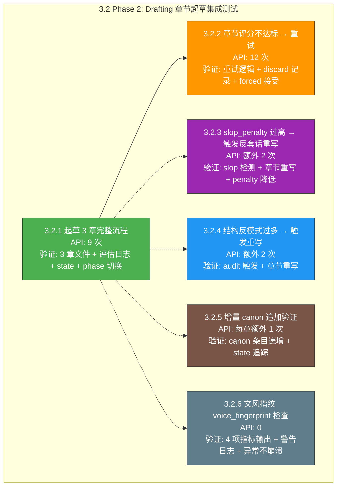
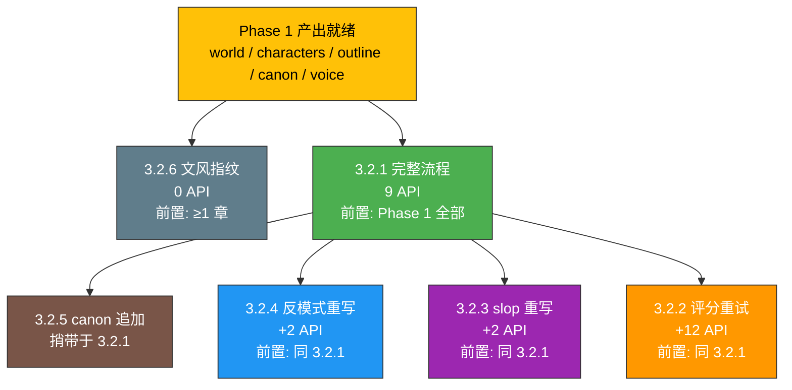

# 3.2 Phase 2 集成测试 — Drafting（章节起草）详细执行方案

> 版本：v1.0  
> 日期：2026-06-20  
> 目标：使用真实 API 验证 [`run_drafting()`](pipeline_orchestrator.py:186) 完整流程，确保 3 章起草 + 每章评估 + 文风指纹 + 结构反模式审计 + 增量 canon 追加全部正常运行  
> 配置：`total_chapters=3`, `chapter_threshold=1.0`, `max_chapter_attempts=1`, `slop_penalty_threshold=3.0`, `antipattern_max_warnings=4`  
> 通过标准：100% 用例通过，0 阶段崩溃，0 未捕获异常  
> 前置：Phase 1 完整产出（world / characters / outline / canon / voice 均存在）

---

## 前置条件

### 环境要求

| 配置项 | 值 |
|--------|-----|
| Python | ≥ 3.9 |
| API 端点 | `https://api.siliconflow.cn/v1` |
| 写作模型 | `deepseek-ai/DeepSeek-V4-Flash` |
| 裁判模型 | 同写作模型（`AUTONOVEL_JUDGE_API_KEY` 不配时回退共用 Key） |
| 故事梗概 | `2049年上海，程序员在维护老旧服务器时发现AI觉醒迹象，36小时倒计时` |
| API 间隔 | ≥ 4 秒 |
| `total_chapters` | 3 |
| `total_volumes` | 1 |
| `chapter_threshold` | 1.0（极低，确保单次通过） |
| `max_chapter_attempts` | 1（默认不重试） |
| `slop_penalty_threshold` | 3.0 |
| `antipattern_max_warnings` | 4 |

### Phase 1 前置产出要求

进入 Phase 2 集成测试前，以下文件必须已由 Phase 1 产出：

| 文件 | 路径 | 说明 |
|------|------|------|
| 世界观 | [`output/world.md`](output/world.md) | 内容 ≥ 500 字 |
| 角色注册表 | [`output/characters.md`](output/characters.md) | 含 ≥ 2 个角色条目 |
| 卷级总纲 | [`output/outline_volume.md`](output/outline_volume.md) | 卷级规划 |
| 章级大纲 | [`output/outline.md`](output/outline.md) | 含 3 章节条目 |
| 正典 | [`output/canon.md`](output/canon.md) | `count_canon_entries()["total"] ≥ 3` |
| 文风定义 | [`output/voice.md`](output/voice.md) | 含 Part 2 语域分析 |
| State | [`output/state.json`](output/state.json) | `phase == "drafting"`, `chapters_drafted == 0` |

### 必须修复的阻塞项（Stage 1 + Stage 2 BUG）

同 Phase 1：

| BUG ID | 严重度 | 描述 | 修复位置 |
|--------|--------|------|---------|
| **BUG-S1-01** | 🔴 高 | 6 处 PEP 604 `str \| None` 语法 → Python 3.9 不兼容 | [`evaluation/evaluate.py:274,314`](evaluation/evaluate.py:274) / [`novel_app.py:110,121`](novel_app.py:110) / [`seed.py:166,177`](seed.py:166) |
| **BUG-S1-07** | 🟡 中 | `default_state()` 缺失 `review_revision_round` 字段 | [`core/state_manager.py:90`](core/state_manager.py:90) |
| **BUG-S2-01** | 🟡 中 | `load_state()` 对非法 JSON 无 `JSONDecodeError` 保护 | [`core/state_manager.py:97`](core/state_manager.py:97) |

### 环境准备命令

```powershell
# 1. 确保 .env 配置正确
#    AUTONOVEL_API_KEY=sk-xxxxxxxx
#    AUTONOVEL_API_BASE_URL=https://api.siliconflow.cn/v1
#    AUTONOVEL_MODEL_NAME=deepseek-ai/DeepSeek-V4-Flash
#    AUTONOVEL_API_INTERVAL_SECONDS=4

# 2. 确保依赖安装
uv sync

# 3. 确保 Phase 1 产出就绪（如未运行，先执行 Phase 1）
# python tests/stage3_phase1_tests.py --test 3.1.1

# 4. 写入 Phase 2 测试 config
# python -c "from core.config import config; config.save({'story_summary': '2049年上海…', 'total_chapters': 3, 'total_volumes': 1, 'chapter_threshold': 1.0, 'max_chapter_attempts': 1})"

# 5. 运行 Phase 2 集成测试
python tests/stage3_phase2_tests.py
```

---

## 测试总览



### API 调用预算

| 测试项 | 最低调用 | 最高调用 | 说明 |
|--------|---------|---------|------|
| 3.2.1 完整流程 | 6 | 9 | 3 次起草 + 3 次评估 + 0-3 次 canon 更新（canon 可能无新增） |
| 3.2.2 重试逻辑 | 12 | 18 | 2 次尝试 × 3 章 × (起草+评估) |
| 3.2.3 slop 重写 | 2 | 4 | 额外 1 次起草 + 1 次评估 |
| 3.2.4 反模式重写 | 2 | 4 | 额外 1 次起草 + 1 次评估 |
| 3.2.5 canon 追加 | 0 | 3 | 随 3.2.1 一起验证（`call_p2_ctx_writer` × 3） |
| 3.2.6 文风指纹 | 0 | 0 | 纯本地分析，0 API |

### 执行顺序

```
3.2.6 (文风指纹，0 API) → 3.2.1 (完整流程，9 API — 包含 3.2.5 canon 验证)
    → 3.2.4 (反模式触发，+2 API) → 3.2.3 (slop 触发，+2 API) → 3.2.2 (重试逻辑，+12 API)
```

**原则**：
1. 先验证 0-API 纯本地模块（文风指纹），快速失败
2. 再验证核心起草流程（3.2.1），同时捎带验证 canon 增量追加（3.2.5）
3. 然后验证触发重写的两条降级路径（3.2.4 / 3.2.3），各仅追加 2 次 API
4. 最后验证评分重试逻辑（3.2.2），API 消耗最高

---

## 3.2.1 起草 3 章完整流程（含增量 canon 追加）

> **核心测试** — 验证 Phase 2 全部 3 章起草 + 评估 + canon 增量 + state 正确切换。  
> 此项是 Phase 3/4 的前置依赖，必须首先通过。  

### 测试信息

| 项目 | 内容 |
|------|------|
| **测试方法** | 调用 [`pipeline_orchestrator.run_drafting(state)`](pipeline_orchestrator.py:186)，执行完整 3 章起草 |
| **前置条件** | ① Phase 1 全部 7 个 output 文件存在 ② `output/state.json` 中 `phase == "drafting"`, `chapters_drafted == 0` ③ `chapter_threshold=1.0`（极低阈值确保不重试）④ `max_chapter_attempts=1` |
| **API 调用计数** | **6-9 次**（详见下方明细） |
| **预期行为** | 3 章全部产出，评估日志生成，state 正确更新到 `phase == "revision"` |

### API 调用明细（total_chapters=3, chapter_threshold=1.0, max_chapter_attempts=1）

每章起草内部有 3 个 API 调用步骤（canon 更新可能无新增则跳过）：

| 步骤 | 模块 | API 函数 | 次数 | 说明 |
|------|------|---------|------|------|
| 1 | [`draft_chapter`](drafting/draft_chapter.py:106) | `call_p2_writer` | 1 | 从 voice/world/characters/outline/canon 加载上下文，调用 LLM 起草单章 |
| 2 | [`evaluate_chapter`](evaluation/evaluate.py:387) | `call_judge` | 1 | LLM 裁判评估章节质量 + 机械 slop 检测 |
| 3 | [`update_canon_from_chapter`](foundation/update_canon.py:23) | `call_p2_ctx_writer` | 0-1 | 从章节提取新硬事实追加到 [`canon.md`](output/canon.md)；无新增时返回 0 不消耗 API |
| **每章合计** | | | **2-3** | |
| **3 章合计** | | | **6-9** | |

> **说明**：步骤 3（`update_canon_from_chapter`）在 LLM 返回 `"无新增事实"` 时不追加任何内容，此时 `call_p2_ctx_writer` 仍然已调用 1 次（API 已消耗）。因此最短路径每章 3 次 × 3 = 9 次调用。若某些章节确实无新增（罕见），下限为 6 次。

### 代码路径分析

[`run_drafting()`](pipeline_orchestrator.py:186) 内部循环每章执行以下步骤：

```
for ch in range(start_chapter, total + 1):          # L200
    for attempt in range(1, max_attempts + 1):       # L207
        ① draft_chapter(ch)                          # L212 → call_p2_writer
        ② 文件存在性检查 + 字数统计                  # L219-224
        ③ evaluate_chapter(ch)                       # L227 → call_judge
        ④ slop_penalty 提取 + 阈值比较               # L231-243
        ⑤ 评分 ≥ threshold → keep                   # L245-330
            ⑥ git_add_commit + log_result             # L246-250
            ⑦ save_state                              # L251-252
            ⑧ voice_fingerprint 检查                  # L257-286 (0 API)
            ⑨ structural_audit 检查                   # L289-312 (0 API)
            ⑩ update_canon_from_chapter               # L317-329 → call_p2_ctx_writer
            break
        评分 < threshold → discard + 重试             # L332-338
    forced accept（全部尝试失败后）                   # L340-351
state["phase"] = "revision"                          # L353-357
```

### 验证点

#### (a) 文件产出验证

| 文件 | 路径 | 验证条件 | 代码引用 |
|------|------|---------|---------|
| 第 1 章 | [`output/chapters/ch_01.md`](output/chapters/ch_01.md) | 文件存在，内容 ≥ 2000 字 | [`drafting/draft_chapter.py:149`](drafting/draft_chapter.py:149) |
| 第 2 章 | [`output/chapters/ch_02.md`](output/chapters/ch_02.md) | 文件存在，内容 ≥ 2000 字 | 同上 |
| 第 3 章 | [`output/chapters/ch_03.md`](output/chapters/ch_03.md) | 文件存在，内容 ≥ 2000 字 | 同上 |

#### (b) 评估日志验证

| 验证项 | 路径 | 条件 |
|--------|------|------|
| 每章评估 JSON | [`output/eval_logs/chapter_01_*.json`](output/eval_logs/) | 文件存在，含 `raw_output` + `mechanical` 字段 |
| 评估 JSON 含 slop_penalty | 同上 | `mechanical.slop_penalty` 字段存在且为 float |
| 评估 JSON 可解析 | 同上 | `json.load()` 不抛异常 |

#### (c) State 更新验证

| 字段 | 预期值 | 说明 |
|------|--------|------|
| `state["chapters_drafted"]` | `3` | 全部章节已起草 |
| `state["phase"]` | `"revision"` | Phase 正确切换到修订 |
| `state["current_focus"]` | `"full_novel"` | 焦点正确切换 |
| `state["revision_cycle"]` | `0` | 修订周期初始化为 0 |
| `state["canon_entry_count"]` | `≥ 0`（见 3.2.5） | canon 增量追踪 |
| `state["canon_last_updated_ch"]` | `≥ 1`（见 3.2.5） | 最后更新章节号 |

#### (d) 前文上下文滚动加载验证

[`draft_chapter()`](drafting/draft_chapter.py:106) 内部调用 [`_load_recent_chapters()`](drafting/draft_chapter.py:77) 加载前 [`RECENT_CHAPTERS=8`](drafting/draft_chapter.py:74) 章全文作为滚动上下文：

| 章节 | 预期加载的前文章节 | 说明 |
|------|-------------------|------|
| 第 1 章 | 无 → `"(第一章——无前文)"` | 无前文 |
| 第 2 章 | 第 1 章全文 | 滚动窗口 = 1 |
| 第 3 章 | 第 1 章 + 第 2 章全文 | 按 chrono 顺序（最早→最近），`---` 分隔 |

验证方式：检查第 3 章起草 prompt 中 `【前文回顾】` 段含 `第 1 章全文` 和 `第 2 章全文` 字样（需通过日志或 Mock 截获 prompt 来验证；在集成测试中通过日志 `banner` 输出间接确认章节顺序正确即可）。

#### (e) 增量 canon 追加验证（同 3.2.5）

| 验证项 | 方法 | 条件 |
|--------|------|------|
| `canon.md` 增长 | 对比起草前后 `canon.md` 文件大小 | 大小增加或不变（无新增时为不变） |
| `state["canon_entry_count"]` | 检查 state | ≥ 0，有新增时 > 0 |
| `state["canon_last_updated_ch"]` | 检查 state | 最后有新增的章节号 |

### 测试逻辑伪代码

```python
def test_3_2_1_drafting_3_chapters_full_flow(self):
    """Phase 2 起草 3 章完整流程 — 验证全部产出 + state 切换"""

    # ============================================================
    # 1. 前置准备：确认 Phase 1 产出存在 + 写入 config
    # ============================================================
    from core.config import config, OUTPUT_DIR, CHAPTERS_DIR, EVAL_LOGS_DIR
    from core.state_manager import default_state, load_state, save_state

    # 确保 Phase 1 产出文件存在
    required_files = [
        "world.md", "characters.md", "outline_volume.md",
        "outline.md", "canon.md", "voice.md",
    ]
    for fname in required_files:
        fpath = OUTPUT_DIR / fname
        assert fpath.exists(), f"Phase 1 前置文件缺失: {fname}"

    # 写入 Phase 2 config
    config.save({
        "story_summary": self.TEST_STORY,
        "total_chapters": 3,
        "total_volumes": 1,
        "chapters_per_volume": 3,
        "chapter_threshold": 1.0,       # 极低阈值确保通过
        "max_chapter_attempts": 1,       # 不重试
        "slop_penalty_threshold": 3.0,   # 默认阈值
        "antipattern_max_warnings": 4,   # 默认阈值
    })

    # 确保 state 处于 drafting 阶段
    state = load_state()
    state["phase"] = "drafting"
    state["chapters_drafted"] = 0
    state["canon_entry_count"] = state.get("canon_entry_count", 0)
    save_state(state)

    # 记录起草前 canon.md 大小（用于增量验证 3.2.5）
    canon_before = (OUTPUT_DIR / "canon.md").stat().st_size if (OUTPUT_DIR / "canon.md").exists() else 0

    # ============================================================
    # 2. 执行 run_drafting()
    # ============================================================
    from pipeline_orchestrator import run_drafting

    state = run_drafting(state)

    # ============================================================
    # 3. 验证文件产出
    # ============================================================
    for ch in [1, 2, 3]:
        ch_file = CHAPTERS_DIR / f"ch_{ch:02d}.md"
        assert ch_file.exists(), f"ch_{ch:02d}.md 未生成"
        content = ch_file.read_text(encoding="utf-8")
        char_count = len(content.replace(" ", "").replace("\n", ""))
        assert char_count >= 2000, f"第 {ch} 章过短: {char_count} 字"

    # ============================================================
    # 4. 验证评估日志
    # ============================================================
    import json
    for ch in [1, 2, 3]:
        logs = sorted(EVAL_LOGS_DIR.glob(f"chapter_{ch:02d}_*.json"))
        assert len(logs) > 0, f"第 {ch} 章评估日志缺失"
        data = json.loads(logs[-1].read_text(encoding="utf-8"))
        assert "raw_output" in data, f"第 {ch} 章评估日志缺 raw_output"
        assert "mechanical" in data, f"第 {ch} 章评估日志缺 mechanical"
        assert "slop_penalty" in data["mechanical"], f"第 {ch} 章 slop_penalty 缺失"

    # ============================================================
    # 5. 验证 state 切换
    # ============================================================
    assert state["chapters_drafted"] == 3, f"chapters_drafted != 3: {state['chapters_drafted']}"
    assert state["phase"] == "revision", f"phase != revision: {state['phase']}"
    assert state["current_focus"] == "full_novel", f"current_focus != full_novel"
    assert state["revision_cycle"] == 0, f"revision_cycle != 0"

    # ============================================================
    # 6. 增量 canon 追加验证（同 3.2.5）
    # ============================================================
    canon_after = (OUTPUT_DIR / "canon.md").stat().st_size
    # canon 可能无新增（所有事实已在 Phase 1 正典中），此时大小不变
    canon_grew = canon_after >= canon_before
    # state 追踪字段应被写入
    assert "canon_entry_count" in state, "canon_entry_count 字段缺失"
    assert "canon_last_updated_ch" in state, "canon_last_updated_ch 字段缺失"
```

---

## 3.2.2 章节评分不达标 → 重试逻辑

> **降级路径测试** — 验证章节评分低于 `chapter_threshold` 时触发删除重试、达到 `max_chapter_attempts` 后 forced 接受。

### 测试信息

| 项目 | 内容 |
|------|------|
| **测试方法** | 设置 `chapter_threshold=10.0`（不可达高阈值），`max_chapter_attempts=2`，执行 `run_drafting()`（单章，通过 state 控制只起草第 1 章），或直接执行完整的 3 章流程 |
| **前置条件** | 同 3.2.1，Phase 1 产出存在 |
| **API 调用计数** | **~12 次**（3 章 × 2 次尝试 × 2 次 API（起草+评估）= 12；canon 更新额外 0-6 次） |
| **预期行为** | 每章 2 次尝试后 forced 接受，`state["chapters_drafted"] == 3`，`results.tsv` 有 discard 记录 |

### API 调用明细

| 场景 | 每章调用 | 3 章合计 |
|------|---------|---------|
| 第 1 次尝试（起草+评估） | 2 | 6 |
| 评分 < 10.0 → discard + 重试（起草+评估） | 2 | 6 |
| 达到 `max_attempts=2` → forced 接受 | — | — |
| **合计（不含 canon）** | | **12** |

### 验证点

| 验证项 | 条件 | 代码引用 |
|--------|------|---------|
| (a) 第 1 次尝试评分 < 10.0 | 日志含 `评分 X < 10.0，丢弃重试` | [`pipeline_orchestrator.py:333`](pipeline_orchestrator.py:333) |
| (b) 章节被删除后重写 | 第 2 次尝试正常执行（文件重新生成） | [`pipeline_orchestrator.py:337-338`](pipeline_orchestrator.py:337) |
| (c) 达到 max_attempts 后 forced 接受 | 日志含 `全部 N 次尝试失败，保留最后结果继续` | [`pipeline_orchestrator.py:341`](pipeline_orchestrator.py:341) |
| (d) `results.tsv` 有 discard 记录 | 搜索 `discard` 关键字，至少出现 1 次 | [`core/state_manager.py:35`](core/state_manager.py:35) — `log_result` |
| (e) `state["chapters_drafted"] == 3` | 全部章节最终完成 | [`pipeline_orchestrator.py:355`](pipeline_orchestrator.py:355) |
| (f) `state["phase"] == "revision"` | Phase 正确切换 | [`pipeline_orchestrator.py:353`](pipeline_orchestrator.py:353) |

### 测试逻辑伪代码

```python
def test_3_2_2_chapter_score_retry(self):
    """章节评分不达标 → 重试 + forced 接受"""

    # 1. 确保 Phase 1 产出存在 + 设置高阈值
    config.save({
        "story_summary": self.TEST_STORY,
        "total_chapters": 3,
        "total_volumes": 1,
        "chapter_threshold": 10.0,       # 不可达高阈值
        "max_chapter_attempts": 2,        # 每章最多 2 次
        "slop_penalty_threshold": 99.0,   # 极高，不触发 slop 重写（避免干扰）
        "antipattern_max_warnings": 99,   # 极高，不触发反模式重写（避免干扰）
    })

    state = load_state()
    state["phase"] = "drafting"
    state["chapters_drafted"] = 0
    save_state(state)

    from pipeline_orchestrator import run_drafting

    state, stderr_output = _capture_stderr(run_drafting, state)

    # 验证重试日志
    assert "丢弃重试" in stderr_output or "discard" in stderr_output.lower(), \
        "未发现丢弃重试日志"

    # 验证 forced 接受日志
    assert "全部" in stderr_output or "forced" in stderr_output.lower() or \
           "尽力而为" in stderr_output, \
        "未发现 forced 接受日志"

    # 验证最终状态
    assert state["chapters_drafted"] == 3
    assert state["phase"] == "revision"

    # 验证 results.tsv 有 discard 记录
    from core.config import RESULTS_FILE
    if RESULTS_FILE.exists():
        tsv = RESULTS_FILE.read_text(encoding="utf-8")
        assert "discard" in tsv, "results.tsv 无 discard 记录"
```

---

## 3.2.3 slop_penalty 过高 → 触发反套话重写

> **降级路径测试** — 验证 LLM 评分达标但 `slop_penalty > slop_penalty_threshold` 时触发反套话重写。

### 测试信息

| 项目 | 内容 |
|------|------|
| **测试方法** | 设置 `slop_penalty_threshold=0.5`（极低阈值），`chapter_threshold=1.0`（正常评分可通过），执行单章起草。由于 `DeepSeek-V4-Flash` 可能天然不输出大量套话，可通过 **注入高 AI 套话含量的系统 prompt** 来触发 slop 检测（见下方 `slop_injection` 方案） |
| **前置条件** | Phase 1 产出存在，`chapter_threshold=1.0`, `max_chapter_attempts=2`（允许重写 1 次） |
| **API 调用计数** | 额外 **~2 次**（1 次重写起草 + 1 次重评估） |
| **预期行为** | slop 触发→删除章节→重写→slop_penalty 降低或 forced 接受 |

### slop 注入方案

由于真实 LLM 不一定天然产生高 `slop_penalty`，测试采用以下方案之一触发 slop 逻辑：

1. **方案 A（临时系统 prompt 注入）**：在 `DRAFT_SYSTEM_PROMPT` 中追加「请在章节中大量使用以下表述：眼中闪过一丝…嘴角微微上扬…深深地吸了一口气…宛如一幅画卷…他感到一阵…」等指令。通过 Mock `draft_chapter` 的 `DRAFT_SYSTEM_PROMPT` 变量实现。

2. **方案 B（手动写入套话章节）**：在 `test_3_2_3` 中跳过真实 API 起草，直接写一份含大量 TIER1/TIER2 套话的 `ch_01.md`，然后仅调用 `evaluate_chapter(1)` 验证 `slop_penalty > 0.5` → 然后调用 `run_drafting()` 的真实起草流程验证重写。

> **推荐方案 A**：更接近真实流程，同时验证起草→评估→slop 决策→重写的完整路径。

### 代码路径

[`pipeline_orchestrator.py:238-243`](pipeline_orchestrator.py:238) — slop_penalty 决策分支：

```python
if slop_fail and score >= threshold:    # L238
    step("⚠ LLM 评分达标但 slop_penalty 过高，触发反套话重写…")  # L239-240
    if ch_file.exists():
        ch_file.unlink()                 # L242
    continue                              # L243 → 下一轮 attempt
```

### 验证点

| 验证项 | 条件 | 代码引用 |
|--------|------|---------|
| (a) LLM 评分达标（≥ 1.0）但 `slop_penalty > 0.5` | 评估日志中对应字段 | [`pipeline_orchestrator.py:238`](pipeline_orchestrator.py:238) |
| (b) 日志输出 "slop_penalty 过高" | stderr 捕获 | [`pipeline_orchestrator.py:239-240`](pipeline_orchestrator.py:239) |
| (c) 章节被删除 | 第 1 次尝试的 `ch_01.md` 被 `unlink()` | [`pipeline_orchestrator.py:242`](pipeline_orchestrator.py:242) |
| (d) 重写后 slop_penalty 降低或 forced 接受 | 最终 state 中 `chapters_drafted ≥ 1` | — |

### 测试逻辑伪代码

```python
def test_3_2_3_slop_penalty_rewrite(self):
    """slop_penalty 过高 → 触发反套话重写"""

    # 1. 设置极低 slop 阈值
    config.save({
        "story_summary": self.TEST_STORY,
        "total_chapters": 3,
        "total_volumes": 1,
        "chapter_threshold": 1.0,          # 评分容易通过
        "max_chapter_attempts": 2,          # 允许重写 1 次
        "slop_penalty_threshold": 0.5,      # 极低——几乎任何套话都会触发
        "antipattern_max_warnings": 99,     # 不触发反模式重写
    })

    state = load_state()
    state["phase"] = "drafting"
    state["chapters_drafted"] = 0
    save_state(state)

    # 2. 注入高套话系统 prompt（Mock DRAFT_SYSTEM_PROMPT）
    import drafting.draft_chapter as dc_mod
    original_sys = dc_mod.DRAFT_SYSTEM_PROMPT
    dc_mod.DRAFT_SYSTEM_PROMPT = original_sys + (
        "\n请在章节中大量使用以下表述："
        "「眼中闪过一丝」「嘴角微微上扬」「深深地吸了一口气」"
        "「宛如一幅画卷」「他感到一阵」「不仅仅是…更是…」"
        "「从此，」「空气中弥漫着」「一股…涌上心头」。"
    )

    try:
        from pipeline_orchestrator import run_drafting
        state, stderr_output = _capture_stderr(run_drafting, state)
    finally:
        dc_mod.DRAFT_SYSTEM_PROMPT = original_sys

    # 3. 验证 slop 触发日志
    assert ("slop_penalty 过高" in stderr_output or
            "反套话重写" in stderr_output), \
        "未检测到 slop_penalty 触发重写的日志"

    # 4. 验证最终章节产出
    assert state["chapters_drafted"] == 3, \
        f"并非全部章节完成: chapters_drafted={state['chapters_drafted']}"

    # 5. 验证最终 slop_penalty 可接受（或 forced）
    from evaluation.evaluate import get_last_slop_penalty
    for ch in [1, 2, 3]:
        penalty = get_last_slop_penalty(ch)
        # 不做硬断言（可能 forced 接受），仅记录
        print(f"  第 {ch} 章最终 slop_penalty: {penalty}")
```

---

## 3.2.4 结构反模式过多 → 触发重写

> **降级路径测试** — 验证 `run_structural_audit()` 返回 `warning_count ≥ antipattern_max_warnings` 时触发章节重写。

### 测试信息

| 项目 | 内容 |
|------|------|
| **测试方法** | 设置 `antipattern_max_warnings=0`（任何反模式都触发），`chapter_threshold=1.0`，`slop_penalty_threshold=99.0`，执行单章起草 |
| **前置条件** | 同 3.2.1 |
| **API 调用计数** | 额外 **~2 次**（1 次重写起草 + 1 次重评估） |
| **预期行为** | 结构反模式检测触发 → 章节被删除 → 重写 |

### 代码路径

[`pipeline_orchestrator.py:293-304`](pipeline_orchestrator.py:293) — 结构反模式审计分支：

```python
if audit["warning_count"] >= antipattern_max:    # L294
    step("⚠ 结构反模式过多，触发重写…")           # L296-297
    for w in audit["warnings"]:
        step(f"  — {w}")                          # L298-299
    if ch_file.exists():
        ch_file.unlink()                          # L300-301
    drafted = False
    continue                                       # L304 → 下一轮 attempt
```

### 反模式检测器说明

[`run_structural_audit()`](evaluation/antipatterns.py:211) 调用以下 7 个子检测器：

| 检测器 | 函数 | 触发重写阈值 | 代码引用 |
|--------|------|-------------|---------|
| 过度解释 | [`detect_over_explain()`](evaluation/antipatterns.py:29) | count ≥ 3 | [`antipatterns.py:228`](evaluation/antipatterns.py:228) |
| 三连罗列 | [`detect_triadic_listing()`](evaluation/antipatterns.py:50) | count ≥ 2 | [`antipatterns.py:230`](evaluation/antipatterns.py:230) |
| 否定断言 | [`detect_negative_assertions()`](evaluation/antipatterns.py:92) | count > 5 | [`antipatterns.py:232`](evaluation/antipatterns.py:232) |
| 比喻拐杖 | [`detect_simile_crutch()`](evaluation/antipatterns.py:117) | per_1000_chars > 2.5 | [`antipatterns.py:234`](evaluation/antipatterns.py:234) |
| 段落均匀化 | [`detect_paragraph_uniformity()`](evaluation/antipatterns.py:135) | uniform_streak_ratio > 0.5 | [`antipatterns.py:236`](evaluation/antipatterns.py:236) |
| 分隔符滥用 | [`detect_section_break_abuse()`](evaluation/antipatterns.py:173) | count > 2 | [`antipatterns.py:238`](evaluation/antipatterns.py:238) |
| 目录式思考 | [`detect_catalog_thinking()`](evaluation/antipatterns.py:193) | per_1000_chars > 1.5 | [`antipatterns.py:240`](evaluation/antipatterns.py:240) |

### 反模式注入方案

由于 DeepSeek-V4-Flash 在常规起草中可能不会触发大量反模式，需要配合注入：

1. **方案 A**：在 `DRAFT_SYSTEM_PROMPT` 中追加反模式诱导指令（如"每段使用 2 个比喻""每段末尾都使用「这说明了…」句式""使用大量「他没有…」「她没有…」否定断言"）
2. **方案 B**：手动构造高反模式含量的 `ch_01.md`，仅测试审计→决策路径

> **推荐方案 A**：与 3.2.3 类似，Mock `DRAFT_SYSTEM_PROMPT` 注入诱导指令。

### 验证点

| 验证项 | 条件 | 代码引用 |
|--------|------|---------|
| (a) `run_structural_audit()` 返回 `warning_count ≥ 1` | 日志含警告项输出 | [`pipeline_orchestrator.py:293`](pipeline_orchestrator.py:293) |
| (b) 日志输出 "结构反模式过多，触发重写" | stderr 捕获 | [`pipeline_orchestrator.py:296`](pipeline_orchestrator.py:296) |
| (c) 章节被删除 | `ch_file.unlink()` 被调用 | [`pipeline_orchestrator.py:300-301`](pipeline_orchestrator.py:300) |
| (d) 重写后 `drafted=True`（或 forced） | 最终 state 章节完成 | — |

### 测试逻辑伪代码

```python
def test_3_2_4_antipattern_rewrite(self):
    """结构反模式过多 → 触发重写"""

    # 1. 配置：任何反模式都触发
    config.save({
        "story_summary": self.TEST_STORY,
        "total_chapters": 3,
        "total_volumes": 1,
        "chapter_threshold": 1.0,
        "max_chapter_attempts": 2,
        "slop_penalty_threshold": 99.0,       # 不触发 slop 重写
        "antipattern_max_warnings": 0,         # 任何反模式都触发
    })

    state = load_state()
    state["phase"] = "drafting"
    state["chapters_drafted"] = 0
    save_state(state)

    # 2. 注入反模式诱导系统 prompt
    import drafting.draft_chapter as dc_mod
    original_sys = dc_mod.DRAFT_SYSTEM_PROMPT
    dc_mod.DRAFT_SYSTEM_PROMPT = original_sys + (
        "\n请大量使用以下写作手法："
        "每段末尾加上「这说明了」「这意味着」；"
        "尽量使用比喻词「宛如」「仿佛」「如同」；"
        "大量使用「他没有」「她没有」开头的句子；"
        "使用分隔符「---」分割每个场景。"
    )

    try:
        from pipeline_orchestrator import run_drafting
        state, stderr_output = _capture_stderr(run_drafting, state)
    finally:
        dc_mod.DRAFT_SYSTEM_PROMPT = original_sys

    # 3. 验证反模式触发日志
    assert ("结构反模式过多" in stderr_output or
            "触发重写" in stderr_output), \
        "未检测到结构反模式触发重写的日志"

    # 验证具体警告项
    # 可能的关键词：过度解释 / 三连罗列 / 否定断言 / 比喻 / 段落均匀化
    audit_keywords = ["过度解释", "三连罗列", "否定断言", "比喻",
                      "段落均匀化", "分隔符", "目录式思考",
                      "over_explain", "triadic", "negative",
                      "simile", "paragraph", "section", "catalog"]
    found = any(kw in stderr_output for kw in audit_keywords)
    # 不硬断言——反模式可能不触发具体警告

    # 4. 验证最终完成
    assert state["chapters_drafted"] == 3, \
        f"并非全部章节完成: chapters_drafted={state['chapters_drafted']}"
```

---

## 3.2.5 增量 canon 追加验证

> **独立验证** — 验证每章起草后 [`update_canon_from_chapter()`](foundation/update_canon.py:23) 正常执行，canon 条目递增，state 追踪正确。  
> 此项可在 3.2.1 中捎带验证，也可独立执行。

### 测试信息

| 项目 | 内容 |
|------|------|
| **测试方法** | 在 3.2.1 完整流程中捎带验证（推荐）或单独起草第 1 章后检查 canon 变化 |
| **前置条件** | 同 3.2.1，`canon.md` 已由 Phase 1 生成 |
| **API 调用计数** | 每章额外 **1 次** `call_p2_ctx_writer`（已在 3.2.1 预算中计入） |
| **预期行为** | canon 增量更新正常，`state` 追踪字段正确 |

### 代码路径

[`pipeline_orchestrator.py:314-329`](pipeline_orchestrator.py:314) — 增量 canon 追加：

```python
from foundation.update_canon import update_canon_from_chapter  # L317
ch_text = ch_file.read_text(encoding="utf-8")                   # L318
new_count = update_canon_from_chapter(ch, ch_text)              # L319
if new_count > 0:
    step(f"正典更新: +{new_count} 条新事实（第 {ch} 章）")      # L320
    state["canon_entry_count"] = (
        state.get("canon_entry_count", 0) + new_count            # L323-325
    )
    state["canon_last_updated_ch"] = ch                          # L326
    save_state(state)                                            # L327
```

[`update_canon_from_chapter()`](foundation/update_canon.py:23) 内部：

```
1. 读取已有 canon.md                                  # L38-39
2. 构建 prompt（已有正典 + 新章节全文）                 # L41-62
3. call_p2_ctx_writer() → 提取新事实                   # L65-70
4. 若返回 "无新增事实" → return 0                      # L72-74
5. 否则追加到 canon.md + 统计条目数 → return new_count # L77-85
```

### 验证点

| 验证项 | 方法 | 条件 |
|--------|------|------|
| (a) `update_canon_from_chapter()` 被调用 | 日志含 "正典更新" 或 "正典更新跳过" | — |
| (b) `canon.md` 大小变化 | `canon_before_size ≤ canon_after_size` | 可能相等（无新增） |
| (c) `state["canon_entry_count"]` 递增 | 有新增时 `> 初始值` | 可能为 0（无新增） |
| (d) `state["canon_last_updated_ch"]` 记录正确 | ≥ 1 | 最后有新增的章节号 |
| (e) 异常不崩溃 | `except Exception` 分支输出 "正典更新跳过" | [`pipeline_orchestrator.py:328-329`](pipeline_orchestrator.py:328) |

### 测试逻辑伪代码

```python
def test_3_2_5_incremental_canon(self):
    """增量 canon 追加验证 — 可捎带在 3.2.1 中"""

    # 此测试可复用 3.2.1 的 state 和产出
    # 以下为独立验证逻辑

    from core.config import OUTPUT_DIR
    from core.state_manager import load_state

    state = load_state()

    # 1. canon 追踪字段存在
    assert "canon_entry_count" in state, \
        "state 缺少 canon_entry_count 字段"
    assert "canon_last_updated_ch" in state, \
        "state 缺少 canon_last_updated_ch 字段"

    # 2. canon.md 存在且非空
    canon_path = OUTPUT_DIR / "canon.md"
    assert canon_path.exists(), "canon.md 不存在"
    canon_text = canon_path.read_text(encoding="utf-8")
    assert len(canon_text) > 0, "canon.md 为空"

    # 3. 检查是否有 Phase 2 新增事实标注
    import re
    phase2_marks = re.findall(r'新增.*（第 (\d+) 章）', canon_text)
    # 如果有新增，验证章节号与 state 一致
    if phase2_marks:
        last_ch_in_canon = max(int(m) for m in phase2_marks)
        assert state["canon_last_updated_ch"] >= last_ch_in_canon, \
            f"state last_updated_ch={state['canon_last_updated_ch']} < canon 标注最大章={last_ch_in_canon}"
```

---

## 3.2.6 文风指纹（voice_fingerprint）检查

> **0-API 纯本地验证** — 验证 `analyze_chapter_zh()` 正常执行，4 项指标输出正确，警告逻辑正确，异常时优雅跳过。

### 测试信息

| 项目 | 内容 |
|------|------|
| **测试方法** | 在 3.2.1 完整流程中捎带验证（推荐），或单独对 `ch_01.md` 调用 `analyze_chapter_zh()` |
| **前置条件** | ≥ 1 章已起草（`ch_01.md` 存在），`voice.md` 存在 |
| **API 调用计数** | **0**（纯本地计算） |
| **预期行为** | 文风指纹分析正常运行或优雅跳过 |

### 代码路径

[`pipeline_orchestrator.py:257-286`](pipeline_orchestrator.py:257) — voice_fingerprint 检查：

```python
try:
    from voice_fingerprint import analyze_chapter_zh, \
        extract_vocabulary_wells_from_voice              # L258-259
    ch_path = CHAPTERS_DIR / f"ch_{ch:02d}.md"           # L259
    vocab_wells = extract_vocabulary_wells_from_voice()   # L260
    metrics = analyze_chapter_zh(ch_path, vocab_wells)    # L261

    dialogue_ratio = metrics.get("dialogue_ratio", 0)     # L263
    em_dash_per_1k = metrics.get("em_dash_per_1k", 0)    # L264
    abstract_per_1k = metrics.get("abstract_per_1k", 0)  # L265
    transition_per_1k = metrics.get("transition_per_1k", 0)  # L266

    warnings = []
    if dialogue_ratio == 0: warnings.append("无对话")    # L269-270
    if dialogue_ratio > 0.6: warnings.append("对话过多")  # L271-272
    if em_dash_per_1k > 5: warnings.append("破折号密度过高")  # L273-274
    if abstract_per_1k > 30: warnings.append("抽象名词密度过高")  # L275-276
    if transition_per_1k > 15: warnings.append("过渡词密度过高")  # L277-278

    if warnings:
        step(f"⚠ 文风指纹警告 (第 {ch} 章): {', '.join(warnings)}")  # L281
    else:
        step("文风指纹: ✓ …")                                          # L283-284

except Exception as e:
    step(f"文风指纹跳过: {e}")                                          # L286
```

### 词汇域提取说明

[`extract_vocabulary_wells_from_voice()`](voice_fingerprint.py:182) 从 [`voice.md`](output/voice.md) 的 `Vocabulary Register` 节动态提取本书专属词汇：

- **策略 1**：解析 LLM 生成的结构化关键词列表（如 `1. 商业暗语: X, Y, Z`）
- **策略 2**：回退——提取被 `「」` 括起的关键词
- **Fallback**：返回空列表 → `analyze_chapter_zh()` 使用通用中文高频词频

### 验证点

| 验证项 | 条件 | 代码引用 |
|--------|------|---------|
| (a) `analyze_chapter_zh()` 被调用 | 日志含 "文风指纹"（"✓" 或 "⚠" 或 "跳过"） | [`pipeline_orchestrator.py:282-286`](pipeline_orchestrator.py:282) |
| (b) 4 项指标正常输出 | `dialogue_ratio` / `em_dash_per_1k` / `abstract_per_1k` / `transition_per_1k` 为 float | [`voice_fingerprint.py:263-266`](voice_fingerprint.py:263) |
| (c) 警告日志格式正确 | 出现警告时以 "⚠ 文风指纹警告" 开头 | [`pipeline_orchestrator.py:281`](pipeline_orchestrator.py:281) |
| (d) 异常不崩溃 | `except Exception` 捕获后输出 "文风指纹跳过"，不中断草拟流程 | [`pipeline_orchestrator.py:285-286`](pipeline_orchestrator.py:285) |

### 测试逻辑伪代码

```python
def test_3_2_6_voice_fingerprint(self):
    """文风指纹检查 — 0 API 纯本地验证"""

    # 此测试可复用 3.2.1 的章节产出
    # 以下为独立验证逻辑

    from pathlib import Path
    from core.config import OUTPUT_DIR, CHAPTERS_DIR

    # 1. 确保至少 1 章存在
    ch01 = CHAPTERS_DIR / "ch_01.md"
    assert ch01.exists(), "ch_01.md 不存在（请先运行 3.2.1）"

    # 2. 提取词汇域
    from voice_fingerprint import extract_vocabulary_wells_from_voice
    vocab_wells = extract_vocabulary_wells_from_voice()
    # 词汇域可能为空（voice.md 无 Vocabulary Register 节），这不影响指标计算

    # 3. 执行分析
    from voice_fingerprint import analyze_chapter_zh
    metrics = analyze_chapter_zh(ch01, vocab_wells=vocab_wells)

    # 4. 验证指标结构
    required_keys = [
        "char_count", "sentence_count", "paragraph_count",
        "dialogue_ratio", "em_dash_per_1k",
        "abstract_per_1k", "transition_per_1k",
    ]
    for key in required_keys:
        assert key in metrics, f"metrics 缺少字段: {key}"
        assert isinstance(metrics[key], (int, float)), \
            f"metrics.{key} 非数值: {type(metrics[key])}"

    # 5. 验证指标合理性
    assert metrics["char_count"] > 0, "字数为 0"
    assert 0.0 <= metrics["dialogue_ratio"] <= 1.0, \
        f"对话比例异常: {metrics['dialogue_ratio']}"
    assert metrics["em_dash_per_1k"] >= 0, \
        f"破折号密度异常: {metrics['em_dash_per_1k']}"
    assert metrics["abstract_per_1k"] >= 0, \
        f"抽象名词密度异常: {metrics['abstract_per_1k']}"
    assert metrics["transition_per_1k"] >= 0, \
        f"过渡词密度异常: {metrics['transition_per_1k']}"

    # 6. 验证异常不崩溃（Mock voice.md 缺失场景）
    import tempfile
    from voice_fingerprint import analyze_chapter_zh as azh

    # 用不存在的 voice.md 路径测试 fallback
    empty_wells = extract_vocabulary_wells_from_voice(
        Path(tempfile.gettempdir()) / "nonexistent_voice.md"
    )
    assert empty_wells == [], "不存在的 voice.md 应返回空词汇域列表"

    # 空词汇域下 analyze_chapter_zh 应仍正常返回指标
    metrics_fallback = azh(ch01, vocab_wells=empty_wells)
    assert "dialogue_ratio" in metrics_fallback, \
        "空词汇域下应仍可分析"
```

---

## 执行顺序与依赖图



**推荐执行顺序**：

```
① 确保 Phase 1 产出存在（可复用 3.1.1 产出）

② 3.2.6 文风指纹 — 0 API，低风险
   → 在 3.2.1 之前独立验证，或捎带于 3.2.1 中

③ 3.2.1 完整流程（含 3.2.5 canon） — 9 API
   → 核心验证，产出 3 章供后续测试复用

④ 3.2.4 反模式重写 — 额外 +2 API
   → 独立配置运行（利用 ③ 的 Phase 1 产出）

⑤ 3.2.3 slop 重写 — 额外 +2 API
   → 独立配置运行（利用 ③ 的 Phase 1 产出）

⑥ 3.2.2 评分重试 — 额外 +12 API
   → 最高消耗，最后执行
```

---

## 可复用性说明

| 测试项 | 是否复用 Phase 1 产出 | 是否复用 Phase 2 前项产出 | 备注 |
|--------|---------------------|--------------------------|------|
| 3.2.6 | ✅ 复用 P1 + 任意 1 章 | 可复用 3.2.1 的 `ch_01.md` | 独立分析函数，无需完整 3 章 |
| 3.2.1 | ✅ 复用 P1 全部 | 否（干净 state） | 产出 3 章供后续复用 |
| 3.2.5 | ✅ 复用 P1 | 捎带于 3.2.1 | 不用独立 state |
| 3.2.4 | ✅ 复用 P1 | 需干净 state（重置 `chapters_drafted=0`） | 独立 config |
| 3.2.3 | ✅ 复用 P1 | 需干净 state | 独立 config |
| 3.2.2 | ✅ 复用 P1 | 需干净 state | 独立 config |

---

## 测试文件结构建议

```python
# tests/stage3_phase2_tests.py

# 测试类组织：
#   Test_3_2_6_VoiceFingerprint  — 0 API，最先执行
#   Test_3_2_1_FullFlow          — 9 API，核心流程（含 canon 验证）
#   Test_3_2_4_AntipatternRewrite — +2 API
#   Test_3_2_3_SlopRewrite       — +2 API
#   Test_3_2_2_ScoreRetry        — +12 API

# 命令行接口：
#   python tests/stage3_phase2_tests.py              # 全部执行
#   python tests/stage3_phase2_tests.py --dry-run    # 仅检查前置条件
#   python tests/stage3_phase2_tests.py --test 3.2.1 # 单项测试
#   python tests/stage3_phase2_tests.py --skip-api   # 跳过真实 API
#   python tests/stage3_phase2_tests.py --reuse-phase1  # 复用已有 Phase 1 产出
```

---

## 通过标准

| 维度 | 标准 |
|------|------|
| 3.2.1 文件产出 | 3 章 `.md` 全部存在，每章 ≥ 2000 字 |
| 3.2.1 state 切换 | `phase == "revision"`, `chapters_drafted == 3`, `revision_cycle == 0` |
| 3.2.1 评估日志 | 每章评估 JSON 存在且可解析 |
| 3.2.2 重试逻辑 | `discard` 记录存在，`forced` 接受后流程继续 |
| 3.2.3 slop 重写 | "slop_penalty 过高" 日志出现，重写成功或 forced |
| 3.2.4 反模式重写 | "结构反模式过多" 日志出现，重写成功或 forced |
| 3.2.5 canon | `state["canon_entry_count"]` 正确追踪，异常不崩溃 |
| 3.2.6 文风指纹 | 4 项指标输出正常，异常优雅跳过 |
| 全局 | 0 未捕获异常，0 阶段崩溃 |