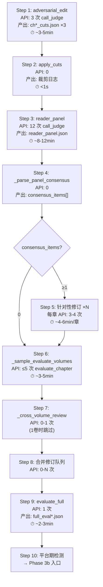

# 3.3.1 Phase 3a 修订完整闭环 — 独立详细测试方案

> 版本：v2.0（基于三轮真实 API 运行复盘）
> 日期：2026-06-21
> 目标：使用真实 API 验证 [`run_revision()`](pipeline_orchestrator.py:431) Phase 3a 完整链路
> 配置：`total_chapters=3`, `total_volumes=1`, `max_revision_cycles=1`, `plateau_delta=0.5`, `revision_threshold=1.0`
> API 预算：~24-52 次（含 Phase 3b 审阅修订全部闭环）
> 通过标准：零崩溃、14 项验证点全部通过

---

## 前置条件

### 必须修复的 BUG（三轮运行发现）

| BUG ID | 位置 | 严重度 | 描述 | 修复 |
|--------|------|--------|------|------|
| **BUG-P3-01** | [`pipeline_orchestrator.py:691`](pipeline_orchestrator.py:691) | 🔴 崩溃 | `threshold` 未定义 → `NameError` | → `CHAPTER_THRESHOLD` |
| **BUG-P3-02** | [`revision/gen_brief.py:41,54,264,439,607,749,754`](revision/gen_brief.py:41) | 🔴 崩溃 | 7 处 `sys.exit()` → `SystemExit` 绕过 `except Exception` | → `raise ValueError()` |
| **BUG-P3-03** | [`pipeline_orchestrator.py:502`](pipeline_orchestrator.py:502) | 🟡 功能断裂 | `generate_brief()` 未传 `output_path` → 共识修订被跳过 | → 传入 `output_path=brief_file` |

### Phase 1+2 前置文件

| 文件 | 要求 |
|------|------|
| [`output/world.md`](output/world.md) | ≥ 500 字 |
| [`output/characters.md`](output/characters.md) | ≥ 2 角色 |
| [`output/outline_volume.md`](output/outline_volume.md) | 存在 |
| [`output/outline.md`](output/outline.md) | ≥ 3 章节条目 |
| [`output/canon.md`](output/canon.md) | entries ≥ 3 |
| [`output/voice.md`](output/voice.md) | 存在 |
| [`output/chapters/ch_01.md`](output/chapters/ch_01.md) | ≥ 2000 字 |
| [`output/chapters/ch_02.md`](output/chapters/ch_02.md) | ≥ 2000 字 |
| [`output/chapters/ch_03.md`](output/chapters/ch_03.md) | ≥ 2000 字 |
| [`output/state.json`](output/state.json) | `phase="revision"`, `chapters_drafted=3`, `revision_cycle=0` |

---

## Phase 3a 完整执行链路



---

## 逐步测试详情

### Step 1 — 对抗性编辑

| 项目 | 内容 |
|------|------|
| **API** | 3 次 `call_judge()`（每章 1 次） |
| **代码路径** | [`revision/adversarial_edit.py:21`](revision/adversarial_edit.py:21) → `run_adversarial_edit("all")` |
| **调用入口** | [`pipeline_orchestrator.py:463`](pipeline_orchestrator.py:463) |
| **产出** | `output/edit_logs/ch01_cuts.json`, `ch02_cuts.json`, `ch03_cuts.json` |
| **耗时** | ~3-5 分钟 |
| **验证点** | (a) 3 个 cuts JSON 产出 (b) 每个含 `chapter`, `cuts` 字段 (c) 合法 JSON (d) 日志 "对抗性编辑全部完成 ✓" |

### Step 2 — 机械裁剪

| 项目 | 内容 |
|------|------|
| **API** | 0（纯文件操作） |
| **代码路径** | [`revision/apply_cuts.py:16`](revision/apply_cuts.py:16) |
| **调用入口** | [`pipeline_orchestrator.py:469`](pipeline_orchestrator.py:469) |
| **验证点** | (a) 日志 "ch01: 裁剪就绪" (b) 不崩溃 |

### Step 3 — 读者评审团

| 项目 | 内容 |
|------|------|
| **API** | 12 次 `call_judge()`（4 角色 × 3 章） |
| **代码路径** | [`revision/reader_panel.py:19`](revision/reader_panel.py:19) |
| **调用入口** | [`pipeline_orchestrator.py:475`](pipeline_orchestrator.py:475) |
| **产出** | `output/edit_logs/reader_panel.json` |
| **耗时** | ~8-12 分钟 |
| **验证点** | (a) JSON 含 `readers` (4角色) + `disagreements` (b) 每个 reader 含 5 问题字段 (c) `disagreements` 含 `chapter`, `question`, `flagged_by` |

### Step 4 — 共识解析

| 项目 | 内容 |
|------|------|
| **API** | 0（纯数据解析） |
| **代码路径** | [`pipeline_orchestrator.py:379-428`](pipeline_orchestrator.py:379) |
| **验证点** | 3.3.3 已独立验证全部 4 子项 PASS → 集成验证仅检查返回结构 |

### Step 5 — 针对性修订

| 项目 | 内容 |
|------|------|
| **API** | 每共识章节 3-4 次（pre_eval + brief + revise + post_eval） |
| **代码路径** | [`pipeline_orchestrator.py:490-542`](pipeline_orchestrator.py:490) |
| **关键修复** | **BUG-P3-03**：`generate_brief()` 必须传 `output_path=brief_file` |
| **验证点** | (a) `pre_eval` 产出 `chapter_*.json` (b) `brief_file` 产出 `ch{N}_cycle{C}_{question}.md` (c) `revise_chapter()` 执行成功 (d) `post_eval` 产出 (e) `post_score ≥ pre_score` → commit + keep (f) `post_score < pre_score` → reset + discard (g) **不出现 "无摘要文件，跳过"** |
| **⚠️ 注意** | 共识问题数可能为 0 → Step 5 跳过 |

### Step 6 — 采样评估

| 项目 | 内容 |
|------|------|
| **API** | ≤ 5 次 `evaluate_chapter()` |
| **代码路径** | [`pipeline_orchestrator.py:549-581`](pipeline_orchestrator.py:549) |
| **关键修复** | **BUG-P3-01**：`threshold` → `CHAPTER_THRESHOLD` |
| **验证点** | (a) 1卷×3章 → 采样≤3章 (b) 日志输出每章评分 (c) 评分 < CHAPTER_THRESHOLD → sample_weaks (d) **不出现 NameError** |

### Step 7 — 跨卷一致性审阅

| 项目 | 内容 |
|------|------|
| **API** | 0（`total_vol=1` 时跳过） |
| **验证点** | 日志 "章节不足，跳过" | 不崩溃 |

### Step 8 — 合并修订队列

| 项目 | 内容 |
|------|------|
| **API** | 依赖 sample_weaks + cross_broken |
| **验证点** | 合并去重 → 逐章修订（pre_eval → brief → revise → post_eval → commit/reset） |

### Step 9 — 全文评估

| 项目 | 内容 |
|------|------|
| **API** | 1 次 `call_judge()` |
| **产出** | `full_*.json` |
| **验证点** | (a) JSON 含 `raw_output` (b) `state["novel_score"] > 0` (c) `state["revision_cycle"] ≥ 1` |

### Step 10 — 平台期检测 + Phase 3b

| 项目 | 内容 |
|------|------|
| **API** | 0（检测） |
| **验证点** | `cycle=1 < MIN_REVISION_CYCLES(3)` → 不触发平台期 → 进入 Phase 3b |

---

## Phase 3b 审阅修订闭环（内嵌于 3.3.1）

| 步骤 | API | 验证点 |
|------|-----|--------|
| **B1** 深度审阅 | 1 次 `run_review_loop()` | `review_round1.json` 产出 |
| **B2** 质量检查 | 0 | `stars ≥ 4.5 ∧ major_items == 0` → 早期退出 |
| **B3** 弱章解析 | 0 | `_parse_review_weak_chapters()` 返回弱章列表 |
| **B4** 逐章修订 | 每弱章 2-3 次 | pre_eval → auto_brief → revise → post_eval → commit/回退 |
| **B5** 最终全文评估 | 1 次 | `novel_score` 再次更新 |
| **B6** 状态切换 | 0 | `state["phase"] == "export"` |

---

## API 调用预算明细

| 步骤 | 次数 | 说明 |
|------|------|------|
| Step 1 — adversarial_edit | 3 | 每章 1 次 |
| Step 3 — reader_panel | 12 | 4 角色 × 3 章 |
| Step 5 — 共识修订 | 0-16 | 0-3 问题 × 4 次/章 |
| Step 6 — sample_eval | 1-3 | 1 卷 × ≤3 章 |
| Step 7 — cross_volume | 0 | 1 卷跳过 |
| Step 8 — 合并修订 | 0-N | 取决于弱章数 |
| Step 9 — evaluate_full | 1 | 全文评估 |
| B1 — review | 1 | 深度审阅 |
| B4 — 弱章修订 | 0-15 | 0-5 弱章 × ≥2 次/章 |
| B5 — 最终全文评估 | 1 | |
| **总计** | **~19-52 次** | |

---

## 14 项验证清单

| # | 验证项 | 通过条件 |
|---|--------|---------|
| V1 | cuts JSON | `ch01/02/03_cuts.json` 存在且合法 |
| V2 | reader_panel | `reader_panel.json` 含 4 读者 |
| V3 | 共识解析 | `consensus_items` 返回结构正确 |
| V4 | 共识修订（如有） | brief 文件名 `ch*_cycle*_.md`，**无 "跳过" 日志** |
| V5 | sample_eval | 日志含每章评分，**无 NameError** |
| V6 | evaluate_full | `full_*.json` 产出 |
| V7 | state 更新 | `revision_cycle ≥ 1`, `novel_score > 0` |
| V8 | review JSON | `review_round1.json` 含 `stars`, `major_items` |
| V9 | weak_chapters | 日志 "弱章节: [...]" |
| V10 | 弱章修订闭环 | pre_eval → brief → revise → post_eval → commit/reset |
| V11 | Phase 3b 最终全文评估 | `novel_score` 再次更新 |
| V12 | phase 切换 | `state["phase"] == "export"` |
| V13 | review_revision_round | > 0（或早期退出时 = 0） |
| V14 | 零崩溃 | 无 `Traceback` / `SystemExit` / `NameError` |

---

## 测试命令

```powershell
# 1. 确保 state 正确
python -c "
import json; from pathlib import Path
s=json.loads(Path('output/state.json').read_text(encoding='utf-8'))
s['phase']='revision'; s['chapters_drafted']=3; s['revision_cycle']=0
Path('output/state.json').write_text(json.dumps(s,indent=2,ensure_ascii=False),encoding='utf-8')
"

# 2. 运行 3.3.1
python tests/stage3_phase3_tests.py --test 3.3.1
```

---

## 已知风险

| 风险 | 缓解 |
|------|------|
| `evaluate_chapter()` 返回 `-1.0` | `parse_score` fallback → 不崩溃 |
| Phase 3b `build_auto_brief()` 抛 `ValueError` | BUG-P3-02 修复 → `except Exception` 捕获 → fallback brief |
| API 429/503 | `api_client.py` 内置 3 次重试 + 4s 间隔 |
| 共识问题数为 0 | Step 5 跳过，不影响流程 |
| `stars ≥ 4.5 ∧ major_items == 0` 早期退出 | Phase 3b 可能跳过修订 → `review_revision_round` 为 0 |"
