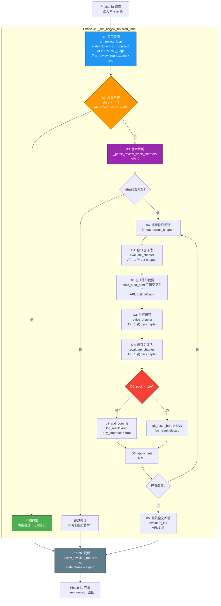

# 3.3.2 Phase 3b 审阅修订闭环 — 独立详细测试方案

> 版本：v1.0
> 日期：2026-06-21
> 目标：使用真实 API 验证 [`_run_review_revision_loop()`](pipeline_orchestrator.py:895) Phase 3b 完整链路
> 配置：`total_chapters=3`, `total_volumes=1`, `max_revision_cycles=1`, `max_revision_rounds=3`, `revision_threshold=1.0`
> API 预算：~7–19 次（仅 Phase 3b 部分，不含 Phase 3a）
> 通过标准：零崩溃、9 项验证点全部通过

---

## 前置条件

### 必须修复的 BUG（阻断 Phase 3b 执行）

| BUG ID | 位置 | 严重度 | 描述 | 修复 |
|--------|------|--------|------|------|
| **BUG-P3-01** | [`pipeline_orchestrator.py:691`](pipeline_orchestrator.py:691) | 🔴 崩溃 | `threshold` 未定义 → `NameError`（发生在 Phase 3a Step 6 采样评估） | → `CHAPTER_THRESHOLD` |
| **BUG-P3-02** | [`revision/gen_brief.py:41,54,264,439,607,749,754`](revision/gen_brief.py:41) | 🔴 崩溃 | 7 处 `sys.exit()` → `SystemExit` 绕过 `except Exception`，导致 Phase 3b Step D2 无法捕获 `build_auto_brief()` 失败 | → `raise ValueError()` |
| **BUG-P3-03** | [`pipeline_orchestrator.py:502`](pipeline_orchestrator.py:502) | 🟡 功能断裂 | Phase 3a 中 `generate_brief()` 未传 `output_path` → 共识修订被跳过 | → 传入 `output_path=brief_file` |

> **说明**：虽然 BUG-P3-01 和 BUG-P3-03 位于 Phase 3a 代码路径，但 Phase 3a 崩溃或跳过会导致 Phase 3b 无法正确执行或状态异常。

### Phase 1+2 前置文件（与 3.3.1 相同）

| 文件 | 要求 |
|------|------|
| [`output/world.md`](output/world.md) | ≥ 500 字 |
| [`output/characters.md`](output/characters.md) | ≥ 2 角色 |
| [`output/outline_volume.md`](output/outline_volume.md) | 存在 |
| [`output/outline.md`](output/outline.md) | ≥ 3 章节条目 |
| [`output/canon.md`](output/canon.md) | entries ≥ 3 |
| [`output/voice.md`](output/voice.md) | 存在 |
| [`output/chapters/ch_01.md`](output/chapters/ch_01.md) | ≥ 2000 字 |
| [`output/chapters/ch_02.md`](output/chapters/ch_02.md) | ≥ 2000 字 |
| [`output/chapters/ch_03.md`](output/chapters/ch_03.md) | ≥ 2000 字 |
| [`output/state.json`](output/state.json) | `phase="revision"`, `chapters_drafted=3`, `revision_cycle=0` |

### Phase 3a 前置（Phase 3b 运行前 Phase 3a 必须完成）

Phase 3b 是 [`run_revision()`](pipeline_orchestrator.py:431) 的内嵌阶段，在 Phase 3a 所有步骤（Step 1–Step 9）执行完毕后自动进入：

```
run_revision() → [Phase 3a: Step 1→9] → _run_review_revision_loop() → state["phase"] = "export"
```

| Phase 3a 步骤 | 产出要求（Phase 3b 依赖） |
|---------------|------------------------|
| Step 1 adversarial_edit | `output/edit_logs/ch*_cuts.json` ×3（被 `build_auto_brief` 三源引用） |
| Step 3 reader_panel | `output/edit_logs/reader_panel.json`（被 `build_auto_brief` 三源引用） |
| Step 9 evaluate_full | `output/eval_logs/full_eval*.json`（含 `weakest_chapter`、`novel_score`— 被 `build_auto_brief` 使用） |
| 全 Phase 3a | 章节文件已存在（`chapters/ch_*.md`） |

---

## Phase 3b 架构总览



### 代码路径映射

| 文档步骤 | 代码位置 | 行号 |
|---------|---------|------|
| B1 深度审阅 | [`pipeline_orchestrator.py → _run_review_revision_loop`](pipeline_orchestrator.py:910) | 909–914 |
| B2 质量检查 | [`pipeline_orchestrator.py`](pipeline_orchestrator.py:917) | 917–930 |
| B3 弱章解析 | [`pipeline_orchestrator.py`](pipeline_orchestrator.py:933) | 933–938 |
| B4 逐章修订 | [`pipeline_orchestrator.py`](pipeline_orchestrator.py:941) | 941–1044 |
| B5 最终全文评估 | [`pipeline_orchestrator.py`](pipeline_orchestrator.py:1061) | 1061–1071 |
| B6 状态切换 | [`pipeline_orchestrator.py`](pipeline_orchestrator.py:1081) | 1081–1087 |

---

## 9 项验证点详细说明

### V1 — 深度审阅 JSON 产出

| 项目 | 内容 |
|------|------|
| **验证条件** | `output/edit_logs/review_round1.json` 存在且合法 JSON |
| **必须字段** | `round`, `stars`, `major_items`, `total_items`, `qualified_items`, `raw_review`, `timestamp` |
| **调用链** | `run_revision()` → `_run_review_revision_loop()` → [`run_review_loop(state=None, max_rounds=1)`](revision/review.py:19) → `call_judge()` |
| **API** | 1 次 `call_judge` |
| **失败模式** | API 调用异常 → `except Exception` 捕获 → break 退出审阅修订循环 |
| **断言** | `review_jsons` 非空，`stars` 为数值，`raw_review` 非空字符串 |

### V2 — 质量检查早期退出

| 项目 | 内容 |
|------|------|
| **验证条件** | 若 `stars ≥ 4.5` 且 `major_items == 0`，日志输出 "质量通过，无需修订"，不进入弱章修订 |
| **触发条件** | 审阅结果优秀（星级高 + 无严重问题） |
| **不触发** | `stars < 4.5` 或 `major_items > 0` → 继续进入 V3 |
| **代码** | [`pipeline_orchestrator.py:928-930`](pipeline_orchestrator.py:928) |
| **API** | 0 |
| **注意** | 早期退出是**正常行为**，不是失败。验证方式是检查 stderr 日志是否含 "质量通过" 且后续无修订日志 |

### V3 — 弱章解析结果

| 项目 | 内容 |
|------|------|
| **验证条件** | `_parse_review_weak_chapters()` 返回列表，若含弱章则日志输出 "弱章节: [...]" |
| **解析器** | 已在 3.3.8 独立验证（5 子项全部 PASS），Phase 3b 集成测试仅验证调用链路和返回值 |
| **代码** | [`pipeline_orchestrator.py:837-893`](pipeline_orchestrator.py:837) → 内嵌函数 |
| **API** | 0 |
| **弱章为空** | 日志 "审阅未指出具体弱章节 — 跳过修订" → break |

### V4 — 修订前评估执行

| 项目 | 内容 |
|------|------|
| **验证条件** | 每个弱章 `evaluate_chapter(ch_num)` 被调用，产出 `chapter_*.json` 评估日志 |
| **代码** | [`pipeline_orchestrator.py:955-961`](pipeline_orchestrator.py:955) |
| **API** | 每弱章 1 次 |
| **异常处理** | `except Exception` → `pre_score = 0` |
| **断言** | `EVAL_LOGS_DIR / "chapter_*.json"` 在修订执行期间数量增加 |

### V5 — 修订摘要生成（含 fallback）

| 项目 | 内容 |
|------|------|
| **验证条件** | 每个弱章产出 `output/briefs/ch*_review_rnd*.md` 摘要文件 |
| **正常路径** | `build_auto_brief()` 从 `full_eval*.json` → `reader_panel.json` → `ch*_cuts.json` 三源交叉引用生成 |
| **降级路径** | `build_auto_brief()` 失败 → fallback 最小摘要（含章节号和轮次信息） |
| **关键修复** | **BUG-P3-02**：`build_auto_brief()` 中 `sys.exit()` → `ValueError` 才能被 `except Exception` 捕获 |
| **代码** | [`pipeline_orchestrator.py:965-980`](pipeline_orchestrator.py:965) |
| **API** | 0（纯数据组装） |
| **断言** | (a) brief 文件存在 (b) 内容非空 (c) 含 "修订摘要" 或章节号 |

### V6 — 修订执行 + 提交/回退

| 项目 | 内容 |
|------|------|
| **验证条件** | (a) `revise_chapter(ch_num, brief_file)` 执行成功 (b) 修订后评估 `post_score ≥ pre_score` → commit + `log_result(keep)` (c) `post_score < pre_score` → `git_reset_hard("HEAD")` + `log_result(discard)` |
| **代码** | 修订: [`pipeline_orchestrator.py:988-994`](pipeline_orchestrator.py:988)；提交/回退: [`1013-1036`](pipeline_orchestrator.py:1013) |
| **API** | 每弱章 2 次（revise + post_eval），pre_eval 另计（V4） |
| **异常处理** | `revise_chapter()` 异常 → `continue` 跳过该章 |
| **断言** | (a) `results.tsv` 含 `review-rev-ch*` 记录 (b) 若评分下降 → 含 `discard` + "倒退" (c) 章节内容未被劣化版本覆盖 |

### V7 — apply_cuts 在每章修订后执行

| 项目 | 内容 |
|------|------|
| **验证条件** | 每个修订完成的弱章后调用 `run_apply_cuts(str(ch_num), ["OVER-EXPLAIN", "REDUNDANT"], min_fat=15)` |
| **代码** | [`pipeline_orchestrator.py:1040-1044`](pipeline_orchestrator.py:1040) |
| **API** | 0 |
| **异常处理** | `except Exception` → skip 日志输出 |
| **断言** | 不崩溃（当前为占位实现） |

### V8 — 最终全文评估 + novel_score 更新

| 项目 | 内容 |
|------|------|
| **验证条件** | Phase 3b 循环结束后调用 `evaluate_full()`，`state["novel_score"]` 再次更新 |
| **代码** | [`pipeline_orchestrator.py:1061-1070`](pipeline_orchestrator.py:1061) |
| **API** | 1 次 `call_judge` |
| **异常处理** | `except Exception` → 日志 "全文评估失败" 但不崩溃 |
| **断言** | (a) `state["novel_score"] > 0` (b) `full_eval*.json` 数量增加 |
| **注意** | Phase 3a Step 9 也调用 `evaluate_full`，Phase 3b 结束时再次调用。两个 `novel_score` 可能不同 |

### V9 — State 最终状态

| 项目 | 内容 |
|------|------|
| **验证条件** | (a) `state["phase"] == "export"` (b) `state["review_revision_round"]` ≥ 0（早期退出为 0） (c) `state["revision_cycle"] ≥ 1` (d) `state["novel_score"] > 0` |
| **代码** | [`pipeline_orchestrator.py:1057-1058`](pipeline_orchestrator.py:1057) + [`1081-1083`](pipeline_orchestrator.py:1081) |
| **API** | 0 |
| **断言** | 四项 state 检查全部通过 |

---

## API 调用预算明细（Phase 3b 部分）

| 步骤 | API 次数 | 说明 |
|------|---------|------|
| B1 — 深度审阅 | 1 | `run_review_loop(max_rounds=1)` → `call_judge` ×1 |
| B4 — D1 修订前评估 | 0–5 | 每个弱章 ×1，弱章数 0–5 |
| B4 — D3 执行修订 | 0–5 | 每个弱章 ×1 |
| B4 — D4 修订后评估 | 0–5 | 每个弱章 ×1 |
| B5 — 最终全文评估 | 1 | `evaluate_full()` → `call_judge` ×1 |
| **Phase 3b 小计** | **2–17 次** | |
| Phase 3a（含） | 17–35 次 | adversarial_edit(3) + reader_panel(12) + 共识修订(0-16) + sample_eval(1-3) + evaluate_full(1) |
| **3.3.2 总计** | **19–52 次** | 与 3.3.1 相同（因为 Phase 3b 内嵌于 run_revision） |

> **注意**：由于 Phase 3b 嵌入在 `run_revision()` 内部，3.3.2 测试必须运行完整的 `run_revision()`（含 Phase 3a），因此 API 总预算与 3.3.1 相同。可在 `--reuse-phase3a` 模式下跳过 Phase 3a 的 API 重复调用（见下文测试策略）。

---

## 测试代码结构设计

### 插入位置

测试文件 [`tests/stage3_phase3_tests.py`](tests/stage3_phase3_tests.py) 当前结构：

```
行 302–316:  Test_3_3_0_Prerequisites
行 318–465:  Test_3_3_3_ConsensusParsing
行 467–608:  Test_3_3_8_WeakChapterParsing
行 610–759:  Test_3_3_1_RevisionFullCycle       ← Phase 3a + 3b 合并
行 761–871:  Test_3_3_6_7_DegradationPaths
行 873–977:  Test_3_3_5_RegressionRollback
行 979–1020: main（test_map 不含 3.3.2）
```

**插入方案**：在 [`Test_3_3_1_RevisionFullCycle`](tests/stage3_phase3_tests.py:616) 之后、[`Test_3_3_6_7_DegradationPaths`](tests/stage3_phase3_tests.py:767) 之前插入 `Test_3_3_2_ReviewRevisionLoop`。

同时在 `test_map`（第 999 行）中添加 `"3.3.2": Test_3_3_2_ReviewRevisionLoop`。

### 测试策略选择

由于 Phase 3b 是 `run_revision()` 的内嵌阶段，无法独立调用，提供两种策略：

#### 策略 A：自包含运行（默认，`--test 3.3.2` 时使用）

```
1. 检查 Phase 1+2 前置产出是否就绪
2. 清理 Phase 3 产物（_clean_phase3_output）
3. 调用 run_revision(state, max_cycles=1)  ← 完整 Phase 3a + 3b
4. 对 Phase 3b 产物进行 9 项详细验证
```

**优点**：完全自包含，不依赖 3.3.1 先行运行
**缺点**：API 调用翻倍（Phase 3a 重复执行）

#### 策略 B：依赖 3.3.1 产出（`--reuse-phase3a` 时使用）

```
1. 检查 Phase 3a 产物是否存在（cuts JSON + reader_panel + full_eval）
2. 仅验证 Phase 3b 特定产物（review_round*.json + briefs + state）
```

**优点**：API 调用为 0（纯文件验证）
**缺点**：依赖 3.3.1 先行运行，无法验证 Phase 3b 独立行为

**推荐**：默认使用策略 A，提供 `--reuse-phase3a` 选项供调试使用。

### 测试类设计

```python
# ============================================================
# 3.3.2 Phase 3b 审阅修订闭环（真实 API）
# ============================================================

@unittest.skipIf(SKIP_API, "跳过真实 API 调用")
class Test_3_3_2_ReviewRevisionLoop(unittest.TestCase):
    """3.3.2 Phase 3b 审阅修订闭环"""

    def setUp(self):
        _write_phase3_config()
        state = load_state()
        state["phase"] = "revision"
        state["revision_cycle"] = 0
        state["chapters_drafted"] = 3
        save_state(state)

    # --- 3.3.2 主测试：自包含运行完整 run_revision ---

    def test_3_3_2_review_revision_loop(self):
        """Phase 3b 审阅修订闭环 — 9 验证点"""
        # … 详见下方伪代码 …
```

### 测试伪代码

```python
def test_3_3_2_review_revision_loop(self):
    """Phase 3b 审阅修订闭环"""
    if not _check_api_key():
        self.skipTest("API Key 为占位符")

    missing = _check_phase12_outputs()
    if missing:
        self.skipTest(f"Phase 1+2 产出缺失: {missing}")

    _clean_phase3_output()

    from pipeline_orchestrator import run_revision

    state = load_state()
    self.assertEqual(state["phase"], "revision")
    self.assertEqual(state["revision_cycle"], 0)

    print("\n  [3.3.2] 开始 Phase 3b 审阅修订闭环 (max_cycles=1) ...")
    state, stderr_log = _capture_stderr(run_revision, state, max_cycles=1)

    # ============================================================
    # V1: review_round*.json 产出
    # ============================================================
    review_jsons = sorted(EDIT_LOGS_DIR.glob("review_round*.json"))
    self.assertGreater(len(review_jsons), 0,
                       "V1 FAIL: 深度审阅 JSON 未产出")
    latest = json.loads(review_jsons[-1].read_text(encoding="utf-8"))
    self.assertIn("stars", latest, "V1 FAIL: 缺少 stars")
    self.assertIn("major_items", latest, "V1 FAIL: 缺少 major_items")
    self.assertIn("raw_review", latest, "V1 FAIL: 缺少 raw_review")
    self.assertIsInstance(latest["stars"], (int, float),
                          "V1 FAIL: stars 不是数值")
    print(f"  [V1] PASS: review_round1.json ★{latest['stars']}, "
          f"{latest['major_items']} 严重问题 ✓")

    # ============================================================
    # V2: 质量检查（早期退出或继续）
    # ============================================================
    stars = latest["stars"]
    major_items = latest["major_items"]
    if stars >= 4.5 and major_items == 0:
        self.assertIn("质量通过", stderr_log,
                      "V2 FAIL: 早期退出但日志不含 '质量通过'")
        print(f"  [V2] PASS: 早期退出 (★{stars}, 无严重问题) ✓")
    else:
        print(f"  [V2] PASS: 进入弱章修订 (★{stars}, {major_items} 严重问题) ✓")

    # ============================================================
    # V3: 弱章解析
    # ============================================================
    weak_chapter_log = "弱章节" in stderr_log
    no_weak_log = "审阅未指出具体弱章节" in stderr_log
    if no_weak_log:
        print(f"  [V3] PASS: 无弱章节（跳过修订） ✓")
    elif weak_chapter_log:
        print(f"  [V3] PASS: 弱章节已解析 ✓")
    else:
        print(f"  [V3] ⚠ 无法确定弱章状态（可能 stars≥4.5 早期退出）")

    # ============================================================
    # V4+V5: 修订前评估 + 修订摘要产出
    # ============================================================
    chapter_evals_before = len(list(EVAL_LOGS_DIR.glob("chapter_*.json")))

    # 检查 brief 文件（Phase 3b 特有命名: ch*_review_rnd*.md）
    review_brief_files = sorted(BRIEFS_DIR.glob("ch*_review_rnd*.md"))
    if review_brief_files:
        print(f"  [V4+V5] PASS: {len(review_brief_files)} 个修订摘要 ✓")
        for bf in review_brief_files[:3]:
            content = bf.read_text(encoding="utf-8")
            self.assertGreater(len(content.strip()), 0,
                               f"V5 FAIL: {bf.name} 为空")
            print(f"    {bf.name}: {len(content)} 字符")
    else:
        print(f"  [V4+V5] ⚠ 无 Phase 3b 修订摘要（可能早期退出或无弱章）")

    # ============================================================
    # V6: 修订执行 + 提交/回退
    # ============================================================
    if RESULTS_FILE.exists():
        results = RESULTS_FILE.read_text(encoding="utf-8")
        has_review_rev = "review-rev-ch" in results
        has_discard = "discard" in results and "review-rev" in results
        if has_review_rev:
            print(f"  [V6] PASS: results.tsv 含 review-rev 记录 ✓")
        if has_discard:
            print(f"  [V6] PASS: results.tsv 含 discard 回退记录 ✓")
        if not has_review_rev and not has_discard:
            print(f"  [V6] ⚠ 无 Phase 3b 修订记录（可能早期退出）")

    # ============================================================
    # V7: apply_cuts 执行（不崩溃）
    # ============================================================
    self.assertNotIn("Traceback", stderr_log,
                     "V7 FAIL: stderr 含 Traceback")
    print(f"  [V7] PASS: apply_cuts 不崩溃 ✓")

    # ============================================================
    # V8: 最终全文评估 + novel_score 更新
    # ============================================================
    self.assertGreater(state.get("novel_score", 0), 0,
                       "V8 FAIL: novel_score 未更新")
    full_evals = sorted(EVAL_LOGS_DIR.glob("full_eval*.json"))
    self.assertGreater(len(full_evals), 0,
                       "V8 FAIL: 全文评估日志缺失")
    print(f"  [V8] PASS: novel_score={state['novel_score']:.1f}, "
          f"full_eval 日志: {len(full_evals)} 个 ✓")

    # ============================================================
    # V9: state 最终状态
    # ============================================================
    self.assertEqual(state["phase"], "export",
                     f"V9 FAIL: phase={state['phase']}")
    self.assertIn("review_revision_round", state,
                  "V9 FAIL: 缺少 review_revision_round")
    rrr = state.get("review_revision_round", 0)
    self.assertGreaterEqual(rrr, 0,
                            f"V9 FAIL: review_revision_round={rrr}")
    self.assertGreaterEqual(state["revision_cycle"], 1,
                            "V9 FAIL: revision_cycle < 1")
    print(f"  [V9] PASS: phase=export, revision_cycle={state['revision_cycle']}, "
          f"review_revision_round={rrr} ✓")

    print(f"\n  [3.3.2] PASS: Phase 3b 审阅修订闭环 ✓")
```

---

## 测试执行顺序

```
1. 3.3.0  前置条件检查（零 API）— 如不通过，停止
2. 3.3.3  共识解析测试（零 API）— 先验证解析器
3. 3.3.8  弱章解析测试（零 API）— 先验证解析器（3.3.2 V3 依赖）
4. 3.3.1  Phase 3a 修订闭环（真实 API ~17-35 次）— 核心流程
5. 3.3.2  Phase 3b 审阅修订闭环（真实 API ~19-52 次）— 3.3.1 的子阶段深度验证
6. 3.3.5  评分倒退回退（Mock + 真实 API ~4 次）
7. 3.3.6+7 降级路径（Mock + 真实 API）
8. 3.3.4  平台期检测（可选，API 消耗大）
```

**推荐命令**：

```powershell
# 仅运行 3.3.2（自包含，会先执行 Phase 3a 再验证 Phase 3b）
python tests/stage3_phase3_tests.py --test 3.3.2

# 先运行 3.3.1 再运行 3.3.2（复用 Phase 3a 产出，减少重复 API 调用）
python tests/stage3_phase3_tests.py --test 3.3.1
python tests/stage3_phase3_tests.py --test 3.3.2 --reuse-phase3a

# 完整 Phase 3 测试（含 3.3.2）
python tests/stage3_phase3_tests.py
```

---

## 门禁标准

| 验证项 | 通过标准 | 不通过时 |
|--------|---------|---------|
| V1 review JSON | `review_round1.json` 存在，含 `stars`/`major_items`/`raw_review` | 阻断 Phase 3b（审阅失败） |
| V2 早期退出 | `stars ≥ 4.5 ∧ major_items == 0` → 日志 "质量通过" | 非阻塞（正常变体） |
| V3 弱章解析 | `_parse_review_weak_chapters()` 调用不崩溃 | 阻断 V4–V6 |
| V4 修订前评估 | 每个弱章 `chapter_*.json` 产出 | 降级（pre_score=0） |
| V5 修订摘要 | 每个弱章 brief 文件存在且非空 | 降级（fallback brief） |
| V6 修订+回退 | `results.tsv` 含 `review-rev` 记录；回退正确 | Stage 4 复验 |
| V7 apply_cuts | 不崩溃 | Stage 4 修复 |
| V8 最终评估 | `novel_score > 0`，`full_eval*.json` 存在 | 降级（日志警告） |
| V9 state | `phase=export`, `review_revision_round ≥ 0`, `revision_cycle ≥ 1` | 阻断 Phase 4 |

---

## 与 3.3.1 的差异对照

| 维度 | 3.3.1 Phase 3a | 3.3.2 Phase 3b |
|------|---------------|---------------|
| **核心函数** | `run_revision()` Phase 3a 部分 | `_run_review_revision_loop()`（内嵌于 run_revision） |
| **关键产出** | cuts JSON、reader_panel.json、consensus、full_eval | review_round*.json、review briefs、review-rev 记录 |
| **API 调用** | 17–35 次 | 2–17 次（Phase 3b 部分） |
| **零 API 测试** | 3.3.3（共识解析）、3.3.8（弱章解析） | 3.3.2 V2/V3/V7/V9 均可在有产出后零 API 验证 |
| **降级路径** | 3.3.6（brief 降级）、3.3.7（revise 降级） | Phase 3b 内嵌相同降级逻辑（build_auto_brief fallback + revise skip） |
| **回退逻辑** | 3.3.5（共识修订回退） | V6（审阅修订回退，代码路径不同：`pipeline_orchestrator.py:1027-1036`） |
| **测试策略** | 自包含 run_revision | 自包含 run_revision 或 `--reuse-phase3a` |

---

## 已知风险与缓解策略

| 风险 | 缓解 |
|------|------|
| **BUG-P3-02 未修复** — `build_auto_brief()` 中 `sys.exit()` 导致 `SystemExit` 绕过 `except Exception`，Phase 3b Step D2 异常无法捕获 → 流程崩溃 | BUG-P3-02 修复：7 处 `sys.exit()` → `raise ValueError()` |
| **无 `full_eval*.json`** — `build_auto_brief()` 需要的 `latest_full_eval()` 返回 None → `sys.exit()`（未修复时崩溃） | BUG-P3-02 修复后 → `except Exception` 捕获 → fallback brief |
| **early exit** — `stars ≥ 4.5 ∧ major_items == 0` 时 Phase 3b 提前退出，V4–V7 验证点无法触发 | 在 V2 中检测早期退出并标记为 PASS 变体，不视为失败 |
| **弱章数为 0** — 审阅未指出具体弱章，V4–V6 跳过 | 在 V3 中检测并标记 |
| **API 限流 429/503** | `api_client.py` 内置 3 次重试 + 4s 间隔 |
| **`evaluate_chapter()` 返回 `-1.0`** | `parse_score` fallback → 不崩溃；回退逻辑中 `post_score < pre_score` 判断仍然有效 |
| **与 3.3.1 重复执行 Phase 3a** | 提供 `--reuse-phase3a` 选项，在 3.3.1 之后运行 3.3.2 时跳过 API 调用 |

---

## 实施清单

### 代码修改

- [ ] 在 [`tests/stage3_phase3_tests.py`](tests/stage3_phase3_tests.py) 中 [`Test_3_3_1_RevisionFullCycle`](tests/stage3_phase3_tests.py:759) 之后插入 `Test_3_3_2_ReviewRevisionLoop` 类
- [ ] 在 `main` 函数的 `test_map`（第 999 行）中添加 `"3.3.2": Test_3_3_2_ReviewRevisionLoop`
- [ ] 实现 `test_3_3_2_review_revision_loop` 方法（9 验证点）
- [ ] 可选：实现 `--reuse-phase3a` 命令行参数解析，在 Phase 3a 产出存在时跳过 `run_revision()` 调用

### 前置 BUG 修复（在运行前完成）

- [ ] BUG-P3-01：`threshold` → `CHAPTER_THRESHOLD`（[`pipeline_orchestrator.py:691`](pipeline_orchestrator.py:691)）
- [ ] BUG-P3-02：7 处 `sys.exit()` → `raise ValueError()`（[`revision/gen_brief.py`](revision/gen_brief.py:41)）
- [ ] BUG-P3-03：`generate_brief()` 传入 `output_path=brief_file`（[`pipeline_orchestrator.py:502`](pipeline_orchestrator.py:502)）

### 运行验证

- [ ] `python tests/stage3_phase3_tests.py --test 3.3.2` — 自包含运行
- [ ] `python tests/stage3_phase3_tests.py --test 3.3.2 --reuse-phase3a` — 复用 Phase 3a 模式
- [ ] 检查 9 项验证点全部 PASS 或标记为正常变体（早期退出/无弱章）
- [ ] 确认 `state["phase"] == "export"`，可衔接 Phase 4