# 3.3.4 平台期检测 — 独立详细测试方案

> 版本：v1.0
> 日期：2026-06-21
> 目标：验证 [`run_revision()`](pipeline_orchestrator.py:425) Step 7 平台期检测逻辑 — 条件门控、delta 阈值、break 行为、配置优先级
> 策略：**纯逻辑验证 + Mock 模拟循环**（零 API 成本）
> 配置：`total_chapters=3`, `total_volumes=1`, `plateau_delta=0.5`, `max_revision_cycles=3`
> 通过标准：9 项验证点全部通过，0 崩溃，0 未捕获异常

---

## 关键发现：MIN_REVISION_CYCLES 硬编码

在分析平台期检测代码时发现关键设计约束：

| 常量 | 位置 | 值 | 来源 |
|------|------|----|------|
| `MIN_REVISION_CYCLES` | [`pipeline_orchestrator.py:48`](pipeline_orchestrator.py:48) | **3** | **硬编码**，不从 config.json 读取 |
| `PLATEAU_DELTA` | [`pipeline_orchestrator.py:50`](pipeline_orchestrator.py:50) | **0.3** | 硬编码默认值，config.json 可覆盖 |

```python
# pipeline_orchestrator.py:47-50
MIN_REVISION_CYCLES = 3         # ← 硬编码
MAX_REVISION_CYCLES = 6
PLATEAU_DELTA = 0.3             # ← 硬编码默认值
```

而 `plateau_delta` 的实际使用值从 config 读取（第 438 行）：

```python
# pipeline_orchestrator.py:438
plateau_delta = cfg.get("plateau_delta", PLATEAU_DELTA) if cfg.loaded else PLATEAU_DELTA
```

**影响**：现有测试配置 `max_revision_cycles=1` 永远无法触发平台期检测，因为 `MIN_REVISION_CYCLES = 3`。需要 `max_revision_cycles ≥ 3` 才能进入检测逻辑。3 轮完整 Phase 3a 需要 24-48 次真实 API 调用，因此本测试方案采用零 API 成本的 Mock 策略。

---

## 目标代码分析

### 平台期检测代码路径

```python
# pipeline_orchestrator.py:825-831 (Step 7)
# Step 7: 平台期检测
if cycle >= MIN_REVISION_CYCLES and abs(novel_score - prev_score) < plateau_delta:
    step(f"平台期检测 (delta {abs(novel_score - prev_score):.2f} "
         f"< {plateau_delta}) — 停止修订")
    break
```

### 循环上下文

```python
# pipeline_orchestrator.py:449-831 (简化)
prev_score = state.get("novel_score", 0.0)
for cycle in range(start_cycle, max_cycles + 1):
    # ... Step 1-8: 对抗编辑 → 读者评审 → 共识修订 → 采样 → 跨卷 → 合并修订 ...
    
    # Step 9: evaluate_full() → parse_score → novel_score
    novel_score = parse_score(full_eval, "novel_score")
    ...
    
    # Step 7: 平台期检测 ← 测试目标
    if cycle >= MIN_REVISION_CYCLES and abs(novel_score - prev_score) < plateau_delta:
        break
    
    prev_score = novel_score  # ← 未 break 时更新
```

### 平台期条件的三元组

| 条件 | 含义 | 测试必要性 |
|------|------|-----------|
| `cycle >= MIN_REVISION_CYCLES` | 门控：至少运行 3 轮才检查 | **VP1** — 验证 cycle=1,2 不触发 |
| `abs(novel_score - prev_score) < plateau_delta` | 增量：前后两轮评分差异小于阈值 | **VP2** — 触发 break；**VP3** — 不触发 |
| `break` | 效果：立即退出 for 循环 | **VP4** — 日志验证；**VP5** — state 验证 |

---

## 前置条件

### 环境要求（与 3.3.1/3.3.2 一致）

| 配置项 | 值 |
|--------|-----|
| Python | ≥ 3.9 |
| 写作模型 | `deepseek-ai/DeepSeek-V4-Flash` |
| `total_chapters` | 3 |
| `total_volumes` | 1 |
| `revision_threshold` | 1.0（极低，确保单次通过） |

### 3.3.4 专用配置

| 配置项 | 值 | 说明 |
|--------|----|------|
| `max_revision_cycles` | **3** | 必须 ≥ MIN_REVISION_CYCLES=3 才能触发平台期检测 |
| `plateau_delta` | 按测试场景动态设置（0.01 / 999 / 0.5） | |

### Mock 依赖清单

`run_revision()` 内部循环依赖以下 API 调用模块，全部需要 Mock：

| 模块 | 导入位置 | 作用 | Mock 策略 |
|------|---------|------|----------|
| `revision.adversarial_edit.run_adversarial_edit` | 行 453-454 | Step 1 对抗编辑 | `Mock(return_value=None)` |
| `revision.reader_panel.run_reader_panel` | 行 474-475 | Step 3 读者评审团 | `Mock(return_value=None)` |
| `revision.gen_brief.generate_brief` | 行 498 | Step 5 生成修订摘要 | `Mock(return_value=None)` |
| `revision.gen_brief.build_auto_brief` | 行 972 | Phase 3b auto brief | `Mock(return_value=None)` |
| `revision.gen_revision.revise_chapter` | 行 514 | Step 5/8 执行修订 | `Mock(return_value=None)` |
| `evaluation.evaluate.evaluate_chapter` | 行 503/514 | Step 5/8 评估章节 | `Mock(return_value="overall_score: 9.0")` |
| `evaluation.evaluate.evaluate_full` | 行 806 | Step 9 全文评估 | **核心 Mock**，返回受控评分 |
| `revision.review.run_review_loop` | 行 913 | Phase 3b 深度审阅 | `Mock(return_value=None)` |

### Phase 1+2 前置产出要求（同 3.3.1）

| 文件 | 路径 | 说明 |
|------|------|------|
| 世界观 | [`output/world.md`](output/world.md) | 内容 ≥ 500 字 |
| 角色注册表 | [`output/characters.md`](output/characters.md) | 含 ≥ 2 个角色条目 |
| 卷级总纲 | [`output/outline_volume.md`](output/outline_volume.md) | 卷级规划 |
| 章级大纲 | [`output/outline.md`](output/outline.md) | 含 3 章节条目 |
| 正典 | [`output/canon.md`](output/canon.md) | `entries ≥ 3` |
| 文风定义 | [`output/voice.md`](output/voice.md) | 存在 |
| 第 1-3 章 | [`output/chapters/ch_0*.md`](output/chapters/) | 每章 ≥ 500 字 |
| State | [`output/state.json`](output/state.json) | `phase="revision"`, `chapters_drafted=3`, `revision_cycle=0` |

### 必须修复的阻塞 BUG（与 3.3.1/3.3.2 相同）

| BUG ID | 位置 | 严重度 | 描述 |
|--------|------|--------|------|
| **BUG-P3-01** | [`pipeline_orchestrator.py:691`](pipeline_orchestrator.py:691) | 🔴 崩溃 | `threshold` 未定义 → `NameError`（但跨卷一致性在 1 卷时跳过，不影响） |
| **BUG-P3-02** | [`revision/gen_brief.py`](revision/gen_brief.py:41) 多处 | 🔴 崩溃 | 7 处 `sys.exit()` → `SystemExit` 绕过 `except Exception` |
| **BUG-P3-03** | [`pipeline_orchestrator.py:502`](pipeline_orchestrator.py:502) | 🟡 功能断裂 | `generate_brief()` 未传 `output_path` |

> **注意**：由于本测试 Mock 了所有 API 调用模块，BUG-P3-02（`sys.exit`）不会触发。但若 Mock 未正确覆盖，需确保这些 BUG 已在源码中修复。

---

## 测试架构总览

```mermaid
flowchart TD
    subgraph S3_4["3.3.4 平台期检测 — 测试架构"]
        VP1["VP1: cycle 门控验证\nAPI: 0\n验证: cycle=1,2 不触发 break"]
        VP2["VP2: delta 阈值触发\nAPI: 0\n验证: 极小 plateau_delta 触发 break"]
        VP3["VP3: delta 阈值不触发\nAPI: 0\n验证: 极大 plateau_delta 循环正常完成"]
        VP4["VP4: 平台期日志\nAPI: 0\n验证: stderr 含 '平台期' 关键词"]
        VP5["VP5: break 后 state\nAPI: 0\n验证: revision_cycle < max_cycles"]
        VP6["VP6: MIN_REVISION_CYCLES 硬编码\nAPI: 0\n验证: 常量值 = 3 且不受 config 影响"]
        VP7["VP7: plateau_delta 配置优先级\nAPI: 0\n验证: config.json → PLATEAU_DELTA fallback"]
        VP8["VP8: prev_score=0 边界\nAPI: 0\n验证: 首轮 novel_score 为 0 时条件不误触发"]
        VP9["VP9: plateau_delta 与平台期日志一致性\nAPI: 0\n验证: 同条件不同 delta 行为一致"]
    end

    VP6 --> VP7
    VP7 --> VP1
    VP1 --> VP2
    VP2 --> VP3
    VP3 --> VP4
    VP4 --> VP5
    VP5 --> VP8
    VP8 --> VP9

    style VP1 fill:#4CAF50,stroke:#333,color:#fff
    style VP2 fill:#FF9800,stroke:#333,color:#fff
    style VP3 fill:#2196F3,stroke:#333,color:#fff
    style VP4 fill:#9C27B0,stroke:#333,color:#fff
    style VP5 fill:#f44336,stroke:#333,color:#fff
    style VP6 fill:#607D8B,stroke:#333,color:#fff
    style VP7 fill:#795548,stroke:#333,color:#fff
    style VP8 fill:#E91E63,stroke:#333,color:#fff
    style VP9 fill:#00BCD4,stroke:#333,color:#fff
```



### 测试策略

本测试采用两种互补策略：

#### 策略 A：纯逻辑验证（VP1–VP9，零 API）

将平台期检测条件提取为独立可测函数，参数化覆盖所有边界情况。不依赖 `run_revision()` 完整执行，不触发任何 API 调用。**推荐作为主测试策略。**

#### 策略 B：全流程 Mock 模拟（VP2+VP4+VP5，零 API）

Mock 全部 API 依赖，在模拟环境中运行 `run_revision(state, max_cycles=3)`，通过控制 `evaluate_full` 返回的评分序列验证 break 行为。验证循环级别的集成行为。**作为策略 A 的补充。**

---

## 9 项验证点详细说明

### VP1 — cycle 门控验证

| 项目 | 内容 |
|------|------|
| **测试方法** | 参数化测试：固定 `plateau_delta=999`（永不触发），`MIN_REVISION_CYCLES=3`，枚举 cycle=1,2,3,4 |
| **验证条件** | cycle=1,2 → 条件不满足（`cycle < MIN_REVISION_CYCLES`）；cycle≥3 → 进入检测逻辑 |
| **代码** | [`pipeline_orchestrator.py:826`](pipeline_orchestrator.py:826) — `cycle >= MIN_REVISION_CYCLES` |
| **API** | 0 |
| **断言** | (a) 条件函数 `_check_plateau(cycle=1, ...)` → `False` (b) `_check_plateau(cycle=2, ...)` → `False` (c) `_check_plateau(cycle=3, delta=0.01, threshold=0.5)` → `True` |
| **失败模式** | 若 `MIN_REVISION_CYCLES` 被意外从 config 读取而非硬编码，测试捕获 |

### VP2 — delta 阈值触发 break

| 项目 | 内容 |
|------|------|
| **测试方法** | Mock `evaluate_full` 返回 `"novel_score: 7.50\n"` → `"novel_score: 7.51\n"` → `"novel_score: 7.51\n"`，delta=0.01；配置 `plateau_delta=0.5` |
| **验证条件** | 第 3 轮 delta = abs(7.51 - 7.51) = 0.00 < 0.5 → 触发 break |
| **代码** | [`pipeline_orchestrator.py:826-829`](pipeline_orchestrator.py:826) |
| **API** | 0（全部 Mock） |
| **断言** | (a) `state["revision_cycle"] == 3`（在第 3 轮 break，非正常结束）(b) `state["revision_cycle"] < 3` — 等等，这里要仔细：`revision_cycle` 在 Step 9 之后、break 之前已保存（第 822 行 `state["revision_cycle"] = cycle`），所以 break 时 `revision_cycle == cycle`。若 cycle=3 时 delta=0 < 0.5 触发 break，则 `revision_cycle == 3`。若 `max_cycles=3`，正常结束也是 3。所以当 `max_cycles > MIN_REVISION_CYCLES` 时，break 时的 `revision_cycle < max_cycles` 才能证明平台期触发。推荐 `max_cycles=4`。(c) stderr 含 "平台期检测" |
| **注意** | `evaluate_full` Mock 返回值的 `parse_score` 兼容性：需返回 `"novel_score: 7.51\n"` 格式 |

### VP3 — delta 阈值不触发

| 项目 | 内容 |
|------|------|
| **测试方法** | Mock `evaluate_full` 返回 `"novel_score: 6.0\n"` → `"novel_score: 8.0\n"` → `"novel_score: 9.5\n"`，delta 分别为 2.0 和 1.5；配置 `plateau_delta=0.5` |
| **验证条件** | 每轮 delta 远超阈值，不触发 break，循环正常完成 max_cycles 轮 |
| **代码** | [`pipeline_orchestrator.py:826-831`](pipeline_orchestrator.py:826) |
| **API** | 0（全部 Mock） |
| **断言** | (a) `state["revision_cycle"] == max_cycles`（正常结束）(b) stderr **不含** "平台期检测" |

### VP4 — 平台期日志验证

| 项目 | 内容 |
|------|------|
| **测试方法** | 在 VP2 的 Mock 场景中捕获 stderr，验证 break 时输出的日志 |
| **验证条件** | (a) stderr 含 "平台期检测" 或 "plateau" (b) stderr 含 delta 数值 (c) stderr 含 `plateau_delta` 阈值 |
| **代码** | [`pipeline_orchestrator.py:827-828`](pipeline_orchestrator.py:827) — `step()` 输出 |
| **API** | 0 |
| **断言** | `assertIn("平台期检测", stderr_log)` 和 `assertIn(str(plateau_delta), stderr_log)` |
| **失败模式** | 若 `step()` 函数输出被重定向或日志格式变化，断言需同步更新 |

### VP5 — break 后 state 状态

| 项目 | 内容 |
|------|------|
| **测试方法** | 在 VP2 场景中验证 break 后的 state |
| **验证条件** | (a) `revision_cycle` 等于 break 时的 cycle 值 (b) `novel_score` 已保存最后一轮的评分 (c) `phase` 已切换为 `"export"`（Phase 3b 正常完成） |
| **代码** | [`pipeline_orchestrator.py:821-823`](pipeline_orchestrator.py:821) — break 前已 save_state |
| **API** | 0 |
| **断言** | `assertEqual(state["revision_cycle"], break_cycle)` `assertGreater(state["novel_score"], 0)` `assertEqual(state["phase"], "export")` |

### VP6 — MIN_REVISION_CYCLES 硬编码常量

| 项目 | 内容 |
|------|------|
| **测试方法** | 直接导入 `pipeline_orchestrator.MIN_REVISION_CYCLES` 验证值为 3 |
| **验证条件** | (a) `MIN_REVISION_CYCLES == 3` (b) config.json 中不存在 `min_revision_cycles` 键（或即使存在也不影响该常量） |
| **代码** | [`pipeline_orchestrator.py:48`](pipeline_orchestrator.py:48) |
| **API** | 0 |
| **断言** | `assertEqual(MIN_REVISION_CYCLES, 3)` |
| **设计意图** | 此验证点确保若未来有人将 `MIN_REVISION_CYCLES` 改为从 config 读取，测试会明确失败，提示需同步更新本测试的 Mock 策略 |

### VP7 — plateau_delta 配置优先级

| 项目 | 内容 |
|------|------|
| **测试方法** | 设置 `config.json` 中 `plateau_delta = 0.01`，验证 `run_revision` 内部读取的是 config 值而非 `PLATEAU_DELTA = 0.3` |
| **验证条件** | (a) config `plateau_delta=0.01` → 内部使用 0.01 (b) config 无 `plateau_delta` → fallback 到 `PLATEAU_DELTA=0.3` (c) config 未 loaded → 使用 `PLATEAU_DELTA=0.3` |
| **代码** | [`pipeline_orchestrator.py:438`](pipeline_orchestrator.py:438) — `cfg.get("plateau_delta", PLATEAU_DELTA)` |
| **API** | 0（使用局部函数提取验证） |
| **断言** | (a) 读取 config 值正确 (b) fallback 值正确 |

### VP8 — prev_score=0 边界条件

| 项目 | 内容 |
|------|------|
| **测试方法** | 设置 `state["novel_score"] = 0.0`（模拟首次修订），Mock `evaluate_full` 返回 `"novel_score: 0.01\n"` |
| **验证条件** | `prev_score=0`, `novel_score=0.01`, delta=0.01。若 `plateau_delta=0.5`，则 `0.01 < 0.5` 成立。需验证 cycle≥3 时才检查，cycle=1,2 时应跳过 |
| **代码** | [`pipeline_orchestrator.py:432`](pipeline_orchestrator.py:432) — `prev_score = state.get("novel_score", 0.0)` |
| **API** | 0 |
| **断言** | (a) cycle=1,2 不触发 (b) cycle=3 且 delta=0.01 < 0.5 时触发 break |
| **边界风险** | 若未来门控条件被移除（`cycle >= MIN_REVISION_CYCLES` 被删除），`prev_score=0` 时几乎所有 `novel_score` 都满足 delta < threshold |

### VP9 — plateau_delta 与平台期日志一致性

| 项目 | 内容 |
|------|------|
| **测试方法** | Mock `evaluate_full` 返回固定评分序列 `7.0 → 7.3 → 7.3`，分别测试 `plateau_delta=0.2` 和 `plateau_delta=0.5` |
| **验证条件** | (a) `plateau_delta=0.2`：delta=0.3 > 0.2 → 不触发 (b) `plateau_delta=0.5`：delta=0.3 < 0.5 且 delta=0.0 < 0.5 → 第 3 轮触发 break |
| **代码** | [`pipeline_orchestrator.py:826`](pipeline_orchestrator.py:826) — 条件完整评估 |
| **API** | 0 |
| **断言** | (a) delta=0.2 时 `revision_cycle == max_cycles` (b) delta=0.5 时 `revision_cycle == 3` 且 stderr 含 "平台期检测" |

---

## Mock 策略设计

### 为什么需要全流程 Mock

`run_revision()` 内部 for 循环（第 449-831 行）包含 9 个步骤，平台期检测在最后一步。要到达平台期检测需要前 8 步全部成功执行，而前 8 步依赖以下真实 API 调用：

| 步骤 | API 调用 | 每轮次数 |
|------|---------|---------|
| Step 1 对抗编辑 | `run_adversarial_edit("all")` → `call_judge()` ×3 | 3 |
| Step 3 读者评审 | `run_reader_panel()` → `call_judge()` ×12 | 12 |
| Step 5 共识修订 | `generate_brief()` + `revise_chapter()` + `evaluate_chapter()` | 0-N |
| Step 6 采样评估 | `evaluate_chapter()` ×采样数 | 0-5 |
| Step 9 全文评估 | `evaluate_full()` → `call_judge()` | 1 |
| Phase 3b | `run_review_loop()` + `evaluate_chapter()` + `revise_chapter()` | 2-N |

**总计每轮 16+ 次 API 调用，2-3 轮需 48+ 次。**

### Mock 目标模块

```python
# 需 Mock 的全部导入（均在 run_revision 函数内部导入）
MOCK_TARGETS = [
    "revision.adversarial_edit.run_adversarial_edit",      # Step 1
    "revision.reader_panel.run_reader_panel",              # Step 3
    "revision.gen_brief.generate_brief",                   # Step 5
    "revision.gen_brief.build_auto_brief",                 # Phase 3b
    "revision.gen_revision.revise_chapter",                # Step 5, 8
    "evaluation.evaluate.evaluate_chapter",                # Step 5, 6, 8
    "evaluation.evaluate.evaluate_full",                   # Step 9 ← 核心
    "revision.review.run_review_loop",                     # Phase 3b
]
```

### 核心 Mock: evaluate_full

```python
def _create_full_eval_mock(scores: list[float]):
    """创建返回指定评分序列的 evaluate_full mock。
    
    Args:
        scores: 每轮返回的 novel_score 序列，长度应等于 max_cycles
    
    Returns:
        一个 MagicMock，依次返回 scores 中对应轮次的评分字符串
    """
    call_count = [0]
    
    def mock_evaluate_full(max_total_time=None):
        idx = call_count[0]
        call_count[0] += 1
        if idx >= len(scores):
            idx = len(scores) - 1
        score = scores[idx]
        # parse_score 兼容格式：冒号格式 "novel_score: 7.50"
        return f"novel_score: {score:.2f}\noverall_score: {score:.2f}\n"
    
    return mock_evaluate_full
```

### Mock 编排时序

```python
import unittest.mock as mock

def _run_mocked_revision(state, evaluate_scores, plateau_delta, max_cycles):
    """在全部 API Mock 环境下运行 run_revision。
    
    Args:
        state: 初始 state dict
        evaluate_scores: 每轮 evaluate_full 返回的分数序列
        plateau_delta: 平台期 delta 阈值
        max_cycles: 最大修订轮数
    
    Returns:
        (state, stderr_log) 元组
    """
    _write_phase3_config({
        "plateau_delta": plateau_delta,
        "max_revision_cycles": max_cycles,
    })
    
    full_eval_mock = _create_full_eval_mock(evaluate_scores)
    
    patches = [
        mock.patch("revision.adversarial_edit.run_adversarial_edit",
                   return_value=None),
        mock.patch("revision.reader_panel.run_reader_panel",
                   return_value=None),
        mock.patch("revision.gen_brief.generate_brief",
                   return_value=None),
        mock.patch("revision.gen_brief.build_auto_brief",
                   return_value=None),
        mock.patch("revision.gen_revision.revise_chapter",
                   return_value=None),
        mock.patch("evaluation.evaluate.evaluate_chapter",
                   return_value="overall_score: 9.0\n"),
        mock.patch("evaluation.evaluate.evaluate_full",
                   side_effect=full_eval_mock),
        mock.patch("revision.review.run_review_loop",
                   return_value=None),
    ]
    
    for p in patches:
        p.start()
    
    try:
        from pipeline_orchestrator import run_revision
        state, stderr_log = _capture_stderr(run_revision, state,
                                            max_cycles=max_cycles)
    finally:
        for p in reversed(patches):
            p.stop()
    
    return state, stderr_log
```

### evaluate_chapter 的 Mock 特别注意事项

`evaluate_chapter()` 在 `run_revision()` 中多处被调用（共识修订前后、采样评估、合并队列修订前后、Phase 3b 修订前后），且其返回值通过 `parse_score()` 解析为数值。Mock 需返回兼容格式：

```python
# 兼容 parse_score 两种格式
mock.patch("evaluation.evaluate.evaluate_chapter",
           return_value="overall_score: 9.0\n")
```

若 `parse_score` 无法从 Mock 返回值中提取分数，会返回 -1（fallback 值），可能导致意外回退逻辑。因此 Mock 返回值必须包含 `"overall_score: N"` 格式。

---

## 纯逻辑验证 — 平台期条件函数提取

为了能在不运行 `run_revision` 的情况下测试平台期条件逻辑，将条件提取为独立函数：

```python
# 提取自 pipeline_orchestrator.py:826
def _check_plateau_condition(
    cycle: int,
    novel_score: float,
    prev_score: float,
    plateau_delta: float,
    min_revision_cycles: int = 3,
) -> bool:
    """平台期检测条件（纯逻辑，零副作用）。
    
    当且仅当 cycle >= min_revision_cycles 且评分变化小于阈值时返回 True。
    """
    return (
        cycle >= min_revision_cycles
        and abs(novel_score - prev_score) < plateau_delta
    )
```

此函数：
- 等价于 [`pipeline_orchestrator.py:826`](pipeline_orchestrator.py:826) 的条件表达式
- 可在 `tests/stage3_phase3_tests.py` 中定义（作为本测试类的方法或模块级函数）
- 用于 VP1、VP8 的参数化测试

---

## 测试代码结构设计

### 插入位置

测试文件 [`tests/stage3_phase3_tests.py`](tests/stage3_phase3_tests.py) 当前结构：

```
行 302–316:  Test_3_3_0_Prerequisites
行 318–465:  Test_3_3_3_ConsensusParsing
行 467–608:  Test_3_3_8_WeakChapterParsing
行 610–759:  Test_3_3_1_RevisionFullCycle
行 761–871:  Test_3_3_2_ReviewRevisionLoop      ← 3.3.2 已计划插入此处
行 873–977:  Test_3_3_5_RegressionRollback
行 979–1020: Test_3_3_6_7_DegradationPaths
行 1021–1055: Test_3_3_5_RegressionRollback（第二部分）
行 1144–1187: main
```

**插入方案**：在 [`Test_3_3_2_ReviewRevisionLoop`](tests/stage3_phase3_tests.py:767) 之后、[`Test_3_3_5_RegressionRollback`](tests/stage3_phase3_tests.py:873) 之前插入 `Test_3_3_4_PlateauDetection`。

同时在 `test_map`（约第 1166 行）中添加：
```python
"3.3.4": Test_3_3_4_PlateauDetection,
```

### 测试类设计

```python
# ============================================================
# 3.3.4 平台期检测（纯逻辑 + Mock 模拟循环 — 零 API）
# ============================================================

class Test_3_3_4_PlateauDetection(unittest.TestCase):
    """3.3.4 平台期检测触发停止 — 9 验证点

    策略 A（纯逻辑）: VP1, VP6, VP7, VP8 — 直接验证条件函数
    策略 B（Mock 模拟）: VP2, VP3, VP4, VP5, VP9 — 全流程 Mock
    """

    def setUp(self):
        _write_phase3_config()
        state = load_state()
        state["phase"] = "revision"
        state["revision_cycle"] = 0
        state["chapters_drafted"] = 3
        save_state(state)

    # ============================================================
    # 策略 A: 纯逻辑验证
    # ============================================================

    def test_3_3_4a_cycle_gate(self):
        """VP1: cycle 门控 — cycle < MIN_REVISION_CYCLES 不触发"""
        ...

    def test_3_3_4b_min_revision_cycles_constant(self):
        """VP6: MIN_REVISION_CYCLES 硬编码常量 = 3"""
        ...

    def test_3_3_4c_plateau_delta_config_priority(self):
        """VP7: plateau_delta 配置优先级"""
        ...

    def test_3_3_4d_prev_score_zero_boundary(self):
        """VP8: prev_score=0 边界条件"""
        ...

    # ============================================================
    # 策略 B: 全流程 Mock 模拟
    # ============================================================

    def test_3_3_4e_delta_triggers_break(self):
        """VP2+VP4+VP5: 极小 delta 触发 break + 日志 + state"""
        ...

    def test_3_3_4f_large_delta_no_plateau(self):
        """VP3: 极大 delta 不触发 break"""
        ...

    def test_3_3_4g_delta_threshold_consistency(self):
        """VP9: plateau_delta 不同值行为一致"""
        ...
```

### —test 参数支持

```python
# 在 test_map 中添加
"3.3.4": Test_3_3_4_PlateauDetection,
```

运行方式：
```powershell
# 仅运行 3.3.4
python tests/stage3_phase3_tests.py --test 3.3.4

# 跳过真实 API（3.3.4 本身零 API，此参数无影响）
python tests/stage3_phase3_tests.py --test 3.3.4 --skip-api
```

---

## 逐步测试详情

### 策略 A: VP1 — cycle 门控验证（纯逻辑）

```python
def test_3_3_4a_cycle_gate(self):
    """VP1: cycle 门控 — cycle < MIN_REVISION_CYCLES 时不触发平台期检测"""
    from pipeline_orchestrator import MIN_REVISION_CYCLES

    # 定义局部平台期条件函数
    def _check(cycle, delta):
        return (cycle >= MIN_REVISION_CYCLES
                and abs(delta) < 0.5)

    # cycle=1,2 时无论 delta 多小都不触发
    self.assertFalse(_check(1, 0.01),
                     "cycle=1 不应触发（< MIN_REVISION_CYCLES）")
    self.assertFalse(_check(2, 0.01),
                     "cycle=2 不应触发（< MIN_REVISION_CYCLES）")

    # cycle=3 时 delta 小于阈值触发
    self.assertTrue(_check(3, 0.01),
                    "cycle=3 + delta 0.01 < 0.5 应触发")
    self.assertFalse(_check(3, 0.99),
                     "cycle=3 + delta 0.99 >= 0.5 不应触发")
    self.assertTrue(_check(4, 0.01),
                    "cycle=4 + delta 0.01 < 0.5 应触发")

    print(f"\n  [3.3.4a] PASS: cycle 门控正确 "
          f"(MIN_REVISION_CYCLES={MIN_REVISION_CYCLES}) ✓")
```

### 策略 A: VP6 — MIN_REVISION_CYCLES 硬编码

```python
def test_3_3_4b_min_revision_cycles_constant(self):
    """VP6: MIN_REVISION_CYCLES 硬编码常量 = 3，不受 config 影响"""
    from pipeline_orchestrator import MIN_REVISION_CYCLES

    self.assertEqual(MIN_REVISION_CYCLES, 3,
                     f"MIN_REVISION_CYCLES 硬编码值应为 3: {MIN_REVISION_CYCLES}")

    # 验证 config.json 不影响此常量
    _write_phase3_config({"min_revision_cycles": 1})  # 尝试设小
    from importlib import reload
    import pipeline_orchestrator
    # 注意: reload 会重新执行模块级代码，但 MIN_REVISION_CYCLES 是字面量 3，不会变
    # 此验证仅证明 config 不修改模块常量

    print(f"\n  [3.3.4b] PASS: MIN_REVISION_CYCLES = "
          f"{MIN_REVISION_CYCLES} (硬编码，不受 config 影响) ✓")
```

### 策略 A: VP7 — plateau_delta 配置优先级

```python
def test_3_3_4c_plateau_delta_config_priority(self):
    """VP7: plateau_delta 优先从 config 读取，fallback 到 PLATEAU_DELTA"""
    from pipeline_orchestrator import PLATEAU_DELTA
    from core.config import config

    # Case 1: config 中明确设置 plateau_delta
    _write_phase3_config({"plateau_delta": 0.01})
    config._loaded = False
    config.load()
    self.assertEqual(config.get("plateau_delta", PLATEAU_DELTA), 0.01,
                     "应读取 config 中的 plateau_delta=0.01")

    # Case 2: config 中不包含 plateau_delta → fallback
    _write_phase3_config({})  # 不设置 plateau_delta
    config._loaded = False
    config.load()
    self.assertEqual(config.get("plateau_delta", PLATEAU_DELTA), PLATEAU_DELTA,
                     f"fallback 应返回 PLATEAU_DELTA={PLATEAU_DELTA}")

    print(f"\n  [3.3.4c] PASS: config 优先级正确 "
          f"(PLATEAU_DELTA fallback={PLATEAU_DELTA}) ✓")
```

### 策略 A: VP8 — prev_score=0 边界

```python
def test_3_3_4d_prev_score_zero_boundary(self):
    """VP8: prev_score=0 边界 — 门控保护下不会误触发"""
    from pipeline_orchestrator import MIN_REVISION_CYCLES

    def _check(cycle, novel, prev, delta):
        return (cycle >= MIN_REVISION_CYCLES
                and abs(novel - prev) < delta)

    # prev_score=0, novel_score=0.01 → delta=0.01
    # plateau_delta=0.5, 所以 abs(0.01-0.0)=0.01 < 0.5，条件成立
    # 但 cycle 门控保护（cycle=1,2 不触发）
    self.assertFalse(_check(1, 0.01, 0.0, 0.5),
                     "cycle=1 时 prev_score=0 不应触发")
    self.assertFalse(_check(2, 0.01, 0.0, 0.5),
                     "cycle=2 时 prev_score=0 不应触发")

    # cycle=3 时，delta 小 → 触发
    self.assertTrue(_check(3, 0.01, 0.0, 0.5),
                     "cycle=3 + prev_score=0 + delta 0.01 < 0.5 应触发")

    # cycle=3，但 delta 大 → 不触发
    self.assertFalse(_check(3, 0.99, 0.0, 0.5),
                     "cycle=3 + prev_score=0 + delta 0.99 >= 0.5 不触发")

    print(f"\n  [3.3.4d] PASS: prev_score=0 边界安全（门控保护）✓")
```

### 策略 B: VP2+VP4+VP5 — delta 触发 break（全流程 Mock）

```python
def test_3_3_4e_delta_triggers_break(self):
    """VP2+VP4+VP5: 平台期触发 break + 日志 + state 验证"""
    missing = _check_phase12_outputs()
    if missing:
        self.skipTest(f"Phase 1+2 产出缺失: {missing}")

    _clean_phase3_output()

    # 评分序列：delta 极小，第 3 轮触发平台期
    evaluate_scores = [7.50, 7.51, 7.51]

    state = load_state()
    state["novel_score"] = 7.50  # 模拟已有前次评分
    state["phase"] = "revision"
    state["revision_cycle"] = 0
    save_state(state)

    state, stderr_log = _run_mocked_revision(
        state,
        evaluate_scores=evaluate_scores,
        plateau_delta=0.5,
        max_cycles=4,  # max_cycles=4 > 3，若 break 时 revision_cycle < 4
    )

    # VP2: break 提前停止
    self.assertLess(state["revision_cycle"], 4,
                    f"平台期未触发: revision_cycle={state['revision_cycle']} "
                    f"应 < max_cycles=4")

    # VP4: 日志验证
    self.assertIn("平台期", stderr_log,
                  "stderr 应含 '平台期' 日志")
    self.assertIn("停止修订", stderr_log,
                  "stderr 应含 '停止修订'")

    # VP5: state 完整性
    self.assertGreater(state["novel_score"], 0,
                       "novel_score 应 > 0")
    self.assertEqual(state["phase"], "export",
                     "phase 应为 export")

    print(f"\n  [3.3.4e] PASS: 平台期触发 break "
          f"(cycle={state['revision_cycle']}, max=4) ✓")
```

### 策略 B: VP3 — 大 delta 不触发（全流程 Mock）

```python
def test_3_3_4f_large_delta_no_plateau(self):
    """VP3: 极大 delta 不触发平台期，循环正常完成"""
    missing = _check_phase12_outputs()
    if missing:
        self.skipTest(f"Phase 1+2 产出缺失: {missing}")

    _clean_phase3_output()

    # 评分序列：大幅提升，每轮 delta 远超阈值
    evaluate_scores = [6.0, 8.0, 9.5]

    state = load_state()
    state["novel_score"] = 6.0
    state["phase"] = "revision"
    state["revision_cycle"] = 0
    save_state(state)

    state, stderr_log = _run_mocked_revision(
        state,
        evaluate_scores=evaluate_scores,
        plateau_delta=0.5,
        max_cycles=3,
    )

    # VP3: 循环正常完成
    self.assertEqual(state["revision_cycle"], 3,
                     f"正常循环应完成全部轮次: "
                     f"revision_cycle={state['revision_cycle']}")
    self.assertNotIn("平台期", stderr_log,
                     "stderr 不应含 '平台期'（delta 远超阈值）")
    self.assertEqual(state["phase"], "export",
                     "phase 应为 export")

    print(f"\n  [3.3.4f] PASS: 大 delta 正常完成全部 {state['revision_cycle']} 轮 ✓")
```

### 策略 B: VP9 — delta 阈值一致性

```python
def test_3_3_4g_delta_threshold_consistency(self):
    """VP9: 同一评分序列，不同 plateau_delta 行为一致"""
    missing = _check_phase12_outputs()
    if missing:
        self.skipTest(f"Phase 1+2 产出缺失: {missing}")

    # 评分序列: 7.0 → 7.3 → 7.3
    # 第 2 轮 delta = 0.3, 第 3 轮 delta = 0.0
    evaluate_scores = [7.0, 7.3, 7.3]

    # Case A: plateau_delta=0.2 → delta=0.3 > 0.2，第 2 轮不触发；第 3 轮 delta=0.0 < 0.2 触发
    _clean_phase3_output()
    state_a = load_state()
    state_a["novel_score"] = 7.0
    state_a["phase"] = "revision"
    state_a["revision_cycle"] = 0
    save_state(state_a)

    state_a, stderr_a = _run_mocked_revision(
        state_a,
        evaluate_scores=evaluate_scores,
        plateau_delta=0.2,
        max_cycles=4,
    )
    self.assertLess(state_a["revision_cycle"], 4,
                    f"plateau_delta=0.2 时应在第 3 轮触发 break")
    self.assertIn("平台期", stderr_a)

    # Case B: plateau_delta=0.5 → delta=0.3 < 0.5，第 2 轮就触发 break
    _clean_phase3_output()
    state_b = load_state()
    state_b["novel_score"] = 7.0
    state_b["phase"] = "revision"
    state_b["revision_cycle"] = 0
    save_state(state_b)

    state_b, stderr_b = _run_mocked_revision(
        state_b,
        evaluate_scores=evaluate_scores,
        plateau_delta=0.5,
        max_cycles=4,
    )
    self.assertLess(state_b["revision_cycle"], 4,
                    f"plateau_delta=0.5 时应在第 2 轮触发 break")

    # 验证不同 delta 下停止轮次不同
    self.assertNotEqual(state_a["revision_cycle"],
                        state_b["revision_cycle"],
                        "不同 plateau_delta 应导致不同停止轮次")

    print(f"\n  [3.3.4g] PASS: delta 阈值一致性 "
          f"(Δ=0.2→rnd={state_a['revision_cycle']}, "
          f"Δ=0.5→rnd={state_b['revision_cycle']}) ✓")
```

---

## 执行计划

### 推荐执行顺序（测试文件内）

本测试类内部执行顺序对依赖无要求（每个 test_* 方法都是自包含的），但按逻辑流推荐：

1. **VP6** `test_3_3_4b` — 验证 `MIN_REVISION_CYCLES` 硬编码（前置知识）
2. **VP7** `test_3_3_4c` — 验证 `plateau_delta` 配置优先级（前置知识）
3. **VP1** `test_3_3_4a` — 纯逻辑 cycle 门控
4. **VP8** `test_3_3_4d` — 纯逻辑 prev_score=0 边界
5. **VP2+4+5** `test_3_3_4e` — Mock 模拟 break 触发
6. **VP3** `test_3_3_4f` — Mock 模拟不触发
7. **VP9** `test_3_3_4g` — Mock 模拟 delta 一致性

### 与其他 3.3.x 测试的关系

```
3.3.0 前置检查 → 3.3.3 共识解析 → 3.3.8 弱章解析 → 3.3.1 Phase 3a → 3.3.2 Phase 3b
                                                                              ↓
                                                                         3.3.4 平台期
```

3.3.4 **不依赖** 3.3.1 或 3.3.2 的运行结果（全部 Mock），可以**独立运行**。但需要 Phase 1+2 前置文件存在（Mock 环境中 `run_revision` 仍会读取章节文件进行一些逻辑判断）。

---

## API 调用预算

| 测试项 | API 调用 | 说明 |
|--------|---------|------|
| VP1 cycle 门控 | 0 | 纯逻辑 |
| VP6 MIN常量 | 0 | 纯导入验证 |
| VP7 config优先级 | 0 | 纯配置检查 |
| VP8 边界 | 0 | 纯逻辑 |
| VP2+4+5 break | 0 | 全流程 Mock |
| VP3 不触发 | 0 | 全流程 Mock |
| VP9 一致性 | 0 | 全流程 Mock |
| **总计** | **0** | 全部验证零 API 成本 |

---

## 预期结果

### 通过标准

| # | 验证点 | 通过条件 |
|---|--------|---------|
| VP1 | cycle 门控 | cycle=1,2 → False；cycle≥3 + delta小 → True |
| VP2 | delta 触发 break | `revision_cycle < max_cycles` |
| VP3 | 大 delta 不触发 | `revision_cycle == max_cycles` |
| VP4 | 平台期日志 | stderr 含 "平台期检测" + "停止修订" |
| VP5 | break 后 state | `phase="export"`, `novel_score > 0` |
| VP6 | MIN 常量 | `== 3` 且不受 config 影响 |
| VP7 | config 优先级 | config 值优先，fallback=PLATEAU_DELTA |
| VP8 | prev=0 边界 | cycle=1,2 门控保护 → 不误触发 |
| VP9 | delta 一致性 | 不同 plateau_delta 下行为与预期一致 |

### 失败模式

| 场景 | 预期表现 |
|------|---------|
| Mock 未正确覆盖某模块 | 真实 API 调用被触发 → 测试超时/失败 |
| `parse_score` 无法解析 Mock 返回值 | `novel_score=-1` → 评分异常 |
| `_capture_stderr` 未捕获 `step()` 输出 | VP4 日志断言失败（`step()` 写 stderr，`banner()` 写 stdout） |
| Phase 1+2 文件缺失 | `skipTest`（非 fail） |
| `run_revision` 因 BUG 崩溃 | Traceback 在 stderr 中 → VP4 失败 |

---

## 与现有计划的一致性

| 维度 | 父计划 stage3_phase3_detailed_plan.md | 本计划 |
|------|--------------------------------------|--------|
| 测试方法 | 设置 plateau_delta 对比 | ✅ 一致，但采用 Mock 策略（零 API） |
| 验证点 | (a) 巨大 delta 不触发 (b) 极小 delta 触发 (c) 日志 | ✅ 扩展为 9 验证点 |
| API 预算 | 16-32 次 | ✅ 0 次（全 Mock） |
| 代码路径 | `pipeline_orchestrator.py:832-835` | ✅ 实际行号 826-829 |
| 前置条件 | Phase 1+2 产出就绪 | ✅ 同 |
| cycle < MIN_REVISION_CYCLES 门控 | 明确文档说明 | ✅ VP1 专项验证 |
| prev_score=0 边界 | 未提及 | ✅ 新增 VP8 |

---

## 在 test_map 中的注册

当前 [`tests/stage3_phase3_tests.py`](tests/stage3_phase3_tests.py) 第 1165-1174 行的 `test_map`：

```python
test_map = {
    "3.3.0": Test_3_3_0_Prerequisites,
    "3.3.3": Test_3_3_3_ConsensusParsing,
    "3.3.8": Test_3_3_8_WeakChapterParsing,
    "3.3.1": Test_3_3_1_RevisionFullCycle,
    "3.3.2": Test_3_3_2_ReviewRevisionLoop,
    "3.3.5": Test_3_3_5_RegressionRollback,
    "3.3.6": Test_3_3_6_7_DegradationPaths,
    "3.3.7": Test_3_3_6_7_DegradationPaths,
}
```

**需新增**：
```python
    "3.3.4": Test_3_3_4_PlateauDetection,