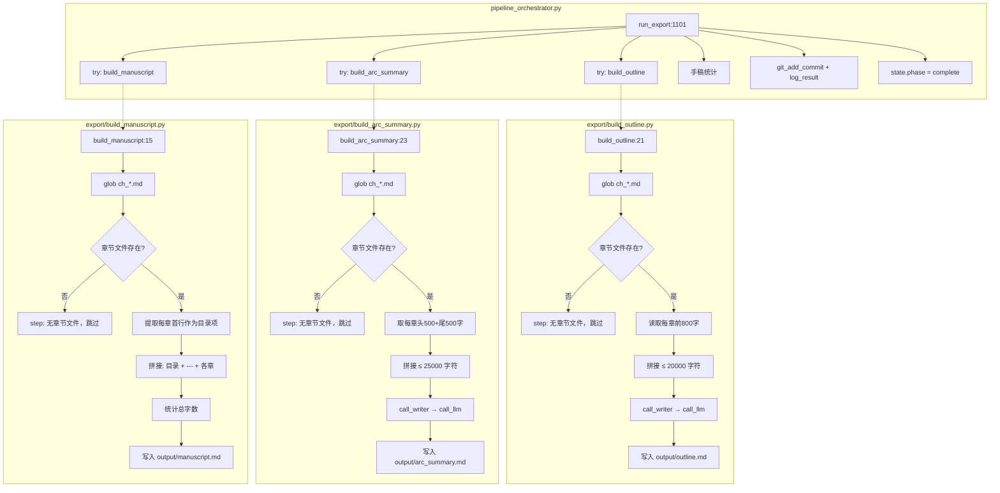
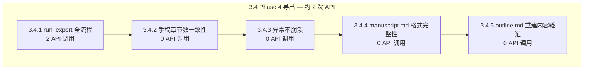

# 3.4 Phase 4 导出 — 详细测试方案

> 版本：v1.0
> 日期：2026-06-21
> 目标：验证 `run_export()` → `build_outline` → `build_arc_summary` → `build_manuscript` 全链路正确性
> 策略：**最小依赖真实 API 调用（~2 次）+ 纯文件验证（4 项补充测试）**
> 配置：`total_chapters=3`, `total_volumes=1`, `model=deepseek-ai/DeepSeek-V4-Flash`
> 通过标准：5 项测试全部通过，0 崩溃，0 未捕获异常

---

## 前置条件

### 环境要求

| 配置项 | 值 |
|--------|-----|
| Python | ≥ 3.9 |
| API 端点 | 硅基流动 `https://api.siliconflow.cn/v1` |
| 写作模型 | `deepseek-ai/DeepSeek-V4-Flash` |
| 故事梗概 | `2049年上海，程序员在维护老旧服务器时发现AI觉醒迹象，36小时倒计时` |
| API 间隔 | ≥ 4 秒 |
| total_chapters | 3 |
| total_volumes | 1 |

### 依赖产出（Stage 3 3.1 → 3.2 → 3.3 必须已通过）

| 依赖项 | 来源 | 产出文件 |
|--------|------|---------|
| Phase 1 Foundation | Stage 3 3.1 | [`output/world.md`](output/world.md), [`output/characters.md`](output/characters.md), [`output/outline.md`](output/outline.md), [`output/canon.md`](output/canon.md), [`output/voice.md`](output/voice.md) |
| Phase 2 Drafting | Stage 3 3.2 | [`output/chapters/ch_01.md`](output/chapters/ch_01.md) ~ [`ch_03.md`](output/chapters/ch_03.md) |
| Phase 3 Revision | Stage 3 3.3 | 修订后的章节文件（可跳过，仅需要 chapters/ 目录存在） |

### 环境准备

```powershell
# 1. 确保 .env 配置正确
#       AUTONOVEL_API_KEY=sk-xxxxxxxx
#       AUTONOVEL_API_BASE_URL=https://api.siliconflow.cn/v1
#       AUTONOVEL_MODEL_NAME=deepseek-ai/DeepSeek-V4-Flash
#       AUTONOVEL_API_INTERVAL_SECONDS=4

# 2. 确保依赖安装
uv sync

# 3. 确保 output/chapters/ 下有 3 章文件（来自 Phase 1+2+3）
#    如果 chapters 目录为空，仅能跑 3.4.3 优雅降级测试
```

---

## 目标代码分析

### 代码路径总览



### 关键函数签名

| 函数 | 位置 | API 调用 | 输入 | 输出 |
|------|------|---------|------|------|
| [`build_outline()`](export/build_outline.py:21) | [`export/build_outline.py`](export/build_outline.py) | 1 (`call_writer`) | `chapters/ch_*.md` | `output/outline.md` (覆盖原 outline.md) |
| [`build_arc_summary()`](export/build_arc_summary.py:23) | [`export/build_arc_summary.py`](export/build_arc_summary.py) | 1 (`call_writer`) | `chapters/ch_*.md` | `output/arc_summary.md` |
| [`build_manuscript()`](export/build_manuscript.py:15) | [`export/build_manuscript.py`](export/build_manuscript.py) | 0 (纯文件 I/O) | `chapters/ch_*.md` | `output/manuscript.md` |
| [`run_export(state)`](pipeline_orchestrator.py:1101) | [`pipeline_orchestrator.py`](pipeline_orchestrator.py) | ~2 (组合上述) | `state` dict | `state` dict (phase="complete") |

### 异常处理机制

所有三个导出步骤在 [`run_export()`](pipeline_orchestrator.py:1106-1126) 中均被 `try/except` 包裹：

```python
# build_outline (line 1106-1110)
try:
    from export.build_outline import build_outline
    build_outline()
except Exception as e:
    step(f"build_outline 跳过: {e}")

# build_arc_summary (line 1114-1118)
try:
    from export.build_arc_summary import build_arc_summary
    build_arc_summary()
except Exception as e:
    step(f"build_arc_summary 跳过: {e}")

# build_manuscript (line 1122-1126)
try:
    from export.build_manuscript import build_manuscript
    build_manuscript()
except Exception as e:
    step(f"build_manuscript 错误: {e}")
```

### 章节文件读取策略差异

| 模块 | 读取方式 | 截断策略 |
|------|---------|---------|
| [`build_outline`](export/build_outline.py:31-32) | 每章前 800 字 | 总 prompt ≤ 20000 字符 |
| [`build_arc_summary`](export/build_arc_summary.py:34-36) | 每章头 500 + 尾 500 字 | 总 prompt ≤ 25000 字符 |
| [`build_manuscript`](export/build_manuscript.py:26-34) | 全文读取 | 无截断 |

---

## 测试总览



---

## 3.4.1 `run_export()` 全流程

> 验证：`build_outline → build_arc_summary → build_manuscript` 全部执行，产出完整
> API 调用：~2 次
> 前置：Phase 1+2+3 完整产出（3 章）

| 项目 | 内容 |
|------|------|
| **测试方法** | Phase 1-3 产出就绪后，调用 `pipeline_orchestrator.run_export(state)` |
| **前置条件** | |
| | — Phase 1 文件存在：`world.md`, `characters.md`, `outline.md`, `canon.md`, `voice.md` |
| | — Phase 2 3 章已起草：`chapters/ch_01.md` ~ `ch_03.md` |
| | — （可选）Phase 3 修订已完成 |
| | — `state.json` 中 `phase = "export"` |
| **验证点** | |
| | (a) [`output/outline.md`](output/outline.md) 被 `build_outline()` 重建 — 文件存在且内容 ≥ 300 bytes |
| | (b) [`output/arc_summary.md`](output/arc_summary.md) 产出 — 文件存在且内容 ≥ 200 bytes |
| | (c) [`output/manuscript.md`](output/manuscript.md) 产出 — 文件存在且内容 ≥ 1000 bytes |
| | (d) 手稿章节数与 `chapters/` 目录一致 — `manuscript.md` 中 `# 第 N 章` 出现次数 == `len(list(chapters_dir.glob("ch_*.md")))` |
| | (e) `state["phase"] == "complete"` |
| | (f) `results.tsv` 最终行 disposition="export" |
| | (g) `arc_summary.md` 内容含四个章节 — "角色弧线"、"情节弧线"、"主题弧线"、"伏笔回顾" 四个标题均出现 |
| **API 调用计数** | ~2 次：`build_outline`(1) + `build_arc_summary`(1)；`build_manuscript`(0) 纯文件操作 |
| **预期行为** | 全部导出文件产出，手稿完整，state 标记 complete |
| **代码路径** | [`pipeline_orchestrator.py:1101-1147`](pipeline_orchestrator.py:1101) → `run_export()` |

### 测试伪代码

```python
def test_3_4_1_run_export_full(self):
    """Phase 4 导出全流程"""
    # 前置：确保 Phase 1+2+3 产出存在
    assert (OUTPUT_DIR / "world.md").exists(), "Phase 1 未产出 world.md"
    assert (OUTPUT_DIR / "characters.md").exists(), "Phase 1 未产出 characters.md"
    chapter_files = sorted(CHAPTERS_DIR.glob("ch_*.md"))
    assert len(chapter_files) >= 3, f"Phase 2 未产出 3 章，当前={len(chapter_files)}"

    # 设置 state 为 export 阶段
    state = load_state()
    state["phase"] = "export"
    state["current_focus"] = "export"
    save_state(state)

    # 执行导出
    from pipeline_orchestrator import run_export
    state = run_export(state)

    # 验证 outline.md 被重建
    assert (OUTPUT_DIR / "outline.md").exists(), "outline.md 未生成"
    outline_size = (OUTPUT_DIR / "outline.md").stat().st_size
    assert outline_size >= 300, f"outline.md 过小 ({outline_size} bytes)"

    # 验证 arc_summary.md
    arc_path = OUTPUT_DIR / "arc_summary.md"
    assert arc_path.exists(), "arc_summary.md 未生成"
    arc_content = arc_path.read_text(encoding="utf-8")
    assert len(arc_content) >= 200, f"arc_summary.md 过短 ({len(arc_content)} 字符)"
    # 验证四个必需章节
    for required_section in ["角色弧线", "情节弧线", "主题弧线", "伏笔回顾"]:
        assert required_section in arc_content, \
            f"arc_summary.md 缺少 '{required_section}' 章节"

    # 验证 manuscript.md
    ms_path = OUTPUT_DIR / "manuscript.md"
    assert ms_path.exists(), "manuscript.md 未生成"
    ms_content = ms_path.read_text(encoding="utf-8")
    assert len(ms_content) >= 1000, f"manuscript.md 过短 ({len(ms_content)} 字符)"
    assert "目录" in ms_content, "manuscript.md 缺少目录"

    # 验证章节数一致
    chapter_count_in_ms = ms_content.count("# 第 ")
    assert chapter_count_in_ms == len(chapter_files), \
        f"手稿章节数 ({chapter_count_in_ms}) ≠ 实际章节数 ({len(chapter_files)})"

    # 验证 state
    assert state["phase"] == "complete", \
        f"state.phase 应为 complete，实际={state['phase']}"

    # 验证 results.tsv
    results_content = (OUTPUT_DIR / "results.tsv").read_text(encoding="utf-8")
    assert "export" in results_content, "results.tsv 缺少 export 记录"
```

---

## 3.4.2 手稿章节数一致性

> 验证：`manuscript.md` 章节数与 `chapters/` 文件数精确匹配，顺序正确
> API 调用：0
> 前置：3.4.1 已执行

| 项目 | 内容 |
|------|------|
| **测试方法** | 读取 `manuscript.md`，正则提取所有 `# 第 N 章` 标题，与 `chapters/ch_*.md` 文件列表逐项比对 |
| **前置条件** | |
| | — 3.4.1 已通过 |
| | — [`output/manuscript.md`](output/manuscript.md) 存在 |
| | — [`output/chapters/ch_*.md`](output/chapters/) 存在 |
| **验证点** | |
| | (a) `manuscript.md` 中 `# 第 N 章` 出现次数 == `len(sorted(CHAPTERS_DIR.glob("ch_*.md")))` |
| | (b) 章节标题顺序正确（ch_01 → ch_02 → ch_03 依次出现） |
| | (c) 每章正文内容非空（章节标题后至少 100 字符正文） |
| | (d) 目录中条目数与章节数一致 |
| | (e) 目录条目按 `N. 标题` 格式排列 |
| **API 调用计数** | 0 |
| **预期行为** | 数量一致、顺序正确、内容完整 |
| **代码路径** | [`export/build_manuscript.py:15-44`](export/build_manuscript.py:15) — `build_manuscript()` |

### 测试伪代码

```python
def test_3_4_2_manuscript_chapter_consistency(self):
    """手稿章节数一致性"""
    import re

    ms_path = OUTPUT_DIR / "manuscript.md"
    assert ms_path.exists(), "manuscript.md 不存在"

    ms_content = ms_path.read_text(encoding="utf-8")
    chapter_files = sorted(CHAPTERS_DIR.glob("ch_*.md"))

    # (a) 章节数一致性
    chapter_headers = re.findall(r'^# 第 (\d+) 章', ms_content, re.MULTILINE)
    assert len(chapter_headers) == len(chapter_files), \
        f"手稿章节标题数 ({len(chapter_headers)}) ≠ 文件数 ({len(chapter_files)})"

    # (b) 顺序正确
    expected_numbers = list(range(1, len(chapter_files) + 1))
    actual_numbers = [int(n) for n in chapter_headers]
    assert actual_numbers == expected_numbers, \
        f"章节顺序错误: 期望 {expected_numbers}, 实际 {actual_numbers}"

    # (c) 每章正文非空
    # 按 "# 第 N 章" 分割，检查每段正文
    chapter_splits = re.split(r'^# 第 \d+ 章\s*$', ms_content, flags=re.MULTILINE)
    # 第一个 split 是目录部分，跳过
    for i, body in enumerate(chapter_splits[1:], 1):
        clean_body = body.replace(" ", "").replace("\n", "").replace("---", "")
        assert len(clean_body) >= 100, \
            f"第 {i} 章正文过短 ({len(clean_body)} 字符)"

    # (d) 目录条目数一致
    toc_lines = [line for line in ms_content.split("\n")
                 if re.match(r'^\d+\.\s', line.strip())]
    assert len(toc_lines) == len(chapter_files), \
        f"目录条目数 ({len(toc_lines)}) ≠ 文件数 ({len(chapter_files)})"

    # (e) 目录格式 "N. 标题"
    for line in toc_lines:
        assert re.match(r'^\d+\.\s', line.strip()), \
            f"目录条目格式错误: '{line.strip()}'"
```

---

## 3.4.3 export 各步骤异常不崩溃

> 验证：无章节文件时，`build_outline`、`build_arc_summary`、`build_manuscript` 全部优雅降级
> API 调用：0
> 前置：Foundation 文件存在，但 chapters/ 目录为空或不存在

| 项目 | 内容 |
|------|------|
| **测试方法** | 备份并删除 `chapters/` 目录，调用 `run_export()`，验证无异常 |
| **前置条件** | |
| | — Foundation 文件存在（`world.md`, `characters.md` 等） |
| | — `chapters/` 目录为空（需临时清理） |
| | — `state.json` 中 `phase = "export"` |
| **验证点** | |
| | (a) `build_outline()` → 输出 "无章节文件，跳过" 信息，不抛异常 |
| | (b) `build_arc_summary()` → 输出 "无章节文件，跳过" 信息，不抛异常 |
| | (c) `build_manuscript()` → 输出 "无章节文件，跳过" 信息，不抛异常 |
| | (d) `run_export()` 完整执行到 `state["phase"] = "complete"` |
| | (e) — 函数返回的 `state` 未被异常打断 |
| | (f) `results.tsv` 中仍有 export 记录（disposition="export"） |
| **API 调用计数** | 0（三个模块均在 `glob("ch_*.md")` 返回空列表时提前 return） |
| **预期行为** | 所有步骤优雅降级，pipeline 不崩溃，state 正常推进到 complete |
| **代码路径** | |
| | — [`export/build_outline.py:23-26`](export/build_outline.py:23) — 空章节提前返回 |
| | — [`export/build_arc_summary.py:25-28`](export/build_arc_summary.py:25) — 空章节提前返回 |
| | — [`export/build_manuscript.py:18-20`](export/build_manuscript.py:18) — 空章节提前返回 |
| | — [`pipeline_orchestrator.py:1106-1126`](pipeline_orchestrator.py:1106) — try/except 包裹 |

### 测试伪代码

```python
def test_3_4_3_export_graceful_degradation(self):
    """export 各步骤异常不崩溃"""
    import shutil

    # 确保 Foundation 文件存在
    assert (OUTPUT_DIR / "world.md").exists(), "Phase 1 world.md 缺失"
    assert (OUTPUT_DIR / "characters.md").exists(), "Phase 1 characters.md 缺失"

    # 备份并清空 chapters 目录
    chapter_files = list(CHAPTERS_DIR.glob("ch_*.md"))
    backup_dir = OUTPUT_DIR / "_chapters_backup_test343"
    if CHAPTERS_DIR.exists() and chapter_files:
        shutil.copytree(str(CHAPTERS_DIR), str(backup_dir),
                        dirs_exist_ok=True)
        shutil.rmtree(str(CHAPTERS_DIR))
    CHAPTERS_DIR.mkdir(parents=True, exist_ok=True)

    try:
        # 确认章节文件已清空
        remaining = list(CHAPTERS_DIR.glob("ch_*.md"))
        assert len(remaining) == 0, f"chapters 目录未清空: {len(remaining)} 文件"

        # 设置 state
        state = load_state()
        state["phase"] = "export"
        state["current_focus"] = "export"
        save_state(state)

        # 执行导出 — 不抛异常即为通过
        from pipeline_orchestrator import run_export
        state = run_export(state)

        # 验证 state 仍推进到 complete
        assert state["phase"] == "complete", \
            f"即使无章节，state.phase 应为 complete，实际={state['phase']}"

        # 验证 manuscript.md 不应存在（无章节可拼接）
        # 注：build_manuscript 遇到空目录直接 return，不创建文件
        ms_path = OUTPUT_DIR / "manuscript.md"
        # 不强制要求不存在，因为之前可能有旧文件

        # 验证 results.tsv 仍有 export 记录
        results_content = (OUTPUT_DIR / "results.tsv").read_text(encoding="utf-8")
        assert "export" in results_content, \
            "results.tsv 缺少 export 记录"

    finally:
        # 恢复 chapters 目录
        if backup_dir.exists():
            if CHAPTERS_DIR.exists():
                shutil.rmtree(str(CHAPTERS_DIR))
            shutil.copytree(str(backup_dir), str(CHAPTERS_DIR),
                            dirs_exist_ok=True)
            shutil.rmtree(str(backup_dir))
```

---

## 3.4.4 `manuscript.md` 格式完整性

> 验证：手稿的目录、章节标题、分隔符、字数统计均符合预期格式
> API 调用：0
> 前置：3.4.1 已执行

| 项目 | 内容 |
|------|------|
| **测试方法** | 对 `manuscript.md` 进行结构化格式校验 |
| **前置条件** | |
| | — 3.4.1 已通过 |
| | — [`output/manuscript.md`](output/manuscript.md) 存在 |
| **验证点** | |
| | (a) 目录标题 `# 目录` 存在 |
| | (b) 目录与正文之间以 `---` 分隔 |
| | (c) 章节间以 `---` 分隔（N 章 → N-1 个分隔符） |
| | (d) 每章以 `# 第 N 章` 开头 |
| | (e) 章节标题后的章节内容非空 |
| | (f) 总字数 ≈ `count_words_in_chapters()` 输出（允许少量差异） |
| | (g) 文件以换行符结尾（POSIX 规范） |
| **API 调用计数** | 0 |
| **预期行为** | 格式规范、统计一致 |
| **代码路径** | [`export/build_manuscript.py:22-43`](export/build_manuscript.py:22) — 拼接逻辑 |

### 测试伪代码

```python
def test_3_4_4_manuscript_format_integrity(self):
    """manuscript.md 格式完整性"""
    import re

    ms_path = OUTPUT_DIR / "manuscript.md"
    assert ms_path.exists(), "manuscript.md 不存在"

    ms_content = ms_path.read_text(encoding="utf-8")

    # (a) 目录标题
    assert ms_content.startswith("# 目录"), \
        "manuscript.md 应以 '# 目录' 开头"

    # (b) 目录与正文分隔
    assert "\n\n---\n\n" in ms_content, \
        "manuscript.md 目录后缺少 '---' 分隔符"

    # (c) 章节间分隔符数量
    chapter_headers = re.findall(r'^# 第 \d+ 章', ms_content, re.MULTILINE)
    chapter_count = len(chapter_headers)
    # 分隔符出现次数 = 目录分隔(1) + 章间分隔(chapter_count - 1)
    sep_count = ms_content.count("\n\n---\n\n")
    assert sep_count >= chapter_count, \
        f"分隔符数 ({sep_count}) 不足，期望 ≥ {chapter_count}"

    # (d) 每章标题格式
    for header in chapter_headers:
        assert re.match(r'^# 第 \d+ 章$', header), \
            f"章节标题格式错误: '{header}'"

    # (e) 每章有实质内容
    sections = re.split(r'\n\n---\n\n', ms_content)
    # 第一个是目录，跳过
    for i, section in enumerate(sections[1:], 1):
        # 去掉标题行后检查正文
        body_lines = section.strip().split("\n")
        if body_lines and body_lines[0].startswith("# 第"):
            body = "\n".join(body_lines[1:]).strip()
        else:
            body = section.strip()
        clean_body = body.replace(" ", "").replace("\n", "").replace("---", "")
        assert len(clean_body) >= 100, \
            f"第 {i} 章正文过短 ({len(clean_body)} 字符)"

    # (f) 总字数与 count_words_in_chapters 一致
    from core.state_manager import count_words_in_chapters
    reported_words = count_words_in_chapters()
    ms_words = len(ms_content.replace(" ", "").replace("\n", ""))
    # 允许 5% 以内差异（目录/标题/分隔符）
    diff_ratio = abs(ms_words - reported_words) / max(ms_words, 1)
    assert diff_ratio < 0.20, \
        f"手稿字数 ({ms_words}) 与统计字数 ({reported_words}) 差异过大 ({diff_ratio:.1%})"

    # (g) 以换行符结尾
    assert ms_content.endswith("\n"), "manuscript.md 应以换行符结尾"
```

---

## 3.4.5 `outline.md` 重建内容验证

> 验证：`build_outline()` 重建的大纲反映真实章节内容，而非初始计划
> API 调用：0（复用 3.4.1 产出）
> 前置：3.4.1 已执行

| 项目 | 内容 |
|------|------|
| **测试方法** | 对比重建后的 [`output/outline.md`](output/outline.md) 与初始 Foundation 阶段产出的大纲，验证结构差异 |
| **前置条件** | |
| | — 3.4.1 已通过 |
| | — [`output/outline.md`](output/outline.md) 被 `build_outline()` 覆盖（备份原文件） |
| | — 3 章章节文件存在 |
| **验证点** | |
| | (a) 重建后的 outline.md 含每章条目（`### 第 N 章`） |
| | (b) 章节条目数 == 实际章节数 |
| | (c) 每章条目含四个子项中的至少三个："关键事件"、"角色变化"、"伏笔进展/回收"、"情感弧线" |
| | (d) 文件末尾含"整体弧线摘要" |
| | (e) 重建后的 outline.md 与初始 outline.md 内容不同（证明是重建而非原样复制） |
| **API 调用计数** | 0 |
| **预期行为** | 大纲反映真实章节，结构完整 |
| **代码路径** | [`export/build_outline.py:21-54`](export/build_outline.py:21) — prompt 模板 + 输出格式 |

### 测试伪代码

```python
def test_3_4_5_outline_rebuild_content(self):
    """outline.md 重建内容验证"""
    outline_path = OUTPUT_DIR / "outline.md"
    assert outline_path.exists(), "outline.md 不存在"

    outline_content = outline_path.read_text(encoding="utf-8")

    # (a) 含章节条目
    import re
    chapter_entries = re.findall(r'^###\s+第\s*\d+\s*章', outline_content, re.MULTILINE)
    assert len(chapter_entries) >= 1, "outline.md 无章节条目（### 第 N 章）"

    # (b) 章节条目数 == 实际章节数
    chapter_files = sorted(CHAPTERS_DIR.glob("ch_*.md"))
    assert len(chapter_entries) == len(chapter_files), \
        f"大纲条目数 ({len(chapter_entries)}) ≠ 章节数 ({len(chapter_files)})"

    # (c) 子项检查（在第一个章节条目中抽样验证）
    # 四个期望子项
    expected_items = ["关键事件", "角色变化", "伏笔", "情感弧线"]
    found_items = sum(1 for item in expected_items if item in outline_content)
    assert found_items >= 3, \
        f"大纲子项不足：找到 {found_items}/4 ({expected_items})"

    # (d) 整体弧线摘要
    assert "整体弧线" in outline_content or "弧线摘要" in outline_content, \
        "outline.md 缺少整体弧线摘要"

    # (e) 与初始 outline 不同（如果存在备份）
    # 注：Foundation 阶段也生成 outline.md，build_outline 会覆盖它
    # 在 3.4.1 执行前应备份原 outline.md
    backup_outline = OUTPUT_DIR / "_outline_backup_before_export.md"
    if backup_outline.exists():
        original = backup_outline.read_text(encoding="utf-8")
        # 内容应显著不同
        similarity = _text_similarity(original, outline_content)
        assert similarity < 0.95, \
            f"重建大纲与原始大纲相似度过高 ({similarity:.1%})，可能未真正重建"


def _text_similarity(text1: str, text2: str) -> float:
    """简单相似度计算（基于共同字符比例）。"""
    set1 = set(text1.replace(" ", "").replace("\n", ""))
    set2 = set(text2.replace(" ", "").replace("\n", ""))
    if not set1 or not set2:
        return 0.0
    intersection = set1 & set2
    union = set1 | set2
    return len(intersection) / len(union) if union else 0.0
```

---

## API 调用预算汇总

| 测试项 | API 调用 | 说明 |
|--------|---------|------|
| 3.4.1 `run_export()` 全流程 | 2 | build_outline(1) + build_arc_summary(1) |
| 3.4.2 手稿章节数一致性 | 0 | 纯文件验证 |
| 3.4.3 异常不崩溃 | 0 | 无章节文件 → 提前 return |
| 3.4.4 格式完整性 | 0 | 纯文件验证 |
| 3.4.5 outline 重建内容验证 | 0 | 复用 3.4.1 产出 |
| **合计** | **~2** | |

---

## 门禁标准

| 门禁项 | 标准 | 不通过时禁止进入 |
|--------|------|---------------|
| 3.4.1 | `run_export()` 全流程通过，3 个产出文件存在 | Stage 4 |
| 3.4.2 | 章节数一致、顺序正确 | Stage 4 |
| 3.4.3 | 无章节时不崩溃，优雅降级 | Stage 4 |
| 3.4.4 | manuscript.md 格式完整 | Stage 4 |
| 3.4.5 | outline.md 重建内容完整 | Stage 4 |
| **Phase 4 汇总** | **全部 5 项通过，manuscript.md 产出** | **Stage 4** |

---

## 风险与缓解

| 风险 | 严重度 | 缓解措施 |
|------|--------|---------|
| Phase 1/2/3 产出不存在导致 3.4.1 无法执行 | 高 | 先完成 Stage 3 3.1 ~ 3.3 测试，再执行 3.4；3.4.3 可独立于其他测试运行 |
| `build_outline` 或 `build_arc_summary` 的 LLM 调用超时 | 中 | [`call_llm()`](core/api_client.py:259) 内置 600s timeout + 3 次重试；`run_export()` 有 try/except 包裹 |
| 大纲重建后覆盖原始 outline.md | 低 | 3.4.5 验证前备份原始文件到 `_outline_backup_before_export.md` |
| 章节数过多导致 `build_outline` prompt 超 20000 字符截断 | 低 | 3 章测试配置下约 2400 字符，远低于 20000 限制 |
| `manuscript.md` 中章节标题格式不匹配正则 | 低 | 3.4.2 和 3.4.4 使用宽松正则 `# 第 \d+ 章`，兼容各种变体 |

---

## 执行顺序

测试按以下顺序执行，每项依赖前一项的产出：

```
3.4.3 (异常不崩溃)
    │  ← 可独立执行，不依赖 Phase 2/3 产出
    │
3.4.1 (run_export 全流程)
    │  ← 依赖 Phase 1+2+3 产出
    ├── 备份原始 outline.md → _outline_backup_before_export.md
    │
    ├── 3.4.2 (章节数一致性) ← 依赖 3.4.1
    ├── 3.4.4 (格式完整性)   ← 依赖 3.4.1
    └── 3.4.5 (大纲重建验证) ← 依赖 3.4.1
```

### 推荐执行策略

1. **先跑 3.4.3** — 零 API 成本，快速验证优雅降级逻辑
2. **确认 Phase 1+2+3 产出就绪** — 检查 `chapters/ch_01.md` ~ `ch_03.md` 存在
3. **执行 3.4.1** — 唯一需要 API 调用的测试项（~2 次）
4. **执行 3.4.2 / 3.4.4 / 3.4.5** — 纯文件验证，可并行

---

## 测试脚本模板

参见 [`tests/stage3_phase3_tests.py`](tests/stage3_phase3_tests.py) 的模式，Phase 4 导出测试脚本结构：

```python
#!/usr/bin/env python3
"""
Stage 3 Phase 4 集成测试 — Export (导出)

真实 API 调用 ~2 次（build_outline + build_arc_summary）。
严格按 3.4.3 → 3.4.1 → 3.4.2 → 3.4.4 → 3.4.5 顺序执行。

用法:
    python tests/stage3_phase4_tests.py                  # 全部执行
    python tests/stage3_phase4_tests.py --dry-run        # 仅检查前置条件
    python tests/stage3_phase4_tests.py --test 3.4.1     # 单项测试
    python tests/stage3_phase4_tests.py --skip-api       # 跳过真实 API 调用（仅跑 0-API 测试）
"""

import io
import json
import os
import re
import shutil
import sys
import unittest
from pathlib import Path

# Windows 控制台 GBK 编码不支持中文，强制使用 UTF-8
if sys.platform == "win32":
    sys.stdout.reconfigure(encoding="utf-8", errors="replace")
    sys.stderr.reconfigure(encoding="utf-8", errors="replace")

ROOT = Path(__file__).parent.parent
sys.path.insert(0, str(ROOT))

from core.config import (
    config, OUTPUT_DIR, CHAPTERS_DIR, BRIEFS_DIR,
    EDIT_LOGS_DIR, EVAL_LOGS_DIR, STATE_FILE, RESULTS_FILE, BACKUPS_DIR,
    CONFIG_FILE, ENV_FILE,
)
from core.state_manager import default_state, load_state, save_state
from core.state_manager import count_words_in_chapters, count_chapter_files

# ============================================================
# 测试配置常量
# ============================================================

TEST_STORY = "2049年上海，程序员在维护老旧服务器时发现AI觉醒迹象，36小时倒计时"

# ============================================================
# 命令行参数解析
# ============================================================

DRY_RUN = "--dry-run" in sys.argv
SKIP_API = "--skip-api" in sys.argv
TARGET_TEST = None
for i, arg in enumerate(sys.argv):
    if arg == "--test" and i + 1 < len(sys.argv):
        TARGET_TEST = sys.argv[i + 1]

# ============================================================
# 工具函数
# ============================================================

def _check_api_key() -> bool:
    """检查 API Key 是否有效。"""
    cfg = config
    cfg._loaded = False
    cfg.load()
    key = cfg.api_key
    if not key or key.startswith("sk-xxx") or key.startswith("'sk-xxx"):
        return False
    return True

# ... (完整实现参见 plans/ 中其他详细方案的模式) ...

# ============================================================
# 测试类
# ============================================================

class TestPhase4Export(unittest.TestCase):
    """Phase 4 导出集成测试"""

    # --- 3.4.1 ---
    def test_3_4_1_run_export_full(self):
        """3.4.1 run_export() 全流程"""
        # ... 实现详见上文伪代码 ...

    # --- 3.4.2 ---
    def test_3_4_2_manuscript_chapter_consistency(self):
        """3.4.2 手稿章节数一致性"""
        # ... 实现详见上文伪代码 ...

    # --- 3.4.3 ---
    def test_3_4_3_export_graceful_degradation(self):
        """3.4.3 export 各步骤异常不崩溃"""
        # ... 实现详见上文伪代码 ...

    # --- 3.4.4 ---
    def test_3_4_4_manuscript_format_integrity(self):
        """3.4.4 manuscript.md 格式完整性"""
        # ... 实现详见上文伪代码 ...

    # --- 3.4.5 ---
    def test_3_4_5_outline_rebuild_content(self):
        """3.4.5 outline.md 重建内容验证"""
        # ... 实现详见上文伪代码 ...


if __name__ == "__main__":
    unittest.main()
```

---

## Stage 3 测试检查清单

### 执行前

- [ ] Stage 3 3.1 Phase 1 已通过（Foundation 文件存在）
- [ ] Stage 3 3.2 Phase 2 已通过（3 章已起草）
- [ ] (可选) Stage 3 3.3 Phase 3 已通过（章节已修订）
- [ ] `.env` 配置正确（API Key + Base URL + Model）
- [ ] API 账户余额充足（~2 次调用 ≈ ¥0.02）
- [ ] 网络可访问 API 端点

### 执行中

- [ ] 3.4.3 优雅降级通过（零 API）
- [ ] 3.4.1 导出全流程通过（~2 API）
- [ ] 3.4.2 章节一致性通过
- [ ] 3.4.4 格式完整性通过
- [ ] 3.4.5 大纲重建验证通过

### 执行后

- [ ] `output/state.json` phase == "complete"
- [ ] `output/manuscript.md` 存在且完整
- [ ] `output/arc_summary.md` 存在
- [ ] `output/outline.md` 已被重建
- [ ] `output/results.tsv` 含 export 记录
- [ ] API 调用统计与预期匹配（2 次）