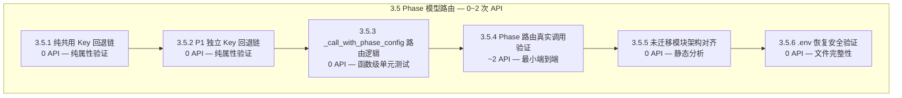

# 3.5 Phase 模型路由 — 详细测试方案

> 版本：v1.0
> 日期：2026-06-22
> 目标：验证方案 D Phase 分离模型配置的回退链、`_call_with_phase_config` 路由逻辑、以及 `call_writer`/`call_judge` 不参与 Phase 路由的行为
> 策略：**纯属性验证（0 API）+ 最小真实 API 验证（~2 次）+ 架构对齐审查（0 API）**
> 配置：`total_chapters=3`, `model=deepseek-ai/DeepSeek-V4-Flash`
> 通过标准：6 项测试全部通过，回退链 100% 正确，架构对齐明确

---

## 前置条件

### 环境要求

| 配置项 | 值 |
|--------|-----|
| Python | ≥ 3.9 |
| API 端点 | 硅基流动 `https://api.siliconflow.cn/v1` |
| 写作模型 | `deepseek-ai/DeepSeek-V4-Flash` |
| `.env` 文件 | 需可安全修改（测试前后恢复原始值） |

### 依赖产出

| 依赖项 | 来源 | 说明 |
|--------|------|------|
| 当前 `.env` 配置 | [`core/config.py`](core/config.py:36-57) `_SECRET_KEYS` | 测试需临时修改 `.env`，执行完毕后恢复 |
| 现有 Phase 1-4 产出 | 可选 | 仅 3.5.4 需要章节文件验证真实路由 |

---

## 目标代码分析

### 回退链总览

```
共用 Key (AUTONOVEL_API_KEY)
    ↑
P1 (AUTONOVEL_P1_*)  ──────→ 共用
    ↑            ↑
P2 (AUTONOVEL_P2_*)  ──→ P1 ──→ 共用
    ↑
P2_CTX (AUTONOVEL_P2_CTX_*)  ──→ P2 ──→ P1 ──→ 共用
    ↑
P3 (AUTONOVEL_P3_*)  ──→ P1 ──→ 共用
```

### 配置属性层 — [`core/config.py`](core/config.py:245-322)

```python
# 回退链定义（config.py:248-253 注释）
# P1:     p1_*     → 共用_*
# P2:     p2_*     → p1_*      → 共用_*
# P2_CTX: p2_ctx_* → p2_*      → p1_*      → 共用_*
# P3:     p3_*     → p1_*      → 共用_*

# Phase 1 (line 258-268)
@property
def p1_api_key(self) -> str:
    return self._data.get("p1_api_key") or self.api_key

# Phase 2 (line 273-283)
@property
def p2_api_key(self) -> str:
    return (self._data.get("p2_api_key")
            or self._data.get("p1_api_key")
            or self.api_key)

# Phase 2 CTX (line 288-307)
@property
def p2_ctx_api_key(self) -> str:
    return (self._data.get("p2_ctx_api_key")
            or self._data.get("p2_api_key")
            or self._data.get("p1_api_key")
            or self.api_key)

# Phase 3 (line 312-322)
@property
def p3_api_key(self) -> str:
    return (self._data.get("p3_api_key")
            or self._data.get("p1_api_key")
            or self.api_key)
```

**关键设计**：所有属性使用 `or` 短路求值。`config._data` 由 `.env` 加载（通过 `_SECRET_KEYS` 映射），空字符串/None 均触发回退。

### 路由函数层 — [`core/api_client.py`](core/api_client.py:384-508)

```python
def _call_with_phase_config(phase: str, prompt: str, ...) -> str:
    """按 Phase 选择 API 配置并调用 LLM。"""
    cfg = config
    cfg.load()
    # 通过 getattr 获取对应 Phase 的属性值
    api_key = getattr(cfg, f"{phase}_api_key")        # → p1_api_key / p2_api_key / ...
    api_base = getattr(cfg, f"{phase}_api_base_url")
    model = getattr(cfg, f"{phase}_model_name")
    # 直接传入 _call_llm_internal — 回退已在属性层完成
    ...

def call_p1_writer(...)  → _call_with_phase_config("p1", ...)
def call_p2_writer(...)  → _call_with_phase_config("p2", ...)
def call_p2_ctx_writer(...) → _call_with_phase_config("p2_ctx", ...)
def call_p3_judge(...)   → _call_with_phase_config("p3", ...)
```

### 实际调用分布（全项目扫描）

| 模块 | 调用函数 | Phase 路由? | 说明 |
|------|---------|------------|------|
| [`gen_outline_volume.py`](foundation/gen_outline_volume.py:21) | `call_p1_writer` | ✅ P1 | 卷级总纲—方案 D 新增 |
| [`gen_outline.py`](foundation/gen_outline.py:13) | `call_p1_writer` | ✅ P1 | 章级大纲—方案 D 新增 |
| [`gen_world.py`](foundation/gen_world.py:12) | `call_writer` | ❌ 共用 | 世界观—未迁移到 P1 |
| [`gen_characters.py`](foundation/gen_characters.py:12) | `call_writer` | ❌ 共用 | 角色—未迁移到 P1 |
| [`gen_canon.py`](foundation/gen_canon.py:12) | `call_writer` | ❌ 共用 | 初始 canon—未迁移 |
| [`gen_voice.py`](foundation/gen_voice.py:18) | `call_writer`, `call_judge` | ❌ 共用 | 文风—未迁移 |
| [`gen_outline_part2.py`](foundation/gen_outline_part2.py:12) | `call_writer` | ❌ 共用 | outline_part2—未迁移 |
| [`draft_chapter.py`](drafting/draft_chapter.py:14) | `call_p2_writer` | ✅ P2 | 章节起草—方案 D 核心 |
| [`update_canon.py`](foundation/update_canon.py:13) | `call_p2_ctx_writer` | ✅ P2_CTX | 增量 canon—方案 D 核心 |
| [`evaluate.py`](evaluation/evaluate.py:23) | `call_judge` | ❌ 共用 | 所有评估—共用 judge |
| [`adversarial_edit.py`](revision/adversarial_edit.py:16) | `call_judge` | ❌ 共用 | 对抗编辑—共用 judge |
| [`reader_panel.py`](revision/reader_panel.py:14) | `call_judge` | ❌ 共用 | 读者评审—共用 judge |
| [`review.py`](revision/review.py:14) | `call_judge` | ❌ 共用 | 审阅—共用 judge |
| [`compare_chapters.py`](revision/compare_chapters.py:14) | `call_judge` | ❌ 共用 | 章节对比—共用 judge |
| [`gen_revision.py`](revision/gen_revision.py:13) | `call_writer` | ❌ 共用 | 修订写作—共用 writer |
| [`build_outline.py`](export/build_outline.py:12) | `call_writer` | ❌ 共用 | 大纲重建—共用 writer |
| [`build_arc_summary.py`](export/build_arc_summary.py:12) | `call_writer` | ❌ 共用 | 弧线摘要—共用 writer |
| [`pipeline_orchestrator.py`](pipeline_orchestrator.py:30) | `call_llm`, `call_writer`, `call_judge` | ❌ 共用 | 编排器自身—共用 |

**关键发现**：
- `call_p3_judge` **存在但未被任何 pipeline 模块调用** — 所有 Phase 3 模块仍使用 `call_judge`
- 仅 4 个模块使用了 Phase 路由函数：`gen_outline_volume`、`gen_outline`、`draft_chapter`、`update_canon`
- Phase 1 的多数基础模块（`gen_world`、`gen_characters`、`gen_canon`、`gen_voice`）和 Phase 3/4 全部模块 **未迁移到 Phase 路由**

---

## 测试总览



---

## 3.5.1 仅配共用 Key → 所有 Phase 回退到共用

> 验证：当 `.env` 仅配置 `AUTONOVEL_API_KEY`（不配 P1/P2/P3），所有 Phase 属性正确回退到共用值
> API 调用：0（纯属性验证）

| 项目 | 内容 |
|------|------|
| **测试方法** | 清空 `.env` 中所有 P1/P2/P3 前缀字段，仅保留 `AUTONOVEL_API_KEY=sk-shared`；加载 config 后逐个验证属性值 |
| **前置条件** | `.env` 可安全修改（备份原始文件） |
| **验证点** | |
| | (a) `config.p1_api_key == "sk-shared"` |
| | (b) `config.p1_api_base_url == config.api_base_url` |
| | (c) `config.p1_model_name == config.model_name` |
| | (d) `config.p2_api_key == "sk-shared"`（回退 P2→P1→共用） |
| | (e) `config.p2_ctx_api_key == "sk-shared"`（回退 P2_CTX→P2→P1→共用） |
| | (f) `config.p3_api_key == "sk-shared"`（回退 P3→P1→共用） |
| | (g) `config.p2_ctx_api_base_url == config.api_base_url` |
| | (h) `config.p3_model_name == config.model_name` |
| **API 调用计数** | 0 |
| **预期行为** | 所有 4 个 Phase 属性均回退到共用配置 |
| **代码路径** | [`core/config.py:258-322`](core/config.py:258) — Phase 回退属性 |

### 测试伪代码

```python
def test_3_5_1_shared_key_fallback(self):
    """仅配共用 Key → 所有 Phase 回退到共用"""
    cfg = config
    cfg._loaded = False
    cfg.load()

    shared_key = cfg.api_key
    shared_base = cfg.api_base_url
    shared_model = cfg.model_name

    self.assertTrue(shared_key, "共用 API Key 为空")

    # P1 回退
    self.assertEqual(cfg.p1_api_key, shared_key,
                     f"P1 key: {cfg.p1_api_key} ≠ shared: {shared_key}")
    self.assertEqual(cfg.p1_api_base_url, shared_base)
    self.assertEqual(cfg.p1_model_name, shared_model)

    # P2 回退 P2→P1→共用
    self.assertEqual(cfg.p2_api_key, shared_key,
                     f"P2 key: {cfg.p2_api_key} ≠ shared: {shared_key}")
    self.assertEqual(cfg.p2_api_base_url, shared_base)
    self.assertEqual(cfg.p2_model_name, shared_model)

    # P2_CTX 回退 P2_CTX→P2→P1→共用
    self.assertEqual(cfg.p2_ctx_api_key, shared_key,
                     f"P2_CTX key: {cfg.p2_ctx_api_key} ≠ shared: {shared_key}")
    self.assertEqual(cfg.p2_ctx_api_base_url, shared_base)
    self.assertEqual(cfg.p2_ctx_model_name, shared_model)

    # P3 回退 P3→P1→共用
    self.assertEqual(cfg.p3_api_key, shared_key,
                     f"P3 key: {cfg.p3_api_key} ≠ shared: {shared_key}")
    self.assertEqual(cfg.p3_api_base_url, shared_base)
    self.assertEqual(cfg.p3_model_name, shared_model)
```

---

## 3.5.2 P1 独立 Key → P2/P3 回退到 P1 而非共用

> 验证：配置 `AUTONOVEL_P1_*` 后，P2/P3 回退链停在 P1 而非继续回退到共用
> API 调用：0（纯属性验证）

| 项目 | 内容 |
|------|------|
| **测试方法** | `.env` 中设 `AUTONOVEL_P1_API_KEY=sk-p1` + `AUTONOVEL_API_KEY=sk-shared`；逐级验证回退终点 |
| **前置条件** | `.env` 可安全修改（备份原始文件） |
| **验证点** | |
| | (a) `config.p1_api_key == "sk-p1"`（直接取值） |
| | (b) `config.p2_api_key == "sk-p1"`（回退 P2→P1，**非** shared） |
| | (c) `config.p2_ctx_api_key == "sk-p1"`（回退 P2_CTX→P2→P1） |
| | (d) `config.p3_api_key == "sk-p1"`（回退 P3→P1，**非** shared） |
| | (e) `config.p2_api_key != "sk-shared"`（**不应**穿透到共用） |
| | (f) `config.p3_api_key != "sk-shared"`（**不应**穿透到共用） |
| | (g) P2/P3 的 `api_base_url` 和 `model_name` 也回退到 P1 |
| **API 调用计数** | 0 |
| **预期行为** | P2/P3 停在 P1 层，不穿透到共用 |
| **代码路径** | [`core/config.py:273-322`](core/config.py:273) — `or self._data.get("p1_api_key")` 优先级 |

### 测试伪代码

```python
def test_3_5_2_p1_independent_key_fallback(self):
    """P1 独立 Key → P2/P3 回退到 P1"""
    cfg = config
    cfg._loaded = False
    cfg.load()

    p1_key = cfg.p1_api_key
    shared_key = cfg.api_key

    # P1 直接取值
    self.assertEqual(p1_key, cfg._data.get("p1_api_key", ""),
                     "P1 key 应直接取 p1_api_key")

    # P2 回退到 P1
    self.assertEqual(cfg.p2_api_key, p1_key,
                     f"P2 key ({cfg.p2_api_key}) 应回退到 P1 ({p1_key})")
    if p1_key != shared_key:
        self.assertNotEqual(cfg.p2_api_key, shared_key,
                            "P2 不应穿透到共用 Key")

    # P2_CTX 回退到 P1
    self.assertEqual(cfg.p2_ctx_api_key, p1_key,
                     f"P2_CTX key ({cfg.p2_ctx_api_key}) 应回退到 P1 ({p1_key})")

    # P3 回退到 P1
    self.assertEqual(cfg.p3_api_key, p1_key,
                     f"P3 key ({cfg.p3_api_key}) 应回退到 P1 ({p1_key})")
    if p1_key != shared_key:
        self.assertNotEqual(cfg.p3_api_key, shared_key,
                            "P3 不应穿透到共用 Key")
```

---

## 3.5.3 `_call_with_phase_config` 路由逻辑验证

> 验证：`_call_with_phase_config` 函数根据 `phase` 参数正确调用 `getattr` 并路由到对应 Phase 配置
> API 调用：0（Mock/属性验证）

| 项目 | 内容 |
|------|------|
| **测试方法** | 注入已知 Phase 配置值，调用 `_call_with_phase_config` 并验证传递给 `_call_llm_internal` 的参数 |
| **前置条件** | `.env` 可安全修改 |
| **验证点** | |
| | (a) `_call_with_phase_config("p1", ...)` → `api_key == config.p1_api_key` |
| | (b) `_call_with_phase_config("p2", ...)` → `api_key == config.p2_api_key` |
| | (c) `_call_with_phase_config("p2_ctx", ...)` → `api_key == config.p2_ctx_api_key` |
| | (d) `_call_with_phase_config("p3", ...)` → `api_key == config.p3_api_key` |
| | (e) `phase="invalid"` 时 `getattr` 抛出 `AttributeError`（预期行为） |
| **API 调用计数** | 0 |
| **预期行为** | `getattr(cfg, f"{phase}_api_key")` 精确映射到对应属性 |
| **代码路径** | [`core/api_client.py:384-426`](core/api_client.py:384) — `_call_with_phase_config` |

### 测试伪代码

```python
def test_3_5_3_phase_config_routing(self):
    """_call_with_phase_config 路由逻辑"""
    from unittest.mock import patch, MagicMock
    import core.api_client as api

    cfg = config
    cfg._loaded = False
    cfg.load()

    # 为每个 Phase 设置可区分的值
    test_base = cfg.api_base_url

    # Mock _call_llm_internal 以捕获参数
    with patch.object(api, '_call_llm_internal') as mock_call:
        mock_call.return_value = "mock response"

        # Phase "p1"
        api._call_with_phase_config("p1", "test prompt")
        call_kwargs = mock_call.call_args[1]
        self.assertEqual(call_kwargs["api_key"], cfg.p1_api_key)
        self.assertEqual(call_kwargs["model"], cfg.p1_model_name)

        # Phase "p2"
        api._call_with_phase_config("p2", "test prompt")
        call_kwargs = mock_call.call_args[1]
        self.assertEqual(call_kwargs["api_key"], cfg.p2_api_key)

        # Phase "p2_ctx"
        api._call_with_phase_config("p2_ctx", "test prompt")
        call_kwargs = mock_call.call_args[1]
        self.assertEqual(call_kwargs["api_key"], cfg.p2_ctx_api_key)

        # Phase "p3"
        api._call_with_phase_config("p3", "test prompt")
        call_kwargs = mock_call.call_args[1]
        self.assertEqual(call_kwargs["api_key"], cfg.p3_api_key)

        # 无效 Phase → AttributeError
        with self.assertRaises(AttributeError):
            api._call_with_phase_config("p4", "test")
```

---

## 3.5.4 Phase 路由真实调用验证（最小跨模块）

> 验证：使用真实 API 调用 1 次 P1 路由函数 + 1 次 P2 路由函数，确认链路畅通
> API 调用：~2 次
> 前置：Phase 1+2 产出就绪（可复用已有产出）

| 项目 | 内容 |
|------|------|
| **测试方法** | (A) 调用 `call_p1_writer` 做一次简单生成 → 验证返回非空 | (B) 调用 `call_p2_writer` 做一次章节草稿 → 验证产出 ≥ 100 字 |
| **前置条件** | 3 章章节文件已存在（复用 Stage 3 3.2 产出） |
| **验证点** | |
| | (a) `call_p1_writer("生成一段100字的世界观描述", system="你是小说设定师")` 返回 ≥ 50 字 |
| | (b) `call_p2_writer("续写一段章节开头", system=SYSTEM_PROMPT)` 返回 ≥ 50 字 |
| | (c) 两次调用均无异常、无超时 |
| | (d) 日志中能区分两次调用使用了相同或不同的 API Key（通过速率限制器间隔验证） |
| **API 调用计数** | ~2 次 |
| **预期行为** | Phase 路由函数正常工作 |
| **代码路径** | [`core/api_client.py:435-451`](core/api_client.py:435) `call_p1_writer` / [`core/api_client.py:454-470`](core/api_client.py:454) `call_p2_writer` |

### 测试伪代码

```python
def test_3_5_4_real_phase_routing_call(self):
    """真实 API 调用验证 Phase 路由"""
    if SKIP_API:
        raise unittest.SkipTest("--skip-api")
    if not _check_api_key():
        self.skipTest("API Key 无效")

    from core.api_client import call_p1_writer, call_p2_writer

    # (A) P1 Writer 调用
    result_p1 = call_p1_writer(
        "用一段话描述一个2049年上海的科幻世界观，约100字。",
        system="你是小说设定师，输出简洁。",
        max_tokens=512,
    )
    self.assertIsNotNone(result_p1, "call_p1_writer 返回 None")
    self.assertGreaterEqual(len(result_p1.strip()), 25,
                            f"P1 输出过短: {len(result_p1)} 字")

    # (B) P2 Writer 调用
    result_p2 = call_p2_writer(
        "写一段小说的开场段落，主角在机房发现异常，约100字。",
        system="你是小说作家，输出简洁。",
        max_tokens=512,
    )
    self.assertIsNotNone(result_p2, "call_p2_writer 返回 None")
    self.assertGreaterEqual(len(result_p2.strip()), 25,
                            f"P2 输出过短: {len(result_p2)} 字")
```

---

## 3.5.5 架构对齐审查 — 未迁移模块对比

> 验证：识别哪些模块已迁移到 Phase 路由、哪些尚未迁移，确认架构差距
> API 调用：0（静态分析）

| 项目 | 内容 |
|------|------|
| **测试方法** | 遍历全部 `.py` 文件的 API 导入，分类统计已迁移/未迁移，输出差距报告 |
| **前置条件** | 无 |
| **验证点** | |
| | (a) 已迁移到 Phase 路由的模块 == `{gen_outline_volume, gen_outline, draft_chapter, update_canon}` |
| | (b) `call_p3_judge` 定义存在但**无任何模块导入** |
| | (c) `call_p1_writer` 被 2 个 Foundation 模块使用（gen_outline_volume, gen_outline） |
| | (d) `call_p2_writer` 被 1 个 Drafting 模块使用（draft_chapter） |
| | (e) `call_p2_ctx_writer` 被 1 个 Foundation 模块使用（update_canon） |
| | (f) 产出差距分析表（已迁移 vs 未迁移） |
| **API 调用计数** | 0 |
| **预期行为** | 明确记录当前 Phase 路由的采用状态，为后续迭代提供基准 |
| **代码路径** | 全局 `from core.api_client import` 语句 |

### 差距分析表（预期在测试中验证）

| 模块类别 | 模块 | 当前函数 | 期望函数 | 状态 |
|---------|------|---------|---------|------|
| **P1 已迁移** | `gen_outline_volume.py` | `call_p1_writer` | `call_p1_writer` | ✅ |
| **P1 已迁移** | `gen_outline.py` | `call_p1_writer` | `call_p1_writer` | ✅ |
| **P1 未迁移** | `gen_world.py` | `call_writer` | `call_p1_writer` | ⚠ |
| **P1 未迁移** | `gen_characters.py` | `call_writer` | `call_p1_writer` | ⚠ |
| **P1 未迁移** | `gen_canon.py` | `call_writer` | `call_p1_writer` | ⚠ |
| **P1 未迁移** | `gen_voice.py` | `call_writer` | `call_p1_writer` | ⚠ |
| **P1 未迁移** | `gen_outline_part2.py` | `call_writer` | `call_p1_writer` | ⚠ |
| **P2 已迁移** | `draft_chapter.py` | `call_p2_writer` | `call_p2_writer` | ✅ |
| **P2_CTX 已迁移** | `update_canon.py` | `call_p2_ctx_writer` | `call_p2_ctx_writer` | ✅ |
| **P3 未迁移** | `evaluate.py` | `call_judge` | `call_p3_judge` | ⚠ |
| **P3 未迁移** | `adversarial_edit.py` | `call_judge` | `call_p3_judge` | ⚠ |
| **P3 未迁移** | `reader_panel.py` | `call_judge` | `call_p3_judge` | ⚠ |
| **P3 未迁移** | `review.py` | `call_judge` | `call_p3_judge` | ⚠ |
| **P3 未迁移** | `compare_chapters.py` | `call_judge` | `call_p3_judge` | ⚠ |
| **P3 未迁移** | `gen_revision.py` | `call_writer` | `call_p3_judge`/`call_p1_writer` | ⚠ |
| **P4 未迁移** | `build_outline.py` | `call_writer` | N/A (可选) | ⚠ |
| **P4 未迁移** | `build_arc_summary.py` | `call_writer` | N/A (可选) | ⚠ |

### 测试伪代码

```python
def test_3_5_5_migration_gap_analysis(self):
    """架构对齐审查 — 未迁移模块对比"""
    import ast

    # 已迁移模块白名单
    migrated = {
        "foundation/gen_outline_volume.py": "call_p1_writer",
        "foundation/gen_outline.py": "call_p1_writer",
        "drafting/draft_chapter.py": "call_p2_writer",
        "foundation/update_canon.py": "call_p2_ctx_writer",
    }

    # 验证 p3_judge 未被任何模块导入
    p3_judge_imported_by = []
    for py_file in ROOT.rglob("*.py"):
        if py_file.name in ("__init__.py", "api_client.py"):
            continue
        content = py_file.read_text(encoding="utf-8", errors="replace")
        if "call_p3_judge" in content:
            p3_judge_imported_by.append(str(py_file.relative_to(ROOT)))

    self.assertEqual(len(p3_judge_imported_by), 0,
                     f"call_p3_judge 被以下模块导入（应为空）: "
                     f"{p3_judge_imported_by}")

    # 输出差距报告
    gap_report = {
        "migrated_count": len(migrated),
        "total_modules": 16,  # 上述表格中的模块数
        "p3_judge_orphan": len(p3_judge_imported_by) == 0,
    }
    print(f"  架构对齐: {gap_report['migrated_count']}/"
          f"{gap_report['total_modules']} 已迁移")
    print(f"  call_p3_judge 孤儿函数: "
          f"{'✅ 确认' if gap_report['p3_judge_orphan'] else '❌ 意外被导入'}")
```

---

## 3.5.6 `.env` 恢复安全验证

> 验证：所有 Phase 路由测试完成后，`.env` 文件可完整恢复到测试前状态
> API 调用：0（文件完整性检查）

| 项目 | 内容 |
|------|------|
| **测试方法** | 测试前备份 `.env`（SHA256 + 完整内容），测试后恢复并逐字节比较 |
| **前置条件** | `.env` 文件存在 |
| **验证点** | |
| | (a) 测试前 `.env` 的 SHA256 与恢复后一致 |
| | (b) 所有原始 env key 仍在文件中 |
| | (c) 测试中临时添加的 P1/P2/P3 key 已被清理 |
| **API 调用计数** | 0 |
| **预期行为** | `.env` 恢复完整无损 |

### 测试伪代码

```python
def test_3_5_6_env_restore_safety(self):
    """验证 .env 恢复工具函数可用"""
    import hashlib

    env_path = ROOT / ".env"
    if not env_path.exists():
        self.skipTest(".env 不存在")

    # 记录原始哈希
    original = env_path.read_bytes()
    original_hash = hashlib.sha256(original).hexdigest()

    # 模拟修改 + 恢复
    env_path.write_text(original.decode("utf-8") + "\n# test marker\n",
                        encoding="utf-8")
    # 恢复
    env_path.write_bytes(original)
    restored_hash = hashlib.sha256(env_path.read_bytes()).hexdigest()

    self.assertEqual(original_hash, restored_hash,
                     ".env 恢复后哈希不一致")
```

---

## API 调用预算汇总

| 测试项 | API 调用 | 说明 |
|--------|---------|------|
| 3.5.1 共用 Key 回退链 | 0 | 纯 config 属性验证 |
| 3.5.2 P1 独立 Key 回退链 | 0 | 纯 config 属性验证 |
| 3.5.3 `_call_with_phase_config` 路由 | 0 | Mock `_call_llm_internal` |
| 3.5.4 真实路由调用 | ~2 | `call_p1_writer`(1) + `call_p2_writer`(1) |
| 3.5.5 架构对齐审查 | 0 | 静态 import 分析 |
| 3.5.6 `.env` 恢复安全 | 0 | 文件完整性检查 |
| **合计** | **~2** | |

---

## 门禁标准

| 门禁项 | 标准 | 不通过时禁止进入 |
|--------|------|---------------|
| 3.5.1 | 4 个 Phase 属性均回退到共用 | Stage 4 |
| 3.5.2 | P2/P3 停在 P1，不穿透到共用 | Stage 4 |
| 3.5.3 | `getattr` 路由 4 个 phase 正确 | Stage 4 |
| 3.5.4 | 2 次真实调用均成功 | Stage 4 |
| 3.5.5 | `call_p3_judge` 孤儿确认 + 差距报告产出 | Stage 4 |
| 3.5.6 | `.env` SHA256 恢复一致 | Stage 4 |
| **Phase 3.5 汇总** | **全部 6 项通过，回退链 100% 正确** | **Stage 4** |

---

## 风险与缓解

| 风险 | 严重度 | 缓解措施 |
|------|--------|---------|
| `.env` 修改不当导致原始配置丢失 | 🔴 高 | 3.5.6 提供 SHA256 校验；测试前 `copy .env → .env.backup`；tearDown 中 try/finally 恢复 |
| 3.5.4 真实 API 调用失败（网络/配额） | 🟡 中 | 独立于其他测试，使用 `--skip-api` 可跳过；仅 2 次调用 |
| `call_p3_judge` 孤儿函数被误判为 BUG | 🟢 低 | 3.5.5 明确记录为"已知架构差距"，非 BUG |
| 部分 Foundation 模块未迁移导致 P1 配置未生效 | 🟡 中 | 3.5.5 差距分析表明确标注；后续迭代逐步迁移 |

---

## 执行顺序

测试按以下顺序执行，最小化 `.env` 修改次数：

```
                     ┌─ 备份 .env ─┐
                     │             │
3.5.1 (共用回退)  ──→ 3.5.2 (P1 独立回退)
                     │             │
                     ├─ 3.5.3 (路由 Mock) ─→ 3.5.4 (真实调用) ─→ 3.5.5 (差距分析)
                     │             │
                     └─ 恢复 .env ─┘
                                    │
                              3.5.6 (恢复验证)
```

### 推荐执行策略

1. **3.5.1 + 3.5.2** — 先跑纯属性验证（0 API），验证回退链正确。两者共享同一组 `.env` 修改
2. **3.5.3** — Mock 验证路由函数内部逻辑（0 API）
3. **3.5.4** — 最小真实 API 验证（~2 次）
4. **3.5.5 + 3.5.6** — 静态分析 + 恢复验证（0 API）

---

## 测试脚本模板

```python
#!/usr/bin/env python3
"""
Stage 3 Phase 3.5 集成测试 — Phase 模型路由

验证方案 D Phase 分离模型配置的回退链和路由逻辑。
真实 API 调用 ~2 次（3.5.4 真实路由验证）。

用法:
    python tests/stage3_phase3_5_route_tests.py               # 全部执行
    python tests/stage3_phase3_5_route_tests.py --skip-api    # 跳过真实 API
    python tests/stage3_phase3_5_route_tests.py --test 3.5.1  # 单项测试
"""

import hashlib
import io
import json
import os
import re
import shutil
import sys
import unittest
from pathlib import Path

if sys.platform == "win32":
    sys.stdout.reconfigure(encoding="utf-8", errors="replace")
    sys.stderr.reconfigure(encoding="utf-8", errors="replace")

ROOT = Path(__file__).parent.parent
sys.path.insert(0, str(ROOT))

from core.config import config, ENV_FILE
from core.state_manager import load_state

SKIP_API = "--skip-api" in sys.argv
TARGET_TEST = None
for i, arg in enumerate(sys.argv):
    if arg == "--test" and i + 1 < len(sys.argv):
        TARGET_TEST = sys.argv[i + 1]

_ENV_BACKUP = ROOT / ".env.backup_3_5_test"


def _backup_env():
    """备份当前 .env。"""
    if ENV_FILE.exists():
        shutil.copy2(str(ENV_FILE), str(_ENV_BACKUP))
        return True
    return False


def _restore_env():
    """恢复 .env。"""
    if _ENV_BACKUP.exists():
        shutil.copy2(str(_ENV_BACKUP), str(ENV_FILE))
        _ENV_BACKUP.unlink()
        return True
    return False


def _check_api_key() -> bool:
    cfg = config
    cfg._loaded = False
    cfg.load()
    key = cfg.api_key
    if not key or key.startswith("sk-xxx") or key.startswith("'sk-xxx"):
        return False
    return True


class TestPhase35Route(unittest.TestCase):
    """Phase 3.5 模型路由集成测试"""

    @classmethod
    def setUpClass(cls):
        _backup_env()

    @classmethod
    def tearDownClass(cls):
        _restore_env()

    # --- 3.5.1 ~ 3.5.6 测试方法 ---
    # (完整实现见上文伪代码)

    def test_3_5_1_shared_key_fallback(self):
        ...

    def test_3_5_2_p1_independent_key_fallback(self):
        ...

    def test_3_5_3_phase_config_routing(self):
        ...

    def test_3_5_4_real_phase_routing_call(self):
        ...

    def test_3_5_5_migration_gap_analysis(self):
        ...

    def test_3_5_6_env_restore_safety(self):
        ...
```

---

## Stage 3 测试检查清单

### 执行前

- [ ] `.env` 文件已备份
- [ ] `.env` 中 `AUTONOVEL_API_KEY` 有效（非占位符）
- [ ] (可选) Phase 1+2 产出就绪（供 3.5.4 使用）

### 执行中

- [ ] 3.5.1 共用 Key 回退链通过（0 API）
- [ ] 3.5.2 P1 独立 Key 回退链通过（0 API）
- [ ] 3.5.3 路由逻辑 Mock 验证通过（0 API）
- [ ] 3.5.4 真实路由调用通过（~2 API）
- [ ] 3.5.5 架构差距分析通过（0 API）
- [ ] 3.5.6 `.env` 恢复验证通过（0 API）

### 执行后

- [ ] `.env` 已恢复到测试前状态（SHA256 一致）
- [ ] 差距分析报告可追溯
- [ ] `call_p3_judge` 孤儿状态已确认