# 3.3.6 brief 降级路径 — 独立详细测试方案

> 版本：v1.0
> 日期：2026-06-21
> 目标：验证 [`run_revision()`](pipeline_orchestrator.py:425) 中三处 brief 生成失败的降级（fallback）逻辑 — `generate_brief()` / `build_auto_brief()` 抛异常时自动创建最小摘要、流程不中断
> 策略：**全流程 Mock 模拟**（零 API 成本）
> 配置：`total_chapters=3`, `total_volumes=1`, `revision_threshold=1.0`, `max_revision_cycles=1`
> 通过标准：8 项验证点全部通过，0 崩溃，0 未捕获异常

---

## 关键发现：三处 brief 降级代码路径 + 已知 BUG

### 三处 fallback 分支

| 路径 | 位置 | 上下文 | 被 Mock 的函数 | fallback 文件名模式 |
|------|------|--------|---------------|-------------------|
| **Path A — 共识修订 brief fallback** | [`pipeline_orchestrator.py:492-503`](pipeline_orchestrator.py:492) | Step 5 针对性修订（`consensus_items` 循环内） | `generate_brief()` | `ch{ch_num:02d}_cycle{cycle}_{question}.md` |
| **Path B — 合并队列 brief fallback** | [`pipeline_orchestrator.py:736-750`](pipeline_orchestrator.py:736) | Step 8 采样弱章+跨卷断裂合并修订队列 | `build_auto_brief()` | `ch{ch_num:02d}_sample_cycle{cycle}.md` |
| **Path C — 审阅修订 brief fallback** | [`pipeline_orchestrator.py:966-980`](pipeline_orchestrator.py:966) | Phase 3b `_run_review_revision_loop` 弱章逐章修订 | `build_auto_brief()` | `ch{ch_num:02d}_review_rnd{rnd}.md` |

### 三处 fallback 的共同模式

```python
# Path A: generate_brief() 失败 → 创建最小摘要
brief_file = BRIEFS_DIR / f"ch{ch_num:02d}_cycle{cycle}_{question}.md"
try:
    generate_brief(ch_num, panel_data=panel_path, retries=2, max_total_time=1200)
except Exception:
    brief_content = (
        f"# 修订摘要: 第 {ch_num} 章\n\n"
        f"## 问题: {question}\n\n"
        f"评审团共识指出本章需要修订。\n"
        f"焦点: 处理 {question.replace('_', ' ')} 问题。\n"
        f"保留现有文风、角色塑造和关键节拍。\n"
    )
    brief_file.write_text(brief_content, encoding="utf-8")

# Path B: build_auto_brief() 失败 → 创建最小摘要
brief_file = BRIEFS_DIR / f"ch{ch_num:02d}_sample_cycle{cycle}.md"
try:
    ch, brief_text = build_auto_brief()
    # ...
except Exception:
    brief_content = (
        f"# 修订摘要: 第 {ch_num} 章\n\n"
        f"## 来源: {reason}（循环 {cycle}）\n\n"
        f"本章被识别为需要改进的目标。"
        f"原因: {reason}。请基于评估意见和审阅反馈提升品质。\n"
    )
    brief_file.write_text(brief_content, encoding="utf-8")

# Path C: build_auto_brief() 失败 → 创建最小摘要
brief_file = BRIEFS_DIR / f"ch{ch_num:02d}_review_rnd{rnd}.md"
try:
    ch, brief_text = build_auto_brief()
    # ...
except Exception:
    brief_content = (
        f"# 修订摘要: 第 {ch_num} 章\n\n"
        f"## 来源: 深度审阅 轮次 {rnd}\n\n"
        f"审阅指出本章需要改进。"
        f"请基于最新评估和审阅意见进行修订。\n"
    )
    brief_file.write_text(brief_content, encoding="utf-8")
```

### 三处 fallback 后均有门控

```python
# 仅 Path A 有显式门控（Path B/C 中 brief_file 由 fallback 或正常路径保证存在）
if not brief_file.exists():
    step(f"无摘要文件，跳过第 {ch_num} 章")
    continue
```

### 已知 BUG：SystemExit 绕过 except Exception

| BUG ID | 位置 | 严重度 | 描述 |
|--------|------|--------|------|
| **BUG-P3-02** | [`revision/gen_brief.py`](revision/gen_brief.py) 多行 | 🔴 崩溃 | `load_json()` / `chapter_text()` 等多处调用 `sys.exit()` → 抛出 `SystemExit(BaseException)` 而非 `Exception`，**绕过** Pipeline 中所有 `except Exception:` 捕获，导致整个 `run_revision()` 崩溃 |

受影响的 `sys.exit()` 位置包括但不限于：
- [`gen_brief.py:41`](revision/gen_brief.py:41) — `load_json()` 文件不存在
- [`gen_brief.py:54`](revision/gen_brief.py:54) — `chapter_text()` 章节文件不存在

**测试影响**：如果 `generate_brief()` 在内部调用 `load_json()` 或 `chapter_text()` 触发 `sys.exit()`，则 Pipeline 的 `except Exception` 无法捕获，测试会崩溃。因此在零 API Mock 策略下，我们只验证 `except Exception` 可以捕获的异常（如 `RuntimeError`），SystemExit 问题应通过静态分析/代码审查单独处理。

| BUG ID | 位置 | 严重度 | 描述 |
|--------|------|--------|------|
| **BUG-P3-03** | [`pipeline_orchestrator.py:493`](pipeline_orchestrator.py:493) | 🟡 功能断裂 | `generate_brief()` 调用未传 `output_path` 参数，导致即使调用成功，brief 文件也不会写入预期路径 `ch{ch_num:02d}_cycle{cycle}_{question}.md` |

### 现有测试的不足

当前 [`test_3_3_6_brief_fallback`](tests/stage3_phase3_tests.py:1347) 存在以下问题：

1. **混合真实 API 调用**（`evaluate_chapter` 需要真实 API），与 3.3.4/3.3.5 的零 API 策略不一致
2. **仅覆盖 Path A**（`generate_brief`），未覆盖 Path B/C（`build_auto_brief`）
3. **未验证 fallback brief 内容结构**：仅检查含 "修订摘要"，未检查含章节号和问题描述
4. **未验证门控行为**：`brief_file.exists()` 为 False 时的 skip 分支
5. **未区分 Path A/B/C 的不同文件名模式和内容差异**
6. **类级别 `@unittest.skipIf(SKIP_API)`** 与零 API 策略矛盾

---

## 目标代码分析

### fallback 条件三元组

| 条件 | 含义 | 测试必要性 |
|------|------|-----------|
| `generate_brief()` / `build_auto_brief()` 抛异常 | 进入 `except Exception` 分支 | **VP1/VP3/VP4** — 触发 fallback |
| `except Exception` 分支执行 | `brief_file.write_text(fallback_content)` | **VP2** — fallback brief 创建且内容正确 |
| `if not brief_file.exists(): continue` | fallback 失败后的最后防线 | **VP6** — 门控行为 |

### 三处 fallback 内容的差异

| 路径 | 标题行 | 元信息行 | 正文 |
|------|--------|---------|------|
| Path A | `# 修订摘要: 第 {ch_num} 章` | `## 问题: {question}` | "评审团共识指出本章需要修订…" |
| Path B | `# 修订摘要: 第 {ch_num} 章` | `## 来源: {reason}（循环 {cycle}）` | "本章被识别为需要改进的目标…" |
| Path C | `# 修订摘要: 第 {ch_num} 章` | `## 来源: 深度审阅 轮次 {rnd}` | "审阅指出本章需要改进…" |

---

## 前置条件

### 环境要求（与 3.3.1/3.3.2/3.3.4/3.3.5 一致）

| 配置项 | 值 |
|--------|-----|
| Python | ≥ 3.9 |
| 写作模型 | `deepseek-ai/DeepSeek-V4-Flash` |
| `total_chapters` | 3 |
| `total_volumes` | 1 |
| `revision_threshold` | 1.0（极低，确保单次通过） |
| `max_revision_cycles` | 1 |

### 3.3.6 专用配置

| 配置项 | 值 | 说明 |
|--------|----|------|
| `max_revision_cycles` | **1** | 只需 1 轮即可触发所有 fallback 路径 |
| `plateau_delta` | 0.5 | 不影响降级逻辑 |

### Mock 依赖清单

| 模块 | 导入位置 | 作用 | Mock 策略 |
|------|---------|------|----------|
| `revision.adversarial_edit.run_adversarial_edit` | 行 453-454 | Step 1 对抗编辑 | `Mock(return_value=None)` |
| `revision.reader_panel.run_reader_panel` | 行 474-475 | Step 3 读者评审团 | `Mock(return_value=None)` |
| `revision.gen_brief.generate_brief` | 行 498 | Step 5 生成修订摘要 | **核心 Mock**：`side_effect=RuntimeError` 触发 Path A fallback |
| `revision.gen_brief.build_auto_brief` | 行 737/967 | Step 8/Phase3b auto brief | **核心 Mock**：`side_effect=RuntimeError` 触发 Path B/C fallback |
| `revision.gen_revision.revise_chapter` | 行 511/758/988 | Step 5/8/Phase3b 执行修订 | `Mock(return_value=None)` |
| `evaluation.evaluate.evaluate_chapter` | 行 487/514/727/768/955/998 | 修订前/后评估 | `Mock(return_value="overall_score: 8.0\n")` |
| `evaluation.evaluate.evaluate_full` | 行 806/1063 | Step 9 全文评估 | `Mock(return_value="novel_score: 8.0\n")` |
| `revision.review.run_review_loop` | 行 939 | Phase 3b 深度审阅 | `Mock(return_value=None)` |

### Phase 1+2 前置产出要求（同 3.3.1）

同其他 Phase 3 集成测试，需要 world / characters / outline / canon / voice / ch_01~ch_03 文件就绪。

---

## 测试架构总览

```mermaid
flowchart TD
    subgraph S3_6["3.3.6 brief 降级路径 — 测试架构"]
        VP1["VP1: Path A generate_brief 失败 → fallback\n策略B: Mock全流程\n验证: fallback brief 文件被创建"]
        VP2["VP2: Path A fallback brief 内容完整\n策略B: Mock全流程\n验证: 标题+章节号+问题+正文"]
        VP3["VP3: Path B build_auto_brief 失败 → fallback\n策略B: Mock全流程\n验证: sample_cycle brief 文件"]
        VP4["VP4: Path C build_auto_brief 失败 → fallback\n策略B: Mock全流程\n验证: review_rnd brief 文件"]
        VP5["VP5: 三处 fallback 内容差异\n策略B: Mock全流程\n验证: Path A/B/C 文件名和内容各不同"]
        VP6["VP6: brief 不存在时的门控\n策略A: Mock全流程\n验证: continue skip 行为"]
        VP7["VP7: fallback 后流程继续\n策略B: Mock全流程\n验证: phase=export 无Traceback"]
        VP8["VP8: Path A+B 同时触发\n策略B: Mock全流程\n验证: 两处 fallback 共存不冲突"]
    end

    VP1 --> VP2
    VP2 --> VP3
    VP3 --> VP4
    VP4 --> VP5
    VP5 --> VP6
    VP6 --> VP7
    VP7 --> VP8

    style VP1 fill:#f44336,stroke:#333,color:#fff
    style VP2 fill:#FF9800,stroke:#333,color:#fff
    style VP3 fill:#4CAF50,stroke:#333,color:#fff
    style VP4 fill:#2196F3,stroke:#333,color:#fff
    style VP5 fill:#9C27B0,stroke:#333,color:#fff
    style VP6 fill:#607D8B,stroke:#333,color:#fff
    style VP7 fill:#E91E63,stroke:#333,color:#fff
    style VP8 fill:#795548,stroke:#333,color:#fff
```



### 测试策略

**全流程 Mock 模拟**（VP1-VP8，零 API）。所有 API 调用模块均被 Mock，通过控制 `generate_brief` 和 `build_auto_brief` 抛异常来精确验证 fallback 逻辑。

---

## 8 项验证点详细说明

### VP1 — Path A generate_brief 失败 → fallback brief 创建

| 项目 | 内容 |
|------|------|
| **测试方法** | 策略 B：Mock `generate_brief()` 抛 `RuntimeError`，构造 `reader_panel.json` 含共识问题确保进入 Path A 循环。 |
| **验证条件** | `BRIEFS_DIR / "ch*_cycle*.md"` 文件存在，文件 > 50 bytes |
| **代码** | [`pipeline_orchestrator.py:492-503`](pipeline_orchestrator.py:492) — Path A fallback |
| **API** | 0 |
| **断言** | (a) `len(brief_files) > 0` (b) 每个文件 `stat().st_size > 50` (c) 文件名匹配 `ch*_cycle*.md` 模式 |

### VP2 — Path A fallback brief 内容完整性

| 项目 | 内容 |
|------|------|
| **测试方法** | 读取 Path A fallback brief 文件，验证内容结构。 |
| **验证条件** | 含 `# 修订摘要: 第 1 章` 标题行 + `## 问题:` 元信息行 + "评审团共识" 正文 |
| **代码** | [`pipeline_orchestrator.py:496-503`](pipeline_orchestrator.py:496) — fallback 内容模板 |
| **API** | 0 |
| **断言** | (a) `"# 修订摘要: 第 1 章" in content` (b) `"## 问题:" in content` (c) `"momentum_loss" in content` 或 `"momentum loss" in content` (d) `"评审团共识" in content` |

### VP3 — Path B build_auto_brief 失败 → fallback

| 项目 | 内容 |
|------|------|
| **测试方法** | 策略 B：Mock `build_auto_brief()` 抛异常 + 控制 `evaluate_chapter` 评分 < threshold 触发采样弱章进入 Path B。 |
| **验证条件** | `BRIEFS_DIR / "ch*_sample_cycle*.md"` 文件存在且内容正确 |
| **代码** | [`pipeline_orchestrator.py:736-750`](pipeline_orchestrator.py:736) — Path B fallback |
| **API** | 0 |
| **断言** | (a) `sample_brief_files` 非空 (b) 内容含 `"# 修订摘要: 第"` (c) 内容含 `"## 来源:"` |

### VP4 — Path C build_auto_brief 失败 → fallback

| 项目 | 内容 |
|------|------|
| **测试方法** | Mock `run_review_loop` 创建 `review_round*.json`（含 raw_review 含 "第 1 章薄弱"）触发 Phase 3b 弱章修订 → Mock `build_auto_brief` 抛异常。 |
| **验证条件** | `BRIEFS_DIR / "ch*_review_rnd*.md"` 文件存在且内容正确 |
| **代码** | [`pipeline_orchestrator.py:966-980`](pipeline_orchestrator.py:966) — Path C fallback |
| **API** | 0 |
| **断言** | (a) `review_brief_files` 非空 (b) 内容含 `"## 来源: 深度审阅"` (c) 内容含 "轮次" |

### VP5 — 三处 fallback 文件名和内容差异

| 项目 | 内容 |
|------|------|
| **测试方法** | 在一轮 Mock 全流程中同时触发 Path A + Path B + Path C，验证三处产出互不冲突。 |
| **验证条件** | (a) Path A 产 `ch*_cycle*_momentum_loss.md` (b) Path B 产 `ch*_sample_cycle*.md` (c) Path C 产 `ch*_review_rnd*.md` |
| **代码** | 三处 fallback 模板 |
| **API** | 0 |
| **断言** | (a) 三组文件名模式各不相同 (b) 三组内容的元信息行各不相同 (`## 问题:` vs `## 来源: 采样弱章` vs `## 来源: 深度审阅`) |

### VP6 — brief 不存在时的门控 skip

| 项目 | 内容 |
|------|------|
| **测试方法** | 策略 A：Mock `generate_brief` 抛异常但 **不创建** fallback brief（修改 tracking 逻辑让 `brief_file.write_text` 也不执行），验证 `if not brief_file.exists(): continue` 触发。 |
| **验证条件** | skip 后 `revise_chapter` 不被调用，流程继续不崩溃 |
| **代码** | [`pipeline_orchestrator.py:505-507`](pipeline_orchestrator.py:505) — 门控 |
| **API** | 0 |
| **断言** | (a) stderr/stdout 含 "无摘要文件，跳过" (b) `revise_chapter` 未被调用 (c) 流程完成 phase=export |

### VP7 — fallback 后流程不崩溃

| 项目 | 内容 |
|------|------|
| **测试方法** | 所有 VP1-VP6 均验证：fallback 后 `run_revision()` 正常返回。 |
| **验证条件** | `state["phase"] == "export"`, stderr 不含 "Traceback" |
| **代码** | 各处 fallback 后 `continue` 隐式或正常执行 |
| **API** | 0 |
| **断言** | (a) `state["phase"] == "export"` (b) `"Traceback" not in stderr` (c) `run_revision` 不抛异常 |

### VP8 — Path A + Path B 同时触发不冲突

| 项目 | 内容 |
|------|------|
| **测试方法** | 同时 Mock `generate_brief` 和 `build_auto_brief` 抛异常，在一轮中同时验证 Path A 和 Path B fallback 共存。 |
| **验证条件** | 两组 fallback brief 文件均被正确创建，互不覆盖 |
| **代码** | Path A 和 Path B 使用不同的文件名前缀 |
| **API** | 0 |
| **断言** | (a) `ch*_cycle*_momentum_loss.md` 存在 (b) `ch*_sample_cycle*.md` 存在 (c) 两组内容独立正确 |

---

## 测试文件结构模板

```python
class Test_3_3_6_BriefFallback(unittest.TestCase):
    """3.3.6 brief 降级路径 — 8 验证点

    策略: 全流程 Mock 模拟（零 API）
    覆盖 Path A (generate_brief) + Path B (build_auto_brief 采样)
    + Path C (build_auto_brief 审阅修订) 三处 fallback。
    """

    def setUp(self):
        _write_phase3_config()
        state = load_state()
        state["phase"] = "revision"
        state["revision_cycle"] = 0
        state["chapters_drafted"] = 3
        save_state(state)

    # ============================================================
    # 辅助方法
    # ============================================================

    def _create_reader_panel_with_consensus(self, chapters=None):
        """创建含共识问题的 reader_panel.json。同 3.3.5。"""
        # ... (复用 3.3.5 的实现) ...

    def _run_mocked_revision_with_brief_failure(
        self, state, eval_scores_by_ch,
        fail_generate_brief=True, fail_build_auto_brief=True,
        plateau_delta=0.5, max_cycles=1,
    ):
        """在全部 API Mock 环境下运行 run_revision，
        控制 generate_brief/build_auto_brief 抛异常。

        Returns:
            (state, stdout_log, stderr_log,
             brief_files_created,  # list[Path]
             log_result_calls)
        """
        import unittest.mock as mock

        _write_phase3_config({
            "plateau_delta": plateau_delta,
            "max_revision_cycles": max_cycles,
        })

        from core.config import config as cfg_mod
        cfg_mod._loaded = False
        cfg_mod.load()

        # evaluate_chapter: 首次返回 8.0（pre_eval），第二次返回 9.0（post_eval）
        call_counts = {}
        def mock_eval(ch_num, retries=2, max_total_time=600):
            call_counts[ch_num] = call_counts.get(ch_num, 0)
            scores = eval_scores_by_ch.get(ch_num, [8.0, 9.0])
            idx = call_counts[ch_num]
            call_counts[ch_num] += 1
            if idx >= len(scores):
                idx = len(scores) - 1
            return f"overall_score: {scores[idx]:.1f}\nslop_score_zh: 1\n"

        # 记录 log_result 调用
        log_calls = []
        def tracking_log(commit, phase, score, wc, status="", description=""):
            log_calls.append({
                "commit": commit, "phase": phase, "score": score,
                "wc": wc, "status": status, "desc": description,
            })

        patches = [
            mock.patch("revision.adversarial_edit.run_adversarial_edit",
                       return_value=None),
            mock.patch("revision.reader_panel.run_reader_panel",
                       return_value=None),
            # 核心: 控制 brief generation
            mock.patch("revision.gen_brief.generate_brief",
                       side_effect=RuntimeError("mock generate_brief 失败")
                       if fail_generate_brief else None),
            mock.patch("revision.gen_brief.build_auto_brief",
                       side_effect=RuntimeError("mock build_auto_brief 失败")
                       if fail_build_auto_brief else None),
            mock.patch("revision.gen_revision.revise_chapter",
                       return_value=None),
            mock.patch("evaluation.evaluate.evaluate_chapter",
                       side_effect=mock_eval),
            mock.patch("evaluation.evaluate.evaluate_full",
                       return_value="novel_score: 8.0\noverall_score: 8.0\n"),
            mock.patch("revision.review.run_review_loop",
                       return_value=None),
            mock.patch("pipeline_orchestrator.git_reset_hard",
                       return_value=None),
            mock.patch("pipeline_orchestrator.log_result",
                       side_effect=tracking_log),
        ]

        [p.start() for p in patches]
        try:
            from pipeline_orchestrator import run_revision
            state, stdout_log, stderr_log = _capture_both(
                run_revision, state, max_cycles=max_cycles,
            )
        finally:
            [p.stop() for p in reversed(patches)]

        # 收集所有创建的 brief 文件
        brief_files = sorted(BRIEFS_DIR.glob("ch*_*.md"))

        return state, stdout_log, stderr_log, brief_files, log_calls


    # ============================================================
    # VP1 + VP2: Path A generate_brief 失败 → fallback
    # ============================================================

    def test_3_3_6a_path_a_generate_brief_fallback(self):
        """VP1+VP2: generate_brief 抛异常 → fallback brief 创建且内容正确"""
        missing = _check_phase12_outputs()
        if missing:
            self.skipTest(f"Phase 1+2 产出缺失: {missing}")

        _clean_phase3_output()
        self._create_reader_panel_with_consensus([1])

        state = load_state()
        state["phase"] = "revision"
        state["revision_cycle"] = 0
        save_state(state)

        print("\n  [3.3.6a] Mock 全流程 — Path A generate_brief 失败 ...")
        state, stdout, stderr, brief_files, log_calls = \
            self._run_mocked_revision_with_brief_failure(
                state, {1: [8.0, 9.0]},
                fail_generate_brief=True,
                fail_build_auto_brief=True,
            )

        # VP1: fallback brief 文件被创建
        cycle_briefs = [bf for bf in brief_files if "_cycle" in bf.name]
        self.assertGreater(len(cycle_briefs), 0,
                           "VP1 FAIL: 无 Path A fallback brief 文件")
        print(f"  [VP1] PASS: {len(cycle_briefs)} 个 cycle brief 文件 ✓")

        # VP2: 内容完整性
        for bf in cycle_briefs:
            content = bf.read_text(encoding="utf-8")
            self.assertIn("# 修订摘要: 第", content,
                          f"VP2 FAIL: {bf.name} 缺少标题行")
            self.assertIn("## 问题:", content,
                          f"VP2 FAIL: {bf.name} 缺少 '## 问题:' 元信息")
            self.assertIn("评审团共识", content,
                          f"VP2 FAIL: {bf.name} 缺少 '评审团共识' 正文")
            print(f"  [VP2] {bf.name}: {len(content)} 字符 ✓")
            print(f"    首行: {content.split(chr(10))[0]}")

        print(f"\n  [3.3.6a] PASS: Path A fallback brief ✓")


    # ============================================================
    # VP3: Path B build_auto_brief 失败 → fallback
    # ============================================================

    def test_3_3_6b_path_b_build_auto_brief_fallback(self):
        """VP3: build_auto_brief 抛异常 → sample_cycle brief 文件创建"""
        missing = _check_phase12_outputs()
        if missing:
            self.skipTest(f"Phase 1+2 产出缺失: {missing}")

        _clean_phase3_output()
        self._create_reader_panel_with_consensus([1])

        # 评分配置: ch1 采样评估时返回低分(5.0 < threshold=1.0)
        # 触发生成弱章列表进入 Path B 合并队列
        eval_scores = {1: [8.0, 9.0, 5.0], 2: [8.0], 3: [8.0]}
        # ch1: 第1次=pre_eval(8.0), 第2次=post_eval(9.0), 第3次=采样评估(5.0)

        state = load_state()
        state["phase"] = "revision"
        state["revision_cycle"] = 0
        save_state(state)

        print("\n  [3.3.6b] Mock 全流程 — Path B build_auto_brief 失败 ...")
        state, stdout, stderr, brief_files, log_calls = \
            self._run_mocked_revision_with_brief_failure(
                state, eval_scores,
                fail_generate_brief=True,
                fail_build_auto_brief=True,
            )

        # VP3: sample_cycle brief 文件
        sample_briefs = [bf for bf in brief_files if "_sample_cycle" in bf.name]
        self.assertGreater(len(sample_briefs), 0,
                           "VP3 FAIL: 无 Path B sample_cycle brief 文件")
        for bf in sample_briefs:
            content = bf.read_text(encoding="utf-8")
            self.assertIn("## 来源:", content,
                          f"VP3 FAIL: {bf.name} 缺少 '## 来源:'")
            print(f"  [VP3] {bf.name}: {len(content)} 字符 ✓")

        print(f"\n  [3.3.6b] PASS: Path B fallback brief ✓")


    # ============================================================
    # VP4: Path C build_auto_brief 失败 → fallback
    # ============================================================

    def test_3_3_6c_path_c_review_brief_fallback(self):
        """VP4: Phase 3b build_auto_brief 抛异常 → review_rnd brief 文件

        需要构造 review_round*.json 以触发 Phase 3b 弱章修订。
        通过 Mock run_review_loop 创建 review JSON 文件。
        """
        missing = _check_phase12_outputs()
        if missing:
            self.skipTest(f"Phase 1+2 产出缺失: {missing}")

        _clean_phase3_output()
        self._create_reader_panel_with_consensus([1])

        # 构造 review_round1.json 使 _parse_review_weak_chapters 命中 ch1
        review_data = {
            "stars": 3.0,
            "major_items": 2,
            "raw_review": "第 1 章的节奏存在严重问题，需改进对话密度。",
        }
        EDIT_LOGS_DIR.mkdir(parents=True, exist_ok=True)
        (EDIT_LOGS_DIR / "review_round1.json").write_text(
            json.dumps(review_data, ensure_ascii=False), encoding="utf-8")

        # ch1 评分序列: pre_eval=8.0, post_eval=9.0, Phase 3b pre_eval=7.0, Phase 3b post_eval=8.5
        eval_scores = {1: [8.0, 9.0, 7.0, 8.5]}

        state = load_state()
        state["phase"] = "revision"
        state["revision_cycle"] = 0
        save_state(state)

        print("\n  [3.3.6c] Mock 全流程 — Path C review_rnd brief fallback ...")
        state, stdout, stderr, brief_files, log_calls = \
            self._run_mocked_revision_with_brief_failure(
                state, eval_scores,
                fail_generate_brief=True,
                fail_build_auto_brief=True,
            )

        # VP4: review_rnd brief 文件
        review_briefs = [bf for bf in brief_files if "_review_rnd" in bf.name]
        self.assertGreater(len(review_briefs), 0,
                           "VP4 FAIL: 无 Path C review_rnd brief 文件")
        for bf in review_briefs:
            content = bf.read_text(encoding="utf-8")
            self.assertIn("深度审阅", content,
                          f"VP4 FAIL: {bf.name} 缺少 '深度审阅'")
            self.assertIn("轮次", content,
                          f"VP4 FAIL: {bf.name} 缺少 '轮次'")
            print(f"  [VP4] {bf.name}: {len(content)} 字符 ✓")

        print(f"\n  [3.3.6c] PASS: Path C fallback brief ✓")


    # ============================================================
    # VP5: 三处 fallback 内容差异
    # ============================================================

    def test_3_3_6d_three_paths_content_diff(self):
        """VP5: Path A/B/C 三处 fallback 文件名和内容各有不同"""
        missing = _check_phase12_outputs()
        if missing:
            self.skipTest(f"Phase 1+2 产出缺失: {missing}")

        _clean_phase3_output()
        self._create_reader_panel_with_consensus([1])

        # 构造 review_round*.json
        review_data = {
            "stars": 3.0, "major_items": 2,
            "raw_review": "第 1 章严重薄弱。",
        }
        EDIT_LOGS_DIR.mkdir(parents=True, exist_ok=True)
        (EDIT_LOGS_DIR / "review_round1.json").write_text(
            json.dumps(review_data, ensure_ascii=False), encoding="utf-8")

        # 注：Path B 采样弱章依赖 evaluate_chapter 评分 < threshold
        # 通过在 Path A 共识修订和 Phase 3b 间的采样评估中返回低分触发
        eval_scores = {
            1: [8.0, 9.0,  # Path A pre/post
                5.0,        # 采样评估(低分)
                7.0, 8.5],  # Phase 3b pre/post
            2: [8.0, 5.0],  # 第2次=采样评估低分
            3: [8.0, 5.0],  # 第2次=采样评估低分
        }

        state = load_state()
        state["phase"] = "revision"
        state["revision_cycle"] = 0
        save_state(state)

        print("\n  [3.3.6d] Mock 全流程 — 三处 fallback 同时触发 ...")
        state, stdout, stderr, brief_files, log_calls = \
            self._run_mocked_revision_with_brief_failure(
                state, eval_scores,
                fail_generate_brief=True,
                fail_build_auto_brief=True,
            )

        # 分类统计
        cycle_briefs = [bf for bf in brief_files if "_cycle" in bf.name
                        and "_sample_cycle" not in bf.name
                        and "_review_rnd" not in bf.name]
        sample_briefs = [bf for bf in brief_files if "_sample_cycle" in bf.name]
        review_briefs = [bf for bf in brief_files if "_review_rnd" in bf.name]

        print(f"  [VP5] Path A (cycle): {len(cycle_briefs)} 个")
        print(f"  [VP5] Path B (sample): {len(sample_briefs)} 个")
        print(f"  [VP5] Path C (review): {len(review_briefs)} 个")

        # 验证 Path A 内容
        for bf in cycle_briefs:
            content = bf.read_text(encoding="utf-8")
            self.assertIn("## 问题:", content,
                          f"Path A {bf.name} 缺 '## 问题:'")

        # 验证 Path B 内容
        for bf in sample_briefs:
            content = bf.read_text(encoding="utf-8")
            self.assertIn("## 来源:", content,
                          f"Path B {bf.name} 缺 '## 来源:'")

        # 验证 Path C 内容
        for bf in review_briefs:
            content = bf.read_text(encoding="utf-8")
            self.assertIn("深度审阅", content,
                          f"Path C {bf.name} 缺 '深度审阅'")

        print(f"\n  [3.3.6d] PASS: 三处 fallback 内容差异正确 ✓")


    # ============================================================
    # VP7: fallback 后流程不崩溃
    # ============================================================

    def test_3_3_6e_no_crash_after_fallback(self):
        """VP7: 所有 fallback 后流程正常完成，phase=export"""
        missing = _check_phase12_outputs()
        if missing:
            self.skipTest(f"Phase 1+2 产出缺失: {missing}")

        _clean_phase3_output()
        self._create_reader_panel_with_consensus([1])

        state = load_state()
        state["phase"] = "revision"
        state["revision_cycle"] = 0
        save_state(state)

        print("\n  [3.3.6e] Mock 全流程 — 验证 fallback 后不崩溃 ...")
        state, stdout, stderr, brief_files, log_calls = \
            self._run_mocked_revision_with_brief_failure(
                state, {1: [8.0, 9.0]},
                fail_generate_brief=True,
                fail_build_auto_brief=True,
            )

        # VP7a: phase=export
        self.assertEqual(state["phase"], "export",
                         f"VP7 FAIL: phase={state['phase']} 应为 export")

        # VP7b: stderr 无 Traceback
        self.assertNotIn("Traceback", stderr,
                         "VP7 FAIL: stderr 含 Traceback")

        # VP7c: stdout 无 "无摘要文件，跳过"（fallback 成功创建了 brief）
        self.assertNotIn("无摘要文件，跳过", stdout,
                         "VP7 ⚠ stdout 含 '无摘要文件，跳过'")

        print(f"  [VP7] PASS: phase=export, 无 Traceback, fallback 成功 ✓")
```

---

## 测试执行顺序

1. **VP1+VP2** — Path A generate_brief fallback（零 API）
2. **VP3** — Path B build_auto_brief fallback（零 API）
3. **VP4** — Path C review build_auto_brief fallback（零 API）
4. **VP5** — 三处 fallback 同时触发内容差异（零 API）
5. **VP7** — fallback 后流程不崩溃（零 API，已在前 4 项中验证）

---

## 与现有测试的关系

### 重构方案

现有 [`test_3_3_6_brief_fallback`](tests/stage3_phase3_tests.py:1347) 需要**重构为独立类** `Test_3_3_6_BriefFallback`，从 `Test_3_3_6_7_DegradationPaths` 中拆分出来：

1. 移除 `@unittest.skipIf(SKIP_API)` 装饰器
2. 移除 `_check_api_key()` 检查
3. 采用全流程 Mock 策略（零 API）
4. 从 4 验证点扩展到 8 验证点
5. `Test_3_3_6_7_DegradationPaths` 保留 3.3.7（revise 降级）部分

### 同时更新主入口 test_map

```python
test_map = {
    # ...
    "3.3.6": Test_3_3_6_BriefFallback,        # 新增
    "3.3.7": Test_3_3_7_ReviseFailureSkip,    # 从原 3.3.6/7 拆分
}
```

---

## 门禁标准

| 测试项 | 通过标准 | 不通过时 |
|--------|---------|---------|
| VP1 Path A fallback | cycle brief 文件创建 | Stage 4 — 基础 fallback 损坏 |
| VP2 内容完整性 | 标题+问题+正文全部存在 | Stage 4 — fallback 模板错误 |
| VP3 Path B fallback | sample_cycle brief 文件创建 | Stage 4 — 合并队列 fallback 损坏 |
| VP4 Path C fallback | review_rnd brief 文件创建 | Stage 4 — 审阅修订 fallback 损坏 |
| VP5 三处差异 | 文件名和元信息行各不相同 | Stage 4（低优先） |
| VP7 流程不崩溃 | phase=export 无 Traceback | 🔴 阻断 Phase 4 — 降级路径崩溃 |

---

## 3.3.6 测试检查清单

### 执行前

- [ ] BUG-S1-01 已修复（PEP 604 语法）
- [ ] BUG-S1-07 已修复（`default_state` 缺失字段）
- [ ] BUG-S2-01 已修复（`load_state` JSONDecodeError）
- [ ] Phase 1+2 全部产出文件存在
- [ ] 现有 `Test_3_3_6_7_DegradationPaths` 已拆分为独立 `Test_3_3_6_BriefFallback`

### 执行中

- [ ] VP1 Path A cycle brief 文件创建通过
- [ ] VP2 fallback brief 内容完整性通过
- [ ] VP3 Path B sample_cycle brief 文件创建通过
- [ ] VP4 Path C review_rnd brief 文件创建通过
- [ ] VP5 三处内容差异通过
- [ ] VP7 流程不崩溃通过

### 执行后

- [ ] 全部 6+ 验证点通过
- [ ] `BRIEFS_DIR` 含三组不同文件名模式的 fallback brief
- [ ] 无一例 Traceback / 崩溃
- [ ] 零 API 调用消耗
- [ ] BUG-P3-02（SystemExit）已在单独静态检查中标记