# 3.3.7 revise 降级路径 — 独立详细测试方案

> 版本：v1.0
> 日期：2026-06-21
> 目标：验证 [`run_revision()`](pipeline_orchestrator.py:425) 中三处 `revise_chapter()` 调用失败的降级（fallback）逻辑 — 异常捕获、skip、流程不中断
> 策略：**全流程 Mock 模拟**（零 API 成本）
> 配置：`total_chapters=3`, `total_volumes=1`, `revision_threshold=1.0`, `max_revision_cycles=1`
> 通过标准：9 项验证点全部通过，0 崩溃，0 未捕获异常

---

## 关键发现：三处 revise_chapter 调用点 + 致命 BUG

### 三处调用点的对比

| 路径 | 位置 | 上下文 | try/except 包裹 | 失败行为 |
|------|------|--------|----------------|---------|
| **Path A — 共识修订 revise** | [`pipeline_orchestrator.py:511`](pipeline_orchestrator.py:511) | Step 5 针对性修订（`consensus_items` 循环内） | ❌ **无** | 🔴 **崩溃** — 异常穿透整条链路 |
| **Path B — 合并队列 revise** | [`pipeline_orchestrator.py:757-764`](pipeline_orchestrator.py:757) | Step 8 采样弱章+跨卷断裂合并修订队列 | ✅ 有 | 🟢 skip + `continue` |
| **Path C — 审阅修订 revise** | [`pipeline_orchestrator.py:987-994`](pipeline_orchestrator.py:987) | Phase 3b `_run_review_revision_loop` 弱章逐章修订 | ✅ 有 | 🟢 skip + `continue` |

### 三处调用代码逐行对比

```python
# ── Path A（共识修订，行 509-511）──
# ❌ 无 try/except — BUG！
step(f"按摘要修订第 {ch_num} 章 (retries=2, 总超时=1200s) ...")
revise_chapter(ch_num, brief_file, max_tokens=max_tokens, retries=2, max_total_time=1200)
# → 若异常，直接穿透到 for 循环外，crash 整个 run_revision()

# ── Path B（合并队列，行 757-764）──
# ✅ try/except + continue
try:
    revise_chapter(
        ch_num, brief_file, max_tokens=max_tokens,
        retries=2, max_total_time=1200,
    )
except Exception as e:
    step(f"修订第 {ch_num} 章失败: {e}")
    continue

# ── Path C（审阅修订，行 987-994）──
# ✅ try/except + continue
try:
    revise_chapter(
        ch_num, brief_file, max_tokens=max_tokens,
        retries=retries, max_total_time=max_total_time,
    )
except Exception as e:
    step(f"修订第 {ch_num} 章失败: {e}")
    continue
```

### 🔴 致命 BUG：Path A 缺少 try/except

| BUG ID | 位置 | 严重度 | 描述 |
|--------|------|--------|------|
| **BUG-P3-04** | [`pipeline_orchestrator.py:511`](pipeline_orchestrator.py:511) | 🔴 崩溃 | Path A `revise_chapter()` 调用**未被 `try/except Exception` 包裹**，任何异常（网络超时、API 返回空、`sys.exit` 等）将**穿透**整个 `for consensus_items` 循环，直接导致 `run_revision()` 崩溃。Path B（行757）和 Path C（行987）均已正确包裹。 |

**BUG-P3-04 的修复方案**（在测试计划中仅验证，不实际修复）：

```python
# 将 Path A 行 509-511 包裹为：
try:
    step(f"按摘要修订第 {ch_num} 章 (retries=2, 总超时=1200s) ...")
    revise_chapter(ch_num, brief_file, max_tokens=max_tokens, retries=2, max_total_time=1200)
except Exception as e:
    step(f"修订第 {ch_num} 章失败: {e}")
    continue
```

### Path A 额外脆弱点

| 位置 | 代码 | 问题 |
|------|------|------|
| [`pipeline_orchestrator.py:514`](pipeline_orchestrator.py:514) | `post_eval = evaluate_chapter(ch_num, retries=2, max_total_time=600)` | ❌ 无 try/except |
| [`pipeline_orchestrator.py:515`](pipeline_orchestrator.py:515) | `post_score = parse_score(post_eval, "overall_score")` | ❌ 无 try/except（依赖上行） |
| [`pipeline_orchestrator.py:518`](pipeline_orchestrator.py:518) | `word_count = len(ch_file.read_text(...))` | ❌ 无 try/except（文件可能不存在） |

对比 Path B（行 767-771）和 Path C（行 997-1003），两处均正确包裹了 `evaluate_chapter → parse_score` 的 try/except 链。

### 现有测试的不足

当前 [`test_3_3_7_revise_failure_skip`](tests/stage3_phase3_tests.py:1742) 存在以下问题：

1. **使用真实 API 调用**（`run_revision` 需要真实 API），与 3.3.4/3.3.5/3.3.6 的零 API 策略不一致
2. **仅覆盖 Path A**（共识修订循环内），未覆盖 Path B（合并队列）和 Path C（审阅修订）
3. **未区分三处调用点的行为差异**（Path A 无 try/except vs Path B/C 有）
4. **未识别 BUG-P3-04**（Path A 异常穿透）
5. **验证粒度粗**：仅检查 `phase="export"` 和 stderr 含 "失败"，未验证 skip 后剩余章节继续处理、多路径同时触发
6. **使用 monkey-patching** 而非 `unittest.mock.patch`，与其他测试不一致

---

## 目标代码分析

### 降级条件三元组

| 条件 | 含义 | 适用路径 | 测试必要性 |
|------|------|---------|-----------|
| `revise_chapter()` 抛异常 | 修订执行失败（API 超时/空返回/模型错误） | Path A/B/C | **VP1/VP2/VP9** — 触发降级或崩溃 |
| `except Exception` 分支执行 | `step(失败日志)` + `continue` | Path B/C | **VP1/VP2** — skip 行为 |
| `continue` 跳过当前章节 | 后续章节/步骤继续执行 | Path B/C | **VP5/VP6** — 流程不中断 |

### 三处失败日志差异

| 路径 | step 日志格式 | 关键特征 |
|------|-------------|---------|
| Path B | `修订第 {ch_num} 章失败: {e}` | 位于合并修订队列循环（Step 8）内 |
| Path C | `修订第 {ch_num} 章失败: {e}` | 位于审阅修订循环（Phase 3b）内 |
| Path A | （无 — 异常穿透） | `Traceback` + 进程崩溃 |

### Path B 与 Path C 的 skip 后行为差异

| 行为 | Path B (合并队列) | Path C (审阅修订) |
|------|------------------|-------------------|
| skip 后执行 | `continue` → 下一个弱章 | `continue` → 下一个弱章 |
| 弱章列表耗尽后 | Step 6 全文评估 → Step 7 平台期 → Phase 3b | Step E 提交本轮 → Phase 3b 全文评估 |
| 是否会触发 Path C | ✅ Path B 正常结束后进入 Phase 3b | —（已是 Phase 3b 内部） |

---

## 前置条件

### 环境要求（与 3.3.1/3.3.2/3.3.4/3.3.5/3.3.6 一致）

| 配置项 | 值 |
|--------|-----|
| Python | ≥ 3.9 |
| 写作模型 | `deepseek-ai/DeepSeek-V4-Flash` |
| `total_chapters` | 3 |
| `total_volumes` | 1 |
| `revision_threshold` | 1.0（极低，确保单次通过） |
| `max_revision_cycles` | 1 |

### 3.3.7 专用配置

| 配置项 | 值 | 说明 |
|--------|----|------|
| `max_revision_cycles` | **1** | 只需 1 轮即可触发所有 revise 路径 |
| `plateau_delta` | 0.5 | 不影响降级逻辑 |

### Mock 依赖清单

| 模块 | 导入位置 | 作用 | Mock 策略 |
|------|---------|------|----------|
| `revision.adversarial_edit.run_adversarial_edit` | 行 453-454 | Step 1 对抗编辑 | `Mock(return_value=None)` |
| `revision.reader_panel.run_reader_panel` | 行 474-475 | Step 3 读者评审团 | `Mock(return_value=None)` |
| `revision.gen_brief.generate_brief` | 行 498 | Step 5 生成修订摘要 | `Mock(return_value=None)`（正常生成） |
| `revision.gen_brief.build_auto_brief` | 行 737/967 | Step 8/Phase3b auto brief | `Mock(return_value=(1, "mock brief"))`（正常生成） |
| `revision.gen_revision.revise_chapter` | 行 511/758/988 | Step 5/8/Phase3b 执行修订 | **核心 Mock**：`side_effect=RuntimeError` 触发降级 |
| `evaluation.evaluate.evaluate_chapter` | 行 487/514/727/768/955/998 | 修订前/后评估 | `Mock(return_value="overall_score: 8.0\n")` |
| `evaluation.evaluate.evaluate_full` | 行 806/1063 | Step 9 全文评估 | `Mock(return_value="novel_score: 8.0\n")` |
| `revision.review.run_review_loop` | 行 939 | Phase 3b 深度审阅 | `Mock(return_value=None)` |

### Phase 1+2 前置产出要求（同 3.3.1）

同其他 Phase 3 集成测试，需要 world / characters / outline / canon / voice / ch_01~ch_03 文件就绪。

---

## 测试架构总览

```mermaid
flowchart TD
    subgraph S3_7["3.3.7 revise 降级路径 — 测试架构"]
        VP1["VP1: Path B revise_chapter 失败 → skip\n策略B: Mock全流程\n验证: try/except + continue"]
        VP2["VP2: Path C revise_chapter 失败 → skip\n策略B: Mock全流程\n验证: try/except + continue"]
        VP3["VP3: Path B skip 日志内容\n策略B: Mock全流程\n验证: stderr 含 修订第N章失败"]
        VP4["VP4: Path C skip 日志内容\n策略B: Mock全流程\n验证: stderr 含 修订第N章失败"]
        VP5["VP5: Path B skip 后续章节继续\n策略B: Mock全流程\n验证: 剩余章节仍被评估/修订"]
        VP6["VP6: Path C skip 后续章节继续\n策略B: Mock全流程\n验证: 剩余章节仍被评估/修订"]
        VP7["VP7: Path B + Path C 同时失败\n策略B: Mock全流程\n验证: 两处 skip 独立不冲突"]
        VP8["VP8: 所有 skip 后流程完成\n策略B: Mock全流程\n验证: phase=export 无Traceback"]
        VP9["VP9: BUG-P3-04 — Path A 无 try/except\n策略A: 纯逻辑验证\n验证: 异常穿透导致崩溃"]
    end

    VP1 --> VP2
    VP2 --> VP3
    VP3 --> VP4
    VP4 --> VP5
    VP5 --> VP6
    VP6 --> VP7
    VP7 --> VP8
    VP8 --> VP9

    style VP1 fill:#4CAF50,stroke:#333,color:#fff
    style VP2 fill:#2196F3,stroke:#333,color:#fff
    style VP3 fill:#FF9800,stroke:#333,color:#fff
    style VP4 fill:#9C27B0,stroke:#333,color:#fff
    style VP5 fill:#607D8B,stroke:#333,color:#fff
    style VP6 fill:#E91E63,stroke:#333,color:#fff
    style VP7 fill:#795548,stroke:#333,color:#fff
    style VP8 fill:#00BCD4,stroke:#333,color:#fff
    style VP9 fill:#f44336,stroke:#333,color:#fff
```



### 测试策略

| 策略 | 适用 VP | 描述 |
|------|--------|------|
| **策略 B — 全流程 Mock 模拟** | VP1-VP8 | Mock 所有 API 调用模块，精确控制 `revise_chapter` 在特定路径抛异常，零 API 成本 |
| **策略 A — 纯逻辑验证** | VP9 | 直接通过代码审查分析 Path A 行 511 的 try/except 缺失情况，验证异常穿透行为 |

---

## 9 项验证点详细说明

### VP1 — Path B revise_chapter 失败 → skip

| 项目 | 内容 |
|------|------|
| **测试方法** | 策略 B：Mock `revise_chapter()` 抛 `RuntimeError("mock Path B revise 失败")`，Mock `evaluate_chapter` 在采样评估时返回低分（触发弱章列表），确保进入 Path B 合并队列循环。 |
| **验证条件** | `revise_chapter` 被调用至少 1 次，stderr 含失败日志且含 `continue` 后续行为（如后续章节被评估），流程不崩溃 |
| **代码** | [`pipeline_orchestrator.py:757-764`](pipeline_orchestrator.py:757) — Path B try/except + continue |
| **API** | 0 |
| **断言** | (a) `revise_chapter` 被调用 ≥ 1 次 (b) stderr 含 `"修订第"` 和 `"失败"` (c) 流程完成 `phase="export"` (d) `"Traceback" not in stderr` |

### VP2 — Path C revise_chapter 失败 → skip

| 项目 | 内容 |
|------|------|
| **测试方法** | 策略 B：Mock `revise_chapter()` 抛 `RuntimeError("mock Path C revise 失败")`，构造 `review_round1.json` 触发 Phase 3b 弱章列表进入 Path C 循环。 |
| **验证条件** | stderr 含失败日志，流程完成，不崩溃 |
| **代码** | [`pipeline_orchestrator.py:987-994`](pipeline_orchestrator.py:987) — Path C try/except + continue |
| **API** | 0 |
| **断言** | (a) stderr 含 `"修订第"` 和 `"失败"` (b) 流程完成 `phase="export"` (c) `"Traceback" not in stderr` |

### VP3 — Path B skip 日志内容精确验证

| 项目 | 内容 |
|------|------|
| **测试方法** | 策略 B：Mock `revise_chapter()` 抛 `RuntimeError("mock Path B revise 失败")`，捕获 stderr + stdout。 |
| **验证条件** | stderr 中精确包含 `"修订第 {ch_num} 章失败: mock Path B revise 失败"` 格式的日志 |
| **代码** | [`pipeline_orchestrator.py:763`](pipeline_orchestrator.py:763) — `step(f"修订第 {ch_num} 章失败: {e}")` |
| **API** | 0 |
| **断言** | (a) stderr 含正则 `修订第\s*\d+\s*章失败` (b) stderr 含完整的异常消息 `"mock Path B revise 失败"` (c) Path B 日志出现在 Step 8 位置（采样评估之后、全文评估之前） |

### VP4 — Path C skip 日志内容精确验证

| 项目 | 内容 |
|------|------|
| **测试方法** | 策略 B：Mock `revise_chapter()` 抛 `RuntimeError("mock Path C revise 失败")`，捕获 stderr + stdout。 |
| **验证条件** | stderr 中精确包含 `"修订第 {ch_num} 章失败: mock Path C revise 失败"` 格式的日志 |
| **代码** | [`pipeline_orchestrator.py:993`](pipeline_orchestrator.py:993) — `step(f"修订第 {ch_num} 章失败: {e}")` |
| **API** | 0 |
| **断言** | (a) stderr 含正则 `修订第\s*\d+\s*章失败` (b) stderr 含完整的异常消息 `"mock Path C revise 失败"` (c) Path C 日志出现在 Phase 3b 审阅修订之后、最终全文评估之前 |

### VP5 — Path B skip 后剩余章节继续处理

| 项目 | 内容 |
|------|------|
| **测试方法** | 策略 B：构造弱章列表含 ch1, ch2, ch3（采样评估全部返回低分），Mock `revise_chapter` 对 ch1 失败、对 ch2/ch3 正常。验证 ch2/ch3 的 `revise_chapter` 仍被调用。 |
| **验证条件** | `revise_chapter` 被调用 3 次（ch1 失败 + ch2 成功 + ch3 成功），或至少 ch2 被调用 |
| **代码** | [`pipeline_orchestrator.py:762-764`](pipeline_orchestrator.py:762) — `except Exception: continue` 逻辑 |
| **API** | 0 |
| **断言** | (a) `revise_chapter` 总调用次数 ≥ 弱章数量 (b) ch1 失败后 ch2 仍被调用 (c) `continue` 不中断 for 循环 |

### VP6 — Path C skip 后剩余章节继续处理

| 项目 | 内容 |
|------|------|
| **测试方法** | 策略 B：构造 `review_round1.json` 触发 Phase 3b 弱章列表含 ch1, ch2，Mock `revise_chapter` 对 ch1 失败、对 ch2 正常。 |
| **验证条件** | ch2 的 `revise_chapter` 仍被调用 |
| **代码** | [`pipeline_orchestrator.py:992-994`](pipeline_orchestrator.py:992) — `except Exception: continue` 逻辑 |
| **API** | 0 |
| **断言** | (a) `revise_chapter` 对 ch2 也被调用 (b) `continue` 不中断 Phase 3b 弱章循环 |

### VP7 — Path B + Path C 同时失败不冲突

| 项目 | 内容 |
|------|------|
| **测试方法** | 策略 B：同时触发 Path B 和 Path C，Mock `revise_chapter` 在两处均抛异常。验证两处 skip 独立、互不干扰。 |
| **验证条件** | stderr 含 Path B 失败日志 × 1 和 Path C 失败日志 × 1，流程完成 |
| **代码** | Path B 行 757-764 + Path C 行 987-994 |
| **API** | 0 |
| **断言** | (a) stderr 含 ≥ 2 条 `"修订第"` 失败日志 (b) Path B 和 Path C 日志各自对应不同上下文 (c) 流程完成 `phase="export"` (d) `"Traceback" not in stderr` |

### VP8 — 所有 skip 后流程完成不崩溃

| 项目 | 内容 |
|------|------|
| **测试方法** | 所有 VP1-VP7 均验证：`revise_chapter` 失败后 `run_revision()` 正常返回。 |
| **验证条件** | `state["phase"] == "export"`, stderr 不含 "Traceback", `run_revision` 不抛异常 |
| **代码** | 各处 `except Exception: continue` 隐式保证 |
| **API** | 0 |
| **断言** | (a) `state["phase"] == "export"` (b) `"Traceback" not in stderr` (c) `run_revision` 不抛异常 (d) `state["novel_score"]` 有值（最终全文评估正常执行） |

### VP9 — BUG-P3-04 确认：Path A 无 try/except → 异常穿透

| 项目 | 内容 |
|------|------|
| **测试方法** | 策略 A：**静态代码分析** + **单元级隔离测试**。通过正则搜索 [`pipeline_orchestrator.py:509-512`](pipeline_orchestrator.py:509) 确认 Path A 的 `revise_chapter()` 调用没有被 `try:` 包裹，然后编写**隔离单元测试**（在 Mock 环境下仅触发 Path A 修订循环）验证异常穿透。 |
| **验证条件** | Path A 中 `revise_chapter` 抛异常 → 异常穿透到 `for consensus_items` 循环外 → `run_revision()` 抛异常或 phase ≠ "export" |
| **代码** | [`pipeline_orchestrator.py:511`](pipeline_orchestrator.py:511) — `revise_chapter(ch_num, brief_file, ...)` 无 try/except |
| **API** | 0 |
| **静态分析断言** | (a) 行 509-512 之间不存在 `try:` 关键字 (b) 行 511 与下一个 `except` 之间不存在对应的 `try:` |
| **隔离测试断言** | (c) `run_revision()` 抛异常（`RuntimeError` 穿透）或 `phase != "export"` (d) stderr 含 `"Traceback"` (e) stderr 含 `"mock Path A revise 失败"` |

---

## 测试文件结构模板

```python
class Test_3_3_7_ReviseFailureFallback(unittest.TestCase):
    """3.3.7 revise 降级路径 — 9 验证点

    策略: 全流程 Mock 模拟（零 API）+ 策略 A 纯逻辑验证
    覆盖 Path A（共识修订） + Path B（合并队列修订）
    + Path C（审阅修订）三处 revise_chapter 失败降级。
    """

    def setUp(self):
        _write_phase3_config()
        state = load_state()
        state["phase"] = "revision"
        state["revision_cycle"] = 0
        state["chapters_drafted"] = 3
        save_state(state)

    # ============================================================
    # 辅助方法
    # ============================================================

    def _create_reader_panel_with_consensus(self, chapters=None):
        """创建含共识问题的 reader_panel.json。复用 3.3.5/3.3.6 实现。"""
        if chapters is None:
            chapters = [1]

        disagreements = []
        for ch in chapters:
            disagreements.append({
                "chapter": ch,
                "question": "momentum_loss",
                "flagged_by": ["reader_1", "reader_2"],
            })

        panel_data = {
            "disagreements": disagreements,
            "readers": {
                "reader_1": {"momentum_loss": f"第 {chapters[0]} 章节奏问题"},
                "reader_2": {"momentum_loss": f"第 {chapters[0]} 章节奏问题"},
                "reader_3": {"momentum_loss": "无明显问题"},
                "reader_4": {"momentum_loss": "整体尚可"},
            },
        }
        EDIT_LOGS_DIR.mkdir(parents=True, exist_ok=True)
        panel_path = EDIT_LOGS_DIR / "reader_panel.json"
        panel_path.write_text(json.dumps(panel_data, ensure_ascii=False), encoding="utf-8")
        return panel_path

    def _run_mocked_revision_with_revise_failure(
        self, state, eval_scores_by_ch,
        fail_revise_paths=None,  # {"path_b": True, "path_c": True}
        plateau_delta=0.5, max_cycles=1,
    ):
        """在全部 API Mock 环境下运行 run_revision，
        控制 revise_chapter 在指定路径抛异常。

        fail_revise_paths: dict, key 为 "path_b"/"path_c",
                          value=True 表示该路径失败。

        特殊: 当 fail_revise_paths 包含 "path_a" 时，
              预期 run_revision() 会崩溃（BUG-P3-04），
              调用方需自行 try/except 捕获。

        Returns:
            (state, stdout_log, stderr_log,
             revise_call_records,  # list[dict]
             log_result_calls,
             exception_raised)  # bool — 仅 Path A 场景
        """
        import unittest.mock as mock

        _write_phase3_config({
            "plateau_delta": plateau_delta,
            "max_revision_cycles": max_cycles,
        })

        from core.config import config as cfg_mod
        cfg_mod._loaded = False
        cfg_mod.load()

        if fail_revise_paths is None:
            fail_revise_paths = {}

        # evaluate_chapter: 按章节和调用序号返回评分
        call_counts = {}
        def mock_eval(ch_num, retries=2, max_total_time=600):
            call_counts[ch_num] = call_counts.get(ch_num, 0)
            scores = eval_scores_by_ch.get(ch_num, [8.0, 9.0])
            idx = call_counts[ch_num]
            call_counts[ch_num] += 1
            if idx >= len(scores):
                idx = len(scores) - 1
            return f"overall_score: {scores[idx]:.1f}\nslop_score_zh: 1\n"

        # 记录 revise_chapter 调用
        revise_calls = []
        path_call_index = {"b": 0, "c": 0}

        def mock_revise(ch_num, brief_file, **kwargs):
            """根据 fail_revise_paths 在不同路径抛异常。

            通过 brief_file 文件名区分路径:
            - "_sample_cycle" → Path B
            - "_review_rnd" → Path C
            - "_cycle" (非 sample) → Path A
            """
            brief_name = str(brief_file) if brief_file else ""
            call_info = {
                "ch_num": ch_num,
                "brief_file": brief_name,
                "kwargs": kwargs,
            }

            if "_sample_cycle" in brief_name:
                call_info["path"] = "B"
                path_call_index["b"] += 1
                call_info["call_index_in_path"] = path_call_index["b"]
                revise_calls.append(call_info)
                if fail_revise_paths.get("path_b"):
                    raise RuntimeError("mock Path B revise 失败")
                return None

            elif "_review_rnd" in brief_name:
                call_info["path"] = "C"
                path_call_index["c"] += 1
                call_info["call_index_in_path"] = path_call_index["c"]
                revise_calls.append(call_info)
                if fail_revise_paths.get("path_c"):
                    raise RuntimeError("mock Path C revise 失败")
                return None

            else:
                # Path A: "_cycle" 但非 sample
                call_info["path"] = "A"
                revise_calls.append(call_info)
                if fail_revise_paths.get("path_a"):
                    raise RuntimeError("mock Path A revise 失败")
                return None

        # 记录 log_result 调用
        log_calls = []
        def tracking_log(commit, phase, score, wc, status="", description=""):
            log_calls.append({
                "commit": commit, "phase": phase, "score": score,
                "wc": wc, "status": status, "desc": description,
            })

        patches = [
            mock.patch("revision.adversarial_edit.run_adversarial_edit",
                       return_value=None),
            mock.patch("revision.reader_panel.run_reader_panel",
                       return_value=None),
            mock.patch("revision.gen_brief.generate_brief",
                       return_value=None),
            mock.patch("revision.gen_brief.build_auto_brief",
                       return_value=(1, "# 修订摘要\n\nmock brief content")),
            mock.patch("revision.gen_revision.revise_chapter",
                       side_effect=mock_revise),
            mock.patch("evaluation.evaluate.evaluate_chapter",
                       side_effect=mock_eval),
            mock.patch("evaluation.evaluate.evaluate_full",
                       return_value="novel_score: 8.0\noverall_score: 8.0\n"),
            mock.patch("revision.review.run_review_loop",
                       return_value=None),
            mock.patch("pipeline_orchestrator.git_reset_hard",
                       return_value=None),
            mock.patch("pipeline_orchestrator.log_result",
                       side_effect=tracking_log),
        ]

        [p.start() for p in patches]
        exception_raised = None
        try:
            from pipeline_orchestrator import run_revision
            state, stdout_log, stderr_log = _capture_both(
                run_revision, state, max_cycles=max_cycles,
            )
        except Exception as exc:
            exception_raised = exc
            # 尝试获取保存的 state
            try:
                state = load_state()
            except Exception:
                pass
            # 捕获 stderr/stdout（在崩溃前已经输出的部分）
            stdout_log = ""
            stderr_log = str(exc)
        finally:
            [p.stop() for p in reversed(patches)]

        return state, stdout_log, stderr_log, revise_calls, log_calls, exception_raised


    # ============================================================
    # VP1: Path B revise_chapter 失败 → skip
    # ============================================================

    def test_3_3_7a_path_b_revise_failure_skip(self):
        """VP1: Path B revise_chapter 抛异常 → skip + continue"""
        missing = _check_phase12_outputs()
        if missing:
            self.skipTest(f"Phase 1+2 产出缺失: {missing}")

        _clean_phase3_output()
        self._create_reader_panel_with_consensus([1])

        # 评分配置: 采样评估全部返回低分触发 Path B 弱章列表
        eval_scores = {
            1: [8.0, 9.0, 5.0],  # pre/post/sample
            2: [5.0],              # sample → 弱章
            3: [5.0],              # sample → 弱章
        }

        state = load_state()
        state["phase"] = "revision"
        state["revision_cycle"] = 0
        save_state(state)

        print("\n  [3.3.7a] Mock 全流程 — Path B revise_chapter 失败 ...")
        state, stdout, stderr, revise_calls, log_calls, exc = \
            self._run_mocked_revision_with_revise_failure(
                state, eval_scores,
                fail_revise_paths={"path_b": True},
            )

        # (a) revise_chapter 被调用 ≥ 1 次
        path_b_calls = [c for c in revise_calls if c["path"] == "B"]
        self.assertGreater(len(path_b_calls), 0,
                           "VP1 FAIL: Path B revise_chapter 未被调用")
        print(f"  [VP1a] Path B revise_chapter 调用 {len(path_b_calls)} 次 ✓")

        # (b) stderr 含失败日志
        self.assertIn("失败", stderr,
                      "VP1 FAIL: stderr 不含 '失败'")
        print(f"  [VP1b] stderr 含 '失败' ✓")

        # (c) 流程完成
        self.assertIsNone(exc,
                          f"VP1 FAIL: run_revision 抛异常: {exc}")
        self.assertEqual(state["phase"], "export",
                         f"VP1 FAIL: phase={state['phase']} 应为 export")
        print(f"  [VP1c] phase=export, 无异常 ✓")

        # (d) 无 Traceback
        self.assertNotIn("Traceback", stderr,
                         "VP1 FAIL: stderr 含 Traceback")
        print(f"  [VP1d] 无 Traceback ✓")

        print(f"\n  [3.3.7a] PASS: Path B revise skip ✓")


    # ============================================================
    # VP2: Path C revise_chapter 失败 → skip
    # ============================================================

    def test_3_3_7b_path_c_revise_failure_skip(self):
        """VP2: Path C revise_chapter 抛异常 → skip + continue"""
        missing = _check_phase12_outputs()
        if missing:
            self.skipTest(f"Phase 1+2 产出缺失: {missing}")

        _clean_phase3_output()
        self._create_reader_panel_with_consensus([1])

        # 构造 review_round1.json 触发 Path C 弱章列表
        review_data = {
            "stars": 3.0,
            "major_items": 2,
            "raw_review": "第 1 章节奏严重问题，第 2 章对话密度不足。",
        }
        EDIT_LOGS_DIR.mkdir(parents=True, exist_ok=True)
        (EDIT_LOGS_DIR / "review_round1.json").write_text(
            json.dumps(review_data, ensure_ascii=False), encoding="utf-8")

        # 评分配置: 采样评分正常（不触发弱章），Phase 3b 评估正常
        eval_scores = {
            1: [8.0, 9.0, 8.0, 7.0, 8.5],  # pre/post/sample/pre_review/post_review
            2: [8.0, 7.0, 8.5],
            3: [8.0],
        }

        state = load_state()
        state["phase"] = "revision"
        state["revision_cycle"] = 0
        save_state(state)

        print("\n  [3.3.7b] Mock 全流程 — Path C revise_chapter 失败 ...")
        state, stdout, stderr, revise_calls, log_calls, exc = \
            self._run_mocked_revision_with_revise_failure(
                state, eval_scores,
                fail_revise_paths={"path_c": True},
            )

        # (a) stderr 含失败日志
        self.assertIn("失败", stderr,
                      "VP2 FAIL: stderr 不含 '失败'")
        print(f"  [VP2a] stderr 含 '失败' ✓")

        # (b) 流程完成
        self.assertIsNone(exc,
                          f"VP2 FAIL: run_revision 抛异常: {exc}")
        self.assertEqual(state["phase"], "export",
                         f"VP2 FAIL: phase={state['phase']} 应为 export")
        print(f"  [VP2b] phase=export, 无异常 ✓")

        # (c) 无 Traceback
        self.assertNotIn("Traceback", stderr,
                         "VP2 FAIL: stderr 含 Traceback")
        print(f"  [VP2c] 无 Traceback ✓")

        print(f"\n  [3.3.7b] PASS: Path C revise skip ✓")


    # ============================================================
    # VP3: Path B skip 日志内容精确验证
    # ============================================================

    def test_3_3_7c_path_b_skip_log_content(self):
        """VP3: Path B skip 日志内容含 '修订第N章失败' + 异常消息"""
        missing = _check_phase12_outputs()
        if missing:
            self.skipTest(f"Phase 1+2 产出缺失: {missing}")

        _clean_phase3_output()
        self._create_reader_panel_with_consensus([1])

        eval_scores = {
            1: [8.0, 9.0, 5.0],
            2: [5.0],
            3: [5.0],
        }

        state = load_state()
        state["phase"] = "revision"
        state["revision_cycle"] = 0
        save_state(state)

        print("\n  [3.3.7c] Mock 全流程 — Path B skip 日志验证 ...")
        state, stdout, stderr, revise_calls, log_calls, exc = \
            self._run_mocked_revision_with_revise_failure(
                state, eval_scores,
                fail_revise_paths={"path_b": True},
            )

        # (a) stderr 含正则 修订第N章失败
        pattern = r"修订第\s*\d+\s*章失败"
        self.assertRegex(stderr, pattern,
                         f"VP3 FAIL: stderr 不匹配 '{pattern}'")
        print(f"  [VP3a] stderr 匹配 '修订第N章失败' ✓")

        # (b) stderr 含完整异常消息
        self.assertIn("mock Path B revise 失败", stderr,
                      "VP3 FAIL: stderr 不含完整异常消息")
        print(f"  [VP3b] stderr 含 'mock Path B revise 失败' ✓")

        # (c) Path B 日志出现在合适位置（采样评估之后）
        self.assertIn("采样评估", stderr,
                      "VP3 ⚠ stderr 不含 '采样评估'（但 Path B 仍需触发）")

        print(f"\n  [3.3.7c] PASS: Path B skip 日志正确 ✓")


    # ============================================================
    # VP4: Path C skip 日志内容精确验证
    # ============================================================

    def test_3_3_7d_path_c_skip_log_content(self):
        """VP4: Path C skip 日志内容含 '修订第N章失败' + 异常消息"""
        missing = _check_phase12_outputs()
        if missing:
            self.skipTest(f"Phase 1+2 产出缺失: {missing}")

        _clean_phase3_output()
        self._create_reader_panel_with_consensus([1])

        review_data = {
            "stars": 3.0, "major_items": 2,
            "raw_review": "第 1 章节奏严重问题，第 2 章对话密度不足。",
        }
        EDIT_LOGS_DIR.mkdir(parents=True, exist_ok=True)
        (EDIT_LOGS_DIR / "review_round1.json").write_text(
            json.dumps(review_data, ensure_ascii=False), encoding="utf-8")

        eval_scores = {
            1: [8.0, 9.0, 8.0, 7.0, 8.5],
            2: [8.0, 7.0, 8.5],
            3: [8.0],
        }

        state = load_state()
        state["phase"] = "revision"
        state["revision_cycle"] = 0
        save_state(state)

        print("\n  [3.3.7d] Mock 全流程 — Path C skip 日志验证 ...")
        state, stdout, stderr, revise_calls, log_calls, exc = \
            self._run_mocked_revision_with_revise_failure(
                state, eval_scores,
                fail_revise_paths={"path_c": True},
            )

        # (a) stderr 含正则 修订第N章失败
        pattern = r"修订第\s*\d+\s*章失败"
        self.assertRegex(stderr, pattern,
                         f"VP4 FAIL: stderr 不匹配 '{pattern}'")
        print(f"  [VP4a] stderr 匹配 '修订第N章失败' ✓")

        # (b) stderr 含完整异常消息
        self.assertIn("mock Path C revise 失败", stderr,
                      "VP4 FAIL: stderr 不含完整异常消息")
        print(f"  [VP4b] stderr 含 'mock Path C revise 失败' ✓")

        # (c) Path C 日志出现在审阅修订之后
        self.assertIn("审阅修订", stderr,
                      "VP4 ⚠ stderr 不含 '审阅修订'（但 Path C 仍需触发）")

        print(f"\n  [3.3.7d] PASS: Path C skip 日志正确 ✓")


    # ============================================================
    # VP5: Path B skip 后剩余章节继续处理
    # ============================================================

    def test_3_3_7e_path_b_skip_remaining_chapters(self):
        """VP5: Path B 中 ch1 revise 失败 → ch2/ch3 仍被 revise"""
        missing = _check_phase12_outputs()
        if missing:
            self.skipTest(f"Phase 1+2 产出缺失: {missing}")

        _clean_phase3_output()
        self._create_reader_panel_with_consensus([1])

        # 采样评估: ch1/ch2/ch3 均低分 → 弱章列表含全部 3 章
        eval_scores = {
            1: [8.0, 9.0, 5.0],
            2: [5.0],
            3: [5.0],
        }

        state = load_state()
        state["phase"] = "revision"
        state["revision_cycle"] = 0
        save_state(state)

        print("\n  [3.3.7e] Mock 全流程 — Path B skip 后续章节继续 ...")

        # 仅 Path B 首调用失败，后续正常
        # 使用 partial failure: 仅第一个 Path B 调用失败
        import unittest.mock as mock
        from revision import gen_revision

        path_b_call_idx = [0]
        original_revise = gen_revision.revise_chapter

        def partial_fail_revise(ch_num, brief_file, **kwargs):
            brief_name = str(brief_file) if brief_file else ""
            if "_sample_cycle" in brief_name:
                path_b_call_idx[0] += 1
                if path_b_call_idx[0] == 1:
                    raise RuntimeError("mock Path B revise 失败 (仅首个)")
            return None

        # 独立 mock（仅 revise_chapter），复用其他 Mock
        with mock.patch("revision.gen_revision.revise_chapter",
                        side_effect=partial_fail_revise):
            state, stdout, stderr, revise_calls, log_calls, exc = \
                self._run_mocked_revision_with_revise_failure(
                    state, eval_scores,
                    fail_revise_paths={},  # 不通过主 Mock 触发失败
                )

        # (a) revise_chapter 对弱章列表中的章节被多次调用
        path_b_calls = [c for c in revise_calls if c["path"] == "B"]
        self.assertGreaterEqual(len(path_b_calls), 2,
                                f"VP5 FAIL: Path B 仅调用 {len(path_b_calls)} 次，"
                                f"预期 ≥ 2（skip 后仍有后续章节）")
        print(f"  [VP5a] Path B revise_chapter 调用 {len(path_b_calls)} 次 ✓")

        # (b) 流程完成
        self.assertIsNone(exc,
                          f"VP5 FAIL: run_revision 抛异常: {exc}")
        self.assertEqual(state["phase"], "export",
                         f"VP5 FAIL: phase={state['phase']} 应为 export")
        print(f"  [VP5b] phase=export ✓")

        print(f"\n  [3.3.7e] PASS: Path B skip 后剩余章节继续 ✓")


    # ============================================================
    # VP6: Path C skip 后剩余章节继续处理
    # ============================================================

    def test_3_3_7f_path_c_skip_remaining_chapters(self):
        """VP6: Path C 中 ch1 revise 失败 → ch2 仍被 revise"""
        missing = _check_phase12_outputs()
        if missing:
            self.skipTest(f"Phase 1+2 产出缺失: {missing}")

        _clean_phase3_output()
        self._create_reader_panel_with_consensus([1])

        # 构造 review_round1.json 触发 ch1 和 ch2 弱章
        review_data = {
            "stars": 3.0, "major_items": 2,
            "raw_review": "第 1 章节奏严重问题，第 2 章对话密度不足。",
        }
        EDIT_LOGS_DIR.mkdir(parents=True, exist_ok=True)
        (EDIT_LOGS_DIR / "review_round1.json").write_text(
            json.dumps(review_data, ensure_ascii=False), encoding="utf-8")

        eval_scores = {
            1: [8.0, 9.0, 8.0, 7.0, 8.5],
            2: [8.0, 7.0, 8.5],
            3: [8.0],
        }

        state = load_state()
        state["phase"] = "revision"
        state["revision_cycle"] = 0
        save_state(state)

        print("\n  [3.3.7f] Mock 全流程 — Path C skip 后续章节继续 ...")

        import unittest.mock as mock

        path_c_call_idx = [0]

        def partial_fail_revise_c(ch_num, brief_file, **kwargs):
            brief_name = str(brief_file) if brief_file else ""
            if "_review_rnd" in brief_name:
                path_c_call_idx[0] += 1
                if path_c_call_idx[0] == 1:
                    raise RuntimeError("mock Path C revise 失败 (仅首个)")
            return None

        with mock.patch("revision.gen_revision.revise_chapter",
                        side_effect=partial_fail_revise_c):
            state, stdout, stderr, revise_calls, log_calls, exc = \
                self._run_mocked_revision_with_revise_failure(
                    state, eval_scores,
                    fail_revise_paths={},
                )

        # (a) revise_chapter 对 ch2 仍被调用
        path_c_calls = [c for c in revise_calls if c["path"] == "C"]
        self.assertGreaterEqual(len(path_c_calls), 2,
                                f"VP6 FAIL: Path C 仅调用 {len(path_c_calls)} 次，"
                                f"预期 ≥ 2（skip 后仍有后续章节）")
        self.assertTrue(
            any(c["ch_num"] == 2 for c in path_c_calls),
            "VP6 FAIL: ch2 未被 Path C revise")
        print(f"  [VP6a] Path C revise_chapter 调用 {len(path_c_calls)} 次，含 ch2 ✓")

        # (b) 流程完成
        self.assertIsNone(exc,
                          f"VP6 FAIL: run_revision 抛异常: {exc}")
        self.assertEqual(state["phase"], "export",
                         f"VP6 FAIL: phase={state['phase']} 应为 export")
        print(f"  [VP6b] phase=export ✓")

        print(f"\n  [3.3.7f] PASS: Path C skip 后剩余章节继续 ✓")


    # ============================================================
    # VP7: Path B + Path C 同时失败不冲突
    # ============================================================

    def test_3_3_7g_path_b_and_c_simultaneous_failure(self):
        """VP7: Path B 和 Path C 同时 failure — 两处 skip 独立不冲突"""
        missing = _check_phase12_outputs()
        if missing:
            self.skipTest(f"Phase 1+2 产出缺失: {missing}")

        _clean_phase3_output()
        self._create_reader_panel_with_consensus([1])

        # 构造 review_round1.json
        review_data = {
            "stars": 3.0, "major_items": 2,
            "raw_review": "第 1 章节奏严重问题，第 2 章对话密度不足。",
        }
        EDIT_LOGS_DIR.mkdir(parents=True, exist_ok=True)
        (EDIT_LOGS_DIR / "review_round1.json").write_text(
            json.dumps(review_data, ensure_ascii=False), encoding="utf-8")

        # 采样评估低分触发 Path B + Phase 3b 弱章触发 Path C
        eval_scores = {
            1: [8.0, 9.0, 5.0, 7.0, 8.5],
            2: [5.0, 7.0, 8.5],
            3: [5.0],
        }

        state = load_state()
        state["phase"] = "revision"
        state["revision_cycle"] = 0
        save_state(state)

        print("\n  [3.3.7g] Mock 全流程 — Path B + Path C 同时失败 ...")
        state, stdout, stderr, revise_calls, log_calls, exc = \
            self._run_mocked_revision_with_revise_failure(
                state, eval_scores,
                fail_revise_paths={"path_b": True, "path_c": True},
            )

        # (a) stderr 含 ≥ 2 条失败日志
        import re
        fail_matches = re.findall(r"修订第\s*\d+\s*章失败", stderr)
        self.assertGreaterEqual(len(fail_matches), 2,
                                f"VP7 FAIL: 仅 {len(fail_matches)} 条失败日志，预期 ≥ 2")
        print(f"  [VP7a] stderr 含 {len(fail_matches)} 条 '修订第N章失败' ✓")

        # (b) Path B 和 Path C 日志各自对应
        path_b_calls = [c for c in revise_calls if c["path"] == "B"]
        path_c_calls = [c for c in revise_calls if c["path"] == "C"]
        self.assertGreater(len(path_b_calls), 0,
                           "VP7 FAIL: 无 Path B revise 调用")
        self.assertGreater(len(path_c_calls), 0,
                           "VP7 FAIL: 无 Path C revise 调用")
        print(f"  [VP7b] Path B: {len(path_b_calls)} 次, Path C: {len(path_c_calls)} 次 ✓")

        # (c) 流程完成
        self.assertIsNone(exc,
                          f"VP7 FAIL: run_revision 抛异常: {exc}")
        self.assertEqual(state["phase"], "export",
                         f"VP7 FAIL: phase={state['phase']} 应为 export")
        print(f"  [VP7c] phase=export ✓")

        # (d) 无 Traceback
        self.assertNotIn("Traceback", stderr,
                         "VP7 FAIL: stderr 含 Traceback")
        print(f"  [VP7d] 无 Traceback ✓")

        print(f"\n  [3.3.7g] PASS: Path B + Path C 同时失败不冲突 ✓")


    # ============================================================
    # VP8: 所有 skip 后流程完成不崩溃
    # ============================================================

    def test_3_3_7h_no_crash_after_skip(self):
        """VP8: 所有 Path B/C skip 后 run_revision 正常返回，phase=export"""
        # VP8 在所有 VP1-VP7 中已隐式验证。
        # 此测试为显式汇总验证：同时触发 Path B + Path C 失败，
        # 确保最终 state 完整且 novel_score 有值。
        missing = _check_phase12_outputs()
        if missing:
            self.skipTest(f"Phase 1+2 产出缺失: {missing}")

        _clean_phase3_output()
        self._create_reader_panel_with_consensus([1])

        review_data = {
            "stars": 3.0, "major_items": 2,
            "raw_review": "第 1 章节奏严重问题。",
        }
        EDIT_LOGS_DIR.mkdir(parents=True, exist_ok=True)
        (EDIT_LOGS_DIR / "review_round1.json").write_text(
            json.dumps(review_data, ensure_ascii=False), encoding="utf-8")

        eval_scores = {
            1: [8.0, 9.0, 5.0, 7.0, 8.5],
            2: [5.0],
            3: [5.0],
        }

        state = load_state()
        state["phase"] = "revision"
        state["revision_cycle"] = 0
        save_state(state)

        print("\n  [3.3.7h] Mock 全流程 — 汇总验证 ...")
        state, stdout, stderr, revise_calls, log_calls, exc = \
            self._run_mocked_revision_with_revise_failure(
                state, eval_scores,
                fail_revise_paths={"path_b": True, "path_c": True},
            )

        # (a) phase=export
        self.assertEqual(state["phase"], "export",
                         f"VP8 FAIL: phase={state['phase']} 应为 export")
        print(f"  [VP8a] phase=export ✓")

        # (b) 无 Traceback
        self.assertNotIn("Traceback", stderr,
                         "VP8 FAIL: stderr 含 Traceback")
        print(f"  [VP8b] 无 Traceback ✓")

        # (c) run_revision 不抛异常
        self.assertIsNone(exc,
                          f"VP8 FAIL: run_revision 抛异常: {exc}")
        print(f"  [VP8c] run_revision 不抛异常 ✓")

        # (d) novel_score 有值（最终全文评估正常执行）
        self.assertIn("novel_score", state,
                      "VP8 FAIL: state 无 novel_score 字段")
        self.assertIsNotNone(state.get("novel_score"),
                             "VP8 FAIL: novel_score 为 None")
        print(f"  [VP8d] novel_score={state.get('novel_score')} ✓")

        print(f"\n  [3.3.7h] PASS: 所有 skip 后流程完成 ✓")


    # ============================================================
    # VP9: BUG-P3-04 — Path A 无 try/except → 异常穿透
    # ============================================================

    def test_3_3_7i_path_a_no_try_except_bug(self):
        """VP9: BUG-P3-04 — Path A revise_chapter 异常穿透导致崩溃

        策略 A: 纯逻辑验证 + 隔离单元测试。

        验证:
        1. 静态分析: 行 509-512 之间无 try/except
        2. 隔离测试: Path A 异常穿透 → run_revision() 崩溃
        """
        missing = _check_phase12_outputs()
        if missing:
            self.skipTest(f"Phase 1+2 产出缺失: {missing}")

        _clean_phase3_output()
        self._create_reader_panel_with_consensus([1])  # 确保 consensus 含 ch1

        # ─── 静态分析：验证 Path A 行 511 无 try/except ───
        print("\n  [3.3.7i] 策略 A — 静态分析 Path A try/except ...")

        pipeline_path = ROOT / "pipeline_orchestrator.py"
        pipeline_code = pipeline_path.read_text(encoding="utf-8")
        lines = pipeline_code.split("\n")

        # 定位 Path A: 行 509-512（0-indexed: 508-511）
        line_509 = lines[508] if len(lines) > 508 else ""
        line_510 = lines[509] if len(lines) > 509 else ""
        line_511 = lines[510] if len(lines) > 510 else ""
        line_512 = lines[511] if len(lines) > 511 else ""

        # (a) 行 509-512 之间不存在 try:
        segment_509_512 = "\n".join([line_509, line_510, line_511, line_512])
        self.assertNotIn("try:", segment_509_512,
                         "VP9 ⚠ 静态分析: Path A 行 509-512 含 'try:' — "
                         "可能已修复 BUG-P3-04！请更新测试。")
        print(f"  [VP9a] 静态分析: 行 509-512 无 'try:' ✓ (BUG-P3-04 确认)")

        # (b) revise_chapter 调用在 line_511
        self.assertIn("revise_chapter", line_511,
                      f"VP9 ⚠ 静态分析: 行 511 不含 revise_chapter 调用: {line_511.strip()}")
        print(f"  [VP9b] 静态分析: 行 511 含 revise_chapter 调用 ✓")

        # ─── 隔离测试：验证 Path A 异常穿透 ───
        print("\n  [3.3.7i] 策略 A — 隔离测试 Path A 异常穿透 ...")

        # 仅触发 Path A（共识修订），不触发 Path B/C
        # 采样评分正常，不进入 Path B；不创建 review JSON，不进入 Path C
        eval_scores = {
            1: [8.0, 9.0],  # pre/post（Path A 修订后评估）
            2: [8.0],       # 采样评估正常（≥ threshold）
            3: [8.0],
        }

        state = load_state()
        state["phase"] = "revision"
        state["revision_cycle"] = 0
        save_state(state)

        print("  [3.3.7i] 触发 Path A revise_chapter 失败（预期崩溃）...")
        state, stdout, stderr, revise_calls, log_calls, exc = \
            self._run_mocked_revision_with_revise_failure(
                state, eval_scores,
                fail_revise_paths={"path_a": True},
            )

        # (c) run_revision() 应抛异常或 phase != export
        if exc is not None:
            self.assertIsInstance(exc, RuntimeError,
                                  f"VP9 FAIL: 异常类型应为 RuntimeError: {type(exc)}")
            print(f"  [VP9c] run_revision 抛异常: {exc} ✓ (BUG-P3-04 确认)")
        else:
            # 若异常被某处意外捕获，phase 应不等于 export
            self.assertNotEqual(state["phase"], "export",
                                f"VP9 ⚠ BUG-P3-04 可能已修复: "
                                f"phase={state['phase']} == export, "
                                f"Path A 异常被意外捕获！")
            print(f"  [VP9c] phase={state['phase']} ≠ export ✓ "
                  f"(Path A 异常被捕获但未正常完成)")

        # (d) stderr 应含 Traceback（若异常穿透）
        if exc is not None:
            # 异常已被捕获到 exc 变量，但 stderr 可能不含 Traceback
            # （因为异常发生在 run_revision 内部，被我们的 try/except 捕获）
            print(f"  [VP9d] 异常穿透确认: {type(exc).__name__}: {exc}")
        else:
            self.assertNotIn("Traceback", stderr,
                             "VP9 ⚠ stderr 含 Traceback 但 exc 为 None")

        print(f"\n  [3.3.7i] PASS: BUG-P3-04 确认 — "
              f"Path A 无 try/except → 异常穿透 ✓")
```

---

## 测试执行顺序

1. **VP1** — Path B revise_chapter 失败 → skip（零 API）
2. **VP2** — Path C revise_chapter 失败 → skip（零 API）
3. **VP3** — Path B skip 日志内容精确验证（零 API）
4. **VP4** — Path C skip 日志内容精确验证（零 API）
5. **VP5** — Path B skip 后剩余章节继续（零 API）
6. **VP6** — Path C skip 后剩余章节继续（零 API）
7. **VP7** — Path B + Path C 同时失败（零 API）
8. **VP8** — 所有 skip 后流程完成（零 API，汇总验证）
9. **VP9** — BUG-P3-04 确认（零 API，静态分析 + 隔离测试）

---

## 与现有测试的关系

### 重构方案

现有 [`test_3_3_7_revise_failure_skip`](tests/stage3_phase3_tests.py:1742) 需要**重构为独立类** `Test_3_3_7_ReviseFailureFallback`，从 `Test_3_3_6_7_DegradationPaths` 中拆分出来：

1. 移除真实 API 调用依赖（`SKIP_API` / `_check_api_key()`）
2. 采用全流程 Mock 策略（零 API），与 3.3.4/3.3.5/3.3.6 一致
3. 从 1 个验证点扩展到 9 个验证点
4. 覆盖 Path A（BUG 确认）/ Path B / Path C 三处
5. 使用 `unittest.mock.patch` 替代 monkey-patching

### 同时更新主入口 test_map

```python
test_map = {
    # ...
    "3.3.6": Test_3_3_6_BriefFallback,
    "3.3.7": Test_3_3_7_ReviseFailureFallback,  # 从原 3.3.6/7 拆分
}
```

---

## 门禁标准

| 测试项 | 通过标准 | 不通过时 |
|--------|---------|---------|
| VP1 Path B skip | revise 失败 → skip + 流程继续 | 🔴 阻断 Phase 4 — 合并队列降级损坏 |
| VP2 Path C skip | revise 失败 → skip + 流程继续 | 🔴 阻断 Phase 4 — 审阅修订降级损坏 |
| VP3 Path B 日志 | stderr 含 "修订第N章失败" + 异常消息 | Stage 4 — 日志格式不标准（低优先） |
| VP4 Path C 日志 | stderr 含 "修订第N章失败" + 异常消息 | Stage 4 — 日志格式不标准（低优先） |
| VP5 Path B 后续章节 | skip 后剩余章节仍被处理 | Stage 4 — continue 逻辑错误 |
| VP6 Path C 后续章节 | skip 后剩余章节仍被处理 | Stage 4 — continue 逻辑错误 |
| VP7 同时失败 | 两处 skip 独立不冲突 | Stage 4 — 降级路径互斥冲突 |
| VP8 流程不崩溃 | phase=export 无 Traceback | 🔴 阻断 Phase 4 — 降级路径崩溃 |
| VP9 BUG-P3-04 | 静态分析 + 隔离测试确认异常穿透 | 🔴 致命 — Path A 任何异常导致流程崩溃 |

---

## 发现的 BUG 清单

| BUG ID | 位置 | 严重度 | 描述 | 建议修复 |
|--------|------|--------|------|---------|
| **BUG-P3-04** | [`pipeline_orchestrator.py:511`](pipeline_orchestrator.py:511) | 🔴 崩溃 | Path A `revise_chapter()` 调用未被 `try/except Exception` 包裹 | 包裹为 `try: revise_chapter(...) except Exception as e: step(f"修订第 {ch_num} 章失败: {e}"); continue` |
| **BUG-P3-05** | [`pipeline_orchestrator.py:514`](pipeline_orchestrator.py:514) | 🟡 脆弱 | Path A `evaluate_chapter(post_eval)` 无 try/except，若评估失败则异常穿透 | 包裹为 `try: post_eval = ... except Exception: post_score = 0` (参照 Path B 行 767-771) |
| **BUG-P3-06** | [`pipeline_orchestrator.py:515`](pipeline_orchestrator.py:515) | 🟡 脆弱 | Path A `parse_score(post_eval)` 无 try/except，若 post_eval 格式异常则崩溃 | 合并到 BUG-P3-05 的修复中 |

---

## 3.3.7 测试检查清单

### 执行前

- [ ] BUG-S1-01 已修复（PEP 604 语法）
- [ ] BUG-S1-07 已修复（`default_state` 缺失字段）
- [ ] BUG-S2-01 已修复（`load_state` JSONDecodeError）
- [ ] Phase 1+2 全部产出文件存在
- [ ] 现有 `Test_3_3_6_7_DegradationPaths` 已拆分为独立 `Test_3_3_6_BriefFallback` 和 `Test_3_3_7_ReviseFailureFallback`

### 执行中

- [ ] VP1 Path B revise skip 通过
- [ ] VP2 Path C revise skip 通过
- [ ] VP3 Path B skip 日志通过
- [ ] VP4 Path C skip 日志通过
- [ ] VP5 Path B 后续章节继续通过
- [ ] VP6 Path C 后续章节继续通过
- [ ] VP7 Path B + Path C 同时失败通过
- [ ] VP8 所有 skip 后流程完成通过
- [ ] VP9 BUG-P3-04 确认通过

### 执行后

- [ ] 全部 9 项验证点通过
- [ ] 零 API 调用消耗
- [ ] BUG-P3-04 已记录（修复在单独 PR 中）
- [ ] BUG-P3-05 已记录（修复在单独 PR 中）
- [ ] BUG-P3-06 已记录（修复在单独 PR 中）
- [ ] stderr 中 Path B/C 失败日志格式标准（`修订第N章失败: <异常消息>`）