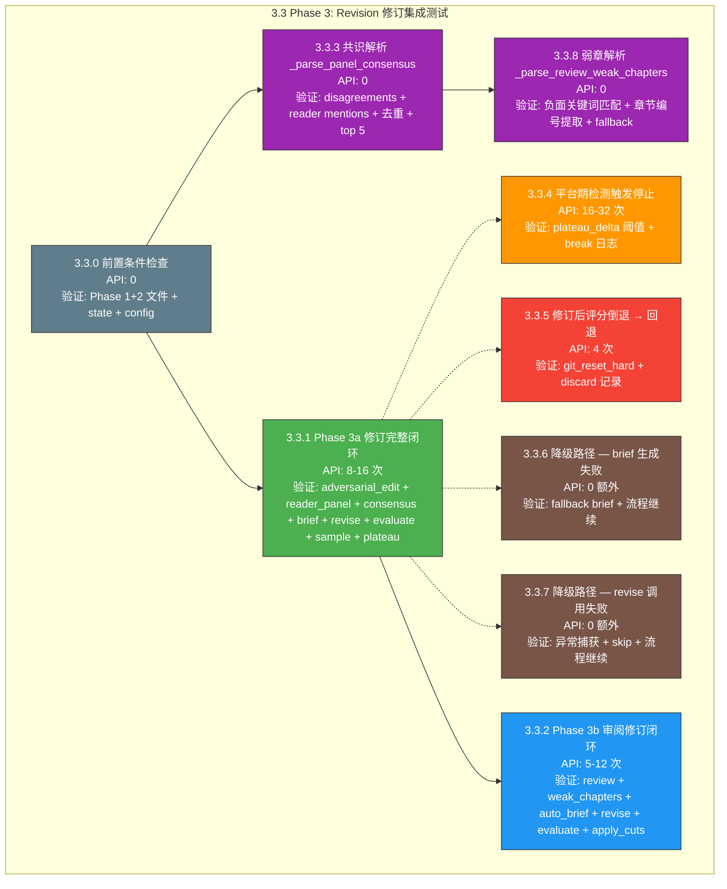

# 3.3 Phase 3 集成测试 — Revision（修订）详细执行方案

> 版本：v1.0
> 日期：2026-06-20
> 目标：使用真实 API 验证 [`run_revision()`](pipeline_orchestrator.py:431) 完整修订闭环，确保 Phase 3a（对抗性编辑 → 读者评审团 → 共识修订 → 采样评估 → 跨卷一致性 → 平台期检测）+ Phase 3b（深度审阅 → 弱章解析 → auto brief → 修订 → 回退）全部正常运行
> 配置：`total_chapters=3`, `total_volumes=1`, `max_revision_cycles=1`, `plateau_delta=0.5`, `max_revision_rounds=3`
> 通过标准：100% 用例通过，0 阶段崩溃，0 未捕获异常
> 前置：Phase 1 + Phase 2 完整产出（world / characters / outline / canon / voice / ch_01~ch_03 均存在）

---

## 前置条件

### 环境要求

| 配置项 | 值 |
|--------|-----|
| Python | ≥ 3.9 |
| API 端点 | `https://api.siliconflow.cn/v1` |
| 写作模型 | `deepseek-ai/DeepSeek-V4-Flash` |
| 裁判模型 | 同写作模型（`AUTONOVEL_JUDGE_API_KEY` 不配时回退共用 Key） |
| 故事梗概 | `2049年上海，程序员在维护老旧服务器时发现AI觉醒迹象，36小时倒计时` |
| API 间隔 | ≥ 4 秒 |
| `total_chapters` | 3 |
| `total_volumes` | 1 |
| `max_revision_cycles` | 1 |
| `plateau_delta` | 0.5 |
| `revision_threshold` | 1.0（极低，确保单次通过） |
| `max_revision_rounds` | 3（Phase 3b 审阅修订上限） |

### Phase 1 + Phase 2 前置产出要求

进入 Phase 3 集成测试前，以下文件必须已由 Phase 1 + Phase 2 产出：

| 文件 | 路径 | 说明 |
|------|------|------|
| 世界观 | [`output/world.md`](output/world.md) | 内容 ≥ 500 字 |
| 角色注册表 | [`output/characters.md`](output/characters.md) | 含 ≥ 2 个角色条目 |
| 卷级总纲 | [`output/outline_volume.md`](output/outline_volume.md) | 卷级规划 |
| 章级大纲 | [`output/outline.md`](output/outline.md) | 含 3 章节条目 |
| 正典 | [`output/canon.md`](output/canon.md) | `count_canon_entries()["total"] ≥ 3` |
| 文风定义 | [`output/voice.md`](output/voice.md) | 含 Part 2 语域分析 |
| 第 1 章 | [`output/chapters/ch_01.md`](output/chapters/ch_01.md) | ≥ 2000 字 |
| 第 2 章 | [`output/chapters/ch_02.md`](output/chapters/ch_02.md) | ≥ 2000 字 |
| 第 3 章 | [`output/chapters/ch_03.md`](output/chapters/ch_03.md) | ≥ 2000 字 |
| State | [`output/state.json`](output/state.json) | `phase == "revision"`, `chapters_drafted == 3`, `revision_cycle == 0` |

### 必须修复的阻塞项（Stage 1 + Stage 2 BUG）

同 Phase 1 / Phase 2：

| BUG ID | 严重度 | 描述 | 修复位置 |
|--------|--------|------|---------|
| **BUG-S1-01** | 🔴 高 | 6 处 PEP 604 `str \| None` 语法 → Python 3.9 不兼容 | [`evaluation/evaluate.py:274,314`](evaluation/evaluate.py:274) / [`novel_app.py:110,121`](novel_app.py:110) / [`seed.py:166,177`](seed.py:166) → `Optional[str]` |
| **BUG-S1-07** | 🟡 中 | `default_state()` 缺失 `review_revision_round` 字段 | [`core/state_manager.py:90`](core/state_manager.py:90) |
| **BUG-S2-01** | 🟡 中 | `load_state()` 对非法 JSON 无 `JSONDecodeError` 保护 | [`core/state_manager.py:97`](core/state_manager.py:97) |

### 环境准备命令

```powershell
# 1. 确保 .env 配置正确
#    AUTONOVEL_API_KEY=sk-xxxxxxxx
#    AUTONOVEL_API_BASE_URL=https://api.siliconflow.cn/v1
#    AUTONOVEL_MODEL_NAME=deepseek-ai/DeepSeek-V4-Flash
#    AUTONOVEL_API_INTERVAL_SECONDS=4

# 2. 确保依赖安装
uv sync

# 3. 确保 Phase 1 + Phase 2 产出就绪（如未运行，先执行）
# python tests/stage3_phase1_tests.py --test 3.1.1
# python tests/stage3_phase2_tests.py --test 3.2.1 --reuse-phase1

# 4. 写入 Phase 3 测试 config
# python -c "from core.config import config; config.save({'story_summary': '2049年上海…', 'total_chapters': 3, 'total_volumes': 1, 'revision_threshold': 1.0, 'plateau_delta': 0.5, 'max_revision_cycles': 1})"

# 5. 运行 Phase 3 集成测试
python tests/stage3_phase3_tests.py
```

---

## 测试总览



### API 调用预算

| 测试项 | 最低调用 | 最高调用 | 说明 |
|--------|---------|---------|------|
| 3.3.1 Phase 3a 修订闭环 | 8 | 16 | adversarial_edit(3) + reader_panel(4×3=12 → 实际每角色评审全部章节, 单次调用 per role) → ~4 + gen_brief(1-2) + gen_revision(1-2) + evaluate_chapter(2-4) + evaluate_full(1) |
| 3.3.2 Phase 3b 审阅修订 | 5 | 12 | run_review_loop(1) + evaluate_chapter(2×弱章数) + gen_revision(弱章数) + evaluate_full(1) |
| 3.3.3 共识解析 | 0 | 0 | 纯数据解析 |
| 3.3.4 平台期检测 | 16 | 32 | 2 轮完整 Phase 3a |
| 3.3.5 评分倒退回退 | 4 | 6 | pre_eval + revise + post_eval（单章） |
| 3.3.6 brief 降级 | 0 | 0 | 在 3.3.1 中一并验证 |
| 3.3.7 revise 降级 | 0 | 0 | 在 3.3.1 中一并验证 |
| 3.3.8 弱章解析 | 0 | 0 | 纯数据解析 |

> **总计（不含 3.3.4 平台期）**：~17-34 次 API 调用
> **总计（含 3.3.4 平台期）**：~33-66 次 API 调用

---

## 3.3.0 前置条件检查（最先执行 — 零 API 成本）

| 项目 | 内容 |
|------|------|
| **测试方法** | 检查所有 Phase 1 + Phase 2 前置文件是否存在且内容完整 |
| **前置条件** | 无 |
| **验证点** | |
| | (a) 7 个 foundation 文件全部存在：`world.md`, `characters.md`, `outline_volume.md`, `outline.md`, `canon.md`, `voice.md`, `state.json` |
| | (b) 3 个章节文件全部存在：`chapters/ch_01.md`, `ch_02.md`, `ch_03.md` |
| | (c) 每章 ≥ 2000 字（`word_count` ≥ 2000） |
| | (d) `state["phase"] == "revision"` 或可手动设置 |
| | (e) `state["chapters_drafted"] == 3` |
| | (f) `config.revision_threshold` 已设置为 1.0 |
| | (g) `state["revision_cycle"] == 0` |
| **API 调用计数** | 0 |
| **预期行为** | 所有前置条件满足或给出明确缺失提示 |
| **代码路径** | 文件系统检查 + [`core/state_manager.py`](core/state_manager.py) |

```python
# 测试逻辑伪代码
def test_3_3_0_prerequisites(self):
    """Phase 3 前置条件检查"""
    issues = []

    # Foundation 文件
    for name in ["world.md", "characters.md", "outline_volume.md",
                 "outline.md", "canon.md", "voice.md"]:
        if not (OUTPUT_DIR / name).exists():
            issues.append(f"缺失: output/{name}")

    # 章节文件
    for ch in [1, 2, 3]:
        ch_file = CHAPTERS_DIR / f"ch_{ch:02d}.md"
        if not ch_file.exists():
            issues.append(f"缺失: chapters/ch_{ch:02d}.md")
        else:
            content = ch_file.read_text(encoding="utf-8")
            wc = len(content.replace(" ", "").replace("\n", ""))
            if wc < 2000:
                issues.append(f"ch_{ch:02d}.md 过短: {wc} 字")

    # State
    state = load_state()
    if state.get("chapters_drafted", 0) < 3:
        issues.append(f"chapters_drafted={state.get('chapters_drafted')} < 3")

    if issues:
        self.fail("前置条件不满足:\n  " + "\n  ".join(issues))
```

---

## 3.3.3 共识解析 — `_parse_panel_consensus()` 纯逻辑测试（最先执行 — 零 API 成本）

| 项目 | 内容 |
|------|------|
| **测试方法** | 手动构造多种 `reader_panel.json` 场景，调用 [`_parse_panel_consensus()`](pipeline_orchestrator.py:376)，验证解析结果 |
| **前置条件** | `EDIT_LOGS_DIR` 存在 |
| **验证点** | |
| | (a) 正常 `reader_panel.json`：`disagreements` 中 `flag_by ≥ 2` 的章节被正确提取 |
| | (b) `readers` 回答中 `momentum_loss` / `cut_candidate` / `worst_scene` / `thinnest_character` / `missing_scene` 提及的章节被正则扫描 |
| | (c) 去重正确：同一 `(chapter, question)` key 不重复，每章最多 1 条 |
| | (d) 返回数量 ≤ 5（截断逻辑） |
| | (e) `panel_path` 为 `None` → 返回 `[]` |
| | (f) `panel_path` 不存在 → 返回 `[]` |
| | (g) JSON 格式损坏 → 不崩溃，返回空或部分结果 |
| **API 调用计数** | 0（纯数据解析） |
| **预期行为** | 解析逻辑正确，去重 / 截断逻辑正确，边界情况不崩溃 |
| **代码路径** | [`pipeline_orchestrator.py:376-428`](pipeline_orchestrator.py:376) — `_parse_panel_consensus()` |

```python
# 测试逻辑伪代码
def test_3_3_3a_disagreements_parsing(self):
    """disagreements 数组解析 — flag_by ≥ 2"""
    panel_data = {
        "timestamp": "2026-06-20T12:00:00",
        "readers": {},
        "disagreements": [
            {"chapter": 1, "question": "momentum_loss",
             "flagged_by": ["节奏控", "逻辑党"], "count": 2},
            {"chapter": 3, "question": "cut_candidate",
             "flagged_by": ["节奏控"], "count": 1},
            {"chapter": 2, "question": "worst_scene",
             "flagged_by": ["情感向", "设定控", "逻辑党"], "count": 3},
        ],
    }
    panel_path = EDIT_LOGS_DIR / "reader_panel.json"
    panel_path.write_text(json.dumps(panel_data, ensure_ascii=False), encoding="utf-8")

    from pipeline_orchestrator import _parse_panel_consensus
    items = _parse_panel_consensus(panel_path)

    chapters = [item["chapter"] for item in items]
    self.assertIn(1, chapters)
    self.assertIn(2, chapters)
    # ch3 只有 1 人标记，不满足 ≥2
    self.assertNotIn(3, chapters)

def test_3_3_3b_reader_mentions_parsing(self):
    """readers 回答中的章节引用被正则扫描"""
    panel_data = {
        "timestamp": "2026-06-20T12:00:00",
        "readers": {
            "节奏控": {
                "momentum_loss": "第 2 章中间节奏拖沓，建议删减",
                "cut_candidate": "第 1 章开头可以压缩",
                "worst_scene": "",
                "thinnest_character": "",
                "missing_scene": "",
            },
            "情感向": {
                "momentum_loss": "",
                "cut_candidate": "",
                "worst_scene": "第2章的情感冲突不够强烈",
                "thinnest_character": "第 3 章的配角太单薄",
                "missing_scene": "",
            },
        },
        "disagreements": [],
    }
    # ... 写入并解析 ...

    items = _parse_panel_consensus(panel_path)
    # 应有 ch2 momentum_loss (1人) + ch1 cut_candidate (1人) + ch2 worst_scene (1人) + ch3 thinnest_character (1人)
    # 但 ch2 出现 2 次 → 去重后保留 1 条
    self.assertTrue(len(items) <= 5)

def test_3_3_3c_truncation_top5(self):
    """超过 5 章时截断"""
    # 构造 7 个不同章节的 consensus items
    # ...
    items = _parse_panel_consensus(panel_path)
    self.assertLessEqual(len(items), 5)

def test_3_3_3d_null_and_missing_path(self):
    """None 路径和不存在的路径返回空列表"""
    from pipeline_orchestrator import _parse_panel_consensus
    self.assertEqual(_parse_panel_consensus(None), [])
    self.assertEqual(_parse_panel_consensus(Path("/nonexistent/panel.json")), [])
```

---

## 3.3.8 弱章解析 — `_parse_review_weak_chapters()` 纯逻辑测试（零 API 成本）

| 项目 | 内容 |
|------|------|
| **测试方法** | 手动构造多种 `review_round*.json` 场景，调用 `_parse_review_weak_chapters()`（嵌套于 `run_revision` 内，需暴露或内联测试），验证解析结果 |
| **前置条件** | `EDIT_LOGS_DIR` 存在 |
| **验证点** | |
| | (a) 审阅报告含 "第 2 章 薄弱" → 命中章节 2 |
| | (b) 负面关键词列表完整覆盖：`问题` / `弱点` / `严重` / `必须` / `MAJOR` / `薄弱` / `不足` / `缺乏` / `需改进` / `需重写` / `拖沓` / `断裂` / `不连贯` / `最差` / `最低` |
| | (c) 同一章节多次命中 → 按频次降序 |
| | (d) 无任何章节引用 → 兜底逻辑：`total ≥ 6` 时返回中段 1/3~2/3 章节；`total < 6` 时返回 `[]` |
| | (e) 无 `review_round*.json` 文件 → 返回 `[]` |
| | (f) JSON 格式损坏 → 跳过该文件，不崩溃 |
| **API 调用计数** | 0（纯数据解析） |
| **预期行为** | 解析逻辑正确，兜底 / 截断逻辑正确 |
| **代码路径** | [`pipeline_orchestrator.py:843-893`](pipeline_orchestrator.py:843) — `_parse_review_weak_chapters()` |

```python
# 测试逻辑伪代码
def test_3_3_8a_negative_keyword_matching(self):
    """负面关键词 ±200 字窗口内章节引用匹配"""
    review_data = {
        "stars": 3.5,
        "major_items": 2,
        "raw_review": (
            "第 1 章的开场很有力。但是第 2 章的节奏存在严重问题，"
            "中间部分拖沓不堪。第 3 章的人物塑造较为薄弱，"
            "需改进对话密度。"
        ),
    }
    review_path = EDIT_LOGS_DIR / "review_round1.json"
    review_path.write_text(json.dumps(review_data, ensure_ascii=False), encoding="utf-8")

    # 需要提取内联函数或使用反射调用
    weak = _parse_review_weak_chapters()
    # ch2: "严重问题" + "拖沓" → 命中 2 次
    # ch3: "薄弱" + "需改进" → 命中 2 次
    # ch1: 不在负面关键词窗口中
    self.assertIn(2, weak)
    self.assertIn(3, weak)
    self.assertNotIn(1, weak)

def test_3_3_8b_fallback_mid_chapters(self):
    """无章节引用时的兜底逻辑"""
    review_data = {
        "stars": 4.0,
        "major_items": 1,
        "raw_review": "整体质量尚可，但需要进一步提升文字质感。",
    }
    # 只有 3 章时，total < 6 → 返回 []
    weak = _parse_review_weak_chapters()
    self.assertEqual(weak, [])

    # 若有 6 章 → 返回 [3, 4]
    # （需要构造 6 章文件来验证）
```

---

## 3.3.1 Phase 3a 修订完整闭环（核心测试 — 真实 API）

| 项目 | 内容 |
|------|------|
| **测试方法** | Phase 1 + Phase 2 产出就绪后，调用 [`run_revision(state, max_cycles=1)`](pipeline_orchestrator.py:431) |
| **前置条件** | |
| | — 3.3.0 前置条件检查全部通过 |
| | — `state["phase"] == "revision"`, `state["revision_cycle"] == 0` |
| | — `revision_threshold=1.0`（极低阈值）、`plateau_delta=0.5`、`max_revision_cycles=1` |
| **验证点** | |
| | **(a) 对抗性编辑执行**： |
| | | — `output/edit_logs/ch*_cuts.json` 文件产出（每章 1 个） |
| | | — 3 章时应有 3 个 cuts JSON 文件 |
| | | — 每个 JSON 含 `chapter`, `cuts` 字段 |
| | **(b) 机械裁剪执行**： |
| | | — `apply_cuts` 被调用，日志含 "裁剪就绪" |
| | | — 不崩溃（当前为占位实现，仅标记不删除） |
| | **(c) 读者评审团执行**： |
| | | — `output/edit_logs/reader_panel.json` 产出 |
| | | — JSON 含 `readers` (4 个角色) 和 `disagreements` |
| | | — 每个 reader 含 5 个问题字段 |
| | **(d) 共识解析正常**： |
| | | — `_parse_panel_consensus()` 返回共识列表（可能为空） |
| | | — 有共识时日志输出 "发现 N 个共识问题" |
| | **(e) 针对性修订执行**（有共识问题时）： |
| | | — `output/briefs/ch*_cycle*.md` 产出修订摘要 |
| | | — 修订前评估执行：`evaluate_chapter()` 被调用 |
| | | — `revise_chapter()` 被调用 |
| | | — 修订后评估执行 |
| | | — `log_result` 记录 `keep` 或 `discard` |
| | **(f) 采样评估**： |
| | | — `_sample_evaluate_volumes()` 被调用（1 卷 × 3 章 → 采样 ≤5 章） |
| | | — 日志输出每章采样评分 |
| | **(g) 跨卷一致性审阅**（`total_vol > 1` 且 cycle 为偶数时）： |
| | | — 1 卷时跳过，日志输出 "章节不足，跳过" |
| | | — 多卷时执行并输出断裂检查结果 |
| | **(h) 合并修订队列**： |
| | | — 采样弱章 + 跨卷断裂章合并去重 |
| | | — 逐章修订（pre_eval → brief → revise → post_eval → commit/回退） |
| | **(i) 全文评估**： |
| | | — `evaluate_full()` 被调用 |
| | | — `state["novel_score"]` 更新 |
| | **(j) 平台期检测**： |
| | | — `cycle ≥ MIN_REVISION_CYCLES` 时检查 delta |
| | | — 1 轮时不会触发 break（`cycle=1 == MIN_REVISION_CYCLES` 时才检查） |
| | **(k) Phase 3b 审阅修订执行**： |
| | | — `_run_review_revision_loop()` 被调用 |
| | | — 见 3.3.2 详细验证点 |
| | **(l) 状态切换**： |
| | | — `state["phase"] == "export"` |
| | | — `state["revision_cycle"] ≥ 1` |
| | | — `state["novel_score"] > 0` |
| **API 调用计数** | ~8-16 次（详见上方 API 汇总） |
| **预期行为** | 修订闭环完整执行，所有步骤产出对应文件，无异常中断 |
| **代码路径** | [`pipeline_orchestrator.py:431-838`](pipeline_orchestrator.py:431) — `run_revision()` Phase 3a + [`pipeline_orchestrator.py:1080-1085`](pipeline_orchestrator.py:1080) — Phase 3b 调用 |

```python
# 测试逻辑伪代码
def test_3_3_1_revision_full_cycle(self):
    """Phase 3a 修订闭环 — 验证所有步骤执行"""
    # 确保 Phase 1+2 产出
    state = load_state()
    state["phase"] = "revision"
    state["revision_cycle"] = 0
    save_state(state)

    # 执行修订（max_cycles=1）
    from pipeline_orchestrator import run_revision
    state = run_revision(state, max_cycles=1)

    # ========== 验证文件产出 ==========

    # (a) 对抗性编辑 cuts JSON
    cuts_files = sorted(EDIT_LOGS_DIR.glob("ch*_cuts.json"))
    self.assertGreater(len(cuts_files), 0,
                       "对抗性编辑未产出 cuts JSON")
    self.assertEqual(len(cuts_files), 3,
                     f"应有 3 个 cuts 文件，实际 {len(cuts_files)}")

    # (b) 读者评审团
    panel_path = EDIT_LOGS_DIR / "reader_panel.json"
    self.assertTrue(panel_path.exists(),
                    "reader_panel.json 未产出")
    panel = json.loads(panel_path.read_text(encoding="utf-8"))
    self.assertIn("readers", panel)
    self.assertEqual(len(panel["readers"]), 4,
                     f"应有 4 位读者，实际 {len(panel['readers'])}")

    # (c) 修订摘要（如果有共识问题）
    brief_files = sorted(BRIEFS_DIR.glob("ch*_cycle*.md"))
    # briefs 可能为空（无共识问题时）

    # (d) 全文评估日志
    eval_files = sorted(EVAL_LOGS_DIR.glob("full_eval*.json"))
    self.assertGreater(len(eval_files), 0,
                       "全文评估日志未产出")

    # ========== 验证状态 ==========
    self.assertGreaterEqual(state["revision_cycle"], 1,
                            "revision_cycle 未递增")
    self.assertGreater(state.get("novel_score", 0), 0,
                       "novel_score 未更新")
    self.assertEqual(state["phase"], "export",
                     f"phase 应为 export，实际为 {state['phase']}")

    # ========== 验证 results.tsv ==========
    results = (OUTPUT_DIR / "results.tsv").read_text(encoding="utf-8")
    self.assertIn("revision", results.lower(),
                  "results.tsv 缺少 revision 记录")
```

---

## 3.3.2 Phase 3b 审阅修订闭环

| 项目 | 内容 |
|------|------|
| **测试方法** | 在 Phase 3a 完成后，Phase 3b [`_run_review_revision_loop()`](pipeline_orchestrator.py:895) 自动执行；或可独立调用验证 |
| **前置条件** | 3.3.1 执行完成，Phase 3a 修订闭环已完成 |
| **验证点** | |
| | **(a) 深度审阅执行**： |
| | | — `run_review_loop()` 被调用（`state=None`, `max_rounds=1`） |
| | | — `output/edit_logs/review_round1.json` 产出 |
| | | — JSON 含 `stars`（星级评分）和 `major_items`（严重问题数）和 `raw_review`（审阅全文） |
| | **(b) 质量检查 — 早期退出**： |
| | | — 若 `stars ≥ 4.5` 且 `major_items == 0` → break（"质量通过，无需修订"） |
| | | — 否则进入弱章修订流程 |
| | **(c) 弱章解析**： |
| | | — `_parse_review_weak_chapters()` 被调用 |
| | | — 弱章列表可能为空（无负面关键词命中时） |
| | | — 弱章为空 → break（"审阅未指出具体弱章节"） |
| | **(d) 逐章修订**（有弱章时）： |
| | | — `evaluate_chapter()` 修订前评估 |
| | | — `build_auto_brief()` 生成三源交叉引用摘要 |
| | | — `revise_chapter()` 执行修订 |
| | | — `evaluate_chapter()` 修订后评估 |
| | | — `post_score ≥ pre_score` → commit + `log_result(keep)` |
| | | — `post_score < pre_score` → `git_reset_hard("HEAD")` + `log_result(discard)` |
| | | — `run_apply_cuts()` 在每个修订章节后调用 |
| | **(e) 轮次提交**： |
| | | — `any_improved == True` 时 commit 本轮 |
| | | — `state["review_revision_round"]` 递增 |
| | **(f) 最终全文评估**： |
| | | — `evaluate_full()` 被调用 |
| | | — `state["novel_score"]` 更新 |
| **API 调用计数** | ~5-12 次（详见上方 API 汇总） |
| **预期行为** | Phase 3b 审阅修订闭环正常执行，早期退出 / 弱章修订 / 回退逻辑均正确 |
| **代码路径** | [`pipeline_orchestrator.py:895-1078`](pipeline_orchestrator.py:895) — `_run_review_revision_loop()` |

```python
# 测试逻辑伪代码
def test_3_3_2_review_revision_loop(self):
    """Phase 3b 审阅修订闭环"""
    # 3.3.1 已完成，state 已更新
    state = load_state()

    # 验证 review JSON 产出
    review_jsons = sorted(EDIT_LOGS_DIR.glob("review_round*.json"))
    self.assertGreater(len(review_jsons), 0,
                       "深度审阅 JSON 未产出")

    latest = json.loads(review_jsons[-1].read_text(encoding="utf-8"))
    self.assertIn("stars", latest, "审阅 JSON 缺少 stars 字段")
    self.assertIn("major_items", latest, "审阅 JSON 缺少 major_items 字段")
    self.assertIn("raw_review", latest, "审阅 JSON 缺少 raw_review 字段")

    stars = latest["stars"]
    major_items = latest["major_items"]
    print(f"  审阅结果: ★{'★' * int(stars)}, {major_items} 严重问题")

    # 验证 state
    self.assertIn("review_revision_round", state,
                  "state 缺少 review_revision_round")
    if state["review_revision_round"] > 0:
        print(f"  审阅修订完成 {state['review_revision_round']} 轮")

    # 验证无崩溃
    self.assertEqual(state["phase"], "export",
                     "Phase 3 完成后 phase 应为 export")
```

---

## 3.3.4 平台期检测触发停止

| 项目 | 内容 |
|------|------|
| **测试方法** | 设置 `plateau_delta=999`（巨大 delta，永不触发平台期），验证正常循环；设置 `plateau_delta=0.01`（极小 delta），验证平台期检测触发停止 |
| **前置条件** | Phase 1 + Phase 2 产出就绪。需要设置 `max_revision_cycles=3`（允许 ≥2 轮） |
| **验证点** | |
| | **(a) `plateau_delta=999`**： |
| | | — 循环继续，不因 delta 触发 break |
| | | — `state["revision_cycle"]` 达到 `max_revision_cycles` |
| | **(b) `plateau_delta=0.01`**： |
| | | — 两轮评分差异 < 0.01 时触发 break |
| | | — 日志包含 "平台期" 或 "plateau" 或 "无改善" |
| | | — `state["revision_cycle"]` 未达到 `max_revision_cycles` 即停止 |
| | **(c) `cycle < MIN_REVISION_CYCLES`**： |
| | | — 第 1 轮不会触发平台期检测（`cycle >= MIN_REVISION_CYCLES` 条件） |
| **API 调用计数** | ~16-32 次（2 轮完整 Phase 3a，每轮 ~8-16 次） |
| **预期行为** | 平台期检测阈值逻辑正确，break 时机正确 |
| **代码路径** | [`pipeline_orchestrator.py:832-835`](pipeline_orchestrator.py:832) — 平台期检测 |

```python
# 测试逻辑伪代码
def test_3_3_4a_plateau_triggers_stop(self):
    """极小 plateau_delta 触发平台期停止"""
    _write_phase3_config({"plateau_delta": 0.01, "max_revision_cycles": 3})
    state = load_state()
    state["phase"] = "revision"
    state["revision_cycle"] = 0
    save_state(state)

    from pipeline_orchestrator import run_revision
    state = run_revision(state, max_cycles=3)

    # 应该在达到 max_cycles=3 前因平台期停止
    self.assertLess(state["revision_cycle"], 3,
                    "平台期检测未触发，revision_cycle 达到上限")

def test_3_3_4b_large_delta_no_plateau(self):
    """极大 plateau_delta 不触发平台期"""
    _write_phase3_config({"plateau_delta": 999.0, "max_revision_cycles": 2})
    state = load_state()
    state["phase"] = "revision"
    state["revision_cycle"] = 0
    save_state(state)

    from pipeline_orchestrator import run_revision
    state = run_revision(state, max_cycles=2)

    # 应该正常完成全部循环
    self.assertEqual(state["revision_cycle"], 2,
                     "正常循环未完成全部轮次")
```

---

## 3.3.5 修订后评分倒退 → 回退

| 项目 | 内容 |
|------|------|
| **测试方法** | Mock `gen_revision.revise_chapter()` 返回明显更差的文本（例如覆盖为空段落），执行 Phase 3a 针对性修订或 Phase 3b 弱章修订，验证回退逻辑 |
| **前置条件** | Phase 1 + Phase 2 产出就绪，至少一章有共识问题或弱章标记 |
| **验证点** | |
| | **(a) `post_score < pre_score`** → 触发 `git_reset_hard("HEAD")` |
| | **(b) `log_result`** 中 `disposition="discard"`, `note` 含 "倒退" |
| | **(c) 原章节文件未被劣化版本覆盖**（git reset 恢复到修订前状态） |
| | **(d) 流程不崩溃**，继续处理下一个章节或进入 Phase 3b |
| **API 调用计数** | ~4 次（pre_eval + revise + post_eval） |
| **预期行为** | 倒退修订被正确回退，日志记录清晰 |
| **代码路径** | |
| | Phase 3a: [`pipeline_orchestrator.py:537-542`](pipeline_orchestrator.py:537) — 共识修订回退分支 |
| | Phase 3b: [`pipeline_orchestrator.py:1032-1042`](pipeline_orchestrator.py:1032) — 审阅修订回退分支 |

```python
# 测试逻辑伪代码
def test_3_3_5_regression_rollback(self):
    """评分倒退 → 回退验证"""
    import unittest.mock as mock
    from revision import gen_revision

    state = load_state()
    state["phase"] = "revision"
    state["revision_cycle"] = 0
    save_state(state)

    # Mock revise_chapter 返回明显更差的文本
    original_revise = gen_revision.revise_chapter
    def bad_revise(ch_num, brief_file, **kwargs):
        ch_file = CHAPTERS_DIR / f"ch_{ch_num:02d}.md"
        ch_file.write_text("劣化文本。内容极少，质量很差。", encoding="utf-8")
    gen_revision.revise_chapter = bad_revise

    try:
        from pipeline_orchestrator import run_revision
        state = run_revision(state, max_cycles=1)
    finally:
        gen_revision.revise_chapter = original_revise

    # 验证 results.tsv 中有 discard 记录
    results = (OUTPUT_DIR / "results.tsv").read_text(encoding="utf-8")
    self.assertIn("discard", results,
                  "results.tsv 缺少 discard 记录")
    self.assertIn("倒退", results,
                  "results.tsv 缺少 '倒退' 说明")

    # 验证章节未被劣化版本覆盖（git reset 后恢复）
    for ch in [1, 2, 3]:
        ch_file = CHAPTERS_DIR / f"ch_{ch:02d}.md"
        content = ch_file.read_text(encoding="utf-8")
        self.assertNotEqual(content, "劣化文本。内容极少，质量很差。",
                            f"第 {ch} 章被劣化版本覆盖，回退失败")
```

---

## 3.3.6 降级路径 — brief 生成失败 → fallback

| 项目 | 内容 |
|------|------|
| **测试方法** | Mock `gen_brief.generate_brief()` 抛异常，验证 fallback brief 被创建且流程继续 |
| **前置条件** | 同 3.3.1 |
| **验证点** | |
| | **(a) `generate_brief()` 抛异常** → 捕获 `except Exception` |
| | **(b) fallback brief 文件被创建**（含章节号和问题描述的最小摘要） |
| | **(c) 流程不崩溃**，继续执行 `revise_chapter()` |
| | **(d) 日志包含 "修订摘要: 第 N 章" fallback 内容 |
| **API 调用计数** | 0（在 Phase 3a 中一并验证） |
| **预期行为** | brief 失败不阻塞修订流程 |
| **代码路径** | |
| | Phase 3a: [`pipeline_orchestrator.py:498-509`](pipeline_orchestrator.py:498) — generate_brief 失败 fallback |
| | Phase 3b: [`pipeline_orchestrator.py:972-986`](pipeline_orchestrator.py:972) — build_auto_brief 失败 fallback |

```python
# 测试逻辑伪代码
def test_3_3_6_brief_fallback(self):
    """brief 生成失败 → fallback 不崩溃"""
    import unittest.mock as mock
    from revision import gen_brief

    original_generate = gen_brief.generate_brief
    def failing_generate(*args, **kwargs):
        raise RuntimeError("模拟 gen_brief 失败")
    gen_brief.generate_brief = failing_generate

    try:
        # 触发一个共识修订场景（需要先有 reader_panel.json）
        from pipeline_orchestrator import run_revision
        state = run_revision(state, max_cycles=1)

        # 检查 fallback brief 文件
        brief_files = sorted(BRIEFS_DIR.glob("ch*_cycle*.md"))
        for bf in brief_files:
            content = bf.read_text(encoding="utf-8")
            self.assertIn("修订摘要", content,
                          "fallback brief 内容异常")
    finally:
        gen_brief.generate_brief = original_generate
```

---

## 3.3.7 降级路径 — revise 调用失败 → skip + continue

| 项目 | 内容 |
|------|------|
| **测试方法** | Mock `gen_revision.revise_chapter()` 抛异常，验证 skip 逻辑且流程继续 |
| **前置条件** | 同 3.3.1 |
| **验证点** | |
| | **(a) `revise_chapter()` 抛异常** → 捕获 `except Exception` |
| | **(b) 日志输出 "修订第 N 章失败: ..."** |
| | **(c) `continue`** — 不崩溃，继续处理下一个章节 |
| | **(d) 其他章节不受影响** |
| **API 调用计数** | 0（在 Phase 3a 中一并验证） |
| **预期行为** | revise 失败不阻塞其他章节修订 |
| **代码路径** | |
| | Phase 3a: [`pipeline_orchestrator.py:768-770`](pipeline_orchestrator.py:768) — revise 失败 continue |
| | Phase 3b: [`pipeline_orchestrator.py:998-1000`](pipeline_orchestrator.py:998) — revise 失败 continue |

```python
# 测试逻辑伪代码
def test_3_3_7_revise_failure_skip(self):
    """revise 调用失败 → skip + continue"""
    import unittest.mock as mock
    from revision import gen_revision

    original_revise = gen_revision.revise_chapter
    call_count = [0]

    def failing_revise(ch_num, brief_file, **kwargs):
        call_count[0] += 1
        if call_count[0] == 1:  # 第一次调用失败
            raise RuntimeError("模拟 revise 失败")
        # 后续调用正常
        return original_revise(ch_num, brief_file, **kwargs)

    gen_revision.revise_chapter = failing_revise

    try:
        from pipeline_orchestrator import run_revision
        state = run_revision(state, max_cycles=1)

        # 验证流程完成（第一个章节被 skip，后续正常）
        self.assertEqual(state["phase"], "export")
        self.assertGreaterEqual(call_count[0], 1,
                                "revise_chapter 至少被调用 1 次")
    finally:
        gen_revision.revise_chapter = original_revise
```

---

## 测试文件结构模板

测试文件：`tests/stage3_phase3_tests.py`

```python
#!/usr/bin/env python3
"""
Stage 3 Phase 3 集成测试 — Revision（修订）

真实 API 调用 ~17-66 次（含降级路径 Mock）。
严格按 3.3.0 → 3.3.3 → 3.3.8 → 3.3.1 → 3.3.6 → 3.3.7 → 3.3.5 → 3.3.2 → 3.3.4 顺序执行。

用法:
    python tests/stage3_phase3_tests.py              # 全部执行
    python tests/stage3_phase3_tests.py --dry-run    # 仅检查前置条件
    python tests/stage3_phase3_tests.py --test 3.3.1 # 单项测试
    python tests/stage3_phase3_tests.py --skip-api   # 跳过真实 API 调用
    python tests/stage3_phase3_tests.py --reuse-phase12  # 复用已有 Phase 1+2 产出
"""

import io
import json
import os
import re
import sys
import unittest
from pathlib import Path
from unittest import mock

# Windows 控制台 GBK 编码不支持中文，强制使用 UTF-8
if sys.platform == "win32":
    sys.stdout.reconfigure(encoding="utf-8", errors="replace")
    sys.stderr.reconfigure(encoding="utf-8", errors="replace")

ROOT = Path(__file__).parent.parent
sys.path.insert(0, str(ROOT))

from core.config import (
    config, OUTPUT_DIR, CHAPTERS_DIR, BRIEFS_DIR,
    EDIT_LOGS_DIR, EVAL_LOGS_DIR, STATE_FILE, RESULTS_FILE, BACKUPS_DIR,
    CONFIG_FILE, ENV_FILE,
)
from core.state_manager import default_state, load_state, save_state
from core.state_manager import count_words_in_chapters, count_chapter_files

# ============================================================
# 测试配置常量
# ============================================================

TEST_STORY = "2049年上海，程序员在维护老旧服务器时发现AI觉醒迹象，36小时倒计时"

# ============================================================
# 命令行参数解析
# ============================================================

DRY_RUN = "--dry-run" in sys.argv
SKIP_API = "--skip-api" in sys.argv
REUSE_PHASE12 = "--reuse-phase12" in sys.argv
TARGET_TEST = None
for i, arg in enumerate(sys.argv):
    if arg == "--test" and i + 1 < len(sys.argv):
        TARGET_TEST = sys.argv[i + 1]

# ============================================================
# 工具函数
# ============================================================

def _write_phase3_config(extra: dict = None):
    """写入 Phase 3 测试 config.json。"""
    OUTPUT_DIR.mkdir(parents=True, exist_ok=True)
    data = {
        "story_summary": TEST_STORY,
        "total_chapters": 3,
        "total_volumes": 1,
        "chapters_per_volume": 3,
        "revision_threshold": 1.0,
        "plateau_delta": 0.5,
        "max_revision_cycles": 1,
        "max_revision_rounds": 3,
    }
    if extra:
        data.update(extra)
    with open(CONFIG_FILE, "w", encoding="utf-8") as f:
        json.dump(data, f, indent=2, ensure_ascii=False)


def _check_api_key() -> bool:
    """检查 API Key 是否有效（非占位符）。"""
    cfg = config
    cfg._loaded = False
    cfg.load()
    key = cfg.api_key
    if not key or key.startswith("sk-xxx") or key.startswith("'sk-xxx"):
        return False
    return True


def _capture_stderr(func, *args, **kwargs):
    """捕获 stderr 输出后执行函数。"""
    captured = io.StringIO()
    old = sys.stderr
    sys.stderr = captured
    try:
        result = func(*args, **kwargs)
    finally:
        sys.stderr = old
    return result, captured.getvalue()


def _clean_output():
    """清理 output/ 子目录。"""
    import shutil
    for subdir in [CHAPTERS_DIR, BRIEFS_DIR, EDIT_LOGS_DIR, EVAL_LOGS_DIR, BACKUPS_DIR]:
        if subdir.exists():
            shutil.rmtree(str(subdir), ignore_errors=True)
    for pattern in ["*.md", "*.json", "*.tsv"]:
        for f in OUTPUT_DIR.glob(pattern):
            if f.name not in (".gitkeep",):
                try:
                    f.unlink()
                except Exception:
                    pass
    for subdir in [CHAPTERS_DIR, BRIEFS_DIR, EDIT_LOGS_DIR, EVAL_LOGS_DIR, BACKUPS_DIR]:
        subdir.mkdir(parents=True, exist_ok=True)


# ============================================================
# 前置条件检查
# ============================================================

def check_prerequisites() -> list[str]:
    """检查所有前置条件，返回问题列表。"""
    issues = []

    # 1. Python 版本
    if sys.version_info < (3, 9):
        issues.append(f"Python 版本过低: {sys.version}（需要 ≥ 3.9）")

    # 2. .env 和 API Key
    if not ENV_FILE.exists():
        issues.append(".env 文件不存在")
    elif not _check_api_key():
        issues.append("API Key 为占位符，请编辑 .env 填入真实 Key")

    # 3. 依赖
    try:
        import httpx  # noqa: F401
    except ImportError:
        issues.append("httpx 未安装，请运行: uv sync")

    # 4. BUG-S1-01 已修复
    pep604_pattern = re.compile(r'\b\w+\s*\|\s*None\b')
    tests_dir = ROOT / "tests"
    for py_file in list(ROOT.rglob("*.py")):
        if tests_dir in py_file.parents:
            continue
        try:
            content = py_file.read_text(encoding="utf-8")
            if pep604_pattern.search(content):
                issues.append(f"BUG-S1-01 未修复: {py_file.relative_to(ROOT)}")
                break
        except Exception:
            pass

    # 5. BUG-S2-01 已修复
    state_mgr = ROOT / "core" / "state_manager.py"
    if state_mgr.exists():
        content = state_mgr.read_text(encoding="utf-8")
        if "json.JSONDecodeError" not in content:
            issues.append("BUG-S2-01 未修复: 缺少 JSONDecodeError 保护")

    # 6. Phase 1+2 产出文件
    for name in ["world.md", "characters.md", "outline_volume.md",
                 "outline.md", "canon.md", "voice.md"]:
        if not (OUTPUT_DIR / name).exists():
            issues.append(f"Phase 1 产出缺失: output/{name}")

    for ch in [1, 2, 3]:
        ch_file = CHAPTERS_DIR / f"ch_{ch:02d}.md"
        if not ch_file.exists():
            issues.append(f"Phase 2 产出缺失: chapters/ch_{ch:02d}.md")

    return issues


# ============================================================
# 3.3.0 前置条件测试
# ============================================================

class Test_3_3_0_Prerequisites(unittest.TestCase):
    """3.3.0 前置条件检查"""

    def test_3_3_0_prerequisites(self):
        """验证 Phase 1+2 全部产出就绪"""
        issues = check_prerequisites()
        if issues:
            self.fail("前置条件不满足:\n  " + "\n  ".join(issues))


# ============================================================
# 3.3.3 共识解析测试（零 API）
# ============================================================

class Test_3_3_3_ConsensusParsing(unittest.TestCase):
    """3.3.3 _parse_panel_consensus 纯逻辑测试"""

    def setUp(self):
        _clean_output()
        EDIT_LOGS_DIR.mkdir(parents=True, exist_ok=True)

    def test_3_3_3a_disagreements_parsing(self):
        """disagreements 数组解析"""
        # ... (参见上方伪代码) ...

    def test_3_3_3b_reader_mentions_parsing(self):
        """readers 回答章节引用解析"""
        # ... (参见上方伪代码) ...

    def test_3_3_3c_truncation_top5(self):
        """截断至多 5 条"""
        # ... (参见上方伪代码) ...

    def test_3_3_3d_null_and_missing_path(self):
        """None 和不存在的路径 → []"""
        # ... (参见上方伪代码) ...


# ============================================================
# 3.3.8 弱章解析测试（零 API）
# ============================================================

class Test_3_3_8_WeakChapterParsing(unittest.TestCase):
    """3.3.8 _parse_review_weak_chapters 纯逻辑测试"""

    def setUp(self):
        _clean_output()
        EDIT_LOGS_DIR.mkdir(parents=True, exist_ok=True)
        CHAPTERS_DIR.mkdir(parents=True, exist_ok=True)

    def test_3_3_8a_negative_keyword_matching(self):
        """负面关键词匹配"""
        # ... (参见上方伪代码) ...

    def test_3_3_8b_fallback_small_novel(self):
        """少于 6 章时兜底返回 []"""
        # ... (参见上方伪代码) ...


# ============================================================
# 3.3.1 Phase 3a 修订完整闭环（真实 API）
# ============================================================

@unittest.skipIf(SKIP_API, "跳过真实 API 调用")
class Test_3_3_1_RevisionFullCycle(unittest.TestCase):
    """3.3.1 Phase 3a 修订完整闭环"""

    def setUp(self):
        _write_phase3_config()
        state = load_state()
        state["phase"] = "revision"
        state["revision_cycle"] = 0
        save_state(state)

    def test_3_3_1_revision_full_cycle(self):
        """Phase 3a 完整修订闭环"""
        if not _check_api_key():
            self.skipTest("API Key 为占位符")
        # ... (参见上方伪代码) ...


# ============================================================
# 3.3.2 Phase 3b 审阅修订闭环（真实 API）
# ============================================================

@unittest.skipIf(SKIP_API, "跳过真实 API 调用")
class Test_3_3_2_ReviewRevisionLoop(unittest.TestCase):
    """3.3.2 Phase 3b 审阅修订闭环"""

    def setUp(self):
        _write_phase3_config()

    def test_3_3_2_review_revision_loop(self):
        """审阅修订闭环"""
        if not _check_api_key():
            self.skipTest("API Key 为占位符")
        # ... (参见上方伪代码) ...


# ============================================================
# 3.3.4 平台期检测（真实 API）
# ============================================================

@unittest.skipIf(SKIP_API, "跳过真实 API 调用")
class Test_3_3_4_PlateauDetection(unittest.TestCase):
    """3.3.4 平台期检测触发停止"""

    def setUp(self):
        _write_phase3_config()

    def test_3_3_4a_plateau_triggers_stop(self):
        """极小 plateau_delta 触发停止"""
        if not _check_api_key():
            self.skipTest("API Key 为占位符")
        # ... (参见上方伪代码) ...

    def test_3_3_4b_large_delta_no_plateau(self):
        """极大 plateau_delta 不触发"""
        if not _check_api_key():
            self.skipTest("API Key 为占位符")
        # ... (参见上方伪代码) ...


# ============================================================
# 3.3.5 评分倒退回退（Mock + 真实 API）
# ============================================================

class Test_3_3_5_RegressionRollback(unittest.TestCase):
    """3.3.5 修订后评分倒退 → 回退"""

    def setUp(self):
        _write_phase3_config()

    @unittest.skipIf(SKIP_API, "跳过真实 API 调用")
    def test_3_3_5_regression_rollback(self):
        """评分倒退 → 回退验证"""
        if not _check_api_key():
            self.skipTest("API Key 为占位符")
        # ... (参见上方伪代码) ...


# ============================================================
# 3.3.6 + 3.3.7 降级路径测试（Mock）
# ============================================================

class Test_3_3_6_7_DegradationPaths(unittest.TestCase):
    """3.3.6 brief 降级 + 3.3.7 revise 降级"""

    def setUp(self):
        _write_phase3_config()

    @unittest.skipIf(SKIP_API, "跳过真实 API 调用")
    def test_3_3_6_brief_fallback(self):
        """brief 生成失败 → fallback"""
        if not _check_api_key():
            self.skipTest("API Key 为占位符")
        # ... (参见上方伪代码) ...

    @unittest.skipIf(SKIP_API, "跳过真实 API 调用")
    def test_3_3_7_revise_failure_skip(self):
        """revise 调用失败 → skip + continue"""
        if not _check_api_key():
            self.skipTest("API Key 为占位符")
        # ... (参见上方伪代码) ...


# ============================================================
# 主入口
# ============================================================

if __name__ == "__main__":
    if DRY_RUN:
        issues = check_prerequisites()
        if issues:
            print("❌ 前置条件不满足:")
            for i in issues:
                print(f"  - {i}")
        else:
            print("✓ 所有前置条件满足")
        sys.exit(0 if not issues else 1)

    unittest.main()
```

---

## 测试执行顺序

1. **3.3.0** 前置条件检查（零 API）—— 如不通过，停止后续
2. **3.3.3** 共识解析纯逻辑测试（零 API）—— 先验证解析器正确
3. **3.3.8** 弱章解析纯逻辑测试（零 API）—— 先验证解析器正确
4. **3.3.1** Phase 3a 修订闭环（真实 API ~8-16 次）—— 核心流程
5. **3.3.6** + **3.3.7** 降级路径（在 3.3.1 中一并验证，可单独 Mock 测试）
6. **3.3.5** 评分倒退回退（Mock revise + 真实 API ~4 次）
7. **3.3.2** Phase 3b 审阅修订（依赖 3.3.1，真实 API ~5-12 次）
8. **3.3.4** 平台期检测（需独立运行，真实 API ~16-32 次）—— 可选，API 消耗较大

---

## 门禁标准

| 测试项 | 通过标准 | 不通过时 |
|--------|---------|---------|
| 3.3.0 前置条件 | 全部 Phase 1+2 文件存在，state 正确 | 禁止进入 Phase 3 |
| 3.3.3 共识解析 | 全部 4 项通过 | 阻断 3.3.1（解析器有 BUG） |
| 3.3.8 弱章解析 | 全部 2 项通过 | 阻断 3.3.2（解析器有 BUG） |
| 3.3.1 修订闭环 | 全部 12 验证点通过，state.phase == "export" | 禁止进入 Phase 4 |
| 3.3.2 审阅修订 | 全部 6 验证点通过 | Stage 4 |
| 3.3.5 回退逻辑 | 全部 4 验证点通过，discard 记录正确 | Stage 4 |
| 3.3.4 平台期 | 全部 3 验证点通过 | Stage 4（可选执行） |

---

## Phase 3 测试检查清单

### 执行前

- [ ] BUG-S1-01 已修复（PEP 604 语法）
- [ ] BUG-S1-07 已修复（`default_state` 缺失字段）
- [ ] BUG-S2-01 已修复（`load_state` JSONDecodeError）
- [ ] `.env` 配置正确（API Key + Base URL + Model）
- [ ] Phase 1 全部产出文件存在
- [ ] Phase 2 全部 3 章已起草
- [ ] `state["chapters_drafted"] == 3`
- [ ] API 账户余额充足

### 执行中

- [ ] 3.3.0 前置条件检查通过
- [ ] 3.3.3 共识解析通过
- [ ] 3.3.8 弱章解析通过
- [ ] 3.3.1 Phase 3a 修订闭环通过
- [ ] adversarial_edit cuts JSON 全部产出
- [ ] reader_panel.json 4 角色评审完成
- [ ] 共识问题被正确解析
- [ ] 针对性修订正常执行
- [ ] 采样评估正常执行
- [ ] evaluate_full 全文评估完成
- [ ] 3.3.5 评分倒退回退逻辑正确
- [ ] 3.3.2 Phase 3b 审阅修订通过
- [ ] 3.3.4 平台期检测正确（可选）

### 执行后

- [ ] `state["phase"] == "export"`
- [ ] `state["revision_cycle"] ≥ 1`
- [ ] `state["novel_score"] > 0`
- [ ] `output/edit_logs/` 含完整修订日志
- [ ] `output/briefs/` 含修订摘要（如有共识问题）
- [ ] `output/results.tsv` 含 revision 记录
- [ ] 所有 BUG 日志已审查
- [ ] API 调用统计与预算匹配