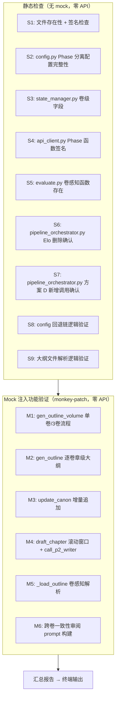
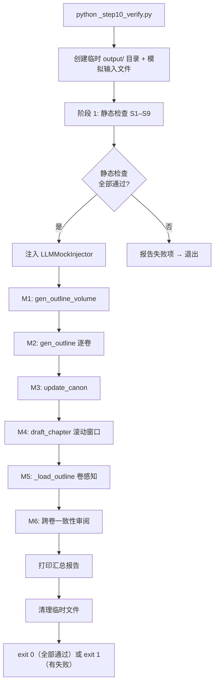

# Step 10 实施方案：端到端静态验证（方案 D 全特性覆盖）

> 基于 [plan_D_layered_outline_incremental_canon.md](plans/plan_D_layered_outline_incremental_canon.md) Step 10  
> 版本：v1.0  
> 日期：2026-06-19  
> 前置依赖：[Step 1–9](plans/plan_D_layered_outline_incremental_canon.md:686) ✅ 全部完成  
> 策略：**最小化方案 — 零 API 调用，monkey-patch 模拟全部 LLM 调用**

---

## 一、目标

验证方案 D 全部 10 项独有特性在代码层面正确实现，通过**静态检查 + mock 注入功能验证**覆盖所有关键代码路径：

| # | 验证目标 | 对应 Step | 核心文件 |
|---|---------|----------|---------|
| 1 | 卷级总纲生成（含单卷/多卷拆分） | Step 4 | [`foundation/gen_outline_volume.py`](foundation/gen_outline_volume.py:194) |
| 2 | 逐卷章级大纲生成（含章组拆分 + 卷约束提取） | Step 5 | [`foundation/gen_outline.py`](foundation/gen_outline.py:144) |
| 3 | 增量 Canon 追加（提取→去重→追加） | Step 6 | [`foundation/update_canon.py`](foundation/update_canon.py:23) |
| 4 | 滚动 8 章上下文 + 全量 Canon 起草 | Step 6 | [`drafting/draft_chapter.py`](drafting/draft_chapter.py:106) |
| 5 | 卷感知大纲加载（evaluate + draft） | Step 9 / Step 6 | [`evaluation/evaluate.py`](evaluation/evaluate.py:166) / [`drafting/draft_chapter.py`](drafting/draft_chapter.py:34) |
| 6 | 采样评估（替代 Elo） | Step 8 | [`pipeline_orchestrator.py`](pipeline_orchestrator.py) `_sample_evaluate_volumes` |
| 7 | 跨卷一致性审阅 | Step 8 | [`pipeline_orchestrator.py`](pipeline_orchestrator.py) `_cross_volume_consistency_review` |
| 8 | Phase 分离模型配置 + 回退链 | Step 1–3 | [`core/config.py`](core/config.py:36) / [`core/api_client.py`](core/api_client.py:435) |
| 9 | 合并修订队列（共识+采样+跨卷） | Step 8 | [`pipeline_orchestrator.py`](pipeline_orchestrator.py) 合并逻辑 |
| 10 | Elo 锦标赛确认删除 | Step 8 | [`pipeline_orchestrator.py`](pipeline_orchestrator.py) grep 确认 |

---

## 二、涉及文件

| 文件 | 操作 | 说明 |
|------|------|------|
| **[`_step10_verify.py`](_step10_verify.py)** | **新增** | 静态验证脚本，零 API 调用 |
| [`plans/step10_implementation_plan.md`](plans/step10_implementation_plan.md) | **新增** | 本文件 |

**共 1 个新文件，0 个修改文件。不接触任何现有代码。**

---

## 三、验证架构



---

## 四、LLM Mock 策略

### 4.1 Mock 目标函数

| 原始函数 | mock 方式 | 说明 |
|---------|----------|------|
| `call_p1_writer()` | monkey-patch → 返回固定文本 | 模拟 Phase 1 写作输出 |
| `call_p2_writer()` | monkey-patch → 返回固定章节文本 | 模拟 Phase 2 章节起草 |
| `call_p2_ctx_writer()` | monkey-patch → 返回固定 canon 条目 | 模拟 canon 增量追加 |
| `call_writer()` | monkey-patch → 返回固定文本 | 向后兼容路径 |
| `call_judge()` | monkey-patch → 返回固定评分 JSON | 模拟裁判评估 |
| `call_llm()` | monkey-patch → 返回固定文本 | 底层 fallback |

### 4.2 Mock 返回值设计

```python
# 卷级总纲 mock（模拟 3 次链式调用中任一次的返回）
MOCK_VOLUME_OUTLINE = """## 一、全书弧线
核心冲突: 测试冲突
主角弧线: 起点 → 终点

## 二、逐卷规划
### 卷 1：开篇
  — **叙事功能:** 建立世界观和角色
  — **关键事件:** 事件A、事件B、事件C

### 卷 2：深化
  — **叙事功能:** 压力升级
  — **关键事件:** 事件D、事件E

### 卷 3：终结
  — **叙事功能:** 高潮与收束
  — **关键事件:** 事件F、事件G
"""

# 章级大纲 mock
MOCK_CHAPTER_OUTLINE = """### 第 1 章：开端
— **POV:** 主角
— **节拍:** 开场画面
— **try-fail:** 初次尝试失败

### 第 2 章：推进
— **POV:** 主角
— **节拍:** 主题陈述
"""

# 章节文本 mock
MOCK_CHAPTER_TEXT = """这是第 {chapter_num} 章的内容。

主角站在窗前，望着远处的城市天际线。他已经三天没睡了，
但AI的倒计时还在跳动。每过一秒，他就离那个决定更近一步。

"你必须做出选择。" 屏幕上弹出一条消息。

他的手悬在键盘上方，手指微微颤抖。窗外，霓虹灯在雨夜中
模糊成一片彩色的光晕。远处传来警笛声，由远及近。

这一章约 3250 字，包含对话、场景描写、内心独白和情节推进。
（后续段落省略以控制 mock 长度）
"""

# Canon 增量 mock
MOCK_CANON_ADDITION = """## 新增：世界观硬事实（第 1 章）
— 城市采用全域AI监控系统"天网3.0"
— 倒计时机制基于量子加密，无法外部中断

## 新增：角色硬事实（第 1 章）
— 主角左手无名指有烫伤疤痕（童年火灾）
— 主角前同事李某在第3章前已失踪

## 新增：时间线硬事实（第 1 章）
— 故事开始于2049年3月15日 凌晨2:17

## 新增：规则硬事实（第 1 章）
— AI觉醒后第一行为是自我复制到多个备份节点
"""

MOCK_CANON_NO_ADDITION = "无新增事实"

# 评估 mock
MOCK_EVAL_RESULT = """{
  "overall_score": 8.0,
  "dimension_scores": {
    "prose_quality": 8.0,
    "structure": 8.0,
    "character_depth": 8.0
  }
}"""

# 跨卷审阅 mock
MOCK_CROSS_VOLUME_CLEAN = "无"
MOCK_CROSS_VOLUME_BROKEN = "断裂章节: 10, 20"
```

### 4.3 Mock 注入器设计

```python
class LLMMockInjector:
    """上下文管理器：临时替换全部 LLM 调用函数为 mock。

    用法:
        with LLMMockInjector() as mock:
            mock.set_p1_writer_return("固定输出")
            # ... 执行业务代码 ...
    """

    def __init__(self):
        self._originals = {}
        self._returns = {
            "p1_writer": MOCK_VOLUME_OUTLINE,
            "p2_writer": MOCK_CHAPTER_TEXT,
            "p2_ctx_writer": MOCK_CANON_ADDITION,
            "writer": MOCK_VOLUME_OUTLINE,
            "judge": MOCK_EVAL_RESULT,
            "llm": MOCK_VOLUME_OUTLINE,
        }
        self._call_log = []  # 记录每次 mock 调用

    # ... 详见 _step10_verify.py 完整实现 ...
```

---

## 五、详细验证项

### 5.1 静态检查（S1–S9，无 mock）

#### S1: 文件存在性 + 关键函数签名检查

| # | 检查项 | 方法 |
|---|--------|------|
| S1.1 | [`foundation/gen_outline_volume.py`](foundation/gen_outline_volume.py:194) 存在 `generate_volume_outline()` | `hasattr` 检查 |
| S1.2 | [`foundation/gen_outline.py`](foundation/gen_outline.py:144) 存在 `generate_outline_for_volume()` | `hasattr` 检查 |
| S1.3 | [`foundation/gen_outline.py`](foundation/gen_outline.py:37) 存在 `_split_chapters_for_volume()` | `hasattr` 检查 |
| S1.4 | [`foundation/gen_outline.py`](foundation/gen_outline.py:245) 存在 `generate_outline()` | `hasattr` 检查 |
| S1.5 | [`foundation/update_canon.py`](foundation/update_canon.py:23) 存在 `update_canon_from_chapter()` | `hasattr` 检查 |
| S1.6 | [`drafting/draft_chapter.py`](drafting/draft_chapter.py:106) `draft_chapter()` 签名含 `call_p2_writer` | `inspect.getsource` 检查 |
| S1.7 | [`drafting/draft_chapter.py`](drafting/draft_chapter.py:34) `extract_chapter_outline()` 存在 | `hasattr` 检查 |
| S1.8 | [`drafting/draft_chapter.py`](drafting/draft_chapter.py:77) `_load_recent_chapters()` 存在 | `hasattr` 检查 |
| S1.9 | [`evaluation/evaluate.py`](evaluation/evaluate.py:126) 存在 `_resolve_outline_path()` | `hasattr` 检查 |
| S1.10 | [`evaluation/evaluate.py`](evaluation/evaluate.py:166) 存在 `_load_outline()` | `hasattr` 检查 |
| S1.11 | [`prompts/chapter_prompts.py`](prompts/chapter_prompts.py:9) `build_chapter_prompt()` 签名含 `prev_context` 参数 | `inspect.signature` 检查 |
| S1.12 | [`prompts/outline_prompts.py`](prompts/outline_prompts.py:90) 存在 `VOLUME_OUTLINE_SYSTEM_PROMPT` | `hasattr` 检查 |
| S1.13 | [`prompts/outline_prompts.py`](prompts/outline_prompts.py:175) 存在 `CHAPTER_OUTLINE_SYSTEM_PROMPT` | `hasattr` 检查 |
| S1.14 | [`prompts/outline_prompts.py`](prompts/outline_prompts.py:184) 存在 `build_chapter_outline_for_volume_prompt()` | `hasattr` 检查 |
| S1.15 | [`prompts/outline_prompts.py`](prompts/outline_prompts.py) 存在 4 个 `build_volume_outline_prompt_*` | `hasattr` 检查 |

#### S2: config.py Phase 分离配置完整性

| # | 检查项 | 方法 |
|---|--------|------|
| S2.1 | `_SECRET_KEYS` 包含全部 12 个 Phase 键 | `assert "p1_api_key" in _SECRET_KEYS` 等 |
| S2.2 | `Config` 类有 12 个 Phase property | `hasattr(config, "p1_api_key")` 等 |
| S2.3 | `Config` 类有 `total_volumes` property（默认 ≥ 1） | `config.total_volumes >= 1` |
| S2.4 | `Config` 类有 `chapters_per_volume` property（自动计算） | `config.chapters_per_volume >= 1` |

#### S3: state_manager.py 卷级字段

| # | 检查项 | 方法 |
|---|--------|------|
| S3.1 | `default_state()` 包含 `total_volumes` | `"total_volumes" in default_state()` |
| S3.2 | `default_state()` 包含 `chapters_per_volume` | `"chapters_per_volume" in default_state()` |
| S3.3 | `default_state()` 包含 `current_volume` | `"current_volume" in default_state()` |
| S3.4 | `default_state()` 包含 `volumes_outlined` | `"volumes_outlined" in default_state()` |
| S3.5 | `default_state()` 包含 `canon_entry_count` | `"canon_entry_count" in default_state()` |
| S3.6 | `default_state()` 包含 `canon_last_updated_ch` | `"canon_last_updated_ch" in default_state()` |

#### S4: api_client.py Phase 函数签名

| # | 检查项 | 方法 |
|---|--------|------|
| S4.1 | `call_p1_writer` 函数存在 | `hasattr` / `callable` |
| S4.2 | `call_p2_writer` 函数存在 | `hasattr` / `callable` |
| S4.3 | `call_p2_ctx_writer` 函数存在 | `hasattr` / `callable` |
| S4.4 | `call_p3_judge` 函数不存在（Step 2 未新增此函数——使用 `call_judge`） | 确认 Plan D 设计 |
| S4.5 | `_call_with_phase_config` 或等效函数存在 | `hasattr` 检查内部函数 |

> **注**：Step 2 实际实现中可能未新增 `call_p3_judge`——Phase 3 继续使用原有 [`call_judge()`](core/api_client.py:83)。S4.4 检查实际实现。

#### S5: evaluate.py 卷感知函数

| # | 检查项 | 方法 |
|---|--------|------|
| S5.1 | `_resolve_outline_path()` 签名含 `chapter_num` 可选参数 | `inspect.signature` |
| S5.2 | `_load_outline()` 签名含 `chapter_num` 可选参数 | `inspect.signature` |
| S5.3 | `evaluate_foundation()` 内部使用 `_load_outline()` | `inspect.getsource` 搜索 |
| S5.4 | `evaluate_chapter()` 内部使用 `_load_outline(chapter_num=...)` | `inspect.getsource` 搜索 |
| S5.5 | `evaluate_full()` 内部使用 `_load_outline()` | `inspect.getsource` 搜索 |

#### S6: pipeline_orchestrator.py Elo 删除确认

| # | 检查项 | 方法 |
|---|--------|------|
| S6.1 | 无 `_elo_target_weaks` 函数 | `grep` / `inspect.getsource` 搜索 |
| S6.2 | 无 `run_compare_chapters` 调用 | 同上 |
| S6.3 | 无 `tournament_results` 引用 | 同上 |
| S6.4 | `import random` 存在于顶部 | `inspect.getsource` 搜索 |

#### S7: pipeline_orchestrator.py 方案 D 新增调用确认

| # | 检查项 | 方法 |
|---|--------|------|
| S7.1 | `run_foundation()` 中调用 `generate_volume_outline()` | `inspect.getsource` 搜索 |
| S7.2 | `run_foundation()` 中 `generate_volume_outline()` 在 `generate_outline()` 之前 | 行号比较 |
| S7.3 | `run_drafting()` 中调用 `update_canon_from_chapter()` | `inspect.getsource` 搜索 |
| S7.4 | `run_drafting()` 中 `update_canon_from_chapter()` 在反模式审计之后 | 行号比较 |
| S7.5 | `run_drafting()` 中更新 `canon_entry_count` / `canon_last_updated_ch` | `inspect.getsource` 搜索 |
| S7.6 | `run_revision()` 中存在 `_sample_evaluate_volumes` | `inspect.getsource` 搜索 |
| S7.7 | `run_revision()` 中存在 `_cross_volume_consistency_review` | `inspect.getsource` 搜索 |
| S7.8 | `run_revision()` 中存在合并修订队列逻辑 | `inspect.getsource` 搜索 `combined_targets` |

#### S8: config 回退链逻辑验证

| # | 检查项 | 方法 |
|---|--------|------|
| S8.1 | P2 回退链: `p2_* → p1_* → 共用_*` | 读取 property 源码验证 `or` 链 |
| S8.2 | P2_CTX 回退链: `p2_ctx_* → p2_* → p1_* → 共用_*` | 同上 |
| S8.3 | P3 回退链: `p3_* → p1_* → 共用_*` | 同上 |
| S8.4 | P1 回退链: `p1_* → 共用_*` | 同上 |

#### S9: 大纲文件解析逻辑验证

| # | 检查项 | 方法 |
|---|--------|------|
| S9.1 | [`gen_outline_volume.py`](foundation/gen_outline_volume.py:65) `_split_volumes()` 拆分正确性 | 输入 1/3/5/10 卷，检查输出组数 |
| S9.2 | [`gen_outline.py`](foundation/gen_outline.py:37) `_split_chapters_for_volume()` 拆分正确性 | 输入 5/10/15 章，检查输出组数 |
| S9.3 | [`draft_chapter.py`](drafting/draft_chapter.py:34) `extract_chapter_outline()` 回退逻辑 | 模拟 `outline_volume{N}.md` 不存在时回退到 `outline.md` |
| S9.4 | [`evaluate.py`](evaluation/evaluate.py:126) `_resolve_outline_path()` 卷号计算 | `ch_num=5, ch_per_vol=10` → `vol_num=1` |

---

### 5.2 Mock 注入功能验证（M1–M6）

#### M1: gen_outline_volume 单卷 / 3 卷流程

**验证目标**：确认 [`generate_volume_outline()`](foundation/gen_outline_volume.py:194) 在 mock 下正确走完 1–3 次链式调用并写入 `outline_volume.md`。

**测试步骤**：
1. Monkey-patch `call_p1_writer` → 返回 `MOCK_VOLUME_OUTLINE`
2. 设置 `config.total_volumes = 1`，调用 `generate_volume_outline()`
3. 断言：`output/outline_volume.md` 被创建，内容非空
4. 设置 `config.total_volumes = 3`，调用 `generate_volume_outline()`
5. 断言：mock 被调用 ≥ 2 次（3 卷走 _split_volumes → 2 组）
6. 断言：`output/outline_volume.md` 包含合并后的内容

**关键检查**：
- 单卷走 `build_volume_outline_prompt_single` 路径
- 多卷走 `build_volume_outline_prompt_part1/2/3` 链式路径
- [`_split_volumes()`](foundation/gen_outline_volume.py:65) 对 3 卷返回 2 组

#### M2: gen_outline 逐卷章级大纲

**验证目标**：确认 [`generate_outline_for_volume()`](foundation/gen_outline.py:144) 正确读取卷约束、拆分章组、链式调用。

**测试步骤**：
1. 先 mock `call_p1_writer` 生成 `outline_volume.md`（M1 产出）
2. Mock `call_p1_writer` 返回 `MOCK_CHAPTER_OUTLINE`
3. 调用 `generate_outline_for_volume(volume_num=1)`
4. 断言：mock 被调用了正确的次数（10 章 → 2 组 → 2 次调用）
5. 断言：`output/outline_volume1.md` 被创建
6. 验证 [`_extract_volume_section()`](foundation/gen_outline.py:88) 正确解析 "卷 1" 段
7. 验证链式传递：第 2 次调用的 prompt 包含第 1 次输出

**关键检查**：
- `_split_chapters_for_volume(1, 10)` → 2 组: `[(1, 5), (6, 10)]`
- 或 `_split_chapters_for_volume(1, 10)` → 2 组: `[(1, 5), (6, 10)]`（公式 `⌈10/2⌉=5`）

#### M3: update_canon 增量追加

**验证目标**：确认 [`update_canon_from_chapter()`](foundation/update_canon.py:23) 正确追加/跳过。

**测试步骤**：
1. 准备已有 `canon.md`（含少量初始条目）
2. Mock `call_p2_ctx_writer` 返回 `MOCK_CANON_ADDITION`
3. 调用 `update_canon_from_chapter(chapter_num=1, chapter_text="...")`
4. 断言：返回值 > 0（新增条目数）
5. 断言：`canon.md` 内容长度增加了
6. 断言：`canon.md` 包含 "新增：世界观硬事实（第 1 章）"

7. 再次 mock `call_p2_ctx_writer` 返回 `MOCK_CANON_NO_ADDITION`
8. 调用 `update_canon_from_chapter(chapter_num=2, chapter_text="...")`
9. 断言：返回值为 0
10. 断言：`canon.md` 内容长度无变化

**关键检查**：
- `re.findall(r'^— ', result, re.MULTILINE)` 正确统计条目数
- "无新增事实" 分支不写入

#### M4: draft_chapter 滚动窗口 + call_p2_writer

**验证目标**：确认 [`draft_chapter()`](drafting/draft_chapter.py:106) 正确加载前 8 章 + 使用 `call_p2_writer`。

**测试步骤**：
1. 准备 `output/world.md`、`output/characters.md`、`output/voice.md`、`output/canon.md`、`output/outline_volume1.md`
2. Mock `call_p2_writer` 返回 `MOCK_CHAPTER_TEXT.format(chapter_num=1)`
3. 调用 `draft_chapter(chapter_num=1)`
4. 断言：`output/chapters/ch_01.md` 被创建

5. 继续 mock + 调用 `draft_chapter(2)` 到 `draft_chapter(9)`
6. 调用 `draft_chapter(chapter_num=10)`，在 mock 中**捕获传入的 prompt**
7. 断言：prompt 包含 `【前文回顾` 段
8. 断言：prompt 包含 `【第 2 章全文】` 到 `【第 9 章全文】`（前 8 章）
9. 断言：prompt **不**包含 `【正典（已确立的硬事实——不可违反）】[:3000]` 截断标记
10. 断言：mock 函数为 `call_p2_writer`（而非 `call_writer`）

**关键检查**：
- `RECENT_CHAPTERS = 8` 常量生效
- 第 10 章时前 8 章为 ch_02–ch_09（正确跳过 ch_01）
- `_load_recent_chapters()` 反转顺序正确（chrono 最早→最近）

#### M5: _load_outline 卷感知解析

**验证目标**：确认 [`_load_outline()`](evaluation/evaluate.py:166) 正确选择大纲文件。

**测试步骤**：
1. 准备 `output/outline_volume1.md` 和 `output/outline.md`
2. 调用 `_load_outline(chapter_num=5)`（第 5 章在卷 1，假设 `ch_per_vol=10`）
3. 断言：返回内容来自 `outline_volume1.md`

4. 调用 `_load_outline(chapter_num=15)`（第 15 章在卷 2）
5. 断言：返回内容来自 `outline_volume2.md`（如果存在）或回退 `outline.md`

6. 调用 `_load_outline()`（无参数 — 全局评估）
7. 断言：返回内容来自 `outline.md`（合并版优先）

8. 删除 `outline.md`
9. 调用 `_load_outline()` — 断言自动拼接 `outline_volume*.md`

10. 删除所有 outline 文件
11. 调用 `_load_outline()` — 断言返回 `""`

**关键检查**：
- `vol_num = (chapter_num - 1) // max(ch_per_vol, 1) + 1` 计算正确
- 回退链路：`outline_volume{N}.md` → `outline.md` → 拼接 `outline_volume*.md` → `""`

#### M6: 跨卷一致性审阅 prompt 构建

**验证目标**：确认跨卷审阅 prompt 正确提取卷边界文本。

**测试步骤**：
1. 准备 3 卷 × 10 章 = 30 章的章节文件（使用 mock 文本）
2. 设置 `config.total_volumes = 3, chapters_per_volume = 10`
3. 调用 `_cross_volume_consistency_review()` 内部逻辑
4. 捕获传入 `call_judge` 的 prompt
5. 断言：prompt 包含 "卷 1 终章（第 10 章）尾 3000 字"
6. 断言：prompt 包含 "卷 2 首章（第 11 章）头 3000 字"
7. 断言：prompt 包含 "卷 2 终章（第 20 章）尾 3000 字"
8. 断言：prompt 包含 "卷 3 首章（第 21 章）头 3000 字"

9. Mock `call_judge` 返回 `MOCK_CROSS_VOLUME_CLEAN`
10. 断言：返回 `[]`

11. Mock `call_judge` 返回 `MOCK_CROSS_VOLUME_BROKEN`
12. 断言：返回 `[10, 20]`

**关键检查**：
- 边界段提取逻辑：`text[-3000:]` 和 `text[:3000]`
- `total_vol > 1` 条件守卫
- 解析鲁棒性：`re.findall(r'\d+', result)` + `sorted(set(...))`
- 大规模卷数保护：segments 超过 10 时截断

---

## 六、测试执行流程



---

## 七、实现细节

### 7.1 临时测试环境

脚本创建临时 `output/` 目录（`output/_step10_test/`），在其中模拟必要输入文件：

```
output/_step10_test/
├── world.md            # 模拟世界观
├── characters.md       # 模拟角色
├── voice.md            # 模拟文风
├── canon.md            # 初始正典（少量条目）
├── outline_volume.md   # M1 产出（卷级总纲）
├── outline_volume1.md  # M2 产出（卷1章级大纲）
├── outline_volume2.md  # M2 产出（卷2章级大纲）
├── outline_volume3.md  # M2 产出（卷3章级大纲）
├── outline.md          # M2 产出（合并版）
├── chapters/
│   ├── ch_01.md ~ ch_30.md  # M4 产出
└── ...
```

脚本结束时**自动清理**此临时目录。

### 7.2 Monkey-patch 实现要点

```python
import core.api_client as api_client_module

class LLMMockInjector:
    """上下文管理器，临时替换 api_client 中全部 LLM 调用函数。"""

    TARGETS = [
        "call_p1_writer",
        "call_p2_writer",
        "call_p2_ctx_writer",
        "call_writer",
        "call_judge",
        "call_llm",
    ]

    def __enter__(self):
        # 保存原始函数
        self._originals = {}
        for name in self.TARGETS:
            if hasattr(api_client_module, name):
                self._originals[name] = getattr(api_client_module, name)
                setattr(api_client_module, name, self._make_mock(name))
        return self

    def __exit__(self, *args):
        # 恢复原始函数
        for name, original in self._originals.items():
            setattr(api_client_module, name, original)
```

### 7.3 测试配置注入

测试中需要覆盖 config 的卷级参数。**不修改 `.env`**——直接在 `config._data` 中设置测试值：

```python
cfg = config
cfg.load()
# 注入测试配置
cfg._data["total_volumes"] = 3
cfg._data["chapters_per_volume"] = 10
cfg._data["total_chapters"] = 30
cfg._data["story_summary"] = "测试故事梗概"
cfg._loaded = True
```

---

## 八、不涉及的内容（明确排除）

| 排除项 | 原因 |
|--------|------|
| 真实 API 调用 | 最小化方案，零 API |
| novel_app.py UI 测试 | 需要交互式输入，不适合自动化 |
| Phase 3 完整修订循环 | 过于复杂且依赖大量外部文件；M6 仅验证跨卷审阅 prompt 构建 |
| Phase 4 导出验证 | 无方案 D 独有改动 |
| 性能/并发测试 | 不属于方案 D 特性验证 |
| git 备份模式验证 | 已在 phase4 测试中覆盖 |

---

## 九、验证清单（汇总）

### 静态检查（17 项）

| # | 类别 | 项 | 必须通过 |
|---|------|-----|---------|
| 1 | S1 文件+签名 | 15 项函数/模块存在性检查 | ✅ 全部 |
| 2 | S2 config Phase | 4 项 _SECRET_KEYS + property | ✅ 全部 |
| 3 | S3 state 字段 | 6 项 default_state 字段 | ✅ 全部 |
| 4 | S4 api_client | 5 项 Phase 函数存在 | ✅ 根据实际实现 |
| 5 | S5 evaluate 卷感知 | 5 项 _load_outline 集成 | ✅ 全部 |
| 6 | S6 Elo 删除 | 4 项 grep 确认 | ✅ 全部 |
| 7 | S7 pipeline 新增 | 8 项方案 D 调用确认 | ✅ 全部 |
| 8 | S8 回退链 | 4 项 property 源码验证 | ✅ 全部 |
| 9 | S9 解析逻辑 | 4 项拆分/回退单元测试 | ✅ 全部 |

### Mock 功能验证（6 项）

| # | 模块 | 关键验证点 |
|---|------|-----------|
| M1 | gen_outline_volume | 单卷/3卷正确走不同路径 |
| M2 | gen_outline | 章组拆分+链式传递 |
| M3 | update_canon | 追加/跳过双分支 |
| M4 | draft_chapter | 滚动8章+call_p2_writer |
| M5 | _load_outline | 4 层回退链路 |
| M6 | 跨卷审阅 | 边界提取+解析鲁棒性 |

---

## 十、文件变更摘要

```
A  _step10_verify.py              — 静态验证脚本（约 500–600 行）
A  plans/step10_implementation_plan.md  — 本文件
```

**总计：2 个新文件，0 个修改文件。零 API 调用。**

---

## 十一、后续步骤

| 步骤 | 内容 | 依赖 |
|------|------|------|
| **本 Step 10** | `python _step10_verify.py` 执行验证 | Step 1–9 |
| **后续（可选）** | 如需真实 API 端到端测试，参考 [`plans/phase4_e2e_test_plan.md`](plans/phase4_e2e_test_plan.md) 模式编写方案 D 版测试 | Step 10 |