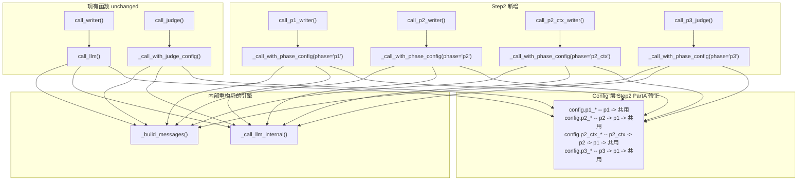

# Step 2 实施方案：config 回退链修正 + api_client 新增 Phase 特定函数

> 基于 [plan_D_layered_outline_incremental_canon.md](plans/plan_D_layered_outline_incremental_canon.md) Step 2
> 版本：v2.0
> 日期：2026-06-19
> 前置依赖：[Step 1](plans/step1_implementation_plan.md) ✅ 已完成

---

## 一、目标

1. **修正 [`core/config.py`](core/config.py:265) 的 Phase 回退链**：P2/P3 未配置时回退到 P1，P1 也未配置才回退到共用配置
2. **在 [`core/api_client.py`](core/api_client.py:83) 新增 Phase 特定的 API 调用函数**：`call_p1_writer` / `call_p2_writer` / `call_p2_ctx_writer` / `call_p3_judge`
3. **内部重构**：提取 `_build_messages()` 和 `_call_llm_internal()`，消除重复代码

---

## 二、现状分析

### 2.1 当前 config.py Phase 属性回退链（Step 1 产物）

| Phase | 属性 | 当前回退链 | 问题 |
|---|---|---|---|
| P1 | `p1_api_key` / `p1_api_base_url` / `p1_model_name` | `p1_*` → 共用 `*` | ✅ 正确 |
| P2 | `p2_api_key` / `p2_api_base_url` / `p2_model_name` | `p2_*` → 共用 `*` | ❌ 缺少 P1 中间层 |
| P2_CTX | `p2_ctx_api_key` / `p2_ctx_api_base_url` / `p2_ctx_model_name` | `p2_ctx_*` → `p2_*` → 共用 `*` | ❌ 缺少 P1 中间层 |
| P3 | `p3_api_key` / `p3_api_base_url` / `p3_model_name` | `p3_*` → 共用 `*` | ❌ 缺少 P1 中间层 |

### 2.2 目标回退链

```
P1:     p1_*       → 共用_*
P2:     p2_*       → p1_*      → 共用_*
P2_CTX: p2_ctx_*   → p2_*      → p1_*      → 共用_*
P3:     p3_*       → p1_*      → 共用_*
```

**设计意图**：Phase 1 是基础构建入口，用户通常只配置 Phase 1。如果 P2/P3 未独立配置，优先复用 P1 的配置（大概率也是免费模型），只在 P1 也未配置时才回退到共用配置。

### 2.3 当前 api_client.py 架构

```
call_llm(prompt, system, max_tokens, ...)          ← 250 行的巨石函数
  ├─ 内联: 加载 config → 取 api_key/base/model
  ├─ 内联: 构建 messages（含 system role 黑名单逻辑）
  └─ 内联: HTTP 重试循环（速率限制、超时、错误处理）

call_writer(prompt, system, ...)                    ← 薄封装 → call_llm
call_judge(prompt, system, ...)                     ← 薄封装 → _call_with_judge_config 或 call_llm
_call_with_judge_config(prompt, system, ...)        ← 68 行，独立重试循环（与 call_llm 部分重复）
```

### 2.4 全项目调用方（46 处引用，Step 2 均无需修改）

| 调用函数 | 引用模块 | 数量 |
|---|---|---|
| `call_writer` | `foundation/gen_world.py`, `foundation/gen_characters.py`, `foundation/gen_outline.py`, `foundation/gen_outline_part2.py`, `foundation/gen_canon.py`, `foundation/gen_voice.py`, `drafting/draft_chapter.py`, `revision/gen_revision.py`, `export/build_arc_summary.py`, `export/build_outline.py`, `seed.py`, `novel_app.py` | ~25 处 |
| `call_judge` | `evaluation/evaluate.py`, `foundation/gen_voice.py`, `revision/adversarial_edit.py`, `revision/compare_chapters.py`, `revision/reader_panel.py`, `revision/review.py` | ~15 处 |
| `call_llm` | `pipeline_orchestrator.py` | ~6 处 |

**Step 2 仅做增量/修正**，所有现有调用方行为完全不变。

---

## 三、涉及文件

| 文件 | 操作 | 说明 |
|---|---|---|
| [`core/config.py`](core/config.py:265) | **修改** | 修正 P2/P3/P2_CTX 共 9 个 property 的回退链 |
| [`core/api_client.py`](core/api_client.py:83) | **修改** | 提取 2 个私有函数 + 新增 5 个函数 + 重构 2 个现有函数 |

**共 2 个文件修改。其他文件零改动。**

---

## 四、详细修改 — Part A：`core/config.py` 回退链修正

### 4.1 修改范围

修改 3 组共 9 个 property，在回退链中插入 `p1_*` 中间层。

#### 4.1.1 P2 属性（3 个）— `p2_* → p1_* → 共用_*`

**位置**：[`core/config.py`](core/config.py:265) lines 265–275

**修改前**：
```python
# --- Phase 2: 章节起草 ---

@property
def p2_api_key(self) -> str:
    return self._data.get("p2_api_key") or self.api_key

@property
def p2_api_base_url(self) -> str:
    return self._data.get("p2_api_base_url") or self.api_base_url

@property
def p2_model_name(self) -> str:
    return self._data.get("p2_model_name") or self.model_name
```

**修改后**：
```python
# --- Phase 2: 章节起草 ---
# 回退链: p2_* → p1_* → 共用_*

@property
def p2_api_key(self) -> str:
    return self._data.get("p2_api_key") or self._data.get("p1_api_key") or self.api_key

@property
def p2_api_base_url(self) -> str:
    return self._data.get("p2_api_base_url") or self._data.get("p1_api_base_url") or self.api_base_url

@property
def p2_model_name(self) -> str:
    return self._data.get("p2_model_name") or self._data.get("p1_model_name") or self.model_name
```

#### 4.1.2 P2_CTX 属性（3 个）— `p2_ctx_* → p2_* → p1_* → 共用_*`

**位置**：[`core/config.py`](core/config.py:279) lines 279–289

**修改前**：
```python
# --- Phase 2 上下文模型（可选: canon 增量追加等大上下文任务）---

@property
def p2_ctx_api_key(self) -> str:
    return self._data.get("p2_ctx_api_key") or self._data.get("p2_api_key") or self.api_key

@property
def p2_ctx_api_base_url(self) -> str:
    return self._data.get("p2_ctx_api_base_url") or self._data.get("p2_api_base_url") or self.api_base_url

@property
def p2_ctx_model_name(self) -> str:
    return self._data.get("p2_ctx_model_name") or self._data.get("p2_model_name") or self.model_name
```

**修改后**：
```python
# --- Phase 2 上下文模型（可选: canon 增量追加等大上下文任务）---
# 回退链: p2_ctx_* → p2_* → p1_* → 共用_*

@property
def p2_ctx_api_key(self) -> str:
    return (self._data.get("p2_ctx_api_key")
            or self._data.get("p2_api_key")
            or self._data.get("p1_api_key")
            or self.api_key)

@property
def p2_ctx_api_base_url(self) -> str:
    return (self._data.get("p2_ctx_api_base_url")
            or self._data.get("p2_api_base_url")
            or self._data.get("p1_api_base_url")
            or self.api_base_url)

@property
def p2_ctx_model_name(self) -> str:
    return (self._data.get("p2_ctx_model_name")
            or self._data.get("p2_model_name")
            or self._data.get("p1_model_name")
            or self.model_name)
```

#### 4.1.3 P3 属性（3 个）— `p3_* → p1_* → 共用_*`

**位置**：[`core/config.py`](core/config.py:293) lines 293–303

**修改前**：
```python
# --- Phase 3: 修订评估 (对抗编辑/读者评审/全文评估) ---

@property
def p3_api_key(self) -> str:
    return self._data.get("p3_api_key") or self.api_key

@property
def p3_api_base_url(self) -> str:
    return self._data.get("p3_api_base_url") or self.api_base_url

@property
def p3_model_name(self) -> str:
    return self._data.get("p3_model_name") or self.model_name
```

**修改后**：
```python
# --- Phase 3: 修订评估 (对抗编辑/读者评审/全文评估) ---
# 回退链: p3_* → p1_* → 共用_*

@property
def p3_api_key(self) -> str:
    return self._data.get("p3_api_key") or self._data.get("p1_api_key") or self.api_key

@property
def p3_api_base_url(self) -> str:
    return self._data.get("p3_api_base_url") or self._data.get("p1_api_base_url") or self.api_base_url

@property
def p3_model_name(self) -> str:
    return self._data.get("p3_model_name") or self._data.get("p1_model_name") or self.model_name
```

### 4.2 注释更新

同时更新 [`core/config.py`](core/config.py:244) lines 244–247 的注释段，反映新的回退链：

**修改前**：
```python
# ============================================================
# Phase 分离模型配置（方案 D）
# — 每个 Phase 可指定独立的 API Key / Base URL / Model Name
# — 空值自动回退到共用配置（向后兼容）
# — P2_CTX 回退链: p2_ctx → p2 → 共用
# ============================================================
```

**修改后**：
```python
# ============================================================
# Phase 分离模型配置（方案 D）
# — 每个 Phase 可指定独立的 API Key / Base URL / Model Name
# — 回退链:
#   P1:     p1_*     → 共用_*
#   P2:     p2_*     → p1_*      → 共用_*
#   P2_CTX: p2_ctx_* → p2_*      → p1_*      → 共用_*
#   P3:     p3_*     → p1_*      → 共用_*
# — 用户通常只需配置 P1；P2/P3 留空自动复用 Phase 1
# ============================================================
```

---

## 五、详细修改 — Part B：`core/api_client.py` 重构 + 新增

### 5.1 提取 `_build_messages()` — 消息构造器

**位置**：在 `_SYSTEM_ROLE_FAILED_FOR_ENDPOINT` 之后、`call_llm` 之前插入。

**职责**：根据 prompt / system / api_base / model 构建初始 messages 列表，处理已知不支持 system role 的端点。

```python
def _build_messages(
    prompt: str,
    system: Optional[str],
    api_base: str,
    model: str,
) -> list:
    """构建 messages 列表，处理 system role 兼容性。

    如果端点已知不支持 system role，则将 system prompt 合并到 user message 前缀。
    运行时新检测到的不支持端点由 _call_llm_internal 的 400/422 处理逻辑覆盖。
    """
    messages: list = []
    endpoint_key = f"{api_base}|{model}"

    if system and endpoint_key not in _SYSTEM_ROLE_FAILED_FOR_ENDPOINT:
        messages.append({"role": "system", "content": system})
    elif system:
        prompt = f"[系统指令]\n{system}\n\n---\n\n{prompt}"

    messages.append({"role": "user", "content": prompt})
    return messages
```

### 5.2 提取 `_call_llm_internal()` — HTTP 引擎（单一真相来源）

**位置**：在 `_build_messages` 之后插入。

**职责**：封装 HTTP 调用、速率限制、重试、system role 运行时降级、超时/错误处理。从 `call_llm` 中提取 lines 117–258 的核心逻辑。

**签名**：

```python
def _call_llm_internal(
    api_key: str,
    api_base: str,
    model: str,
    prompt: str,
    system: Optional[str],
    messages: list,
    max_tokens: int = 16000,
    temperature: float = 0.8,
    timeout: int = 600,
    retries: int = 3,
    max_total_time: int = None,
) -> str:
```

**关键行为**（从 `call_llm` 原样提取，不改变逻辑）：

1. API Key 检查：空值时抛出 `RuntimeError`
2. 构建 URL / headers / payload
3. 速率限制等待（全局 `RateLimiter` 单例）
4. 重试循环：
   - `max_total_time` 超时检查（在速率等待之前）
   - HTTP 200 → 解析 `choices[0].message.content`，打印日志，返回
   - HTTP 429 → 额外等待 `10 × attempt` 秒，重试
   - HTTP 400/422 → 检测 system role 不支持 → 添加黑名单 → 重建 messages → 重试
   - 其他 HTTP 错误 → 打印日志 → `sleep(5 × attempt)` → 重试
   - `httpx.TimeoutException` → 重试
   - `httpx.RequestError` → `sleep(5 × attempt)` → 重试
5. 全部重试耗尽 → 抛出 `RuntimeError`

**与原 `call_llm` 的唯一差异**：不再从 `config` 读取 API 参数——由调用方传入。这使得 Phase 路由成为可能。

### 5.3 重构 `call_llm()` — 委托到提取的函数

**行为 100% 不变**，但代码从 ~177 行缩减到 ~30 行：

```python
def call_llm(
    prompt: str,
    system: Optional[str] = None,
    max_tokens: int = 16000,
    temperature: float = 0.8,
    timeout: int = 600,
    retries: int = 3,
    max_total_time: int = None,
) -> str:
    """调用 OpenAI Chat Completions 兼容 API。（行为不变）"""
    cfg = config
    cfg.load()

    api_base = cfg.api_base_url.rstrip("/")
    api_key = cfg.api_key
    model = cfg.model_name

    messages = _build_messages(prompt, system, api_base, model)

    return _call_llm_internal(
        api_key=api_key,
        api_base=api_base,
        model=model,
        prompt=prompt,
        system=system,
        messages=messages,
        max_tokens=max_tokens,
        temperature=temperature,
        timeout=timeout,
        retries=retries,
        max_total_time=max_total_time,
    )
```

### 5.4 重构 `_call_with_judge_config()` — 委托到提取的函数

**行为 100% 不变**，但代码从 68 行缩减到 ~30 行，且获得与 `call_llm` 同等的日志和 system role 降级能力：

```python
def _call_with_judge_config(
    prompt: str,
    system: Optional[str] = None,
    max_tokens: int = 4096,
    temperature: float = 0.3,
    retries: int = 3,
    max_total_time: int = None,
    judge_model: str = "",
    judge_base: str = "",
    judge_key: str = "",
) -> str:
    """使用独立的 Judge 配置调用 API（内部函数）。"""
    api_base = judge_base.rstrip("/")
    model = judge_model

    messages = _build_messages(prompt, system, api_base, model)

    return _call_llm_internal(
        api_key=judge_key,
        api_base=api_base,
        model=model,
        prompt=prompt,
        system=system,
        messages=messages,
        max_tokens=max_tokens,
        temperature=temperature,
        timeout=600,
        retries=retries,
        max_total_time=max_total_time,
    )
```

### 5.5 新增 `_call_with_phase_config()` — Phase 路由层

**位置**：在 `call_judge` 之后插入。

**职责**：从 config 按 phase 前缀取 API 参数（自动走 config 回退链），构建 messages，委托到 `_call_llm_internal`。

```python
def _call_with_phase_config(
    phase: str,
    prompt: str,
    system: Optional[str] = None,
    max_tokens: int = 16000,
    temperature: float = 0.8,
    retries: int = 3,
    max_total_time: int = None,
) -> str:
    """按 Phase 选择 API 配置并调用 LLM。

    Args:
        phase: "p1" | "p2" | "p2_ctx" | "p3"
        其他参数同 call_llm。

    回退链由 config 的 Phase 属性自动处理 — 本函数直接 getattr 即可：
        p1:     p1_*     → 共用_*
        p2:     p2_*     → p1_*      → 共用_*
        p2_ctx: p2_ctx_* → p2_*      → p1_*      → 共用_*
        p3:     p3_*     → p1_*      → 共用_*
    """
    cfg = config
    cfg.load()

    api_key = getattr(cfg, f"{phase}_api_key")
    api_base = getattr(cfg, f"{phase}_api_base_url").rstrip("/")
    model = getattr(cfg, f"{phase}_model_name")

    messages = _build_messages(prompt, system, api_base, model)

    return _call_llm_internal(
        api_key=api_key,
        api_base=api_base,
        model=model,
        prompt=prompt,
        system=system,
        messages=messages,
        max_tokens=max_tokens,
        temperature=temperature,
        timeout=600,
        retries=retries,
        max_total_time=max_total_time,
    )
```

### 5.6 新增 4 个 Phase 特定公开函数

**位置**：在 `_call_with_phase_config` 之后、便捷函数分隔线之前插入。

```python
# ============================================================================
# Phase 特定调用函数（方案 D）
# — 回退链由 config 的 Phase 属性自动处理
# — P2/P3 未配置时自动 → P1 → 共用
# ============================================================================


def call_p1_writer(
    prompt: str,
    system: Optional[str] = None,
    max_tokens: int = 16000,
    temperature: float = 0.8,
    retries: int = 3,
    max_total_time: int = None,
) -> str:
    """Phase 1 写作调用 — 使用 AUTONOVEL_P1_* 配置。

    用于: world / characters / outline / canon / voice 生成。
    回退链: p1_* → 共用_*
    """
    return _call_with_phase_config(
        "p1", prompt, system=system, max_tokens=max_tokens,
        temperature=temperature, retries=retries, max_total_time=max_total_time,
    )


def call_p2_writer(
    prompt: str,
    system: Optional[str] = None,
    max_tokens: int = 16000,
    temperature: float = 0.8,
    retries: int = 3,
    max_total_time: int = None,
) -> str:
    """Phase 2 写作调用 — 使用 AUTONOVEL_P2_* 配置。

    用于: 章节起草（需要大上下文窗口）。
    回退链: p2_* → p1_* → 共用_*
    """
    return _call_with_phase_config(
        "p2", prompt, system=system, max_tokens=max_tokens,
        temperature=temperature, retries=retries, max_total_time=max_total_time,
    )


def call_p2_ctx_writer(
    prompt: str,
    system: Optional[str] = None,
    max_tokens: int = 16000,
    temperature: float = 0.8,
    retries: int = 3,
    max_total_time: int = None,
) -> str:
    """Phase 2 大上下文写作调用 — 使用 AUTONOVEL_P2_CTX_* 配置。

    用于: canon 增量追加等大上下文任务。
    回退链: p2_ctx_* → p2_* → p1_* → 共用_*
    """
    return _call_with_phase_config(
        "p2_ctx", prompt, system=system, max_tokens=max_tokens,
        temperature=temperature, retries=retries, max_total_time=max_total_time,
    )


def call_p3_judge(
    prompt: str,
    system: Optional[str] = None,
    max_tokens: int = 4096,
    temperature: float = 0.3,
    retries: int = 3,
    max_total_time: int = None,
) -> str:
    """Phase 3 裁判调用 — 使用 AUTONOVEL_P3_* 配置。

    用于: 对抗编辑、读者评审、全文评估等修订阶段裁判任务。
    回退链: p3_* → p1_* → 共用_*
    """
    return _call_with_phase_config(
        "p3", prompt, system=system, max_tokens=max_tokens,
        temperature=temperature, retries=retries, max_total_time=max_total_time,
    )
```

### 5.7 默认参数汇总

| 函数 | 默认 max_tokens | 默认 temperature | 用途 | 回退链 |
|---|---|---|---|---|
| `call_llm` (不变) | 16000 | 0.8 | 通用 | 共用 |
| `call_writer` (不变) | 16000 | 0.8 | 通用写作 | 共用 |
| `call_judge` (不变) | 4096 | 0.3 | 通用裁判 | 共用/Judge |
| **`call_p1_writer`** | **16000** | **0.8** | Phase 1 写作 | p1 → 共用 |
| **`call_p2_writer`** | **16000** | **0.8** | Phase 2 写作 | p2 → p1 → 共用 |
| **`call_p2_ctx_writer`** | **16000** | **0.8** | Phase 2 大上下文 | p2_ctx → p2 → p1 → 共用 |
| **`call_p3_judge`** | **4096** | **0.3** | Phase 3 裁判 | p3 → p1 → 共用 |

---

## 六、数据流图



---

## 七、回退兼容性验证清单

| 场景 | 预期结果 |
|---|---|
| 所有现有 `call_writer()` / `call_judge()` / `call_llm()` 调用 | Step 2 重构后行为 100% 不变 |
| `.env` 仅填共用 `AUTONOVEL_API_KEY`（无 Phase 分离配置） | P1→共用, P2→共用, P3→共用, 全部正常 |
| `.env` 仅填 P1、留空 P2/P3 | P1 用独立配置；P2→P1→共用；P3→P1→共用 |
| `.env` 填 P1+P2、留空 P3 | P1 独立；P2 独立；P3→P1→共用 |
| `.env` 填 P2_CTX、留空 P2、留空 P1 | P2_CTX→P1→共用（P2 跳过，直接落到 P1） |
| `.env` 三阶段全部独立填写 | 各自使用独立配置，互不干扰 |
| 运行时 system role 不支持（HTTP 400/422） | `_call_llm_internal` 自动降级合并到 user message（黑名单缓存） |
| 速率限制触发（HTTP 429） | `_call_llm_internal` 的全局 `RateLimiter` + 额外等待逻辑不变 |

---

## 八、不需要修改的地方

| 模块 | 原因 |
|---|---|
| [`core/state_manager.py`](core/state_manager.py:84) | 卷级字段已在 Step 1 完成 |
| [`.env`](.env:33) | Phase 配置段已在 Step 1 完成 |
| 所有 46 处现有调用方（foundation/drafting/evaluation/revision/export 等） | 现有 `call_writer` / `call_judge` / `call_llm` 行为完全不变 |
| `_call_with_phase_config` 内部 | 无需硬编码回退链——`getattr(config, f"{phase}_api_key")` 自动走 config property 回退链 |

---

## 九、实施步骤

```
Part A — core/config.py 回退链修正
───────────────────────────────────
Step 2.1a  修正 P2 的 3 个 property: p2_api_key / p2_api_base_url / p2_model_name
           回退链: p2_* → p1_* → 共用_*

Step 2.1b  修正 P2_CTX 的 3 个 property: p2_ctx_api_key / p2_ctx_api_base_url / p2_ctx_model_name
           回退链: p2_ctx_* → p2_* → p1_* → 共用_*

Step 2.1c  修正 P3 的 3 个 property: p3_api_key / p3_api_base_url / p3_model_name
           回退链: p3_* → p1_* → 共用_*

Step 2.1d  更新注释段（lines 244–247），反映新回退链

Part B — core/api_client.py 重构 + 新增
────────────────────────────────────────
Step 2.2   提取 _build_messages(prompt, system, api_base, model) → list
           — 从 call_llm 的 lines 123–133 提取消息构造逻辑

Step 2.3   提取 _call_llm_internal(api_key, api_base, model, messages, ...) → str
           — 从 call_llm 的 lines 117–258 提取 HTTP 重试引擎
           — 保留 system role 运行时降级（400/422）逻辑
           — 参数化 api_key / api_base / model（不再从 config 读取）

Step 2.4   重构 call_llm() 委托到 _build_messages + _call_llm_internal
           — 行为 100% 不变

Step 2.5   重构 _call_with_judge_config() 委托到 _build_messages + _call_llm_internal
           — 行为 100% 不变
           — 同时获得更完善的日志和 system role 降级能力

Step 2.6   新增 _call_with_phase_config(phase, ...)
           — 用 getattr(config, f"{phase}_api_key") 等选配置
           — 回退链由 config 的 Phase property 自动处理

Step 2.7   新增 4 个 Phase 特定函数
           — call_p1_writer / call_p2_writer / call_p2_ctx_writer / call_p3_judge
```

---

## 十、验证命令

```bash
# ===== Part A 验证: config 回退链 =====

# 1. P1 独立填写 → P2/P3 自动回退到 P1
python -c "
from core.config import config; config.load()
# 假设 .env 中仅填了 P1
print(f'P1  model: {config.p1_model_name}')
print(f'P2  model: {config.p2_model_name}')   # 应为 P1 的值
print(f'P3  model: {config.p3_model_name}')   # 应为 P1 的值
print(f'P2C model: {config.p2_ctx_model_name}') # 应为 P1 的值
"

# 2. P2_CTX 留空 → 回退到 P2 → P1 → 共用
python -c "
from core.config import config; config.load()
print(f'p2_ctx key: {config.p2_ctx_api_key}')
print(f'p2_ctx url: {config.p2_ctx_api_base_url}')
print(f'p2_ctx model: {config.p2_ctx_model_name}')
"

# ===== Part B 验证: api_client =====

# 3. 验证现有函数行为不变
python -c "from core.api_client import call_llm, call_writer, call_judge; print('OK')"

# 4. 验证新函数可导入
python -c "
from core.api_client import (
    call_p1_writer, call_p2_writer,
    call_p2_ctx_writer, call_p3_judge,
)
print('4 个 Phase 函数导入 OK')
"

# 5. 验证 _build_messages 消息构造
python -c "
from core.api_client import _build_messages
msgs = _build_messages('测试prompt', '系统指令', 'https://api.test.com/v1', 'test-model')
assert len(msgs) == 2
assert msgs[0]['role'] == 'system'
assert msgs[1]['role'] == 'user'
print('_build_messages: OK')
"

# 6. 完整 import 链 + 回退链验证
python -c "
from core.config import config
from core.api_client import (
    call_llm, call_writer, call_judge,
    call_p1_writer, call_p2_writer, call_p2_ctx_writer, call_p3_judge,
)
config.load()
print(f'共用:   {config.model_name}')
print(f'  P1:   {config.p1_model_name}  (fallback: p1 -> 共用)')
print(f'  P2:   {config.p2_model_name}  (fallback: p2 -> p1 -> 共用)')
print(f'  P2C:  {config.p2_ctx_model_name}  (fallback: p2_ctx -> p2 -> p1 -> 共用)')
print(f'  P3:   {config.p3_model_name}  (fallback: p3 -> p1 -> 共用)')
print('全部 OK')
"