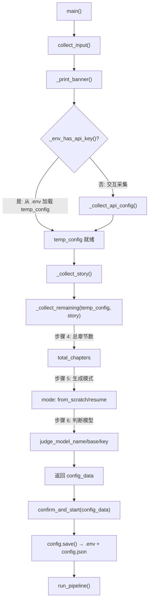
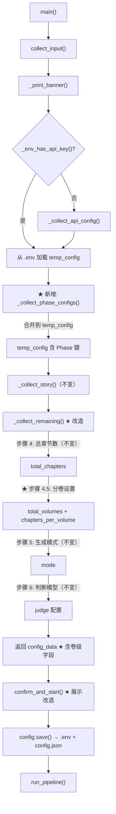
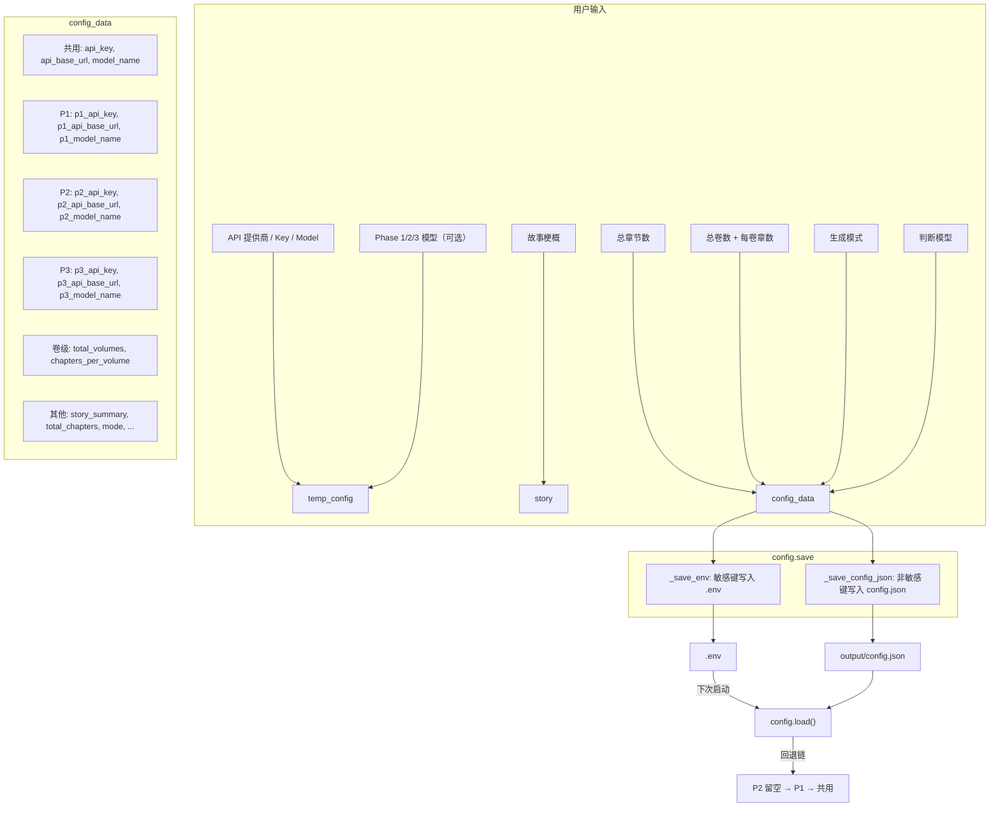

# Step 3 实施方案：novel_app.py UI 改造（卷数 + 每卷章数 + 分阶段模型）

> 基于 [plan_D_layered_outline_incremental_canon.md](plans/plan_D_layered_outline_incremental_canon.md) Step 3
> 版本：v2.0
> 日期：2026-06-19
> 前置依赖：[Step 1](plans/step1_implementation_plan.md) ✅ 已完成 — config/state/.env 基础设施就绪
> 前置依赖：[Step 2](plans/step2_implementation_plan.md) ✅ 已完成 — Phase 回退链修正 + api_client Phase 函数就绪

**⚠ v2.0 修正**：废除 "total_volumes=0 回退原版" 的魔法数字设计。`total_volumes` 最小为 **1**（没有 0 卷的小说），默认 **1**。方案 D 始终启用分层大纲——单卷时一卷含全部章节，生成逻辑仍走新代码路径，功能等价于原版扁平大纲。

---

## 一、目标

在 [`novel_app.py`](novel_app.py:1) 交互式启动入口中新增三项 UI 采集：

1. **分阶段模型配置**（在 API 配置之后、故事梗概之前插入）：
   - Phase 1 基础构建模型（world/characters/outline/canon/voice）
   - Phase 2 章节起草模型（需要大上下文窗口）
   - Phase 3 修订评估模型（对抗编辑/读者评审/全文评估）
   - 全部可选——留空则自动回退到共用写作模型

2. **卷数 + 每卷章数**（在总章节数之后、生成模式之前插入）：
   - 总卷数（**默认 1，最小 1**——没有 0 卷的小说。方案 D 始终走分层大纲路径，单卷时一卷含全部章节）
   - 每卷章数（默认自动 = `total_chapters / total_volumes`，用户可覆盖）
   - 自动验证 `总卷数 × 每卷章数 = 总章节数`，不一致时提示用户修正

3. **配置摘要展示更新**：展示卷级信息 + Phase 独立模型信息

---

## 二、涉及文件

| 文件 | 操作 | 说明 |
|---|---|---|
| [`novel_app.py`](novel_app.py:1) | **修改** | 新增 1 个函数 + 修改 3 个函数 + 更新 docstring |
| [`core/config.py`](core/config.py:210) | **修改** | `total_volumes` 默认值 0 → **1**（方案 D 默认启用分层） |
| **[`plans/step3_implementation_plan.md`](plans/step3_implementation_plan.md:1)** | **新增** | 本文件 |

**共 2 个文件修改。**

---

## 三、当前代码结构分析

### 3.1 当前 `novel_app.py` 采集流程



### 3.2 当前 `_collect_api_config()` 返回结构

```python
temp_config = {
    "api_base_url": "https://...",
    "api_key": "sk-...",
    "model_name": "deepseek-ai/deepseek-v4-flash",
    "provider": "硅基流动 (SiliconFlow)",
    "api_interval_seconds": 4,
}
```

### 3.3 当前 `_collect_remaining()` 返回结构

```python
config_data = {
    **temp_config,
    "story_summary": "...",
    "total_chapters": 24,
    "mode": "from_scratch",
    "started_at": "2026-06-19T...",
    "judge_model_name": "",        # 可选
    "judge_api_base_url": "",      # 可选
    "judge_api_key": "",           # 可选
}
```

### 3.4 Config.save() 写入 .env 的关键逻辑

[`core/config.py`](core/config.py:129) `_save_env()` 遍历 `_SECRET_KEYS`，对 `config_data` 中存在的键调用 `set_key()` 写入 `.env`。**空值不写入**——`.env` 中的现有值不会被清空。

这保证了：用户留空的 Phase 字段不会覆盖 `.env` 中已有的 Phase 配置。

---

## 四、改造后流程



---

## 五、详细修改

### 5.1 修改 1：新增 `_collect_phase_configs()` 函数

**插入位置**：[`novel_app.py`](novel_app.py:304) — 在 `_collect_api_config()` 函数之后（line ~304）、`# ——— 故事梗概采集` 分隔线之前。

**函数名**：`_collect_phase_configs()`

**职责**：采集 Phase 1/2/3 各自的 API Key / Base URL / Model Name。全部可选，留空则后续回退到共用配置。返回 dict，键名为 `_SECRET_KEYS` 对应的内部键名。

**完整代码**：

```python
# ——— 分阶段模型配置采集（方案 D 步骤 3.5） ———

def _collect_phase_configs() -> dict:
    """采集 Phase 1/2/3 各自的模型配置（可选——留空则共用写作模型）。

    返回 dict 的键名与 core/config.py _SECRET_KEYS 一致：
      p1_api_key, p1_api_base_url, p1_model_name,
      p2_api_key, p2_api_base_url, p2_model_name,
      p3_api_key, p3_api_base_url, p3_model_name.
    空值项不会被写入 .env，自动走 config 回退链。
    不采集 P2_CTX（高级选项，用户可手动编辑 .env）。
    """
    _section("3.5. 分阶段模型配置（可选——留空全部字段则共用上述写作模型）:")

    print("   Phase 1 (基础构建): world/characters/outline/canon/voice 生成。")
    print("   Phase 2 (章节起草): 需要大上下文窗口（建议用 1M 上下文模型）。")
    print("   Phase 3 (修订评估): 对抗编辑/读者评审/全文评估。")
    print("   P1 和 P3 建议用免费模型；P2 建议用有大上下文的模型。")
    print()

    # --- Phase 1 ---
    print("   --- Phase 1: 基础构建 ---")
    p1_model = input("   [可选] 模型名称: ").strip()
    p1_key   = input("   [可选] API Key:   ").strip()
    p1_url   = input("   [可选] API 端点:  ").strip()
    print()

    # --- Phase 2 ---
    print("   --- Phase 2: 章节起草 ---")
    p2_model = input("   [可选] 模型名称: ").strip()
    p2_key   = input("   [可选] API Key:   ").strip()
    p2_url   = input("   [可选] API 端点:  ").strip()
    print()

    # --- Phase 3 ---
    print("   --- Phase 3: 修订评估 ---")
    p3_model = input("   [可选] 模型名称: ").strip()
    p3_key   = input("   [可选] API Key:   ").strip()
    p3_url   = input("   [可选] API 端点:  ").strip()
    print()

    return {
        "p1_model_name": p1_model, "p1_api_key": p1_key, "p1_api_base_url": p1_url,
        "p2_model_name": p2_model, "p2_api_key": p2_key, "p2_api_base_url": p2_url,
        "p3_model_name": p3_model, "p3_api_key": p3_key, "p3_api_base_url": p3_url,
    }
```

**设计决策**：

| 决策项 | 结论 | 理由 |
|---|---|---|
| 是否暴露 P2_CTX | **否** | P2_CTX 是高级选项，仅用于 canon 增量追加等大上下文任务。绝大多数场景下 P2 模型已经有大上下文。高级用户可手动编辑 `.env` 添加 |
| 是否区分"从 .env 加载"模式 | **否（总是采集）** | 简化流程。如果用户留空，空值不会被 `config.save()` 写入 `.env`，已有 `.env` 值不受影响 |
| 输入验证 | **不做严格验证** | Phase 配置为可选——用户可能只填模型名不填 Key（共用同一 Key），或留空 URL（共用同一端点）。最终由 `api_client.py` 的 `_call_llm_internal` 做 API Key 非空检查 |

---

### 5.2 修改 2：`_collect_remaining()` 新增步骤 4.5

**文件**：[`novel_app.py`](novel_app.py:421) `_collect_remaining` 函数

**改动位置**：在"步骤 5. 总章节数"（当前 `_section("4. 总章节数...")`）采集完成之后、"步骤 6. 生成模式"（当前 `_section("5. 生成模式...")`）之前，**插入步骤 4.5**。

**改动内容**：

```python
def _collect_remaining(temp_config: dict, story: str) -> dict:
    """采集章节数、卷数、生成模式、判断模型，构建最终配置。"""
    # 4. 总章节数（不变）
    _section("4. 小说总章节数（建议 12–30，默认 24）：")
    ch_input = input("   > ").strip()
    total_chapters = int(ch_input) if ch_input.isdigit() and int(ch_input) > 0 else 24
    print(f"   → 总章节数: {total_chapters}")
    print()

    # ★★★★★ 步骤 4.5: 分卷设置（方案 D 新增）★★★★★
    _section("4.5. 分卷设置:")
    print("   方案 D 始终启用分层大纲。将小说分为若干卷，每卷固定章数。")
    print("   单卷时（默认），一卷包含全部章节，功能等价于原版扁平大纲。")
    print()
    vol_input = input("   总卷数（默认: 1，最少 1）: ").strip()
    total_volumes = int(vol_input) if vol_input.isdigit() and int(vol_input) >= 1 else 1

    print(f"   → 总卷数: {total_volumes}")
    # 默认每卷章数 = 总章节数 / 总卷数（整除，用户可覆盖）
    default_chpv = total_chapters // total_volumes
    chpv_input = input(f"   每卷章节数（默认: {default_chpv}，总计 {total_chapters} 章）: ").strip()
    chapters_per_volume = int(chpv_input) if chpv_input.isdigit() and int(chpv_input) > 0 else default_chpv
    print(f"   → 每卷章数: {chapters_per_volume}")

    # 一致性校验
    expected_ch = total_volumes * chapters_per_volume
    if expected_ch != total_chapters:
        print()
        print(f"   ⚠ 注意: {total_volumes} 卷 × {chapters_per_volume} 章/卷 = {expected_ch} 章")
        print(f"     与当前总章节数 {total_chapters} 不一致。")
        use_expected = input(
            f"     是否将总章节数改为 {expected_ch}？[Y/n]: "
        ).strip().lower()
        if use_expected != "n":
            total_chapters = expected_ch
            print(f"     → 总章节数已更新为: {total_chapters}")
        else:
            print(f"     → 保持总章节数: {total_chapters}（卷间章节数可能不均）")
    print()

    # 5. 生成模式（不变——仅 _section 标题编号微调）
    _section("5. 生成模式：")
    print("   [1] 从头开始生成（完整流水线）")
    print("   [2] 继续上次生成（从 state.json 恢复）")
    print()
    mode_choice = input("   请选择 [1/2] (默认: 1): ").strip()
    mode = "from_scratch" if mode_choice != "2" else "resume"

    if mode == "resume":
        state_file = OUTPUT_DIR / "state.json"
        if not state_file.exists():
            print("   ⚠ 未找到 state.json，将从头开始生成")
            mode = "from_scratch"
        else:
            # 继续模式：从已有 config 读取故事梗概
            cfg = config
            cfg.load()
            story = cfg.story_summary or story

    print(f"   → 模式: {'从头开始' if mode == 'from_scratch' else '继续上次'}")
    print()

    # 6. 判断模型（可选）（不变——仅 _section 标题编号微调）
    _section("6. 判断模型（可选，留空则使用写作模型进行评估）：")
    print("   为避免 AI 自评自夸偏差，可配置独立的高判断力模型。")
    print("   留空全部字段 = 写作模型兼做判断。")
    print()
    judge_model_name = input(
        "   [可选] 判断模型名称（例如 deepseek-ai/DeepSeek-V3）：\n   > "
    ).strip()
    if judge_model_name:
        print(f"   → 判断模型: {judge_model_name}")
    else:
        print(f"   → 判断模型: [共用写作模型]")
    judge_api_base_url = input(
        "   [可选] 判断模型 API 端点（留空则使用上述写作端点）：\n   > "
    ).strip()
    if judge_api_base_url:
        print(f"   → 判断端点: {judge_api_base_url}")
    judge_api_key = input(
        "   [可选] 判断模型 API Key（留空则使用上述写作 Key）：\n   > "
    ).strip()
    if judge_api_key:
        print(f"   → 判断 Key:  已输入")
    print()

    # 构建最终配置
    from datetime import datetime

    config_data = {
        **temp_config,
        "story_summary": story,
        "total_chapters": total_chapters,
        # ★ 方案 D 新增
        "total_volumes": total_volumes,
        "chapters_per_volume": chapters_per_volume,
        "mode": mode,
        "started_at": datetime.now().isoformat(),
        "judge_model_name": judge_model_name,
        "judge_api_base_url": judge_api_base_url,
        "judge_api_key": judge_api_key,
    }

    return config_data
```

**关键设计点**：

| 设计点 | 做法 | 理由 |
|---|---|---|
| 默认总卷数 | **1** | 方案 D 始终走分层大纲。单卷时一卷含全部章节，功能等价原版 |
| 默认每卷章数 | **自动 = total_chapters // total_volumes** | 单卷时 = 全部章节；多卷时 = 整除结果，用户可覆盖 |
| 不一致处理 | 提示并询问，默认自动修正 | 避免用户手动计算错误 |
| 生成模式编号 | Step 5 → 保持 5（不变） | 新增的 4.5 不影响后续编号 |

---

### 5.3 修改 3：`collect_input()` 插入 Phase 采集调用

**文件**：[`novel_app.py`](novel_app.py:495) `collect_input` 函数

**改动**：在 `temp_config` 就绪之后、`story = _collect_story()` 之前，插入 `_collect_phase_configs()` 调用并将有效值合并到 `temp_config`。

**修改前**（lines 495–523）：

```python
def collect_input() -> dict:
    """收集所有用户输入，返回配置字典。"""
    _print_banner()

    # Part 1: API 配置（如果 .env 已有 Key 则跳过）
    if _env_has_api_key():
        cfg = config
        cfg.load()
        temp_config = {
            "api_base_url": cfg.api_base_url,
            "api_key": cfg.api_key,
            "model_name": cfg.model_name,
            "provider": "（.env 已配置）",
            "api_interval_seconds": cfg.api_interval_seconds,
        }
        print(f"  ✅ 检测到 .env 已配置 API Key，跳过连接设置。")
        print(f"     端点: {cfg.api_base_url}")
        print(f"     模型: {cfg.model_name}")
        print()
    else:
        temp_config = _collect_api_config()

    # Part 2: 故事梗概
    story = _collect_story()

    # Part 3: 剩余配置
    config_data = _collect_remaining(temp_config, story)

    return config_data
```

**修改后**：

```python
def collect_input() -> dict:
    """收集所有用户输入，返回配置字典。"""
    _print_banner()

    # Part 1: API 配置（如果 .env 已有 Key 则跳过）
    if _env_has_api_key():
        cfg = config
        cfg.load()
        temp_config = {
            "api_base_url": cfg.api_base_url,
            "api_key": cfg.api_key,
            "model_name": cfg.model_name,
            "provider": "（.env 已配置）",
            "api_interval_seconds": cfg.api_interval_seconds,
        }
        print(f"  ✅ 检测到 .env 已配置 API Key，跳过连接设置。")
        print(f"     端点: {cfg.api_base_url}")
        print(f"     模型: {cfg.model_name}")
        print()
    else:
        temp_config = _collect_api_config()

        # 保存临时配置，以便种子生成可调用 API
        OUTPUT_DIR.mkdir(parents=True, exist_ok=True)
        config.save(temp_config)

    # Part 1.5: 分阶段模型配置（方案 D 新增——全部可选）
    phase_configs = _collect_phase_configs()
    for k, v in phase_configs.items():
        if v:
            temp_config[k] = v

    # Part 2: 故事梗概
    story = _collect_story()

    # Part 3: 剩余配置（含卷数）
    config_data = _collect_remaining(temp_config, story)

    return config_data
```

**注意**：将原来 `_collect_api_config()` 中的 `config.save(temp_config)` 移到了 `_collect_api_config()` 调用之后（仅当走交互采集路径时）。`.env` 已配置 Key 的路径不需要 `config.save()`，因为数据已经来自 `.env`。

实际上仔细看原代码——`_collect_api_config()` 内部已有 `config.save(temp_config)`（line 302），所以不需要额外保存。只需确保 Phase 配置合并到 `temp_config` 后最终会通过 `confirm_and_start` 中的 `config.save(config_data)` 写入 `.env`。

**修正后的代码**：

```python
def collect_input() -> dict:
    """收集所有用户输入，返回配置字典。"""
    _print_banner()

    # Part 1: API 配置（如果 .env 已有 Key 则跳过）
    if _env_has_api_key():
        cfg = config
        cfg.load()
        temp_config = {
            "api_base_url": cfg.api_base_url,
            "api_key": cfg.api_key,
            "model_name": cfg.model_name,
            "provider": "（.env 已配置）",
            "api_interval_seconds": cfg.api_interval_seconds,
        }
        print(f"  ✅ 检测到 .env 已配置 API Key，跳过连接设置。")
        print(f"     端点: {cfg.api_base_url}")
        print(f"     模型: {cfg.model_name}")
        print()
    else:
        temp_config = _collect_api_config()

    # Part 1.5: 分阶段模型配置（方案 D 新增——全部可选）
    phase_configs = _collect_phase_configs()
    for k, v in phase_configs.items():
        if v:
            temp_config[k] = v

    # Part 2: 故事梗概
    story = _collect_story()

    # Part 3: 剩余配置（含卷数）
    config_data = _collect_remaining(temp_config, story)

    return config_data
```

---

### 5.4 修改 4：`confirm_and_start()` 配置摘要更新

**文件**：[`novel_app.py`](novel_app.py:528) `confirm_and_start` 函数

**改动**：在 `配置摘要` 中增加分卷信息和 Phase 模型信息。

**修改前**（lines 528–556）：

```python
def confirm_and_start(config_data: dict):
    """展示配置摘要，确认后启动流水线。"""
    print()
    print("=" * 65)
    print("  配置摘要")
    print("=" * 65)
    print(f"  故事梗概:      {config_data['story_summary'][:60].replace(chr(10), ' ')}...")
    print(f"  总章节数:      {config_data['total_chapters']} 章")
    print(f"  提供商:        {config_data['provider']}")
    print(f"  API 端点:      {config_data['api_base_url']}")
    print(f"  模型:          {config_data['model_name']}")
    judge_display = config_data.get('judge_model_name', '')
    if judge_display:
        print(f"  判断模型:      [独立] {judge_display}")
    else:
        print(f"  判断模型:      [共用写作模型]")
    print(f"  API 间隔:      {config_data['api_interval_seconds']} 秒")
    print(f"  生成模式:      {'从头开始' if config_data['mode'] == 'from_scratch' else '继续上次'}")
    print("=" * 65)
    print()

    confirm = input("  确认以上信息无误？按 Enter 开始生成，输入 q 退出: ").strip()
    if confirm.lower() == "q":
        print("  已取消。")
        sys.exit(0)

    # 保存最终配置
    OUTPUT_DIR.mkdir(parents=True, exist_ok=True)
    config.save(config_data)

    # 保存梗概到独立文件
    story_file = OUTPUT_DIR / "story_summary.txt"
    story_file.write_text(config_data["story_summary"], encoding="utf-8")

    print()
    print("=" * 65)
    print("  🚀 启动流水线 ...")
    print("=" * 65)
    print()

    # 启动流水线
    from pipeline_orchestrator import run_pipeline
    run_pipeline(mode=config_data["mode"])
```

**修改后**：

```python
def confirm_and_start(config_data: dict):
    """展示配置摘要，确认后启动流水线。"""
    print()
    print("=" * 65)
    print("  配置摘要")
    print("=" * 65)
    print(f"  故事梗概:      {config_data['story_summary'][:60].replace(chr(10), ' ')}...")
    print(f"  总章节数:      {config_data['total_chapters']} 章")

    # ★ 方案 D: 分卷信息（始终显示，方案 D 默认启用分层大纲）
    total_vol = config_data.get("total_volumes", 1)
    chpv = config_data.get("chapters_per_volume", 0)
    print(f"  分卷:          {total_vol} 卷 × {chpv} 章/卷")

    print(f"  提供商:        {config_data['provider']}")
    print(f"  API 端点:      {config_data['api_base_url']}")
    print(f"  模型:          {config_data['model_name']}")

    # ★ 方案 D: Phase 独立模型（仅当有独立配置时显示）
    for phase_label, prefix in [("P1 模型", "p1"), ("P2 模型", "p2"), ("P3 模型", "p3")]:
        model_key = f"{prefix}_model_name"
        phase_model = config_data.get(model_key, "")
        if phase_model:
            print(f"  {phase_label}:      [独立] {phase_model}")

    judge_display = config_data.get('judge_model_name', '')
    if judge_display:
        print(f"  判断模型:      [独立] {judge_display}")
    else:
        print(f"  判断模型:      [共用写作模型]")
    print(f"  API 间隔:      {config_data['api_interval_seconds']} 秒")
    print(f"  生成模式:      {'从头开始' if config_data['mode'] == 'from_scratch' else '继续上次'}")
    print("=" * 65)
    print()

    confirm = input("  确认以上信息无误？按 Enter 开始生成，输入 q 退出: ").strip()
    if confirm.lower() == "q":
        print("  已取消。")
        sys.exit(0)

    # 保存最终配置（Phase 敏感键自动写入 .env，卷级非敏感键写入 config.json）
    OUTPUT_DIR.mkdir(parents=True, exist_ok=True)
    config.save(config_data)

    # 保存梗概到独立文件
    story_file = OUTPUT_DIR / "story_summary.txt"
    story_file.write_text(config_data["story_summary"], encoding="utf-8")

    print()
    print("=" * 65)
    print("  🚀 启动流水线 ...")
    print("=" * 65)
    print()

    # 启动流水线
    from pipeline_orchestrator import run_pipeline
    run_pipeline(mode=config_data["mode"])
```

---

### 5.5 修改 5：更新文件顶部 docstring

**文件**：[`novel_app.py`](novel_app.py:1) docstring（lines 1–15）

**修改前**：

```python
#!/usr/bin/env python3
"""
novel_app.py — 中文长篇小说自动生成器 交互式启动入口

用户输入：
  1. API 提供商选择 (NVIDIA / 硅基流动 / DeepSeek / 自定义)
  2. API Key
  3. 模型名称
  4. 故事来源（手动输入 / AI 种子生成 → 挑选）
  5. 总章节数
  6. 生成模式 (从头开始 / 继续上次)
  7. 判断模型（可选，留空则共用写作模型）

然后启动 pipeline_orchestrator.py。
"""
```

**修改后**：

```python
#!/usr/bin/env python3
"""
novel_app.py — 中文长篇小说自动生成器 交互式启动入口

用户输入：
  1. API 提供商选择 (NVIDIA / 硅基流动 / DeepSeek / 自定义)
  2. API Key
  3. 模型名称
  3.5. 分阶段模型配置（方案 D 新增——可选，Phase 1/2/3 各自独立）
  4. 故事来源（手动输入 / AI 种子生成 → 挑选）
  5. 总章节数
  5.5. 分卷设置（方案 D 新增——可选，总卷数 + 每卷章数）
  6. 生成模式 (从头开始 / 继续上次)
  7. 判断模型（可选，留空则共用写作模型）

然后启动 pipeline_orchestrator.py。
"""
```

---

## 六、数据流图



---

## 七、配置写入 .env 详解

### 7.1 写入行为

`config.save(config_data)` 内部 `_save_env()` 遍历 `_SECRET_KEYS` 中的 **全部 25 个键**（共用 4 个 + Judge 3 个 + P1 3 个 + P2 3 个 + P2_CTX 3 个 + P3 3 个），对 `config_data` 中存在且非空的键调用 `set_key()` 写入 `.env`。

### 7.2 场景矩阵

| 用户操作 | config_data 中的 Phase 键 | .env 结果 |
|---|---|---|
| 全部留空 | Phase 键均不存在 | .env Phase 段保持不变（不会写入空值） |
| 仅填 P1 model | `p1_model_name: "meta/llama-3.3-70b-instruct"` | 仅写入 `AUTONOVEL_P1_MODEL_NAME` |
| 填 P1 全 3 项 | `p1_model_name`, `p1_api_key`, `p1_api_base_url` | 写入 3 个 `AUTONOVEL_P1_*` |
| 全部填满 | 9 个 Phase 键 | 写入全部 9 个 `AUTONOVEL_P1_*` / `P2_*` / `P3_*` |

### 7.3 P2_CTX 处理

P2_CTX 不在 UI 中采集。如果用户手动在 `.env` 中填写了 `AUTONOVEL_P2_CTX_*`，`config.load()` 会通过 `_SECRET_KEYS` 加载它们，回退链自动生效。`config.save()` 不会覆盖 `.env` 中已有的 P2_CTX 值（因为 `config_data` 中不存在这些键）。

---

## 八、向后兼容性验证

| 场景 | 预期结果 |
|---|---|
| 老用户默认回车（total_volumes=1, ch_per_vol=24） | `total_volumes=1, chapters_per_volume=24` → 单卷分层大纲，功能等价原版扁平大纲 |
| 老用户 `.env` 仅有 `AUTONOVEL_API_KEY`（无 Phase 配置段） | Phase 采集全部留空 → `.env` 不受影响 → config 回退链生效 |
| 用户在 Phase 采集时填了模型名但留空了 Key 和 URL | `p1_model_name` 写入 `.env`，但 `p1_api_key` 和 `p1_api_base_url` 为空 → 回退到共用 Key/URL |
| 用户输入 `total_volumes=3, chapters_per_volume=10` 而 `total_chapters=24` | 提示不一致（30 vs 24），默认自动修正为 30 |
| `resume` 模式下 `.env` 和 `config.json` 已有完整配置 | `.env` 跳过 API 采集，但 Phase 和卷数 UI 仍展示（可修改） |
| `resume` 模式下用户不修改任何值 | 所有字段从 `.env`/`config.json` 读取，行为与上次一致 |

---

## 九、不需要修改的地方

| 模块 | 原因 |
|---|---|
| [`core/config.py`](core/config.py:36) | 除 `total_volumes` 默认值 0→1 修正外，其余均在 Step 1/2 完成 |
| [`core/api_client.py`](core/api_client.py:83) | Phase 调用函数已在 Step 2 完成 |
| [`core/state_manager.py`](core/state_manager.py:71) | `default_state()` 卷级字段已在 Step 1 完成 |
| [`.env`](.env:27) | Phase 配置段已在 Step 1 完成 |
| [`novel_app.bat`](novel_app.bat:1) | 不改——仅启动 `python novel_app.py` |
| [`pipeline_orchestrator.py`](pipeline_orchestrator.py:57) | 不改——Step 3 仅涉及 UI 层，流水线编排在 Step 7/8 改造 |
| `_collect_story()` | 不改——故事采集逻辑与 Phase/卷数无关 |
| `_generate_and_pick_seed()` | 不改——内部 `call_writer` 不变（种子生成用共用模型，合理） |

---

## 十、实施步骤

```
Part A — 新增 _collect_phase_configs()
────────────────────────────────────────
Step 3.1   在 _collect_api_config() 之后、# ——— 故事梗概采集 之前
           插入 _collect_phase_configs() 函数定义

Part B — 修改 _collect_remaining() 
────────────────────────────────────
Step 3.2   在总章节数采集之后、生成模式之前
           插入「步骤 4.5: 分卷设置」代码块

Step 3.3   在 config_data 构建中新增 total_volumes / chapters_per_volume

Part C — 修改 collect_input()
──────────────────────────────
Step 3.4   在 temp_config 就绪后插入 _collect_phase_configs() 调用
           将有效 Phase 配置合并到 temp_config

Part D — 修改 confirm_and_start()
──────────────────────────────────
Step 3.5   配置摘要中新增分卷信息展示
Step 3.6   配置摘要中新增 Phase 独立模型展示

Part E — 更新 docstring
────────────────────────
Step 3.7   更新文件顶部 docstring

Part F — 验证
─────────────
Step 3.8   运行 python -c "from novel_app import *" 确认导入无异常
Step 3.9   运行 python novel_app.py 交互测试（输入 q 退出而不实际生成）
```

---

## 十一、验证命令

```bash
# 1. 验证所有新增/修改的函数可导入
python -c "
from novel_app import (
    _print_banner, _section, _env_has_api_key,
    _collect_api_config, _collect_phase_configs,
    _collect_story, _collect_remaining,
    collect_input, confirm_and_start, main,
)
print('所有函数导入 OK')
"

# 2. 验证 _collect_phase_configs 返回结构正确
python -c "
# 模拟空输入（无法在非交互环境测试输入，仅验证函数签名和返回结构）
from novel_app import _collect_phase_configs
import inspect
sig = inspect.signature(_collect_phase_configs)
print(f'_collect_phase_configs 签名: {sig}')
# 预期: () -> dict
"

# 3. 验证 config_data 中包含新字段（通过模拟路径）
python -c "
from core.config import config
config.load()
# 验证从 .env 读取的 Phase 属性回退链
print(f'共用 model:     {config.model_name}')
print(f'P1 model:        {config.p1_model_name}')
print(f'P2 model:        {config.p2_model_name}')
print(f'P2_CTX model:    {config.p2_ctx_model_name}')
print(f'P3 model:        {config.p3_model_name}')

# 验证 total_volumes / chapters_per_volume 属性存在
print(f'total_volumes:   {config.total_volumes}')
print(f'chapters_per_volume: {config.chapters_per_volume}')
print('全部 OK')
"

# 4. 验证 config.save 不会覆盖已有的 .env Phase 空段
python -c "
from core.config import config, OUTPUT_DIR, CONFIG_FILE
# 先备份 .env
import shutil
from pathlib import Path
env_bak = Path('.env.bak')
# 正常 import 链验证
print('config.save 写入验证待手动测试')
print('导入链 OK')
"
```

---

## 十二、实施依赖链

```
Step 1 ✅  config + state + .env 基础设施
  └─ Step 2 ✅  config 回退链修正 + api_client Phase 函数
       └─ Step 3 ⬜  novel_app.py UI 改造（本计划）
            └─ Step 4 ⬜  卷级总纲生成器
                 └─ Step 5 ⬜  gen_outline.py 重构
                      └─ Step 6 ⬜  canon + draft_chapter 改造
                           └─ Step 7 ⬜  pipeline Phase 1/2 适配
                                └─ Step 8 ⬜  Phase 3 改造
                                     └─ Step 9 ⬜  evaluate.py 适配
                                          └─ Step 10 ⬜  端到端测试