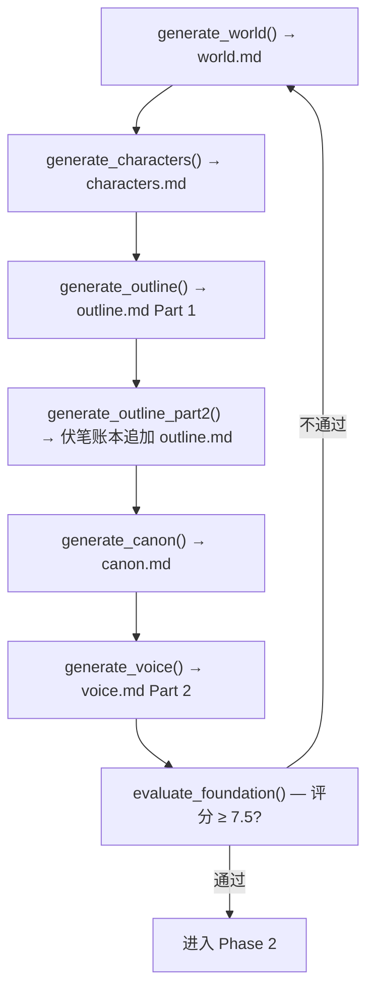
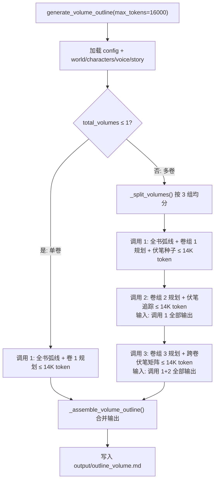
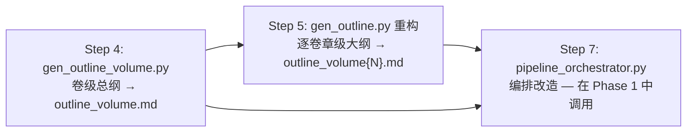

# Step 4 实施方案：卷级总纲生成器（3 次链式调用）

> 基于 [plan_D_layered_outline_incremental_canon.md](plans/plan_D_layered_outline_incremental_canon.md) Step 4
> 版本：v1.0
> 日期：2026-06-19
> 前置依赖：[Step 1](plans/step1_implementation_plan.md) ✅ 已完成 — config/state 基础设施就绪（`total_volumes`、`chapters_per_volume`、Phase 属性）
> 前置依赖：[Step 2](plans/step2_implementation_plan.md) ✅ 已完成 — `call_p1_writer` / `call_p2_writer` / `call_p3_judge` Phase 路由函数就绪
> 前置依赖：[Step 3](plans/step3_implementation_plan.md) ✅ 已完成 — novel_app.py UI 采集卷数+每卷章数就绪

---

## 一、目标

创建 **卷级总纲生成器**，为后续逐卷章级大纲（Step 5）提供顶层约束框架：

1. **新文件** [`foundation/gen_outline_volume.py`](foundation/gen_outline.py:28)：卷级总纲 3 次链式调用生成器
2. **修改文件** [`prompts/outline_prompts.py`](prompts/outline_prompts.py:10)：新增 `VOLUME_OUTLINE_SYSTEM_PROMPT` + 3 个分步 prompt 构建函数
3. **动态适配**：根据 `config.total_volumes` 自适应拆分卷组（不硬编码 10 卷），单卷时仅一次调用即可
4. **输出**：`output/outline_volume.md` — 全书弧线 + 逐卷规划 + 跨卷伏笔矩阵 + 连续性契约

**核心设计**：每次 LLM 输出 ≤ 14000 token（适配 `max_tokens=16000` 的 16000 token 硬限制，预留 2000 token 缓冲供 system prompt + prompt 开销），链式传递前次输出保证全局一致性。

---

## 二、涉及文件

| 文件 | 操作 | 说明 |
|---|---|---|
| [`foundation/gen_outline_volume.py`](foundation/gen_outline.py:28) | **新增** | 卷级总纲生成器主文件 |
| [`prompts/outline_prompts.py`](prompts/outline_prompts.py:10) | **修改** | 新增 1 个 SYSTEM_PROMPT + 3 个 segment prompt 构建函数 |

**共 2 个文件：1 新增 + 1 修改。**

---

## 三、当前代码结构分析

### 3.1 现有 Phase 1 编排流程（pipeline_orchestrator.py lines 57–169）



**Step 4 要在 F6 和 F7 之间插入**：`generate_volume_outline()`（卷级总纲生成 → `outline_volume.md`）。

注意：实际插入位置不在 Step 4 完成——Step 4 只创建 `gen_outline_volume.py` 模块本身。pipeline 编排改造在 **Step 7** 完成。

### 3.2 现有 `foundation/gen_outline.py` 架构（参考复用模式）

[`foundation/gen_outline.py`](foundation/gen_outline.py:28) 的 `generate_outline()` 模式：

```
1. config.load() 获取参数
2. 加载 world.md / characters.md / MYSTERY.md / voice.md
3. 调用 prompts/outline_prompts.py 的 build_outline_prompt() 构建 prompt
4. 调用 call_writer(prompt, system=..., max_tokens=...)
5. 写入 output/outline.md
```

**Step 4 新模块遵循相同模式**，差异在于：使用 `call_p1_writer()` 替代 `call_writer()`，3 次链式调用替代单次调用。

### 3.3 关键依赖确认

| 依赖项 | 来源 | 状态 |
|---|---|---|
| `config.total_volumes` | [`core/config.py:210`](core/config.py:210) | ✅ 默认 1 |
| `config.chapters_per_volume` | [`core/config.py:215`](core/config.py:215) | ✅ 默认 0（使用时需兜底计算） |
| `config.story_summary` | [`core/config.py:188`](core/config.py:188) | ✅ |
| `call_p1_writer()` | [`core/api_client.py:435`](core/api_client.py:435) | ✅ |
| `OUTPUT_DIR` | [`core/config.py:22`](core/config.py:22) | ✅ |
| `step()` | [`core/state_manager.py`](core/state_manager.py:101) | ✅ |

---

## 四、改造后架构



### 卷组拆分逻辑（`_split_volumes()`）

| total_volumes | 调用次数 | 调用 1 卷范围 | 调用 2 卷范围 | 调用 3 卷范围 |
|---|---|---|---|---|
| 1 | **1** | 卷 1 | — | — |
| 2–4 | **2** | 卷 1–⌈N/2⌉ | 卷 ⌈N/2⌉+1–N | — |
| 5–10 | **3** | 卷 1–⌈N/3⌉ | 卷 ⌈N/3⌉+1–min(⌈2N/3⌉, N-1) | 卷 min(⌈2N/3⌉, N-1)+1–N |
| 11+ | **3** | 卷 1–⌈N/3⌉ | 卷 ⌈N/3⌉+1–min(⌈2N/3⌉, N-1) | 卷 min(⌈2N/3⌉, N-1)+1–N |

**设计原则**：total_volumes ≤ 4 时 2 次调用减少延迟和 API 费用；≥ 5 卷时 3 次链式调用分摊 token 预算。确保第三组至少 1 卷（`g2_end ≤ N-1`）。

---

## 五、详细修改

### 5.1 修改 1：`prompts/outline_prompts.py` — 新增卷级总纲 Prompt 构建器

**插入位置**：[`prompts/outline_prompts.py`](prompts/outline_prompts.py:83) 文件末尾。

#### 5.1.1 新增 `VOLUME_OUTLINE_SYSTEM_PROMPT`

```python
# ============================================================
# 方案 D 新增 — 卷级总纲系统 Prompt
# ============================================================

VOLUME_OUTLINE_SYSTEM_PROMPT = """你是一位长篇小说结构架构师，专精于多卷本叙事规划。
你构建的卷级大纲确保：
— 每卷有独立的叙事功能和情感弧线
— 卷间过渡有因果链（非跳跃式）
— 跨卷伏笔有明确的种植→强化→回收路径
— 角色弧线在卷间连续推进，无断层
你的汉语写作简洁直接，不使用 AI 套话。"""
```

> 来源：[`plan_D_layered_outline_incremental_canon.md:260–266`](plans/plan_D_layered_outline_incremental_canon.md:260)

#### 5.1.2 新增 `build_volume_outline_prompt_part1()` — 调用 1

```python
def build_volume_outline_prompt_part1(
    story: str,
    world_text: str,
    characters_text: str,
    voice_text: str,
    vol_start: int,
    vol_end: int,
    total_volumes: int,
    chapters_per_volume: int,
) -> str:
    """构建卷级总纲调用 1 — 全书弧线 + 前 N 卷规划 + 伏笔种子。

    此调用锚定全局弧线框架，后续调用 2/3 将在此框架下逐卷填充。
    """
    return f"""请为一部长篇小说构建卷级总纲的第一部分。

【基本信息】
— 总卷数: {total_volumes}
— 每卷章数: {chapters_per_volume}
— 总章节数: {total_volumes * chapters_per_volume}
— 当前规划范围: 卷 {vol_start}–{vol_end}

【故事梗概】
{story[:3000]}

【世界观设定】
{world_text[:4000]}

【角色注册表】
{characters_text[:4000]}

【文风参考】
{voice_text[:2000]}

【输出要求】

## 一、全书弧线
为全部 {total_volumes} 卷勾画整体叙事弧线：
— 核心冲突及其阶段性演化
— 主角的内在弧线（起点 → 终点，逐卷推进）
— 全局节拍位置（激励事件、中点逆转、一切尽失、高潮）分布在哪些卷
— MICE 商数嵌套结构（Milieu/Inquiry/Character/Event 四种线程的开启和关闭时机）

## 二、逐卷规划（卷 {vol_start}–{vol_end}）
对每一卷，提供：

### 卷 N：[卷标题]
  — **叙事功能:** 本卷在全局弧线中的角色（建立/探索/压力/逆转/终结）
  — **情感弧线:** 卷初情绪状态 → 卷末情绪状态
  — **关键事件:** 本卷必须发生的 3-5 个关键事件
  — **角色移动:** 主角在本卷结束时的内在变化
  — **伏笔种子:** 本卷应埋入的跨卷伏笔（标注种植卷和预期回收卷）
  — **与前卷衔接:** 如何承接上前卷（第一卷写「无」）

## 三、伏笔种子清单
列出前 {vol_end - vol_start + 1} 卷中种植的全部跨卷伏笔：
| 编号 | 伏笔内容 | 种植卷 | 预期回收卷 | 类型 |

至少 {max(5, (vol_end - vol_start + 1) * 3)} 条伏笔种子。类型包括：物品、对话、行动、象征、结构。

【写作规则】
1. 只规划卷 {vol_start}–{vol_end} 的详细内容，其余卷仅在全书中弧线中概述
2. 卷间过渡必须有因果链——不能跳跃
3. 伏笔种子必须标记预期回收卷，种植→回收间距 ≥ 1 卷
4. 汉语简洁直接，不做文学批评式分析"""
```

#### 5.1.3 新增 `build_volume_outline_prompt_part2()` — 调用 2

```python
def build_volume_outline_prompt_part2(
    vol_start: int,
    vol_end: int,
    total_volumes: int,
    chapters_per_volume: int,
    prior_output: str,
) -> str:
    """构建卷级总纲调用 2 — 中段卷规划 + 伏笔追踪。

    Args:
        prior_output: 调用 1 的全部输出（含全书弧线和前组卷的逐卷规划）。
    """
    return f"""请继续卷级总纲的第二部分。

【基本信息】
— 总卷数: {total_volumes}
— 每卷章数: {chapters_per_volume}
— 当前规划范围: 卷 {vol_start}–{vol_end}

【已完成的前段规划（全文——不可修改）】
{prior_output}

【输出要求】

## 逐卷规划（卷 {vol_start}–{vol_end}）

对每一卷，提供（格式同第一部分）：

### 卷 N：[卷标题]
  — **叙事功能:** 本卷在全局弧线中的角色
  — **情感弧线:** 卷初情绪状态 → 卷末情绪状态
  — **关键事件:** 本卷必须发生的 3-5 个关键事件
  — **角色移动:** 主角在本卷结束时的内在变化
  — **伏笔种子:** 本卷应埋入的跨卷伏笔（标注种植卷和预期回收卷）
  — **伏笔回收:** 本卷应回收的前文伏笔（从已有伏笔种子清单中选取）
  — **与前卷衔接:** 如何承接卷 {vol_start - 1} 的结尾

## 伏笔追踪更新
— 新增伏笔种子（本卷组种植的）
— 已有伏笔的状态更新（强化/部分回收/保持）

【写作规则】
1. 保持与已完成规划的严格连续性——角色状态、伏笔线索不能断裂
2. 每个关键事件必须有明确的原因和前文铺垫
3. 汉语简洁直接"""
```

#### 5.1.4 新增 `build_volume_outline_prompt_part3()` — 调用 3

```python
def build_volume_outline_prompt_part3(
    vol_start: int,
    vol_end: int,
    total_volumes: int,
    chapters_per_volume: int,
    prior_output: str,
) -> str:
    """构建卷级总纲调用 3 — 末段卷规划 + 跨卷伏笔矩阵 + 连续性契约。

    Args:
        prior_output: 调用 1+2 的全部输出。
    """
    return f"""请完成卷级总纲的第三部分（最后一部分）。

【基本信息】
— 总卷数: {total_volumes}
— 每卷章数: {chapters_per_volume}
— 当前规划范围: 卷 {vol_start}–{vol_end}（最后 {vol_end - vol_start + 1} 卷）

【已完成的前中段规划（全文——不可修改）】
{prior_output}

【输出要求】

## 一、逐卷规划（卷 {vol_start}–{vol_end}）

对每一卷，提供（格式同前）：

### 卷 N：[卷标题]
  — **叙事功能:** 本卷在全局弧线中的角色
  — **情感弧线:** 卷初情绪状态 → 卷末情绪状态
  — **关键事件:** 本卷必须发生的 3-5 个关键事件
  — **角色移动:** 主角在本卷结束时的内在变化
  — **伏笔种子:** 本卷应埋入的伏笔（如有）
  — **伏笔回收:** 本卷应回收的前文伏笔（尤其是跨卷大伏笔的最终回收）
  — **与前卷衔接:** 如何承接

## 二、跨卷伏笔矩阵（全部 {total_volumes} 卷）

完整追踪所有跨卷伏笔的完整生命周期：

| 编号 | 伏笔内容 | 种植卷 | 强化卷 | 回收卷 | 类型 | 回收方式 |
|---|---|---|---|---|---|---|
| ... | ... | ... | ... | ... | ... | ... |

每条伏笔必须有明确的种植→强化→回收完整路径。
最终卷必须完成所有重要伏笔的回收（允许留 1-2 条用于续作）。

## 三、连续性契约

逐卷检查卷间连接点的连续性：
— 卷 {n} 末章 → 卷 {n+1} 首章的角色位置、持有物品、当前目标必须一致
— 列出全部 {total_volumes - 1} 个卷间过渡的连续性快照

【写作规则】
1. 严格保持与已完成规划的连续性
2. 伏笔矩阵必须覆盖全部 {total_volumes} 卷
3. 连续性契约确保编排时无「跳跃」——角色不能从卷 N 末的 A 地瞬间到卷 N+1 首的 B 地（除非已交代过渡）
4. 汉语简洁直接"""
```

#### 5.1.5 新增单卷精简版 prompt

```python
def build_volume_outline_prompt_single(
    story: str,
    world_text: str,
    characters_text: str,
    voice_text: str,
    total_chapters: int,
) -> str:
    """构建单卷卷级总纲 prompt（total_volumes=1 时使用，一次调用即可）。"""
    return f"""请为一部长篇小说构建卷级总纲。

【基本信息】
— 总卷数: 1
— 总章节数: {total_chapters}

【故事梗概】
{story[:3000]}

【世界观设定】
{world_text[:5000]}

【角色注册表】
{characters_text[:5000]}

【文风参考】
{voice_text[:2000]}

【输出要求】

## 一、全书弧线
描述核心冲突的完整演化、主角内在弧线（起点→终点）、关键节拍位置（激励事件、中点逆转、一切尽失、高潮）。

## 二、卷 1 规划
  — **叙事功能:** 承载全部弧线
  — **情感弧线:** 卷初 → 卷末
  — **关键事件:** 8-12 个关键事件分布
  — **角色移动:** 主角的完整内在变化轨迹
  — **伏笔设计:** 卷内伏笔的种植与回收分布

## 三、伏笔清单
至少 10 条伏笔线索，标注种植章和回收章范围。

【写作规则】
汉语简洁直接，不使用 AI 套话。"""
```

---

### 5.2 修改 2：`foundation/gen_outline_volume.py` — 新增卷级总纲生成器

**文件路径**：`foundation/gen_outline_volume.py`（新文件）

#### 5.2.1 文件头 + 导入 + 系统 prompt

```python
#!/usr/bin/env python3
"""
foundation/gen_outline_volume.py — 卷级总纲生成器（方案 D Step 4）

为分层大纲提供顶层约束框架：
— 全书弧线（global arc）
— 逐卷规划（per-volume narrative function + key events + character movement）
— 跨卷伏笔矩阵（plant → reinforce → payoff lifecycle）
— 连续性契约（volume-to-volume transition snapshots）

支持单卷/多卷自适应拆分为 1–3 次链式 LLM 调用，每次 ≤ 14000 token。
链式传递前次输出保证全局一致性。

输出: output/outline_volume.md
"""

import sys
from pathlib import Path

from core.config import config, OUTPUT_DIR
from core.api_client import call_p1_writer
from core.state_manager import step
from prompts.outline_prompts import (
    VOLUME_OUTLINE_SYSTEM_PROMPT,
    build_volume_outline_prompt_part1,
    build_volume_outline_prompt_part2,
    build_volume_outline_prompt_part3,
    build_volume_outline_prompt_single,
)
```

#### 5.2.2 `_load_context()` — 加载上下文

```python
def _load_context() -> dict:
    """加载生成卷级总纲所需的全部上下文。"""
    cfg = config
    cfg.load()

    world_path = OUTPUT_DIR / "world.md"
    world = world_path.read_text(encoding="utf-8") if world_path.exists() else ""

    chars_path = OUTPUT_DIR / "characters.md"
    chars = chars_path.read_text(encoding="utf-8") if chars_path.exists() else ""

    voice_path = OUTPUT_DIR / "voice.md"
    voice = voice_path.read_text(encoding="utf-8") if voice_path.exists() else ""

    return {
        "story": cfg.story_summary,
        "world": world,
        "characters": chars,
        "voice": voice,
        "total_volumes": cfg.total_volumes,
        "chapters_per_volume": cfg.chapters_per_volume or max(1, cfg.total_chapters // max(1, cfg.total_volumes)),
        "total_chapters": cfg.total_chapters,
    }
```

**关于 `chapters_per_volume` 兜底**：当 `config.chapters_per_volume` 为 0（用户未设置）时，自动计算 `total_chapters / total_volumes` 取整。此逻辑与 Step 3 UI 中的默认值逻辑一致。

#### 5.2.3 `_split_volumes()` — 动态卷组拆分

```python
def _split_volumes(total_vol: int) -> list[tuple[int, int]]:
    """将 total_vol 卷拆分为 1–3 个组，每组 (start_vol, end_vol)。

    拆分策略:
      — 1 卷: 1 组 → [(1, 1)]
      — 2–3 卷: 2 组 → 前 ⌈N/2⌉ 卷 + 剩余
      — 4+ 卷: 3 组 → 均匀三等分

    Returns:
        [(start_vol, end_vol), ...]  按调用顺序排列
    """
    if total_vol <= 1:
        return [(1, 1)]

    if total_vol <= 3:
        mid = (total_vol + 1) // 2  # ⌈N/2⌉
        return [(1, mid), (mid + 1, total_vol)]

    # 三等分
    chunk = (total_vol + 2) // 3  # ⌈N/3⌉
    g1_end = chunk
    g2_end = chunk * 2
    return [
        (1, g1_end),
        (g1_end + 1, min(g2_end, total_vol)),
        (min(g2_end + 1, total_vol), total_vol),
    ]
```

#### 5.2.4 `_call_volume_segment()` — 单次调用包装

```python
def _call_volume_segment(
    segment_index: int,      # 0-based
    total_segments: int,
    prior_outputs: str,      # 前面所有调用的输出拼接
    ctx: dict,
    vol_start: int,
    vol_end: int,
    max_tokens: int,
) -> str:
    """执行一次卷级总纲 LLM 调用。

    segment_index=0 → part1 prompt
    segment_index=1 → part2 prompt（接收 part1 输出）
    segment_index=2 → part3 prompt（接收 part1+2 输出）
    """
    if total_segments == 1:
        # 单卷模式
        prompt = build_volume_outline_prompt_single(
            story=ctx["story"],
            world_text=ctx["world"],
            characters_text=ctx["characters"],
            voice_text=ctx["voice"],
            total_chapters=ctx["total_chapters"],
        )
        label = "卷级总纲（单卷）"
    elif segment_index == 0:
        prompt = build_volume_outline_prompt_part1(
            story=ctx["story"],
            world_text=ctx["world"],
            characters_text=ctx["characters"],
            voice_text=ctx["voice"],
            vol_start=vol_start,
            vol_end=vol_end,
            total_volumes=ctx["total_volumes"],
            chapters_per_volume=ctx["chapters_per_volume"],
        )
        label = f"卷级总纲 调用 {segment_index + 1}/{total_segments}: 卷 {vol_start}–{vol_end}"
    elif segment_index == 1:
        prompt = build_volume_outline_prompt_part2(
            vol_start=vol_start,
            vol_end=vol_end,
            total_volumes=ctx["total_volumes"],
            chapters_per_volume=ctx["chapters_per_volume"],
            prior_output=prior_outputs,
        )
        label = f"卷级总纲 调用 {segment_index + 1}/{total_segments}: 卷 {vol_start}–{vol_end}"
    else:  # segment_index == 2
        prompt = build_volume_outline_prompt_part3(
            vol_start=vol_start,
            vol_end=vol_end,
            total_volumes=ctx["total_volumes"],
            chapters_per_volume=ctx["chapters_per_volume"],
            prior_output=prior_outputs,
        )
        label = f"卷级总纲 调用 {segment_index + 1}/{total_segments}: 卷 {vol_start}–{vol_end}"

    step(f"调用 LLM — {label} ...")
    result = call_p1_writer(
        prompt,
        system=VOLUME_OUTLINE_SYSTEM_PROMPT,
        max_tokens=max_tokens,
        temperature=0.7,   # 结构规划需要比创造性写作略低的温度
        max_total_time=600,
    )
    step(f"{label} 完成 ({len(result)} chars)")
    return result
```

**温度设定 0.7 的理由**：卷级大纲是结构规划任务，相比章节起草（温度 0.8）需要更稳定的输出，但也不宜太低（过低会导致过于死板的结构）。

#### 5.2.5 `generate_volume_outline()` — 主入口

```python
def generate_volume_outline(max_tokens: int = 14000) -> None:
    """生成卷级总纲 → output/outline_volume.md。

    根据 total_volumes 自适应拆分为 1–3 次链式 LLM 调用。
    每次调用 ≤ max_tokens（默认 14000，适配 16000 硬限制）。
    """
    ctx = _load_context()
    total_vol = ctx["total_volumes"]

    step(f"卷级总纲: {total_vol} 卷, 每卷 {ctx['chapters_per_volume']} 章, "
         f"共 {ctx['total_chapters']} 章")

    groups = _split_volumes(total_vol)
    total_segments = len(groups)

    outputs: list[str] = []
    prior = ""

    for i, (vol_start, vol_end) in enumerate(groups):
        result = _call_volume_segment(
            segment_index=i,
            total_segments=total_segments,
            prior_outputs=prior,
            ctx=ctx,
            vol_start=vol_start,
            vol_end=vol_end,
            max_tokens=max_tokens,
        )
        outputs.append(result)
        prior = "\n\n---\n\n".join(outputs)

    full_outline = _assemble_volume_outline(outputs, total_vol)
    outline_path = OUTPUT_DIR / "outline_volume.md"
    outline_path.write_text(full_outline, encoding="utf-8")
    step(f"卷级总纲已保存: {outline_path} ({len(full_outline)} chars)")


def _assemble_volume_outline(outputs: list[str], total_vol: int) -> str:
    """合并多次调用的输出为单一 outline_volume.md。

    当多次调用产出独立的「全书弧线」+「逐卷规划」+「伏笔矩阵」段落时，
    去重全书弧线（仅保留第一次调用的），拼接逐卷规划和伏笔部分。

    单次调用（total_vol=1）直接返回原文，不做处理。
    """
    if len(outputs) == 1:
        return outputs[0]

    # 多段合并：用分隔线标记各次调用的边界
    parts = []
    for i, out in enumerate(outputs):
        header = f"\n\n{'=' * 60}\n## 卷级总纲 — 第 {i + 1}/{len(outputs)} 部分\n{'=' * 60}\n\n"
        parts.append(header + out)

    return "\n".join(parts)


if __name__ == "__main__":
    generate_volume_outline()
```

---

## 六、设计决策说明

| 决策项 | 结论 | 理由 |
|---|---|---|
| **温度** | `0.7` | 结构规划任务需要稳定输出，但 0.3（裁判温度）过僵。0.7 在创造性和一致性间平衡 |
| **max_tokens 默认** | `14000` | `16000` 硬限制预留 2000 token 缓冲给 system prompt + user prompt 的 token 开销 |
| **单卷处理** | 仅 1 次调用，专用 prompt | 单卷时链式调用无意义且浪费 API 调用。专用 prompt 结构更紧凑 |
| **卷组拆分下限** | 2–3 卷时 2 组、4+ 卷时 3 组 | 2 卷时 3 次调用就是浪费中段调用；3 卷时前 2 + 后 1 最佳 |
| **`call_p1_writer` vs `call_writer`** | `call_p1_writer` | 卷级总纲属于 Phase 1 基础构建，使用 Phase 1 专用模型配置 |
| **prompt 截断策略** | story 3000 字 / world 4000 字 / chars 4000 字 / voice 2000 字 | 总上下文约 13000 字，保留足够空间给实际输出内容 |
| **输出后处理** | 简单合并 + 分隔线 | 不做 AI 级"去重全书弧线"（不可靠），留给人或 Step 5 的下游使用方自行处理 |
| **`if __name__ == "__main__"` 入口** | 保留 | 支持独立运行和测试，遵循项目惯例 |

---

## 七、与后续 Step 的关系



- **Step 5** 依赖 Step 4 的 `outline_volume.md` 作为各卷章级大纲的顶层约束
- **Step 7** 在 `run_foundation()` 中调用 `generate_volume_outline()`，位于现有 `generate_voice()` 之后、`evaluate_foundation()` 之前
- Step 4 仅创建模块本身，不修改 pipeline——pipeline 编排在 Step 7 统一完成

---

## 八、验证清单

| 验证项 | 方法 |
|---|---|
| `total_volumes=1` 单卷模式 | `python -c "from foundation.gen_outline_volume import generate_volume_outline; generate_volume_outline()"` |
| `total_volumes=3` 两段模式 | 修改 `config.total_volumes` 后运行，检查 2 次调用、输出合并 |
| `total_volumes=6` 三段模式 | 检查 3 次链式调用、prior 正确传递 |
| `total_volumes=10` 三等分 | 检查 3+4+3 或 4+3+3 拆分 |
| API Key 未配置时有明确报错 | 运行前清空 .env 中 P1 配置 |
| 输出文件 `outline_volume.md` 存在且非空 | 检查文件大小 > 1000 chars |
| `if __name__ == "__main__"` 可独立运行 | `python foundation/gen_outline_volume.py`（需先有 world.md 等上下文） |