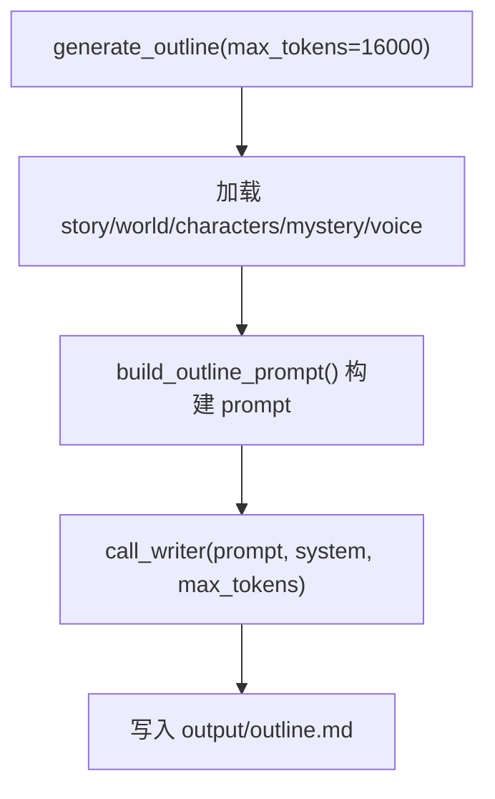
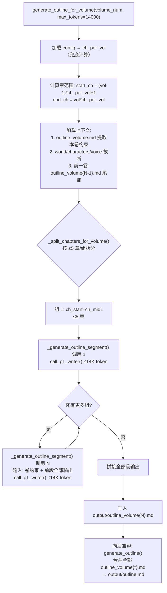

# Step 5 实施方案：gen_outline.py 重构为按卷生成章级大纲

> 基于 [plan_D_layered_outline_incremental_canon.md](plans/plan_D_layered_outline_incremental_canon.md) Step 5
> 版本：v1.0
> 日期：2026-06-19
> 前置依赖：[Step 1](plans/step1_implementation_plan.md) ✅ 已完成 — config/state 基础设施就绪（`total_volumes`、`chapters_per_volume`）
> 前置依赖：[Step 2](plans/step2_implementation_plan.md) ✅ 已完成 — `call_p1_writer` Phase 路由函数就绪
> 前置依赖：[Step 3](plans/step3_implementation_plan.md) ✅ 已完成 — novel_app.py UI 采集卷数+每卷章数就绪
> 前置依赖：[Step 4](plans/step4_implementation_plan.md) ✅ 已完成 — [`foundation/gen_outline_volume.py`](foundation/gen_outline_volume.py:194) 卷级总纲生成器 + `VOLUME_OUTLINE_SYSTEM_PROMPT` + 4 个 prompt 构建器

---

## 一、目标

将 [`foundation/gen_outline.py`](foundation/gen_outline.py:28) 从「一次调用生成全书扁平大纲」重构为「**逐卷、分段链式调用生成章级大纲**」：

1. **修改文件** [`foundation/gen_outline.py`](foundation/gen_outline.py:28)：保留原 `generate_outline()` 向后兼容，新增 `generate_outline_for_volume(volume_num)` 按卷生成
2. **修改文件** [`prompts/outline_prompts.py`](prompts/outline_prompts.py:315)：新增 `CHAPTER_OUTLINE_SYSTEM_PROMPT` + `build_chapter_outline_for_volume_prompt()` 章级大纲 prompt 构建器
3. **动态适配**：根据 `config.chapters_per_volume` 自适应拆分章组（每 ≤5 章一次 LLM 调用），链式传递前段保证卷内连贯
4. **输出**：`output/outline_volume{N}.md` — 每卷独立的章级大纲文件，同时保留 `output/outline.md` 向后兼容

**核心设计**：每次 LLM 输出 ≤ 14000 token（适配 `max_tokens=16000` 硬限制，预留 2000 token 缓冲）。卷级总纲（[`outline_volume.md`](output/outline.md)）提供顶层约束，前一卷章级大纲提供跨卷衔接上下文。

---

## 二、涉及文件

| 文件 | 操作 | 说明 |
|---|---|---|
| [`core/config.py`](core/config.py:215) | **修改** | ★ 前置修正：`chapters_per_volume` 默认值从 0 改为 auto-computed（`total_chapters // total_volumes`，最小 1） |
| [`foundation/gen_outline.py`](foundation/gen_outline.py:28) | **修改** | 新增 `generate_outline_for_volume()` + `_extract_volume_section()` + `_generate_outline_segment()` + `_split_chapters_for_volume()`；去除 `if not ch_per_vol` 兜底计算 |
| [`prompts/outline_prompts.py`](prompts/outline_prompts.py:315) | **修改** | 新增 `CHAPTER_OUTLINE_SYSTEM_PROMPT` + `build_chapter_outline_for_volume_prompt()` |

**共 3 个文件修改。**

### ★ 前置修正：`core/config.py` — `chapters_per_volume` 默认值修正

**问题**：当前 [`core/config.py:215`](core/config.py:215) 的默认值是 `0`——没有哪部小说每卷 0 章。这迫使所有调用方都要写 `if not ch_per_vol:` 兜底计算，代码冗余且有隐患。

**修正**：将 property 改为自动计算——

```python
@property
def chapters_per_volume(self) -> int:
    """每卷章节数。未配置时自动 = total_chapters // total_volumes，最小 1。"""
    val = self._data.get("chapters_per_volume", 0)
    if val > 0:
        return val
    # 自动计算（与 novel_app.py UI 默认逻辑一致）
    return max(1, self.total_chapters // max(1, self.total_volumes))
```

**效果**：
| 场景 | total_chapters | total_volumes | 返回 |
|---|---|---|---|
| 用户配置了 | 任意 | 任意 | 用户值 |
| 默认（单卷） | 24 | 1 | 24 |
| 默认（多卷） | 30 | 3 | 10 |
| 极端情况 | 10 | 20 | 1（保底） |

> 这与 Step 3 [`novel_app.py`](novel_app.py) 中「每卷章数默认 = total_chapters / total_volumes」的 UI 逻辑完全一致。config 侧修改后，所有 `gen_outline_volume.py` / `gen_outline.py` / 后续调用方都可以直接使用，无需各自兜底。

---

## 三、当前代码结构分析

### 3.1 现有 `foundation/gen_outline.py` 架构



**关键特征**：单次 LLM 调用，使用共用模型 `call_writer()`，写入单一文件 `outline.md`。

### 3.2 Step 4 产出的参考模式（`gen_outline_volume.py`）

[`foundation/gen_outline_volume.py`](foundation/gen_outline_volume.py:194) 的 `generate_volume_outline()` 为 Step 5 提供了可直接复用的设计模式：

```
1. _load_context()        → 加载 config + world/characters/voice/story
2. _split_volumes(N)      → 自适应拆分为 1–3 组
3. _call_volume_segment() → 每次调用选对应 prompt builder → call_p1_writer()
4. _assemble_volume_outline() → 合并多次输出
5. 写入 output/outline_volume.md
```

**Step 5 遵循相同模式**，差异在于：
- 拆分维度从「卷组」变为「章组」（每 ≤5 章一组）
- 链式上下文包含：卷级总纲对应卷约束 + 前一卷章级大纲尾部 + 前段章级大纲
- 输出为 `outline_volume{N}.md`

### 3.3 关键依赖确认

| 依赖项 | 来源 | 状态 |
|---|---|---|
| `config.total_volumes` | [`core/config.py:210`](core/config.py:210) | ✅ 默认 1 |
| `config.chapters_per_volume` | [`core/config.py:215`](core/config.py:215) | ✅ 默认 = `total_chapters // total_volumes`（最小 1）— 已在 Step 1 修正 |
| `config.story_summary` | [`core/config.py:188`](core/config.py:188) | ✅ |
| `call_p1_writer()` | [`core/api_client.py:435`](core/api_client.py:435) | ✅ |
| `OUTPUT_DIR` | [`core/config.py:22`](core/config.py:22) | ✅ |
| `step()` | [`core/state_manager.py:101`](core/state_manager.py:101) | ✅ |
| `outline_volume.md` | Step 4 产出 | ✅ 已由 `generate_volume_outline()` 生成 |
| `VOLUME_OUTLINE_SYSTEM_PROMPT` | [`prompts/outline_prompts.py:90`](prompts/outline_prompts.py:90) | ✅ |

### 3.4 大纲消费者接口分析

当前代码中读取 `outline.md` 的位置：

| 消费者 | 文件 | 行号 | 用途 |
|---|---|---|---|
| 章节草拟 | [`drafting/draft_chapter.py:71`](drafting/draft_chapter.py:71) | 71 | `extract_chapter_outline()` 提取单章大纲 |
| 大纲 Part 2 | [`foundation/gen_outline_part2.py:29`](foundation/gen_outline_part2.py:29) | 29–41 | 读取 `outline.md` 补充伏笔账本 |
| 基础评估 | [`evaluation/evaluate.py:290`](evaluation/evaluate.py:290) | 290 | `evaluate_foundation()` 加载 `outline.md` |
| 章节评估 | [`evaluation/evaluate.py:349`](evaluation/evaluate.py:349) | 349 | `evaluate_chapter()` 加载 `outline.md` |
| 全文评估 | [`evaluation/evaluate.py:393`](evaluation/evaluate.py:393) | 393 | `evaluate_full()` 加载 `outline.md` |

**Step 5 策略**：`generate_outline_for_volume()` 写 `outline_volume{N}.md`，同时 `generate_outline()`（向后兼容封装）将所有卷级大纲合并写入 `outline.md`。这样**无需改动任何消费者代码**，后续 Step 9 再做消费者侧卷感知适配。

---

## 四、改造后架构



### 章组拆分逻辑（`_split_chapters_for_volume()`）

| 每卷章数 | 调用次数 | 组 1 章范围 | 组 2 章范围 | 组 3 章范围 | 组 N |
|---|---|---|---|---|---|
| ≤5 | **1** | start–end | — | — | — |
| 6–10 | **2** | start–mid | mid+1–end | — | — |
| 11–15 | **3** | start–start+4 | start+5–start+9 | start+10–end | — |
| 16+ | **ceil(N/5)** | 每组 ≤5 章 | … | … | 最后一组收尾 |

**设计原则**：每 5 章约需 3200 token × 5 = 16000 token 输出（含格式开销），恰好压线 16000 硬限制。使用 14000 预算留足缓冲。链式传递前段全部输出保证卷内节拍连贯性和伏笔不冲突。与 Step 4 的 `_split_volumes()` 设计一脉相承。

---

## 五、详细修改

### 5.1 修改 1：`prompts/outline_prompts.py` — 新增章级大纲 Prompt 构建器

**插入位置**：[`prompts/outline_prompts.py`](prompts/outline_prompts.py:315) 文件末尾（在 `build_volume_outline_prompt_single()` 之后）。

#### 5.1.1 新增 `CHAPTER_OUTLINE_SYSTEM_PROMPT`

```python
# ============================================================
# 方案 D Step 5 新增 — 章级大纲系统 Prompt
# ============================================================

CHAPTER_OUTLINE_SYSTEM_PROMPT = """你是一位小说章节规划师。你为指定卷的章节构建详细大纲。
每个章节大纲包含：POV、地点、节拍对应、情感弧线、try-fail 类型、具体节拍清单、伏笔种植与回收、角色移动、谎言状态。
你遵循卷级总纲的顶层约束，确保卷内节拍连贯、伏笔不冲突、角色弧线持续推进。
你的汉语写作简洁直接，不使用 AI 套话。"""
```

#### 5.1.2 新增 `build_chapter_outline_for_volume_prompt()`

```python
def build_chapter_outline_for_volume_prompt(
    volume_num: int,
    ch_start: int,
    ch_end: int,
    vol_section: str,
    prior_segment: str,
    prev_vol_tail: str,
    world_text: str,
    characters_text: str,
    voice_text: str,
) -> str:
    """构建单卷章级大纲的一段 prompt（第 ch_start–ch_end 章）。

    Args:
        volume_num: 当前卷号。
        ch_start: 本段起始章号（1-indexed）。
        ch_end: 本段结束章号（1-indexed）。
        vol_section: 从 outline_volume.md 提取的当前卷约束。
        prior_segment: 前段章级大纲输出（首段为空字符串）。
        prev_vol_tail: 前一卷章级大纲尾部 4000 字（第一卷为空）。
        world_text: 世界观设定（截断后）。
        characters_text: 角色注册表（截断后）。
        voice_text: 文风参考（截断后）。
    """
    return f"""请为第 {volume_num} 卷生成章级大纲（第 {ch_start}–{ch_end} 章）。

【卷级总纲约束 — 本卷必须遵循】
{vol_section[:3000]}

{('【前一卷章级大纲（尾部 —— 用于跨卷衔接）】' + chr(10) + prev_vol_tail) if prev_vol_tail else ''}

{('【本卷前段章级大纲（已生成 —— 严格继承，不可冲突）】' + chr(10) + prior_segment) if prior_segment else ''}

【世界观设定】
{world_text[:3000]}

【角色注册表】
{characters_text[:3000]}

【文风参考】
{voice_text[:1500]}

【输出要求】

对第 {ch_start} 至第 {ch_end} 章，逐章提供完整大纲：

### 第 N 章：[章节标题]
  — **POV:** 锁定哪位角色视角
  — **地点:** 关键地点（1-3 个）
  — **对应节拍:** Save the Cat 节拍（Opening Image/Setup/Catalyst/Debate/Break into Two/
     B Story/Fun and Games/Midpoint/Bad Guys Close In/All Is Lost/Dark Night of the Soul/
     Break into Three/Finale/Final Image）
  — **情感弧线:** 起始情绪 → 结束情绪
  — **try-fail 类型:** Yes-but / No-and / No-but / Yes-and
  — **节拍清单:** 本章必须完成的 3-5 个具体场景节拍（动作+目的）
  — **伏笔种植:** 本章应埋入的新伏笔（如有）
  — **伏笔回收:** 本章应回收的前文伏笔（引用卷级总纲中的伏笔编号）
  — **角色移动:** 主角（或 POV 角色）在本章结束时的内在变化
  — **谎言状态:** 主角的核心谎言在本章是被强化还是被挑战？

【写作规则】
1. 严格遵循卷级总纲约束中的关键事件和角色移动方向
2. 如有前段大纲，保持节拍连贯——不能有跳跃或矛盾
3. 如有前一卷大纲，卷间衔接点必须平滑
4. try-fail 类型多样化：60%+ 应为 Yes-but 或 No-and
5. 伏笔种植→回收间距 ≥ 3 章（或延续到后续卷）
6. 至少 1 章为「安静章节」——角色聚焦、低动作、情感丰富
7. 汉语简洁直接，不做文学批评式分析"""
```

> **设计说明**：
> - 截断策略：`vol_section[:3000]` + `world_text[:3000]` + `characters_text[:3000]` + `voice_text[:1500]` + prior 输出 ≈ prompt 总量 ≤ 16000 token
> - `prior_segment` 不截断——前段章级大纲是 LLM 保持内部连贯的唯一依据，截断会丢失上下文章节信息
> - 格式与现有 [`build_outline_prompt()`](prompts/outline_prompts.py:52) 的「## 二、逐章大纲」部分保持一致，确保 `extract_chapter_outline()`（[`drafting/draft_chapter.py:34`](drafting/draft_chapter.py:34)）的 regex 无需修改即可匹配
> - 伏笔种植/回收引用卷级总纲中的伏笔编号，确保全局追踪

---

### 5.2 修改 2：`foundation/gen_outline.py` — 新增按卷生成函数

#### 5.2.1 新增导入

在现有 `from prompts.outline_prompts import build_outline_prompt` 行之后追加：

```python
from core.api_client import call_p1_writer
from prompts.outline_prompts import (
    CHAPTER_OUTLINE_SYSTEM_PROMPT,
    build_chapter_outline_for_volume_prompt,
)
```

#### 5.2.2 新增 `_split_chapters_for_volume(start_ch, end_ch)`

```python
def _split_chapters_for_volume(start_ch: int, end_ch: int) -> list[tuple[int, int]]:
    """将卷内章节按 ≤5 章/组拆分为 1–N 组。

    拆分策略:
      — ≤5 章: 1 组 → [(start, end)]
      — 6–10 章: 2 组 → 前 ⌈N/2⌉ 章 + 剩余
      — 11+ 章: ceil(N/5) 组 → 每组 ≤5 章

    Returns:
        [(ch_start, ch_end), ...]  按调用顺序排列
    """
    total = end_ch - start_ch + 1
    if total <= 5:
        return [(start_ch, end_ch)]

    if total <= 10:
        mid = (total + 1) // 2
        return [(start_ch, start_ch + mid - 1), (start_ch + mid, end_ch)]

    # 11+ 章: 每组 5 章，最后一组收尾
    groups = []
    cur = start_ch
    while cur <= end_ch:
        nxt = min(cur + 4, end_ch)
        groups.append((cur, nxt))
        cur = nxt + 1
    return groups
```

#### 5.2.3 新增 `_extract_volume_section(vol_macro_text, volume_num)`

```python
def _extract_volume_section(vol_macro_text: str, volume_num: int) -> str:
    """从卷级总纲（outline_volume.md）提取指定卷的约束段。

    匹配模式:
      — "### 卷 N：" 或 "### 卷 N [" 开头
      — 到下一个 "### 卷 " 或 "## 二、" 或 "## 三、" 或文件末尾为止

    Returns:
        提取到的卷约束文本；未找到返回空字符串。
    """
    import re

    # 匹配从 "### 卷 N" 开始到下一个同级标题结束
    pattern = rf'(###\s*卷\s*{volume_num}\s*[：\[].*?)(?=###\s*卷\s*{volume_num + 1}\s*[：\[]|##\s*[二三四五六七八九十]|$)'
    match = re.search(pattern, vol_macro_text, re.DOTALL)
    if match:
        return match.group(1).strip()

    # 备选：英文标题格式
    pattern_en = rf'(###\s*Vol(?:ume)?\s*{volume_num}[：:\[].*?)(?=###\s*Vol(?:ume)?\s*{volume_num + 1}[：:\[\]|##\s*[IVX]|$)'
    match = re.search(pattern_en, vol_macro_text, re.DOTALL)
    if match:
        return match.group(1).strip()

    return ""
```

#### 5.2.4 新增 `_generate_outline_segment(...)`

```python
def _generate_outline_segment(
    volume_num: int,
    ch_start: int,
    ch_end: int,
    segment_index: int,
    total_segments: int,
    vol_section: str,
    prior_output: str,
    prev_vol_tail: str,
    world_text: str,
    characters_text: str,
    voice_text: str,
    max_tokens: int,
) -> str:
    """执行一次章级大纲 LLM 调用（一段章节）。

    链式传递：prior_output 包含所有前段输出，LLM 依此保持卷内连贯。
    """
    prompt = build_chapter_outline_for_volume_prompt(
        volume_num=volume_num,
        ch_start=ch_start,
        ch_end=ch_end,
        vol_section=vol_section,
        prior_segment=prior_output,
        prev_vol_tail=prev_vol_tail,
        world_text=world_text,
        characters_text=characters_text,
        voice_text=voice_text,
    )

    label = (
        f"第 {volume_num} 卷章级大纲 调用 {segment_index + 1}/{total_segments}: "
        f"第 {ch_start}–{ch_end} 章"
    )

    step(f"调用 LLM — {label} ...")
    result = call_p1_writer(
        prompt,
        system=CHAPTER_OUTLINE_SYSTEM_PROMPT,
        max_tokens=max_tokens,
        temperature=0.7,
        max_total_time=600,
    )
    step(f"{label} 完成 ({len(result)} chars)")
    return result
```

#### 5.2.5 新增 `generate_outline_for_volume(volume_num, max_tokens=14000)`

```python
def generate_outline_for_volume(
    volume_num: int,
    max_tokens: int = 14000,
) -> None:
    """为指定卷生成章级大纲 → output/outline_volume{N}.md。

    根据 chapters_per_volume 自适应拆分为 1–N 次链式 LLM 调用。
    每次调用 ≤ max_tokens（默认 14000，适配 16000 硬限制）。

    Args:
        volume_num: 卷号（1-indexed）。
        max_tokens: 每次 LLM 调用的 max_tokens。
    """
    cfg = config
    cfg.load()

    ch_per_vol = cfg.chapters_per_volume  # 默认 = total_chapters // total_volumes，最小 1；无需兜底

    start_ch = (volume_num - 1) * ch_per_vol + 1
    end_ch = volume_num * ch_per_vol

    step(
        f"第 {volume_num} 卷章级大纲: 第 {start_ch}–{end_ch} 章 "
        f"（共 {end_ch - start_ch + 1} 章）"
    )

    # ── 加载上下文 ──────────────────────────────────────

    # 卷级总纲约束
    vol_macro_path = OUTPUT_DIR / "outline_volume.md"
    vol_section = ""
    if vol_macro_path.exists():
        vol_macro = vol_macro_path.read_text(encoding="utf-8")
        vol_section = _extract_volume_section(vol_macro, volume_num)
        if not vol_section:
            step(f"  ⚠ 未在 outline_volume.md 中找到卷 {volume_num} 的约束段，"
                 f"将使用全书弧线作为参考")
            vol_section = vol_macro[:4000]  # 回退：用全书弧线

    # 前一卷章级大纲（跨卷衔接）
    prev_vol_tail = ""
    if volume_num > 1:
        prev_path = OUTPUT_DIR / f"outline_volume{volume_num - 1}.md"
        if prev_path.exists():
            prev_text = prev_path.read_text(encoding="utf-8")
            prev_vol_tail = prev_text[-4000:] if len(prev_text) > 4000 else prev_text
            step(f"  加载前一卷章级大纲: {len(prev_vol_tail)} chars (尾部)")

    # 基础文档
    world_path = OUTPUT_DIR / "world.md"
    world = world_path.read_text(encoding="utf-8") if world_path.exists() else ""

    chars_path = OUTPUT_DIR / "characters.md"
    chars = chars_path.read_text(encoding="utf-8") if chars_path.exists() else ""

    voice_path = OUTPUT_DIR / "voice.md"
    voice = voice_path.read_text(encoding="utf-8") if voice_path.exists() else ""

    # ── 拆分章组并链式调用 ──────────────────────────────

    groups = _split_chapters_for_volume(start_ch, end_ch)
    total_segments = len(groups)

    outputs: list[str] = []
    prior = ""

    for i, (seg_start, seg_end) in enumerate(groups):
        result = _generate_outline_segment(
            volume_num=volume_num,
            ch_start=seg_start,
            ch_end=seg_end,
            segment_index=i,
            total_segments=total_segments,
            vol_section=vol_section,
            prior_output=prior,
            prev_vol_tail=prev_vol_tail,
            world_text=world,
            characters_text=chars,
            voice_text=voice,
            max_tokens=max_tokens,
        )
        outputs.append(result)
        prior = "\n\n---\n\n".join(outputs)

    # ── 写入输出文件 ──────────────────────────────────────

    full_outline = "\n\n".join(outputs)
    outline_path = OUTPUT_DIR / f"outline_volume{volume_num}.md"
    outline_path.write_text(full_outline, encoding="utf-8")
    step(
        f"第 {volume_num} 卷章级大纲已保存: {outline_path} "
        f"({len(full_outline)} chars, {total_segments} 次调用)"
    )
```

#### 5.2.6 修改原 `generate_outline()` — 保持向后兼容

将原 `generate_outline()` **替换为**向后兼容封装：

```python
def generate_outline(max_tokens: int = 16000) -> None:
    """生成 outline.md（向后兼容封装）。

    单卷模式: 委托给 generate_outline_for_volume(1) 然后复制到 outline.md。
    多卷模式: 逐卷生成 outline_volume{N}.md，然后合并写入 outline.md。

    这确保现有消费者（draft_chapter.py、evaluate.py、gen_outline_part2.py）
    无需任何改动即可继续工作。
    """
    cfg = config
    cfg.load()

    total_vol = cfg.total_volumes

    # 方案 D 路径：逐卷生成（total_volumes ≥ 1，chapters_per_volume ≥ 1 始终成立）
    all_parts = []
    for vol in range(1, total_vol + 1):
        generate_outline_for_volume(vol, max_tokens=max_tokens)
        vol_path = OUTPUT_DIR / f"outline_volume{vol}.md"
        if vol_path.exists():
            all_parts.append(
                f"\n\n{'=' * 60}\n"
                f"## 第 {vol} 卷\n"
                f"{'=' * 60}\n\n"
                + vol_path.read_text(encoding="utf-8")
            )

    outline_path = OUTPUT_DIR / "outline.md"
    outline_path.write_text("\n".join(all_parts), encoding="utf-8")
    step(f"大纲（合并 {total_vol} 卷）已保存: {outline_path}")


def _generate_outline_legacy(max_tokens: int = 16000) -> None:
    """原版 generate_outline 逻辑（无卷级分层时的回退路径）。"""
    cfg = config
    cfg.load()

    story = cfg.story_summary
    world_path = OUTPUT_DIR / "world.md"
    world = world_path.read_text(encoding="utf-8") if world_path.exists() else ""
    chars_path = OUTPUT_DIR / "characters.md"
    chars = chars_path.read_text(encoding="utf-8") if chars_path.exists() else ""
    mystery_path = OUTPUT_DIR / "MYSTERY.md"
    mystery = mystery_path.read_text(encoding="utf-8") if mystery_path.exists() else ""
    voice_path = OUTPUT_DIR / "voice.md"
    voice = voice_path.read_text(encoding="utf-8") if voice_path.exists() else ""

    prompt = build_outline_prompt(
        story, world_text=world, characters_text=chars,
        mystery_text=mystery, voice_part2=voice,
    )

    step("调用 LLM 生成大纲 ...")
    result = call_writer(prompt, system=OUTLINE_SYSTEM_PROMPT, max_tokens=max_tokens, max_total_time=300)

    outline_path = OUTPUT_DIR / "outline.md"
    outline_path.write_text(result, encoding="utf-8")
    step(f"大纲已保存: {outline_path}")
```

> **向后兼容设计说明**：
> - `total_volumes` 默认 **1**，`chapters_per_volume` 已由前置修正确保默认 = `total_chapters // total_volumes`（最小 **1**）——两者始终 ≥ 1
> - 方案 D **始终走分层大纲路径**：`generate_outline_for_volume()` 逐卷生成 `outline_volume{N}.md` → `generate_outline()` 合并写入 `outline.md`
> - 单卷时（默认 1 卷 × 24 章）`generate_outline_for_volume(1)` 生成 `outline_volume1.md`，然后复制为 `outline.md`，功能完全等价原版
> - 原 `OUTLINE_SYSTEM_PROMPT` 和 `build_outline_prompt()` 保留在文件中但主流程不再调用——它们只在 `if __name__ == "__main__"` CLI 入口保留作为独立运行参考
> - `call_writer` 导入保留（`if __name__` 入口使用），新增 `call_p1_writer` 导入（`generate_outline_for_volume()` 使用）

---

## 六、向后兼容验证矩阵

| 场景 | total_volumes | chapters_per_volume | 调用路径 | 输出 |
|---|---|---|---|---|
| 默认（无配置） | 1 | auto=24（24//1） | `generate_outline_for_volume(1)` → `call_p1_writer()` × 5 次 | `outline_volume1.md` + `outline.md` |
| 单卷显式配置 | 1 | 10 | `generate_outline_for_volume(1)` → `call_p1_writer()` × 2 次 | `outline_volume1.md` + `outline.md` |
| 多卷配置 | 3 | 10 | `generate_outline_for_volume(1/2/3)` → `call_p1_writer()` × 6 次 | `outline_volume1/2/3.md` + `outline.md` |
| 老用户（回退检查） | 1 | auto=24 | 走分层路径，功能等价原版 | `outline.md` 内容一致 |
| `python gen_outline.py` | — | — | 同上（走 `generate_outline()`） | 与 `generate_outline()` 一致 |

---

## 七、与后续 Step 的接口约定

### 7.1 对 Step 6（draft_chapter 改造）的接口

[`drafting/draft_chapter.py:34`](drafting/draft_chapter.py:34) `extract_chapter_outline()` 目前的 regex 匹配 `### 第 N 章` 格式。新 `build_chapter_outline_for_volume_prompt()` 的输出模板使用了完全相同的格式：

```
### 第 N 章：[章节标题]
  — **POV:** ...
```

因此 `extract_chapter_outline()` **无需修改即可匹配**。Step 6 只需将大纲加载路径从 `outline.md` 改为卷感知（见 plan_D §七）。

### 7.2 对 Step 7（pipeline 改造）的接口

`pipeline_orchestrator.py` [`run_foundation()`](pipeline_orchestrator.py:57) 中需要将：

```python
# 原版:
from foundation.gen_outline import generate_outline
generate_outline(max_tokens=max_tokens)
```

替换为：

```python
# 方案 D:
from foundation.gen_outline import generate_outline_for_volume
total_vol = cfg.total_volumes
for vol in range(1, total_vol + 1):
    generate_outline_for_volume(vol, max_tokens=14000)
```

但 Step 5 **不修改 pipeline**——这留给 Step 7。当前 [pipeline](pipeline_orchestrator.py:97) 调用 `generate_outline(max_tokens=max_tokens)`，它在兼容模式下自动处理单卷/多卷。

### 7.3 对 Step 9（evaluate 适配）的接口

[`evaluation/evaluate.py:290`](evaluation/evaluate.py:290) `evaluate_foundation()` 仍读 `outline.md`，`generate_outline()` 的向后兼容封装会自动合并写入 `outline.md`。Step 9 可逐步迁移消费者到卷感知加载。

### 7.4 对 gen_outline_part2.py 的影响

[`foundation/gen_outline_part2.py:29`](foundation/gen_outline_part2.py:29) 读 `outline.md` 追加伏笔账本。新架构下 `outline.md` 仍由 `generate_outline()` 合并生成，伏笔账本追加不受影响。后续 Step 可改造为逐卷补伏笔账本。

---

## 八、实施检查清单

| # | 任务 | 说明 |
|---|---|---|
| ★ | 前置修正 [`core/config.py`](core/config.py:215) `chapters_per_volume` 默认值 0 → auto-computed | ~3 行修改，消除所有兜底计算 |
| 1 | 在 [`prompts/outline_prompts.py`](prompts/outline_prompts.py:315) 末尾追加 `CHAPTER_OUTLINE_SYSTEM_PROMPT` | ~8 行 |
| 2 | 在 [`prompts/outline_prompts.py`](prompts/outline_prompts.py:315) 末尾追加 `build_chapter_outline_for_volume_prompt()` | ~50 行 |
| 3 | 在 [`foundation/gen_outline.py`](foundation/gen_outline.py:14) 新增 `call_p1_writer` + prompt 导入 | 修改现有 import |
| 4 | 在 [`foundation/gen_outline.py`](foundation/gen_outline.py:27) 前插入 `_split_chapters_for_volume()` | ~30 行 |
| 5 | 在 [`foundation/gen_outline.py`](foundation/gen_outline.py:27) 前插入 `_extract_volume_section()` | ~25 行 |
| 6 | 在 [`foundation/gen_outline.py`](foundation/gen_outline.py:27) 前插入 `_generate_outline_segment()` | ~40 行 |
| 7 | 在 [`foundation/gen_outline.py`](foundation/gen_outline.py:27) 前插入 `generate_outline_for_volume()` | ~65 行（无需 if not ch_per_vol 兜底） |
| 8 | 重构 [`foundation/gen_outline.py`](foundation/gen_outline.py:28) `generate_outline()` 为合并封装 | ~30 行（删除 _generate_outline_legacy） |
| 9 | 验证：`python foundation/gen_outline.py` 单卷默认行为正确 | CLI 测试 |
| 10 | 验证：`generate_outline_for_volume(1)` → `outline_volume1.md` 格式正确 | 单元测试 |

---

## 九、风险与缓解

| 风险 | 影响 | 缓解措施 |
|---|---|---|
| `_extract_volume_section()` 正则匹配失败 | 卷约束丢失，章级大纲脱离顶层框架 | 回退到 `vol_macro[:4000]` 全书弧线作为上下文，并 warn |
| 每卷章数不是 10 时链式调用次数预估不准 | API 调用次数波动 | `_split_chapters_for_volume()` 自适应拆分，≤5 章/组，上限明确 |
| `prev_vol_tail` 4000 字截断丢失关键衔接信息 | 跨卷衔接不够精确 | 4000 字 ≈ 1 章全文，足够捕获前一卷末章的全部状态 |
| `prior` 不截断导致 prompt 膨胀 | 超过 16000 token 上下文限制 | 每段 ≤5 章 × ~3200 token = ~16000 token，prompt 开销另计。LLM 输入上下文通常远大于输出限制（NVIDIA NIM 免费模型 1M 上下文），**输入端不限 16000** |
| `outline_volume.md` 不存在时卷约束缺失 | 章级大纲脱离顶层框架 | `_extract_volume_section()` 回退到全书弧线作为上下文，并 warn；Step 7 编排保证先生成卷级总纲 |

---

## 十、完整文件变更 diff 预览

### 10.0 ★ 前置修正 `core/config.py`

| 位置 | 变更 |
|---|---|
| [`lines 214–217`](core/config.py:214) `chapters_per_volume` property | 默认 `0` → `max(1, self.total_chapters // max(1, self.total_volumes))` |

### 10.1 `prompts/outline_prompts.py` 追加内容

在文件末尾 [`line 315`](prompts/outline_prompts.py:315) 之后追加 `CHAPTER_OUTLINE_SYSTEM_PROMPT` 和 `build_chapter_outline_for_volume_prompt()`。

### 10.2 `foundation/gen_outline.py` 变更

| 位置 | 变更 |
|---|---|
| [`line 12`](foundation/gen_outline.py:12) import | `call_writer` → 保留；追加 `call_p1_writer` |
| [`line 14`](foundation/gen_outline.py:14) import | `build_outline_prompt` → 保留；追加 `CHAPTER_OUTLINE_SYSTEM_PROMPT, build_chapter_outline_for_volume_prompt` |
| [`lines 17–25`](foundation/gen_outline.py:17) | `OUTLINE_SYSTEM_PROMPT` 不变 |
| [`lines 27`](foundation/gen_outline.py:27) 之前 | 插入 3 个新函数：`_split_chapters_for_volume`、`_extract_volume_section`、`_generate_outline_segment`、`generate_outline_for_volume` |
| [`lines 28–53`](foundation/gen_outline.py:28) 原 `generate_outline()` | 替换为合并封装（逐卷调用 `generate_outline_for_volume` → 合并写入 `outline.md`） |
| [`lines 56–57`](foundation/gen_outline.py:56) `if __name__` | 不变 |

---

## 十一、与 Step 4 的设计对称性

| 维度 | Step 4（卷级总纲） | Step 5（章级大纲） |
|---|---|---|
| 输入依赖 | world/characters/voice/story | outline_volume.md + world/characters/voice + 前卷大纲 |
| 拆分维度 | 卷组（1–3 组） | 章组（1–N 组，≤5 章/组） |
| 链式上下文 | 前次调用全部输出 | 前段全部输出 + 前卷大纲尾部 |
| LLM 调用函数 | `call_p1_writer()` | `call_p1_writer()` |
| 输出文件 | `outline_volume.md` | `outline_volume{N}.md` |
| 向后兼容 | 无（全新文件） | `generate_outline()` 合并封装 → `outline.md` |
| Prompt 构建器 | `build_volume_outline_prompt_part1/2/3/single` | `build_chapter_outline_for_volume_prompt()` |

两者形成清晰的层级链：**卷级总纲 → 章级大纲**，顶层约束逐级传递，每级独立可评估。