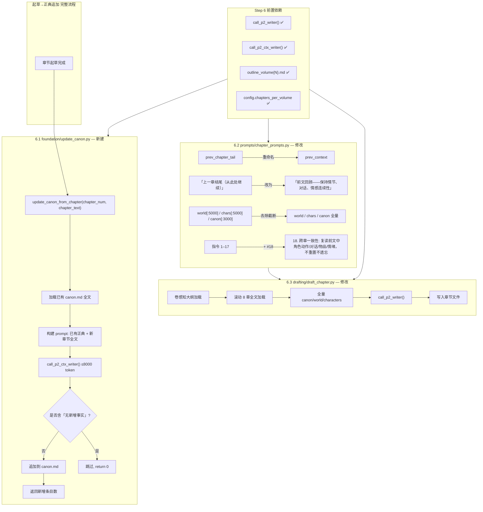

# Step 6 实施方案：增量 Canon 追加器 + 章节起草滚动窗口改造

> 基于 [plan_D_layered_outline_incremental_canon.md](plans/plan_D_layered_outline_incremental_canon.md) Step 6  
> 版本：v1.0  
> 日期：2026-06-19  
> 前置依赖：[Step 2](plans/step2_implementation_plan.md) ✅ — `call_p2_writer` / `call_p2_ctx_writer` Phase 路由函数就绪  
> 前置依赖：[Step 5](plans/step5_implementation_plan.md) ✅ — [`foundation/gen_outline.py`](foundation/gen_outline.py:144) 按卷生成 `outline_volume{N}.md` 就绪

---

## 一、目标

完成 plan_D Step 6 的全部三项改造：

| # | 改造项 | 文件 | 说明 |
|---|--------|------|------|
| 1 | **新建增量 canon 追加器** | [`foundation/update_canon.py`](foundation/gen_canon.py:1) | 每章起草完成后从章节文本提取新事实，追加到 [`canon.md`](output/canon.md) |
| 2 | **改造章节起草 — 滚动上下文窗口** | [`drafting/draft_chapter.py`](drafting/draft_chapter.py:57) | 前 8 章全文替代仅前章尾部，全量 canon/world/characters，卷感知大纲加载，`call_p2_writer` |
| 3 | **改造 chapter prompt — 去截断 + 新增指令** | [`prompts/chapter_prompts.py`](prompts/chapter_prompts.py:9) | `prev_chapter_tail` → `prev_context`，去掉三段截断，新增跨章一致性指令 #18 |

---

## 二、涉及文件

| 文件 | 操作 | 说明 |
|------|------|------|
| [`foundation/update_canon.py`](foundation/gen_canon.py:1) | **新增** | 增量正典追加器，核心函数 `update_canon_from_chapter()` |
| [`drafting/draft_chapter.py`](drafting/draft_chapter.py:57) | **修改** | 滚动 8 章上下文 + 全量 canon + 卷感知大纲加载 + `call_p2_writer` |
| [`prompts/chapter_prompts.py`](prompts/chapter_prompts.py:9) | **修改** | `prev_chapter_tail` → `prev_context`，去除全量截断，新增指令 #18 |

**共 1 个新文件，2 个修改文件。**

---

## 三、依赖确认

| 依赖项 | 位置 | 状态 | STEP6 用途 |
|--------|------|------|------------|
| `call_p2_writer()` | [`core/api_client.py:454`](core/api_client.py:454) | ✅ Step 2 | 章节起草（Phase 2 大上下文模型） |
| `call_p2_ctx_writer()` | [`core/api_client.py:473`](core/api_client.py:473) | ✅ Step 2 | Canon 增量追加（可选独立大上下文模型） |
| `config.chapters_per_volume` | [`core/config.py:215`](core/config.py:215) | ✅ Step 1/5 | 卷感知大纲加载 |
| `config.total_volumes` | [`core/config.py:210`](core/config.py:210) | ✅ Step 1 | 卷号计算 |
| `OUTPUT_DIR` / `CHAPTERS_DIR` | [`core/config.py:22`](core/config.py:22) | ✅ 原有 | 文件读写路径 |
| `step()` | [`core/state_manager.py:101`](core/state_manager.py:101) | ✅ 原有 | 进度日志 |
| `outline_volume{N}.md` | Step 5 产出 | ✅ Step 5 | 卷感知大纲源文件 |
| `state["canon_entry_count"]` | [`core/state_manager.py:88`](core/state_manager.py:88) | ✅ Step 1 | 正典条目计数更新 |
| `state["canon_last_updated_ch"]` | [`core/state_manager.py:89`](core/state_manager.py:89) | ✅ Step 1 | 最后更新章号追踪 |

---

## 四、当前代码分析

### 4.1 现有 [`drafting/draft_chapter.py`](drafting/draft_chapter.py:57) 上下文加载

```
当前行为：
  • 加载全文 voice / world / characters / outline / canon（5 个文件）
  • 仅前 1 章尾部 2000 字（prev_chapter_tail）
  • world [:5000]、characters [:5000]、canon [:3000] 三段截断
  • 调用 call_writer()（共用模型）
  • 大纲从 outline.md 单文件提取
```

**问题**：前文上下文严重不足（仅 2000 字尾部），草拟连续性差；参考资料截断丢失信息。

### 4.2 现有 [`prompts/chapter_prompts.py`](prompts/chapter_prompts.py:9) prompt 结构

```
当前结构：
  ┌─ 文风定义（全量）
  ├─ 本章大纲（全量）
  ├─ 下一章预告（全量）
  ├─ 上一章结尾 2000 字
  ├─ 世界观 [:5000]

  ├─ 角色注册表 [:5000]

  ├─ 正典 [:3000]

  └─ 写作指令 1–17 条
```

**问题**：三处截断限制信息输入，缺少跨章一致性约束。

### 4.3 现有 canon 更新机制

**不存在**。当前 [`foundation/gen_canon.py`](foundation/gen_canon.py:23) 的 `generate_canon()` 仅在 Phase 1 做一次性初始生成，之后 canon 不再更新。章节起草中发现的新设定不会回流到 canon，导致后期章节无法引用前期确立的事实。

---

## 五、改造后架构



---

## 六、详细修改

### 6.1 新建 [`foundation/update_canon.py`](foundation/gen_canon.py:1)

#### 文件结构

```python
#!/usr/bin/env python3
"""
foundation/update_canon.py — 增量正典更新器

每章起草完成后，从章节文本中提取首次出现的新增硬事实，追加到 canon.md。
输出 ≤ 8000 token，适配 16000 限制。
"""

import re
from pathlib import Path

from core.config import config, OUTPUT_DIR
from core.api_client import call_p2_ctx_writer
from core.state_manager import step


UPDATE_CANON_SYSTEM_PROMPT = """你是正典管理员。从新完成的章节中提取首次出现的新增硬事实。
已有正典中已记录的事实不要重复。
你的输出直接追加到 canon.md 对应节。
你的汉语写作简洁直接。"""


def update_canon_from_chapter(
    chapter_num: int,
    chapter_text: str,
    max_tokens: int = 8000,
) -> int:
    """从章节提取新事实 → 追加 canon.md。返回新增事实条数。"""
    canon_path = OUTPUT_DIR / "canon.md"
    existing_canon = canon_path.read_text(encoding="utf-8") if canon_path.exists() else ""

    prompt = f"""【已有正典】
{existing_canon}

【新完成的第 {chapter_num} 章全文】
{chapter_text}

请提取本章中【首次出现】的新增硬事实，按格式输出：

## 新增：世界观硬事实（第 {chapter_num} 章）
— ...

## 新增：角色硬事实（第 {chapter_num} 章）
— ...

## 新增：时间线硬事实（第 {chapter_num} 章）
— ...

## 新增：规则硬事实（第 {chapter_num} 章）
— ...

如无新增事实，输出「无新增事实」。
"""

    step(f"正典更新: 检查第 {chapter_num} 章新事实 ...")
    result = call_p2_ctx_writer(
        prompt,
        system=UPDATE_CANON_SYSTEM_PROMPT,
        max_tokens=max_tokens,
        temperature=0.5,
    )

    if "无新增事实" in result:
        step(f"正典更新: 第 {chapter_num} 章无新增事实")
        return 0

    # 追加到 canon.md
    canon_path.write_text(
        existing_canon.rstrip() + "\n\n" + result,
        encoding="utf-8",
    )

    # 统计新增条目数
    new_entries = len(re.findall(r"^— ", result, re.MULTILINE))
    step(f"正典更新: +{new_entries} 条新事实（第 {chapter_num} 章）")
    return new_entries
```

#### 设计要点

| 要点 | 说明 |
|------|------|
| **API 路由** | 使用 `call_p2_ctx_writer()` — 专为大上下文 canon 追加设计的独立路由，回退链：`p2_ctx → p2 → p1 → 共用` |
| **温度** | `temperature=0.5` — 低于起草 (0.8)，高于裁判 (0.3)，平衡准确性和灵活性 |
| **输出** | `max_tokens=8000` — 远在 16000 限制内，canon 追加不需要大量输出 |
| **去重** | 依赖 LLM 理解已有正典并跳过重复 → prompt 中明确 "已有正典中已记录的事实不要重复" |
| **返回值** | `int` — 方便 pipeline 层统计展示（"正典更新: +5 条新事实"）|
| **异常安全** | 不 try/except — 让调用方（pipeline_orchestrator）处理异常（Step 7 负责） |

---

### 6.2 修改 [`prompts/chapter_prompts.py`](prompts/chapter_prompts.py:9)

#### 改动项（共 4 处）

##### 改动 A：参数重命名

**位置**：函数签名 [`prompts/chapter_prompts.py:16`](prompts/chapter_prompts.py:16)

```
当前: prev_chapter_tail: str,
改为: prev_context: str,
```

##### 改动 B：标签更新

**位置**：prompt 模板 [`prompts/chapter_prompts.py:36–37`](prompts/chapter_prompts.py:36)

```
当前:
【上一章结尾（从此处继续）】
{prev_chapter_tail}

改为:
【前文回顾——保持情节、对话、情感连续性】
{prev_context}
```

##### 改动 C：去除三段截断

**位置**：prompt 模板 [`prompts/chapter_prompts.py:39–45`](prompts/chapter_prompts.py:39)

```
当前:
【世界观设定（参考）】
{world_text[:5000]}

【角色注册表（参考说话模式和行为特征）】
{characters_text[:5000]}

{('【正典（已确立的硬事实——不可违反）】' + canon_text[:3000]) if canon_text else ''}

改为:
【世界观设定】
{world_text}

【角色注册表】
{characters_text}

{('【正典（已确立的硬事实——不可违反）】' + canon_text) if canon_text else ''}
```

> **注意**：标签中的 "（参考）" / "（参考说话模式和行为特征）" 也一并移除——既然全量注入，无需弱化标识。

##### 改动 D：新增指令 #18

**位置**：prompt 模板末尾，指令 #17 之后 [`prompts/chapter_prompts.py:92`](prompts/chapter_prompts.py:92)

```
在 #17 之后追加:
18. 【跨章一致性】: 复读前文中角色正在进行的动作、未完成的对话、
    持有的物品、当前的情绪状态。不要重置或遗忘。
```

---

### 6.3 修改 [`drafting/draft_chapter.py`](drafting/draft_chapter.py:57)

#### 改动项（共 6 处）

##### 改动 A：新增导入

**位置**：文件头部 [`drafting/draft_chapter.py:14`](drafting/draft_chapter.py:14)

```
当前:
from core.api_client import call_writer

改为:
from core.api_client import call_p2_writer
```

> `call_writer` 导入行替换为 `call_p2_writer`。Phase 2 起草使用大上下文模型。

##### 改动 B：新增滚动上下文加载函数

**位置**：在 `extract_next_chapter_preview()` 之后、`draft_chapter()` 之前插入 [`drafting/draft_chapter.py:56`](drafting/draft_chapter.py:54)

```python
RECENT_CHAPTERS = 8


def _load_recent_chapters(chapter_num: int) -> str:
    """加载前 RECENT_CHAPTERS 章全文，作为滚动上下文。

    对于第 N 章，加载尽可能多的前文章节（最多 RECENT_CHAPTERS 章），
    按时间顺序排列（最早的在前），用分隔符连接。

    Returns:
        前文上下文字符串；第一章返回无前文提示。
    """
    recent_chapters = []
    for offset in range(1, RECENT_CHAPTERS + 1):
        prev_ch = chapter_num - offset
        if prev_ch < 1:
            break
        prev_path = CHAPTERS_DIR / f"ch_{prev_ch:02d}.md"
        if prev_path.exists():
            text = prev_path.read_text(encoding="utf-8")
            recent_chapters.append(
                f"【第 {prev_ch} 章全文】\n{text}"
            )

    if not recent_chapters:
        return "(第一章——无前文)"

    # 反转使顺序为 chrono（最早→最近）
    recent_chapters.reverse()
    return "\n\n---\n\n".join(recent_chapters)
```

##### 改动 C：卷感知 `extract_chapter_outline()`

**位置**：替换现有 [`drafting/draft_chapter.py:34`](drafting/draft_chapter.py:34) 的 `extract_chapter_outline()` 函数

```python
def extract_chapter_outline(chapter_num: int) -> str:
    """从对应卷的大纲文件提取指定章节条目。

    优先从 output/outline_volume{N}.md 提取，不存在则回退到 output/outline.md。
    """
    cfg = config
    cfg.load()
    ch_per_vol = cfg.chapters_per_volume or 10
    vol_num = (chapter_num - 1) // ch_per_vol + 1

    vol_outline_path = OUTPUT_DIR / f"outline_volume{vol_num}.md"
    if not vol_outline_path.exists():
        vol_outline_path = OUTPUT_DIR / "outline.md"

    outline_text = load_file(vol_outline_path)

    # 匹配 "### 第 N 章" 或 "### Ch N"
    patterns = [
        rf'###\s*(?:第\s*)?{chapter_num}\s*章.*?(?=###\s*(?:第\s*)?{chapter_num + 1}\s*章|## 伏笔|## 二、|## 三、|$)',

        rf'###\s*Ch\s*{chapter_num}[:：].*?(?=###\s*Ch\s*{chapter_num + 1}[:：]|## Foreshadowing|$)',

    ]
    for pattern in patterns:
        match = re.search(pattern, outline_text, re.DOTALL)
        if match:
            return match.group(0).strip()
    return f"(第 {chapter_num} 章大纲未找到)"
```

> **说明**：Step 5 产出 `outline_volume{N}.md` 的格式为 `### 第 N 章：[章节标题]`，与现有 regex 完全兼容。`extract_next_chapter_preview()` 无需修改——它内部调用 `extract_chapter_outline()`，自动获得卷感知能力。

##### 改动 D：`draft_chapter()` 上下文加载重构

**位置**：替换 [`drafting/draft_chapter.py:67–96`](drafting/draft_chapter.py:67) 的上下文加载段

```
当前（第 67–96 行）:
    # 加载所有上下文
    voice = load_file(OUTPUT_DIR / "voice.md")
    world = load_file(OUTPUT_DIR / "world.md")
    characters = load_file(OUTPUT_DIR / "characters.md")
    outline = load_file(OUTPUT_DIR / "outline.md")
    canon = load_file(OUTPUT_DIR / "canon.md")

    chapter_outline = extract_chapter_outline(outline, chapter_num)
    next_chapter = extract_next_chapter_preview(outline, chapter_num)

    prev_path = CHAPTERS_DIR / f"ch_{chapter_num - 1:02d}.md"
    if prev_path.exists():
        prev_text = prev_path.read_text(encoding="utf-8")
        prev_tail = prev_text[-2000:] if len(prev_text) > 2000 else prev_text
    else:
        prev_tail = "(第一章——无前文)"

    novel_title = cfg.novel_title or ""

    prompt = build_chapter_prompt(
        chapter_num,
        voice_text=voice,
        world_text=world,
        characters_text=characters,
        chapter_outline=chapter_outline,
        next_chapter_preview=next_chapter,
        prev_chapter_tail=prev_tail,
        canon_text=canon,
        novel_title=novel_title,
    )

改为:
    # 加载所有上下文（全量，不截断——由 P2 大上下文模型处理）
    voice = load_file(OUTPUT_DIR / "voice.md")
    world = load_file(OUTPUT_DIR / "world.md")
    characters = load_file(OUTPUT_DIR / "characters.md")
    canon = load_file(OUTPUT_DIR / "canon.md")

    chapter_outline = extract_chapter_outline(chapter_num)
    next_chapter = extract_next_chapter_preview(chapter_num)

    # ★ 滚动窗口：前 8 章全文
    prev_context = _load_recent_chapters(chapter_num)

    novel_title = cfg.novel_title or ""

    prompt = build_chapter_prompt(
        chapter_num,
        voice_text=voice,
        world_text=world,
        characters_text=characters,
        chapter_outline=chapter_outline,
        next_chapter_preview=next_chapter,
        prev_context=prev_context,
        canon_text=canon,
        novel_title=novel_title,
    )
```

##### 改动 E：LLM 调用路由

**位置**：[`drafting/draft_chapter.py:99`](drafting/draft_chapter.py:99)

```
当前:
    result = call_writer(
        prompt, system=DRAFT_SYSTEM_PROMPT, max_tokens=max_tokens,
        retries=retries, max_total_time=max_total_time,
    )

改为:
    result = call_p2_writer(
        prompt, system=DRAFT_SYSTEM_PROMPT, max_tokens=max_tokens,
        retries=retries, max_total_time=max_total_time,
    )
```

##### 改动 F：`extract_next_chapter_preview()` 适配卷感知大纲

**位置**：现有 [`drafting/draft_chapter.py:48`](drafting/draft_chapter.py:48) — 函数签名改为接收 `chapter_num` 而非 `outline_text`

```python
def extract_next_chapter_preview(chapter_num: int) -> str:
    """提取下一章大纲的前几行作为预告。

    优先从卷级大纲文件提取，不存在则回退到 outline.md。
    """
    cfg = config
    cfg.load()
    ch_per_vol = cfg.chapters_per_volume or 10
    next_ch = chapter_num + 1

    vol_num = (next_ch - 1) // ch_per_vol + 1
    vol_outline_path = OUTPUT_DIR / f"outline_volume{vol_num}.md"
    if not vol_outline_path.exists():
        vol_outline_path = OUTPUT_DIR / "outline.md"

    outline_text = load_file(vol_outline_path)
    next_entry = extract_chapter_outline(next_ch)
    if "未找到" in next_entry:
        return "(最终章)"
    lines = next_entry.split("\n")[:8]
    return "\n".join(lines)
```

> **说明**：`extract_next_chapter_preview()` 改为接收 `chapter_num` 而非 `outline_text` 字符串。原因是 `extract_chapter_outline()` 已改为接收 `chapter_num`（内部做卷感知加载），`extract_next_chapter_preview()` 直接调用 `extract_chapter_outline(chapter_num + 1)` 即可。

---

## 七、上下文变化对比

### 7.1 Prompt 注入量对比

| 内容段 | 原方案 | Step 6 改造后 | 变化 |
|--------|--------|--------------|------|
| 文风定义 | 全量 voice.md | 全量（不变） | — |
| 本章大纲 | 提取单章 | 卷感知提取（不变） | — |
| 前文上下文 | 前 1 章尾部 2000 字 | 前 8 章全文 ~26000 字 | **×13** |
| 世界观设定 | 前 5000 字 | 全量 | **全量** |
| 角色注册表 | 前 5000 字 | 全量 | **全量** |
| 正典 | 前 3000 字 | 全量 | **全量** |
| 写作指令 | 1–17 条 | 1–18 条 | **+1 条** |

### 7.2 LLM 调用路由对比

| 原方案 | Step 6 改造后 | 说明 |
|--------|--------------|------|
| `call_writer()` | `call_p2_writer()` | Phase 2 专用模型，回退链：p2 → p1 → 共用 |

---

## 八、集成 — 与 Step 7 (pipeline_orchestrator) 的接口约定

Step 6 不直接修改 `pipeline_orchestrator.py`，但定义了 Step 7 将要使用的接口：

### 8.1 Canon 追加接口

```python
# Step 7 将在 run_drafting 中调用：
try:
    from foundation.update_canon import update_canon_from_chapter
    ch_text = ch_file.read_text(encoding="utf-8")
    new_count = update_canon_from_chapter(ch_num, ch_text)
    if new_count > 0:
        step(f"正典更新: +{new_count} 条新事实")
except Exception as e:
    step(f"正典更新跳过: {e}")
```

### 8.2 状态更新接口

Step 7 需要在 canon 追加后更新 state：

```python
state["canon_entry_count"] = state.get("canon_entry_count", 0) + new_count
state["canon_last_updated_ch"] = ch_num
```

> **Step 6 不负责这部分**——`update_canon_from_chapter()` 只追加文件并返回计数。state 更新由 Step 7 的 pipeline_orchestrator 负责。

### 8.3 Canon 上下文注入到起草

`draft_chapter()` 内部已自动加载全量 canon。Step 7 的 `run_drafting` 无需额外操作——调用 `draft_chapter(n)` 即可，canon 自动最新。

---

## 九、兼容性分析

### 9.1 向后兼容

| 场景 | 兼容性 |
|------|--------|
| `outline_volume{N}.md` 不存在 | ✅ `extract_chapter_outline()` 自动回退到 `outline.md` |
| `canon.md` 不存在 | ✅ `update_canon_from_chapter()` 以空字符串作为已有正典 |
| 前文章节不存在（第 1 章） | ✅ `_load_recent_chapters()` 返回 "(第一章——无前文)" |
| 前文章节部分缺失（第 2-8 章） | ✅ `_load_recent_chapters()` 加载所有存在的前文章节 |
| `call_p2_writer` 的 Phase 2 配置为空 | ✅ 回退链：p2 → p1 → 共用（config.py 自动处理） |
| `call_p2_ctx_writer` 的 Phase 2 CTX 配置为空 | ✅ 回退链：p2_ctx → p2 → p1 → 共用 |
| 现有 `call_writer` 直接调用 | ⚠ 无其他调用方直接调 `draft_chapter.py` 的 `call_writer` — 只有 `draft_chapter()` 内部使用 |
| `gen_outline_part2.py` 读 `outline.md` | ✅ 不受影响 — Step 5 的 `generate_outline()` 仍写 `outline.md` |

### 9.2 性能考量

| 指标 | 原方案 | Step 6 后 | 影响 |
|------|--------|----------|------|
| 起草 prompt 长度 | ~12K token | ~35K token | **增大 3×**，需要 P2 大上下文模型 |
| LLM 输出 token | ~8K（3250 字） | ~8K（不变） | 无变化 |
| Canon 追加 token | 无 | ~8K | 每章额外一次 LLM 调用 |
| Canon 追加 prompt | 无 | ~15K token | canon 全文 + 单章 3250 字 |

> **说明**：prompt 注入量增大但输出量不变——完全适配 NVIDIA NIM 1M 上下文 + 16K 输出限制。

---

## 十、验证清单

| # | 验证项 | 方法 |
|---|--------|------|
| 1 | `update_canon_from_chapter()` 可导入 | `python -c "from foundation.update_canon import update_canon_from_chapter"` |
| 2 | `build_chapter_prompt()` 参数 `prev_context` 正确 | 检查函数签名 |
| 3 | `build_chapter_prompt()` 不出现在何 `[:5000]` / `[:3000]` 截断 | `rg '\[:\d+\]' prompts/chapter_prompts.py` 无匹配 |
| 4 | 指令 #18 存在于 prompt 模板末尾 | `rg '跨章一致性' prompts/chapter_prompts.py` |
| 5 | `draft_chapter.py` 导入 `call_p2_writer` 而非 `call_writer` | `rg 'call_writer' drafting/draft_chapter.py` 无匹配（除注释外） |
| 6 | `extract_chapter_outline()` 接收 `int` 参数 | 检查函数签名 |
| 7 | `_load_recent_chapters()` 对 ch=1 返回无前文提示 | 手动测试 |
| 8 | `_load_recent_chapters()` 对 ch=9 加载 8 章 | 手动测试 |
| 9 | 对单卷配置，`extract_chapter_outline()` 回退到 `outline.md` | 删除 `outline_volume1.md` 后测试 |
| 10 | Canon 追加 "无新增事实" 时不修改文件 | 用只含已知事实的章节测试 |
| 11 | Canon 追加有新增事实时文件增长 | diff canon.md before/after |
| 12 | `update_canon_from_chapter()` 返回值正确 | `assert result == 0` / `assert result > 0` |

---

## 十一、文件变更摘要

```
M  drafting/draft_chapter.py       — 滚动窗口 + 全量 canon + call_p2_writer + 卷感知大纲
M  prompts/chapter_prompts.py       — prev_context 参数 + 去截断 + #18 指令
A  foundation/update_canon.py       — 增量正典追加器（新文件）
```

**共 3 个文件变更，无删除。**