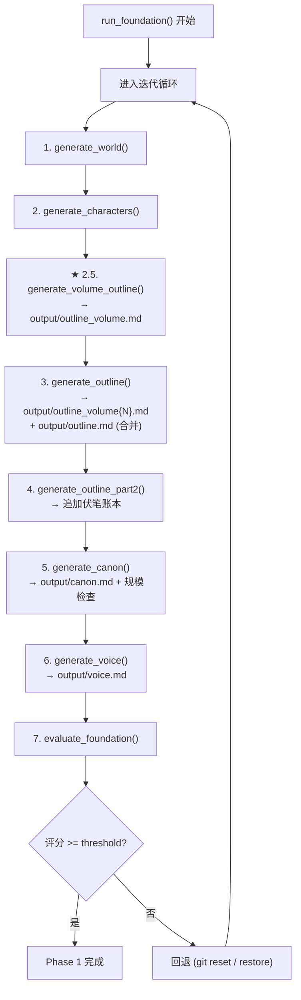
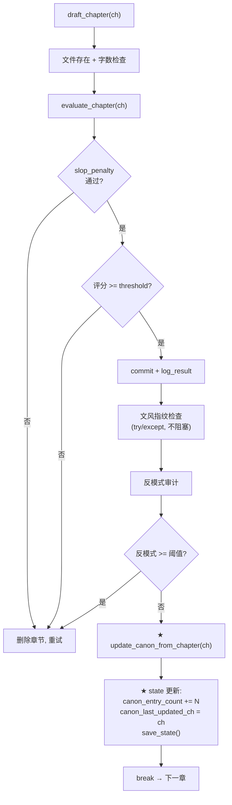

# Step 7 实施方案：pipeline_orchestrator Phase 1/2 适配

> 基于 [plan_D_layered_outline_incremental_canon.md](plans/plan_D_layered_outline_incremental_canon.md) Step 7  
> 版本：v1.0  
> 日期：2026-06-19  
> 前置依赖：
>   [Step 4](plans/step4_implementation_plan.md) ✅ — [`foundation/gen_outline_volume.py`](foundation/gen_outline_volume.py:194) `generate_volume_outline()` 就绪  
>   [Step 5](plans/step5_implementation_plan.md) ✅ — [`foundation/gen_outline.py`](foundation/gen_outline.py:144) `generate_outline_for_volume()` + `generate_outline()` 合并写入就绪  
>   [Step 6](plans/step6_implementation_plan.md) ✅ — [`foundation/update_canon.py`](foundation/update_canon.py:23) `update_canon_from_chapter()` 就绪；[`drafting/draft_chapter.py`](drafting/draft_chapter.py:106) 滚动窗口 + `call_p2_writer` 就绪

---

## 一、目标

修改 [`pipeline_orchestrator.py`](pipeline_orchestrator.py:57) 的 `run_foundation()` 和 `run_drafting()` 两个函数，完成 plan_D Step 7 的全部适配：

| # | 改造项 | 说明 |
|---|--------|------|
| 1 | **Phase 1: 插入卷级总纲生成步骤** | 在 `generate_outline()` 之前插入 `generate_volume_outline()` 调用 |
| 2 | **Phase 2: 嵌入增量 canon 追加** | 每章起草成功后调用 `update_canon_from_chapter()`，更新 state |
| 3 | **Phase 2: 状态字段追踪** | 更新 `canon_entry_count` / `canon_last_updated_ch` |

---

## 二、涉及文件

| 文件 | 操作 | 说明 |
|------|------|------|
| [`pipeline_orchestrator.py`](pipeline_orchestrator.py:57) | **修改** | `run_foundation()` 插入卷级总纲步骤；`run_drafting()` 嵌入 canon 追加逻辑 |

**共 1 个文件修改。**

---

## 三、当前代码分析

### 3.1 Phase 1 — `run_foundation()` 当前流程（[`pipeline_orchestrator.py:57-169`](pipeline_orchestrator.py:57)）

```
当前步骤顺序:
  1. generate_world()        → output/world.md
  2. generate_characters()    → output/characters.md
  3. generate_outline()       → output/outline_volume{N}.md + output/outline.md
  4. generate_outline_part2() → 追加伏笔账本到 output/outline.md
  5. generate_canon()         → output/canon.md
  6. generate_voice()         → output/voice.md
  7. evaluate_foundation()    → 全局评估
```

**问题**：[`generate_outline()`](foundation/gen_outline.py:245) 内部调用 [`generate_outline_for_volume()`](foundation/gen_outline.py:144)，后者依赖 [`outline_volume.md`](output/outline_volume.md) 获取卷级约束。但当前流程中没有步骤生成 `outline_volume.md`，导致 `generate_outline_for_volume()` 只能走回退路径（用全书弧线前 4000 字替代），丢失了卷级总纲的结构化约束。

### 3.2 Phase 2 — `run_drafting()` 当前流程（[`pipeline_orchestrator.py:176-334`](pipeline_orchestrator.py:176)）

```
当前每章起草成功后的流程:
  评分通过 → commit → log_result → 更新 state.chapters_drafted → 文风指纹检查 → 反模式审计 →
    → (如反模式过多则重写) → break

缺少:
  ✗ 无 canon 增量追加
  ✗ 无 canon_entry_count / canon_last_updated_ch 状态更新
```

**问题**：canon 仅在 Phase 1 初始化一次，Phase 2 起草过程中产生的新设定不会回流到 canon.md。后期章节无法引用前期确立的事实，连续性下降。

---

## 四、改造后架构

```mermaid
flowchart TD
    subgraph P1_NEW["Phase 1: run_foundation() 改造后"]
        W["1. generate_world()"]
        C["2. generate_characters()"]
        VOL["★ 2.5. generate_volume_outline() — 卷级总纲"]
        OUT["3. generate_outline() — 逐卷章级大纲 + 合并 outline.md"]
        P2["4. generate_outline_part2() — 伏笔账本"]
        CAN["5. generate_canon()"]
        VOI["6. generate_voice()"]
        EVAL["7. evaluate_foundation()"]
        
        W --> C --> VOL --> OUT --> P2 --> CAN --> VOI --> EVAL
    end

    subgraph P2_NEW["Phase 2: run_drafting() 每章成功后"]
        DRAFT_PASS["章节起草通过<br/>评分 + 反模式审计"]
        COMMIT["commit + log + state"]
        FINGER["文风指纹检查"]
        CANON_UPDATE["★ update_canon_from_chapter()"]
        STATE_UPDATE["★ state 更新:<br/>canon_entry_count<br/>canon_last_updated_ch"]
        
        DRAFT_PASS --> COMMIT --> FINGER --> CANON_UPDATE --> STATE_UPDATE
    end
```



---

## 五、详细修改

### 5.1 改动 A：Phase 1 — 插入卷级总纲生成步骤

**位置**：[`pipeline_orchestrator.py:91-98`](pipeline_orchestrator.py:91) — 在 `generate_characters()` 之后、`generate_outline()` 之前插入

**当前代码** (lines 85-98):
```python
        # 1. 生成世界观
        step("生成世界观 world.md ...")
        from foundation.gen_world import generate_world
        generate_world(max_tokens=max_tokens)

        # 2. 生成角色
        step("生成角色 characters.md ...")
        from foundation.gen_characters import generate_characters
        generate_characters(max_tokens=max_tokens)

        # 3. 生成大纲 (Part 1)
        step("生成大纲 outline.md (Part 1) ...")
        from foundation.gen_outline import generate_outline
        generate_outline(max_tokens=max_tokens)
```

**改为**:
```python
        # 1. 生成世界观
        step("生成世界观 world.md ...")
        from foundation.gen_world import generate_world
        generate_world(max_tokens=max_tokens)

        # 2. 生成角色
        step("生成角色 characters.md ...")
        from foundation.gen_characters import generate_characters
        generate_characters(max_tokens=max_tokens)

        # ★ 方案 D Step 7: 2.5. 生成卷级总纲（output/outline_volume.md）
        # 必须在 generate_outline() 之前，因为 generate_outline_for_volume()
        # 依赖 outline_volume.md 获取每卷的结构化约束
        step("生成卷级总纲 outline_volume.md ...")
        from foundation.gen_outline_volume import generate_volume_outline
        generate_volume_outline(max_tokens=max_tokens)

        # 3. 生成大纲 (Part 1) — 逐卷章级大纲 + 合并 outline.md
        # generate_outline() 内部调用 generate_outline_for_volume()
        # 自动读取 outline_volume.md 获取卷级约束
        step("生成大纲 outline.md (Part 1) ...")
        from foundation.gen_outline import generate_outline
        generate_outline(max_tokens=max_tokens)
```

**设计要点**：

| 要点 | 说明 |
|------|------|
| **插入位置** | world/characters 之后、chapter outline 之前 — `generate_outline_for_volume()` 需要 `outline_volume.md` 已存在 |
| **LLM 调用次数** | `generate_volume_outline()` 1–3 次（自动按卷数拆分），每次 ≤ 14000 token |
| **`generate_outline()` 不变** | 无需修改 — 内部已自动读取 `outline_volume.md`，不存在时走回退路径 |
| **异常安全** | 不在 Step 7 层面 try/except — 让 `run_foundation()` 的外层异常处理覆盖（原逻辑不变） |

### 5.2 改动 B：Phase 2 — 嵌入增量 canon 追加

**位置**：[`pipeline_orchestrator.py:278-304`](pipeline_orchestrator.py:278) — 在反模式审计通过后、`break` 之前插入

**当前代码** (lines 278-304):
```python
                # ★ P2-11 子项 C: 结构反模式审计
                try:
                    from evaluation.antipatterns import run_structural_audit
                    chapter_text = ch_file.read_text(encoding="utf-8")
                    audit = run_structural_audit(chapter_text)
                    antipattern_max = cfg.antipattern_max_warnings if cfg.loaded else 4
                    if audit["warning_count"] > 0:
                        if audit["warning_count"] >= antipattern_max:
                            step(f"⚠ 结构反模式过多 ({audit['warning_count']} 项 ≥ {antipattern_max})，"
                                 f"触发重写…")
                            for w in audit["warnings"]:
                                step(f"  — {w}")
                            if ch_file.exists():
                                ch_file.unlink()
                            # 重置 drafted 标志，下一轮 attempt 会重新起草
                            drafted = False
                            continue
                        else:
                            step(f"⚠ 结构反模式警告 ({audit['warning_count']} 项):")
                            for w in audit["warnings"]:
                                step(f"  — {w}")
                    else:
                        step("结构反模式: ✓")
                except Exception as e:
                    step(f"结构反模式审计跳过: {e}")

                break
```

**改为** — 在反模式审计 try/except 块之后、`break` 之前插入 canon 追加：
```python
                # ★ P2-11 子项 C: 结构反模式审计
                try:
                    from evaluation.antipatterns import run_structural_audit
                    chapter_text = ch_file.read_text(encoding="utf-8")
                    audit = run_structural_audit(chapter_text)
                    antipattern_max = cfg.antipattern_max_warnings if cfg.loaded else 4
                    if audit["warning_count"] > 0:
                        if audit["warning_count"] >= antipattern_max:
                            step(f"⚠ 结构反模式过多 ({audit['warning_count']} 项 ≥ {antipattern_max})，"
                                 f"触发重写…")
                            for w in audit["warnings"]:
                                step(f"  — {w}")
                            if ch_file.exists():
                                ch_file.unlink()
                            # 重置 drafted 标志，下一轮 attempt 会重新起草
                            drafted = False
                            continue
                        else:
                            step(f"⚠ 结构反模式警告 ({audit['warning_count']} 项):")
                            for w in audit["warnings"]:
                                step(f"  — {w}")
                    else:
                        step("结构反模式: ✓")
                except Exception as e:
                    step(f"结构反模式审计跳过: {e}")

                # ★ 方案 D Step 7: 增量 canon 追加
                # 每章起草通过后，从章节文本提取新设定追加到 canon.md
                try:
                    from foundation.update_canon import update_canon_from_chapter
                    ch_text = ch_file.read_text(encoding="utf-8")
                    new_count = update_canon_from_chapter(ch, ch_text)
                    if new_count > 0:
                        step(f"正典更新: +{new_count} 条新事实（第 {ch} 章）")
                        # 更新状态追踪
                        state["canon_entry_count"] = (
                            state.get("canon_entry_count", 0) + new_count
                        )
                        state["canon_last_updated_ch"] = ch
                        save_state(state)
                except Exception as e:
                    step(f"正典更新跳过: {e}")

                break
```

**设计要点**：

| 要点 | 说明 |
|------|------|
| **插入位置** | 反模式审计全部通过之后、`break` 之前 — 确保只有"确定保留"的章节才触发 canon 更新 |
| **异常安全** | `try/except` 包裹 — canon 更新失败不影响起草流水线继续 |
| **状态同步** | 追加成功后立即 `save_state()` — 确保中断恢复时状态一致 |
| **API 路由** | `update_canon_from_chapter()` 内部使用 `call_p2_ctx_writer()` — 独立大上下文模型路由 |
| **返回值利用** | `new_count` 用于: (a) 日志展示 (b) 累积 `canon_entry_count` |

### 5.3 改动 C：Phase 2 — 最终 canon 统计日志

**位置**：[`pipeline_orchestrator.py:326-334`](pipeline_orchestrator.py:326) — 在 `run_drafting()` 末尾新增总结日志

**当前代码** (lines 326-334):
```python
    state["phase"] = "revision"
    state["current_focus"] = "full_novel"
    state["chapters_drafted"] = total
    state["revision_cycle"] = 0
    save_state(state)

    total_words = count_words_in_chapters()
    banner(f"草拟完成 — {total} 章, {total_words} 字")
    return state
```

**改为**:
```python
    state["phase"] = "revision"
    state["current_focus"] = "full_novel"
    state["chapters_drafted"] = total
    state["revision_cycle"] = 0
    save_state(state)

    total_words = count_words_in_chapters()
    canon_total = state.get("canon_entry_count", 0)
    banner(f"草拟完成 — {total} 章, {total_words} 字, "
           f"正典条目 {canon_total} (最后更新: 第 {state.get('canon_last_updated_ch', 0)} 章)")
    return state
```

---

## 六、改动不涉及的部分（确认清单）

以下现有逻辑完全不动：

| 区域 | 行号 | 说明 |
|------|------|------|
| `run_foundation()` 迭代/评分/commit/回退逻辑 | 68-83, 128-157 | 100% 复用，一行不改 |
| `run_foundation()` 的 canon 初始生成 + 规模检查 | 105-121 | 不动 — 初始 canon 仍由 `gen_canon.py` 生成 |
| `run_foundation()` 的 voice 生成 | 123-126 | 不动 |
| `run_foundation()` 的评估调用 | 128-133 | 不动 — `evaluate_foundation()` 原函数 |
| `run_drafting()` 的起草/重试/评分/commit/回退 | 197-243 | 100% 复用 |
| `run_drafting()` 的 slop_penalty 决策 | 220-233 | 不动 |
| `run_drafting()` 的文风指纹检查 | 246-276 | 不动 |
| `run_drafting()` 的失败兜底逻辑 | 313-324 | 不动 |
| Phase 3 (`run_revision`) | 396-919 | 完全不动 — Step 8 负责 |
| Phase 4 (`run_export`) | 926-972 | 完全不动 |
| `run_pipeline()` 主编排器 | 979-1070 | 完全不动 |

---

## 七、Phase 1 完整执行顺序（改造后）



**说明**：
- `generate_volume_outline()` 是唯一新增步骤，插入在步骤 2 和 3 之间
- `generate_outline()` 不变 — 内部已调用 `generate_outline_for_volume()` 逐卷生成并合并
- 后续步骤 (canon/voice/evaluate) 完全不变

---

## 八、Phase 2 每章成功后的完整流程（改造后）



---

## 九、依赖确认

| 依赖项 | 位置 | 状态 | Step 7 用途 |
|--------|------|------|-------------|
| `generate_volume_outline()` | [`foundation/gen_outline_volume.py:194`](foundation/gen_outline_volume.py:194) | ✅ Step 4 | Phase 1 卷级总纲生成 |
| `generate_outline()` | [`foundation/gen_outline.py:245`](foundation/gen_outline.py:245) | ✅ Step 5 | Phase 1 逐卷章级大纲（自动读取 `outline_volume.md`） |
| `generate_outline_for_volume()` | [`foundation/gen_outline.py:144`](foundation/gen_outline.py:144) | ✅ Step 5 | 由 `generate_outline()` 内部调用 |
| `update_canon_from_chapter()` | [`foundation/update_canon.py:23`](foundation/update_canon.py:23) | ✅ Step 6 | Phase 2 增量 canon 追加 |
| `draft_chapter()` | [`drafting/draft_chapter.py:106`](drafting/draft_chapter.py:106) | ✅ Step 6 | Phase 2 起草（自动加载全量 canon） |
| `config.total_volumes` | [`core/config.py:210`](core/config.py:210) | ✅ Step 1 | `generate_volume_outline()` 内部使用 |
| `config.chapters_per_volume` | [`core/config.py:215`](core/config.py:215) | ✅ Step 1 | `generate_outline_for_volume()` 内部使用 |
| `state["canon_entry_count"]` | [`core/state_manager.py:88`](core/state_manager.py:88) | ✅ Step 1 | Phase 2 累积计数 |
| `state["canon_last_updated_ch"]` | [`core/state_manager.py:89`](core/state_manager.py:89) | ✅ Step 1 | Phase 2 最后更新章号 |

---

## 十、兼容性分析

| 场景 | 兼容性 |
|------|--------|
| `total_volumes=1`（单卷模式） | ✅ `generate_volume_outline()` 自动走单卷专用 prompt |
| `outline_volume.md` 已存在（resume） | ✅ `generate_volume_outline()` 会覆盖，`generate_outline()` 重新读取 |
| canon.md 已存在（resume） | ✅ `update_canon_from_chapter()` 追加而非覆盖 |
| canon 追加失败（API 错误） | ✅ `try/except` 包裹，logging + 继续起草 |
| 中断恢复 — state 中 `canon_entry_count` 为旧值 | ✅ 恢复后从下一章继续，canon 追加从当前章开始 |
| 中断恢复 — `chapters_drafted=N` 但 canon 只更新到 N-2 | ✅ `canon_last_updated_ch` 小于 `chapters_drafted` 时不会自动修复（设计选择：不回溯，从当前章继续） |
| 旧版 `.env` 无 P1/P2 独立配置 | ✅ 回退链自动处理（config.py 内置） |
| `gen_outline_part2.py` 读取合并后的 `outline.md` | ✅ `generate_outline()` 仍然写入合并后的 `outline.md` |

---

## 十一、验证清单

| # | 验证项 | 方法 |
|---|--------|------|
| 1 | `generate_volume_outline()` 在 `generate_outline()` 之前执行 | 检查日志输出顺序：卷级总纲 → 卷 1 章级大纲 → … |
| 2 | `outline_volume.md` 在 `generate_outline()` 调用前已存在 | 检查 `output/outline_volume.md` 文件时间戳 |
| 3 | `generate_outline()` 正确读取 `outline_volume.md` 中的卷约束 | 检查 `generate_outline_for_volume()` 日志中是否有 "⚠ 未在 outline_volume.md 中找到卷 N 的约束段" |
| 4 | Phase 1 评估逻辑不变 | `evaluate_foundation()` 调用位置/参数不变 |
| 5 | 每章起草成功后调用 `update_canon_from_chapter()` | 检查日志中 "正典更新:" 行出现频率 |
| 6 | canon 追加在反模式审计之后 | 日志顺序：结构反模式 → 正典更新 |
| 7 | `canon_entry_count` 正确累积 | Phase 2 完成后检查 `state.json` 中 `canon_entry_count` 值 |
| 8 | `canon_last_updated_ch` 跟踪最后更新章号 | Phase 2 完成后检查 `state.json` |
| 9 | canon 追加失败不阻塞起草 | 模拟 API 错误（或用无效 API key），确认起草继续 |
| 10 | `draft_chapter()` 读取到最新 canon | 确认第 5 章起草时 canon.md 包含第 1-4 章新增事实 |

---

## 十二、文件变更摘要

```
M  pipeline_orchestrator.py  — run_foundation() 插入 generate_volume_outline()；
                                run_drafting() 嵌入 update_canon_from_chapter() + state 追踪
```

**总计：1 个文件修改，0 个新文件。**

---

## 十三、后续步骤依赖

Step 7 完成后，接下来的步骤：

| 步骤 | 内容 | 依赖 Step 7 |
|------|------|------------|
| **Step 8** | Pipeline Phase 3 删除 Elo + 采样评估 + 跨卷一致性审阅 | ✅ `run_revision()` 在 Step 7 中完全不动，Step 8 独立改造 |
| **Step 9** | evaluate.py 大纲加载卷感知适配 | 无直接依赖（evaluate.py 独立修改） |
| **Step 10** | 端到端测试 | 依赖 Step 1-9 全部完成 |