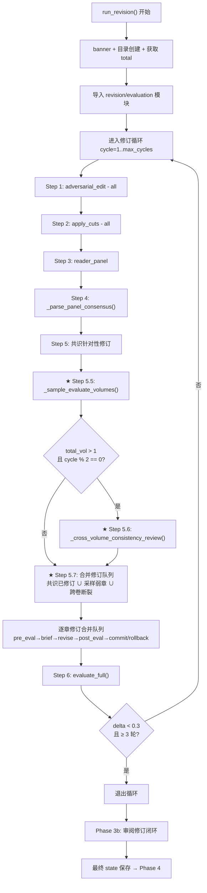

# Step 8 实施方案：Phase 3 删除 Elo + 采样评估 + 跨卷一致性审阅

> 基于 [plan_D_layered_outline_incremental_canon.md](plans/plan_D_layered_outline_incremental_canon.md) Step 8  
> 版本：v1.0  
> 日期：2026-06-19  
> 前置依赖：  
>   [Step 7](plans/step7_implementation_plan.md) ✅ — [`pipeline_orchestrator.py`](pipeline_orchestrator.py:57) `run_foundation()` 和 `run_drafting()` 已改造完成

---

## 一、目标

修改 [`pipeline_orchestrator.py`](pipeline_orchestrator.py:424) 的 `run_revision()` 函数，完成 plan_D Step 8 的全部任务：

| # | 改造项 | 说明 |
|---|--------|------|
| 1 | **删除 Elo 锦标赛全部代码** | `_elo_target_weaks()` + Elo 调用 + Elo 底部章节修订循环 |
| 2 | **新增采样评估** | 替代 Elo：每卷随机采样 5 章调用 `evaluate_chapter()`，找出弱章 |
| 3 | **新增跨卷一致性审阅** | 每两轮一次：用 `call_judge()` 检查卷边界连续性，标记断裂章节 |
| 4 | **统一修订循环** | 共识问题 + 采样弱章 + 跨卷断裂章 → 合并修订队列 |

---

## 二、涉及文件

| 文件 | 操作 | 说明 |
|------|------|------|
| [`pipeline_orchestrator.py`](pipeline_orchestrator.py:424) | **修改** | `run_revision()`：删除 Elo + 新增采样/跨卷审阅 |

**共 1 个文件修改，0 个新文件。**

---

## 三、当前代码分析

### 3.1 Phase 3 — `run_revision()` 当前流程（Step 7 完成后）

```
run_revision() 主循环 (cycle 1..max_cycles):
  Step 1: run_adversarial_edit("all")       → 对抗性编辑全部章节
  Step 2: run_apply_cuts("all")              → 机械裁剪全部章节
  Step 3: run_reader_panel()                 → 读者评审团
  Step 4: _parse_panel_consensus()           → 解析共识问题
  Step 5: 针对共识问题逐章修订                → gen_brief → revise → evaluate
  Step 5.5: ★ run_compare_chapters() +       → Elo 锦标赛（待删除）
             _elo_target_weaks() +           → Elo 底部章节解析（待删除）
             Elo 底部章节修订循环             → Elo 驱动修订（待删除）
  Step 6: evaluate_full()                    → 全文评估
  Step 7: 平台期检测                          → delta < 0.3 且 ≥ 3 轮 → 停止
  
Phase 3b: _run_review_revision_loop()
  → 深度审阅 → 解析弱章节 → auto brief → 修订 → evaluate → apply_cuts
```

### 3.2 待删除代码块

| 代码块 | 位置（行号） | 说明 |
|--------|-------------|------|
| `_elo_target_weaks()` 函数定义 | [447–479](pipeline_orchestrator.py:447) | 嵌套函数，解析 `tournament_results.json` |
| Elo 锦标赛调用 | [570–577](pipeline_orchestrator.py:570) | `run_compare_chapters()` + try/except |
| `elo_targets` 变量及赋值 | [579–583](pipeline_orchestrator.py:579) | `_elo_target_weaks(skip_chapters=revised_in_cycle)` |
| Elo 底部章节修订循环 | [587–662](pipeline_orchestrator.py:587) | `for ch_num in elo_targets:` 整套 pre_eval→brief→revise→post_eval→commit/rollback |
| `revised_in_cycle` 变量 | [580](pipeline_orchestrator.py:580) | 仅在 Elo 逻辑中使用 |

**共约 215 行待删除。**

### 3.3 关键上下文说明

- Step 7 完全未动 `run_revision()` — 确认无需合并冲突
- `evaluate_chapter(ch_num, retries=2, max_total_time=600)` — [`evaluation/evaluate.py:324`](evaluation/evaluate.py:324) 原函数
- `evaluate_full(max_total_time=600)` — [`evaluation/evaluate.py:378`](evaluation/evaluate.py:378) 原函数
- `call_judge(prompt, system=..., max_tokens=...)` — [`core/api_client.py`](core/api_client.py:83) 现有函数（可回退到 P3 配置）
- `config.chapter_threshold` — 默认 6.0，已存在于 `core/config.py`

---

## 四、改造后架构

```mermaid
flowchart TD
    subgraph P3_NEW["Phase 3: run_revision() 改造后（单轮循环）"]
        AE["Step 1: adversarial_edit - all"]
        CUT["Step 2: apply_cuts - all"]
        PANEL["Step 3: reader_panel"]
        CONSENSUS["Step 4-5: 解析共识 + 针对性修订"]
        SAMPLE["★ Step 5.5: _sample_evaluate_volumes()<br/>每卷随机5章 → 找弱章"]
        CROSS{"cycle % 2 == 0?"}
        CROSS_REVIEW["★ Step 5.6: _cross_volume_consistency_review()<br/>检查卷边界连续性 → 标记断裂章"]
        MERGE["★ Step 5.7: 合并修订队列<br/>共识 + 弱章 + 断裂章，去重 ≤10"]
        REVISE["逐章修订: pre_eval → brief → revise → post_eval → commit/rollback"]
        FULL["Step 6: evaluate_full()"]
        PLATEAU["Step 7: 平台期检测"]
        
        AE --> CUT --> PANEL --> CONSENSUS --> SAMPLE
        SAMPLE --> CROSS
        CROSS -->|"是"| CROSS_REVIEW --> MERGE
        CROSS -->|"否"| MERGE
        MERGE --> REVISE --> FULL --> PLATEAU
    end
```



**Phase 3b（审阅修订闭环）完全不动。**

---

## 五、详细修改

### 5.1 改动 A：删除 Elo 全部代码

**删除范围**：`run_revision()` 内部，[行 447–479](pipeline_orchestrator.py:447) + [行 570–662](pipeline_orchestrator.py:570) + [行 580](pipeline_orchestrator.py:580)

#### 5.1.1 删除 `_elo_target_weaks()` 嵌套函数（行 447–479）

```python
# 【删除全部】从 def _elo_target_weaks(skip_chapters...) 到函数末尾 return targets
```

#### 5.1.2 删除 Elo 锦标赛调用（行 570–577）

当前代码：
```python
        # Step 5.5: Elo 锦标赛 + 底部章节修订
        step("运行 Elo 章节锦标赛 ...")
        try:
            from revision.compare_chapters import run_compare_chapters
            run_compare_chapters(max_tokens=max_tokens)
            step("Elo 锦标赛 完成 ✓")
        except Exception as e:
            step(f"Elo 锦标赛跳过: {e}")
```

**全部删除**。

#### 5.1.3 删除 `revised_in_cycle` + `elo_targets` + Elo 修订循环（行 579–662）

当前代码：
```python
        # 获取已修订章节集合（共识驱动修订过的）
        revised_in_cycle = {item["chapter"] for item in consensus_items}

        # 解析 Elo 底部章节
        elo_targets = _elo_target_weaks(skip_chapters=revised_in_cycle, max_targets=3)
        if elo_targets:
            step(f"Elo 底部章节: {elo_targets}")

        for ch_num in elo_targets:
            # ... 整套 pre_eval → brief → revise → post_eval → commit/rollback ...
```

**全部删除**（共约 83 行）。

---

### 5.2 改动 B：新增采样评估函数 `_sample_evaluate_volumes()`

**插入位置**：删除 Elo 代码后，在原位置（Step 5 共识修订之后、Step 6 evaluate_full 之前）插入。

#### 5.2.1 函数签名与逻辑

```python
    def _sample_evaluate_volumes(
        total_ch: int,
        ch_per_vol: int,
        total_vol: int,
        threshold: float,
        sample_size: int = 5,
    ) -> list:
        """每卷随机采样章节做全文评估，返回评分低于阈值的弱章列表。

        从每卷中随机选至多 sample_size 章，调用 evaluate_chapter()（原函数），
        收集所有评分 < threshold 的章节，按评分升序返回至多 10 章。
        """
        import random

        weak_chapters: list[tuple[int, float]] = []

        for vol in range(1, total_vol + 1):
            start_ch = (vol - 1) * ch_per_vol + 1
            end_ch = min(vol * ch_per_vol, total_ch)
            population = list(range(start_ch, end_ch + 1))
            sample = random.sample(
                population,
                min(sample_size, len(population)),
            )

            for ch in sample:
                try:
                    eval_result = evaluate_chapter(ch, retries=2, max_total_time=600)
                    score = parse_score(eval_result, "overall_score")
                    step(f"  采样评估 第 {ch} 章 (卷 {vol}): {score}")
                    if score < threshold:
                        weak_chapters.append((ch, score))
                except Exception as e:
                    step(f"  采样评估 第 {ch} 章 跳过: {e}")

        # 按评分升序，取前 10
        weak_chapters.sort(key=lambda x: x[1])
        return [ch for ch, _ in weak_chapters[:10]]
```

#### 5.2.2 设计要点

| 要点 | 说明 |
|------|------|
| **评估函数** | `evaluate_chapter()` — 100% 复用原函数，签名不变 |
| **采样逻辑** | `random.sample()` — 标准库，无外部依赖 |
| **异常安全** | 每章独立 try/except — 单章评估失败不影响其他采样 |
| **排序规则** | 按评分升序（最弱优先），最多返回 10 章 |
| **阈值** | 复用 `config.chapter_threshold`（默认 6.0），与 Phase 2 一致 |
| **卷感知** | 按 `total_vol × ch_per_vol` 计算每卷章节范围 |


### 5.3 改动 C：新增跨卷一致性审阅函数 `_cross_volume_consistency_review()`

**插入位置**：与 `_sample_evaluate_volumes()` 同级，在 `run_revision()` 函数体内定义。

#### 5.3.1 函数签名与逻辑

```python
    def _cross_volume_consistency_review(
        total_ch: int,
        ch_per_vol: int,
        total_vol: int,
    ) -> list[int]:
        """用大上下文模型检查卷间连接点的连续性。

        提取每卷首尾各 3000 字，拼接 canon 前 5000 字作为参考，
        调用 call_judge() 检测角色状态/伏笔/设定的断裂点。
        返回疑似断裂的章节编号列表（去重）。
        """
        cfg = config
        cfg.load()

        # 提取每卷边界文本
        segments: list[str] = []
        for vol in range(1, total_vol + 1):
            last_ch = vol * ch_per_vol
            first_ch_next = last_ch + 1

            # 卷 vol 终章尾部
            last_path = CHAPTERS_DIR / f"ch_{last_ch:02d}.md"
            if last_path.exists():
                text = last_path.read_text(encoding="utf-8")
                tail = text[-3000:] if len(text) > 3000 else text
                segments.append(
                    f"【卷 {vol} 终章（第 {last_ch} 章）尾 3000 字】\n{tail}"
                )

            # 卷 vol+1 首章头部（若存在）
            if first_ch_next <= total_ch:
                next_path = CHAPTERS_DIR / f"ch_{first_ch_next:02d}.md"
                if next_path.exists():
                    text = next_path.read_text(encoding="utf-8")
                    head = text[:3000] if len(text) > 3000 else text
                    segments.append(
                        f"【卷 {vol + 1} 首章（第 {first_ch_next} 章）头 3000 字】\n{head}"
                    )

        if len(segments) < 2:
            step("跨卷一致性审阅: 章节不足，跳过")
            return []

        # 加载 canon 参考
        canon_text = ""
        canon_path = OUTPUT_DIR / "canon.md"
        if canon_path.exists():
            full = canon_path.read_text(encoding="utf-8")
            canon_text = full[:5000] if len(full) > 5000 else full

        # 构建 prompt
        prompt_parts = [
            "请检查以下卷间连接点的连续性：",
            "",
            "\n\n".join(segments),
            "",
        ]
        if canon_text:
            prompt_parts.extend([
                "【正典参考】",
                canon_text,
                "",
            ])
        prompt_parts.extend([
            "请检查：",
            "1. 角色状态是否一致（位置、持有物品、当前目标、情绪状态）",
            "2. 伏笔线索是否断裂（前卷末埋设 → 后卷首是否承接）",
            "3. 世界观设定是否漂移",
            "",
            "输出格式：",
            "断裂章节: [章节编号列表，用逗号分隔]",
            "如无断裂: 「无」",
        ])
        prompt = "\n".join(prompt_parts)

        try:
            result = call_judge(prompt, max_tokens=1000)
        except Exception as e:
            step(f"跨卷一致性审阅调用失败: {e}")
            return []

        # 解析章节编号
        if "无" in result and "断裂" not in result:
            step("跨卷一致性审阅: ✓ 未检测到断裂")
            return []

        chs = re.findall(r'\d+', result)
        broken = sorted(set(int(c) for c in chs if 1 <= int(c) <= total_ch))
        if broken:
            step(f"跨卷一致性审阅: ⚠ 疑似断裂章节: {broken}")
        else:
            step("跨卷一致性审阅: ✓ 未检测到断裂")
        return broken
```

#### 5.3.2 设计要点

| 要点 | 说明 |
|------|------|
| **调用模型** | `call_judge()` — 现有裁判模型路由（自动回退 P3 配置） |
| **不产生评分** | 审阅只标记断裂章节，不产出数值评分 |
| **触发频率** | 每 2 轮一次（`if cycle % 2 == 0`） |
| **边界文本提取** | 卷末章尾 3000 字 + 卷首章头 3000 字 |
| **canon 参考** | 仅取前 5000 字，控制 prompt 长度 |
| **解析鲁棒性** | 正反两种模式匹配 — "无"（无断裂）vs 数字提取 |
| **异常安全** | API 调用失败返回空列表，不阻塞流水线 |


### 5.4 改动 D：合并修订队列 + 统一修订循环

**插入位置**：在采样评估和跨卷审阅之后、evaluate_full 之前。

#### 5.4.1 完整替换代码

删除 Elo 代码块后，在 Step 5（共识修订）之后插入以下代码：

```python
        # ★ 方案 D Step 8: 采样评估（替代 Elo 锦标赛）
        step("采样评估 — 每卷随机 5 章 ...")
        total_vol = cfg.total_volumes if cfg.loaded else 1
        ch_per_vol = cfg.chapters_per_volume if cfg.loaded else (
            total // max(1, total_vol)
        )
        sample_weaks = _sample_evaluate_volumes(
            total, ch_per_vol, total_vol, threshold,
        )
        if sample_weaks:
            step(f"采样弱章: {sample_weaks}")

        # ★ 方案 D Step 8: 跨卷一致性审阅（每两轮一次）
        cross_broken: list[int] = []
        if total_vol > 1 and cycle % 2 == 0:
            step("跨卷一致性审阅 — 检查卷边界连续性 ...")
            cross_broken = _cross_volume_consistency_review(
                total, ch_per_vol, total_vol,
            )

        # ★ 合并修订队列：共识 + 采样弱章 + 跨卷断裂章
        revised_in_cycle = {item["chapter"] for item in consensus_items}
        combined_targets: dict[int, str] = {}
        # 共识问题（已修订，跳过 — 仅用于去重）
        # 采样弱章（不在共识已修订集合中）
        for ch_num in sample_weaks:
            if ch_num not in revised_in_cycle:
                combined_targets.setdefault(ch_num, "采样弱章")
        # 跨卷断裂章（不在前两类中）
        for ch_num in cross_broken:
            combined_targets.setdefault(ch_num, "跨卷断裂")

        if combined_targets:
            step(f"合并修订队列: {len(combined_targets)} 章 — "
                 f"{list(combined_targets.keys())}")
        else:
            step("无额外修订目标")

        # 逐章修订合并队列（最多 10 章，按章节号排序）
        for idx_ch, (ch_num, reason) in enumerate(
            sorted(combined_targets.items())[:10]
        ):
            ch_file = CHAPTERS_DIR / f"ch_{ch_num:02d}.md"
            if not ch_file.exists():
                step(f"第 {ch_num} 章不存在，跳过")
                continue

            banner(
                f"  修订 第 {ch_num} 章 ({reason}) "
                f"[{idx_ch + 1}/{min(len(combined_targets), 10)}]",
                ".",
            )

            # 修订前评估（重试 2 次，总超时 600s）
            try:
                pre_eval = evaluate_chapter(ch_num, retries=2, max_total_time=600)
                pre_score = parse_score(pre_eval, "overall_score")
            except Exception:
                pre_score = 0

            step(f"第 {ch_num} 章 修订前评分: {pre_score}")

            # 生成修订摘要（--auto 模式，三源交叉引用）
            brief_file = BRIEFS_DIR / f"ch{ch_num:02d}_sample_cycle{cycle}.md"
            try:
                ch, brief_text = build_auto_brief()
                if ch is None:
                    ch = ch_num
                brief_file.write_text(brief_text, encoding="utf-8")
                if not brief_text.strip():
                    raise ValueError("空摘要")
            except Exception:
                brief_content = (
                    f"# 修订摘要: 第 {ch_num} 章\n\n"
                    f"## 来源: {reason}（循环 {cycle}）\n\n"
                    f"本章被识别为需要改进的目标。"
                    f"原因: {reason}。请基于评估意见和审阅反馈提升品质。\n"
                )
                brief_file.write_text(brief_content, encoding="utf-8")

            # 执行修订（重试 2 次，总超时 1200s）
            step(
                f"按摘要修订第 {ch_num} 章 "
                f"(retries=2, 总超时=1200s) ..."
            )
            try:
                revise_chapter(
                    ch_num, brief_file, max_tokens=max_tokens,
                    retries=2, max_total_time=1200,
                )
            except Exception as e:
                step(f"修订第 {ch_num} 章失败: {e}")
                continue

            # 修订后评估
            try:
                post_eval = evaluate_chapter(ch_num, retries=2, max_total_time=600)
                post_score = parse_score(post_eval, "overall_score")
            except Exception:
                post_score = 0

            word_count = (
                len(ch_file.read_text(encoding="utf-8")
                     .replace(" ", "").replace("\n", ""))
            )

            step(f"第 {ch_num} 章: {pre_score} -> {post_score}")

            # 提交或回退
            if post_score >= pre_score:
                commit_hash = git_add_commit(
                    f"修订 循环{cycle}: ch{ch_num:02d} "
                    f"({reason}) {pre_score}->{post_score}"
                )
                log_result(
                    commit_hash, f"rev-ch{ch_num:02d}", post_score,
                    word_count, "keep",
                    f"循环 {cycle}: {reason} 改进 {pre_score}->{post_score}",
                )
                step(
                    f"修订 第 {ch_num} 章 完成 ✓ "
                    f"({pre_score} -> {post_score})"
                )
            else:
                step(f"修订使评分下降 ({post_score} < {pre_score})，回退")
                git_reset_hard("HEAD")
                log_result(
                    "reverted", f"rev-ch{ch_num:02d}", post_score,
                    word_count, "discard",
                    f"循环 {cycle}: {reason} 倒退 {pre_score}->{post_score}",
                )
```

#### 5.4.2 设计要点

| 要点 | 说明 |
|------|------|
| **去重逻辑** | 共识已修订章节优先跳过；采样弱章和跨卷断裂章用 `dict.setdefault()` 去重 |
| **数量上限** | 合并队列最多 10 章 — 与 Elo 原有 `max_targets=3` + 共识 `≤5` 的总量一致 |
| **排序** | 按章节号升序，确保修订顺序可预测 |
| **修订流程** | 复用现有 Elo 修订模式：`pre_eval → build_auto_brief → revise → post_eval → commit/rollback` |
| **异常安全** | 每章独立 try/except，单章修订失败不阻塞队列中后续章节 |
| **`revised_in_cycle`** | 保留变量定义，用于跳过共识已修订章节 |


### 5.5 改动 E：主循环中调用新增函数

在 `run_revision()` 主循环体内，需要新增以下局部变量（在 `for cycle in range(...)` 之后、Step 1 之前）：

```python
    # ★ 方案 D Step 8: 提取卷级配置（供采样评估和跨卷审阅使用）
    total = get_total_chapters(state)  # 已存在，确认可复用
```

**注意**：`total` 变量已存在于 `run_drafting()` 中，但在 `run_revision()` 中**不存在**。当前 `run_revision()` 没有 `total` 局部变量。需要新增：

```python
    total = get_total_chapters(state)
```

插入位置：在 [行 438](pipeline_orchestrator.py:438) `max_tokens` 赋值之后。

---

## 六、改动不涉及的部分（确认清单）

以下现有逻辑完全不动：

| 区域 | 行号（改造后） | 说明 |
|------|---------------|------|
| `run_revision()` 函数签名 + banner | 424–438 | 不变 |
| 模块导入 | 440–445 | 不变（`evaluate_chapter`、`evaluate_full`、`build_auto_brief`、`revise_chapter` 均已导入） |
| Step 1: adversarial_edit | 484–487 | 不变 |
| Step 2: apply_cuts | 489–494 | 不变 |
| Step 3: reader_panel | 496–499 | 不变 |
| Step 4: parse consensus | 501–511 | 不变 |
| Step 5: 共识针对性修订 | 513–568 | 不变 |
| Step 6: evaluate_full | 664–670 | 不变（行号因删除 Elo 代码上移） |
| Step 7: 平台期检测 | 685–691 | 不变 |
| Phase 3b: `_parse_review_weak_chapters()` | 697–747 | **完全不动** |
| Phase 3b: `_run_review_revision_loop()` | 749–933 | **完全不动** |
| Phase 3b 执行调用 | 934–939 | **完全不动** |
| 最终 state 保存 | 941–947 | **完全不动** |
| Phase 4 (`run_export`) | 954–1000 | **完全不动** |
| `run_pipeline()` 主编排器 | 1007–1098 | **完全不动** |

---

## 七、Phase 3 完整执行顺序（改造后）



---

## 八、依赖确认

| 依赖项 | 位置 | 状态 | Step 8 用途 |
|--------|------|------|-------------|
| `evaluate_chapter(ch_num, retries, max_total_time)` | [`evaluation/evaluate.py:324`](evaluation/evaluate.py:324) | ✅ 原函数 | 采样评估单章评分 |
| `evaluate_full(max_total_time)` | [`evaluation/evaluate.py:378`](evaluation/evaluate.py:378) | ✅ 原函数 | 全文评估（Step 6，不动） |
| `call_judge(prompt, max_tokens)` | [`core/api_client.py:83`](core/api_client.py:83) | ✅ 原函数 | 跨卷一致性审阅 |
| `parse_score(result, key)` | [`core/state_manager.py`](core/state_manager.py) | ✅ 原函数 | 解析评估结果 |
| `get_total_chapters(state)` | [`core/state_manager.py`](core/state_manager.py) | ✅ 原函数 | 获取 `total` 局部变量 |
| `config.chapter_threshold` | [`core/config.py`](core/config.py) | ✅ Step 1 | 采样评估弱章阈值 |
| `config.total_volumes` | [`core/config.py:210`](core/config.py:210) | ✅ Step 1 | 采样和跨卷审阅的卷遍历 |
| `config.chapters_per_volume` | [`core/config.py:215`](core/config.py:215) | ✅ Step 1 | 每卷章节范围计算 |
| `build_auto_brief()` | [`revision/gen_brief.py`](revision/gen_brief.py) | ✅ 原函数 | 合并队列修订摘要生成 |
| `revise_chapter()` | [`revision/gen_revision.py`](revision/gen_revision.py) | ✅ 原函数 | 合并队列修订执行 |
| `revision.compare_chapters` | [`revision/compare_chapters.py:23`](revision/compare_chapters.py:23) | ⚠ 保留文件不删 | 不再被 pipeline 调用 |
| `_parse_review_weak_chapters()` | [`pipeline_orchestrator.py:697`](pipeline_orchestrator.py:697) | ✅ 原函数 | Phase 3b 不变 |
| `_run_review_revision_loop()` | [`pipeline_orchestrator.py:749`](pipeline_orchestrator.py:749) | ✅ 原函数 | Phase 3b 不变 |

---

## 九、兼容性分析

| 场景 | 兼容性 |
|------|--------|
| `total_volumes=1`（单卷模式） | ✅ 跨卷审阅自动跳过（`total_vol > 1` 条件）；采样评估正常工作（从全部章节中采样） |
| `total_volumes=0` 或未配置 | ✅ 回退 `total_vol=1, ch_per_vol=total` — 采样评估从全部章节采样 |
| 章节数 < 每卷采样数 | ✅ `random.sample(population, min(sample_size, len(population)))` 自动调整 |
| 章节文件缺失（部分章未起草） | ✅ `ch_file.exists()` 检查跳过；`random.sample` 从 population 中取（population 是数字范围，不依赖文件存在） |
| 跨卷审阅 prompt 超过 16000 token | ✅ canon 限 5000 字，每个边界段限 3000 字；31 卷 × 2 段 × 3000 = 186000 字过大会导致问题。**保护**：只取 vol→vol+1 边界文本，段数 = 2 × (total_vol - 1)；对 31 卷会过大，应在 prompt 构建中加入总长度检查 |
| API 超时/失败 | ✅ 采样评估每章独立 try/except；跨卷审阅整体 try/except，失败返回空列表 |
| 中断恢复 — `revision_cycle=N` | ✅ 恢复后从 N+1 继续；跨卷审阅按 `cycle % 2 == 0` 决定是否触发 |
| 中断恢复 — 部分章节已修订 | ✅ `revised_in_cycle` 从 consensus_items 计算（重新解析 reader_panel.json）；合并队列只包含新识别章节 |
| 旧版 state.json 无 vol 字段 | ✅ `config.total_volumes` 和 `config.chapters_per_volume` 来自 .env/配置，不依赖 state |
| `get_total_chapters(state)` 未在 `run_revision()` 中使用 | ⚠ **需要新增** `total = get_total_chapters(state)` 局部变量（当前 `run_revision()` 中不存在） |
| `import random` 未在文件顶部 | ⚠ **需要新增** — 当前 [`pipeline_orchestrator.py`](pipeline_orchestrator.py:13) 顶部无 `import random` |

---

## 十、大规模卷数场景的跨卷审阅保护

对于 31 卷（30 个边界 × 2 段 × 3000 字 ≈ 180000 字），prompt 可能过大。新增保护逻辑：

在 `_cross_volume_consistency_review()` 的 prompt 构建阶段加入：

```python
        # 保护：如果总段数过多（> 10 段），只检查后半部分的卷边界
        MAX_SEGMENTS = 10
        if len(segments) > MAX_SEGMENTS:
            step(f"跨卷审阅: 卷数过多 ({total_vol})，仅检查后 {MAX_SEGMENTS // 2} 个边界")
            segments = segments[-MAX_SEGMENTS:]
```

**或者在调用侧限制**：仅当 `total_vol ≤ 5` 时触发跨卷审阅。考虑到 plan_D 的典型配置是 3–10 卷（30–100 章），`total_vol ≤ 10` 的边界段数是 `2 × 9 = 18` 段 × 3000 = 54000 字，仍在合理范围内。对更大的卷数（31 卷），改为只检查最后 5 个边界。

**最终决策**：在 `run_revision()` 调用侧加入检查 — 若 `total_vol > 10`，跨卷审阅只检查后 5 个边界（通过 `_cross_volume_consistency_review` 的新参数 `max_boundaries` 控制）。

简化处理：直接在 `_cross_volume_consistency_review()` 内部限制 segments 数量。

---

## 十一、验证清单

| # | 验证项 | 方法 |
|---|--------|------|
| 1 | Elo 相关代码全部删除 | `grep -n "elo\|Elo\|_elo_target\|run_compare_chapters\|tournament_results" pipeline_orchestrator.py` 无结果 |
| 2 | `_sample_evaluate_volumes()` 正确定义在 `run_revision()` 内 | 检查嵌套函数定义位置 |
| 3 | `_cross_volume_consistency_review()` 正确定义在 `run_revision()` 内 | 同上 |
| 4 | 采样评估使用 `evaluate_chapter()` 原函数 | 检查调用签名与 [`evaluation/evaluate.py:324`](evaluation/evaluate.py:324) 一致 |
| 5 | 跨卷审阅使用 `call_judge()` | 检查调用签名 |
| 6 | 合并队列去重正确 | 共识章节不会重复出现在采样/跨卷队列中 |
| 7 | 修订循环复用现有 `build_auto_brief` + `revise_chapter` 模式 | 检查修订代码结构与原 Elo 修订一致 |
| 8 | Step 6 evaluate_full 未被误删 | 确认 `evaluate_full(max_total_time=600)` 仍在 Step 5.7 之后 |
| 9 | Phase 3b 审阅修订闭环完全不动 | 确认 `_parse_review_weak_chapters()` 和 `_run_review_revision_loop()` 代码不变 |
| 10 | `total_volumes=1` 时不触发跨卷审阅 | 条件 `total_vol > 1 and cycle % 2 == 0` |
| 11 | `import random` 已存在或被新增 | 文件顶部 import 区域检查 |
| 12 | `get_total_chapters(state)` 在 `run_revision` 中可用 | 局部变量 `total` 已定义 |

---

## 十二、文件变更摘要

```
M  pipeline_orchestrator.py  — run_revision():
                                - 删除 _elo_target_weaks() 嵌套函数（约33行）
                                - 删除 Elo 锦标赛调用块（约8行）
                                - 删除 Elo 底部章节修订循环（约83行）
                                + 新增 _sample_evaluate_volumes() 嵌套函数（约35行）
                                + 新增 _cross_volume_consistency_review() 嵌套函数（约80行）
                                + 新增合并修订队列 + 统一修订循环（约100行）
                                + 新增 total = get_total_chapters(state) 局部变量
                                + 顶部新增 import random
```

**总计：1 个文件修改，0 个新文件。净增约 95 行（删除约 124 行，新增约 219 行）。**

---

## 十三、后续步骤依赖

Step 8 完成后，接下来的步骤：

| 步骤 | 内容 | 依赖 Step 8 |
|------|------|------------|
| **Step 9** | evaluate.py 大纲加载卷感知适配 | 无直接依赖（evaluate.py 独立修改） |
| **Step 10** | 端到端测试（1 卷 → 多卷） | 依赖 Step 1-9 全部完成 |

---

## 十四、与 Step 7 的协调确认

| 协调点 | 状态 |
|--------|------|
| Step 7 未修改 `run_revision()` | ✅ 确认 — Step 7 仅改 `run_foundation()` 和 `run_drafting()` |
| Step 7 的 `canon_entry_count` / `canon_last_updated_ch` | ✅ Phase 3 不使用这些字段（Phase 2 统计用） |
| Step 7 的增量 canon 追加 | ✅ Phase 3 修订后的章节不触发 canon 更新（设计决策：修订不改设定） |
| `revision/compare_chapters.py` 保留不删 | ✅ 文件保留，仅 pipeline 不再调用 |