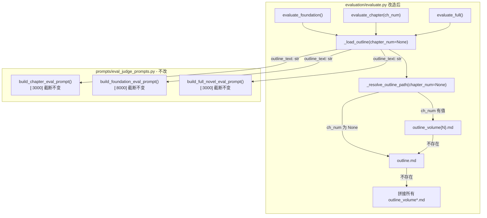

# Step 9 实施方案：evaluate.py 大纲加载卷感知适配

> 基于 [plan_D_layered_outline_incremental_canon.md](plans/plan_D_layered_outline_incremental_canon.md) Step 9  
> 版本：v1.0  
> 日期：2026-06-19  
> 前置依赖：  
>   [Step 5](plans/step5_implementation_plan.md) ✅ — [`foundation/gen_outline.py`](foundation/gen_outline.py:280) 已生成 `outline_volume{N}.md` + 合并版 `outline.md`

---

## 一、目标

修改 [`evaluation/evaluate.py`](evaluation/evaluate.py:324) 的三个评估函数，将大纲加载从「硬编码 `outline.md`」改为「卷感知加载」。

| 函数 | 当前行为 | 改造后 |
|------|---------|--------|
| [`evaluate_chapter(ch_num)`](evaluation/evaluate.py:324) | 始终加载 `outline.md` 全文 | 优先加载对应卷的 `outline_volume{N}.md`，回退 `outline.md` |
| [`evaluate_foundation()`](evaluation/evaluate.py:278) | 始终加载 `outline.md` | 优先 `outline.md`（合并版），不存在则合并所有 `outline_volume*.md` |
| [`evaluate_full()`](evaluation/evaluate.py:378) | 始终加载 `outline.md` | 同 `evaluate_foundation`：优先合并版，回退自动合并 |

**核心原则**：不修改任何评估 prompt 构建器（[`prompts/eval_judge_prompts.py`](prompts/eval_judge_prompts.py:254) 不改动），只改「从哪里加载大纲数据」。Judge 看到的内容语义不变，但更聚焦（章节评估只看本卷大纲，而非全书 30 卷）。

---

## 二、涉及文件

| 文件 | 操作 | 说明 |
|------|------|------|
| [`evaluation/evaluate.py`](evaluation/evaluate.py:1) | **修改** | 新增 `_resolve_outline_path()` 工具函数 + 修改 `evaluate_chapter()` / `evaluate_foundation()` / `evaluate_full()` |

**共 1 个文件修改。0 个新文件。**

---

## 三、当前代码分析

### 3.1 `evaluate_chapter(ch_num)` — 当前大纲加载

```python
# [evaluation/evaluate.py:349]
outline_path = OUTPUT_DIR / "outline.md"
outline = outline_path.read_text(encoding="utf-8") if outline_path.exists() else ""
```

**问题**：对于 31 卷的小说，`outline.md` 包含全部 310 章的大纲条目（约 30 万字符）。Judge 拿到的是 `[:3000]` 截断（由 [`build_chapter_eval_prompt`](prompts/eval_judge_prompts.py:279) 完成），这 3000 字符大概率不包含当前章的大纲段落——截断发生在全书大纲的头部，对应的是第 1 卷开篇章节。

**改造价值**：加载单卷大纲（10 章 × ~3200 token ≈ 32000 字符），`[:3000]` 截断后的内容大概率命中本卷第 1 章附近。即使不命中，Judge 也能在更小范围内搜索章节标记（`第{ch_num}章`），给出更精准的"本章是否兑现大纲"判断。

### 3.2 `evaluate_foundation()` — 当前大纲加载

```python
# [evaluation/evaluate.py:290]
outline_path = OUTPUT_DIR / "outline.md"
outline = outline_path.read_text(encoding="utf-8") if outline_path.exists() else ""
```

**当前行为**：加载合并版 `outline.md` → 传入 [`build_foundation_eval_prompt`](prompts/eval_judge_prompts.py:104) → 被截断到 `[:8000]`。

**问题**：Step 5 的 [`generate_outline()`](foundation/gen_outline.py:245) 在逐卷生成后合并写入 `outline.md`，所以正常情况下 `outline.md` 存在且完整。但如果在异常流程中（如 Phase 1 只跑了一半），`outline.md` 可能不存在而 `outline_volume*.md` 已生成——此时需要自动 fallback。

### 3.3 `evaluate_full()` — 当前大纲加载

```python
# [evaluation/evaluate.py:393]
outline_path = OUTPUT_DIR / "outline.md"
outline = outline_path.read_text(encoding="utf-8") if outline_path.exists() else ""
```

同 `evaluate_foundation`，传入 [`build_full_novel_eval_prompt`](prompts/eval_judge_prompts.py:469) 被截断到 `[:3000]`。

### 3.4 为什么 `prompts/eval_judge_prompts.py` 不需要改

三个 prompt 构建器（[`build_foundation_eval_prompt`](prompts/eval_judge_prompts.py:77)、[`build_chapter_eval_prompt`](prompts/eval_judge_prompts.py:254)、[`build_full_novel_eval_prompt`](prompts/eval_judge_prompts.py:420)）的签名只接受 `outline_text: str` 字符串参数。它们不关心这个字符串来自哪个文件、也不做任何文件 I/O。只要 `evaluate.py` 传入正确的内容，prompt 构建器就正常工作。

**plan_D 已明确标记**：[`prompts/eval_judge_prompts.py`](prompts/eval_judge_prompts.py:77) — **不修改**。

---

## 四、设计决策

### 4.1 统一工具函数 `_resolve_outline(chapter_num=None) -> str`

提供一个单一入口，三个评估函数都调用它获取大纲文本。参数化区分章节级 vs 全局级加载。

```
_resolve_outline(chapter_num=None)
  │
  ├─ chapter_num 有值 ──→ 尝试 outline_volume{N}.md ──→ 不存在 → outline.md
  │                                                       │
  │                                                       └─ 也不存在 → _merge_all_volumes()
  │
  └─ chapter_num 为 None ──→ 尝试 outline.md ──→ 不存在 → _merge_all_volumes()
```

**`_merge_all_volumes()`**：glob `outline_volume*.md`，按卷号排序拼接。如果连一个 `outline_volume*.md` 都不存在，返回空字符串。

### 4.2 为什么不在 prompt 构建器中做卷感知

- prompt 构建器是纯函数，参数是 `outline_text: str`。在调用方（evaluate.py）做卷感知符合单一职责原则。
- 避免修改 [`prompts/eval_judge_prompts.py`](prompts/eval_judge_prompts.py:254) 的签名（会连锁影响所有调用方和测试）。
- 与 [`drafting/draft_chapter.py`](drafting/draft_chapter.py:34) 的 [`extract_chapter_outline()`](drafting/draft_chapter.py:34) 模式一致——大纲选择逻辑在调用方，不在 prompt 构建器。

### 4.3 `evaluate_chapter` 用卷级大纲的实际效果

| 场景 | 当前（outline.md 全文） | 改造后（outline_volume{N}.md） |
|------|----------------------|-------------------------------|
| 31 卷 310 章 | `[:3000]` 几乎总是第 1 卷内容 | `[:3000]` 大概率包含本卷第 1 章附近 |
| 1 卷 10 章 | `[:3000]` 可能包含当前章 | `[:3000]` 同样包含（无退化） |
| chapter_outline 是空字符串 | Judge 跳过本章大纲检查 | Judge 跳过本章大纲检查（不变） |

**关键**：`[:3000]` 截断在 prompt 构建器内部完成——无论传入的是 30 万字符还是 3 万字符，Judge 看到的都是前 3000 字符。卷级大纲让这 3000 字符更可能「有用」。

### 4.4 `evaluate_foundation` 和 `evaluate_full` 保持使用合并版

这两个函数评估全书的全局质量，需要的上下文是整体结构，不是单卷。所以保持使用合并版 `outline.md` 作为主路径。

---

## 五、详细修改

### 5.1 新增：工具函数 `_resolve_outline_path()` 和 `_merge_volumes()`

**插入位置**：在 [`evaluate.py`](evaluation/evaluate.py:272) 第 272 行（`slop_score_zh` 函数结束后、`evaluate_foundation` 之前）。

```python
def _resolve_outline_path(chapter_num: int | None = None) -> tuple[Path | None, str]:
    """卷感知大纲路径解析。

    为评估函数提供正确的大纲文件路径：
    — chapter_num 有值 → 优先 outline_volume{N}.md → 回退 outline.md
    — chapter_num 为 None → 优先 outline.md → 回退合并所有 outline_volume*.md

    Returns:
        (path, label): path 为 None 表示无任何大纲文件；label 供日志使用。
    """
    if chapter_num is not None:
        cfg = config
        cfg.load()
        ch_per_vol = cfg.chapters_per_volume
        vol_num = (chapter_num - 1) // max(ch_per_vol, 1) + 1

        vol_path = OUTPUT_DIR / f"outline_volume{vol_num}.md"
        if vol_path.exists():
            return (vol_path, f"outline_volume{vol_num}.md（第 {vol_num} 卷章级大纲）")

        # 回退到合并版
        fallback = OUTPUT_DIR / "outline.md"
        if fallback.exists():
            return (fallback, "outline.md（回退：卷级大纲未找到）")

        return (None, "")

    # 全局评估：优先合并版
    merged = OUTPUT_DIR / "outline.md"
    if merged.exists():
        return (merged, "outline.md（合并版）")

    # 回退：手动合并所有卷级大纲
    vol_files = sorted(OUTPUT_DIR.glob("outline_volume*.md"))
    if vol_files:
        return (None, f"outline_volume*.md × {len(vol_files)}（回退：合并版未找到）")

    return (None, "")


def _load_outline(chapter_num: int | None = None) -> str:
    """加载大纲文本（卷感知）。

    Args:
        chapter_num: 章节编号。有值时优先加载对应卷的大纲；None 时加载全局大纲。

    Returns:
        大纲文本字符串。无任何大纲文件时返回空字符串。
    """
    path, _label = _resolve_outline_path(chapter_num)
    if path is not None:
        return path.read_text(encoding="utf-8")

    # 回退合并模式：拼接所有 outline_volume*.md
    vol_files = sorted(OUTPUT_DIR.glob("outline_volume*.md"))
    if vol_files:
        parts = []
        for vf in vol_files:
            parts.append(vf.read_text(encoding="utf-8"))
        return "\n\n".join(parts)

    return ""
```

**设计要点**：

- `_resolve_outline_path` 返回 `(Path | None, label)` —— 路径为 `None` 表示需要手动合并 `outline_volume*.md`。这样避免在「合并版存在时」仍然拼接文件。
- `_load_outline` 是三个评估函数的直接调用入口，封装了路径检查和手动合并逻辑。
- `config.load()` 在 `_resolve_outline_path` 内调用以确保读取最新配置（与现有函数模式一致）。

### 5.2 修改 A：`evaluate_foundation()` 大纲加载

**当前代码**（[行 290–291](evaluation/evaluate.py:290)）：

```python
    outline_path = OUTPUT_DIR / "outline.md"
    outline = outline_path.read_text(encoding="utf-8") if outline_path.exists() else ""
```

**替换为**：

```python
    outline = _load_outline()  # 优先 outline.md（合并版），回退自动合并所有 outline_volume*.md
```

**影响分析**：
- 正常流程：Step 5 的 [`generate_outline()`](foundation/gen_outline.py:245) 已写入合并版 `outline.md`，行为完全不变。
- 异常流程：如果 `outline.md` 不存在但 `outline_volume*.md` 存在（如仅跑了部分卷），自动拼接——不会因缺少 `outline.md` 而导致评估传入空字符串。

### 5.3 修改 B：`evaluate_chapter(ch_num)` 大纲加载

**当前代码**（[行 349–350](evaluation/evaluate.py:349)）：

```python
    outline_path = OUTPUT_DIR / "outline.md"
    outline = outline_path.read_text(encoding="utf-8") if outline_path.exists() else ""
```

**替换为**：

```python
    outline = _load_outline(chapter_num=ch_num)  # 优先 outline_volume{N}.md → 回退 outline.md
```

**影响分析**：
- 正常流程：加载 `outline_volume{N}.md`（10 章大纲 × ~3200 token/章 ≈ 32000 字符），传入 [`build_chapter_eval_prompt`](prompts/eval_judge_prompts.py:279) 后截断 `[:3000]`。Judge 在前 3000 字符中更高的概率看到当前章的大纲条目。
- 回退流程：`outline_volume{N}.md` 不存在 → 加载 `outline.md`（行为与改造前完全相同）。
- 双向回退：两者都不存在 → `_load_outline` 尝试拼接 `outline_volume*.md`，最终返回空字符串（Judge 跳过本章大纲检查）。

**prompt 构建器侧无需改动**：[`build_chapter_eval_prompt`](prompts/eval_judge_prompts.py:254) 在第 274–283 行做 `chapter_outline[:3000]` 截断和章节标记搜索——逻辑完全不变。

### 5.4 修改 C：`evaluate_full()` 大纲加载

**当前代码**（[行 393–394](evaluation/evaluate.py:393)）：

```python
    outline_path = OUTPUT_DIR / "outline.md"
    outline = outline_path.read_text(encoding="utf-8") if outline_path.exists() else ""
```

**替换为**：

```python
    outline = _load_outline()  # 同 evaluate_foundation：优先合并版，回退自动拼接
```

**影响分析**：与 [`evaluate_foundation()`](evaluation/evaluate.py:278) 完全相同的模式。传入 [`build_full_novel_eval_prompt`](prompts/eval_judge_prompts.py:469) 后截断到 `[:3000]`。

### 5.5 三个函数修改后的完整 diff 预览

#### `evaluate_foundation()` — 仅改 2 行

```diff
     # ... line 278-289 不变 ...

-    outline_path = OUTPUT_DIR / "outline.md"
-    outline = outline_path.read_text(encoding="utf-8") if outline_path.exists() else ""
+    outline = _load_outline()  # 卷感知：优先 outline.md，回退合并所有 outline_volume*.md

     canon = canon_path.read_text(encoding="utf-8") if canon_path.exists() else ""
     # ... 其余不变 ...
```

#### `evaluate_chapter()` — 仅改 2 行

```diff
     # ... line 324-348 不变 ...

-    outline_path = OUTPUT_DIR / "outline.md"
-    outline = outline_path.read_text(encoding="utf-8") if outline_path.exists() else ""
+    outline = _load_outline(chapter_num=ch_num)  # 卷感知：优先 outline_volume{N}.md

     voice_path = OUTPUT_DIR / "voice.md"
     # ... 其余不变 ...
```

#### `evaluate_full()` — 仅改 2 行

```diff
     # ... line 378-392 不变 ...

-    outline_path = OUTPUT_DIR / "outline.md"
-    outline = outline_path.read_text(encoding="utf-8") if outline_path.exists() else ""
+    outline = _load_outline()  # 卷感知：优先 outline.md，回退合并所有 outline_volume*.md

     voice_path = OUTPUT_DIR / "voice.md"
     # ... 其余不变 ...
```

**总计修改量：约 6 行替换 + 约 50 行新增（2 个工具函数），零删除。**

### 5.6 不修改的文件

| 文件 | 原因 |
|------|------|
| [`prompts/eval_judge_prompts.py`](prompts/eval_judge_prompts.py:77) | prompt 构建器是纯函数，不关心输入来源。plan_D 已标记「不修改」。 |
| [`pipeline_orchestrator.py`](pipeline_orchestrator.py:57) | `run_foundation()` 和 `run_drafting()` 调用 `evaluate_chapter()` / `evaluate_foundation()` / `evaluate_full()` 不改签名，无需适配。 |
| [`foundation/gen_outline.py`](foundation/gen_outline.py:280) | Step 5 已完成，无需改动。 |

---

## 六、改造后架构



---

## 七、边缘情况处理

| 边缘情况 | 行为 |
|----------|------|
| 所有 outline 文件都不存在 | `_load_outline()` 返回 `""` → prompt 构建器的 `if chapter_outline:` 为 False → Judge 跳过本章大纲检查 |
| `outline_volume{N}.md` 存在但 `outline.md` 不存在 | `evaluate_chapter` 正常加载卷级大纲；`evaluate_foundation` 自动拼接所有 `outline_volume*.md` |
| `chapters_per_volume` 为 0（未配置） | `_resolve_outline_path` 中使用 `max(ch_per_vol, 1)` 防止除零；卷号计算回退到 1 |
| 章节编号超出范围（如 ch_num=500） | `vol_num = 500 // 10 + 1 = 51` → `outline_volume51.md` 不存在 → 回退 `outline.md` → 再不存在 → 拼接所有 volume 文件 |
| 单卷小说（`total_volumes = 1`） | `outline_volume1.md` 被优先加载，`outline.md` 作为回退。两者内容等价（Step 5 合并写入），无退化。 |

---

## 八、验证方案

### 8.1 单元级验证

```python
# 在 evaluate.py 所在目录运行
cd evaluation

# 测试 1：_load_outline 基本功能
python -c "
from evaluate import _load_outline
# 章节级
o = _load_outline(chapter_num=5)
print(f'Chapter 5 outline: {len(o)} chars, starts with: {o[:100]}')
# 全局级
o2 = _load_outline()
print(f'Global outline: {len(o2)} chars')
"

# 测试 2：回退链路
# 删除 outline.md → 确认自动拼接 outline_volume*.md
# 删除所有 outline 文件 → 确认返回空字符串
```

### 8.2 集成验证

```bash
# 1. 用现有 state.json 运行评估
python evaluation/evaluate.py --chapter=5
python evaluation/evaluate.py --phase=foundation
python evaluation/evaluate.py --full

# 2. 对比改造前后评分
# 预期：evaluate_chapter 评分保持不变或略有提升
#      （因为 Judge 看到的是更聚焦的本卷大纲）
#      evaluate_foundation / evaluate_full 评分应完全不变
#      （合并版 outline.md 内容不变，Judge 输入不变）
```

### 8.3 异常路径验证

```bash
# 模拟 outline.md 缺失
mv output/outline.md output/outline.md.bak
python evaluation/evaluate.py --chapter=5  # 应回退到 outline_volume1.md
python evaluation/evaluate.py --phase=foundation  # 应自动拼接 outline_volume*.md
mv output/outline.md.bak output/outline.md

# 模拟全部 outline 缺失
mkdir -p /tmp/outline_backup && mv output/outline*.md /tmp/outline_backup/
python evaluation/evaluate.py --chapter=5  # 应安静降级，不崩溃
mv /tmp/outline_backup/outline*.md output/
```

---

## 九、与前后步骤的关系

| 步骤 | 关系 |
|------|------|
| [Step 5](plans/step5_implementation_plan.md) | **前置依赖**：`outline_volume{N}.md` 和 `outline.md` 由 Step 5 生成 |
| [Step 6](plans/step6_implementation_plan.md) | **平行改造**：Step 6 已对 [`draft_chapter.py`](drafting/draft_chapter.py:34) 做了相同的卷感知适配（`extract_chapter_outline`），本步骤对 evaluate.py 做相同模式 |
| [Step 7](plans/step7_implementation_plan.md) | **不影响**：Step 7 的 `run_foundation()` 和 `run_drafting()` 调用评估函数，参数签名不变 |
| [Step 8](plans/step8_implementation_plan.md) | **不影响**：Step 8 的采样评估调用 `evaluate_chapter()`，参数签名不变 |
| [Step 10](plans/plan_D_layered_outline_incremental_canon.md:697) | **为端到端测试准备**：保证评估函数正确消费分层大纲 |

---

## 十、总结

| 维度 | 值 |
|------|-----|
| 修改文件数 | 1（`evaluation/evaluate.py`） |
| 新增函数 | 2（`_resolve_outline_path` + `_load_outline`） |
| 修改函数 | 3（`evaluate_foundation` / `evaluate_chapter` / `evaluate_full`） |
| 每函数改动行数 | 2 行替换 |
| 不修改的文件 | [`prompts/eval_judge_prompts.py`](prompts/eval_judge_prompts.py:77)、[`pipeline_orchestrator.py`](pipeline_orchestrator.py:57) |
| 核心收益 | 章节评估的 Judge 看到更聚焦的本卷大纲（而非全书 31 卷的 `[:3000]` 截断头部），提升大纲一致性检查的精准度 |
| 退化风险 | 零——所有回退链路保持改造前行为一致 |